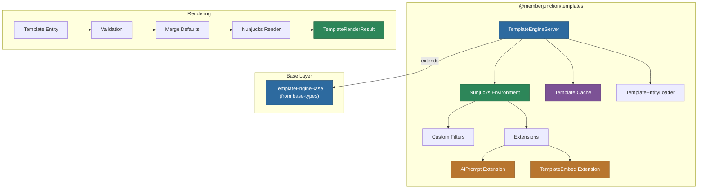
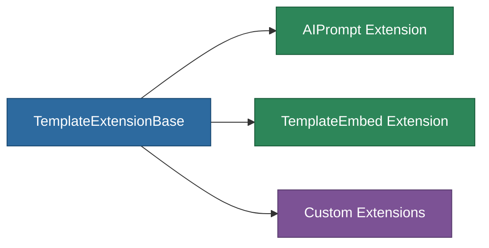

# @memberjunction/templates

Server-side template rendering engine for MemberJunction, built on Nunjucks. Extends `TemplateEngineBase` with rendering capabilities, custom filters, and MJ-specific extensions for AI prompt integration and recursive template embedding.

## Architecture



## Overview

This package is the **server-side rendering engine** for MemberJunction templates. It is NOT used within Angular applications despite using Angular Universal internally for compilation.

**Key capabilities:**

- **Nunjucks Rendering**: Full Nunjucks template syntax with async support
- **Parameter Validation**: Validates input data against template parameter definitions before rendering
- **Default Value Merging**: Automatically applies parameter defaults with content-specific overrides
- **Template Caching**: Compiled Nunjucks templates are cached for performance
- **Custom Filters**: `json`, `jsoninline`, and `jsonparse` filters for JSON manipulation
- **Extensible**: Plugin system via `TemplateExtensionBase` for custom Nunjucks tags
- **AI Prompt Extension**: Execute AI prompts inline within templates
- **Template Embedding**: Recursively embed templates within other templates

## Installation

```bash
npm install @memberjunction/templates
```

## Usage

### Rendering Templates

```typescript
import { TemplateEngineServer } from '@memberjunction/templates';

const engine = TemplateEngineServer.Instance;
await engine.Config(false, contextUser);

// Find and render a template
const template = engine.FindTemplate('Welcome Email');
const content = template.Content[0]; // First content variant

const result = await engine.RenderTemplate(template, content, {
    userName: 'John Doe',
    companyName: 'Acme Corp'
});

if (result.Success) {
    console.log(result.Output); // Rendered HTML/text
} else {
    console.error(result.Message); // Validation or rendering error
}
```

### Simple Template Rendering

For ad-hoc templates not stored in the database:

```typescript
const result = await engine.RenderTemplateSimple(
    'Hello {{ name }}, welcome to {{ company }}!',
    { name: 'Jane', company: 'MemberJunction' }
);
// result.Output: "Hello Jane, welcome to MemberJunction!"
```

### Custom Nunjucks Filters

The engine provides built-in filters for JSON operations:

```nunjucks
{# Convert object to formatted JSON #}
{{ userData | json }}

{# Compact JSON output #}
{{ userData | jsoninline }}

{# Parse a JSON string back to object #}

```

### Template Extensions

Extensions are registered via the MJ class factory:



- **AIPrompt Extension**: Executes AI prompts inline within templates using `` tags
- **TemplateEmbed Extension**: Embeds other templates within a template using `` tags

## API Reference

### TemplateEngineServer

| Member | Type | Description |
|--------|------|-------------|
| `Instance` | static getter | Singleton instance |
| `Config()` | method | Load metadata and initialize Nunjucks environment |
| `RenderTemplate()` | method | Render a stored template with validation |
| `RenderTemplateSimple()` | method | Render an ad-hoc template string |
| `AddTemplate()` | method | Add a template to the Nunjucks loader |
| `SetupNunjucks()` | method | Re-initialize the Nunjucks environment |
| `ClearTemplateCache()` | method | Clear cached compiled templates |

### Rendering Process

1. **Validation**: Input data is validated against template parameter definitions
2. **Default Merging**: Missing parameters receive default values (content-specific defaults override global defaults)
3. **Compilation**: Template text is compiled by Nunjucks (cached after first compile)
4. **Rendering**: Nunjucks processes the template with merged data
5. **Result**: Returns `TemplateRenderResult` with `Success`, `Output`, and optional `Message`

## Dependencies

| Package | Purpose |
|---------|---------|
| `@memberjunction/templates-base-types` | Base engine and result types |
| `@memberjunction/core` | UserInfo, logging utilities |
| `@memberjunction/core-entities` | Template entity types |
| `@memberjunction/global` | Class factory for extensions |
| `@memberjunction/ai` | AI integration for prompts |
| `@memberjunction/ai-core-plus` | AI core utilities |
| `nunjucks` | Template rendering engine |

## License

ISC
