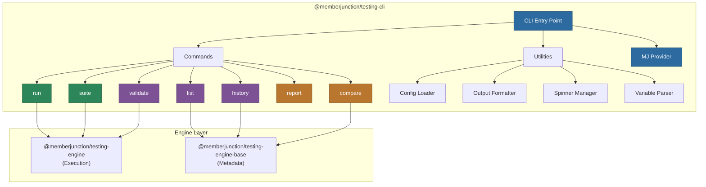

# @memberjunction/testing-cli

Command-line interface for the MemberJunction Testing Framework. Provides commands for running tests, managing suites, viewing history, comparing runs, generating reports, and validating configurations.

## Architecture



## Overview

This package provides the CLI layer on top of the MemberJunction Testing Engine. It is designed to be used both standalone and as an integrated part of the `mj test` command group in the MemberJunction CLI.

**Available commands:**

| Command | Description |
|---------|-------------|
| `run` | Execute a single test by ID or name |
| `suite` | Execute a test suite with parallel/sequential control |
| `list` | List available tests, suites, and types |
| `history` | View execution history for tests or suites |
| `compare` | Compare results across multiple test runs |
| `report` | Generate execution reports |
| `validate` | Validate test or suite configurations without executing |

## Installation

```bash
npm install @memberjunction/testing-cli
```

## Commands

### run -- Execute a Test

```bash
# Run by test name
mj test run --name "Agent Summarization Test"

# Run by test ID
mj test run --id "test-guid"

# With variables
mj test run --name "My Test" --var AIConfiguration=gpt-4o --var Temperature=0.3

# Verbose output
mj test run --name "My Test" --verbose

# Dry run (validate only)
mj test run --name "My Test" --dry-run
```

### suite -- Execute a Suite

```bash
# Run a suite
mj test suite --name "Regression Suite"

# Parallel execution
mj test suite --name "Suite" --parallel --max-parallel 5

# Stop on first failure
mj test suite --name "Suite" --fail-fast

# Run specific sequence range
mj test suite --name "Suite" --sequence-start 3 --sequence-end 7
```

### list -- List Tests and Suites

```bash
# List all tests
mj test list

# List test suites
mj test list --suites

# List test types
mj test list --types
```

### history -- View History

```bash
# View test run history
mj test history --name "My Test"

# View suite run history
mj test history --suite "My Suite"
```

### compare -- Compare Runs

```bash
# Compare two test runs
mj test compare --run1 "run-id-1" --run2 "run-id-2"
```

### validate -- Validate Configuration

```bash
# Validate a test
mj test validate --name "My Test"

# Validate a suite
mj test validate --suite "My Suite"
```

## Configuration

The CLI uses `cosmiconfig` to load configuration from:

- `.mjtestrc`
- `.mjtestrc.json`
- `mj.config.cjs` (in the `testing` section)

Configuration includes database connection settings for the MJ Provider.

## Utilities

| Utility | Description |
|---------|-------------|
| `ConfigLoader` | Loads CLI configuration via cosmiconfig |
| `OutputFormatter` | Formats test results for terminal display with chalk |
| `SpinnerManager` | Manages ora spinners for long-running operations |
| `VariableParser` | Parses `--var key=value` CLI arguments into typed variables |
| `MJProvider` | Initializes the MemberJunction SQL Server data provider |

## Dependencies

| Package | Purpose |
|---------|---------|
| `@memberjunction/testing-engine` | Test execution engine |
| `@memberjunction/testing-engine-base` | Metadata and types |
| `@memberjunction/core` | Core MJ functionality |
| `@memberjunction/core-entities` | Entity types |
| `@memberjunction/sqlserver-dataprovider` | Database connectivity |
| `@oclif/core` | CLI framework |
| `chalk` | Terminal styling |
| `ora-classic` | Terminal spinners |
| `cosmiconfig` | Configuration loading |

## License

ISC
