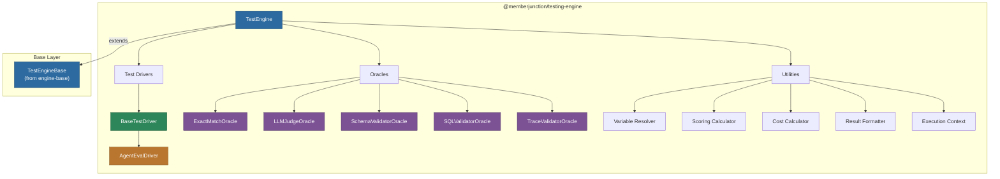
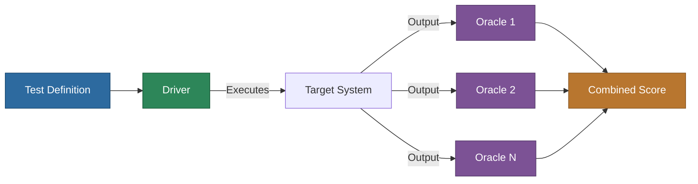

# @memberjunction/testing-engine

Core test execution and evaluation engine for the MemberJunction Testing Framework. Provides the driver/oracle architecture for running tests, evaluating results with multiple oracle strategies, and recording outcomes.

## Architecture



## Overview

This is the **server-side execution engine** for MemberJunction tests. It implements a plugin-based architecture where:

- **Drivers** handle test execution (running agents, calling APIs, etc.)
- **Oracles** evaluate test outputs against expected outcomes
- **Utilities** handle variable resolution, scoring, cost tracking, and result formatting

**Key capabilities:**

- Execute individual tests or full test suites with parallel/sequential modes
- Multiple oracle strategies for evaluating test results
- Variable resolution system with priority cascading (run > suite > test > type)
- Automatic cost and duration tracking
- Progress callbacks for real-time execution monitoring
- Result persistence to `MJ: Test Runs` and `MJ: Test Suite Runs` entities

## Installation

```bash
npm install @memberjunction/testing-engine
```

## Core Concepts

### Driver/Oracle Pattern



1. The **driver** executes the test target (e.g., runs an AI agent)
2. Multiple **oracles** independently evaluate the output
3. Scores are combined using configurable weights

### Test Drivers

| Driver | Description |
|--------|-------------|
| `BaseTestDriver` | Abstract base class for all test drivers |
| `AgentEvalDriver` | Executes AI agents and captures their outputs |

### Oracles

| Oracle | Description |
|--------|-------------|
| `ExactMatchOracle` | Compares output against an expected string |
| `LLMJudgeOracle` | Uses an LLM to evaluate output quality with rubrics |
| `SchemaValidatorOracle` | Validates output against a JSON schema |
| `SQLValidatorOracle` | Validates output by running SQL queries |
| `TraceValidatorOracle` | Validates execution trace/steps of an agent run |

### Variable Resolution

Variables cascade through four levels with the highest priority winning:

```
Run Variables > Suite Variables > Test Variables > Type Variables
```

The resolver tracks the source of each resolved value for auditing.

## Usage

### Running a Single Test

```typescript
import { TestEngine } from '@memberjunction/testing-engine';

const engine = TestEngine.Instance;
await engine.Config(false, contextUser);

const result = await engine.RunTest(testId, contextUser, {
    verbose: true,
    variables: { AIConfiguration: 'gpt-4o' },
    progressCallback: (p) => console.log(`${p.percentage}%: ${p.message}`)
});

console.log(`Status: ${result.status}, Score: ${result.score}`);
```

### Running a Test Suite

```typescript
const suiteResult = await engine.RunSuite(suiteId, contextUser, {
    parallel: true,
    maxParallel: 5,
    failFast: false,
    variables: { Temperature: 0.3 }
});

console.log(`Passed: ${suiteResult.passedTests}/${suiteResult.totalTests}`);
console.log(`Average Score: ${suiteResult.averageScore}`);
```

## Utilities

| Utility | Description |
|---------|-------------|
| `variable-resolver` | Resolves variables through the priority cascade |
| `scoring` | Combines oracle scores using weighted averages |
| `cost-calculator` | Tracks and sums execution costs |
| `result-formatter` | Formats test results for storage and display |
| `execution-context` | Captures environment details (OS, Node.js version, CI/CD info) |

## Testing

```bash
npm test
npm run test:coverage
```

## Dependencies

| Package | Purpose |
|---------|---------|
| `@memberjunction/testing-engine-base` | Base engine, metadata caching, shared types |
| `@memberjunction/ai` | AI model access for LLM oracles |
| `@memberjunction/ai-agents` | Agent execution for AgentEvalDriver |
| `@memberjunction/ai-prompts` | Prompt execution |
| `@memberjunction/core` | Metadata, RunView, UserInfo |
| `@memberjunction/core-entities` | Test entity types |
| `@memberjunction/global` | Class factory |
| `zod` | Schema validation |
| `rxjs` | Observable patterns |

## License

ISC
