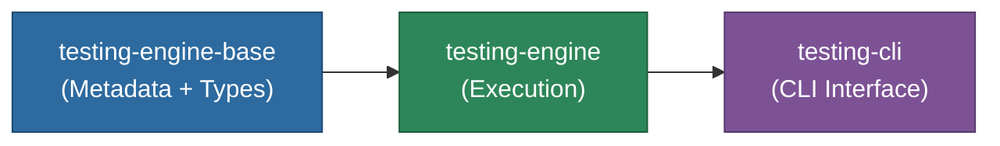

# @memberjunction/testing-engine-base

Base engine for MemberJunction's testing framework. Provides metadata caching for test types, tests, suites, rubrics, and shared type definitions. UI-safe -- contains no execution logic.

## Architecture

```mermaid
graph TD
    subgraph "@memberjunction/testing-engine-base"
        A[TestEngineBase] --> B[Test Types Cache]
        A --> C[Tests Cache]
        A --> D[Test Suites Cache]
        A --> E[Test Rubrics Cache]
        A --> F[Suite Tests Cache]
        G[Types Module] --> H[TestRunOptions]
        G --> I[SuiteRunOptions]
        G --> J[TestRunResult]
        G --> K[TestSuiteRunResult]
        G --> L[Variable System Types]
    end

    subgraph "Data Sources"
        M["MJ: Test Types"]
        N["MJ: Tests"]
        O["MJ: Test Suites"]
        P["MJ: Test Rubrics"]
        Q["MJ: Test Suite Tests"]
    end

    M --> B
    N --> C
    O --> D
    P --> E
    Q --> F

    style A fill:#2d6a9f,stroke:#1a4971,color:#fff
    style B fill:#2d8659,stroke:#1a5c3a,color:#fff
    style C fill:#2d8659,stroke:#1a5c3a,color:#fff
    style D fill:#2d8659,stroke:#1a5c3a,color:#fff
    style E fill:#7c5295,stroke:#563a6b,color:#fff
    style G fill:#b8762f,stroke:#8a5722,color:#fff
```



## Overview

This package serves two purposes:

1. **Metadata Caching**: `TestEngineBase` is a singleton engine that loads and caches all testing metadata, providing fast lookups by ID, name, type, and tag
2. **Shared Types**: Comprehensive type definitions for test execution, results, variables, and configuration used across the entire testing stack

**Key capabilities:**

- Cached access to test types, tests, suites, rubrics, and suite-test associations
- Lookup methods by ID, name, type, and tag
- Active-only filtering for tests and suites
- Suite test sequencing with proper sort order
- Complete type system for test execution, results, validation, and variables
- Progress and logging callback interfaces for real-time execution updates

## Installation

```bash
npm install @memberjunction/testing-engine-base
```

## Usage

### Loading Metadata

```typescript
import { TestEngineBase } from '@memberjunction/testing-engine-base';

const engine = TestEngineBase.Instance;
await engine.Config(false, contextUser);
```

### Querying Tests

```typescript
// By type
const agentTests = engine.GetTestsByType(typeId);

// By tag
const regressionTests = engine.GetTestsByTag('regression');

// By name
const test = engine.GetTestByName('Agent Summarization Test');

// Active only
const activeTests = engine.GetActiveTests();
const activeSuites = engine.GetActiveTestSuites();

// Tests in a suite (sorted by sequence)
const suiteTests = engine.GetTestsForSuite(suiteId);
```

### Using Types

```typescript
import {
    TestRunOptions,
    SuiteRunOptions,
    TestRunResult,
    TestSuiteRunResult,
    OracleResult,
    TestRunVariables
} from '@memberjunction/testing-engine-base';

// Configure a test run
const options: TestRunOptions = {
    verbose: true,
    environment: 'staging',
    gitCommit: 'abc123',
    variables: { AIConfiguration: 'gpt-4o', Temperature: 0.7 },
    progressCallback: (progress) => console.log(progress.message)
};

// Suite run options add parallel/failFast controls
const suiteOptions: SuiteRunOptions = {
    ...options,
    parallel: true,
    maxParallel: 5,
    failFast: false
};
```

## Type Reference

### Core Result Types

| Type | Description |
|------|-------------|
| `TestRunResult` | Complete result from a single test execution |
| `TestSuiteRunResult` | Aggregate result from a suite execution |
| `OracleResult` | Result from an individual oracle evaluation |
| `ValidationResult` | Configuration validation result with errors/warnings |

### Execution Options

| Type | Description |
|------|-------------|
| `TestRunOptions` | Options for running a single test (verbose, dryRun, variables, etc.) |
| `SuiteRunOptions` | Options for running a suite (parallel, failFast, sequence filters) |
| `TestProgress` | Progress callback data (step, percentage, message) |
| `TestLogMessage` | Log message from test execution (level, message, metadata) |

### Variable System

| Type | Description |
|------|-------------|
| `TestTypeVariablesSchema` | Schema defining available variables for a test type |
| `TestVariableDefinition` | Single variable definition (name, dataType, valueSource, etc.) |
| `TestVariablesConfig` | Variable overrides at the test level |
| `TestSuiteVariablesConfig` | Variable values at the suite level |
| `ResolvedTestVariables` | Final resolved values with source tracking |
| `TestRunVariables` | Variable values provided at run time |

### Context Types

| Type | Description |
|------|-------------|
| `RunContextDetails` | Execution environment details (OS, Node.js, CI/CD, git info) |
| `OracleConfig` | Oracle-specific configuration properties |
| `ScoringWeights` | Weights for different oracle evaluation dimensions |

## Relationship to Other Testing Packages



## Dependencies

| Package | Purpose |
|---------|---------|
| `@memberjunction/core` | BaseEngine, UserInfo, IMetadataProvider |
| `@memberjunction/core-entities` | Test entity types |
| `@memberjunction/global` | MJGlobal utilities |
| `rxjs` | Observable patterns |
| `debug` | Debug logging |

## License

ISC
