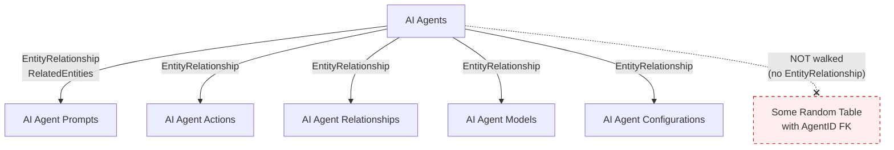
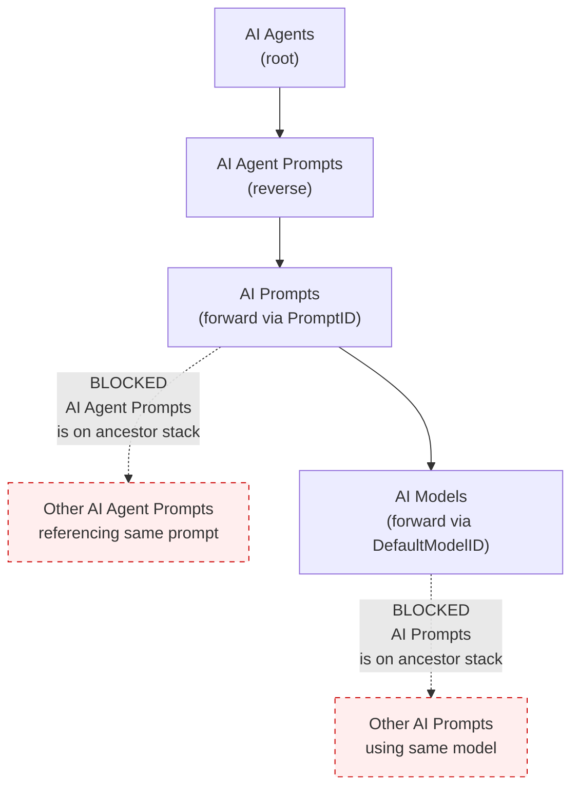
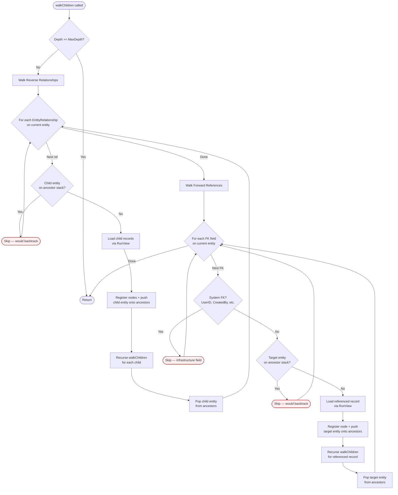
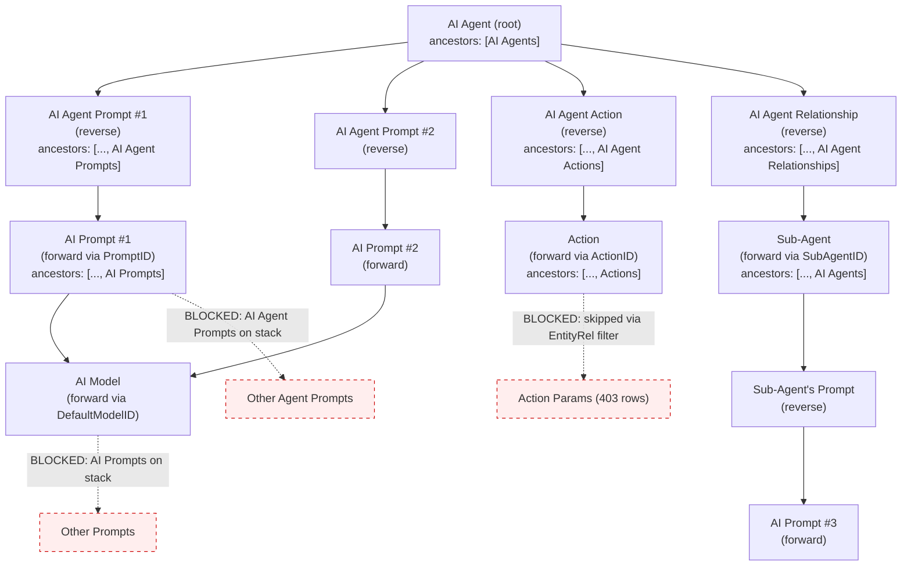
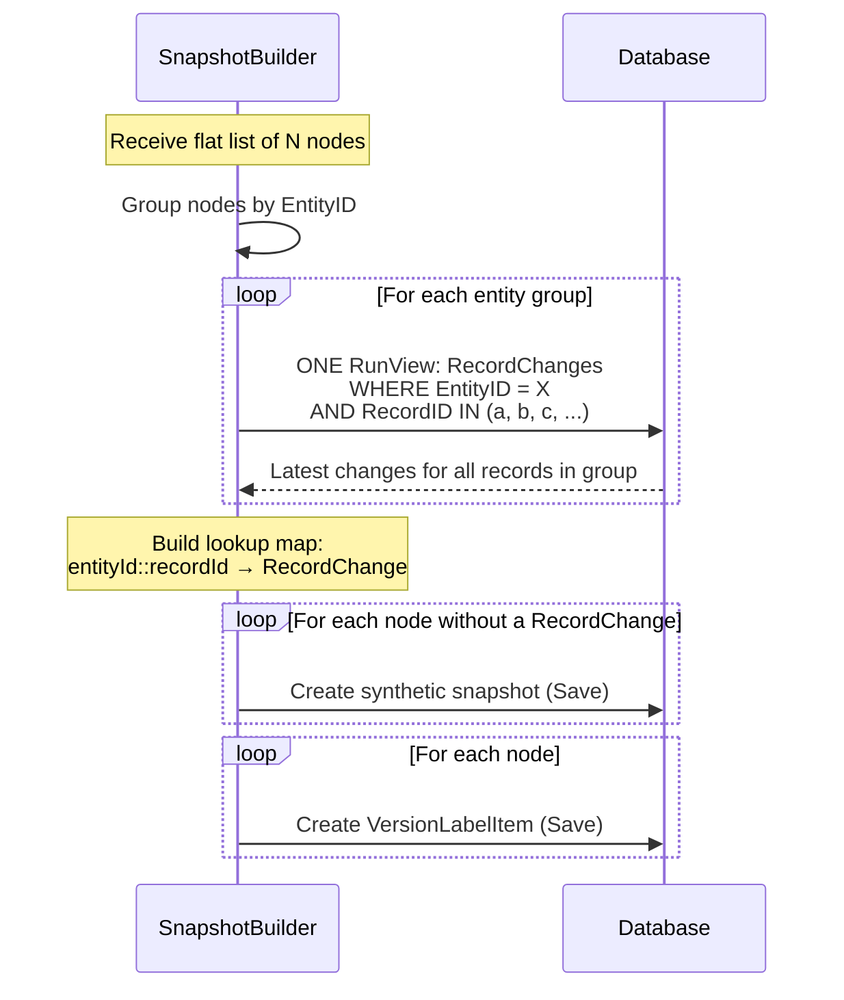

# @memberjunction/version-history

Version labeling, snapshot capture, diff, and restore for MemberJunction records.

## Architecture Overview

```
VersionHistoryEngine (facade)
├── LabelManager         — label CRUD and lifecycle
├── SnapshotBuilder      — captures record state into label items (batched)
├── DiffEngine           — compares snapshots between labels
├── RestoreEngine        — applies labeled state back to records
└── DependencyGraphWalker — traverses entity relationships
```

## Dependency Graph Walker

The walker discovers all records that should be included in a version label. It
traverses both **reverse relationships** (child records that belong to the root)
and **forward references** (records the root or its children point to).

### Two Key Mechanisms

#### 1. EntityRelationship-Driven Reverse Walking

Instead of scanning every entity in the system for foreign keys that point to the
current entity (expensive O(N*M) scan), the walker uses the
**EntityRelationship metadata** that MemberJunction already maintains.

Each entity's `RelatedEntities` array defines which child entities are
meaningful. These are auto-generated by CodeGen when FK relationships are
detected, and admins can add/remove them. This means only explicitly registered
children are walked — not every table that happens to have a matching FK.



#### 2. Ancestor Stack — Prevents Backtracking

The walker maintains a **stack of entity type names** representing the path from
root to the current node. When evaluating any relationship (reverse or forward),
if the target entity type is already on the ancestor stack, it is **skipped**.

This surgically prevents graph explosion without arbitrary depth limits:



### Walk Algorithm — Step by Step



### Concrete Example — Labeling an AI Agent

Given an AI Agent with 2 prompts, 1 action, and 1 sub-agent (via AI Agent
Relationships), the walker produces:



**Result**: ~15-25 targeted records instead of 1,363 from the naive approach.

### Why This Design

| Concern | Solution |
|---|---|
| Which children to walk? | **EntityRelationship** — admin-controlled, CodeGen-maintained |
| Preventing graph explosion? | **Ancestor stack** — blocks backtracking to any entity type on current path |
| Infrastructure FKs (UserID, etc.)? | **System FK skip list** — regex patterns for known infrastructure fields |
| Cycle detection? | **Visited set** — `entityName::recordID` prevents revisiting any record |
| Sub-agent recursion? | Ancestor stack is **path-based** — pops on backtrack, allowing re-entry from a different branch |

### Forward FK Skip Patterns

The following FK field name patterns are never followed during forward walking,
as they reference system infrastructure (Users, audit fields) rather than
business data:

- `CreatedByUserID`, `UpdatedByUserID`, `UserID`
- `ContextUserID`, `ModifiedByUserID`
- `CreatedBy`, `UpdatedBy`
- `OwnerID`, `OwnerUserID`
- `AssignedToID`, `AssignedToUserID`
- `EntityID` (polymorphic reference)

## Snapshot Builder — Batched Capture

When capturing records into a version label, the SnapshotBuilder uses **batched
queries** to minimize database round trips:



**Before batching**: N individual RunView calls (946 for a 1363-record label).
**After batching**: ~5-10 RunView calls (one per unique entity type in the graph).

## API

### VersionHistoryEngine (main facade)

```typescript
const engine = new VersionHistoryEngine();

// Create a label with dependency walking
const { Label, CaptureResult } = await engine.CreateLabel({
    Name: 'Before Refactor v2',
    Scope: 'Record',
    EntityName: 'AI Agents',
    RecordKey: agentKey,
    IncludeDependencies: true,
    MaxDepth: 10,
    ExcludeEntities: ['AI Agent Runs'],  // skip run history
}, contextUser);

// Diff against current state
const diff = await engine.DiffLabelToCurrentState(Label.ID, contextUser);

// Restore if needed
const result = await engine.RestoreToLabel(Label.ID, { DryRun: true }, contextUser);
```

### WalkOptions

| Option | Default | Description |
|---|---|---|
| `MaxDepth` | `10` | Maximum recursion depth |
| `EntityFilter` | `[]` | Only include these entities (empty = all) |
| `ExcludeEntities` | `[]` | Skip these entities entirely |
| `IncludeDeleted` | `false` | Include soft-deleted records |
