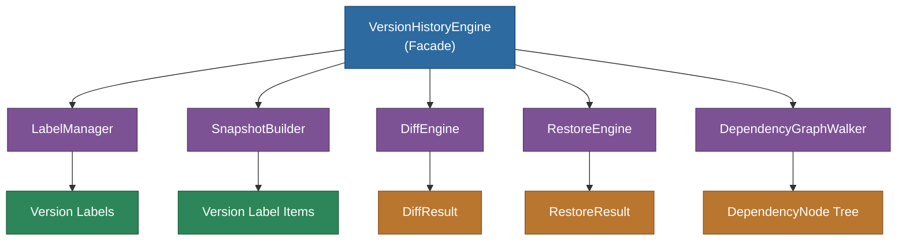
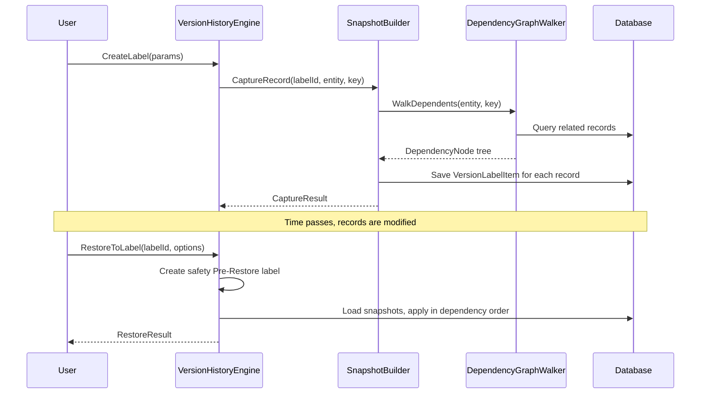
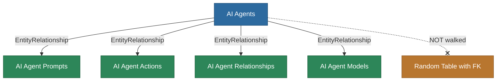
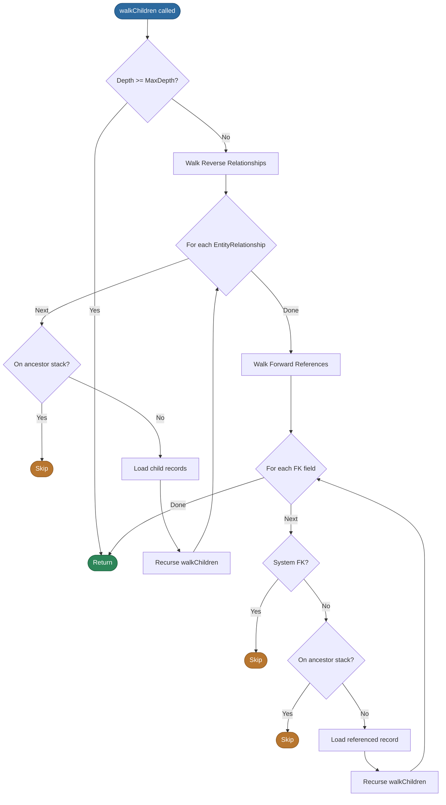
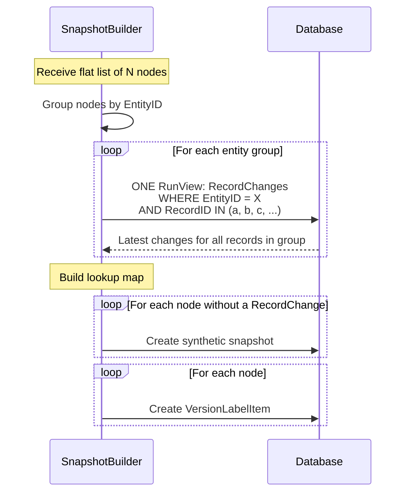

# @memberjunction/version-history

Version labeling, snapshot capture, diff, and restore for MemberJunction records. Provides point-in-time versioning with full entity dependency graph awareness.

## Overview

The `@memberjunction/version-history` package enables developers to create named version labels that capture record state at specific points in time, compare changes between labels, and restore records to previous states while respecting entity dependency ordering.



## Installation

```bash
npm install @memberjunction/version-history
```

## Quick Start

```typescript
import { VersionHistoryEngine } from '@memberjunction/version-history';

const engine = new VersionHistoryEngine();

// Create a label capturing a record and its dependencies
const { Label, CaptureResult } = await engine.CreateLabel({
  Name: 'Before Refactor',
  Scope: 'Record',
  EntityName: 'AI Prompts',
  RecordKey: promptKey,
  IncludeDependencies: true,
}, contextUser);

// Later: see what changed since the label
const diff = await engine.DiffLabelToCurrentState(Label.ID, contextUser);

// Restore if needed
const result = await engine.RestoreToLabel(Label.ID, {}, contextUser);
```

## Label Scopes

| Scope | Description | Use Case |
|-------|-------------|----------|
| `Record` | Single record and its dependencies | Safe point before editing a specific record |
| `Entity` | All records of a specific entity | Checkpoint before bulk updates |
| `System` | All tracked entities | Full system snapshot before a release |

## Architecture

### Sub-Engines

| Sub-Engine | Responsibility |
|-----------|----------------|
| **LabelManager** | Label CRUD and lifecycle management |
| **SnapshotBuilder** | Captures record state into label items with batched queries |
| **DependencyGraphWalker** | Traverses entity relationships to discover dependent records |
| **DiffEngine** | Compares snapshots between labels or between a label and current state |
| **RestoreEngine** | Applies labeled state back to records in dependency order |

### Snapshot and Restore Flow



## Dependency Graph Walker

The walker discovers all records that should be included in a version label. It traverses both **reverse relationships** (child records that belong to the root) and **forward references** (records the root or its children point to).

### Two Key Mechanisms

#### 1. EntityRelationship-Driven Reverse Walking

Instead of scanning every entity for foreign keys that point to the current entity, the walker uses **EntityRelationship metadata** that MemberJunction already maintains. Only explicitly registered children are walked.



#### 2. Ancestor Stack -- Prevents Backtracking

The walker maintains a stack of entity type names representing the path from root to the current node. When evaluating any relationship, if the target entity type is already on the ancestor stack, it is skipped. This surgically prevents graph explosion without arbitrary depth limits.

### Walk Algorithm



### Design Rationale

| Concern | Solution |
|---------|----------|
| Which children to walk? | **EntityRelationship** -- admin-controlled, CodeGen-maintained |
| Preventing graph explosion? | **Ancestor stack** -- blocks backtracking to any entity type on current path |
| Infrastructure FKs (UserID, etc.)? | **System FK skip list** -- regex patterns for known infrastructure fields |
| Cycle detection? | **Visited set** -- `entityName::recordID` prevents revisiting any record |
| Sub-agent recursion? | Ancestor stack is **path-based** -- pops on backtrack, allowing re-entry from a different branch |

### Forward FK Skip Patterns

The following FK field name patterns are never followed during forward walking, as they reference system infrastructure rather than business data:

- `CreatedByUserID`, `UpdatedByUserID`, `UserID`
- `ContextUserID`, `ModifiedByUserID`
- `CreatedBy`, `UpdatedBy`
- `OwnerID`, `OwnerUserID`
- `AssignedToID`, `AssignedToUserID`
- `EntityID` (polymorphic reference)

## Snapshot Builder -- Batched Capture

When capturing records into a version label, the SnapshotBuilder uses **batched queries** to minimize database round trips:



**Before batching**: N individual RunView calls.
**After batching**: ~5-10 RunView calls (one per unique entity type in the graph).

## API Reference

### VersionHistoryEngine

```typescript
const engine = new VersionHistoryEngine();

// Create a label with dependency walking
const { Label, CaptureResult } = await engine.CreateLabel({
    Name: 'Before Refactor v2',
    Scope: 'Record',
    EntityName: 'AI Agents',
    RecordKey: agentKey,
    IncludeDependencies: true,
    MaxDepth: 10,
    ExcludeEntities: ['AI Agent Runs'],
}, contextUser);

// Diff against current state
const diff = await engine.DiffLabelToCurrentState(Label.ID, contextUser);

// Restore if needed
const result = await engine.RestoreToLabel(Label.ID, { DryRun: true }, contextUser);
```

### WalkOptions

| Option | Default | Description |
|--------|---------|-------------|
| `MaxDepth` | `10` | Maximum recursion depth |
| `EntityFilter` | `[]` | Only include these entities (empty = all) |
| `ExcludeEntities` | `[]` | Skip these entities entirely |
| `IncludeDeleted` | `false` | Include soft-deleted records |

## Dependencies

| Package | Purpose |
|---------|---------|
| `@memberjunction/core` | Entity system, metadata, and CompositeKey |
| `@memberjunction/core-entities` | VersionLabel entity types |
| `@memberjunction/global` | Global state management |

## License

ISC
