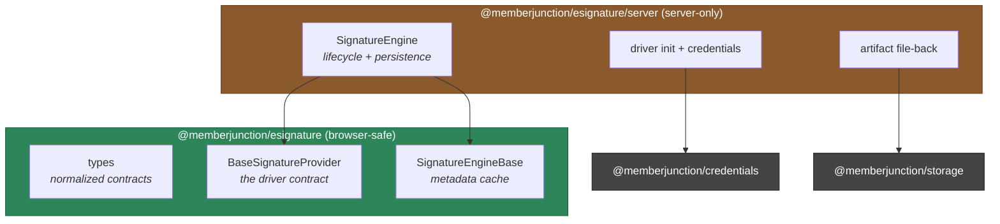
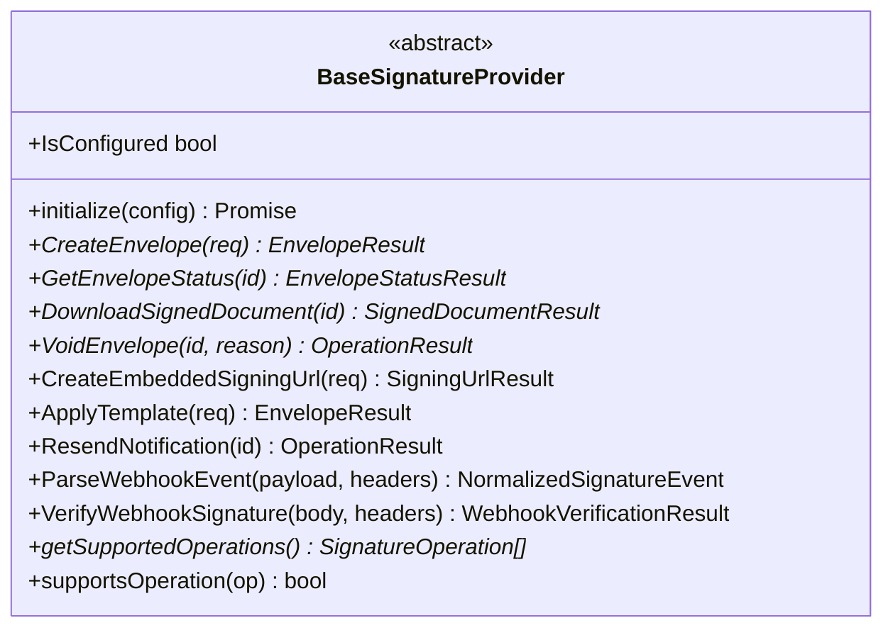
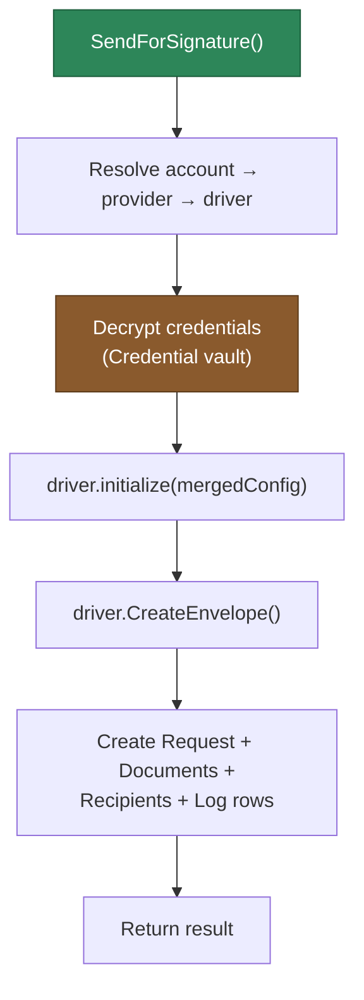
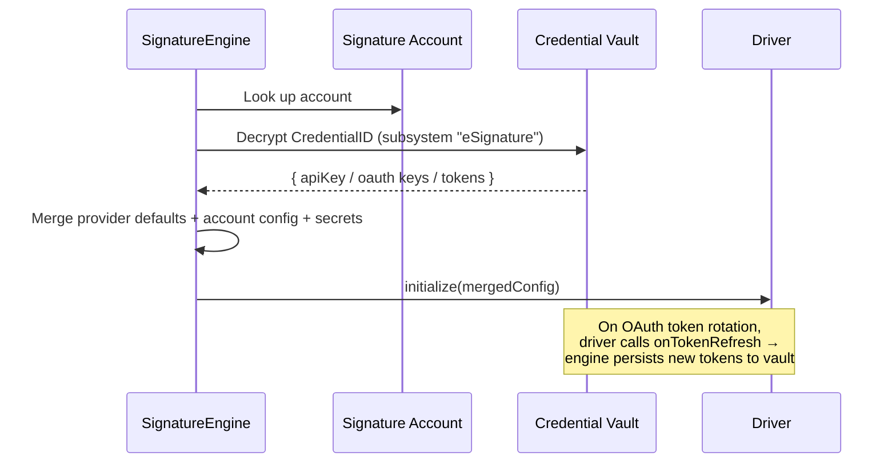
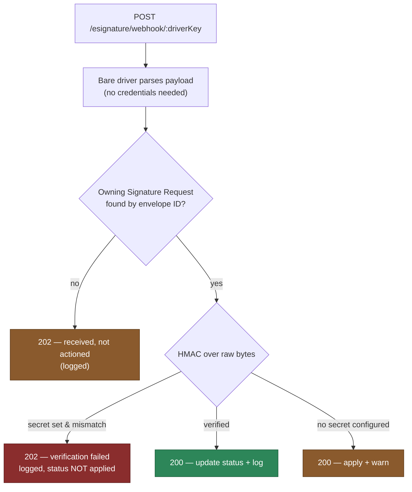

[← Back to eSignature Overview](../README.md)

# @memberjunction/esignature

The **core primitive** of the MemberJunction eSignature subsystem. This package defines the provider-agnostic contract every signing vendor implements, the normalized types that describe an envelope's lifecycle, and the engines that orchestrate sending, status tracking, document persistence, and auditing.

Provider driver packages (DocuSign, PandaDoc, Dropbox Sign) depend on this package; they implement its contract. Your application depends on this package's engine; it never talks to a vendor directly.

```bash
npm install @memberjunction/esignature
```

---

## Two entry points

This package ships **two** importable surfaces, deliberately separated so client bundles stay free of server-only dependencies:



| Import | Contains | Safe in browser? |
|---|---|---|
| `@memberjunction/esignature` | Types, `BaseSignatureProvider`, `SignatureEngineBase` | ✅ Yes |
| `@memberjunction/esignature/server` | `SignatureEngine`, driver-init utilities, artifact file-back | ❌ Server only (depends on `@memberjunction/credentials`) |

> **Why the split?** The server engine decrypts credentials and writes to the database — it pulls in `@memberjunction/credentials`, which has no place in a browser bundle. The root entry gives UI code everything it needs (the contract, the types, and a read-only metadata cache) without that weight.

---

## The provider contract: `BaseSignatureProvider`

Every signing vendor is wrapped in a driver that extends this abstract class and registers itself with the MJ class factory:

```typescript
@RegisterClass(BaseSignatureProvider, 'DocuSign')
export class DocuSignSignatureProvider extends BaseSignatureProvider { … }
```

The engine never imports a driver by name — it resolves one at runtime from the `ServerDriverKey` on the provider record. Add a vendor by publishing a new driver package; the engine picks it up with zero changes.

### Operations



| Operation | Required? | Purpose |
|---|---|---|
| `CreateEnvelope` | **Required** | Send one or more documents to recipients for signature. |
| `GetEnvelopeStatus` | **Required** | Poll the provider for the current envelope + recipient statuses. |
| `DownloadSignedDocument` | **Required** | Retrieve the completed, signed PDF bytes. |
| `VoidEnvelope` | **Required** | Cancel an in-flight envelope with a reason. |
| `CreateEmbeddedSigningUrl` | Optional | Generate an in-app signing URL for embedded signing flows. |
| `ApplyTemplate` | Optional | Create an envelope from a provider-hosted template. |
| `ResendNotification` | Optional | Re-send the signing email to pending recipients. |
| `ParseWebhookEvent` | Optional | Translate a provider webhook payload into a normalized event. |
| `VerifyWebhookSignature` | Optional | Confirm an inbound webhook genuinely came from the provider. |

Optional operations have safe default implementations that return a clear "not supported" result — a driver only overrides what its vendor actually offers. Callers check `supportsOperation(...)` or `getSupportedOperations()` before relying on an optional feature.

> Implementing a new provider? See [Adding a provider](#adding-a-new-provider) below, and the existing drivers for reference: [DocuSign](../Providers/DocuSign/README.md) · [PandaDoc](../Providers/PandaDoc/README.md) · [Dropbox Sign](../Providers/DropboxSign/README.md).

---

## Normalized types

The contract speaks one vocabulary regardless of vendor. The most important shapes:

### Status

```typescript
type EnvelopeStatus =
  | 'Draft' | 'Sent' | 'Delivered' | 'Signed'
  | 'Completed' | 'Declined' | 'Voided' | 'Unknown';
```

Each driver maps its vendor's native statuses onto this set, so application code branches on one stable enumeration.

### Requests & results (abridged)

```typescript
interface CreateEnvelopeRequest {
  title: string;
  message?: string;
  documents: SignatureDocumentInput[];   // { bytes, filename, contentType }
  recipients: SignatureRecipientInput[];  // { email, name?, routingOrder?, role? }
  sendImmediately?: boolean;
  metadata?: Record<string, unknown>;
}

interface EnvelopeResult {
  Success: boolean;
  externalEnvelopeId?: string;
  status?: EnvelopeStatus;
  signingUrl?: string;
  ErrorMessage?: string;
}

interface NormalizedSignatureEvent {
  externalEnvelopeId: string;
  status: EnvelopeStatus;
  occurredAt: string;   // ISO 8601 timestamp
  raw: unknown;
}
```

Results follow the MemberJunction convention of a `Success` boolean plus an optional `ErrorMessage` — never thrown exceptions for expected outcomes.

---

## The engines

### `SignatureEngine` — server-side orchestration

The heart of the subsystem. It resolves accounts to drivers, decrypts credentials, executes provider operations, and persists the entire lifecycle. Imported from the `/server` subpath:

```typescript
import { SignatureEngine } from '@memberjunction/esignature/server';
```



| Method | What it does |
|---|---|
| `SendForSignature(options, user)` | Resolve the account, initialize the driver, create the envelope, and persist the Request + Documents + Recipients + an audit Log row. Optionally links the request to an originating record via `entityId`/`recordId`, and can send documents *by reference* to an existing Artifact version. |
| `RefreshStatus(requestId, user)` | Poll the provider for the latest status, update the Request + Recipients, and log the transition. |
| `DownloadSigned(requestId, user)` | Fetch the signed PDF; if a storage account is configured, file it back as a new Artifact version and record it as a **Signed** document. |
| `Void(requestId, reason, user)` | Cancel the envelope at the provider and mark the Request **Voided**. |
| `RecordWebhookEvent(driverKey, payload, headers, user, rawBody?)` | Verify and apply an inbound provider webhook (see [Webhooks](#inbound-webhooks)). |
| `GetDriver(accountId, user)` | Resolve and return a fully-initialized driver for advanced/direct use. |

### `SignatureEngineBase` — browser-safe metadata cache

A `BaseEngine` subclass (like `FileStorageEngineBase`) that caches the **Providers** and **Accounts** metadata for read-only use — perfect for populating a UI dropdown of available accounts. It does **not** decrypt credentials or touch a vendor.

```typescript
import { SignatureEngineBase } from '@memberjunction/esignature';

await SignatureEngineBase.Instance.Config(false, contextUser);
const accounts = SignatureEngineBase.Instance.Accounts;
const account  = SignatureEngineBase.Instance.GetAccountByName('Production DocuSign');
```

| Accessor | Returns |
|---|---|
| `Accounts` | All configured Signature Accounts. |
| `Providers` | All registered Signature Providers. |
| `AccountsWithProviders` | Accounts joined to their provider for convenient display. |
| `GetAccountById` / `GetAccountByName` | A single account lookup. |
| `GetProviderById` / `GetProviderByDriverKey` | A single provider lookup. |

---

## Data model

Six entities back the subsystem. Field-level detail:

### MJ: Signature Providers
Registry of provider *types*. Seeded via metadata (`metadata/signature-providers/`), not SQL.

| Field | Type | Notes |
|---|---|---|
| `Name` | string | Display name, e.g. "DocuSign". Unique. |
| `ServerDriverKey` | string | Resolves the driver at runtime — must match the `@RegisterClass` key. |
| `IsActive` | bool | Inactive providers are skipped. |
| `Priority` | int | Selection order; lower = higher priority. |
| `RequiresOAuth` | bool | OAuth-based vs. static API key. |
| `SupportsTemplates` | bool | Capability flag. |
| `SupportsEmbeddedSigning` | bool | Capability flag. |
| `Configuration` | JSON | Non-secret provider defaults (e.g. `oauthBase`, `restBase`). |

### MJ: Signature Accounts
A configured *instance* of a provider.

| Field | Type | Notes |
|---|---|---|
| `Name` | string | e.g. "Production DocuSign". |
| `SignatureProviderID` | guid → Provider | Which provider type. |
| `CredentialID` | guid → Credential | Encrypted vendor secrets. |
| `CompanyID` | guid | Optional tenant/company scope. |
| `IsActive` / `IsDefault` | bool | Active flag; default-account flag. |
| `DefaultFromName` / `DefaultFromEmail` | string | Default sender identity. |
| `Configuration` | JSON | Per-account overrides, merged over provider defaults. |

### MJ: Signature Requests
The envelope. Links to an originating record via the polymorphic pair.

| Field | Type | Notes |
|---|---|---|
| `SignatureAccountID` | guid → Account | Sent through this account. |
| `Name` | string | Title / email subject. |
| `Message` | text | Email body. |
| `Status` | string | Normalized `EnvelopeStatus`, defaults `Draft`. |
| `ExternalEnvelopeID` | string | The vendor's envelope identifier. |
| `EntityID` / `RecordID` | guid / string | **Polymorphic link** to your domain record. |
| `SentAt` / `CompletedAt` | datetimeoffset | Lifecycle timestamps. |
| `VoidReason` | string | Set when voided. |

### MJ: Signature Request Documents
| Field | Type | Notes |
|---|---|---|
| `SignatureRequestID` | guid → Request | Parent envelope. |
| `ArtifactID` / `ArtifactVersionID` | guid | Source or signed artifact provenance. |
| `Name` | string | Filename. |
| `Sequence` | int | Document order in the envelope; defaults `1`. |
| `Role` | string | `Source` (sent) or `Signed` (received back). |

### MJ: Signature Request Recipients
| Field | Type | Notes |
|---|---|---|
| `SignatureRequestID` | guid → Request | Parent envelope. |
| `Email` / `Name` | string | Signer identity. |
| `RoutingOrder` | int | Signing order; defaults `1`. |
| `Role` | string | Template role (optional). |
| `Status` | string | Per-recipient status, defaults `Created`. |
| `SignedAt` | datetimeoffset | When this signer completed. |
| `ExternalRecipientID` | string | Vendor's recipient identifier. |

### MJ: Signature Request Logs
| Field | Type | Notes |
|---|---|---|
| `SignatureRequestID` | guid → Request | Nullable (webhooks for unknown envelopes still log). |
| `Operation` | string | `CreateEnvelope`, `GetStatus`, `Webhook`, … |
| `Success` | bool | Outcome. |
| `StatusBefore` / `StatusAfter` | string | The transition. |
| `Detail` | text | Full detail / error. |

> All six get the standard `__mj_CreatedAt` / `__mj_UpdatedAt` columns and full CRUD stored procedures from CodeGen.

---

## Usage

### Using the Actions (no-code)

The simplest path. Four Actions (in `@memberjunction/core-actions`) wrap the engine for AI agents and workflow builders — no TypeScript required:

| Action | Key inputs | Key outputs |
|---|---|---|
| **Send Document for Signature** | `SignatureAccountID`, `Title`, `Documents` *(or `ArtifactVersionID` / `ArtifactID`)*, `Recipients`, `Message?`, `EntityID?`/`RecordID?`, `SendImmediately?`, `Metadata?` | `SignatureRequestID`, `ExternalEnvelopeID`, `Status` |
| **Get Signature Status** | `SignatureRequestID` | `Status` |
| **Download Signed Document** | `SignatureRequestID` | `DocumentBase64`, `Filename`, `ContentType` |
| **Void Signature Request** | `SignatureRequestID`, `Reason` | `Status` (`Voided`) |

### Using the engine (server-side code)

```typescript
import { SignatureEngine } from '@memberjunction/esignature/server';

// 1. Send — from raw bytes
const sent = await SignatureEngine.Instance.SendForSignature({
  signatureAccountId,
  title: 'Service Agreement',
  message: 'Please review and sign.',
  documents: [{ bytes: pdf, filename: 'agreement.pdf', contentType: 'application/pdf' }],
  recipients: [{ email: 'alice@acme.com', name: 'Alice Smith', routingOrder: 1 }],
  entityId, recordId,           // link to your domain record
  contextUser,                  // passed inside the options object
});

// 2. Check status later (these methods take contextUser as a positional argument)
const status = await SignatureEngine.Instance.RefreshStatus(sent.signatureRequestId, contextUser);

// 3. Download the signed copy (filed back to storage automatically)
const signed = await SignatureEngine.Instance.DownloadSigned(sent.signatureRequestId, contextUser);

// 4. Or cancel
await SignatureEngine.Instance.Void(sent.signatureRequestId, 'Superseded by amendment', contextUser);
```

### Browser-safe metadata access

```typescript
import { SignatureEngineBase } from '@memberjunction/esignature';

await SignatureEngineBase.Instance.Config(false, contextUser);
const options = SignatureEngineBase.Instance.AccountsWithProviders; // for a UI picker
```

---

## Credential handling

Vendor secrets never live in code or config files — they're stored encrypted in the MJ Credential vault and resolved just in time.



Configuration is **layered**: provider-type defaults (non-secret) → per-account overrides → decrypted credential values (highest precedence). OAuth drivers can hand rotated tokens back to the engine via an `onTokenRefresh` callback, which persists them so the next call uses fresh tokens.

---

## Inbound webhooks

Signing vendors push status changes to MemberJunction at `POST /esignature/webhook/:driverKey`. The endpoint (in MJ Server) is intentionally **unauthenticated by MJ** — trust comes from the provider's own signature, verified over the raw request bytes. The policy is **verify-if-configured**: a configured-but-invalid signature is logged and *not* applied; a missing secret is accepted with a warning.



- **Invalid signature** (a secret is configured but the HMAC doesn't match): the failure is logged, the envelope status is **left unchanged**, and the endpoint returns **202** — accepted-but-not-actioned, so the provider doesn't hammer the endpoint with retries of a payload MJ will never trust.
- **No secret configured**: the event is applied with a warning logged — convenient for development, with a nudge to configure a secret for production.
- **Verified** event: status applied and logged, **200**.
- **Unknown envelope**: **202** — accepted (so the provider stops retrying) but not actioned.
- Malformed requests fail fast: missing driver key → **400**; no system user → **503**; unexpected error → **500**.

---

## Adding a new provider

1. Create a package depending on `@memberjunction/esignature`.
2. Subclass `BaseSignatureProvider`, implement the four required operations (plus any optional ones your vendor supports), and map the vendor's statuses onto `EnvelopeStatus`.
3. Register it: `@RegisterClass(BaseSignatureProvider, 'YourVendorKey')`.
4. Add a **MJ: Signature Providers** metadata row whose `ServerDriverKey` matches that key.
5. Export the driver from your package's `index.ts` so importing the package triggers registration.

The engine resolves your driver by key the first time an account that uses it sends a document — no engine changes, no wiring.

---

## Testing

```bash
cd packages/eSignature/Base && npm run test
```

Unit tests cover the `BaseSignatureProvider` contract — that optional operations default to "not supported", that capability discovery is accurate, and that the base class behaves correctly against mock drivers.

---

## Related

| Package | Relationship |
|---|---|
| [DocuSign driver](../Providers/DocuSign/README.md) | Reference provider — full feature set. |
| [PandaDoc driver](../Providers/PandaDoc/README.md) | API-key provider — core operations. |
| [Dropbox Sign driver](../Providers/DropboxSign/README.md) | API-key provider — core + webhooks. |
| [`@memberjunction/credentials`](../../Credentials) | Encrypted credential storage. |
| [`@memberjunction/storage`](../../MJStorage) | Artifact file-back for signed documents. |
| [`@memberjunction/core-actions`](../../Actions/CoreActions) | The four no-code Actions. |
