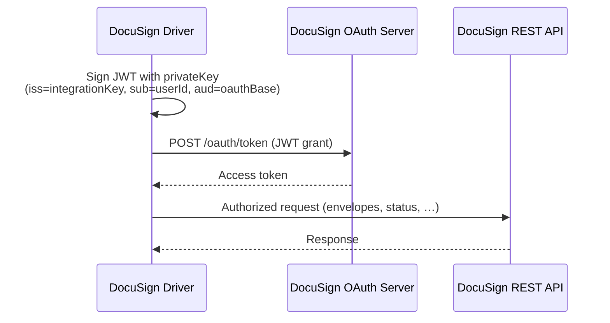

[← Back to eSignature Overview](../../README.md) · [Core Primitive](../../Base/README.md)

# @memberjunction/esignature-docusign

The **DocuSign** driver for the MemberJunction eSignature subsystem. It implements the [`BaseSignatureProvider`](../../Base/README.md#the-provider-contract-basesignatureprovider) contract against the DocuSign eSignature REST API, using JWT-grant OAuth for server-to-server authentication.

This is the **reference provider** — it implements the full feature set, including templates, embedded signing, and DocuSign Connect webhooks.

```bash
npm install @memberjunction/esignature-docusign
```

> You don't call this package directly. You configure a DocuSign **Signature Account** and use the [`SignatureEngine`](../../Base/README.md#the-engines) (or the [no-code Actions](../../Base/README.md#using-the-actions-no-code)). The engine resolves and drives this provider for you.

---

## At a glance

| | |
|---|---|
| **Driver key** | `DocuSign` |
| **Registration** | `@RegisterClass(BaseSignatureProvider, 'DocuSign')` |
| **Authentication** | JWT-grant OAuth 2.0 (service-account impersonation) |
| **API** | DocuSign eSignature REST API `v2.1` |
| **Webhooks** | DocuSign Connect, HMAC-verified |

### Supported operations

| Operation | Supported |
|---|:---:|
| Create envelope | ✅ |
| Get status | ✅ |
| Download signed | ✅ |
| Void | ✅ |
| Apply template | ✅ |
| Embedded signing URL | ✅ |
| Parse webhook event | ✅ |
| Verify webhook signature | ✅ |

---

## How authentication works

DocuSign uses **JWT grant** — the driver signs a JWT with your RSA private key and exchanges it for a short-lived access token, with no interactive login. Tokens are obtained on demand and refreshed automatically.



---

## Configuration

These values live in the account's **Credential** (encrypted via the [Credential Engine](../../../Credentials)) — never in code or environment variables. Non-secret defaults (`oauthBase`, `restBase`) may also be set on the **Signature Provider** record.

| Key | Required | Default | Description |
|---|:---:|---|---|
| `integrationKey` | ✅ | — | DocuSign OAuth app integration key (the JWT `iss`). |
| `userId` | ✅ | — | DocuSign user ID to impersonate (the JWT `sub`). |
| `accountId` | ✅ | — | DocuSign account ID that owns the envelopes. |
| `privateKey` | ✅ | — | RSA private key (PEM) used to sign the JWT. |
| `oauthBase` | — | `account-d.docusign.com` | OAuth host. Use `account.docusign.com` for production. |
| `restBase` | — | `https://demo.docusign.net/restapi` | REST API base. Use your production base for live envelopes. |
| `connectHmacKey` | — | — | HMAC secret for verifying DocuSign Connect webhooks. **Set this in production.** |

> The defaults point at the **DocuSign demo** environment, so you can test immediately. Override `oauthBase` and `restBase` for production.

### One-time setup

1. In the DocuSign Admin console, create an **integration key** with JWT grant and upload an RSA keypair.
2. Grant the app **consent** for the impersonated user (one-time admin consent URL).
3. In MemberJunction:
   - The **DocuSign** Signature Provider row is already seeded.
   - Create a **Credential** holding `integrationKey`, `userId`, `accountId`, and `privateKey`.
   - Create a **Signature Account** pointing at that credential.
4. (Production) Configure a **Connect** webhook in DocuSign pointing at `POST {your-server}/esignature/webhook/DocuSign`, and store its HMAC secret as `connectHmacKey`.

---

## Status mapping

DocuSign's native envelope statuses map onto MemberJunction's [normalized lifecycle](../../Base/README.md#status):

| DocuSign status | MJ `EnvelopeStatus` |
|---|---|
| `created` | `Draft` |
| `sent` | `Sent` |
| `delivered` | `Delivered` |
| `signed` | `Signed` |
| `completed` | `Completed` |
| `declined` | `Declined` |
| `voided` | `Voided` |

---

## Webhooks (DocuSign Connect)

DocuSign Connect pushes envelope events to `POST /esignature/webhook/DocuSign`. The driver verifies the `x-docusign-signature-1` header as an HMAC over the **raw request body** using your `connectHmacKey`. If the key is configured and the signature doesn't match, the event is logged and the envelope status is left unchanged — see the [webhook flow](../../Base/README.md#inbound-webhooks).

---

## Testing

```bash
cd packages/eSignature/Providers/DocuSign && npm run test
```

---

## Related

| | |
|---|---|
| [eSignature overview](../../README.md) | The whole subsystem. |
| [Core primitive](../../Base/README.md) | The contract, engine, and data model this driver plugs into. |
| [PandaDoc driver](../PandaDoc/README.md) · [Dropbox Sign driver](../DropboxSign/README.md) | Sibling providers. |
