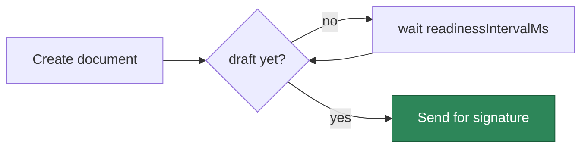

[← Back to eSignature Overview](../../README.md) · [Core Primitive](../../Base/README.md)

# @memberjunction/esignature-pandadoc

The **PandaDoc** driver for the MemberJunction eSignature subsystem. It implements the [`BaseSignatureProvider`](../../Base/README.md#the-provider-contract-basesignatureprovider) contract against the PandaDoc public REST API `v1`, using simple API-key authentication.

```bash
npm install @memberjunction/esignature-pandadoc
```

> You don't call this package directly. You configure a PandaDoc **Signature Account** and use the [`SignatureEngine`](../../Base/README.md#the-engines) (or the [no-code Actions](../../Base/README.md#using-the-actions-no-code)). The engine resolves and drives this provider for you.

---

## At a glance

| | |
|---|---|
| **Driver key** | `PandaDoc` |
| **Registration** | `@RegisterClass(BaseSignatureProvider, 'PandaDoc')` |
| **Authentication** | API key (`Authorization: API-Key …`) |
| **API** | PandaDoc public REST API `v1` |
| **Webhooks** | HMAC-verified |

### Supported operations

| Operation | Supported |
|---|:---:|
| Create envelope | ✅ |
| Get status | ✅ |
| Download signed | ✅ |
| Void | ✅ |
| Parse webhook event | ✅ |
| Verify webhook signature | ✅ |
| Templates | — |
| Embedded signing | — |

---

## A note on document readiness

PandaDoc processes an uploaded document asynchronously — a freshly created document isn't immediately in a sendable `draft` state. The driver handles this for you: after creating a document it **polls** until the document reaches `draft`, then sends it. The poll interval is tunable via `readinessIntervalMs` (default `1500` ms).



---

## Configuration

These values live in the account's **Credential** (encrypted via the [Credential Engine](../../../Credentials)) — never in code or environment variables.

| Key | Required | Default | Description |
|---|:---:|---|---|
| `apiKey` | ✅ | — | PandaDoc API key, sent as `Authorization: API-Key <key>`. |
| `restBase` | — | `https://api.pandadoc.com/public/v1` | REST API base. |
| `connectHmacKey` | — | — | HMAC secret for verifying inbound webhooks. **Set this in production.** |
| `readinessIntervalMs` | — | `1500` | Poll interval (ms) while waiting for an uploaded document to reach `draft`. |

### One-time setup

1. In PandaDoc, generate an **API key** (Settings → API).
2. In MemberJunction:
   - The **PandaDoc** Signature Provider row is already seeded.
   - Create a **Credential** holding `apiKey`.
   - Create a **Signature Account** pointing at that credential.
3. (Production) Configure a PandaDoc webhook pointing at `POST {your-server}/esignature/webhook/PandaDoc`, and store its HMAC secret as `connectHmacKey`.

---

## Status mapping

PandaDoc's native document statuses map onto MemberJunction's [normalized lifecycle](../../Base/README.md#status):

| PandaDoc status | MJ `EnvelopeStatus` |
|---|---|
| `document.uploaded`, `document.draft` | `Draft` |
| `document.sent` | `Sent` |
| `document.viewed` | `Delivered` |
| `document.completed`, `document.paid` | `Completed` |
| `document.declined` | `Declined` |
| `document.voided`, `document.cancelled` | `Voided` |

---

## Webhooks

PandaDoc pushes events to `POST /esignature/webhook/PandaDoc`. The driver verifies the HMAC signature (from the `signature` query parameter or `x-pandadoc-signature` header) over the raw request body using your `connectHmacKey`. See the [webhook flow](../../Base/README.md#inbound-webhooks).

---

## Testing

```bash
cd packages/eSignature/Providers/PandaDoc && npm run test
```

---

## Related

| | |
|---|---|
| [eSignature overview](../../README.md) | The whole subsystem. |
| [Core primitive](../../Base/README.md) | The contract, engine, and data model this driver plugs into. |
| [DocuSign driver](../DocuSign/README.md) · [Dropbox Sign driver](../DropboxSign/README.md) | Sibling providers. |
