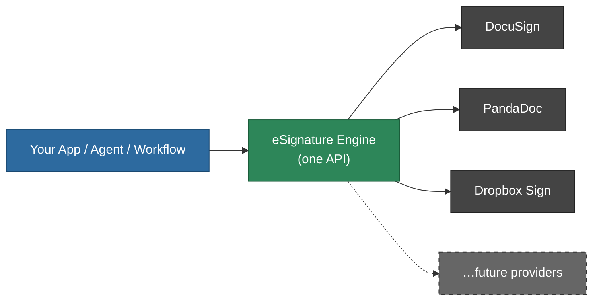
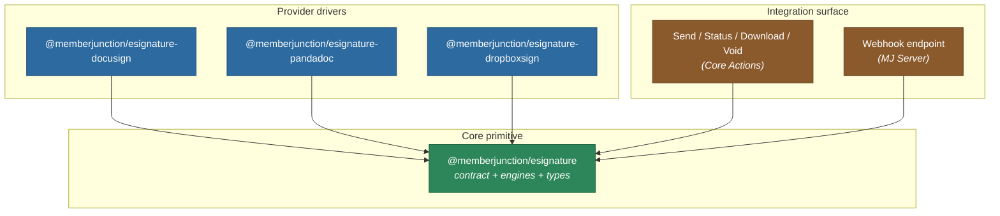
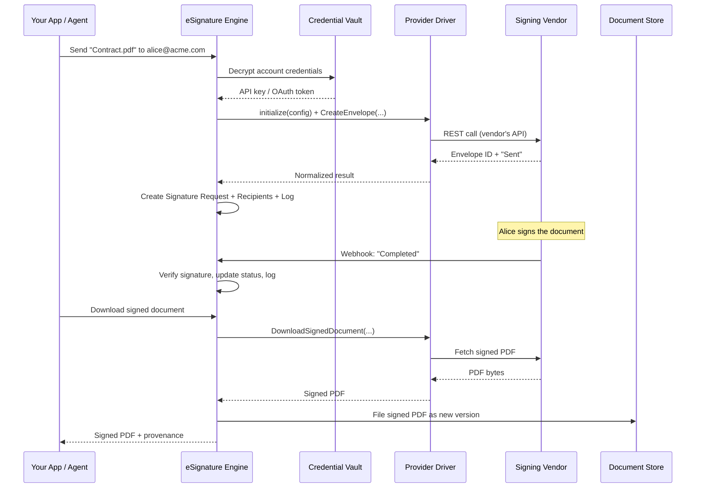
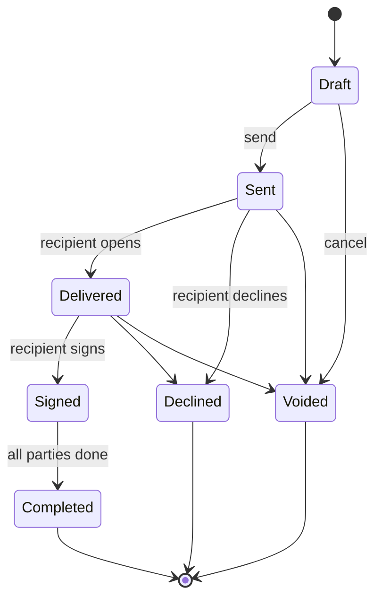
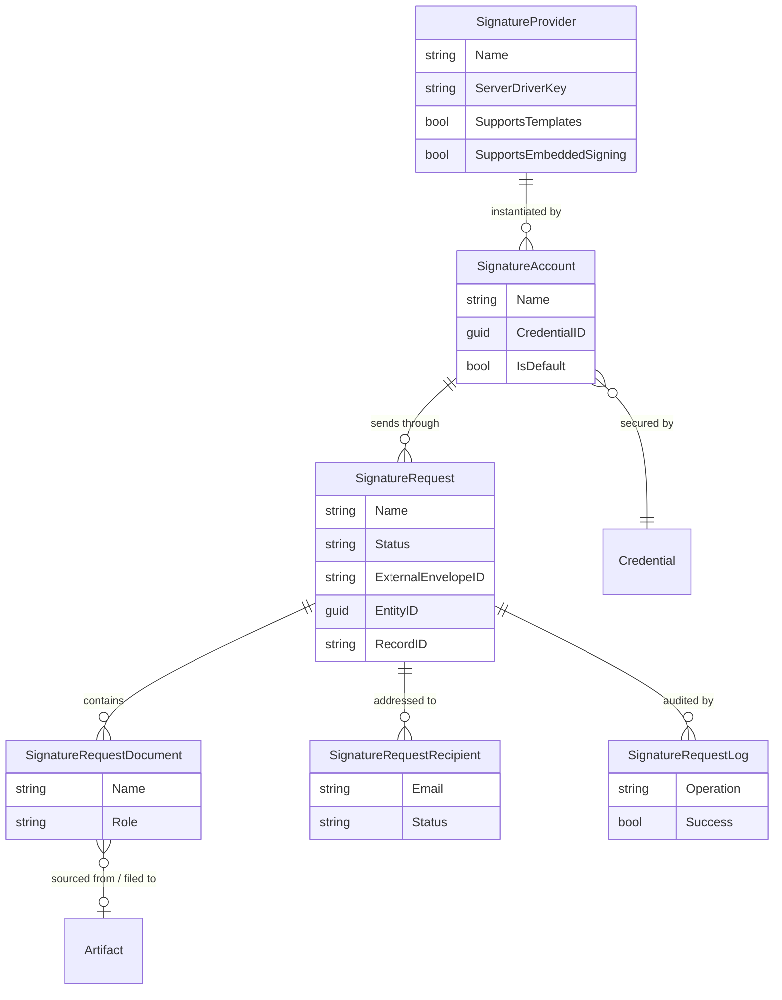

# MemberJunction eSignature

> Send documents for electronic signature from anywhere in MemberJunction — through one consistent API, backed by your choice of provider (DocuSign, PandaDoc, Dropbox Sign, and more), with full lifecycle tracking and a complete audit trail baked in.

The eSignature subsystem turns "get this document signed" into a single, provider-agnostic capability. Your application, an AI agent, or a no-code workflow asks MemberJunction to send a document; MemberJunction routes it to whichever signing provider you've configured, tracks the envelope from *Draft* to *Completed*, files the signed PDF back into your document store, and records every step. Switching providers — or adding a second one — is a configuration change, not a rewrite.

---

## Why it exists

Every signing vendor has its own API, its own authentication scheme, its own status vocabulary, and its own webhook format. Wiring an application directly to one of them means coupling your business logic to that vendor forever. MemberJunction's eSignature primitive sits between your app and the vendor:



You write to the engine once. The engine speaks every provider's dialect for you.

---

## What you get

| Capability | Description |
|---|---|
| **One API, many providers** | Send, check status, download, and void — identical calls regardless of vendor. |
| **Normalized status lifecycle** | Every provider's status vocabulary maps to one set: `Draft → Sent → Delivered → Signed → Completed` (plus `Declined`, `Voided`). |
| **Secure credential handling** | API keys, OAuth keys, and tokens are stored encrypted in the MJ Credential vault and decrypted only at send time. OAuth tokens are auto-refreshed. |
| **Document provenance** | Send a document straight from your MJ document store, and have the *signed* copy filed back automatically as a new version. |
| **Complete audit trail** | Every provider call and inbound webhook is logged with before/after status and full detail. |
| **Inbound webhooks** | Providers push status changes to MemberJunction; payloads are signature-verified before they're trusted. |
| **No-code ready** | Four pre-built **Actions** expose signing to AI agents and workflow builders with zero code. |

---

## The package family

The subsystem is split into a vendor-neutral **core primitive** and one thin **driver package per provider**. You install the core plus only the providers you actually use.



| Package | What it is | Docs |
|---|---|---|
| `@memberjunction/esignature` | The **core primitive** — the provider contract, the normalized types, and the engines that orchestrate the envelope lifecycle and persistence. Start here. | [Base/README.md](./Base/README.md) |
| `@memberjunction/esignature-docusign` | **DocuSign** driver. JWT-grant OAuth. Supports the full feature set incl. templates, embedded signing, and Connect webhooks. | [Providers/DocuSign/README.md](./Providers/DocuSign/README.md) |
| `@memberjunction/esignature-pandadoc` | **PandaDoc** driver. API-key auth. Core send/status/download/void. | [Providers/PandaDoc/README.md](./Providers/PandaDoc/README.md) |
| `@memberjunction/esignature-dropboxsign` | **Dropbox Sign** (formerly HelloSign) driver. API-key auth, with webhook support. | [Providers/DropboxSign/README.md](./Providers/DropboxSign/README.md) |

---

## How a signature request flows

From the moment you ask for a signature to the moment the completed document lands back in your store:



### The status lifecycle

Every provider's native statuses collapse into one normalized progression so your application logic never has to know the difference:



---

## The data model

Six entities track everything. A consuming application links its own record (a contract, an application, a membership) to a **Signature Request** via the standard polymorphic `EntityID` / `RecordID` pair — no schema changes required on your side.



| Entity (MJ name) | Role |
|---|---|
| **MJ: Signature Providers** | Registry of provider *types* (DocuSign, PandaDoc, …) with their driver key and capability flags. Seeded via metadata. |
| **MJ: Signature Accounts** | A configured *instance* of a provider — your DocuSign account, your PandaDoc workspace — pointing at an encrypted credential. |
| **MJ: Signature Requests** | The envelope itself: title, status, the linked source record, and timing. |
| **MJ: Signature Request Documents** | The documents in the envelope, both the **Source** copies sent and the **Signed** copies received back. |
| **MJ: Signature Request Recipients** | The signers, each with their own status and signed-at timestamp. |
| **MJ: Signature Request Logs** | An audit row for every provider call and webhook, with before/after status and detail. |

> Full field-by-field schema lives in [Base/README.md](./Base/README.md#data-model).

---

## Three ways to use it

| You are… | Use… |
|---|---|
| **Building a no-code workflow or AI agent** | The four pre-built **Actions** — *Send Document for Signature*, *Get Signature Status*, *Download Signed Document*, *Void Signature Request*. No code. See [Base/README.md](./Base/README.md#using-the-actions-no-code). |
| **Writing server-side TypeScript** | The `SignatureEngine` from `@memberjunction/esignature/server`. See [Base/README.md](./Base/README.md#using-the-engine-server-side-code). |
| **Building UI / reading metadata in the browser** | The client-safe `SignatureEngineBase` from `@memberjunction/esignature`. See [Base/README.md](./Base/README.md#browser-safe-metadata-access). |

---

## Quick start

**1. Install the core + the provider(s) you need:**

```bash
npm install @memberjunction/esignature @memberjunction/esignature-docusign
```

**2. Configure an account** (one-time, in MJ metadata):
- A **Signature Provider** row is seeded for you (DocuSign, PandaDoc, Dropbox Sign).
- Create a **Credential** holding your encrypted vendor keys.
- Create a **Signature Account** pointing at that credential.

See the provider-specific guide for exactly which credential fields each vendor needs:
[DocuSign](./Providers/DocuSign/README.md) · [PandaDoc](./Providers/PandaDoc/README.md) · [Dropbox Sign](./Providers/DropboxSign/README.md).

**3. Send a document** — from an Action (no code) or from server code:

```typescript
import { SignatureEngine } from '@memberjunction/esignature/server';

const result = await SignatureEngine.Instance.SendForSignature({
  signatureAccountId: myAccountId,
  title: 'Membership Agreement',
  documents: [{ bytes: pdfBuffer, filename: 'agreement.pdf', contentType: 'application/pdf' }],
  recipients: [{ email: 'alice@acme.com', name: 'Alice Smith' }],
  // optionally link to the originating record:
  entityId: contractsEntityId,
  recordId: contractId,
  contextUser,
});

console.log(result.status); // "Sent"
```

That's the whole integration. Status updates arrive via webhook; the signed PDF is filed back automatically on download.

---

## Provider capability matrix

Not every vendor exposes every feature. The engine advertises each provider's capabilities so callers (and agents) can adapt:

| Operation | DocuSign | PandaDoc | Dropbox Sign |
|---|:---:|:---:|:---:|
| Create envelope | ✅ | ✅ | ✅ |
| Get status | ✅ | ✅ | ✅ |
| Download signed | ✅ | ✅ | ✅ |
| Void | ✅ | ✅ | ✅ |
| Embedded signing | ✅ | — | — |
| Templates | ✅ | — | — |
| Inbound webhooks | ✅ | ✅ | ✅ |

---

## Design at a glance

- **Pluggable drivers.** Each provider is a class registered with `@RegisterClass(BaseSignatureProvider, '<Key>')` and resolved at runtime by driver key — adding a vendor never touches the engine.
- **Client/server split.** The browser-safe entry (`@memberjunction/esignature`) carries only the contract and metadata cache; the credential-decrypting, database-writing engine lives behind `@memberjunction/esignature/server`, so client bundles stay free of server-only dependencies.
- **Verify-if-configured webhooks.** When a signing secret is configured, an inbound webhook whose signature doesn't match is logged and **does not update** the envelope status; only verified (or, where no secret is configured, accepted-with-warning) events change state.
- **Graceful degradation.** Optional operations a provider doesn't support return a clear "not supported" result rather than throwing. Document file-back is best-effort — a download still returns bytes even if no storage account is configured.

For the full engineering detail — every type, every method, the credential flow, and the webhook contract — read the core primitive docs:

### **→ [`@memberjunction/esignature` — Core Primitive](./Base/README.md)**

---

## Related MemberJunction subsystems

| Subsystem | How eSignature uses it |
|---|---|
| [`@memberjunction/credentials`](../Credentials) | Encrypted storage + retrieval of vendor API keys and OAuth tokens. |
| [`@memberjunction/storage`](../MJStorage) | Filing source documents and signed PDFs as Artifacts. |
| [`@memberjunction/core-actions`](../Actions/CoreActions) | The four no-code Actions that expose signing to agents and workflows. |
| [`@memberjunction/core` / core-entities](../MJCore) | The metadata, entity, and engine foundations the whole subsystem is built on. |
