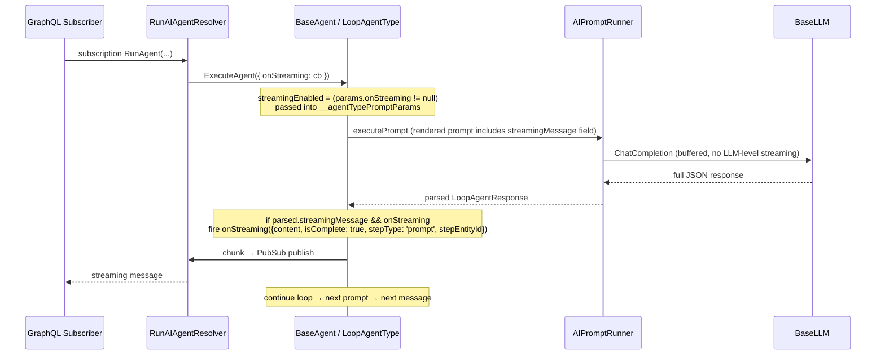

# Agent Inter-Turn Streaming Messages

## Status
- **Status**: Draft (v2 — supersedes the v1 token-streaming approach in this branch's history)
- **Created**: 2026-05-11
- **Author**: Amith Nagarajan + Claude
- **Branch**: `amith-nagarajan/agent-content-streaming`

## Overview

A multi-prompt loop agent produces several LLM turns to complete a task (plan → tool call → interpret → tool call → summarize). Today the user sees nothing between turns except generic status messages ("Calling tool X..."). True LLM token streaming through every turn would mostly leak internal reasoning JSON and noise.

The right granularity is **one user-facing message per turn**. The loop agent's structured JSON response is extended with an optional `streamingMessage` field that the model populates each turn with a brief 1-sentence description of what it's doing ("Searching the knowledge base...", "Drafting your summary..."). The moment the agent parses the response and confirms `onStreaming` is wired, it forwards that string through the existing streaming hook to the GraphQL subscriber.

The field — and the instruction to populate it — only appear in the prompt **when `onStreaming` is wired at runtime**. With no hook, the schema is unchanged and zero extra input/output tokens are spent.

## Goals & Non-Goals

### Goals
- Loop agents emit one user-facing progress message per turn, visible to the subscribing client in real time.
- The message is part of the structured response (no separate side-channel, no JSON streaming parser).
- The field is conditionally added to the response schema only when `onStreaming` is wired — no token cost when not used.
- The existing `message` field's semantics for `Chat` turns are unchanged.
- Works with the existing PubSub-based GraphQL streaming transport (`AgentExecutionStreamMessage` of type `'streaming'`).

### Non-Goals
- Token-by-token streaming of the LLM response.
- Changing `AIPromptRunner.executeModel` or any LLM driver code.
- Streaming for `FlowAgentType` or other non-loop agent types (can opt in later via the same pattern).
- Streaming tool-call deltas, payload deltas, or scratchpad content.

## Background & Context

### Where things live

- **Response interface**: [loop-agent-response-type.ts](packages/AI/Agents/src/agent-types/loop-agent-response-type.ts) defines `LoopAgentResponse` — `message`, `taskComplete`, `nextStep`, etc.
- **System prompt template**: [loop-agent-type-system-prompt.template.md](metadata/prompts/templates/system/loop-agent-type-system-prompt.template.md) — generates the interface description in the LLM prompt with Liquid `` gates on `__agentTypePromptParams.*`.
- **Agent type**: [loop-agent-type.ts](packages/AI/Agents/src/agent-types/loop-agent-type.ts) — `LoopAgentType.DetermineNextStep` parses the LLM response.
- **Agent layer streaming forwarding**: [base-agent.ts:5846-5854](packages/AI/Agents/src/base-agent.ts#L5846-L5854) already forwards `params.onStreaming` and tags chunks with `{ stepType: 'prompt', stepEntityId }`.
- **GraphQL stream publishing**: [RunAIAgentResolver.ts](packages/MJServer/src/resolvers/RunAIAgentResolver.ts) `createStreamingCallback` publishes `AgentExecutionStreamMessage` of type `'streaming'`.

### Why `message` vs. a new `streamingMessage`

`message` is already used in the response — required for `nextStep.type === 'Chat'` (the final user-facing reply on a Chat turn), and otherwise omitted. Overloading it for inter-turn progress messages would muddy the contract. A new optional `streamingMessage` field keeps semantics clean:

- `streamingMessage`: brief progress text the model emits **every turn** when streaming is enabled. Always forwarded to `onStreaming`.
- `message`: unchanged. Final user-facing reply on Chat turns. The UI's existing Chat-turn rendering continues to handle this.

## Architecture / Design

### Flow



### Schema change

Add to `LoopAgentResponse`:

```typescript
/**
 * Optional brief progress message (<25 words) shown to the user while
 * the agent works. Only present in the schema when streaming is enabled
 * at runtime (i.e., the caller supplied an onStreaming callback).
 *
 * Populate every turn when this field is present in your schema. Use
 * present-progressive tense: "Searching the knowledge base...",
 * "Drafting your summary...".
 *
 * Independent of the final `message` field used on Chat turns.
 */
streamingMessage?: string;
```

### Prompt change

Conditional block in [loop-agent-type-system-prompt.template.md](metadata/prompts/templates/system/loop-agent-type-system-prompt.template.md), inserted alongside the other `` gates (around line 12, right after the `message?` field declaration):

```liquid

    /** REQUIRED every turn. Brief 1-sentence (<25 words) description of
     *  what you're doing, shown to the user in real time. Use present-
     *  progressive tense. Examples: "Searching the knowledge base...",
     *  "Looking up the customer record...", "Drafting your reply..." */
    streamingMessage: string;

```

Plus a short behavioral note further down the template explaining when/how to use it.

### Agent-type param plumbing

`__agentTypePromptParams` is already populated in `LoopAgentType` when preparing prompt params. Add:

```typescript
// In LoopAgentType, where __agentTypePromptParams is built:
__agentTypePromptParams.streamingEnabled = !!params.onStreaming;
```

### Emit point

The emit lives in `BaseAgent` (not `LoopAgentType`) so that:
- `LoopAgentType` stays purely declarative (schema + prompt template); no streaming concerns leak in.
- The existing wrapper at [base-agent.ts:5846-5854](packages/AI/Agents/src/base-agent.ts#L5846-L5854) already knows `stepEntity.ID`, which is needed for the chunk metadata.

In `BaseAgent`, immediately after the prompt result is parsed into the structured `LoopAgentResponse` (and before/after `DetermineNextStep` — either works since parsing must happen first):

```typescript
const parsed = /* parsed LoopAgentResponse */;
if (parsed?.streamingMessage && params.onStreaming) {
    try {
        params.onStreaming({
            content: parsed.streamingMessage,
            isComplete: true,
            stepType: 'prompt',
            stepEntityId: stepEntity.ID,
        });
    } catch (err) {
        // A misbehaving streaming callback must never break the loop
        LogError(err);
    }
}
```

## Implementation Plan

### Phase 1: Schema + prompt template

1. **`packages/AI/Agents/src/agent-types/loop-agent-response-type.ts`** — add optional `streamingMessage?: string` field to `LoopAgentResponse` with JSDoc as shown above.
2. **`metadata/prompts/templates/system/loop-agent-type-system-prompt.template.md`** — add the `` block declaring `streamingMessage` in the inline interface; add a short behavioral note further down.
3. **Run `npx mj sync push --dir=metadata --include="prompts"`** from the repo root to push the template update into the database. Template changes are `@file:` references resolved at push time — a server restart alone will NOT pick them up.

### Phase 2: Wire `streamingEnabled` into prompt params

1. **`packages/AI/Agents/src/agent-types/loop-agent-type.ts`** — locate where `__agentTypePromptParams` (or equivalent) is built for the system prompt rendering; add `streamingEnabled: !!params.onStreaming`. (May require minor signature change to access `params` if not already in scope.)
2. **`packages/AI/Agents/src/agent-types/loop-agent-prompt-params.ts`** — if there's a typed interface for these params, add the `streamingEnabled?: boolean` field.

### Phase 3: Emit streaming message after each turn

1. **`packages/AI/Agents/src/base-agent.ts`** — after `executePrompt` returns and the response is parsed into the structured shape (near the existing parsing call), check for `parsed.streamingMessage` and `params.onStreaming`. If both present, invoke the callback with `{ content, isComplete: true, stepType: 'prompt', stepEntityId: stepEntity.ID }`. Wrap in try/catch.
2. Confirm the existing sub-agent streaming forwarding at [base-agent.ts:4467](packages/AI/Agents/src/base-agent.ts#L4467) carries through — sub-agents inherit `onStreaming` and will emit their own `streamingMessage` chunks tagged with their own step entity IDs. No additional change needed.

### Phase 4: Tests

1. **`packages/AI/Agents/src/__tests__/loop-agent-streaming.test.ts`** (new):
   - When `params.onStreaming` is set and the LLM response contains `streamingMessage`, the callback fires exactly once per turn with the parsed string and `isComplete: true`.
   - When `params.onStreaming` is set but `streamingMessage` is absent in the response, no callback fires.
   - When `params.onStreaming` is `undefined`, even if `streamingMessage` is present in the response, no error occurs and no callback is attempted.
   - When the callback throws, the agent loop continues normally.
   - When the prompt is rendered with `streamingEnabled: false`, the rendered system prompt does **not** contain the `streamingMessage` declaration (snapshot or substring assertion).
   - When `streamingEnabled: true`, the rendered prompt **does** contain it.
2. **Existing loop-agent tests** — re-run after the template change to ensure no regressions.

### Phase 5: GraphQL subscription smoke test

The resolver path already exists and is unchanged. Manual verification:

1. Start MJAPI + MJExplorer.
2. From a GraphQL client, subscribe to `RunAIAgent` for an agent with a multi-step task.
3. Confirm `AgentExecutionStreamMessage` records with `type: 'streaming'` arrive between turns, carrying the `streamingMessage` text in `streaming.content`.

## Migration & Data

- **No DB schema changes.**
- **One metadata sync**: the system prompt template is referenced via `@file:` in the AI Prompt record for the Loop Agent system prompt. `npx mj sync push --dir=metadata --include="prompts"` resolves the file and writes the new content into `TemplateText` in the database. Required before agents pick up the new schema.

## Testing Strategy

- Unit tests as Phase 4.
- Manual end-to-end via GraphQL subscription.
- Edge cases:
  - LLM returns malformed JSON → existing parsing fails before the emit point; no streaming side-effect.
  - LLM populates `streamingMessage` even when not requested (no `streamingEnabled` in the schema) → forward it anyway if `params.onStreaming` is wired (cost was already paid, surface the value). Suppress entirely if `onStreaming` is absent.
  - Sub-agent execution: `onStreaming` is already forwarded into sub-agents via [base-agent.ts:4467](packages/AI/Agents/src/base-agent.ts#L4467), so sub-agents' `streamingMessage` values flow through naturally with their own step metadata.
  - Final Chat turn: `streamingMessage` (progress) and `message` (final reply) can both be present. Emit `streamingMessage` through the streaming channel; `message` continues to flow through the existing Chat-response path. UI distinguishes via step metadata.
  - Model-specific verbosity: test against Claude, GPT, Gemini to confirm each respects the `<25 words` cap; soft-truncate on the receiving side if needed.

## Risks & Open Questions

- **Risk: Model compliance.** Some models may omit `streamingMessage` despite the REQUIRED instruction. Mitigation: phrase the instruction clearly, verify per priority model, and accept that occasional silent turns are non-fatal (agent still works).
- **Risk: Verbosity creep.** Models might write long `streamingMessage` values. Mitigation: explicit `<25 words` cap in the instruction; optional client-side truncation.
- **Open question: First-turn behavior.** Should the very first turn (before any work is done) emit a `streamingMessage`? Yes — the model is instructed to populate it every turn; the first message describes what the agent is about to start.
- **Open question: Does the existing `AgentExecutionStreamMessage` shape need a `kind` field to distinguish "inter-turn progress" from "final content"?** Possibly later. For v1, every chunk we emit through this path is inter-turn progress; the `stepType: 'prompt'` metadata is enough for the UI to decide rendering.

## Files to Modify

| File | Change |
|------|--------|
| [packages/AI/Agents/src/agent-types/loop-agent-response-type.ts](packages/AI/Agents/src/agent-types/loop-agent-response-type.ts) | Add optional `streamingMessage?: string` to `LoopAgentResponse` |
| [metadata/prompts/templates/system/loop-agent-type-system-prompt.template.md](metadata/prompts/templates/system/loop-agent-type-system-prompt.template.md) | Conditional `` block declaring the field + behavioral instruction |
| [packages/AI/Agents/src/agent-types/loop-agent-type.ts](packages/AI/Agents/src/agent-types/loop-agent-type.ts) | Set `__agentTypePromptParams.streamingEnabled = !!params.onStreaming` when preparing prompt params |
| [packages/AI/Agents/src/agent-types/loop-agent-prompt-params.ts](packages/AI/Agents/src/agent-types/loop-agent-prompt-params.ts) | Add `streamingEnabled?: boolean` to the typed params interface (if applicable) |
| [packages/AI/Agents/src/base-agent.ts](packages/AI/Agents/src/base-agent.ts) | Emit `params.onStreaming({ content: parsed.streamingMessage, isComplete: true, ... })` after each parsed prompt response when both are present |
| `packages/AI/Agents/src/__tests__/loop-agent-streaming.test.ts` | New test file covering Phase 4 scenarios |

## References

- v0 plan (raw token streaming): superseded — see git history of this file (commit prior to this revision).
- Existing agent streaming forwarding: [base-agent.ts:4467](packages/AI/Agents/src/base-agent.ts#L4467) (sub-agents), [base-agent.ts:5846-5854](packages/AI/Agents/src/base-agent.ts#L5846-L5854) (prompt callback wrapper).
- GraphQL stream publishing: [RunAIAgentResolver.ts](packages/MJServer/src/resolvers/RunAIAgentResolver.ts) `createStreamingCallback`.
- Loop response interface: [loop-agent-response-type.ts](packages/AI/Agents/src/agent-types/loop-agent-response-type.ts).
- Loop system prompt template: [loop-agent-type-system-prompt.template.md](metadata/prompts/templates/system/loop-agent-type-system-prompt.template.md).
