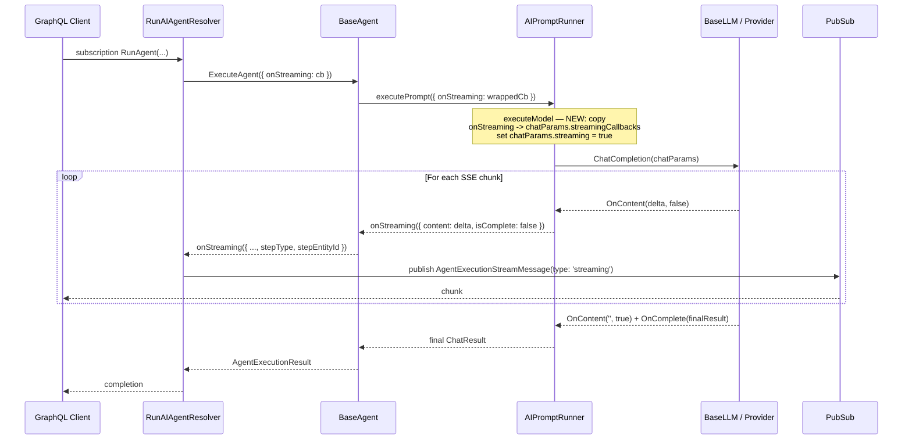

# Agent Content Streaming: Wire `onStreaming` Through Single-Prompt Path

## Status
- **Status**: Draft
- **Created**: 2026-05-11
- **Author**: Amith Nagarajan + Claude
- **Branch**: `amith-nagarajan/agent-content-streaming`

## Overview

MemberJunction's agent framework already has end-to-end *plumbing* for streaming **assembled content** (LLM tokens, not just status messages) from the LLM driver layer up through `AIPromptRunner` → `BaseAgent` → `RunAIAgentResolver` → GraphQL `PubSub`. The agent layer correctly forwards an `onStreaming` callback to prompt execution, and the LLM driver layer (`BaseLLM`) has a complete native streaming implementation (Server-Sent Events handling, `OnContent` / `OnComplete` / `OnError` callbacks).

However, **the single-prompt execution path in `AIPromptRunner.executeModel()` never copies the caller's `onStreaming` callback onto `ChatParams.streamingCallbacks`, and never sets `ChatParams.streaming = true`**. As a result, even though `BaseLLM.ChatCompletion()` *can* stream, the prompt path always invokes it in buffered mode. Only the `ParallelExecutionCoordinator` path currently wires streaming through.

This plan adds that one missing connection so that any agent that passes `onStreaming` receives progressive content chunks, and verifies (and where necessary adds) native streaming implementations in the highest-priority provider drivers.

## Goals & Non-Goals

### Goals
- An agent caller that supplies `ExecuteAgentParams.onStreaming` receives token-level content chunks as the underlying LLM streams them.
- The GraphQL subscription path (`RunAIAgentResolver`) emits `AgentExecutionStreamMessage` of type `'streaming'` for every chunk, in real time.
- The single-prompt path in `AIPromptRunner.executeModel()` honors `AIPromptParams.onStreaming` identically to how `ParallelExecutionCoordinator` already does.
- The final `ChatResult` returned to the caller is identical whether streaming was enabled or not (no behavior change for callers that don't pass `onStreaming`).
- Anthropic, OpenAI, and Gemini drivers stream natively (the three highest-traffic providers).

### Non-Goals
- Reworking the GraphQL subscription contract or PubSub message shape.
- Streaming for parallel-execution tasks (already works).
- Streaming for non-LLM AI types (embeddings, vision-only, etc.).
- Adding streaming UI to MJExplorer or Skip chat — separate plan once the server side ships.
- Streaming tool-call deltas (only assistant text content is in scope for v1).

## Background & Context

### What already works
- **Agent → Prompt**: [base-agent.ts:5846-5854](packages/AI/Agents/src/base-agent.ts#L5846-L5854) wraps `params.onStreaming` and assigns it to `promptParams.onStreaming` with metadata `{ stepType: 'prompt', stepEntityId }`.
- **Agent → Sub-agent**: [base-agent.ts:4467](packages/AI/Agents/src/base-agent.ts#L4467) forwards `onStreaming` to nested agent executions.
- **BaseLLM streaming**: [baseLLM.ts:79](packages/AI/Core/src/generic/baseLLM.ts#L79) gates on `params.streaming && params.streamingCallbacks && this.SupportsStreaming`; lines 241-291 implement SSE parsing and call `OnContent` / `OnComplete` / `OnError`.
- **ChatParams contract**: [chat.types.ts:114](packages/AI/Core/src/generic/chat.types.ts#L114) defines `StreamingChatCallbacks.OnContent(chunk, isComplete)`; [chat.types.ts:193](packages/AI/Core/src/generic/chat.types.ts#L193) exposes `ChatParams.streamingCallbacks`.
- **Parallel path (reference impl)**: [ParallelExecutionCoordinator.ts:588-591](packages/AI/Prompts/src/ParallelExecutionCoordinator.ts#L588-L591) populates `innerParams.streamingCallbacks` from a task-level streaming config. This is the pattern to mirror in `executeModel`.
- **GraphQL transport**: [RunAIAgentResolver.ts](packages/MJServer/src/resolvers/RunAIAgentResolver.ts) `createStreamingCallback` publishes `AgentExecutionStreamMessage` of type `'streaming'` separate from the `'ExecutionProgress'` status channel.

### What doesn't work
- **AIPromptRunner single-prompt path**: [AIPromptRunner.ts:3180-3376](packages/AI/Prompts/src/AIPromptRunner.ts#L3180-L3376) builds `chatParams` and calls `llm.ChatCompletion(chatParams)` (lines 3361 and 3374) without ever touching `chatParams.streaming` or `chatParams.streamingCallbacks`. `params.onStreaming` is set on `AIPromptParams` but is dropped here.
- **Provider drivers**: `BaseLLM` provides a default SSE-based streaming implementation, but each concrete driver (`AnthropicLLM`, `OpenAILLM`, `GeminiLLM`, etc.) must (a) declare `SupportsStreaming = true` and (b) ensure its `ChatCompletion` either uses the base streaming path or overrides it with the provider's native SDK streaming. Verification needed per provider.

## Architecture / Design

### Flow with the fix in place



### The change to `executeModel`

Insert immediately before the `llm.ChatCompletion(chatParams)` calls at [AIPromptRunner.ts:3360 and 3374](packages/AI/Prompts/src/AIPromptRunner.ts#L3360):

```typescript
// Wire streaming callbacks if caller provided onStreaming and the driver supports it
if (params.onStreaming && llm.SupportsStreaming) {
    chatParams.streaming = true;
    chatParams.streamingCallbacks = {
        OnContent: (chunk: string, isComplete: boolean) => {
            params.onStreaming!({
                content: chunk,
                isComplete,
                taskId: params.taskId,
            });
        },
        // OnComplete intentionally omitted — final ChatResult is returned
        // synchronously by ChatCompletion(); callers don't need a second signal.
        OnError: (err: unknown) => {
            // Defensive: errors are also thrown by ChatCompletion; this lets
            // the caller surface a streaming-specific error early if desired.
            this.logError(err, { category: 'ModelStreaming' });
        },
    };
}
```

**Why guard on `llm.SupportsStreaming`**: silently falling back to buffered mode when a driver doesn't support streaming is the correct UX — the agent still completes, just without progressive output. The caller can detect this via the absence of intermediate `onStreaming` calls.

### `ChatResult` parity

`BaseLLM.ChatCompletion` already assembles the streamed chunks into a complete `ChatResult` (see [baseLLM.ts:284-285](packages/AI/Core/src/generic/baseLLM.ts#L284-L285) where `OnComplete(result)` fires with the assembled result and the function then returns it). So `executeModel` continues to return a complete `ChatResult` regardless of streaming mode. No downstream code (token counting, logging, `AIPromptRun` recording) needs to change.

## Implementation Plan

### Phase 1: Wire the single-prompt path (the actual fix)

1. **Edit `packages/AI/Prompts/src/AIPromptRunner.ts`** — Insert the streaming-callback wiring shown above immediately before the `llm.ChatCompletion(chatParams)` calls at [lines 3360-3375](packages/AI/Prompts/src/AIPromptRunner.ts#L3360). Apply to **both** branches (with and without `cancellationToken`) — extract into a small helper `private wireStreamingCallbacks(params, llm, chatParams)` to avoid duplication.
2. **Add JSDoc** to `AIPromptParams.onStreaming` in `packages/AI/CorePlus/src/prompt.types.ts` clarifying that it is honored on both single and parallel paths and that it requires `llm.SupportsStreaming`.

### Phase 2: Verify provider drivers

For each of the three priority providers, open the package, check whether the driver:
- Overrides `SupportsStreaming` to return `true`
- Implements native streaming in its `ChatCompletion` or relies on `BaseLLM`'s default SSE path

Providers to audit:
1. **`packages/AI/Providers/Anthropic/`** — Anthropic SDK has first-class streaming events; native impl preferred over generic SSE
2. **`packages/AI/Providers/OpenAI/`** — OpenAI SDK exposes async iterables for streamed completions
3. **`packages/AI/Providers/Gemini/`** — `@google/generative-ai` exposes `generateContentStream`

For each provider that doesn't yet stream:
1. Add `public override get SupportsStreaming(): boolean { return true; }`
2. In `ChatCompletion`, branch on `params.streaming && params.streamingCallbacks`:
   - If true, call the SDK's streaming method, invoke `OnContent(delta, false)` per chunk, assemble the final `ChatResult`, and call `OnContent('', true)` + `OnComplete(result)` before returning.
   - If false, keep existing buffered behavior.
3. Cancellation: respect `AbortSignal` plumbed via `chatParams` so streamed requests can be cut short.

### Phase 3: GraphQL subscription smoke test

The resolver already publishes `'streaming'` messages — no code change expected — but verify:
1. Run an agent with a known-streaming model end-to-end through `RunAIAgentResolver` ([packages/MJServer/src/resolvers/RunAIAgentResolver.ts](packages/MJServer/src/resolvers/RunAIAgentResolver.ts)).
2. Confirm `AgentExecutionStreamMessage` records with `type: 'streaming'` and populated `streaming.content` flow over the GraphQL subscription before the final completion message.
3. If the resolver buffers or coalesces by accident, fix to forward each chunk verbatim.

### Phase 4: Tests

1. **AIPromptRunner unit test** (new) — mock `BaseLLM` to fire 3 streamed chunks then complete; assert `params.onStreaming` was invoked 4 times (3 partial + 1 isComplete) and final `ChatResult` matches assembled chunks.
2. **BaseAgent unit test** — mock prompt execution to emit streamed chunks; assert agent forwards them to `params.onStreaming` with `stepType: 'prompt'` and the correct `stepEntityId`.
3. **Provider streaming tests** (per provider) — record a fixture of an SDK streaming response, replay it, assert `OnContent` is called per delta and assembled `ChatResult.message` matches the concatenation.
4. **Regression**: existing prompt tests must continue passing — the streaming wiring is fully opt-in.

## Migration & Data

None. This is pure code; no schema, metadata, or migration changes.

## Testing Strategy

- **Unit tests** as above for each layer.
- **Manual end-to-end**: in MJExplorer or via GraphQL Playground, subscribe to `RunAIAgent` with a prompt that produces a long response (e.g., "Write a 500-word essay on X"). Confirm streamed chunks arrive incrementally and the final assembled content matches the buffered-mode response for the same input/seed.
- **Edge cases**:
  - Driver returns `SupportsStreaming = false` → caller should get buffered response, no streaming events, no errors.
  - Mid-stream cancellation via `AbortSignal` — final `ChatResult` should report the partial content and a cancellation flag/error.
  - Network drop mid-stream — `OnError` fires, `ChatCompletion` rejects, agent surfaces the failure.
  - Tool-calling models (Anthropic/OpenAI) that interleave tool-use blocks with assistant text — only assistant text chunks fire `OnContent` in v1.

## Risks & Open Questions

- **Risk: Token-accounting drift.** `BaseLLM` already assembles the final result; verify token-count fields on `ChatResult` are populated identically in streaming vs buffered mode. (Some SDKs report usage only on the final stream event.)
- **Risk: Provider-specific quirks.** Anthropic and OpenAI both have content-block / part structures; concatenation must respect that the streamed `content` is the *assistant text only*, not raw event JSON.
- **Open question: Backpressure.** If the GraphQL subscriber is slow, does `PubSub` queue indefinitely? Current behavior is shared with the existing `'ExecutionProgress'` channel — accept the same semantics for v1, revisit if it causes pressure in production.
- **Open question: Cache interactions.** AI prompt caching (if hit) returns instantly with no streamable deltas. Behavior should be: emit a single `OnContent(fullResponse, true)` so callers see one chunk. Confirm in implementation.

## Files to Modify

| File | Change |
|------|--------|
| [packages/AI/Prompts/src/AIPromptRunner.ts](packages/AI/Prompts/src/AIPromptRunner.ts) | Add `wireStreamingCallbacks` helper; invoke before `ChatCompletion` calls at lines ~3360 and ~3374 |
| [packages/AI/CorePlus/src/prompt.types.ts](packages/AI/CorePlus/src/prompt.types.ts) | JSDoc clarification on `AIPromptParams.onStreaming` |
| `packages/AI/Providers/Anthropic/src/*LLM*.ts` | Verify/add native streaming via Anthropic SDK events |
| `packages/AI/Providers/OpenAI/src/*LLM*.ts` | Verify/add native streaming via OpenAI async iterables |
| `packages/AI/Providers/Gemini/src/*LLM*.ts` | Verify/add native streaming via `generateContentStream` |
| `packages/AI/Prompts/src/__tests__/AIPromptRunner.streaming.test.ts` | New unit test |
| `packages/AI/Agents/src/__tests__/base-agent.streaming.test.ts` | New unit test |
| Per-provider `__tests__/*.streaming.test.ts` | New per-provider tests |

## References

- Existing streaming reference: [ParallelExecutionCoordinator.ts:588-595](packages/AI/Prompts/src/ParallelExecutionCoordinator.ts#L588-L595)
- BaseLLM streaming implementation: [baseLLM.ts:79-291](packages/AI/Core/src/generic/baseLLM.ts#L79-L291)
- Agent streaming forwarding: [base-agent.ts:4467](packages/AI/Agents/src/base-agent.ts#L4467) and [base-agent.ts:5846-5854](packages/AI/Agents/src/base-agent.ts#L5846-L5854)
- GraphQL stream publishing: [RunAIAgentResolver.ts](packages/MJServer/src/resolvers/RunAIAgentResolver.ts)
- Streaming callback shape: [chat.types.ts:108-120](packages/AI/Core/src/generic/chat.types.ts#L108-L120)
