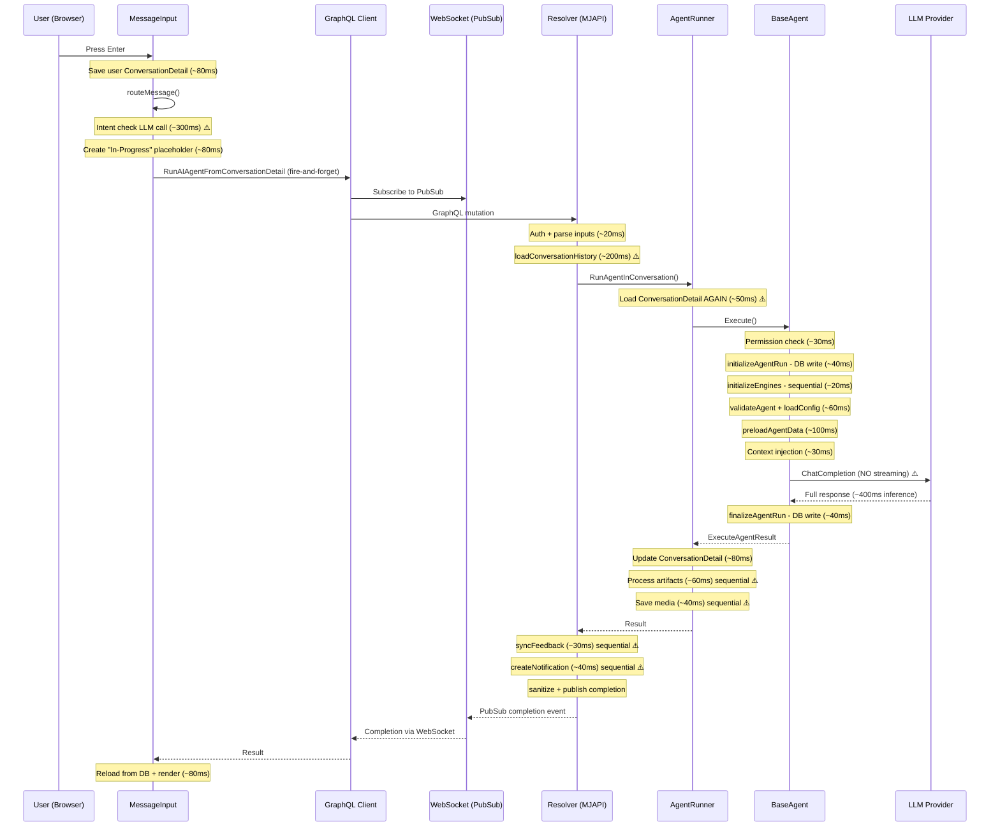
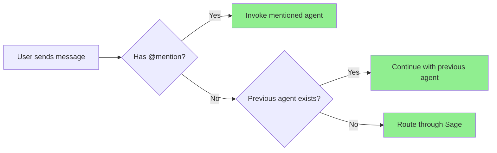
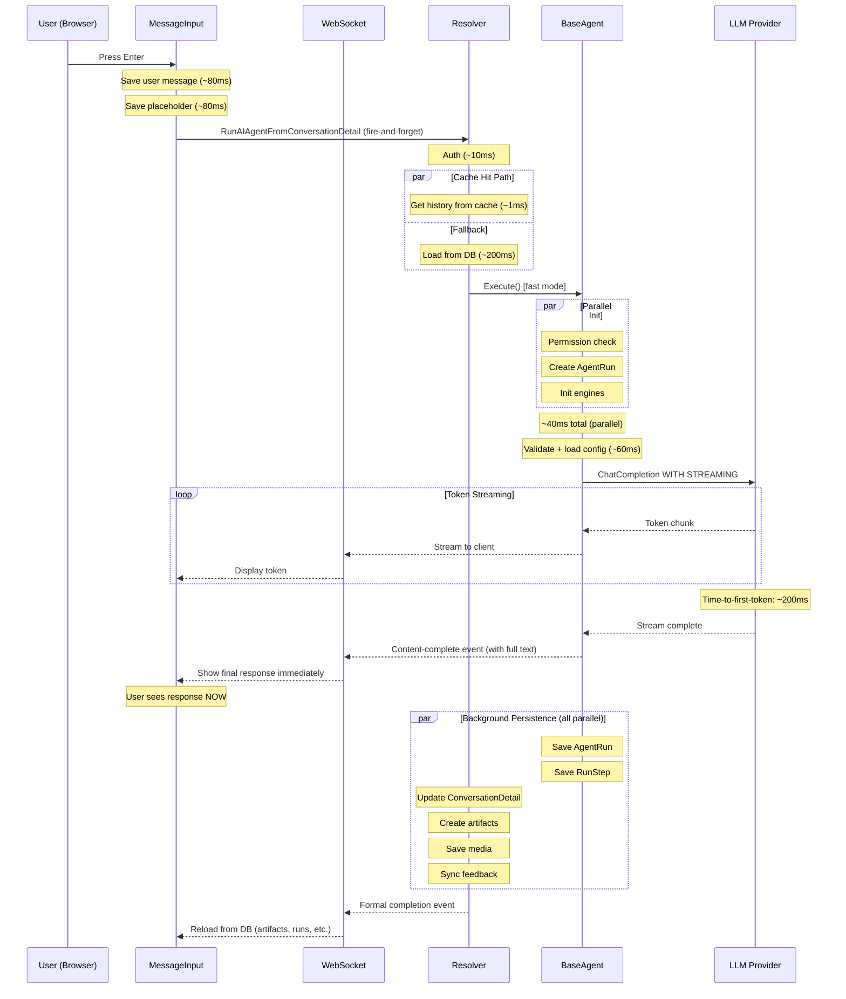

# Agent Execution Latency Optimization Plan

## Overview

This plan addresses end-to-end latency in the MJ agent execution pipeline. Currently, a simple conversational message (e.g., "What is 2+2?" through Sage) takes ~1,600-2,100ms round-trip even when LLM inference is only ~400ms. For audio/real-time use cases, we need this closer to inference + 200ms.

The plan has two sections:
1. **All-Agent Optimizations** — improvements that benefit every agent execution
2. **Fast Agent Path** — a new lightweight execution mode for real-time/audio agents

## Current End-to-End Flow



## Current Latency Breakdown

| Phase | Operations | Est. Time | Category |
|-------|-----------|-----------|----------|
| Client: Save user message | `detail.Save()` | ~80ms | DB write |
| Client: Intent check | Separate LLM call via RunAIPrompt | ~300ms | **LLM call** |
| Client: Save placeholder | `placeholder.Save()` | ~80ms | DB write |
| Client: Fire-and-forget setup | Subscribe + send mutation | ~30ms | Network |
| Server: Auth + input parse | JWT cache + JSON parse | ~20ms | CPU |
| Server: Load conversation history | 3 sequential DB queries | ~200ms | DB reads |
| Server: AgentRunner init | Load ConversationDetail (duplicate) | ~50ms | DB read |
| Agent: Permission check | `HasPermission()` | ~30ms | DB read |
| Agent: Create AgentRun | Entity create + `Save()` | ~40ms | DB write |
| Agent: Initialize engines | `AIEngine.Config` + `ActionEngine.Config` (sequential) | ~20ms | Cached |
| Agent: Validate + load config | Agent type, prompts, config | ~60ms | DB reads |
| Agent: Preload data | RunView/RunQuery data sources | ~100ms | DB reads |
| Agent: Context injection | Notes + examples (sequential) | ~30ms | DB reads |
| **Agent: LLM Inference** | **ChatCompletion (non-streaming)** | **~400ms** | **Inference** |
| Agent: Finalize run | Update AgentRun entity | ~40ms | DB write |
| Runner: Update ConversationDetail | EnsureSave + Load + Save | ~80ms | DB writes |
| Runner: Process artifacts | Artifact + version creation (sequential) | ~60ms | DB writes |
| Runner: Save media | Media records + attachments (sequential) | ~40ms | DB writes |
| Resolver: Post-processing | Feedback sync + notifications (sequential) | ~70ms | DB writes |
| Resolver: Publish completion | Sanitize + PubSub publish | ~5ms | In-memory |
| Client: Handle completion | Reload entities from DB + render | ~80ms | DB reads |
| **TOTAL** | | **~1,815ms** | |
| **Minus inference** | | **~1,415ms overhead** | |

---

## Part 1: All-Agent Optimizations

These changes benefit every agent execution regardless of type. Ordered by impact and ease of implementation.

### Optimization 1: Eliminate Intent Check LLM Call

**Savings: ~300ms | Risk: Low | Effort: Small**

**Current behavior**: When a conversation has a previous non-Sage agent, `checkAgentContinuityIntent()` in `message-input.component.ts` makes a **separate LLM inference call** (RunAIPrompt with the "Check Sage Intent" prompt) to decide whether to continue with that agent or route through Sage. This adds 200-500ms before the real agent even starts.

**Problem**: This is wasteful ~90% of the time. Once a conversation starts with an agent, it usually stays there. Users can explicitly @mention a different agent to switch. Sage itself can redirect to another agent if needed.

**Proposed change**: Remove the intent check entirely. Simplify `routeMessage()` in `message-input.component.ts`:
- If user @mentions an agent → invoke that agent directly (unchanged)
- If a previous agent exists → continue with that agent (skip intent check)
- If no previous agent → route through Sage (unchanged)

**Files to modify**:
- `packages/Angular/Generic/conversations/src/lib/components/message/message-input.component.ts`
  - `handleAgentContinuity()` (~line 656): Remove the `checkContinuityIntent()` call and always continue with the previous agent
  - Can keep the `checkAgentContinuityIntent` method for potential future use with fast local inference



### Optimization 2: Eliminate Duplicate ConversationDetail Load

**Savings: ~50ms | Risk: None | Effort: Small**

**Current behavior**: In the `RunAIAgentFromConversationDetail` resolver (line 1224), the conversation detail is loaded to get the `conversationId`. Then in `AgentRunner.RunAgentInConversation()` (line 191), the **same record is loaded again** to get... the `conversationId`.

**Proposed change**: Pass `conversationId` directly to `RunAgentInConversation()` so it doesn't need to re-load the detail.

**Files to modify**:
- `packages/MJServer/src/resolvers/RunAIAgentResolver.ts`
  - `loadConversationHistoryWithAttachments()` (~line 1214): Already loads the detail. Extract `conversationId` and return it alongside messages.
  - Pass `conversationId` through to `executeAIAgent()` and into the `RunAgentInConversation()` options.
- `packages/AI/Agents/src/AgentRunner.ts`
  - `RunAgentInConversation()` (~line 138): Add optional `conversationId` to options. When provided, skip the `Load()` call at line 191.

### Optimization 3: Eliminate Redundant Query in loadConversationHistoryWithAttachments

**Savings: ~40ms | Risk: None | Effort: Small**

**Current behavior**: `loadConversationHistoryWithAttachments()` (resolver line 1214) first loads the ConversationDetail by ID (Query 1) just to get `conversationId`, then uses that to query all details (Query 2), then batch-loads attachments (Query 3). Three sequential queries.

**Proposed change**: The caller at line 922 can provide `conversationId` directly (it's available from the detail record loaded at line 191 of AgentRunner, or we can refactor the method signature). This eliminates Query 1 entirely.

**Files to modify**:
- `packages/MJServer/src/resolvers/RunAIAgentResolver.ts`
  - Change `loadConversationHistoryWithAttachments` signature to accept `conversationId` directly instead of `conversationDetailId`
  - Remove the initial `Load()` call at line 1228

### Optimization 4: Parallelize Independent Operations in BaseAgent.Execute()

**Savings: ~100-200ms | Risk: Low | Effort: Medium**

**Current behavior**: In `BaseAgent.Execute()` (line 1021 of `base-agent.ts`), several independent operations run sequentially:

```
1. Permission check          (~30ms)  -- independent
2. initializeAgentRun()      (~40ms)  -- independent  
3. initializeEngines()       (~20ms)  -- independent
4. validateAgent()           (~30ms)  -- depends on engines
5. loadAgentConfiguration()  (~30ms)  -- depends on engines + validation
6. preloadAgentData()        (~100ms) -- depends on config
7. Context injection (notes) (~15ms)  -- independent of above
8. Context injection (examples) (~15ms) -- independent of notes
```

**Proposed changes**:

**Phase A**: Parallelize engine initialization (line 1346):
```typescript
// BEFORE (sequential):
await AIEngine.Instance.Config(false, contextUser);
await ActionEngineServer.Instance.Config(false, contextUser);

// AFTER (parallel):
await Promise.all([
    AIEngine.Instance.Config(false, contextUser),
    ActionEngineServer.Instance.Config(false, contextUser)
]);
```

**Phase B**: Parallelize permission check with agent run creation:
```typescript
// BEFORE:
const canRun = await AIAgentPermissionHelper.HasPermission(...);
if (!canRun) throw...;
await this.initializeAgentRun(wrappedParams);
await this.initializeEngines(params.contextUser);

// AFTER:
const [canRun] = await Promise.all([
    AIAgentPermissionHelper.HasPermission(params.agent.ID, params.contextUser, 'run'),
    this.initializeAgentRun(wrappedParams),
    Promise.all([
        AIEngine.Instance.Config(false, params.contextUser),
        ActionEngineServer.Instance.Config(false, params.contextUser)
    ])
]);
if (!canRun) throw...;  // agent run created but that's fine, it'll be marked failed
```

**Phase C**: Parallelize notes and examples retrieval in `InjectContextMemory()`:
```typescript
// BEFORE (sequential):
const notes = agent.InjectNotes ? await injector.GetNotesForContext(...) : [];
const examples = agent.InjectExamples ? await injector.GetExamplesForContext(...) : [];

// AFTER (parallel):
const [notes, examples] = await Promise.all([
    agent.InjectNotes ? injector.GetNotesForContext(...) : [],
    agent.InjectExamples ? injector.GetExamplesForContext(...) : []
]);
```

**Files to modify**:
- `packages/AI/Agents/src/base-agent.ts`
  - `Execute()` (~line 1021): Restructure initialization sequence
  - `initializeEngines()` (~line 1346): Use `Promise.all()`
  - Context injection section (~line 1439): Use `Promise.all()`

```mermaid
gantt
    title BaseAgent.Execute() - Before vs After
    dateFormat X
    axisFormat %Lms
    
    section Before (Sequential)
    Permission check      :a1, 0, 30
    initializeAgentRun    :a2, after a1, 40
    AIEngine.Config       :a3, after a2, 15
    ActionEngine.Config   :a4, after a3, 15
    validateAgent         :a5, after a4, 30
    loadConfig            :a6, after a5, 30
    preloadData           :a7, after a6, 100
    Notes retrieval       :a8, after a7, 15
    Examples retrieval    :a9, after a8, 15
    
    section After (Parallel)
    Permission + AgentRun + Engines :b1, 0, 40
    validateAgent         :b2, after b1, 30
    loadConfig            :b3, after b2, 30
    preloadData           :b4, after b3, 100
    Notes + Examples      :b5, after b4, 15
```



### Optimization 5: Parallelize Post-Execution DB Writes in AgentRunner

**Savings: ~80ms | Risk: Low | Effort: Medium**

**Current behavior**: In `RunAgentInConversation()` (AgentRunner.ts lines 350-428), after the agent completes, three groups of work happen sequentially:
1. Update ConversationDetail with final response (~80ms) — **must happen first** (needs EnsureSaveComplete + Load + Save)
2. Process artifacts (~60ms) — independent of #1 (only needs agentResult + agentResponseDetailId)
3. Save media + create attachments (~40ms) — independent of #1 and #2

**Proposed change**: Run artifact processing and media saving in parallel with each other, after the ConversationDetail update completes:

```typescript
// BEFORE (all sequential):
await this.updateConversationDetail(agentResponseDetail, result);
const artifactInfo = await this.processArtifacts(result, agentResponseDetailId);
const mediaIds = await this.saveMedia(result);
await this.createAttachments(mediaIds, agentResponseDetailId);

// AFTER (parallel where possible):
await this.updateConversationDetail(agentResponseDetail, result);
const [artifactInfo, _] = await Promise.all([
    this.processArtifacts(result, agentResponseDetailId),
    this.saveMediaAndAttachments(result, agentResponseDetailId) // combined sequential internally
]);
```

**Important finding**: The client's `handleMessageCompletion()` reloads everything from DB after the completion event. It does NOT use data from the completion event payload. This means all DB writes MUST complete before the completion event is published. We cannot defer writes — but we can parallelize them.

**Files to modify**:
- `packages/AI/Agents/src/AgentRunner.ts`
  - `RunAgentInConversation()` (~line 350): Restructure post-execution block

### Optimization 6: Parallelize Post-Execution in Resolver

**Savings: ~50ms | Risk: None | Effort: Small**

**Current behavior**: In `executeAIAgent()` (resolver lines 439-467), three conditional operations run sequentially after the agent completes:
- `syncFeedbackRequestFromConversation()` — conditional on `lastRunId`
- `sendFeedbackRequestNotification()` — conditional on `feedbackRequestId`
- `createCompletionNotification()` — conditional on `createNotification && artifactInfo`

These are completely independent of each other.

**Additionally**: `createCompletionNotification()` (line 700) does a redundant `detail.Load(conversationDetailId)` just to get `conversationId`, which is already available in `conversationResult.conversationId`.

**Proposed change**:
```typescript
// BEFORE (sequential):
if (lastRunId) await this.syncFeedbackRequestFromConversation(...);
if (result.feedbackRequestId) await this.sendFeedbackRequestNotification(...);
if (createNotification && artifactInfo) await this.createCompletionNotification(...);

// AFTER (parallel):
await Promise.all([
    lastRunId ? this.syncFeedbackRequestFromConversation(...) : Promise.resolve(),
    result.feedbackRequestId ? this.sendFeedbackRequestNotification(...) : Promise.resolve(),
    (createNotification && artifactInfo) ? this.createCompletionNotification(...) : Promise.resolve()
]);
```

Also pass `conversationId` to `createCompletionNotification()` to eliminate its redundant `Load()`.

**Files to modify**:
- `packages/MJServer/src/resolvers/RunAIAgentResolver.ts`
  - `executeAIAgent()` (~line 439): Wrap in `Promise.all()`
  - `createCompletionNotification()` (~line 700): Accept `conversationId` param, remove `Load()` call

### Optimization 7: Server-Side Conversation History Cache

**Savings: ~150ms | Risk: Medium | Effort: Medium**

**Current behavior**: Every agent execution loads the last 20 conversation messages from DB via `loadConversationHistoryWithAttachments()`. This involves 2-3 DB queries (~200ms). In a typical chat session, a user sends many messages in rapid succession against the same conversation.

**Proposed change**: Introduce a lightweight time-based conversation cache on the server. This is NOT a BaseEngine-style permanent cache — it's a short-lived LRU cache specifically for active conversations.

**Design**:
```typescript
class ConversationHistoryCache {
    // Map<conversationId, { messages: ChatMessage[], lastAccessed: Date, messageCount: number }>
    private cache = new Map<string, CachedConversation>();
    private readonly MAX_AGE_MS = 15 * 60 * 1000; // 15 minutes
    private readonly MAX_ENTRIES = 100; // Cap memory usage

    async getHistory(conversationId: string, maxMessages: number, 
                     contextUser: UserInfo): Promise<ChatMessage[]> {
        const cached = this.cache.get(conversationId);
        if (cached && Date.now() - cached.lastAccessed.getTime() < this.MAX_AGE_MS) {
            cached.lastAccessed = new Date();
            return cached.messages.slice(-maxMessages);
        }
        // Cache miss: load from DB
        const messages = await this.loadFromDB(conversationId, maxMessages, contextUser);
        this.cache.set(conversationId, { messages, lastAccessed: new Date(), messageCount: messages.length });
        this.evictStale();
        return messages;
    }

    // Called after saving a new ConversationDetail
    appendMessage(conversationId: string, message: ChatMessage): void {
        const cached = this.cache.get(conversationId);
        if (cached) {
            cached.messages.push(message);
            cached.lastAccessed = new Date();
        }
    }

    invalidate(conversationId: string): void {
        this.cache.delete(conversationId);
    }
}
```

**Cache invalidation strategy**:
- **Append on write**: When a new ConversationDetail is saved (user message or agent response), append to the cached array instead of invalidating
- **Time-based eviction**: Entries not accessed for 15 minutes are evicted
- **LRU eviction**: Cap at 100 entries, evict oldest on overflow
- **Manual invalidation**: When messages are deleted or conversation is modified externally

**Files to modify**:
- New file: `packages/MJServer/src/cache/ConversationHistoryCache.ts`
- `packages/MJServer/src/resolvers/RunAIAgentResolver.ts`
  - Replace `loadConversationHistoryWithAttachments()` with cache-backed version
  - Append to cache after agent completes

### Optimization 8: Use `ResultType: 'simple'` for Conversation History

**Savings: ~30ms | Risk: None | Effort: Small**

**Current behavior**: `loadConversationHistoryWithAttachments()` loads conversation details with `ResultType: 'entity_object'` (line 1240). This creates full BaseEntity instances with getters/setters, validation, dirty tracking — none of which is needed since we only read `Role`, `Message`, and `ID`.

**Proposed change**: Use `ResultType: 'simple'` with narrow `Fields`:
```typescript
const detailsResult = await rv.RunView<{ID: string; Role: string; Message: string}>({
    EntityName: 'MJ: Conversation Details',
    ExtraFilter: `ConversationID='${conversationId}'`,
    Fields: ['ID', 'Role', 'Message'],
    OrderBy: '__mj_CreatedAt DESC',
    MaxRows: maxMessages,
    ResultType: 'simple'
}, contextUser);
```

**Files to modify**:
- `packages/MJServer/src/resolvers/RunAIAgentResolver.ts`
  - `loadConversationHistoryWithAttachments()` (~line 1235): Change ResultType and add Fields

---

### All-Agent Optimizations: Summary

```mermaid
gantt
    title Estimated Savings by Optimization
    dateFormat X
    axisFormat %Lms

    section Current Overhead
    Total overhead (no inference) :a1, 0, 1415

    section After All Optimizations
    Opt 1 - Remove intent check    :crit, b1, 0, 300
    Opt 2 - Remove dup detail load :b2, 300, 50
    Opt 3 - Remove redundant query :b3, 350, 40
    Opt 4 - Parallel agent init    :b4, 390, 150
    Opt 5 - Parallel post-exec     :b5, 540, 80
    Opt 6 - Parallel resolver      :b6, 620, 50
    Opt 7 - Conv history cache     :b7, 670, 150
    Opt 8 - Simple ResultType      :b8, 820, 30
    Remaining overhead             :b9, 850, 565
```



**Total estimated savings: ~850ms** (from ~1,415ms overhead down to ~565ms)

With inference at ~400ms, total round-trip drops from ~1,815ms to ~965ms.

---

## Part 2: Fast Agent Path

For real-time audio and instant-response agents, ~965ms is still too slow. The Fast Agent Path is a new execution mode that targets **inference time + 100ms overhead** by restructuring the timing of persistence operations.

### Core Principle: Stream First, Persist After

The key insight: the client reloads everything from DB after the completion event anyway. If we **stream the response content to the client before publishing the formal completion event**, the user sees (or hears) the response immediately while DB writes happen in parallel in the background. The formal completion event fires after writes complete, triggering the DB reload that populates artifacts, agent runs, etc.

### Fast Agent Path: Sequence Diagram



### Fast Path: Two-Phase Completion Protocol

The key innovation is splitting the completion into two events:

1. **`content-complete`** — sent immediately when the LLM finishes streaming. Contains the full response text. The client displays/speaks this immediately. No DB reload needed.

2. **`finalized`** — sent after all DB writes complete. The client does its normal DB reload to populate artifacts, agent run metadata, ratings UI, etc.

```typescript
// New event types in AgentExecutionStreamMessage
type: 'progress' | 'streaming' | 'content-complete' | 'complete';

// content-complete event payload
{
    type: 'content-complete',
    conversationDetailId: string,
    responseText: string,        // Full response text
    success: boolean,
    payload?: string,            // Agent payload (for artifact preview)
    responseForm?: string,       // For interactive forms
    actionableCommands?: string, // For suggested actions
}

// complete event (existing, unchanged) — fires after DB writes
{
    type: 'complete',
    conversationDetailId: string,
    result: string  // Full serialized result JSON
}
```

**Client handling**:
```typescript
// On content-complete: immediately show response
case 'content-complete':
    this.updateMessageContent(event.conversationDetailId, event.responseText);
    this.markMessageAsComplete(event.conversationDetailId);
    // User can see/hear the response NOW
    break;

// On complete (finalized): reload metadata from DB
case 'complete':
    this.reloadArtifacts(event.conversationDetailId);
    this.reloadAgentRun(event.conversationDetailId);
    break;
```

### Fast Path: End-to-End Streaming

The biggest single improvement: wire LLM token streaming through the entire stack. Currently, `AIPromptRunner` sets `StreamingEnabled = false` (line 2544 of AIPromptRunner.ts) and never passes streaming callbacks to `ChatParams`. The providers (OpenAI, Anthropic, etc.) all support streaming already.

**Changes needed**:

1. **AIPromptRunner** (`packages/AI/Prompts/src/AIPromptRunner.ts`):
   - In `executeModel()` (~line 3206): When `promptParams.onStreaming` is provided, set `chatParams.streaming = true` and wire `chatParams.streamingCallbacks.OnContent` to call `promptParams.onStreaming`
   - Set `promptRun.StreamingEnabled = true` when streaming is active

2. **BaseAgent** (`packages/AI/Agents/src/base-agent.ts`):
   - Already passes `params.onStreaming` through to `AIPromptRunner` — this just needs the runner to actually use it

3. **AgentRunner** (`packages/AI/Agents/src/AgentRunner.ts`):
   - After stream completes (all tokens sent), publish `content-complete` event BEFORE starting persistence

4. **Resolver** (`packages/MJServer/src/resolvers/RunAIAgentResolver.ts`):
   - Add `content-complete` event publishing via PubSub
   - Restructure `executeAIAgent()` to publish content-complete, then do DB writes, then publish formal completion

5. **Client streaming service** (`packages/Angular/Generic/conversations/src/lib/services/conversation-streaming.service.ts`):
   - Handle `content-complete` events: update message text immediately
   - Handle existing `complete` events: trigger metadata reload

### Fast Path: Estimated Latency

| Step | Time | Notes |
|------|------|-------|
| Client: Save user message | ~80ms | Could optimize later with pre-generated IDs |
| Client: Save placeholder | ~80ms | Required — agent needs the ID |
| Network: Fire-and-forget | ~15ms | |
| Server: Auth | ~10ms | JWT cache hit |
| Server: Get conversation history | ~1ms | Cache hit (Opt 7) |
| Agent: Parallel init | ~40ms | Permission + AgentRun + engines (Opt 4) |
| Agent: Validate + config | ~60ms | Could cache in future |
| **Agent: LLM TTFT** | **~200ms** | **Time to first token (streaming)** |
| Streaming: First token to client | ~10ms | PubSub → WebSocket |
| **Total to first visible/audible token** | **~496ms** | |
| Streaming: Full response | ~200-2000ms | Varies by response length |
| Content-complete → user sees final | ~10ms | Immediate |
| **Total to full response visible** | **~706ms** | (for 400ms inference) |
| Background persistence | ~200ms | Parallel, non-blocking |
| Formal completion event | ~210ms after response visible | DB reload for metadata |

**Comparison**:

| Metric | Current | After All-Agent Opts | Fast Path |
|--------|---------|---------------------|-----------|
| Time to first token | ~1,815ms | ~965ms | ~496ms |
| Time to full response | ~1,815ms | ~965ms | ~706ms |
| Time to full metadata | ~1,815ms | ~965ms | ~916ms |
| Overhead beyond inference | ~1,415ms | ~565ms | ~306ms |

### Fast Path: Agent Configuration

Not all agents should use the fast path. Complex multi-step agents with tool calls, sub-agents, and loops need the current synchronous model. The fast path is for conversational agents that do a single LLM call and return.

**Database configuration**: Add a `FastMode` boolean to the `AIAgent` entity (or to `AIAgentType`):
- `FastMode = true`: Use streaming, two-phase completion, parallel init
- `FastMode = false`: Current behavior (default)

Alternatively, this could be inferred from the agent type — single-step Loop agents with no actions configured could automatically use the fast path.

---

## Implementation Phases

### Phase 1: Quick Wins (All-Agent)
**Estimated effort: 2-3 days | Savings: ~470ms**

| # | Optimization | Files | Savings |
|---|-------------|-------|---------|
| 1 | Remove intent check | message-input.component.ts | ~300ms |
| 2 | Remove duplicate detail load | RunAIAgentResolver.ts, AgentRunner.ts | ~50ms |
| 3 | Remove redundant query | RunAIAgentResolver.ts | ~40ms |
| 6 | Parallel resolver post-processing | RunAIAgentResolver.ts | ~50ms |
| 8 | Simple ResultType for history | RunAIAgentResolver.ts | ~30ms |

### Phase 2: Parallel Initialization (All-Agent)
**Estimated effort: 3-4 days | Savings: ~230ms**

| # | Optimization | Files | Savings |
|---|-------------|-------|---------|
| 4 | Parallel BaseAgent.Execute() init | base-agent.ts | ~150ms |
| 5 | Parallel post-execution writes | AgentRunner.ts | ~80ms |

### Phase 3: Server-Side Cache
**Estimated effort: 3-4 days | Savings: ~150ms**

| # | Optimization | Files | Savings |
|---|-------------|-------|---------|
| 7 | Conversation history cache | New file + RunAIAgentResolver.ts | ~150ms |

### Phase 4: End-to-End Streaming (Fast Path Foundation)
**Estimated effort: 5-7 days | Enables TTFT optimization**

| Component | Files | Change |
|-----------|-------|--------|
| AIPromptRunner streaming | AIPromptRunner.ts | Wire streaming callbacks to ChatParams |
| Content-complete event | RunAIAgentResolver.ts | New PubSub event type |
| Client streaming handler | conversation-streaming.service.ts | Handle content-complete |
| Two-phase completion | message-input.component.ts | Split completion handling |

### Phase 5: Fast Agent Path (Full)
**Estimated effort: 3-5 days | Requires Phase 4**

| Component | Files | Change |
|-----------|-------|--------|
| FastMode agent config | Migration + CodeGen | New column on AIAgent or AIAgentType |
| Deferred persistence | AgentRunner.ts, base-agent.ts | Background write queue |
| Fast path routing | RunAIAgentResolver.ts | Conditional fast vs standard path |

---

## Risk Mitigation

| Risk | Mitigation |
|------|-----------|
| Parallel init creates AgentRun even if permission denied | Mark as Failed — same as current behavior for other init failures |
| Cache serves stale conversation history | Append-on-write keeps cache fresh; 15-min TTL limits staleness |
| Content-complete arrives before DB writes, user refreshes page | Page reload triggers `detectAndReconcileAgentRuns()` which checks agent run status and retries |
| Streaming breaks for agents that modify response post-LLM | Only enable fast path for simple agents; complex agents use standard path |
| DB write failure after content-complete | Log error, retry once, mark conversation detail as needing reconciliation |

## Testing Strategy

1. **Unit tests**: Each optimization should have before/after timing assertions
2. **Integration test**: Full round-trip timing from client → server → LLM mock → client
3. **Load test**: Ensure parallel DB writes don't create connection pool contention
4. **Regression**: Run existing agent test suite to ensure no behavior changes
5. **Manual**: Time real conversations with Sage before/after each phase

## Success Metrics

| Metric | Current | Phase 1+2 Target | Phase 3+4+5 Target |
|--------|---------|-------------------|---------------------|
| Simple message round-trip | ~1,815ms | ~1,100ms | ~700ms |
| Time to first visible token | ~1,815ms | ~1,100ms | ~500ms |
| Overhead beyond inference | ~1,415ms | ~700ms | ~300ms |
| Audio-ready (< 500ms TTFT) | No | No | Yes |

---

## Appendix: Key Architecture Reference for Implementors

### File Map (Critical Path)

| Layer | File | Key Methods |
|-------|------|-------------|
| **Client: Message Input** | `packages/Angular/Generic/conversations/src/lib/components/message/message-input.component.ts` | `sendMessageWithText()` (line 439), `routeMessage()` (line 575), `handleAgentContinuity()` (line 656), `processMessageThroughAgent()` (line 894) |
| **Client: Agent Service** | `packages/Angular/Generic/conversations/src/lib/services/conversation-agent.service.ts` | `processMessage()` (line 128), `checkAgentContinuityIntent()` (line 645), `invokeSubAgent()` (line 541) |
| **Client: Streaming** | `packages/Angular/Generic/conversations/src/lib/services/conversation-streaming.service.ts` | `registerMessageCallback()`, `CompletionEvent` handling |
| **Client: Chat Area** | `packages/Angular/Generic/conversations/src/lib/components/conversation/conversation-chat-area.component.ts` | `onMessageSent()` (line 779), `handleMessageCompletion()` (line 1042) |
| **Client: GraphQL Client** | `packages/GraphQLDataProvider/src/graphQLAIClient.ts` | `RunAIAgentFromConversationDetail()` (line 494), `buildConversationDetailMutation()` (line 524) |
| **Client: Fire-and-Forget** | `packages/GraphQLDataProvider/src/fireAndForgetHelper.ts` | `Execute()` (line 117) — subscribes to PubSub, sends mutation, waits for completion event |
| **Client: Agent Session** | `packages/AI/AgentsClient/src/generic/AgentClientSession.ts` | `RunAgentFromConversationDetail()` — wraps GraphQLAIClient |
| **Server: Resolver** | `packages/MJServer/src/resolvers/RunAIAgentResolver.ts` | `RunAIAgentFromConversationDetail()` (line 888), `executeAIAgent()` (line 346), `loadConversationHistoryWithAttachments()` (line 1214), `createCompletionNotification()` (line 700) |
| **Server: AgentRunner** | `packages/AI/Agents/src/AgentRunner.ts` | `RunAgent()` (line 62), `RunAgentInConversation()` (line 138) |
| **Server: BaseAgent** | `packages/AI/Agents/src/base-agent.ts` | `Execute()` (line 1021), `initializeEngines()` (line 1346), `initializeAgentRun()` (line 4761), `finalizeAgentRun()` (line 8598), `executePromptStep()` |
| **Server: Prompt Runner** | `packages/AI/Prompts/src/AIPromptRunner.ts` | `ExecutePrompt()`, `executeModel()` (line 3206) — **streaming gap**: `StreamingEnabled` set to `false` at line 2544, callbacks not passed to `ChatParams` |
| **Server: LLM Base** | `packages/AI/Core/src/generic/baseLLM.ts` | `ChatCompletion()` (line 57) — streaming IS supported via `handleStreamingChatCompletion()` (line 177), providers implement `createStreamingRequest()` + `processStreamingChunk()` |

### Key Findings for Streaming Implementation (Phase 4)

The streaming infrastructure exists at the LLM provider level but is disconnected at the prompt runner level:

1. **Providers support streaming**: `BaseLLM.ChatCompletion()` checks `params.streaming && params.streamingCallbacks && this.SupportsStreaming` and routes to `handleStreamingChatCompletion()`. OpenAI, Anthropic, and most other providers return `SupportsStreaming = true`.

2. **Gap in AIPromptRunner**: `executeModel()` at line 3206 creates a `BaseLLM` instance and calls `llm.ChatCompletion(chatParams)`, but never sets `chatParams.streaming = true` or attaches `chatParams.streamingCallbacks`. The `promptRun.StreamingEnabled` is hardcoded to `false` at line 2544.

3. **Agent layer passes streaming through**: `BaseAgent` already has `params.onStreaming` which it threads through to the prompt runner as `promptParams.onStreaming`. The runner just ignores it.

4. **PubSub streaming works**: The resolver's `createStreamingCallback()` (line 306) publishes chunks via PubSub, and the client's streaming service receives them. This path works for progress updates today — it just needs actual LLM token content.

### Client Completion Behavior (Important for Two-Phase Design)

The client's `handleMessageCompletion()` (conversation-chat-area.component.ts line 1042) **always reloads everything from DB**:
- `message.Load(message.ID)` — reloads ConversationDetail
- `agentRun.Load(agentRun.ID)` — reloads AIAgentRun  
- `reloadArtifactsForMessage()` — reloads artifacts
- The completion event's `success`, `errorMessage`, and `agentRunId` fields are NOT used — they're ignored (parameter prefixed with `_`)

This means: (a) DB writes must complete before the `complete` event, and (b) the new `content-complete` event can safely carry the response text without any DB dependency.

### Placeholder Message Creation (Cannot Be Parallelized with Agent Call)

All four code paths that create the "In-Progress" placeholder (`processMessageThroughAgent` line 907, `handleSingleTaskExecution` line 1388, `handleSubAgentInvocation` line 1492, `invokeAgentDirectly` line 1818) follow the pattern:
```
await placeholder.Save()  →  emit to UI  →  call agent(placeholder.ID)
```
The `Save()` must complete first because the agent call needs the placeholder's DB-generated ID as `conversationDetailId`. This is a hard dependency — the placeholder cannot be created in parallel with the agent call.
