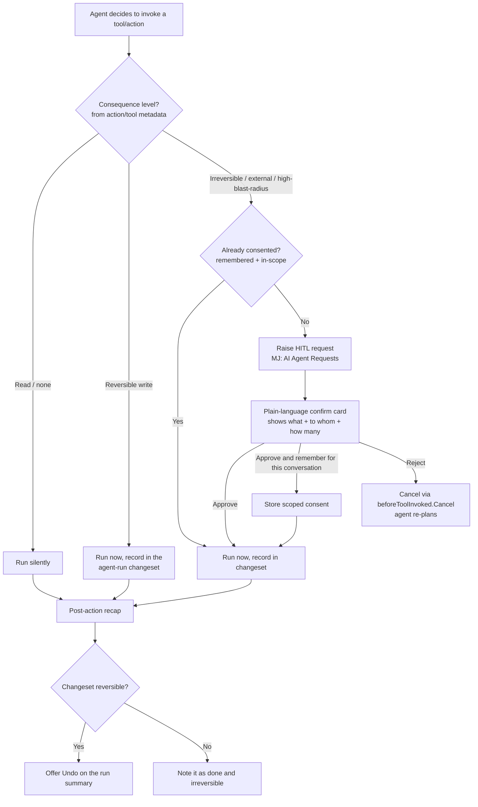
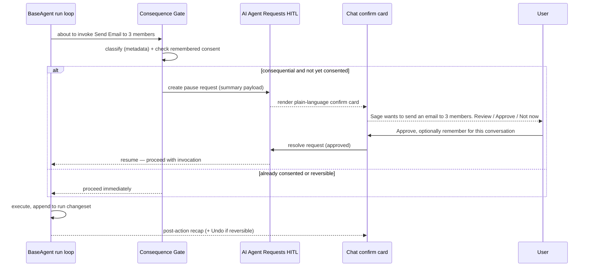
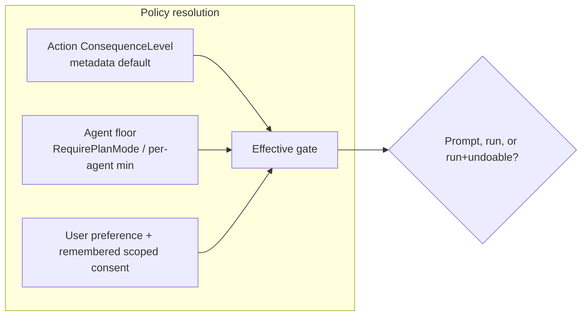

# Agent Trust, By Default (Phase 2d) — Spec for Consideration

**Status:** Proposal / for discussion. No code — this is a design spec.
**Theme:** Business-user usability (see [`business-user-usability.md`](business-user-usability.md), bet 2d).
**One-liner:** Make "the agent asks before it does something it can't take back, and lets me undo the rest" a **framework default** — not something each app has to wire by hand.

---

## 1. Executive overview

MemberJunction's business-user thesis is *"ask questions about your data, and **safely** act on it, without code."* We have the "ask" (Sage/chat) and we're building the "act" (agents, actions, routines, bulk ops). **2d is the "safely."**

Today, safety exists but is either **off by default** or **developer-wired**:

- **Plan Mode** (the whole-run "present a plan, get approval" gate) is a composer toggle that is **off by default** and unexplained to a non-technical user.
- **Per-action confirmation** is *possible* — the chat runtime emits a **cancel-enforced `beforeToolInvoked` event** — but **nothing ships a default handler**, so out of the box an agent can send an email or delete records with no prompt unless an app developer built one.
- **"What did the agent just do?"** is answerable only via developer-shaped run-step forms, not a plain-language recap.

For a business user, that means agents are a *demo* they chat with, not a *tool* they delegate real work to — because the worst case (an agent emails the wrong 400 members) is unrecoverable and they had no chance to stop it.

**2d closes that gap by connecting and defaulting pieces that mostly already exist**, organized around one principle:

> ### Confirm what you can't undo; auto-make-undoable what you can.

Pre-action prompts then concentrate *only* on the genuinely irreversible (send / delete / external API / payment) — which are few — so the feature delivers real safety **without** drowning the user in "Allow?" dialogs (consent fatigue, the #1 way this kind of feature dies).

**Why it's tractable:** this is *default + connect + classify*, not build-from-scratch. The seams already exist (below). The net-new work is a **consequence taxonomy**, the **consent UX** (batching + remembered/scoped choices), an **undo grouping** over MJ's existing Record Changes, and a **plain-language recap**.

**Recommended first slice (2d.1):** a shipped default `beforeToolInvoked` handler + a plain-language confirm card for a small, hardcoded set of unambiguously-irreversible built-in tools. ~80% of the value, small surface, ships independently.

---

## 2. What already exists to build on

| Primitive | Where | What it gives us | Gap 2d fills |
|---|---|---|---|
| Cancel-enforced pre-action event | `conversation-chat-area` `beforeToolInvoked` (`BeforeToolInvokedEventArgs extends CancellableChatEventArgs`) | The runtime **honors `Cancel`** — "stop before it acts" is wired | No **default** handler ships; it's an `@Output` each host must catch |
| "High-consequence agent" concept | `AIAgent.RequirePlanMode` ("for high-consequence agents, e.g. outbound-communication") | Framework already reasons about consequence | Only at **whole-agent** grain — too coarse; no per-action classification |
| HITL pause/resume | `MJ: AI Agent Requests` (Plan Mode approval cards use it) | Durable "pause, ask a human, resume/reject" loop | Not driven by a per-action consequence gate |
| Per-action runtime-UX driver | `BaseEntityActionRuntimeUX` driver + its metadata field ("parameter collection, **dry-run preview, confirmation**, and progress") | An action can already declare how it confirms itself | Scoped to entity-action grid/toolbar today, not **agent** tool calls |
| Reversible change history | Record Changes (built-in entity version control) | The substrate for **undo** | No grouping of an agent run's writes into one reversible changeset |
| Dry-run→apply pattern | Bulk Ops / Record Set Processing | Proven "preview before commit" UX to mirror | Not generalized to arbitrary agent actions |

**Takeaway:** the plumbing is ~80% there. 2d is mostly policy + defaults + UX on top of existing seams.

---

## 3. Design principles

1. **Confirm what you can't undo; auto-make-undoable what you can.** The dividing line, not "confirm everything."
2. **Consent fatigue is the enemy.** A prompt the user reflexively approves is worse than no prompt. Prompt rarely, batch, and let choices be remembered + scoped.
3. **Consequence is metadata, not code.** Which actions are consequential is declared on the action/tool (like `RequirePlanMode` and the RuntimeUX driver already hang off metadata) — never hardcoded in the agent loop. Adding a consequential capability is *data*, not an engine edit.
4. **Admin sets a floor; the user has latitude above it.** A user can loosen within bounds but never below an admin-mandated minimum.
5. **Plain language at every moment.** The user sees *"send an email to 3 members"*, never `invoke sendEmail({...})`.
6. **Reuse, don't reinvent.** HITL = `MJ: AI Agent Requests`; undo = Record Changes; the gate = `beforeToolInvoked`. New concepts only where none exists (the consequence taxonomy).

---

## 4. The three moments of trust

| Moment | Question | Today | 2d target |
|---|---|---|---|
| **Pre-action consent** | "Before it does something irreversible" | Dev-wired only | Default confirm card for consequential actions, content shown in plain language |
| **In-flight visibility** | "What is it doing right now" | Dev-shaped status | Plain-language narration ("Drafting the email… looking up 3 members…") |
| **Post-action accountability** | "What did it just do" | Developer run-step forms | Plain-language recap + **[Undo]** where reversible + **[See changes]** |

---

## 5. Core flow — a tool invocation through the trust gate

**Reading it:** reads are silent; reversible writes run but are captured so they can be undone as a group; only the irreversible/external set stops for consent — and even that is skipped when the user has already granted a remembered, in-scope consent. Rejection uses the existing `Cancel` contract and forces a re-plan.

---

## 6. Pre-action confirmation — sequence

The **pause/resume machinery is the same** one Plan Mode already uses (`MJ: AI Agent Requests`); 2d triggers it per-action from the consequence gate rather than once per run.

---

## 7. The consequence taxonomy (the one genuinely new concept)

A declarative level on the action/tool, resolved by the gate. Straw-man levels:

| Level | Examples | Default behavior |
|---|---|---|
| `None` | read a record, run a view, search | silent |
| `Reversible` | update a field, create an internal record, add to a list | run; capture in the run changeset (undoable) |
| `Irreversible` | delete, mass-update | confirm (or rely on undo if the delete is soft/reversible) |
| `External` | send email/SMS, call a third-party API, post to Slack | **always confirm** (can't be un-sent) |
| `Financial` | charge, refund, transfer | **always confirm**, never remembered by default |

**Where it lives:** on the Action metadata (a `ConsequenceLevel`-style field), so it's per-capability and declarative — the same philosophy as `RequirePlanMode` and the `BaseEntityActionRuntimeUX` driver field. Built-in tools (sendEmail, deleteRecord, external HTTP) get sensible defaults shipped; custom actions declare their own. Unknown/unclassified → treated as `Irreversible` (safe default).

**Precedence:** admin/agent floor wins over user latitude; user latitude wins over the bare metadata default (but can never drop below the floor).

---

## 8. Consent-fatigue mitigations (make-or-break UX)

- **Batch within a turn:** "Sage wants to send 3 emails and update 12 records — review together" instead of 15 dialogs.
- **Remember + scope:** "Always let Sage send emails **in this conversation**" — never a global forever-allow by default. Scopes: this turn / this conversation / this agent-for-this-user (admin-bounded).
- **Threshold high enough to mean something:** only the `Irreversible`/`External`/`Financial` set prompts; everything reversible leans on undo.
- **Show consequence, not mechanism:** recipient count, blast radius, external-ness — the things that make a user pause for the *right* reason.

---

## 9. Undo (the strongest trust primitive)

Group a run's `Reversible` writes into **one agent-run changeset** over Record Changes, so the post-action recap can offer a single **[Undo]**. This is what lets pre-action prompts stay rare: most actions don't need a prompt *because* they're cheaply reversible. Pre-action consent concentrates on the small set that undo genuinely can't cover (a sent email, an external side effect, a payment).

---

## 10. Phased delivery

| Phase | Scope | Ships value | Risk |
|---|---|---|---|
| **2d.1** | Default `beforeToolInvoked` handler + plain-language confirm card for a **hardcoded** irreversible set (send / delete / external) | ~80% — proves the UX, immediate safety | Low; small surface, reuses existing gate |
| **2d.2** | **Metadata-driven** `ConsequenceLevel` + admin-floor/user-preference + remembered-scoped consent | The durable, extensible version | Medium; schema + governance design |
| **2d.3** | **Undo** — group run's reversible writes into a Record-Changes changeset; recap offers Undo | Turns "ask" into "ask less, undo more" | Medium; changeset grouping semantics |
| **2d.4** | Business-facing **run recap** replacing developer run-step forms | The post-action accountability moment | Low–medium; presentation over existing data |

2d.1 is independently shippable and worth doing first.

---

## 11. Effort & risk (honest)

- **Effort:** medium overall; 2d.1 is small. The plumbing (gate, HITL, undo substrate) exists — the work is policy + UX, not new infrastructure.
- **Primary risk: consent fatigue.** Over-prompting makes users click "Allow" blindly, which is *worse* than no gate. The undo-first principle and batching/remembering are the countermeasures, and they must be designed in from 2d.1, not bolted on.
- **Secondary risk: taxonomy creep / miscalibration.** Mislabeling a consequential action as reversible is the dangerous failure. Mitigation: unknown → treated as irreversible (safe default), and the admin floor can force confirmation regardless of metadata.
- **Interaction with Plan Mode:** hybrid model — approve the plan once, then re-confirm only the specific irreversible steps as they execute (catches plan drift without re-approving everything). Reuses the existing re-plan-on-reject loop.

---

## 12. Relationship to bet 2a (NL→FieldRules)

Complementary, not competing. **2a is "safe by construction" for one surface** (Bulk Ops already has dry-run→apply). **2d generalizes that safety to *every* agent action**, which don't have dry-run. 2a's dry-run is the template; 2d is "make confirm/undo a framework property everywhere."

---

## 13. Open questions for discussion

1. **Sequencing:** is 2d.1 the next thing to build (trust before breadth), or does 2a (NL→FieldRules) go first? There's a real case 2d is #1 — it's the gate on *delegation*, not just chat.
2. **Taxonomy home & shape:** extend the existing `BaseEntityActionRuntimeUX`/Action metadata, or a new `ConsequenceLevel` field? How do we classify **built-in framework tools** vs. metadata-defined Actions consistently?
3. **Remembered-consent scope defaults:** conversation-scoped by default feels right — is a user-level (bounded) "always allow this agent to email" ever acceptable, or admin-only?
4. **Undo boundaries:** what's the right unit — per tool call, per turn, or per run? And how do we present partial reversibility (some steps undoable, some not) without confusing the user?
5. **Non-chat surfaces:** routines and scheduled agent runs act with no human present. Does "confirm" degrade to "notify + undo window", and how long?
