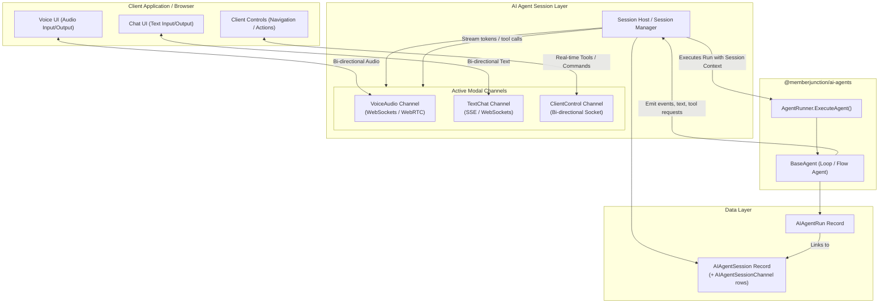

# Architectural Proposal: AI Agent Sessions & Channels

## Overview

This proposal outlines the design for adding real-time, bi-directional streaming modalities (such as voice/audio, canvas sync, and remote client control) to the MemberJunction AI agent framework. 

Rather than creating a new "Voice Agent" type or forking the existing `BaseAgent` / `LoopAgentType` / `FlowAgentType` codebases, we introduce a first-class stateful wrapper: **AI Agent Sessions** and **Channels**. 

Under this design, any existing agent can be executed within the context of a session. The session acts as the long-lived, multi-channel socket orchestrator, while individual `AIAgentRun` executions handle request/response steps.

---

## Architectural Diagram



---

## Core Concepts

### 1. AI Agent Session (`AIAgentSession`)
An **Agent Session** represents a long-running, stateful connection and conversation lifecycle between a user and an agent. 
* **Statefulness**: It persists across multiple individual turns (Runs).
* **Connection Anchor**: It acts as the orchestrator of all active communication sockets.
* **Schema**: Stored in a new `AIAgentSession` table. Each active channel attached to the session is a row in the normalized `AIAgentSessionChannel` table (see [Proposed Database Schema Additions](#proposed-database-schema-additions) for the rationale).

### 2. Pluggable Agent Channel Registry (`AIAgentChannel`)
Channels are completely pluggable, avoiding hardcoded modalities. Developers can register new channel definitions (e.g., voice, text, canvas, video) via the `MJ: AI Agent Channels` database entity.
* **Pluggable Drivers**: Each channel definition specifies a `ServerPluginClass` and `ClientPluginClass`.
* **ClassFactory Resolution**: The Session Host and client application instantiate these plugin classes dynamically at runtime using MemberJunction's standard `ClassFactory` registry.

### 3. Pluggable Interfaces (`IAgentChannelServer` & `IAgentChannelClient`)
New channels snap into the framework by implementing standard pluggable interfaces:
* **`IAgentChannelServer`**: Defines how the server-side channel manages its WebSocket/WebRTC connections, handles inbound messages, and streams outbound data/audio chunks.
* **`IAgentChannelClient`**: Defines how the client-side channel initiates connection sockets, handles incoming audio/visual renderings, and pushes user interactions (like speech audio) up to the server.

### 4. Agent Run (`AIAgentRun`)
An **Agent Run** remains the single-turn execution unit. When a user input is received via any channel, the Session Host triggers an `AIAgentRun`.
* **Session ID Propagation**: The `ExecuteAgentParams` struct is extended to accept an `agentSessionID` (distinct from the existing transport `sessionID`).
* **Streaming Hooks**: The agent streams its output (e.g., text tokens, UI commands, or audio frames) back to the session's pluggable channels in real time.

---

## Relationship: Sessions vs. Conversations

An important question is how the proposed **Session** concept relates to the existing **Conversation** (`MJConversation`) and **ConversationDetail** (`MJConversationDetail`) entities in the MemberJunction database.

They are **not** the same concept, but they are tightly coupled. The table below outlines the core differences:

| Dimension | Conversation (`MJConversation`) | Session (`AIAgentSession`) |
|---|---|---|
| **Nature** | Persistent **Document of Record** | Temporary **Operational Connection** |
| **Lifecycle** | Long-term history (persists forever) | Transience (created at call connect, closed at disconnect) |
| **State** | Passive message/transcript log | Active socket server routing, WebRTC channels, codecs |
| **Multi-channel** | N/A (stores final text/media output) | Yes (coordinates `VoiceAudio`, `ClientControl`, `TextChat`) |
| **Multi-run mapping** | Linked to multiple individual turns/runs | Grouping wrapper; associates consecutive runs to one session |

### Integration Model

Rather than replacing Conversations with Sessions, the two systems collaborate:

1. **Mapping**: An `AIAgentSession` record contains a foreign key to an `MJConversation` record (`ConversationID`).
2. **Session Initialization**:
   * When a client initiates a real-time call (starts a session), the client can pass an existing `ConversationID`. This instructs the Session Host to load the conversation's historical messages and inject them as initial context for the LLM.
   * If no `ConversationID` is passed, the Session Host automatically creates a new `MJConversation` record and associates the session with it.
3. **Timeline Overlay mapping (`AgentSessionID` on Details)**:
   * To track which messages were sent during which active session, we add a nullable `AgentSessionID` column to the `ConversationDetail` table.
   * If a message is typed in standard text chat *outside* of any active call, its `AgentSessionID` is `NULL`.
   * If a message is spoken or typed *during* a live call session, its `AgentSessionID` is populated with the active `AIAgentSession.ID`.
4. **Conversation Timeline Overlays (Time Series)**:
   * A single `MJConversation` acts as a master chronological timeline container.
   * Over the lifespan of that conversation, the user can have **0 or more sequential active sessions** (e.g. starting a voice call, hanging up, typing some text, then starting another voice call).
   * These sessions represent specific time intervals (`CreatedAt` $\rightarrow$ `ClosedAt`) that overlay the chronological sequence of conversation details.
   * In the UI, this allows for rendering a unified, rich timeline:
     * Standard text messages are rendered sequentially.
     * Messages generated during an active session can be visually grouped, bordered, or decorated (e.g. as a "Voice Call Session" block with call duration, participant details, and a voice recording playback widget).
5. **Session Termination**:
   * When the user hangs up or the socket is closed, the `AIAgentSession` record is updated to `Status = 'Closed'`.
   * The WebSocket connection terminates, but all generated `MJConversationDetail` records and the `MJConversation` itself remain fully active and searchable. A user can easily start a new voice session on the same conversation later.

---

## Proposed Database Schema Additions

To support this model, we propose adding three new entities to the MemberJunction schema.

> [!NOTE]
> **MJ conventions applied below:**
> - `__mj_CreatedAt` / `__mj_UpdatedAt` are omitted — CodeGen adds them automatically. (`AIAgentSessionChannel` therefore gets `__mj_UpdatedAt` for free, which is why it carries no hand-rolled "last updated" column.)
> - Status-style columns use `CHECK` constraints so CodeGen emits **string-union types** (e.g. `'Active' | 'Idle' | 'Closed'`) instead of bare `string`.
> - PK defaults use `NEWSEQUENTIALID()` per the migration guide.
> - The **entity Names** (metadata) use the `MJ:` prefix — `MJ: AI Agent Channels`, `MJ: AI Agent Sessions`, `MJ: AI Agent Session Channels` — even though the **table names** do not. The persisted session FK columns are named **`AgentSessionID`**, not `SessionID`, to avoid collision with the transport `sessionID` (see [Unified Session Transport](#unified-session-transport)).
> - `AIAgentChannel` rows are **reference data** and are seeded via the metadata-file / `mj sync` path, **not** SQL `INSERT`s.

### 1. `AIAgentChannel` (Pluggable Channel Registry)
```sql
CREATE TABLE [__mj].[AIAgentChannel] (
    [ID] UNIQUEIDENTIFIER NOT NULL PRIMARY KEY DEFAULT NEWSEQUENTIALID(),
    [Name] NVARCHAR(100) NOT NULL UNIQUE, -- e.g., 'VoiceAudio', 'TextChat', 'ClientControl', 'CanvasSync'
    [Description] NVARCHAR(1000) NULL,
    [ServerPluginClass] NVARCHAR(250) NOT NULL, -- Serves as key for ClassFactory.CreateInstance() on Server
    [ClientPluginClass] NVARCHAR(250) NOT NULL, -- Serves as key for ClassFactory.CreateInstance() on Client
    -- Which transport plane this channel rides (see Unified Session Transport).
    [TransportType] NVARCHAR(20) NOT NULL DEFAULT 'PubSub',
    [ConfigSchema] NVARCHAR(MAX) NULL, -- JSON Schema to validate channel parameters
    [IsActive] BIT NOT NULL DEFAULT 1,
    CONSTRAINT [CK_AIAgentChannel_TransportType]
        CHECK ([TransportType] IN ('PubSub', 'WebRTC', 'WebSocket'))
);
```

### 2. `AIAgentSession` (AI Agent Session)
The long-lived session record. Per-channel state is **normalized** into `AIAgentSessionChannel` (below) rather than an `ActiveChannels` JSON blob — see the rationale note after the schema. `Config` remains JSON because it is low-traffic, free-form session state. Uses `DATETIMEOFFSET` on `LastActiveAt` for timezone tracking.
```sql
CREATE TABLE [__mj].[AIAgentSession] (
    [ID] UNIQUEIDENTIFIER NOT NULL PRIMARY KEY DEFAULT NEWSEQUENTIALID(),
    [AgentID] UNIQUEIDENTIFIER NOT NULL FOREIGN KEY REFERENCES [__mj].[AIAgent]([ID]),
    [UserID] UNIQUEIDENTIFIER NOT NULL FOREIGN KEY REFERENCES [__mj].[User]([ID]),
    [Status] NVARCHAR(20) NOT NULL DEFAULT 'Active',
    [ConversationID] UNIQUEIDENTIFIER NULL FOREIGN KEY REFERENCES [__mj].[Conversation]([ID]),
    -- When a user resumes a prior (closed) session, this points at it. Mirrors
    -- AIAgentRun.LastRunID — a new session is created, chained to its predecessor.
    [LastSessionID] UNIQUEIDENTIFIER NULL FOREIGN KEY REFERENCES [__mj].[AIAgentSession]([ID]),
    -- The server node currently hosting this session's in-memory sockets (for affinity / janitor reconciliation).
    [HostInstanceID] NVARCHAR(200) NULL,
    [Config] NVARCHAR(MAX) NULL, -- JSON block for session-specific state/variables
    [LastActiveAt] DATETIMEOFFSET NOT NULL DEFAULT SYSDATETIMEOFFSET(),
    [ClosedAt] DATETIMEOFFSET NULL,
    CONSTRAINT [CK_AIAgentSession_Status]
        CHECK ([Status] IN ('Active', 'Idle', 'Closed'))
);
```

### 3. `AIAgentSessionChannel` (Active Channel Instances)
One row per channel instance attached to a session — the normalized replacement for the `ActiveChannels` JSON array.
```sql
CREATE TABLE [__mj].[AIAgentSessionChannel] (
    [ID] UNIQUEIDENTIFIER NOT NULL PRIMARY KEY DEFAULT NEWSEQUENTIALID(),
    [AgentSessionID] UNIQUEIDENTIFIER NOT NULL FOREIGN KEY REFERENCES [__mj].[AIAgentSession]([ID]),
    [ChannelID] UNIQUEIDENTIFIER NOT NULL FOREIGN KEY REFERENCES [__mj].[AIAgentChannel]([ID]),
    [Status] NVARCHAR(20) NOT NULL DEFAULT 'Connecting',
    [SocketUrl] NVARCHAR(500) NULL, -- NULL for PubSub channels (they ride the shared subscription)
    [Config] NVARCHAR(MAX) NULL, -- JSON, validated against AIAgentChannel.ConfigSchema
    [LastActiveAt] DATETIMEOFFSET NOT NULL DEFAULT SYSDATETIMEOFFSET(),
    [DisconnectedAt] DATETIMEOFFSET NULL,
    CONSTRAINT [CK_AIAgentSessionChannel_Status]
        CHECK ([Status] IN ('Connecting', 'Connected', 'Paused', 'Disconnected')),
    -- A session attaches a given channel definition at most once at a time.
    CONSTRAINT [UQ_AIAgentSessionChannel] UNIQUE ([AgentSessionID], [ChannelID])
);
```

> [!NOTE]
> **Why normalize out of `ActiveChannels` JSON?** The session row itself is low-traffic, but its *channels* are not: each channel independently connects, heartbeats, pauses, and disconnects, and (in voice scenarios) several are live at once. Keeping them in one JSON column on the session means concurrent channel state writes all contend on — and risk clobbering — the same row (lost-update races). Separate rows give per-channel row-level writes, FK integrity to `AIAgentChannel`, and clean queries ("show all `Connected` voice channels", "find sessions with an orphaned channel"). The cost is one extra small table, which is cheap. `Config` stays JSON on both tables because it is genuinely free-form and write-rarely.

### 4. Schema Updates (Existing Tables)

We add a nullable foreign key pointing to the session on both `AIAgentRun` and `ConversationDetail` records. The column is named **`AgentSessionID`** (not `SessionID`) to stay distinct from the transport `sessionID`:

```sql
-- Link individual agent runs to their parent session
ALTER TABLE [__mj].[AIAgentRun]
ADD [AgentSessionID] UNIQUEIDENTIFIER NULL FOREIGN KEY REFERENCES [__mj].[AIAgentSession]([ID]);

-- Link specific messages in a conversation to the session in which they occurred
ALTER TABLE [__mj].[ConversationDetail]
ADD [AgentSessionID] UNIQUEIDENTIFIER NULL FOREIGN KEY REFERENCES [__mj].[AIAgentSession]([ID]);
```

---

## Pluggable Channel Interfaces

To allow channels (text, audio, canvas, video, etc.) to connect dynamically as plugins, the framework defines standard client and server interfaces. In accordance with MemberJunction design guidelines, all public properties and methods use **PascalCase**:

### 1. Server-Side Channel Interface (`IAgentChannelServer`)

Implemented by the server-side channel plugin. Responsible for managing the WebSockets/WebRTC session host connections and streaming data back and forth.

> [!IMPORTANT]
> The interface below is the **conceptual** contract. The [Unified Session Transport](#unified-session-transport) section that follows **refines** it: channels do **not** own the client-facing socket (`Socket`/`OnClientConnect`/`SendToClient` are removed), and the loosely-typed `any` payloads are replaced with a typed `SessionEnvelope`. A channel is handed an injected `ISessionTransport` and becomes pure routing/translation logic. Read both together — the unified version is the one we build.

```typescript
export interface IAgentChannelServer {
    /** The active Session ID */
    readonly SessionID: string;

    /** The dynamic Channel Definition ID from AIAgentChannel */
    readonly ChannelID: string;

    /** Connection status of this channel (e.g., 'Connected', 'Disconnected', 'Paused') */
    Status: string;

    /** Configuration parameters validated against the channel's ConfigSchema */
    Config: Record<string, any>;

    /**
     * Called by the Session Host when resolving and instantiating the plugin class.
     */
    Initialize(SessionID: string, ChannelID: string, Config: Record<string, any>): Promise<void>;

    /**
     * Handler invoked when the client establishes a socket connection.
     * @param Socket The server-side socket instance (WebSocket or WebRTC peer)
     */
    OnClientConnect(Socket: any): Promise<void>;

    /**
     * Handler invoked when the server socket receives an inbound message from the client.
     */
    OnClientMessage(Message: any): Promise<void>;

    /**
     * Sends a packet directly to the connected client socket.
     */
    SendToClient(Message: any): Promise<void>;

    /**
     * Closes the active socket connection and cleans up server resources.
     */
    Close(): Promise<void>;
}
```

### 2. Client-Side Channel Interface (`IAgentChannelClient`)

Implemented by the client-side channel plugin. Responsible for establishing socket tunnels from the browser/native app, capturing raw user input (like mic audio), and rendering the agent's real-time events.

```typescript
export interface IAgentChannelClient {
    /** The active Session ID */
    readonly SessionID: string;

    /** The dynamic Channel Definition ID from AIAgentChannel */
    readonly ChannelID: string;

    /** Status of the client connection */
    Status: string;

    /** Configuration parameters */
    Config: Record<string, any>;

    /**
     * Initializes the client driver with session context.
     */
    Initialize(SessionID: string, ChannelID: string, Config: Record<string, any>): Promise<void>;

    /**
     * Initiates the socket/WebRTC connection to the Session Host socket URL.
     */
    Connect(SocketUrl: string): Promise<void>;

    /**
     * Sends a payload directly up to the server socket.
     */
    SendToServer(Message: any): Promise<void>;

    /**
     * Callback handler fired when the client socket receives an event from the server.
     */
    OnServerMessage(Message: any): void;

    /**
     * Disconnects the socket connection and cleans up client-side listeners/audio buffers.
     */
    Disconnect(): Promise<void>;
}
```

> [!NOTE]
> **Angular Integration**: In the MemberJunction frontend, it is assumed that the implementor of the `IAgentChannelClient` interface will also be (or provide) an Angular component. This component will handle rendering the visual elements for that specific channel (e.g., voice wave visualizer, canvas overlays, or real-time terminal sync) and snap into the future Session UI shell. Additional metadata and registry properties to support dynamic component instantiation will be defined as part of the client UI implementation.

---

## Parallel Channel Orchestration & Tool Routing

To support both server-side LLM tool execution (like Gemini Live's native function calling) and client-side UI updates (like showing a dashboard chart), tool calling is routed dynamically depending on the channel's nature:

1. **Parallel Channel Coordination**:
   Within a single `AIAgentSession`, multiple channel plugins run concurrently. For example, a `VoiceAudio` channel handles the continuous duplex stream of raw audio, while a `ClientControl` channel handles structured JSON events.
2. **Channel-Specific Tool Translators**:
   The `IAgentChannelServer` plugin acts as the translation layer between the MemberJunction Agent's tool definition and the channel's protocol:
   * **Upstream Tool Calls (e.g., Gemini Live / OpenAI Realtime)**: The plugin registers the agent's tools with the LLM provider's WebSocket during session handshake. When the provider's API emits a `tool_call` frame, the server plugin intercepts it, executes the MJ tool, and sends the `tool_response` frame back upstream.
   * **Downstream Tool Calls (Client UI Actions)**: When the agent invokes a UI-oriented tool, the server plugin forwards a JSON execution payload downstream over the `ClientControl` channel to the client application, returning the client's response to the agent.

---

## Unified Session Transport

> [!IMPORTANT]
> This is the single most important integration decision in the proposal. MemberJunction **already** ships a real-time, bi-directional, session-scoped transport — and most of what "Channels" needs is a generalization of it, not a new parallel stack. This section defines how all socket traffic (existing and new) is unified.

### What already exists (and must be reused, not duplicated)

The current agent runtime already streams to clients and accepts mid-run callbacks over a **graphql-ws subscription + in-process PubSub** transport, scoped by a per-connection `sessionID` (the browser-generated `x-session-id` value). Today this is fragmented across **two separate subscriptions plus inbound mutations**:

| Concern | Current wire | Source |
|---|---|---|
| Progress / token streaming / completion | `subscription statusUpdates(sessionId)` | `GraphQLDataProvider.PushStatusUpdates`, `RunAIAgentResolver.PublishProgressUpdate` |
| Client tool **requests** (server → client) | `subscription ClientToolRequest(sessionID)` | `GraphQLDataProvider.ClientToolRequests`, `ClientToolRequestManager` |
| Client tool **responses** + run triggers (client → server) | `RespondToClientToolRequest`, `RunAIAgent`, `UpdateClientToolDefinitions` mutations | `MJServer` resolvers |
| Server-side fan-out bus | in-process `PubSubEngine` | `PubSubManager` |

The "ClientControl" / "TextChat" channels in this proposal are, functionally, a re-skin of the above. Voice (binary audio) is the **only** genuinely new transport need. The unification goal: collapse the fragmentation into one model and add new transport *only* for media.

### ⚠️ Two different things both named `sessionID`

There is a **naming collision** that must be resolved before implementation:

- **Transport `sessionID`** (exists today): a per-browser-connection correlation id (localStorage UUID → `x-session-id` header). Scopes PubSub delivery to one socket. **Not persisted.**
- **`AIAgentSession.ID`** (this proposal): a persisted, long-lived session record.

These are orthogonal — one connection can outlive/underlie many agent sessions, and reconnects change the transport id while the agent session persists. **Decision:** the persisted concept is referred to everywhere as **`AgentSessionID`** (param) / **`AgentSessionID`** (column), and the existing transport id keeps the name `sessionID` (or is renamed `connectionID`). They are carried side-by-side, never merged.

### Core principle: channels are logical streams; the session owns the transport; one envelope for everything

Instead of each feature owning its own wire, **a session owns one client-facing transport, and progress / tokens / tool calls / text / control / signaling are all just typed messages multiplexed over it by `ChannelID`.** A channel never touches the client-facing socket; it is handed a transport and calls `Send`.

#### Layer 1 — One envelope

The three ad-hoc JSON shapes collapse into a single discriminated-union envelope (note: no `any`, per MJ typing rules):

```typescript
/** JSON-safe value type used throughout channel payloads. */
export type JSONValue =
    | string | number | boolean | null
    | JSONValue[] | { [key: string]: JSONValue };

/** Every message on every channel, in or out, is one of these. */
export interface SessionEnvelope<TPayload extends ChannelPayload = ChannelPayload> {
    /** Persisted AIAgentSession.ID — NOT the transport/connection id. */
    AgentSessionID: string;
    /** Which logical channel (AIAgentChannel.ID). */
    ChannelID: string;
    /** Per-channel ordering / dedupe. */
    Seq: number;
    Direction: 'ToClient' | 'ToServer';
    Payload: TPayload;
}

/** Discriminated union, keyed by Type. Channels add their own variants. */
export type ChannelPayload =
    | { Type: 'progress'; Step: string; Message: string }
    | { Type: 'streaming'; Content: string; IsComplete: boolean }
    | { Type: 'tool-request'; RequestID: string; ToolName: string; Params: string }
    | { Type: 'tool-response'; RequestID: string; Success: boolean; Result?: string }
    | { Type: 'text'; Role: 'user' | 'assistant'; Content: string }
    | { Type: 'control'; Command: string; Args: Record<string, JSONValue> }
    | { Type: 'signaling'; SDP?: string; ICE?: JSONValue };  // WebRTC negotiation
```

Today's `statusUpdates.message` (a JSON string) and the `ClientToolRequest` payload both become `SessionEnvelope` variants. New channels add new `Payload` members — they do **not** add new subscriptions.

#### Layer 2 — One transport interface, swappable implementation

This is the actual "unify the sockets" move. The transport is owned by the **Session Host**, not by individual channels:

```typescript
export interface ISessionTransport {
    readonly AgentSessionID: string;
    /** Push an envelope toward the client. */
    Send(envelope: SessionEnvelope): Promise<void>;
    /** Fires when an inbound envelope arrives from the client. */
    OnMessage(handler: (envelope: SessionEnvelope) => void): void;
    Close(): Promise<void>;
}
```

The server channel interface then **loses all socket ownership** and just receives the injected transport:

```typescript
export interface IAgentChannelServer<TConfig extends Record<string, JSONValue> = Record<string, JSONValue>> {
    readonly ChannelID: string;
    Config: TConfig;
    Initialize(transport: ISessionTransport, config: TConfig): Promise<void>;
    /** Inbound payload for THIS channel, already demultiplexed by the host. */
    OnClientMessage(payload: ChannelPayload): Promise<void>;
    Close(): Promise<void>;
    // To talk to the client, the channel calls transport.Send(...). It owns no client-facing socket.
}
```

Two implementations to start:

- **`PubSubSessionTransport`** (default): wraps the *existing* `PubSubManager` + graphql-ws subscription. `Send` publishes the envelope to the session's topic; inbound arrives via a single generalized `SendSessionMessage(envelope)` mutation. This is a refactor of what `RunAIAgentResolver` and `ClientToolRequestManager` already do — the two existing subscriptions collapse into one session multiplex.
- **`WebRTCSessionTransport`**: instantiated **only** for channels that need binary/low-latency media. Its signaling rides the PubSub transport (`'signaling'` payload); only audio/video bytes go peer-to-peer.

#### Layer 3 — Three planes (this is where the realtime-LLM upstream fits)

The proposal's [Parallel Channel Orchestration & Tool Routing](#parallel-channel-orchestration--tool-routing) section introduces a **third** connection axis — the server plugin's socket to a realtime LLM provider (Gemini Live / OpenAI Realtime). It is essential to keep these planes distinct:

| Plane | Endpoints | Carries | Transport | Owner |
|---|---|---|---|---|
| **Control** | Server ↔ Client | progress, tokens, tool req/resp, text, control commands, **WebRTC signaling** | `PubSubSessionTransport` (existing graphql-ws pipe, multiplexed) | Session Host |
| **Media** | Server ↔ Client | raw audio/video frames | `WebRTCSessionTransport`, negotiated *over* the control plane | Session Host |
| **Upstream provider** | Server ↔ LLM provider | provider realtime socket, native `tool_call`/`tool_response` frames | provider SDK / WebSocket | **the Channel plugin** |

This refines the "channels don't own sockets" rule precisely: a channel does **not** own the **client-facing** socket (that is the unified `ISessionTransport`), but a realtime-voice channel **may** own an **upstream** connection to its external provider. The upstream socket is a channel-internal implementation detail and is never exposed to the client directly.

So a `VoiceAudio` channel backed by Gemini Live is really doing three things at once: holding an upstream provider socket (plane 3), pumping audio over WebRTC (plane 2), and emitting transcripts / receiving tool results over the shared control plane (plane 1).

#### Unified tool routing: one registry, three delivery edges

The tool-routing behavior described earlier becomes a single abstraction over the MJ tool registry, with the channel choosing the delivery edge per tool:

1. **Server-side tool** → normal MJ action execution inside the run (no socket).
2. **Downstream (client UI) tool** → control-plane `tool-request` / `tool-response` envelope, reusing **`ClientToolRequestManager`**'s existing promise-tracking (it keeps its in-memory `Map`; it just publishes through `ISessionTransport` instead of a hardcoded topic). This is the proposal's "Downstream Tool Calls".
3. **Upstream (provider-native) tool** → the channel translates between the MJ tool definition and the provider's frame format on its upstream socket. This is the proposal's "Upstream Tool Calls".

All three resolve to the same MJ tool definition + execution; only the edge differs.

### How existing pieces fold in

- **`ClientToolRequestManager`** keeps its role (pending-promise tracking by `RequestID`) but emits via `transport.Send({ Payload: { Type: 'tool-request', ... } })`; `RespondToClientToolRequest` becomes one `Payload.Type` on the generic inbound mutation.
- **`RunAIAgentResolver`** progress/streaming callbacks emit `progress` / `streaming` envelopes instead of bespoke JSON.
- **Client `AgentClientSession`** subscribes once and demultiplexes by `ChannelID`, replacing the two separate `PushStatusUpdates()` + `ClientToolRequests()` subscriptions. The proposal's `IAgentChannelClient` should be implemented **by / composed into** this existing client session — not stood up as a second client-session concept.

### Scaling unlock

Because everything now publishes through one `ISessionTransport` / `PubSubManager`, making the **control plane** multi-instance is a single swap: back `PubSubManager` with Redis pub/sub and every JSON channel becomes cross-node at once. The **media plane** (WebRTC) and the **upstream provider** socket are inherently node-local, so those — and only those — require session affinity (sticky routing) at the load balancer. This is now an explicit, contained constraint rather than an implicit one.

### Incremental, non-breaking rollout

1. Introduce `SessionEnvelope` + `ISessionTransport`; implement `PubSubSessionTransport` over the *current* topics/subscriptions (no wire change yet).
2. Refactor `RunAIAgentResolver` + `ClientToolRequestManager` to emit/consume envelopes through the transport. Behavior identical; the two subscriptions collapse to one multiplex.
3. Add the generic `SendSessionMessage` inbound mutation; migrate `RespondToClientToolRequest` onto it (keep the old mutation as a thin shim for one release).
4. Only then add `WebRTCSessionTransport` + the `VoiceAudio` channel and any upstream-provider channels. Voice becomes purely additive on top of a unified, already-proven control plane.

---

## Session Lifecycle, Heartbeat & Reconciliation

A session is a **long-lived record backed by in-memory, node-local resources** (open sockets, WebRTC peers, upstream provider connections, the `ClientToolRequestManager` pending-request map). The hard part of any such design is the **mismatch between durable DB state and volatile process state**: a server crash or redeploy vaporizes the sockets but leaves rows reading `Status = 'Active'` forever. This section defines how that mismatch is kept from accumulating.

### State model

```
            client activity / channel connect
   ┌──────────────────────────────────────────────┐
   ▼                                                │
[Active] ──no activity > IdleThreshold──▶ [Idle] ──┘ (reactivates on any inbound envelope)
   │                                         │
   │ explicit hang-up / Close()              │ no activity > CloseThreshold
   ▼                                         ▼
[Closed] ◀───────────── janitor / graceful shutdown ─────────────
```

- **Active** — at least one channel connected and traffic flowing.
- **Idle** — connected but quiet beyond `IdleThreshold` (e.g. 2 min). Sockets may be kept warm or torn down per channel policy; the session is cheaply resumable.
- **Closed** — terminal. `ClosedAt` set, all `AIAgentSessionChannel` rows set to `Disconnected`, in-memory resources released, `ClientToolRequestManager.ClearSession(...)` called, any in-flight `AIAgentRun` aborted via its `cancellationToken`.

### Heartbeat

- Each connected channel sends a lightweight heartbeat (or any inbound envelope counts as one). The Session Host updates `AIAgentSessionChannel.LastActiveAt` and bubbles the max up to `AIAgentSession.LastActiveAt`.
- Heartbeats use `SetSettingDebounced`-style coalescing so a chatty audio channel does not hammer the DB — at most one `LastActiveAt` write per session per few seconds.
- Missing N consecutive heartbeats on a channel → that channel row goes `Disconnected`; when the **last** channel disconnects, the session transitions `Active → Idle`.

### The janitor (orphan reconciliation)

A `BaseSingleton` **SessionJanitor** runs on each server instance on a timer (e.g. every 60s) and also once at startup. It performs two sweeps:

1. **Own-host recovery (startup):** On boot, an instance claims its identity in `HostInstanceID` (e.g. `hostname:pid:bootId`). Any `AIAgentSession` row still `Active`/`Idle` whose `HostInstanceID` equals a *previous* boot of this host (or this host with a different `bootId`) is an orphan from a crash/redeploy → force `Closed`. This is the primary defense against the "Active forever" leak.
2. **Global staleness sweep (periodic):** Regardless of host, any `Active`/`Idle` session whose `LastActiveAt` is older than `CloseThreshold` (e.g. 15 min) is force-`Closed`. This catches sessions whose owning instance died without a clean boot record (scaled-down pod, OOM kill) and never came back to run its own-host recovery.

Both sweeps use **keyset pagination** (`AfterKey`) if the backlog is large, per the MJ deep-pagination guide, and write through `BaseEntity.Save()` so Record Changes captures the transition.

### Multi-instance notes

- The janitor's global sweep is **idempotent and safe to run concurrently** on every instance — closing an already-`Closed` session is a no-op, and the `Status` CHECK + last-writer-wins on `ClosedAt` make races harmless.
- `HostInstanceID` is also what enables **session affinity** for the media/upstream planes: a reconnecting client for an existing media session should be routed back to the owning host while it is alive; if that host is gone, the client simply starts a fresh session on a new host (the Conversation history is intact, so nothing is lost — see [Relationship: Sessions vs. Conversations](#relationship-sessions-vs-conversations)).
- When `PubSubManager` is later backed by Redis, the **control plane** survives instance loss transparently; only media/upstream sockets need the affinity + janitor recovery described here.

### Graceful shutdown

On `SIGTERM`/redeploy, the instance runs the janitor's close path for its own sessions first (flush transcripts, set `Closed`, notify clients over the control plane so they can show "call ended / reconnecting"), then exits. This turns the common redeploy case into a clean close rather than an orphan the periodic sweep has to mop up later.

---

## Real-Time Modality

Real-time interaction (voice today, video later) does **not** run through the standard loop agent. The loop agent is intentionally **asynchronous and long-running** — forcing it to drive a live, low-latency conversation produces a poor experience, and modern real-time models (Gemini Live, GPT Realtime, the Eleven Labs stack) own the listen-reason-speak loop themselves. So we keep the loop agent exactly as it is and introduce a **new agent type** that wraps a real-time model and runs inside a session.

Critically, this still gives us broad coverage. Rather than rebuilding every agent for voice, we ship a single generic **Voice Co-Agent** that can supplement **any** existing agent (see below) — so adding real-time to a new agent is configuration, not code.

### The model primitive: `BaseRealtimeModel`

A new sibling base class alongside the existing capability classes in `packages/AI/Core/src/generic/` (`baseLLM`, `baseEmbeddings`, `baseAudio`, `baseImage`, `baseVideo`, …), resolved like all of them through the ClassFactory by `AIModelType` + `DriverClass`. It is the **lowest-level primitive** — the native way to talk to a streaming, bidirectional model.

> [!NOTE]
> **Naming:** it is `BaseRealtimeModel`, **not** `BaseRealtimeVoice`/audio. The contract is *streaming, full-duplex, tool-calling* — modality-agnostic — so the same primitive covers voice now and video later. If a modality ever needs specialization we can add `audio`/`video` subclasses, but the base stays generic. (Distinct from `baseAudio.ts`'s `BaseAudioGenerator`, which is request/response STT/TTS — a different shape, and not the real-time path.)

```typescript
export abstract class BaseRealtimeModel extends BaseModel {
    /** Opens a stateful duplex session; the returned handle is the long-lived object. */
    public abstract StartSession(params: RealtimeSessionParams): Promise<IRealtimeSession>;
}

export interface IRealtimeSession {
    SendInput(chunk: ArrayBuffer): void;                          // client media frames in (audio now, video later)
    /** Register the agent's tools with the provider, in the provider's native function-calling format.
     *  Uses the unified client-or-server tool metadata — NOT the client-specific ClientToolMetadata. */
    RegisterTools(tools: AgentToolMetadata[]): Promise<void>;
    OnOutput(handler: (chunk: ArrayBuffer) => void): void;        // model media out → media plane
    OnTranscript(handler: (t: RealtimeTranscript) => void): void;// text stream → control plane + ConversationDetail
    OnToolCall(handler: (call: RealtimeToolCall) => void): void; // → MJ tool execution under contextUser
    OnInterruption(handler: () => void): void;                   // barge-in → cancellationToken
    OnUsage(handler: (u: RealtimeUsage) => void): void;          // token/usage telemetry → AIPromptRun
    Close(): Promise<void>;
}
```

The driver translates MJ tool definitions into the provider's native function schema and provider `tool_call` frames back into MJ tool execution — this is the **upstream-provider plane** from [Parallel Channel Orchestration & Tool Routing](#parallel-channel-orchestration--tool-routing). New `AIModelType`: **`Realtime`**.

### The `Realtime` agent type & the Voice Co-Agent

We add a new **agent type** named **`Realtime`** — a first-class peer of Loop and Flow, with its own class, that drives a `BaseRealtimeModel` session instead of an iterative reasoning loop. Because it is a *real MJ agent type*, it inherits the entire framework for free: server tools (actions), client tools, artifacts, prompts, memory, permissions, observability. We are not building a parallel runtime — just a new agent type.

The first agent we ship of this type is the **Voice Co-Agent** (working name — chosen to avoid "impersonation", which can read badly and can make models refuse). It is framed as a **companion / co-agent** that voices *on behalf of* a target agent:

- **Generic by design — the target is a runtime parameter.** One Voice Co-Agent definition can front **any** MJ agent. You point it at Sage, at Query Builder, at anything, and it "just works" — that is how we recover the universal-voice goal without forking every agent.
- **The co-agent's job:** hold a natural, low-latency conversation as the target agent's voice. It is told who it is acting for, what that agent can do, the conversation so far, and the user's memory. It is explicitly told it cannot do everything synchronously, but it can **invoke the real agent** to do actual work (seconds → minutes) and narrate while that runs.
- **Prompt-safety:** the system prompt must use *companion / "voice for"* framing, never "pretend to be / impersonate" — otherwise the model may refuse ("I'm not allowed to do that").
- **Future:** a co-agent could blend **two or more** agents' capabilities into one voice persona. Out of scope for the first build — start with a single target.

### Why "just another MJ agent" is the whole point

Because the Voice Co-Agent is a normal agent, tool wiring is already solved:

- **Primary tool — invoke the target agent.** The co-agent's headline capability is a tool that runs the full async (loop/flow) agent and feeds results back to the model. Sub-agents are **not** exposed — the co-agent only talks to the top-level agent (the target's own loop handles its sub-agents).
- **Plus normal server & client tools and artifacts.** Just like any agent, a Voice Co-Agent can be given fast server tools (actions), client tools, and artifact capabilities directly — no special plumbing.

### Execution model & run topology

- **One prompt run per session.** The entire real-time session is a single `AIPromptRun` (the full prior conversation dumped in as initial context) wrapped in a single long-lived `AIAgentRun`. It streams both directions with **no JSON intermediation** — inputs go straight to the model, outputs stream straight back. Usage/telemetry accrues over the session and is finalized at close (`OnUsage` → the prompt run).
- **Delegated work is normal runs.** When the co-agent invokes the target agent, that is its own `AIAgentRun`, linked to the co-agent's run via **`ParentRunID`** and sharing the same **`AgentSessionID`** — so the delegation tree is visible and everything groups under the session.
- **Long-running tools.** The pattern is *fire the tool call → keep talking / fill the space → push the result when ready*. The exact async-function semantics differ per provider (Gemini Live vs GPT Realtime vs Eleven Labs); the driver owns that mapping. **Open item** (see below) — very long work (minutes) is a known weak spot for voice.

### Context & memory injection (shared helper — build in this PR)

The co-agent needs the **same context the loop agent already assembles**: relevant notes/examples (the MJ memory system) plus the conversation history up to the session start. Today that orchestration lives in `BaseAgent.InjectContextMemory` (and the nearby `InjectPreExecutionRAG`) in `packages/AI/Agents/src/base-agent.ts`. The underlying retrieval (`AgentContextInjector`, reranking) is **already a reusable class**; what is not shared is the wrapper that reads the agent's inject flags, builds the scope params, and formats the system message.

**Task for this PR:** extract that orchestration into a shared helper (e.g. `AgentMemoryContextBuilder`) callable from **both** `BaseAgent` and the new `Realtime` agent type, so the co-agent injects memory identically — no duplicated logic. The front-end is responsible for assembling and passing the initial context payload (conversation context + memory hints) when it starts the session.

### Channel composition

`Realtime` is an **agent type, not a channel.** Within a session, the I/O surfaces are channels: a **VoiceAudio** channel (media plane — the realtime model binds to it and owns the provider socket per the upstream plane), and optionally **TextChat** and **Whiteboard** channels running in parallel. Channels open and close independently during the session's life.

- **Whiteboard** is the next concrete channel after voice — implemented as its own channel with **separate channel state** (shared state + tool calls to draw/update), *not* via the block system, to keep separation of concerns clean.
- **Video** is explicitly deferred (quality isn't there yet) but `BaseRealtimeModel`'s modality-agnostic contract anticipates it.

### Persistence, continuation & UX

- **Every turn persists.** Each user/assistant turn in the realtime session is written as a `ConversationDetail` stamped with `AgentSessionID`, exactly like text chat. Delegated agent runs and any artifacts they produce are recorded in conversation history too (not interrupted into the live voice UI unless a channel like Whiteboard explicitly surfaces them).
- **Session continuation.** A closed session can be resumed by starting a **new** session whose **`LastSessionID`** points at the prior one — mirroring `AIAgentRun.LastRunID` (we deliberately reuse that chaining nomenclature). The conversation is the durable thread; sessions are the time-boxed real-time episodes along it.
- **UX — needs world-class treatment in `@memberjunction/ng-conversations`.** A realtime session sitting in the overall conversation timeline must be **collapsed by default** — you do *not* see the full back-and-forth transcript and every nested agent run inline. You can expand the session to see the full detail and runs, and resume it later (as a new, `LastSessionID`-chained session). This timeline/overlay design is a first-class UX deliverable, not an afterthought.

### Metadata registrations (no migration — `/metadata` + `mj sync`)

**Reference-data changes authored as metadata files and applied with `mj sync push`** — not a SQL migration (consistent with how `metadata/ai-models/` and `metadata/ai-vendors/` are managed).

1. **New `AIModelType`: `Realtime`.** No metadata folder exists for model types yet (they pre-date the seeding convention), so add `metadata/ai-model-types/` with a `.mj-sync.json` bound to entity **`MJ: AI Model Types`**, and seed the `Realtime` type (per the CLAUDE.md "Seeding New Lookup/Reference Tables" rule).

2. **Three new `MJ: AI Models`**, each typed `Realtime`, with an `MJ: AI Model Vendors` association whose `DriverClass` points at the realtime driver (mirroring the existing `xAILLM` / `AnthropicLLM` convention):
   - **Gemini Live** → `DriverClass: GeminiRealtime`
   - **GPT Realtime** → `DriverClass: OpenAIRealtime`
   - **Eleven Labs (full stack)** → `DriverClass: ElevenLabsRealtime` — the bundled STT+LLM+TTS stack run entirely in the Eleven Labs cloud (what powers the production Grace experience) counts as a real-time model here. (Running Eleven Labs as *separate* STT/TTS components is the slower, non-real-time path and is **not** part of this design.)

   ```jsonc
   {
     "fields": {
       "Name": "Gemini Live 2.5 Flash",
       "AIModelTypeID": "@lookup:MJ: AI Model Types.Name=Realtime",
       "IsActive": true,
       "InheritTypeModalities": true
     },
     "relatedEntities": {
       "MJ: AI Model Vendors": [
         {
           "fields": {
             "ModelID": "@parent:ID",
             "VendorID": "@lookup:MJ: AI Vendors.Name=Google",
             "TypeID": "@lookup:MJ: AI Vendor Type Definitions.Name=Inference Provider",
             "DriverClass": "GeminiRealtime",
             "Priority": 0,
             "Status": "Active"
           }
         }
       ]
     }
   }
   // …sibling records for "GPT Realtime" (OpenAIRealtime / OpenAI) and
   //    "Eleven Labs" (ElevenLabsRealtime / ElevenLabs).
   ```

3. Apply with: `npx mj sync push --dir=metadata --include="ai-model-types,ai-models"`.

The driver classes (`GeminiRealtime`, `OpenAIRealtime`, `ElevenLabsRealtime`, implementing `BaseRealtimeModel`) ship as code in the respective `packages/AI/Providers/*` packages and self-register via `@RegisterClass(BaseRealtimeModel, 'GeminiRealtime')`.

> [!IMPORTANT]
> **To verify during implementation:** the names in the snippet are placeholders. Before authoring the real metadata files, confirm against current metadata/data:
> - the exact `MJ: AI Vendors` row names (`Google` / `Google AI` / `Gemini`? `OpenAI`? `ElevenLabs` / `Eleven Labs`?) for the `@lookup` references;
> - that a `MJ: AI Vendor Type Definitions` row named `Inference Provider` exists (existing records use `Model Developer`);
> - the canonical model display names against the providers' current model IDs;
> - the final `DriverClass` naming convention to match sibling drivers in `packages/AI/Providers/*`;
> - the exact name of the unified client-or-server tool-metadata type used by `RegisterTools`.

### Open questions

- **Long-running tools in real-time.** How long is "too long" before voice stops making sense? The fill-the-space technique + smarter models help; very long work (e.g. multi-minute code generation) likely shouldn't be voiced at all. Needs real-world testing to find where it breaks.
- **Multi-agent blend co-agent.** A future co-agent that fronts 2+ agents at once — deferred; start with a single target.
- **Personality/capabilities above agent type.** A floated future idea to lift identity/personality into a generic layer above the agent type (via the agent-type parent-ID / subclassing). Deferred in favor of the co-agent approach, which is more durable for now.
- **Multi-party sessions** — out of scope (see [Authorization & Socket Security](#authorization--socket-security)).
- **Observability tradeoff.** Inside the provider's real-time environment we have less granularity than a normal MJ run; the one-prompt-run wrapper + usage telemetry is how we claw back what we can.

---

## Authorization & Socket Security

Authorization is **~90% reuse** of primitives that already exist; sessions add exactly one new piece.

### Reuse map

| Concern | Existing primitive | How sessions use it |
|---|---|---|
| Who may **open a session** for an agent | `AIAgentPermission` (`CanRun`), enforced today via `AIAgentPermissionHelper.HasPermission(agentID, user, 'run')` at `base-agent.ts:1283` | A session is a long-lived run wrapper → call the **same** `CanRun` check at session open. Denied → no session, no socket. |
| **Transport authentication** | JWT on GraphQL + graphql-ws, with `JWT_EXPIRED` detection + refresh (`graphQLDataProvider.ts:3066-3080`) | Every transport plane reuses this; no new auth scheme. |
| **Tool / action authorization** | `contextUser` + request-scoped `IMetadataProvider` (already a param on `ExecuteAgentParams`) | All tools/actions invoked mid-session execute under the session's `contextUser`, inheriting normal action/entity permission checks. |

### The one genuinely new primitive

**Short-lived, session-scoped socket tokens + an ownership check on inbound envelopes.** Each `SocketUrl` handed out in `AIAgentSessionChannel` embeds a token scoped to `{AgentSessionID, ChannelID, UserID}`, not a general bearer token. Every inbound envelope (via the `SendSessionMessage` mutation, the WebRTC data path, or a raw WS) must verify: (a) a valid JWT, (b) `AIAgentSession.UserID === contextUser.ID`, and (c) `Status = 'Active'`.

### Realtime caveat (important)

When a realtime provider drives the loop and emits a native `tool_call`, MJ must still execute that tool **under the session's `contextUser`** with the normal permission checks. The provider owning the conversation must **not** become an authorization bypass — a realtime LLM calling a tool can do exactly what the user could do, no more. Propagating the request-scoped provider (never pinning the global one) through the long-lived session keeps this both isolated and correct.

### Deferred / out of scope

- **Channel-grained permissions** (e.g. gating sensitive channels like `ClientControl` or metered `VoiceAudio` separately) are a known seam: either a future `AIAgentChannelPermission` table or a `RequiredRole`/`Scope` column on `AIAgentChannel`. **Start simple** — if you can run the agent, you can use its channels — and add grain only when a concrete need appears.
- **Multi-party sessions.** `AIAgentSession.UserID` is singular by design; the ownership check above assumes one participant. Multi-human voice would require a participant sub-table and per-participant authz — explicitly out of scope for this iteration.

---

## Detailed Execution & Streaming Flow

Here is how a real-time voice + UI interaction flows through the layered session architecture, using the `Realtime` agent type (Voice Co-Agent) fronting a target agent (e.g. Sage):

1. **Session setup**:
   * The client requests a session for a target agent. The server checks `CanRun` on that agent (see [Authorization & Socket Security](#authorization--socket-security)), creates an `AIAgentSession`, and opens the channels — e.g. `VoiceAudio` and `ClientControl` (and `Whiteboard` if requested).
   * The front-end assembles the **initial context payload** — the conversation history up to this point + memory hints — via the shared memory-context helper. The control plane is established; the `VoiceAudio` media plane is negotiated.
2. **Co-Agent run starts (one prompt run for the whole session)**:
   * A single `Realtime` agent run begins as one streaming `AIPromptRun`. Its system prompt is the companion framing: *"You are the voice for Sage. Here is who Sage is, what Sage can do, the conversation so far, and the user's memory. Converse naturally; when real work is needed, invoke Sage."*
   * The driver registers the agent's tools with the provider in its native function format (primary tool: **invoke the target agent**; plus any server/client tools). Full prior context is fed into the model.
3. **Live conversation (bidirectional streaming, no intermediation)**:
   * The user speaks; media frames stream straight to the realtime model (`SendInput`). The model streams audio back (`OnOutput` → media plane) and text (`OnTranscript`).
   * Each user/assistant turn is persisted as a `ConversationDetail` stamped with `AgentSessionID`. (Optionally, raw audio is saved to file storage and linked via `MJ: Conversation Detail Attachments` for playback.) Barge-in (`OnInterruption`) maps to `cancellationToken`.
4. **Delegating real work (mid-conversation tool call)**:
   * The model decides it needs Sage to actually do something and emits a native `tool_call` (`OnToolCall`). The driver routes it to MJ tool execution under the session's `contextUser`.
   * **Invoke-target-agent tool** → a full `AIAgentRun` for Sage executes, linked via `ParentRunID` to the co-agent run and sharing `AgentSessionID`. It runs asynchronously; the co-agent **fills the space** conversationally while it works.
   * **UI tool** (e.g. `ShowChart`) → dispatched as a `tool-request` envelope over the `ClientControl` channel (see [Unified Session Transport](#unified-session-transport)); the client renders and responds.
   * Results are fed back to the realtime model as the `tool_response`. The model narrates the outcome in its own voice. Delegated runs and any artifacts are **recorded** in conversation history but not interrupted into the live voice UI (unless a channel like `Whiteboard` explicitly surfaces them).
5. **Finalization & continuation**:
   * On hang-up / timeout / close, the co-agent's prompt run is finalized with accumulated usage/telemetry (`OnUsage`), the `AIAgentSession` is set `Closed`, and channels are torn down (see [Session Lifecycle](#session-lifecycle-heartbeat--reconciliation)).
   * The conversation and all its `ConversationDetail` records (including the delegated runs) remain. Resuming later creates a **new** session chained via `LastSessionID`. In the timeline, the whole episode renders as a single **collapsed** voice-session block, expandable to the full transcript + runs.

---

## Benefits of This Approach

1. **Zero Forking**: Loop and Flow agents are untouched and stay asynchronous. Real-time is a *new* `Realtime` agent type that wraps a `BaseRealtimeModel`; the generic **Voice Co-Agent** fronts any existing agent by configuration, so we get broad voice coverage without rewriting a single agent.
2. **True Multi-Channel Coordination**: Users can speak to the agent while simultaneously typing text or interacting with a whiteboard, and the agent can update the client UI mid-conversation.
3. **Decoupled Sockets**: The heavy lifting of socket connection maintenance, WebRTC negotiation, and Twilio/telephony integration is isolated in the Session Host layer, keeping the core AI Agent package (`@memberjunction/ai-agents`) lightweight and focused on reasoning/actions.
4. **Natural Continuation of Client Tools**: Client tools already have an asynchronous, event-driven request/response lifecycle. In standard HTTP runs, they rely on database polling/PubSub. In Session mode, they flow instantly over the established WebSocket, dropping round-trip latency to milliseconds.
