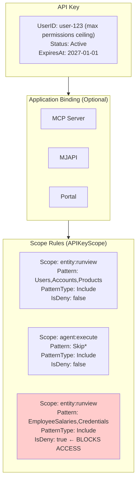
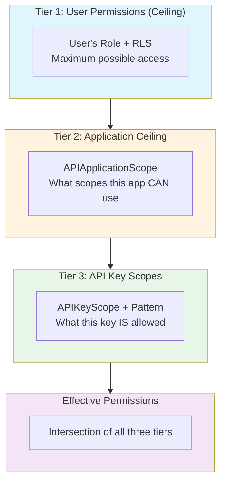
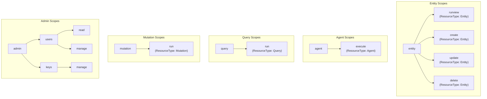
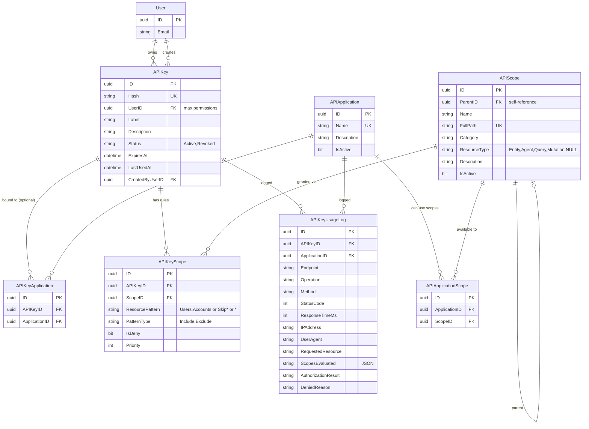
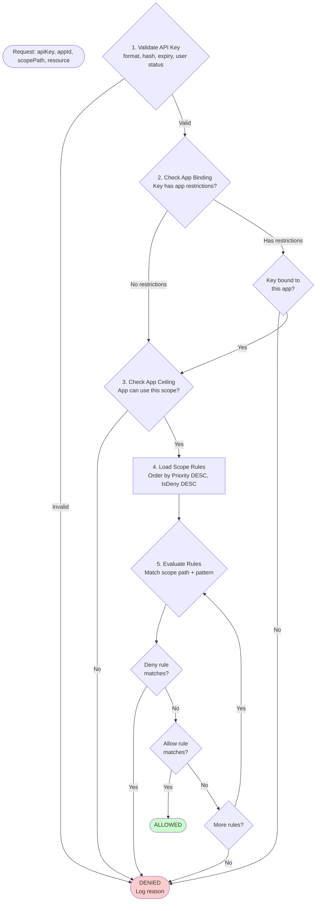
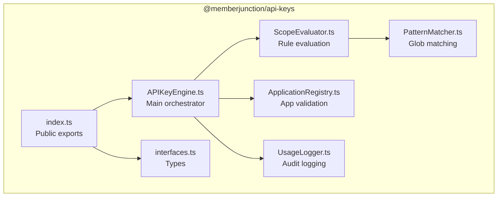
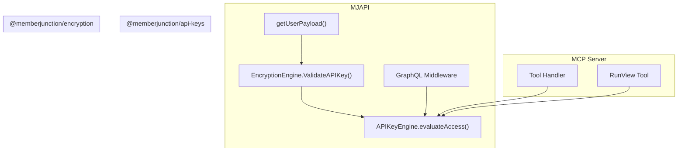

# MemberJunction API Key Authorization System - Design Document

## Document Status
- **Version**: 1.1
- **Date**: January 26, 2026
- **Author**: MJ Development Team
- **Status**: Draft - Pending Review

---

## Executive Summary

This document proposes enhancements to MemberJunction's API Key authorization system to support **fine-grained, pattern-based access control** across multiple applications (MJAPI, MCP Server, Portal, etc.). The design enables:

1. **Application-level restriction**: API keys optionally bound to specific applications
2. **Application scope ceiling**: Each app defines which scopes it can ever use
3. **Hierarchical scopes**: Permission tree with inheritance (app-agnostic, reusable)
4. **Pattern-based resources**: Wildcards and patterns instead of exhaustive entity lists
5. **Include/Exclude rules**: Flexible permission grants with exceptions
6. **Deny trumps all**: Explicit deny rules for security boundaries
7. **Enhanced audit logging**: Detailed scope evaluation tracking

### Critical Design Principle

> **User permissions are the ceiling.** API key scopes can only **narrow** permissions, never expand them. If a user lacks access to an entity or has Row-Level Security (RLS) restrictions, those constraints always apply regardless of API key scopes.

---

## Table of Contents

1. [Current State Analysis](#current-state-analysis)
2. [Industry Comparison](#industry-comparison)
3. [Gap Analysis](#gap-analysis)
4. [Proposed Architecture](#proposed-architecture)
5. [Schema Design](#schema-design)
6. [Evaluation Algorithm](#evaluation-algorithm)
7. [Implementation Components](#implementation-components)
8. [Example Use Cases](#example-use-cases)
9. [Migration Strategy](#migration-strategy)
10. [Open Questions](#open-questions)

---

## Current State Analysis

### Existing Schema

```sql
-- Current APIScope table
CREATE TABLE APIScope (
    ID UNIQUEIDENTIFIER PRIMARY KEY,
    Name NVARCHAR(100) NOT NULL UNIQUE,    -- e.g., 'entities:read'
    Category NVARCHAR(100) NOT NULL,        -- e.g., 'Entities'
    Description NVARCHAR(500) NULL
);

-- Current APIKey table
CREATE TABLE APIKey (
    ID UNIQUEIDENTIFIER PRIMARY KEY,
    Hash NVARCHAR(64) NOT NULL UNIQUE,      -- SHA-256 hash
    UserID UNIQUEIDENTIFIER NOT NULL,       -- Key owner
    Label NVARCHAR(255) NOT NULL,
    Description NVARCHAR(1000) NULL,
    Status NVARCHAR(20) NOT NULL DEFAULT 'Active',
    ExpiresAt DATETIMEOFFSET NULL,
    LastUsedAt DATETIMEOFFSET NULL,
    CreatedByUserID UNIQUEIDENTIFIER NOT NULL
);

-- Current APIKeyScope junction
CREATE TABLE APIKeyScope (
    ID UNIQUEIDENTIFIER PRIMARY KEY,
    APIKeyID UNIQUEIDENTIFIER NOT NULL,
    ScopeID UNIQUEIDENTIFIER NOT NULL,
    UNIQUE(APIKeyID, ScopeID)
);

-- Current APIKeyUsageLog
CREATE TABLE APIKeyUsageLog (
    ID UNIQUEIDENTIFIER PRIMARY KEY,
    APIKeyID UNIQUEIDENTIFIER NOT NULL,
    Endpoint NVARCHAR(500) NOT NULL,
    Operation NVARCHAR(255) NULL,
    Method NVARCHAR(10) NOT NULL,
    StatusCode INT NOT NULL,
    ResponseTimeMs INT NULL,
    IPAddress NVARCHAR(45) NULL,
    UserAgent NVARCHAR(500) NULL
);
```

### What Works Today

| Component | Status | Description |
|-----------|--------|-------------|
| Key Generation | ✅ | `mj_sk_[64 hex]` format with SHA-256 hashing |
| Key Validation | ✅ | Format check, hash lookup, expiry, user status |
| Usage Logging | ✅ | Basic endpoint, method, IP, response time |
| Scope Assignment | ⚠️ | Junction table exists, scopes not enforced |
| Scope Enforcement | ❌ | No authorization layer checks scopes |

### Current Limitations

1. **No application binding**: Keys work with any application
2. **Flat scope structure**: No hierarchy or inheritance
3. **Exact match only**: Cannot use patterns like `entity:read:Users,Accounts`
4. **Scope explosion risk**: Would need thousands of scopes for MJAPI entities
5. **No deny rules**: Cannot explicitly block specific resources
6. **Limited audit detail**: No scope evaluation tracking

---

## Industry Comparison

### AWS IAM

**Strengths:**
- Powerful policy language with `Effect`, `Action`, `Resource`, `Condition`
- Wildcards in actions (`s3:Get*`) and resources (`arn:aws:s3:::bucket/*`)
- Explicit deny always wins over allow
- Condition keys for contextual access (time, IP, tags)

**Policy Structure:**
```json
{
  "Effect": "Allow",
  "Action": ["s3:GetObject", "s3:ListBucket"],
  "Resource": ["arn:aws:s3:::my-bucket/*"],
  "Condition": {
    "IpAddress": {"aws:SourceIp": "192.168.1.0/24"}
  }
}
```

**Evaluation Logic:**
1. Explicit Deny → Access Denied
2. Explicit Allow → Access Allowed
3. Implicit Deny (no matching policy)

**Reference:** [AWS IAM Policy Elements](https://docs.aws.amazon.com/IAM/latest/UserGuide/reference_policies_elements.html)

---

### Azure RBAC

**Strengths:**
- Four-level scope hierarchy: Management Group → Subscription → Resource Group → Resource
- Permission inheritance downward
- Separate `actions` vs `dataActions` (control plane vs data plane)
- Conditions for fine-grained access

**Role Definition Structure:**
```json
{
  "Name": "Custom Role",
  "Actions": ["Microsoft.Storage/storageAccounts/read"],
  "NotActions": ["Microsoft.Storage/storageAccounts/delete"],
  "DataActions": ["Microsoft.Storage/storageAccounts/blobServices/containers/blobs/read"],
  "NotDataActions": [],
  "AssignableScopes": ["/subscriptions/{subscription-id}"]
}
```

**Key Concepts:**
- `Actions` + `DataActions` = what's allowed
- `NotActions` + `NotDataActions` = exceptions from broader permissions
- Conditions evaluated after basic permission check

**Reference:** [Azure RBAC Role Definitions](https://learn.microsoft.com/en-us/azure/role-based-access-control/role-definitions)

---

### Google Cloud IAM

**Strengths:**
- Granular permissions like `storage.objects.create`
- Roles bundle permissions (primitive, predefined, custom)
- IAM Conditions with CEL (Common Expression Language)
- Resource hierarchy with inheritance

**Condition Example:**
```
resource.name.startsWith("projects/_/buckets/my-bucket/objects/uploads/") &&
request.time < timestamp("2025-12-31T00:00:00Z")
```

**Reference:** [Google Cloud IAM Roles](https://docs.cloud.google.com/iam/docs/roles-overview)

---

### Salesforce OAuth

**Strengths:**
- OAuth scopes define API access levels
- Server and client must agree on scope contract
- Custom scopes for specific business needs
- Role-aligned connected apps

**Pattern:**
- Standard scopes: `api`, `refresh_token`, `web`, `full`
- Granular scopes: Read vs write permissions per object type
- Multiple connected apps with different scope sets per user role

**Reference:** [Salesforce OAuth Tokens and Scopes](https://help.salesforce.com/s/articleView?id=xcloud.remoteaccess_oauth_tokens_scopes.htm)

---

### HubSpot Private Apps

**Strengths:**
- Granular scopes like `crm.objects.contacts.read`
- Migrated from API keys to scoped tokens (security improvement)
- Required vs optional scopes for app installation
- Account-tier aware permissions

**Key Lesson:**
> HubSpot deprecated root-access API keys in 2022 because a compromised key could access all data. Private apps with granular scopes limit blast radius.

**Pattern:**
- `crm.objects.{object}.read`
- `crm.objects.{object}.write`
- `automation.workflows.read`

**Reference:** [HubSpot API Scopes](https://developers.hubspot.com/docs/api/scopes)

---

### OAuth 2.0 Best Practices

**Key Principles:**

1. **Avoid scope explosion**: Start simple, add granularity when needed
2. **Use namespaces**: `resource:action` or `resource:action:target`
3. **Combine scopes with claims**: Scopes for entry-point, claims for fine-grained
4. **Always require scopes**: Never issue scopeless tokens
5. **Deny by default**: No matching scope = denied

**Recommended Pattern:**
- Coarse-grained for general access
- Fine-grained where precision matters
- Pattern matching to avoid exhaustive lists

**Reference:** [OAuth Scopes Best Practices (Curity)](https://curity.io/resources/learn/scope-best-practices/)

---

## Gap Analysis

| Requirement | AWS | Azure | GCP | Salesforce | HubSpot | **MJ Current** | **MJ Proposed** |
|-------------|-----|-------|-----|------------|---------|----------------|-----------------|
| Application binding | ❌ | ❌ | ✅ | ✅ | ✅ | ❌ | ✅ |
| App scope ceiling | ❌ | ✅ | ✅ | ✅ | ✅ | ❌ | ✅ |
| Hierarchical scopes | ✅ | ✅ | ✅ | ⚠️ | ⚠️ | ❌ | ✅ |
| Wildcards in resources | ✅ | ✅ | ✅ | ❌ | ❌ | ❌ | ✅ |
| Pattern matching | ✅ | ⚠️ | ✅ | ❌ | ❌ | ❌ | ✅ |
| Include/Exclude | ✅ | ✅ | ✅ | ❌ | ❌ | ❌ | ✅ |
| Explicit deny | ✅ | ⚠️ | ✅ | ❌ | ❌ | ❌ | ✅ |
| Conditions | ✅ | ✅ | ✅ | ❌ | ❌ | ❌ | ⏳ Future |
| Audit detail | ✅ | ✅ | ✅ | ✅ | ✅ | ⚠️ | ✅ |

---

## Proposed Architecture

### Core Design Principles

1. **User permissions are the ceiling**: Scopes narrow, never expand
2. **Scopes are app-agnostic**: Reusable across applications
3. **Apps define their scope ceiling**: Each app declares which scopes it can use
4. **API keys optionally bound to apps**: NULL = works with all apps
5. **Explicit grant required**: No scopes = no access (deny by default)
6. **Deny trumps allow**: Any deny rule blocks access immediately
7. **Pattern-based resources**: Avoid scope explosion with wildcards

### Conceptual Model



### Three-Tier Permission Model



### Scope Hierarchy (App-Agnostic)



**Key Change**: Scopes are now **app-agnostic**. The `APIApplicationScope` junction table defines which scopes each application is allowed to use.

---

## Schema Design

### Entity Relationship Diagram



### New Tables

```sql
-- =============================================================================
-- API APPLICATIONS - Register consuming applications
-- =============================================================================
CREATE TABLE ${flyway:defaultSchema}.APIApplication (
    ID UNIQUEIDENTIFIER PRIMARY KEY DEFAULT NEWSEQUENTIALID(),
    Name NVARCHAR(100) NOT NULL UNIQUE,        -- 'MJAPI', 'MCPServer', 'Portal', 'CLI'
    Description NVARCHAR(500) NULL,
    IsActive BIT NOT NULL DEFAULT 1
);

-- =============================================================================
-- API SCOPES - Hierarchical permission tree (APP-AGNOSTIC)
-- =============================================================================
ALTER TABLE ${flyway:defaultSchema}.APIScope ADD
    ParentID UNIQUEIDENTIFIER NULL
        REFERENCES ${flyway:defaultSchema}.APIScope(ID),
    FullPath NVARCHAR(MAX) NOT NULL,           -- e.g., 'entity:runview'
    ResourceType NVARCHAR(50) NULL,            -- 'Entity', 'Agent', 'Query', 'Mutation', NULL
    IsActive BIT NOT NULL DEFAULT 1;

-- Add unique constraint for hierarchy
ALTER TABLE ${flyway:defaultSchema}.APIScope
    ADD CONSTRAINT UQ_APIScope_ParentName UNIQUE (ParentID, Name);

-- =============================================================================
-- API APPLICATION SCOPES - Which scopes each app CAN use (app's ceiling)
-- =============================================================================
CREATE TABLE ${flyway:defaultSchema}.APIApplicationScope (
    ID UNIQUEIDENTIFIER PRIMARY KEY DEFAULT NEWSEQUENTIALID(),
    ApplicationID UNIQUEIDENTIFIER NOT NULL
        REFERENCES ${flyway:defaultSchema}.APIApplication(ID) ON DELETE CASCADE,
    ScopeID UNIQUEIDENTIFIER NOT NULL
        REFERENCES ${flyway:defaultSchema}.APIScope(ID),

    -- Pattern matching for resources under this scope
    ResourcePattern NVARCHAR(1000) NULL,       -- 'Users,Accounts' or 'Skip*' or '*'
    PatternType NVARCHAR(20) NOT NULL DEFAULT 'Include'
        CHECK (PatternType IN ('Include', 'Exclude')),

    -- Deny trumps all - if set, this rule BLOCKS access
    IsDeny BIT NOT NULL DEFAULT 0,

    -- For ordering/priority when multiple rules match
    Priority INT NOT NULL DEFAULT 0;           -- Higher = evaluated first


    CONSTRAINT UQ_APIApplicationScope UNIQUE (ApplicationID, ScopeID)
);

-- =============================================================================
-- API KEY APPLICATIONS - Which apps can use this key (optional binding)
-- If no records exist for an API key, key works with ALL apps
-- =============================================================================
CREATE TABLE ${flyway:defaultSchema}.APIKeyApplication (
    ID UNIQUEIDENTIFIER PRIMARY KEY DEFAULT NEWSEQUENTIALID(),
    APIKeyID UNIQUEIDENTIFIER NOT NULL
        REFERENCES ${flyway:defaultSchema}.APIKey(ID) ON DELETE CASCADE,
    ApplicationID UNIQUEIDENTIFIER NOT NULL
        REFERENCES ${flyway:defaultSchema}.APIApplication(ID),
    CONSTRAINT UQ_APIKeyApplication UNIQUE (APIKeyID, ApplicationID)
);

-- =============================================================================
-- API KEY SCOPES - Junction with pattern rules (ENHANCED)
-- =============================================================================
ALTER TABLE ${flyway:defaultSchema}.APIKeyScope ADD
    -- Pattern matching for resources under this scope
    ResourcePattern NVARCHAR(1000) NULL,       -- 'Users,Accounts' or 'Skip*' or '*'
    PatternType NVARCHAR(20) NOT NULL DEFAULT 'Include'
        CHECK (PatternType IN ('Include', 'Exclude')),

    -- Deny trumps all - if set, this rule BLOCKS access
    IsDeny BIT NOT NULL DEFAULT 0,

    -- For ordering/priority when multiple rules match
    Priority INT NOT NULL DEFAULT 0;           -- Higher = evaluated first

-- Update unique constraint to include pattern
ALTER TABLE ${flyway:defaultSchema}.APIKeyScope
    DROP CONSTRAINT UQ_APIKeyScope;
ALTER TABLE ${flyway:defaultSchema}.APIKeyScope
    ADD CONSTRAINT UQ_APIKeyScope UNIQUE (APIKeyID, ScopeID, ResourcePattern);

-- =============================================================================
-- API KEY USAGE LOG - Enhanced with scope details
-- =============================================================================
ALTER TABLE ${flyway:defaultSchema}.APIKeyUsageLog ADD
    ApplicationID UNIQUEIDENTIFIER NULL
        REFERENCES ${flyway:defaultSchema}.APIApplication(ID),
    RequestedResource NVARCHAR(500) NULL,      -- What they tried to access
    ScopesEvaluated NVARCHAR(MAX) NULL,        -- JSON array of evaluation details
    AuthorizationResult NVARCHAR(20) NOT NULL DEFAULT 'Allowed'
        CHECK (AuthorizationResult IN ('Allowed', 'Denied', 'NoScopesRequired')),
    DeniedReason NVARCHAR(500) NULL;           -- Why access was denied
```

---

## Evaluation Algorithm

### Flow Diagram



### Pseudocode

```typescript
interface AuthorizationRequest {
    apiKeyId: string;
    applicationId: string;
    scopePath: string;      // e.g., 'entity:runview'
    resource: string;       // e.g., 'Users'
}

interface AuthorizationResult {
    allowed: boolean;
    reason: string;
    matchedRule?: APIKeyScope;
    evaluatedRules: EvaluatedRule[];
}

function evaluateAccess(request: AuthorizationRequest): AuthorizationResult {
    const evaluatedRules: EvaluatedRule[] = [];

    // 1. Check if API key is bound to specific apps
    const keyApps = loadKeyApplications(request.apiKeyId);

    if (keyApps.length > 0) {
        // Key has app restrictions - check if this app is allowed
        if (!keyApps.includes(request.applicationId)) {
            return {
                allowed: false,
                reason: 'API key not authorized for this application',
                evaluatedRules: []
            };
        }
    }
    // If keyApps is empty, key works with all apps

    // 2. Check application scope ceiling
    const appScopes = loadApplicationScopes(request.applicationId);
    if (!appScopes.includes(request.scopePath)) {
        return {
            allowed: false,
            reason: 'Application cannot use this scope',
            evaluatedRules: []
        };
    }

    // 3. Load all scope rules for this key, ordered by Priority DESC, IsDeny DESC
    const rules = loadScopeRules(request.apiKeyId, request.scopePath);

    // 4. Evaluate rules in order
    for (const rule of rules) {
        const matchResult = evaluateRule(rule, request.resource);
        evaluatedRules.push(matchResult);

        if (matchResult.matched) {
            if (rule.IsDeny) {
                // Deny rules always win
                return {
                    allowed: false,
                    reason: `Denied by rule: ${rule.ID}`,
                    matchedRule: rule,
                    evaluatedRules
                };
            }

            // First matching allow rule wins
            return {
                allowed: true,
                reason: 'Matched allow rule',
                matchedRule: rule,
                evaluatedRules
            };
        }
    }

    // 5. No matching rules = denied (explicit grant required)
    return {
        allowed: false,
        reason: 'No matching scope rules',
        evaluatedRules
    };
}

function evaluateRule(rule: APIKeyScope, resource: string): EvaluatedRule {
    // Handle NULL pattern as wildcard (match all)
    if (!rule.ResourcePattern) {
        return { rule, matched: true, patternMatched: '*' };
    }

    // Handle comma-separated list
    const patterns = rule.ResourcePattern.split(',').map(p => p.trim());

    // Check if resource matches any pattern
    for (const pattern of patterns) {
        if (globMatch(resource, pattern)) {
            const matched = rule.PatternType === 'Include';
            return { rule, matched, patternMatched: pattern };
        }
    }

    // No pattern matched
    const matched = rule.PatternType === 'Exclude';
    return { rule, matched, patternMatched: null };
}

function globMatch(value: string, pattern: string): boolean {
    if (pattern === '*') return true;

    // Convert glob pattern to regex
    // * = any characters, ? = single character
    const regexPattern = pattern
        .replace(/[.+^${}()|[\]\\]/g, '\\$&')  // Escape regex special chars
        .replace(/\*/g, '.*')                   // * -> .*
        .replace(/\?/g, '.');                   // ? -> .

    const regex = new RegExp(`^${regexPattern}$`, 'i');
    return regex.test(value);
}
```

### Evaluation Order

Rules are evaluated in the following order:
1. **Priority DESC**: Higher priority rules evaluated first
2. **IsDeny DESC**: Within same priority, deny rules before allow rules
3. **Specificity**: More specific patterns implicitly have higher priority

---

## Implementation Components

### Package Structure



### Component Responsibilities

| Component | Responsibility |
|-----------|---------------|
| `APIKeyEngine` | Main entry point, coordinates validation and evaluation |
| `ScopeEvaluator` | Loads scope rules, evaluates access, determines result |
| `ApplicationRegistry` | Validates app registration, checks app scope ceiling, key-app bindings |
| `UsageLogger` | Enhanced logging with scope evaluation details |
| `PatternMatcher` | Glob/wildcard pattern matching engine |

### Integration Points



---

## Example Use Cases

### Use Case 1: MCP Key - One Agent, Five Entities

**Scenario**: Integration needs to run only the "SkipAnalysisAgent" and read from 5 specific entities.

```sql
-- 1. Create API Key (existing flow)
-- Key is created with UserID = integration-user

-- 2. Bind to MCP Server application (optional - restricts key to MCP only)
INSERT INTO APIKeyApplication (APIKeyID, ApplicationID)
VALUES (@keyId, @mcpAppId);

-- 3. Grant agent execution for ONE specific agent
INSERT INTO APIKeyScope (APIKeyID, ScopeID, ResourcePattern, PatternType, IsDeny, Priority)
VALUES (@keyId, @scope_agent_execute, 'SkipAnalysisAgent', 'Include', 0, 0);

-- 4. Grant entity read for 5 specific entities
INSERT INTO APIKeyScope (APIKeyID, ScopeID, ResourcePattern, PatternType, IsDeny, Priority)
VALUES (@keyId, @scope_entity_runview, 'Users,Accounts,Products,Orders,Invoices', 'Include', 0, 0);
```

**Evaluation Example**:
```
Request: entity:runview, 'Users' → ALLOWED (matches pattern)
Request: entity:runview, 'Employees' → DENIED (no matching rule)
Request: agent:execute, 'SkipAnalysisAgent' → ALLOWED (matches pattern)
Request: agent:execute, 'DifferentAgent' → DENIED (no matching rule)
```

### Use Case 2: MJAPI Key - Queries Starting with J, Ending with X

**Scenario**: Report generator needs access to specific query patterns.

```sql
-- 1. Bind to MJAPI application
INSERT INTO APIKeyApplication (APIKeyID, ApplicationID)
VALUES (@keyId, @mjapiAppId);

-- 2. Grant query access with pattern
INSERT INTO APIKeyScope (APIKeyID, ScopeID, ResourcePattern, PatternType, IsDeny, Priority)
VALUES (@keyId, @scope_query_run, 'J*X', 'Include', 0, 0);
```

**Evaluation Example**:
```
Request: query:run, 'GetJanuaryReportDataX' → ALLOWED (J...X pattern)
Request: query:run, 'JobStatusX' → ALLOWED (J...X pattern)
Request: query:run, 'GetAllUsers' → DENIED (doesn't match J*X)
```

### Use Case 3: Full Access EXCEPT Sensitive Entities

**Scenario**: Developer key with broad access but explicit blocks on sensitive data.

```sql
-- 1. No app binding = works with all apps

-- 2. Grant full entity access (lower priority)
INSERT INTO APIKeyScope (APIKeyID, ScopeID, ResourcePattern, PatternType, IsDeny, Priority)
VALUES (@keyId, @scope_entity_runview, '*', 'Include', 0, 0);

-- 3. DENY sensitive entities (higher priority, IsDeny = 1)
INSERT INTO APIKeyScope (APIKeyID, ScopeID, ResourcePattern, PatternType, IsDeny, Priority)
VALUES (@keyId, @scope_entity_runview, 'EmployeeSalaries,AuditLogs,Credentials,APIKeys', 'Include', 1, 100);
```

**Evaluation Example**:
```
Request: entity:runview, 'Users' → ALLOWED (matches * pattern)
Request: entity:runview, 'EmployeeSalaries' → DENIED (deny rule matches first)
Request: entity:runview, 'APIKeys' → DENIED (deny rule matches first)
```

### Use Case 4: Multi-Application Key (No App Binding)

**Scenario**: CI/CD pipeline needs access to both MJAPI and MCP without explicit binding.

```sql
-- 1. No APIKeyApplication records = key works with all apps

-- 2. Grant mutation access (used by MJAPI)
INSERT INTO APIKeyScope (APIKeyID, ScopeID, ResourcePattern, PatternType, IsDeny, Priority)
VALUES (@keyId, @scope_mutation_run, 'Create*,Update*', 'Include', 0, 0);

-- 3. Grant entity access (used by MCP)
INSERT INTO APIKeyScope (APIKeyID, ScopeID, ResourcePattern, PatternType, IsDeny, Priority)
VALUES (@keyId, @scope_entity_runview, '*', 'Include', 0, 0);
```

### Use Case 5: Application Scope Ceiling

**Scenario**: MCP Server should never allow mutation scopes, only entity and agent scopes.

```sql
-- Define MCP Server's scope ceiling
INSERT INTO APIApplicationScope (ApplicationID, ScopeID) VALUES
    (@mcpAppId, @scope_entity_runview),
    (@mcpAppId, @scope_entity_create),
    (@mcpAppId, @scope_entity_update),
    (@mcpAppId, @scope_entity_delete),
    (@mcpAppId, @scope_agent_execute),
    (@mcpAppId, @scope_query_run);
-- Note: mutation scopes NOT included

-- Even if an API key has mutation scope, MCP won't allow it
-- because mutation:run is not in MCP's APIApplicationScope
```

---

## Enhanced Usage Logging

### Log Entry Structure

```typescript
interface APIKeyUsageLogEntry {
    ID: string;
    APIKeyID: string;
    ApplicationID: string;
    Endpoint: string;
    Operation: string;
    Method: string;
    StatusCode: number;
    ResponseTimeMs: number;
    IPAddress: string;
    UserAgent: string;

    // NEW FIELDS
    RequestedResource: string;
    ScopesEvaluated: ScopeEvaluation[];
    AuthorizationResult: 'Allowed' | 'Denied' | 'NoScopesRequired';
    DeniedReason: string | null;
}

interface ScopeEvaluation {
    scopeId: string;
    scopePath: string;
    pattern: string;
    patternType: 'Include' | 'Exclude';
    isDeny: boolean;
    matched: boolean;
    result: 'Allowed' | 'Denied' | 'NoMatch';
}
```

### Example Log Entry

```json
{
    "ID": "log-uuid-123",
    "APIKeyID": "key-uuid-456",
    "ApplicationID": "mcp-server-id",
    "Endpoint": "/mcp/tools/call",
    "Operation": "RunAgent",
    "Method": "POST",
    "StatusCode": 200,
    "ResponseTimeMs": 1234,
    "IPAddress": "192.168.1.100",
    "UserAgent": "claude-desktop/1.0",
    "RequestedResource": "SkipAnalysisAgent",
    "ScopesEvaluated": [
        {
            "scopeId": "scope-agent-execute",
            "scopePath": "agent:execute",
            "pattern": "SkipAnalysisAgent",
            "patternType": "Include",
            "isDeny": false,
            "matched": true,
            "result": "Allowed"
        }
    ],
    "AuthorizationResult": "Allowed",
    "DeniedReason": null
}
```

---

## Migration Strategy

### Phase 1: Schema Enhancement (Non-Breaking)

1. Add new columns to existing tables with defaults
2. Create new tables (APIApplication, APIApplicationScope, APIKeyApplication)
3. No enforcement yet - existing keys continue to work

```sql
-- Add columns with NULL/defaults so existing data works
ALTER TABLE APIScope ADD
    ParentID UNIQUEIDENTIFIER NULL,
    FullPath NVARCHAR(500) NULL,
    ResourceType NVARCHAR(50) NULL,
    IsActive BIT NOT NULL DEFAULT 1;

-- Backfill FullPath from Name for existing scopes
UPDATE APIScope SET FullPath = Name WHERE FullPath IS NULL;
ALTER TABLE APIScope ALTER COLUMN FullPath NVARCHAR(500) NOT NULL;
```

### Phase 2: Seed Data

1. Create standard APIApplication records
2. Build scope hierarchy (app-agnostic)
3. Define each app's scope ceiling via APIApplicationScope
4. Migrate existing flat scopes to hierarchical structure

```sql
-- Seed applications
INSERT INTO APIApplication (ID, Name, Description, IsActive) VALUES
    (NEWID(), 'MJAPI', 'MemberJunction GraphQL API', 1),
    (NEWID(), 'MCPServer', 'Model Context Protocol Server', 1),
    (NEWID(), 'Portal', 'Web Portal Application', 1);

-- Build scope hierarchy (app-agnostic)
INSERT INTO APIScope (ID, ParentID, Name, FullPath, ResourceType) VALUES
    (@scope_entity, NULL, 'entity', 'entity', NULL),
    (@scope_entity_runview, @scope_entity, 'runview', 'entity:runview', 'Entity'),
    (@scope_entity_create, @scope_entity, 'create', 'entity:create', 'Entity'),
    (@scope_agent, NULL, 'agent', 'agent', NULL),
    (@scope_agent_execute, @scope_agent, 'execute', 'agent:execute', 'Agent');

-- Define app scope ceilings
INSERT INTO APIApplicationScope (ApplicationID, ScopeID) VALUES
    (@mcpAppId, @scope_entity_runview),
    (@mcpAppId, @scope_agent_execute),
    (@mjapiAppId, @scope_entity_runview),
    (@mjapiAppId, @scope_mutation_run);
```

### Phase 3: Package Implementation

1. Create `@memberjunction/api-keys` package
2. Implement ScopeEvaluator with pattern matching
3. Add integration points in MJAPI and MCP Server
4. Enable enforcement with feature flag

### Phase 4: Enforcement Rollout

1. **Soft Mode**: Log violations but don't block
2. **Warning Mode**: Log warnings, prepare users
3. **Enforcement Mode**: Block unauthorized requests

---

## Open Questions

### 1. Default Behavior for Keys Without Applications

**Question**: If an API key has NO records in APIKeyApplication, should it work with:
- **ALL apps** (most flexible) ← **Recommended**
- **NO apps** (explicit grant required)

**Recommendation**: ALL apps. This is backward compatible and provides flexibility. Keys can be restricted to specific apps by adding APIKeyApplication records.

---

### 2. Default Behavior for Keys Without Scopes

**Question**: If an API key has NO scopes assigned, should it have:
- **Full access** (backward compatibility, limited by user permissions)
- **No access** (explicit grant required)

**Recommendation**: Full access during migration, configurable per-deployment after.

---

### 3. Scope Inheritance

**Question**: If granted `entity:*`, does that imply:
- `entity:runview`
- `entity:create`
- `entity:update`
- `entity:delete`

**Recommendation**: Yes, wildcards cascade. `entity:*` includes all entity operations.

---

### 4. FullPath Computation

**Question**: Should `APIScope.FullPath` be:
- **Computed column** (auto-maintained)
- **Trigger-maintained** (on insert/update)
- **Application-maintained** (set by code)

**Recommendation**: Trigger-maintained for data integrity.

---

### 5. Pattern Syntax

**Question**: Which pattern syntax to support:
- **Glob only**: `*`, `?` (simpler, covers most cases)
- **Regex**: Full regex power (complex, potential security issues)
- **Both**: Flag to indicate pattern type

**Recommendation**: Glob only for initial release. Regex adds complexity and ReDoS risk.

---

## Summary

This design provides MemberJunction with an enterprise-grade API authorization system that:

1. **Matches industry standards**: Aligns with AWS IAM, Azure RBAC, and OAuth best practices
2. **Avoids scope explosion**: Pattern matching eliminates need for thousands of entity-specific scopes
3. **Maintains security**: User permissions remain the ceiling, deny rules trump allow
4. **Scopes are reusable**: App-agnostic scopes shared across applications
5. **Apps have ceilings**: Each app defines which scopes it can use via APIApplicationScope
6. **Flexible key binding**: Keys work with all apps by default, optionally restricted
7. **Provides audit trail**: Detailed scope evaluation logging for compliance and debugging

The phased migration approach ensures backward compatibility while enabling organizations to adopt enhanced authorization controls at their own pace.

---

## References

### Cloud Provider Documentation
- [AWS IAM Policy Elements](https://docs.aws.amazon.com/IAM/latest/UserGuide/reference_policies_elements.html)
- [AWS IAM Policy Evaluation Logic](https://builder.aws.com/content/2d1bIioM3UgQZqyaYquu3kTaWAg/comprehensive-guide-of-aws-iam-policy-evaluation-logic)
- [Azure RBAC Overview](https://learn.microsoft.com/en-us/azure/role-based-access-control/overview)
- [Azure Role Definitions](https://learn.microsoft.com/en-us/azure/role-based-access-control/role-definitions)
- [Google Cloud IAM Roles](https://docs.cloud.google.com/iam/docs/roles-overview)

### OAuth and API Best Practices
- [OAuth Scopes Best Practices (Curity)](https://curity.io/resources/learn/scope-best-practices/)
- [OAuth 2.0 Access Tokens and Least Privilege (Auth0)](https://auth0.com/blog/oauth2-access-tokens-and-principle-of-least-privilege/)
- [HubSpot API Scopes](https://developers.hubspot.com/docs/api/scopes)
- [Salesforce OAuth Tokens and Scopes](https://help.salesforce.com/s/articleView?id=xcloud.remoteaccess_oauth_tokens_scopes.htm)

### MemberJunction Documentation
- [API Keys for MJAPI Plan](./api-keys-for-mjapi.md)
- [Encryption Package](../packages/Encryption/README.md)
- [Credentials Package](../packages/Credentials/Engine/README.md)
