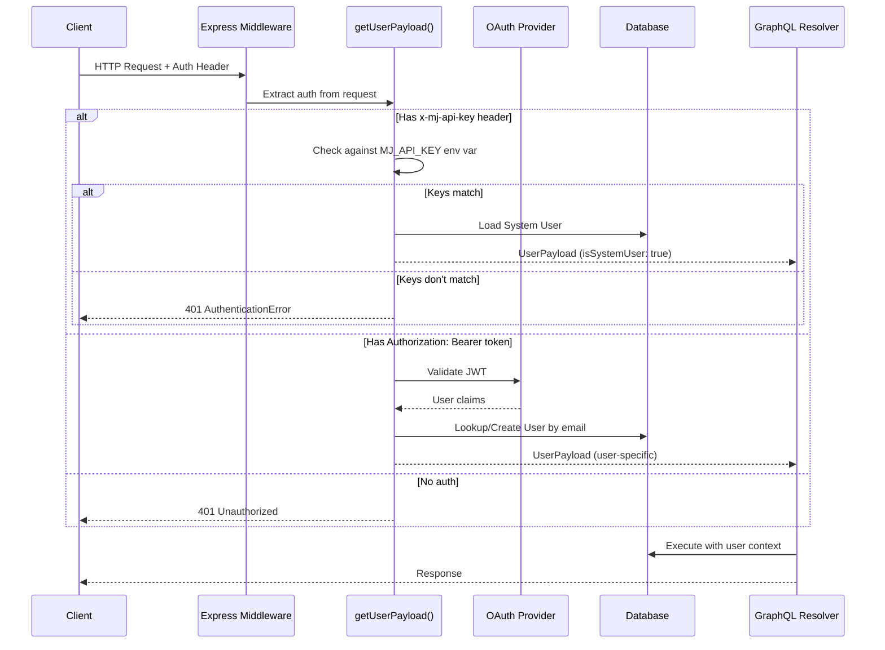
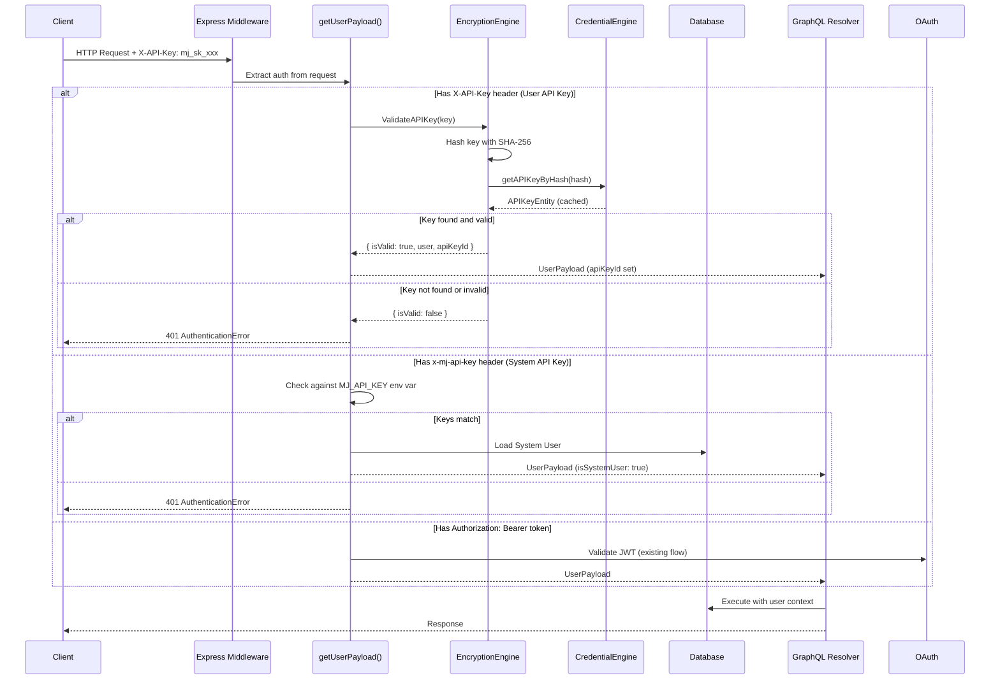
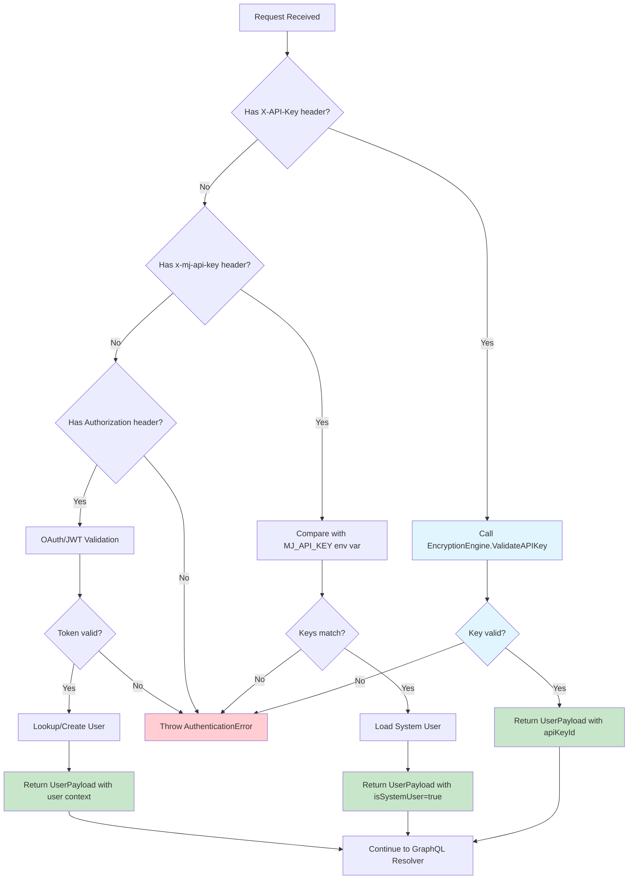
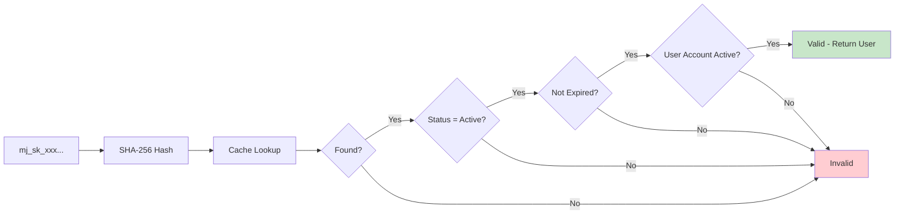

# MJ API Key Authentication for MJAPI

## Overview

This plan documents the implementation of MJ API Key authentication support for all MJAPI endpoints. Currently, MJAPI supports:
1. **OAuth/JWT Authentication** - Primary authentication via external identity providers
2. **System API Key** - Single shared key via `MJ_API_KEY` environment variable for system-level operations

This enhancement adds support for **User API Keys** - per-user, cryptographically secure API keys that:
- Authenticate as a specific user (not system user)
- Support rate limiting and expiration
- Provide audit trail via existing logging
- Follow the `mj_sk_*` format used by the MCP server

## Header Convention

| Header | Purpose | Authenticates As |
|--------|---------|------------------|
| `X-API-Key` | User API keys (`mj_sk_*`) | Specific user who owns the key |
| `x-mj-api-key` | System API key | System user (for system-level operations) |
| `Authorization: Bearer` | OAuth/JWT tokens | User from identity provider |

This follows industry conventions where `X-API-Key` is the standard header for API key authentication (used by AWS API Gateway, Stripe, and many others).

## Architecture

### Current Authentication Flow



### New Authentication Flow with User API Keys



### Decision Flow Chart



## Implementation Details

### Files to Modify

| File | Change Description |
|------|-------------------|
| `packages/MJServer/src/types.ts` | Add `apiKeyId?: string` to `UserPayload` type |
| `packages/MJServer/src/context.ts` | Add MJ API key validation logic in `getUserPayload()` |

### Code Changes

#### 1. Update UserPayload Type (`types.ts`)

```typescript
export type UserPayload = {
  email: string;
  userRecord: any;
  sessionId: string;
  isSystemUser?: boolean;
  apiKey?: string;
  apiKeyId?: string;  // NEW: ID of the MJ API key used for authentication
};
```

The `apiKeyId` field allows:
- Tracking which specific API key was used for each request
- Enabling per-key rate limiting in the future
- Audit logging at the key level
- Key revocation checks

#### 2. Update getUserPayload() (`context.ts`)

The function now accepts separate parameters for each API key type:

```typescript
export const getUserPayload = async (
  bearerToken: string,
  sessionId = 'default',
  dataSources: DataSourceInfo[],
  requestDomain?: string,
  systemApiKey?: string,   // From x-mj-api-key header
  userApiKey?: string      // From X-API-Key header
): Promise<UserPayload> => {
  // Check for user API key first (X-API-Key header)
  // This authenticates as the specific user who owns the API key
  if (userApiKey && userApiKey != String(undefined)) {
    const systemUser = await getSystemUser(readOnlyDataSource);
    const validationResult = await EncryptionEngine.Instance.ValidateAPIKey(userApiKey, systemUser);

    if (validationResult.isValid && validationResult.user) {
      return {
        userRecord: validationResult.user,
        email: validationResult.user.Email,
        sessionId,
        apiKeyId: validationResult.apiKeyId,
      };
    }

    throw new AuthenticationError('Invalid API key');
  }

  // Check for system API key (x-mj-api-key header)
  // This authenticates as the system user for system-level operations
  if (systemApiKey && systemApiKey != String(undefined)) {
    if (systemApiKey === apiKey) {
      const systemUser = await getSystemUser(readOnlyDataSource);
      return {
        userRecord: systemUser,
        email: systemUser.Email,
        sessionId,
        isSystemUser: true,
        apiKey,
      };
    }
    throw new AuthenticationError('Invalid system API key');
  }

  // ... OAuth/JWT validation continues below
}
```

**Note**: The system user is used as the `contextUser` for the `ValidateAPIKey` call because:
1. `ValidateAPIKey` uses `RunView` internally to look up the user entity
2. It logs API key usage to `MJ: API Key Usage Logs`
3. These operations require a valid user context, but we don't yet have the authenticated user
4. The system user provides the necessary privileges for these internal operations

#### 3. Update contextFunction() to extract both headers

```typescript
// Two types of API keys:
// - x-mj-api-key: System API key for system-level operations (authenticates as system user)
// - X-API-Key: User API key (mj_sk_*) for user-authenticated operations
const systemApiKey = String(req.headers['x-mj-api-key']);
const userApiKey = String(req.headers['x-api-key']);

const userPayload = await getUserPayload(
  bearerToken,
  sessionId,
  dataSources,
  requestDomain?.hostname ? requestDomain.hostname : undefined,
  systemApiKey,
  userApiKey
);
```

### Validation Flow Details

The `EncryptionEngine.ValidateAPIKey()` method (already implemented) performs:

1. **Format Validation** - Ensures key matches `mj_sk_[64 hex chars]` pattern
2. **Hash Lookup** - SHA-256 hashes the key, looks up in cached API keys
3. **Status Check** - Verifies key status is 'Active'
4. **Expiration Check** - Ensures key hasn't expired
5. **User Lookup** - Loads the associated UserEntity



### Security Considerations

1. **Key Secrecy**: MJ API keys are never stored in plain text - only SHA-256 hashes
2. **Timing Attacks**: Hash comparison uses constant-time comparison via crypto module
3. **Key Rotation**: Users can generate new keys; old keys can be revoked
4. **Rate Limiting**: `apiKeyId` in UserPayload enables per-key rate limiting
5. **Audit Trail**: All API key usage is logged via existing EncryptionEngine logging

### Authentication Methods Summary

| Header | Value | Authenticates As | Use Case |
|--------|-------|------------------|----------|
| `X-API-Key` | `mj_sk_xxx...` | Specific user | Programmatic access, integrations, MCP servers |
| `x-mj-api-key` | `<system-key>` | System user | System-level operations, internal services |
| `Authorization` | `Bearer <jwt>` | OAuth user | Browser-based apps, SSO |

### Error Messages

| Condition | Error Message |
|-----------|---------------|
| Invalid user API key | "Invalid API key" |
| User API key not found | "Invalid API key" |
| User API key expired | "Invalid API key" |
| User API key inactive | "Invalid API key" |
| User account disabled | "Invalid API key" |
| System key mismatch | "Invalid system API key" |

Note: Generic error messages for user API keys prevent enumeration attacks.

## Dependencies

### Package Dependencies

The `@memberjunction/encryption` package is already a dependency of MJServer:

```json
// packages/MJServer/package.json
{
  "dependencies": {
    "@memberjunction/encryption": "3.2.0"
  }
}
```

### Runtime Dependencies

1. **EncryptionEngine** must be initialized before handling requests
2. **CredentialEngine** must be configured for API key cache
3. Database connection must be available for user lookups

## Testing Checklist

### User API Keys (`X-API-Key` header)
- [ ] Valid `mj_sk_*` key authenticates correctly
- [ ] Returns correct user (not system user)
- [ ] `apiKeyId` is present in UserPayload
- [ ] `isSystemUser` is NOT set
- [ ] Expired key is rejected with "Invalid API key"
- [ ] Inactive key is rejected with "Invalid API key"
- [ ] Invalid format key is rejected with "Invalid API key"

### System API Key (`x-mj-api-key` header)
- [ ] Valid system key authenticates as system user
- [ ] `isSystemUser` is set to true
- [ ] Invalid system key is rejected with "Invalid system API key"

### OAuth/JWT (`Authorization: Bearer` header)
- [ ] Existing OAuth flow still works
- [ ] Token validation unchanged

### General
- [ ] Build compiles without TypeScript errors
- [ ] No header specified returns 401

## Rollout Plan

1. **Phase 1**: Implement and test locally
2. **Phase 2**: Deploy to staging environment
3. **Phase 3**: Generate test API keys for internal users
4. **Phase 4**: Production deployment
5. **Phase 5**: Documentation and SDK updates

## Related Documentation

- [Encryption Package README](../packages/Encryption/README.md) - API key generation and validation
- [Credentials Package README](../packages/Credentials/Engine/README.md) - Credential storage and caching
- [MCP Server Implementation](../packages/MCP/README.md) - Uses same API key format
