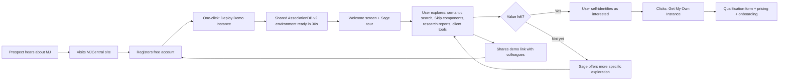
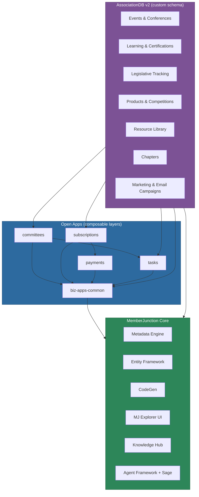
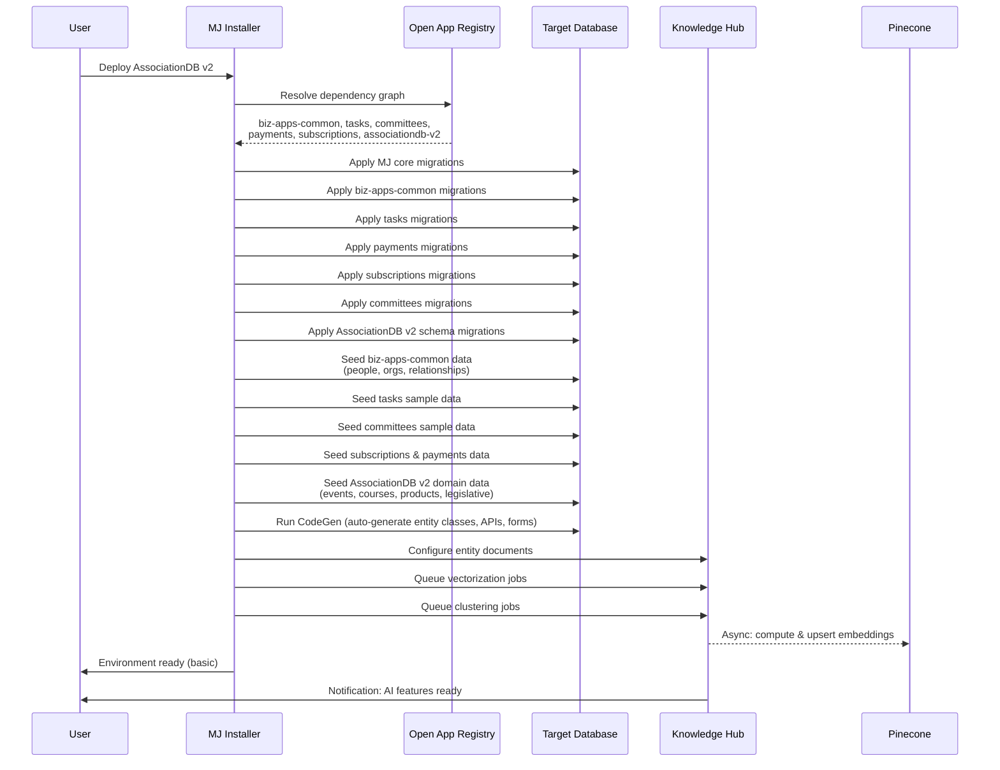
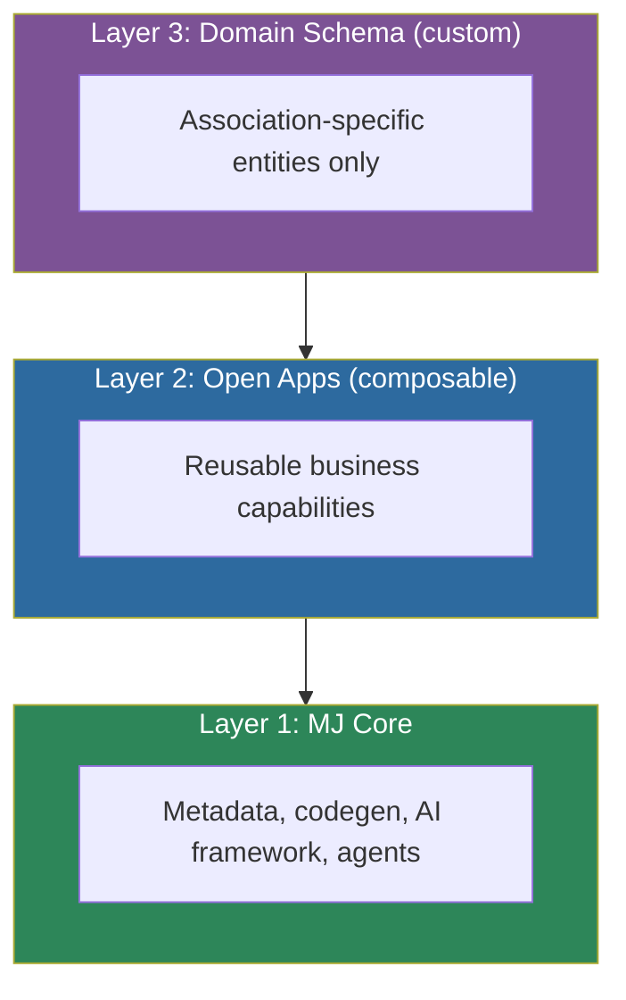
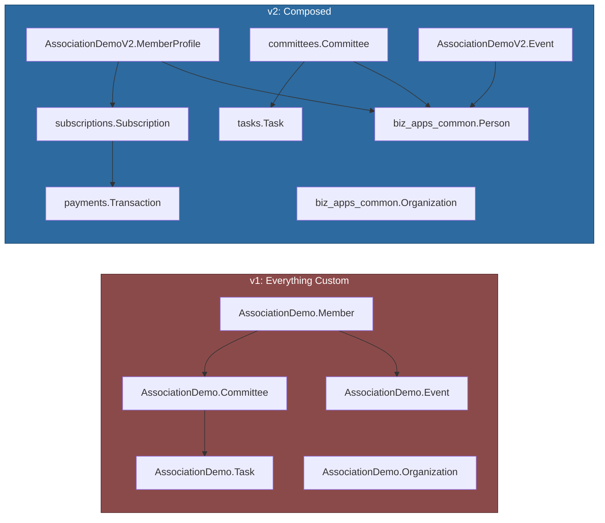
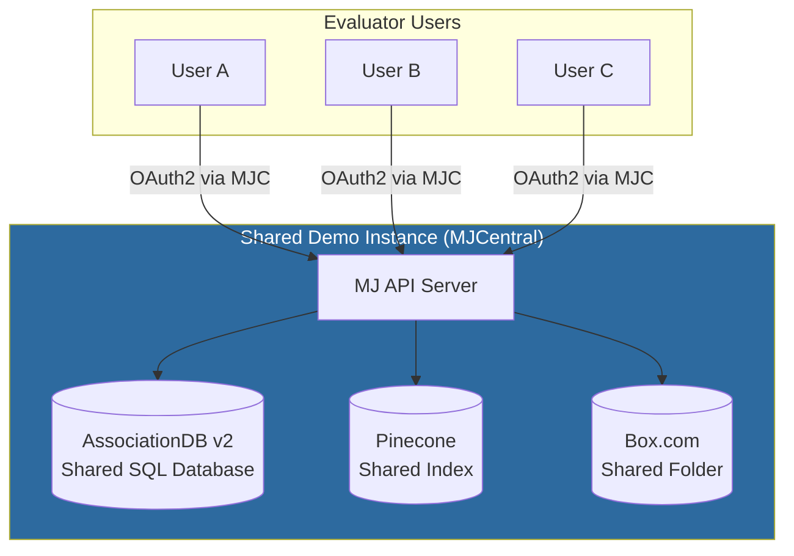
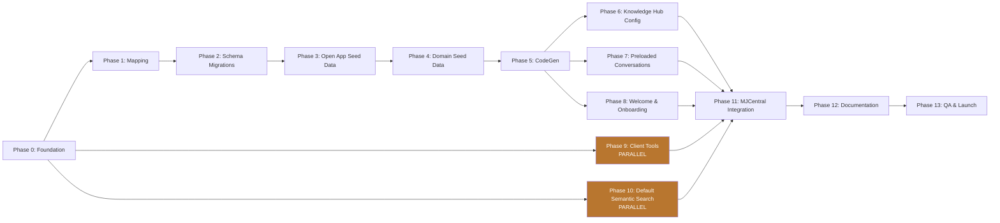

# AssociationDB v2 — Implementation Plan

**A Composable Open App Reference Implementation for MemberJunction**

> **Intended audience:** This document is the complete execution brief for a future Claude Code session that will build AssociationDB v2 end-to-end. It is also usable by any engineer on the MemberJunction team who wants to understand the what, why, and how of this effort. Every task below should be executable with no additional clarification required.

-----

## Table of Contents

1. [Executive Summary](#1-executive-summary)
1. [Business Context & Rationale](#2-business-context--rationale)
1. [Architecture Overview](#3-architecture-overview)
1. [Schema Rearchitecture: v1 vs v2](#4-schema-rearchitecture-v1-vs-v2)
1. [AI & Data Enrichment Layer](#5-ai--data-enrichment-layer)
1. [Preloaded Content & Artifact Lineage](#6-preloaded-content--artifact-lineage)
1. [MJCentral Integration & Golden Image Strategy](#7-mjcentral-integration--golden-image-strategy)
1. [Onboarding Experience & Sage Integration](#8-onboarding-experience--sage-integration)
1. [Client Tools: Full Build-Out & Governance](#9-client-tools-full-build-out--governance)
1. [Default Semantic Search on Conversations & Artifacts](#10-default-semantic-search-on-conversations--artifacts)
1. [Implementation Phases & Task Breakdown](#11-implementation-phases--task-breakdown)
1. [Success Criteria](#12-success-criteria)
1. [Risks, Open Questions & Mitigations](#13-risks-open-questions--mitigations)
1. [Appendices](#14-appendices)

-----

## 1. Executive Summary

### 1.1 The Storyline

AssociationDB v1 has served us well as a basic demonstration database. It contains roughly 58 tables, 10,000+ records, and enough realistic association data (the fictional “American Cheese Association”) that prospects can navigate it, Skip can generate components against it, and our team can use it in sales conversations. But v1 has a structural limitation: **every table is custom to AssociationDB**. It doesn’t demonstrate what MemberJunction is actually uniquely good at — composing purpose-built open apps into a complete business ecosystem while layering AI capabilities on top of existing enterprise data.

AssociationDB v2 rebuilds the demo from the ground up around the composition story. Rather than owning its own `Member`, `Organization`, `Committee`, and `Task` tables, v2 delegates to the open app ecosystem:

- **biz-apps-common** becomes the identity substrate (People, Organizations, Relationships, Contact/Address management)
- **tasks** owns all project/task/assignment logic
- **committees** owns governance — real committee management with charters, terms, meetings, and deliverables
- **payments** owns the payment-provider abstraction (Stripe, Chase, Authorize.net)
- **subscriptions** owns recurring billing and membership-as-subscription semantics

What remains in AssociationDB v2’s custom schema is *only* the stuff that is genuinely association-specific and not yet factored into a reusable open app: events/conferences, learning/certifications, legislative tracking, cheese products/competitions, resource library, chapters, and email/marketing campaigns. This is the honest architectural split: “here’s what’s truly domain-specific, and here’s what you compose from the ecosystem.”

On top of the rearchitected schema, v2 ships with the full MJ AI feature set pre-configured and pre-populated: entity documents translating structured records into LLM-readable markdown, automatic vectorization into Pinecone, Apollo-powered data enrichment, duplicate detection, clustering on members and events, unified search spanning database records / vector embeddings / Box.com documents. Preloaded Skip components and research agent reports demonstrate what’s possible without forcing users to build from scratch — and every preloaded artifact includes a full conversation history so users can see *how* it was produced.

The entire v2 experience is available via one-click deployment in MJCentral. Any visitor can register for a free account, click “Demo,” and be exploring a shared AssociationDB v2 instance within minutes — no qualification, no sales call, no setup friction. This is our primary top-of-funnel motion. Private instances remain available on upgrade.

Sage, our ambient agent, becomes the onboarding experience itself. A welcome screen on first visit (persisted via the user info engine so it only shows once) introduces the environment. Context-aware client tools scoped to each dashboard let Sage take meaningful action on the user’s behalf. An onboarding tool can be invoked by the user at any time to re-run the guided experience. This makes onboarding feel like *using* the product rather than *learning* the product.

### 1.2 High-Level Bullet Points

- **Rearchitect AssociationDB on composable open apps** — biz-apps-common, tasks, committees, payments, subscriptions
- **Keep v1 intact** as historical reference; v2 is a net-new rebuild under `Demos/AssociationDB_v2/` with its own migrations, seed data, and install script
- **Pre-configure entity documents, vectorization, clustering, and Apollo enrichment** so AI features work out of the box
- **Seed preloaded research agent reports and Skip components** with complete conversation history exposed via artifact lineage
- **Enable MJCentral one-click golden-image deployment** with a shared free-tier instance for lead capture
- **Integrate Sage with context-aware client tools**; build onboarding into agent behavior rather than modal tutorial flows
- **Enable semantic search on conversations and artifacts by default** across all of MemberJunction, not just AssociationDB
- **Audit every standard-ship dashboard and form for client tools** and add ongoing guidance to `CLAUDE.md` as a standing development requirement
- **Positioning:** v2 is not “our demo database” — it is *the canonical reference implementation of how to build on MemberJunction*

### 1.3 Why This Matters

Prospects evaluating MemberJunction today face a common moment of friction: after they spin up an environment and pull in their data, they look at the tables and ask, “now what?” This is structurally similar to the early days of LLMs — the capability is extraordinary, but the path from capability to value is not obvious without examples. AssociationDB v2 is the answer. It is the shape of the thing. It is the “look what’s possible” they need to see before they can imagine building their own. Every major feature of MJ — composability, AI enrichment, semantic search, agentic workflows, Skip component generation — is visible, functional, and accompanied by the full provenance of how it came to be.

This document specifies how we build it.

-----

## 2. Business Context & Rationale

### 2.1 The Adoption Problem We’re Solving

Associations and nonprofits that want to adopt AI face a narrative they’ve been told repeatedly: *you must modernize your legacy systems first, you must clean your data first, you must replace your AMS/CRM first, you must do a data warehouse migration first*. This narrative is wrong, and it costs organizations years of time and millions of dollars — often delaying AI adoption indefinitely while they chase a modernization that never finishes.

MemberJunction’s thesis is the opposite: **source data where it lives, replicate it as a read-only snapshot, and build AI experiences on top immediately**. MJ has the tooling (data cleansing, entity documents, vectorization, universal search, classification, agentic frameworks) to operate on messy real-world data without demanding that data be cleaned first. Integration is bidirectional when needed, but the read-only replica is the simpler starting point and the one we lead with.

AssociationDB v2 exists to make this thesis tangible. It shows a fully realized association environment — events, certifications, committees, subscriptions, legislative tracking, competitions — and it shows AI features working *on* that data: semantic search across members and resources, auto-classification of documents, clustering of engagement patterns, enrichment correcting stale employer records, research agents producing reports. Nothing in the demo requires the user to believe the modernization narrative. It proves the alternative.

### 2.2 Why a Free Shared MJCentral Instance

The biggest conversion lever we have is reducing the time between “I heard about MemberJunction” and “I have seen MemberJunction do something impressive with realistic data.” Every minute of friction in that path costs conversions.

**Our decision: a free, shared AssociationDB v2 instance available to anyone who registers on MJCentral, with no qualification questions, no sales call, and no time limit.**

The rationale:

1. **Marginal cost is near zero.** A single shared instance with a read-only demo dataset and shared conversational AI services serves many concurrent evaluators without meaningful incremental infrastructure spend. Compute for embeddings is pre-computed and cached. Vector lookups against a shared Pinecone index are fractional-cent operations.
1. **Qualification happens *after* value demonstration, not before.** Traditional B2B SaaS gates trials behind demo calls and qualification forms because the product is not inherently self-demonstrating. MJ, with a well-constructed demo environment, can self-demonstrate. Asking qualifying questions before the “aha moment” filters out the exact people we want to reach — curious technologists, association staff who heard about us at a conference, consultants doing discovery. Asking them after they’ve spent 20 minutes exploring is completely different. They’re now invested.
1. **Viral distribution.** Evaluators who find the demo compelling will share the link with colleagues. A free shared instance means colleagues can come in directly without procurement friction. Each shared instance visitor is a potential lead, a potential advocate, and a potential champion inside an organization.
1. **Sales posture shift.** Instead of “let me show you a slide deck and schedule a demo,” our sales motion becomes “have you spent 15 minutes in the demo? Here’s the link.” This is a dramatically stronger posture because it inverts the dynamic: the prospect has already self-selected as interested before the conversation starts.
1. **Feedback and telemetry.** With opt-in analytics on the shared instance (privacy-preserving, aggregate only), we get a continuous read on what features prospects actually engage with, which questions they ask Sage, and where they drop off. This informs product prioritization in a way no amount of customer interviews can match.
1. **Upgrade path is clean.** When an evaluator decides they want their own instance — with their own data, their own branding, their own API keys — that is the natural qualification moment. At that point we ask the qualifying questions and present pricing, and they’re already bought in on the value.

### 2.3 Positioning AssociationDB v2 Within the Open App Ecosystem

A deliberate and critical positioning choice: **AssociationDB v2 is not an AMS competitor, and it is not a product we sell.** It is a demonstration of composition. The distinction matters for several reasons:

- **We don’t want to threaten AMS vendors** who are our potential integration partners. Our business model depends on being the AI and data layer that sits alongside their systems, not a replacement.
- **We want to keep AssociationDB v2’s scope disciplined.** If we started selling it, every prospect feature request would pull us into AMS-land. By keeping it as a demo, we preserve its purity as a teaching artifact.
- **We are comfortable if third parties use v2 as a starting point for their own applications**, including full AMS builds. That’s downstream of our goals and genuinely useful to the ecosystem. But the “we built and sell an AMS” story is not one we’re telling.

The open apps themselves (biz-apps-common, tasks, committees, payments, subscriptions) are separate commercial/open-source considerations with their own product lifecycles. AssociationDB v2 demonstrates them composed together. Users who want to build on top of those open apps for their own purposes can — that’s the point.

### 2.4 Lead Funnel Integration



This funnel is deliberately simple. The critical design choice is that *everything before step J is friction-free*. We don’t ask for a company email, we don’t ask for a role, we don’t ask for a project timeline. We ask only for what we need to authenticate them to MJCentral. Every qualifying conversation happens after the product has sold itself.

-----

## 3. Architecture Overview

### 3.1 The Open App Dependency Graph

AssociationDB v2 sits at the top of a dependency graph of open apps. Each layer provides capability that the layers above it consume.



**Key property:** each open app is independently installable and independently versioned. AssociationDB v2 declares its dependencies in its Open App manifest (the JSON file at repo root), and the MJ installer resolves and applies them in the correct order.

### 3.2 Install-Time Sequencing

When a user deploys AssociationDB v2 (locally via CLI, or in MJCentral via the deploy button), the installer executes this sequence:



**Critical design choice:** the user is NOT blocked on vectorization/clustering completing. The basic environment (schema + seed data + auto-generated UI) is ready in under a minute. AI features come online progressively in the background, with status visible on a dashboard tile. For MJCentral deployments, this entire process is replaced by a golden-image clone (see §7), reducing wall time to seconds.

### 3.3 The Three Layers of Responsibility



A design principle worth stating explicitly: **if a capability could reasonably be used by a non-association business (a chamber of commerce, a standards body, a professional society), it belongs in an open app, not in AssociationDB v2’s custom schema.** This is the test. Committees? Universal. In committees open app. Cheese product competitions? Association-specific (and arguably cheese-specific). Stays in AssociationDB v2.

-----

## 4. Schema Rearchitecture: v1 vs v2

### 4.1 What’s in v1 Today

v1’s schema lives entirely in the `AssociationDemo` SQL Server schema. It contains 58 tables across 13 domains:

|Domain               |v1 Tables|Notes                                                                                  |
|---------------------|---------|---------------------------------------------------------------------------------------|
|Core Membership      |4        |`Member`, `Organization`, `MembershipType`, `MembershipStatus` — owned by AssociationDB|
|Events & Conferences |3        |Events, sessions, registrations — owned by AssociationDB                               |
|Learning & Education |3        |Courses, enrollments, certificates — owned by AssociationDB                            |
|Financial Operations |3        |Invoices, line items, payments — owned by AssociationDB                                |
|Marketing & Campaigns|3        |Campaigns, segments, outreach — owned by AssociationDB                                 |
|Email Communications |3        |Templates, sends, engagement — owned by AssociationDB                                  |
|Chapters & Geographic|3        |Chapters, members, officers — owned by AssociationDB                                   |
|Governance           |4        |Committees, board positions, assignments — **duplicative with committees open app**    |
|Community Forums     |8        |Threads, posts, moderation, reactions — owned by AssociationDB                         |
|Resource Library     |6        |Resources, categories, downloads, bookmarks — owned by AssociationDB                   |
|Certifications       |6        |Certifications, CE records, renewals — owned by AssociationDB                          |
|Products & Awards    |6        |Products, competitions, judges — owned by AssociationDB                                |
|Legislative Tracking |6        |Issues, positions, advocacy actions — owned by AssociationDB                           |

### 4.2 What Changes in v2

v2’s schema lives in a new schema name, `AssociationDemoV2`, so v1 and v2 can coexist in the same database if needed. The domain table remapping:

|Domain                   |v2 Location               |Notes                                                |
|-------------------------|--------------------------|-----------------------------------------------------|
|People / Org identity    |`biz_apps_common` schema  |v2 `Member` becomes an extension that FKs to `Person`|
|Tasks & Assignments      |`tasks` schema            |Used across committees, events, legislative          |
|Committees               |`committees` schema       |Real committee app replaces fake governance tables   |
|Payments                 |`payments` schema         |Abstraction over Stripe/Chase/Authorize.net          |
|Subscriptions            |`subscriptions` schema    |Recurring billing, membership-as-subscription        |
|Events & Conferences     |`AssociationDemoV2` schema|Custom — FK to `biz_apps_common.Person`              |
|Learning & Certifications|`AssociationDemoV2` schema|Custom — FK to `biz_apps_common.Person`              |
|Chapters & Geographic    |`AssociationDemoV2` schema|Custom — FK to `biz_apps_common.Person`              |
|Community Forums         |`AssociationDemoV2` schema|Custom — FK to `biz_apps_common.Person`              |
|Resource Library         |`AssociationDemoV2` schema|Custom                                               |
|Products & Competitions  |`AssociationDemoV2` schema|Custom (cheese-specific)                             |
|Legislative Tracking     |`AssociationDemoV2` schema|Custom                                               |
|Marketing & Email        |`AssociationDemoV2` schema|Custom for now; candidate for future open app        |

### 4.3 Before/After Conceptual Comparison



The critical shift: in v1, a “member” is a free-standing entity with fields like `FirstName`, `LastName`, `Email`, `EmployerName`. In v2, a “member” becomes a *role* that a `Person` plays in the association context. The Person record lives in `biz_apps_common` with all the canonical identity fields, and the `MemberProfile` record in `AssociationDemoV2` carries association-specific attributes (member number, join date, membership type, renewal dates, chapter affiliation). This is the “Person has many Profiles” pattern and is common in well-factored identity systems.

### 4.4 The Member Entity: Detailed Example of the Refactor

**v1 structure (simplified):**

```sql
CREATE TABLE AssociationDemo.Member (
    MemberID INT IDENTITY PRIMARY KEY,
    FirstName NVARCHAR(100),
    LastName NVARCHAR(100),
    Email NVARCHAR(255),
    Phone NVARCHAR(50),
    EmployerID INT REFERENCES AssociationDemo.Organization(OrganizationID),
    JobTitle NVARCHAR(200),
    MemberNumber NVARCHAR(50),
    JoinDate DATE,
    MembershipTypeID INT,
    MembershipStatus NVARCHAR(50),
    RenewalDate DATE,
    ChapterID INT,
    -- ...dozens more fields mixing identity, employment, and membership concerns
);
```

**v2 structure (refactored across layers):**

```sql
-- In biz_apps_common schema (identity)
CREATE TABLE biz_apps_common.Person (
    PersonID UNIQUEIDENTIFIER PRIMARY KEY,
    FirstName NVARCHAR(100),
    LastName NVARCHAR(100),
    -- canonical contact info, demographics, preferences
);

CREATE TABLE biz_apps_common.PersonEmail (
    PersonEmailID UNIQUEIDENTIFIER PRIMARY KEY,
    PersonID UNIQUEIDENTIFIER REFERENCES biz_apps_common.Person(PersonID),
    Email NVARCHAR(255),
    IsPrimary BIT,
    -- etc.
);

CREATE TABLE biz_apps_common.Employment (
    EmploymentID UNIQUEIDENTIFIER PRIMARY KEY,
    PersonID UNIQUEIDENTIFIER REFERENCES biz_apps_common.Person(PersonID),
    OrganizationID UNIQUEIDENTIFIER REFERENCES biz_apps_common.Organization(OrganizationID),
    JobTitle NVARCHAR(200),
    StartDate DATE,
    EndDate DATE,
    IsPrimary BIT
);

-- In AssociationDemoV2 schema (association-specific)
CREATE TABLE AssociationDemoV2.MemberProfile (
    MemberProfileID UNIQUEIDENTIFIER PRIMARY KEY,
    PersonID UNIQUEIDENTIFIER NOT NULL REFERENCES biz_apps_common.Person(PersonID),
    MemberNumber NVARCHAR(50) NOT NULL UNIQUE,
    JoinDate DATE NOT NULL,
    MembershipTypeID UNIQUEIDENTIFIER REFERENCES AssociationDemoV2.MembershipType(MembershipTypeID),
    ChapterID UNIQUEIDENTIFIER REFERENCES AssociationDemoV2.Chapter(ChapterID),
    -- ...
);

-- Membership as subscription (not a separate concept)
CREATE TABLE AssociationDemoV2.MembershipSubscription (
    MembershipSubscriptionID UNIQUEIDENTIFIER PRIMARY KEY,
    MemberProfileID UNIQUEIDENTIFIER REFERENCES AssociationDemoV2.MemberProfile(MemberProfileID),
    SubscriptionID UNIQUEIDENTIFIER REFERENCES subscriptions.Subscription(SubscriptionID),
    -- links the member profile to the canonical subscription record
);
```

This decomposition:

- Makes identity reusable across non-association contexts
- Centralizes email, phone, and address management in one place
- Eliminates the ambiguity of “which employer is current” by making employment a history table
- Treats membership as a subscription, which it is
- Separates concerns cleanly: `MemberProfile` has only association-specific attributes

### 4.5 Mapping Table: Every v1 Table to its v2 Destination

A complete mapping table is maintained in Appendix A. The Claude Code session implementing this plan must produce this mapping as a deliverable before writing any migrations, because the seed data scripts depend on knowing where each v1 entity’s equivalent lives.

-----

## 5. AI & Data Enrichment Layer

### 5.1 What Ships Pre-Configured in v2

The design principle: **a user who has just deployed AssociationDB v2 should, without any additional configuration, be able to experience the full AI capability surface of MemberJunction.** This requires pre-configuring the following on install:

1. **Entity Documents** on high-value entities (Person, MemberProfile, Event, Course, Certification, Product, LegislativeIssue, ForumThread, Resource)
1. **Vectorization jobs** queued on Knowledge Hub for each entity document type
1. **Embedding model and Vector DB configuration** (default: OpenAI text-embedding-3-large into Pinecone)
1. **Unified Search configuration** spanning SQL, vectors, and Box.com
1. **Duplicate detection** pre-configured on Person (to showcase de-duplication on realistic dirty data)
1. **Apollo enrichment** pre-configured on Person and Organization
1. **Clustering jobs** on Person (segmentation) and Event (thematic grouping)
1. **Sample Box.com folder** with fake internal association PDFs, pre-indexed

### 5.2 Entity Documents — the Structured-to-Markdown Translation

Entity documents are one of MJ’s more subtle but high-leverage features. They translate structured records into markdown representations that LLMs can reason over natively. For example, a `MemberProfile` record becomes something like:

```markdown
# Member Profile: Elena Rodriguez

**Member Number:** 10234
**Joined:** June 14, 2022
**Membership Type:** Professional — Artisan Cheesemaker
**Chapter:** Pacific Northwest
**Status:** Active

## Identity
Elena Rodriguez is the head cheesemaker and co-owner of Foggy Valley Creamery, a 12-person artisan dairy in Port Townsend, WA. She has been a member since 2022 and holds Master Cheesemaker certification through WCMA.

## Engagement
- Attended: ACS Annual 2024, 2025; regional workshops 2023–2025
- Courses completed: Food Safety Level 2, Sensory Evaluation, HACCP for Small Producers
- Forum activity: 34 posts, primarily in Washed Rind Techniques and Small Producer Business
- Committee service: Standards Committee (2024–present)
```

This representation is what gets embedded, what gets searched, and what Sage reasons over when answering “tell me about Elena.” It is generated automatically from the structured record plus related records via the entity document template engine.

v2 ships with entity document templates for every high-value entity. The templates are stored as MJ metadata and can be viewed and edited in MJ Explorer — teaching users by example how entity documents work.

### 5.3 Duplicate Detection Showcase

Real associations have dirty data. To demonstrate MJ’s de-duplication capability convincingly, v2 intentionally seeds a subset of the Person data with realistic duplicates — same person entered twice with slight variations in name spelling, different email, different employer snapshot. The install script fires off a duplicate detection job as part of setup, and the results are surfaced on a Knowledge Hub dashboard. Users can see:

- “We found 47 probable duplicates across 2,000 members”
- Side-by-side comparison of each pair with suggested resolution
- The embedding similarity score and the heuristic signals that contributed

This turns an abstract capability into a vivid, concrete demonstration.

### 5.4 Apollo Enrichment Showcase

Apollo.io provides enrichment data for business contacts: current employer, job title, LinkedIn URL, phone numbers, etc. v2 ships with:

- A subset of Person records with *intentionally stale* employer data (person is marked as working at a company they left two years ago)
- A pre-configured Apollo integration that can be run on demand from the Person dashboard
- A before/after comparison view showing what Apollo returned and how it differs from stored data
- A user-initiated “apply updates” flow that writes the enriched data back and logs the audit trail

### 5.5 Clustering Showcase

Clustering on the Person and Event entities produces natural groupings that illuminate the association’s membership and programming. On Persons, clusters might emerge like “Small artisan producers in the Northeast,” “Retail buyers in urban markets,” “QA/food safety managers at large producers.” On Events, clusters might emerge like “Technical workshops,” “Business/operations conferences,” “Regional networking events.”

These clusters are pre-computed on install and surfaced in a Knowledge Hub dashboard. Sage has client tools to explain what a cluster means, re-cluster with different parameters, or drill into cluster members.

### 5.6 Unified Search Configuration

v2 configures unified search across:

- **SQL layer** — direct indexed search on MemberProfile, Event, Course, Resource, Forum, Committee, LegislativeIssue
- **Vector layer** — semantic search against Pinecone indexes for all entity documents
- **Box.com** — full-text search against the sample internal-document repository via Box’s native search API

A unified query (“member engagement Pacific Northwest”) hits all three layers in parallel and returns a ranked, merged result set with source attribution. This is visible in the Explorer search bar and available to Sage as a client tool.

### 5.7 Knowledge Hub Jobs on Install


For MJCentral deployments, everything downstream of “Install begins” is skipped in favor of a snapshot clone (see §7).

-----

## 6. Preloaded Content & Artifact Lineage

### 6.1 What Gets Preloaded

v2 ships with a library of preloaded conversational artifacts that showcase what’s possible. These fall into three categories:

**Skip components** — fully-built interactive React components for common association analytics dashboards:

- Member engagement dashboard (activity heatmap, cohort retention, top engagers)
- Event ROI analyzer (cost, attendance, NPS, revenue attribution)
- Committee health scorecard (meeting cadence, deliverable completion, member contribution)
- Certification pipeline tracker (enrollments → completions → renewals)
- Legislative impact visualizer (positions, advocacy actions, outcome tracking)

**Research agent reports** — multi-source synthesized reports produced by Sage / research agents:

- “Membership health assessment — why are members lapsing?”
- “Event program review — which event formats drive the most engagement?”
- “Learning program effectiveness — are our courses producing certified practitioners?”
- “Legislative advocacy retrospective — what worked this year, what didn’t?”

**Conversation histories** — every preloaded artifact is accompanied by the conversation that produced it, visible and navigable in the UI.

### 6.2 Why Full Artifact Lineage Matters

A common failure mode of AI demos: the user sees an impressive output and thinks “that’s magic” rather than “I could do that.” Showing the conversation that produced each artifact — including the prompts, the iterations, the corrections — demystifies the process. The user thinks, “oh, they just asked Sage for this. I could ask Sage for something similar.” This is the psychological transition from *spectator* to *participant*.

Every preloaded artifact in v2 therefore links to:

- The full conversation thread that generated it
- The agent or agents involved
- The entity data referenced
- Any intermediate artifacts produced along the way

MJ’s artifact framework already tracks this lineage. v2 just needs to preload conversations with artifacts and ensure the navigation UX makes the lineage discoverable.

### 6.3 How Preloaded Conversations Are Authored

These aren’t real user conversations — they’re curated demo conversations. The authoring workflow:

1. A Blue Cypress team member (or Claude Code in a scripted flow) has a real conversation with Sage in a dev environment to produce the desired artifact
1. The conversation is reviewed, edited for clarity if needed, and approved
1. A “demo seeding” script exports the conversation + artifact + metadata as a JSON blob
1. The blob is committed to the AssociationDB v2 seed data directory
1. Install applies the seed blob, creating the conversation and artifact records in the demo database with a system user as the owner and `IsSharedDemo = TRUE`

All demo instance users can see these conversations in read-only mode. They can also fork them — “continue from this point” — to produce their own variations, which become their private artifacts.

-----

## 7. MJCentral Integration & Golden Image Strategy

### 7.1 The Golden Image Concept

Installing AssociationDB v2 from scratch — running all migrations, seed data, CodeGen, vectorization, Apollo enrichment, clustering — takes on the order of 20–40 minutes depending on hardware and network. This is fine for local developer installs but unacceptable for a “click to try” experience.

The golden image strategy: Blue Cypress maintains a **reference deployment** of AssociationDB v2 in MJCentral. This reference deployment has:

- Database fully populated and indexed
- Vectorization complete; Pinecone index fully populated
- Duplicate detection run; results cached
- Clustering run; clusters cached
- Box.com sample folder indexed
- Preloaded conversations and artifacts installed

When a user clicks “Deploy Demo” in MJCentral, the system:

1. Provisions the customer a tenant slot
1. Clones the reference database (SQL Server `CREATE DATABASE ... AS COPY OF` or equivalent snapshot restore)
1. Clones the Pinecone index via Pinecone’s collection/snapshot mechanism to a new customer-scoped index
1. Wires up the API server and Explorer UI pointing at the cloned resources
1. Presents the user with a running environment URL

Target wall time from click to usable environment: **under 60 seconds**.

### 7.2 Shared vs Private Instances

MJCentral offers two variants of the v2 demo:

**Shared demo instance (free, no qualification):**

- Single shared database across many evaluator users
- Each user gets their own MJ user account with appropriate permissions
- Users can create their own conversations, artifacts, saved views — scoped to their user
- Demo conversations and Skip components are visible to all
- Read/write access to their own data; read-only on shared demo data
- Nightly reset removes user-created mutations of shared data (if any are permitted), preserving demo integrity

**Private demo instance (upgrade path):**

- Dedicated database cloned from the golden image
- Full read/write access across all data
- User can modify shared demo data, run their own enrichment jobs, etc.
- Available on a paid tier or as part of a qualified trial

### 7.3 Shared Instance Architecture



The shared instance needs row-level security and careful scoping so that user A’s conversations and private artifacts aren’t visible to user B. This is already supported by MJ’s row-level security framework — we just need to ensure the configuration is correct for the demo instance.

### 7.4 Instance Reset Policy

To keep the shared demo fresh and prevent long-term data pollution:

- User-created conversations and artifacts: retained for the user’s lifetime with that MJC account
- Mutations to shared demo data (if any are allowed): rolled back nightly
- Failed experiment artifacts (e.g., broken Skip components from user error): retained for user transparency but don’t affect other users

If a user wants persistence guarantees or the ability to mutate shared data, they upgrade to a private instance.

### 7.5 Golden Image Maintenance

The golden image is itself a product that needs ongoing care:

- **Versioning**: golden images are tagged by AssociationDB v2 version number and underlying open app versions
- **Update cadence**: new golden images produced on each v2 minor release; users on old golden images are notified and can migrate
- **Rebuild pipeline**: a CI/CD job in the MJ repo rebuilds the golden image from scratch on each release, validating the full install path
- **Quality gate**: automated smoke tests against a fresh golden image validate that key demo flows work (welcome screen renders, Sage responds, semantic search returns results, Skip components load)

-----

## 8. Onboarding Experience & Sage Integration

### 8.1 Principle: Onboarding Is Product Usage

The goal is to make onboarding *feel like* using MJ, not *learning to use* MJ. This means:

- No modal tutorial overlays that block the UI
- No mandatory click-through sequences
- No separate “tutorial mode”
- Onboarding happens via Sage — the same agent the user will rely on for actual work

### 8.2 First-Visit Welcome Screen

On a user’s first visit to a v2 instance, we show a welcome screen. The user info engine (`UserSettings` or equivalent — Claude Code should confirm exact naming in the current codebase) tracks a `DemoWelcomeShown` flag per user, defaulting to false. On load, if the flag is false, show the welcome screen and set the flag to true after the user dismisses or interacts.

The welcome screen is visually polished and contains:

- A brief (3-sentence) introduction: “This is AssociationDB v2, a demo association built entirely from MemberJunction’s composable open apps. Explore on your own, or let Sage show you around.”
- A prominent CTA: “Start Guided Tour with Sage”
- A secondary CTA: “Explore on My Own”
- A tertiary link: “Learn about MemberJunction”
- A dismiss control that stores the “don’t show again” preference

### 8.3 The Guided Tour Mechanism

When the user clicks “Start Guided Tour,” the client invokes a tool call against Sage that loads a context snippet (think of it as a dynamic, instance-scoped system message addendum) into the Sage session. This context instructs Sage to:

- Proactively introduce each major area of the demo (members, events, certifications, committees, knowledge hub, legislative)
- Use client tools to navigate the user to relevant screens
- Offer to demonstrate specific capabilities (semantic search, Apollo enrichment, Skip component generation)
- Allow the user to interrupt and ask their own questions at any point
- Gracefully end the tour when the user indicates they’re done

The tour is not a script. It’s an agent with a loose agenda, which is the right level of structure — enough to guide, not so much that it feels canned.

### 8.4 Onboarding as a Reinvocable Tool

The welcome screen is intentionally shown only once. But some users will want to re-run the tour later — perhaps they dismissed it initially and now want guidance, or perhaps they’re bringing a colleague through. Sage exposes an `onboarding` tool that the user can invoke at any time by asking something like “can you give me the tour?” or “walk me through this demo.” This tool loads the same instance-scoped context and kicks off the tour flow.

By exposing it as a tool rather than hardcoding into Sage’s base system prompt, we avoid token cost on every Sage invocation and keep the base agent lean. Tour context is loaded only when requested.

### 8.5 Sage’s Context-Aware Client Tools

Sage is context-aware via two mechanisms:

**Client context snapshot** — the UI passes a structured snapshot to Sage on each interaction describing where the user is: current route, currently selected entity, visible data, filters applied, etc. Sage uses this to respond relevantly without the user having to re-explain context.

**Scoped client tools** — each UI surface (dashboard, form, list view) declares a set of client tools available to Sage in that context. These tools can:

- Trigger navigation
- Modify the visible state (filters, sorts, selections)
- Invoke actions on entities (save, delete, run workflow)
- Request clarification from the user
- Launch other agents

For AssociationDB v2 specifically, every dashboard needs a considered set of client tools. Examples:

|Dashboard               |Representative Client Tools                                                                                                               |
|------------------------|------------------------------------------------------------------------------------------------------------------------------------------|
|Member list             |`filter_members(status, chapter, membership_type, tenure)`, `select_member(person_id)`, `bulk_tag(tag, member_ids)`, `export_view(format)`|
|Member detail           |`enrich_with_apollo()`, `compose_email_to_member()`, `view_engagement_history()`, `add_to_committee(committee_id)`                        |
|Knowledge Hub — Clusters|`explain_cluster(cluster_id)`, `re_cluster(parameters)`, `drill_into_cluster(cluster_id)`, `export_cluster_members(cluster_id, format)`   |
|Event detail            |`view_registrations()`, `generate_attendee_report()`, `send_reminder_to_unregistered()`, `analyze_session_attendance()`                   |
|Committees dashboard    |`view_meeting_history(committee_id)`, `propose_new_member(committee_id, person_id)`, `generate_committee_report(committee_id)`            |
|Legislative issue detail|`track_advocacy_actions()`, `draft_position_statement()`, `identify_engaged_members_by_state(state)`                                      |

The build-out of these tools is a major work stream (see §9).

-----

## 9. Client Tools: Full Build-Out & Governance

### 9.1 Scope of the Audit

Every standard-ship dashboard and every standard-ship form in MemberJunction needs a client tools audit. This is not limited to AssociationDB v2 — it applies to MJ core UI surfaces as well, because client tools work across any MJ deployment, and AssociationDB v2 is simply a showcase where they must all work well.

### 9.2 Audit Methodology

For each dashboard and form, the audit produces:

1. **Context specification** — what data does the user see? What’s selected? What filters are applied? This is what gets serialized into the client context snapshot.
1. **Action inventory** — what actions could Sage reasonably take on this surface on the user’s behalf?
1. **Tool definitions** — formal TypeScript declarations of each client tool with typed parameters, validation, and invocation logic
1. **Unit tests** — per tool:
- Tool is declared correctly (shape of the declaration)
- Tool’s context-population function returns the expected shape
- Tool’s execution produces the expected side effect (mocked UI state)
1. **Integration tests** — end-to-end test that Sage can receive context, invoke the tool, and observe the effect

### 9.3 Governance: CLAUDE.md Addition

The `CLAUDE.md` file in the MJ repo needs a new section that establishes client tools as a first-class development consideration. Draft text:

> ## Client Tools Are a First-Class Concern
> 
> Any new dashboard, form, or significant UI surface that ships as part of MemberJunction must include:
> 
> 1. **Client context specification** — what structured snapshot gets passed to agents when the user is on this surface
> 1. **Client tools declaration** — the set of actions Sage (or other agents) can invoke on this surface
> 1. **Unit tests** — verifying tool declarations and context population
> 1. **Integration tests** — verifying end-to-end agent-driven action
> 
> When reviewing a PR that adds or substantially modifies a UI surface, reviewers must confirm these are present. If the surface genuinely has no actionable tools (e.g., a purely informational splash screen), the PR description must explicitly note why.
> 
> The goal: Sage’s usefulness scales with the UI surface area. Every dashboard we ship without client tools is a dashboard where the user can’t delegate work to Sage, which is a capability regression.

### 9.4 Test Harness

A dedicated test harness for client tools, `@memberjunction/client-tools-testing`, should exist or be created. It provides:

- Mock UI state container
- Mock agent invocation
- Assertion helpers for context shape and tool side effects
- Integration test harness that exercises real Sage interaction via a recorded-response mode

### 9.5 Rollout Plan for the Audit

The audit of existing surfaces is a discrete work stream from the v2 build itself but should proceed in parallel because v2 relies on many of these tools. Order of operations:

1. **Phase 1**: MJ core UI surfaces that AssociationDB v2 relies on (member list, member detail, event list, event detail, knowledge hub dashboards, admin surfaces)
1. **Phase 2**: Open app UI surfaces (biz-apps-common people/orgs list/detail, committees dashboard, tasks kanban, subscriptions admin)
1. **Phase 3**: AssociationDB v2-specific surfaces (legislative, products/competitions, resource library)
1. **Phase 4**: Remaining MJ UI surfaces not in the critical path

-----

## 10. Default Semantic Search on Conversations & Artifacts

### 10.1 The Capability

MemberJunction should automatically enable semantic search over user conversations and artifacts, scoped to:

- Conversations owned by the user
- Artifacts owned by the user
- Conversations shared with the user
- Artifacts shared with the user

When a user types a query like “member engagement” in the MJ global search, any conversation or artifact (from their accessible scope) that semantically matches should surface alongside entity records.

### 10.2 Implementation

1. **Entity documents** are defined for `Conversation` and `Artifact` entities in MJ core
1. **Vectorization pipeline** automatically processes new and updated conversations/artifacts on a scheduled cadence (every 5 minutes for recent changes, full resync nightly)
1. **Unified search** includes conversation and artifact vector indexes in the default search scope
1. **Row-level security** enforces the ownership and sharing rules at query time

Critically, this is **automatic and turned on by default** in any MJ installation — not just AssociationDB v2. AssociationDB v2 showcases it, but it’s a core MJ capability.

### 10.3 Vectorization Trigger Points

- **On artifact create**: queue vectorization job immediately (high priority)
- **On artifact update**: queue re-vectorization (batch, every 5 min)
- **On conversation close**: queue vectorization of the full thread
- **On conversation update after close**: queue re-vectorization (batch)
- **Nightly full resync**: catches anything missed, handles schema changes to entity document templates

### 10.4 Search UI Affordances

In the unified search UI, results from conversations and artifacts are visually distinguished (icon, source label) from entity records. Clicking a conversation result navigates to the conversation thread with the relevant message highlighted. Clicking an artifact result opens the artifact with a link back to its source conversation.

-----

## 11. Implementation Phases & Task Breakdown

This section is the primary execution reference. Each phase contains tasks with explicit sub-tasks. Claude Code should treat these as the work items to execute in order, with dependencies noted.

### Phase 0 — Foundation & Scaffolding

**Goal:** Establish the directory structure, repository conventions, and tooling needed for v2 work.

- [ ] **0.1** Create `Demos/AssociationDB_v2/` directory with the following structure:
  - `schema/` — DDL migrations
  - `data/` — seed data scripts
  - `open-app-deps/` — declared open app dependencies with pinned versions
  - `docs/` — SCHEMA_OVERVIEW.md, SAMPLE_QUERIES.md, BUSINESS_SCENARIOS.md, COMPOSITION_GUIDE.md
  - `conversations/` — preloaded conversation seed data
  - `skip-components/` — preloaded Skip component artifacts
  - `knowledge-hub-config/` — entity document templates, job configs
  - `install.sh` — local install script
  - `.env.template` — environment variable template
  - `README.md` — v2-specific README
  - `openapp.json` — Open App manifest declaring dependencies
- [ ] **0.2** Author `openapp.json` manifest declaring dependencies on:
  - `@memberjunction/biz-apps-common` (pinned version)
  - `@memberjunction/tasks` (pinned version)
  - `@memberjunction/committees` (pinned version)
  - `@memberjunction/payments` (pinned version)
  - `@memberjunction/subscriptions` (pinned version)
- [ ] **0.3** Verify the Open App installer correctly resolves the dependency chain and applies migrations in order (write an integration test if one doesn’t exist)
- [ ] **0.4** Establish CI job that builds a fresh v2 install on each PR and runs smoke tests

### Phase 1 — Complete v1-to-v2 Entity Mapping

**Goal:** Produce the authoritative mapping document that drives all subsequent migration and seed work.

- [ ] **1.1** Produce `docs/V1_TO_V2_ENTITY_MAPPING.md` listing every v1 table and specifying its v2 destination (see §4 for framework)
- [ ] **1.2** For each entity refactored into biz-apps-common, specify the field-by-field mapping (what v1 columns go to `Person`, `PersonEmail`, `Employment`, etc.)
- [ ] **1.3** For each v1 table that moves to an open app (committees, tasks, etc.), specify which v1 columns map to the open app entity and which become deprecated
- [ ] **1.4** Identify any v1 columns that have no v2 destination (deprecated concepts) and document the rationale
- [ ] **1.5** Review mapping with the user (Amith) before proceeding to Phase 2

### Phase 2 — Schema Migrations

**Goal:** Create the v2 schema and its tables.

- [ ] **2.1** `V001__create_v2_schema.sql` — create `AssociationDemoV2` schema
- [ ] **2.2** `V002__create_member_profile.sql` — `MemberProfile`, `MembershipType`, `MembershipStatus` reference tables
- [ ] **2.3** `V003__create_events.sql` — events, sessions, registrations, speakers, tracks
- [ ] **2.4** `V004__create_learning.sql` — courses, enrollments, certificate records, CE tracking
- [ ] **2.5** `V005__create_chapters.sql` — chapters, chapter officers, chapter members (FK to biz-apps-common.Person and AssociationDemoV2.MemberProfile)
- [ ] **2.6** `V006__create_community_forums.sql` — forum categories, threads, posts, reactions, moderation
- [ ] **2.7** `V007__create_resource_library.sql` — resources, categories, downloads, bookmarks
- [ ] **2.8** `V008__create_certifications.sql` — certification programs, records, CE events, renewals
- [ ] **2.9** `V009__create_products_competitions.sql` — products, competitions, judges, entries, scores, awards
- [ ] **2.10** `V010__create_legislative.sql` — legislative bodies, issues, positions, advocacy actions, government contacts
- [ ] **2.11** `V011__create_marketing_email.sql` — campaigns, segments, email templates, sends, engagement
- [ ] **2.12** `V012__create_membership_subscriptions_link.sql` — join table linking `MemberProfile` to `subscriptions.Subscription`
- [ ] **2.13** `V013__extended_properties.sql` — table and column documentation via SQL Server extended properties for DBAutoDoc
- [ ] **2.14** `V014__views_and_indexes.sql` — performance indexes and denormalized views for common query patterns
- [ ] **2.15** Run DBAutoDoc against the v2 schema to validate extended property coverage

### Phase 3 — Open App Seed Data

**Goal:** Populate the open apps with v2-appropriate data.

- [ ] **3.1** `data/00_parameters.sql` — shared date anchors, ID ranges, reproducibility seeds
- [ ] **3.2** `data/01_biz_apps_common_people.sql` — seed ~2,000 `Person` records (procedurally generated with realistic name distributions, demographics, contact info)
- [ ] **3.3** `data/02_biz_apps_common_organizations.sql` — seed 40 `Organization` records (cheese producers, retailers, suppliers, distributors)
- [ ] **3.4** `data/03_biz_apps_common_employment.sql` — seed employment records linking people to organizations with realistic tenure
- [ ] **3.5** `data/04_biz_apps_common_dirty_data.sql` — intentionally introduce ~50 duplicate Person records with slight variations for duplicate detection showcase
- [ ] **3.6** `data/05_biz_apps_common_stale_employment.sql` — intentionally mark ~100 Person records with stale employer data for Apollo enrichment showcase
- [ ] **3.7** `data/10_tasks_sample.sql` — seed task records (committee deliverables, event logistics, legislative action items)
- [ ] **3.8** `data/15_payments_sample.sql` — seed transaction records (membership renewal payments, event registration payments, etc.)
- [ ] **3.9** `data/16_subscriptions_sample.sql` — seed subscription records representing memberships with varying statuses (active, lapsed, canceled)
- [ ] **3.10** `data/20_committees_sample.sql` — seed 12 real committees with charters, terms, meeting cadence, member assignments, and deliverables

### Phase 4 — AssociationDB v2 Domain Data

**Goal:** Populate the association-specific schemas.

- [ ] **4.1** `data/30_member_profiles.sql` — `MemberProfile` records linking to the `Person` records from Phase 3
- [ ] **4.2** `data/31_membership_subscriptions.sql` — link `MemberProfile` to `subscriptions.Subscription`
- [ ] **4.3** `data/32_events.sql` — events, sessions, registrations (5 years of history)
- [ ] **4.4** `data/33_learning.sql` — courses, enrollments, certificates
- [ ] **4.5** `data/34_chapters.sql` — 15 chapters with geographic distribution, officers, member affiliations
- [ ] **4.6** `data/35_community_forums.sql` — 50 threads, 200+ posts with realistic content
- [ ] **4.7** `data/36_resource_library.sql` — 100 resources with metadata, downloads, bookmarks
- [ ] **4.8** `data/37_certifications.sql` — 413 certification records across programs
- [ ] **4.9** `data/38_products_competitions.sql` — 110 products, 5 competitions, 29 judges, scored entries
- [ ] **4.10** `data/39_legislative.sql` — 12 issues, 7 positions, 150 advocacy actions, government contacts
- [ ] **4.11** `data/40_marketing_email.sql` — 45 campaigns, 80 segments, 30 templates, email sends with engagement data
- [ ] **4.12** `data/41_referential_integrity_check.sql` — validation queries confirming all FKs resolve

### Phase 5 — CodeGen & Entity Framework

**Goal:** Generate strongly-typed entity classes, GraphQL schema, and auto-generated forms.

- [ ] **5.1** Run `mj codegen` against the v2 database
- [ ] **5.2** Verify generated entity classes compile and tests pass
- [ ] **5.3** Verify GraphQL schema includes all v2 entities
- [ ] **5.4** Verify auto-generated Angular forms render correctly for key entities (spot-check MemberProfile, Event, Committee, LegislativeIssue, Product)
- [ ] **5.5** Add custom business logic subclasses where appropriate (e.g., `MemberProfileEntity` with computed properties like `FullName`, `PrimaryEmail` pulling from biz-apps-common)

### Phase 6 — Knowledge Hub Pre-Configuration

**Goal:** Wire up entity documents, vectorization, enrichment, and clustering.

- [ ] **6.1** `knowledge-hub-config/entity-documents/` — author entity document templates for:
  - biz-apps-common.Person
  - biz-apps-common.Organization
  - AssociationDemoV2.MemberProfile
  - AssociationDemoV2.Event
  - AssociationDemoV2.Course
  - AssociationDemoV2.Certification
  - AssociationDemoV2.Product
  - AssociationDemoV2.LegislativeIssue
  - AssociationDemoV2.ForumThread
  - AssociationDemoV2.Resource
  - committees.Committee
- [ ] **6.2** `knowledge-hub-config/vectorization-jobs.json` — job definitions with embedding model (OpenAI text-embedding-3-large), vector DB (Pinecone), namespace conventions, batch sizes
- [ ] **6.3** `knowledge-hub-config/duplicate-detection.json` — job config for duplicate detection on Person
- [ ] **6.4** `knowledge-hub-config/apollo-enrichment.json` — Apollo config, field mappings, trigger conditions
- [ ] **6.5** `knowledge-hub-config/clustering-jobs.json` — clustering config for Person and Event
- [ ] **6.6** `knowledge-hub-config/box-integration.json` — Box.com folder config with sample internal association PDFs (these PDFs must be authored or sourced as well — see 6.7)
- [ ] **6.7** Author or source 30–50 sample internal association PDFs (board minutes, policy docs, meeting notes, research briefs, event programs) and upload to a dedicated Box folder for the shared demo
- [ ] **6.8** `knowledge-hub-config/unified-search.json` — configure unified search to span SQL, Pinecone, and Box
- [ ] **6.9** Install script hook: queue all Knowledge Hub jobs after schema and seed data complete
- [ ] **6.10** Dashboard tile: “AI Features Setup Status” with live progress per job type

### Phase 7 — Preloaded Conversations & Artifacts

**Goal:** Seed the demo with curated Skip components and research agent reports with full conversation lineage.

- [ ] **7.1** Author Skip component: Member Engagement Dashboard (via real Sage conversation, reviewed and approved)
- [ ] **7.2** Author Skip component: Event ROI Analyzer
- [ ] **7.3** Author Skip component: Committee Health Scorecard
- [ ] **7.4** Author Skip component: Certification Pipeline Tracker
- [ ] **7.5** Author Skip component: Legislative Impact Visualizer
- [ ] **7.6** Author research report: “Membership health assessment — why are members lapsing?”
- [ ] **7.7** Author research report: “Event program review”
- [ ] **7.8** Author research report: “Learning program effectiveness”
- [ ] **7.9** Author research report: “Legislative advocacy retrospective”
- [ ] **7.10** Build a `conversation-export` utility that exports a conversation + all its artifacts + metadata as a JSON seed blob
- [ ] **7.11** `data/50_preloaded_conversations.sql` — seed conversations, artifacts, and their lineage; owned by system demo user with `IsSharedDemo = TRUE`
- [ ] **7.12** Verify artifact lineage navigation works in MJ Explorer: user can see an artifact, click to see its source conversation, navigate through the thread

### Phase 8 — Welcome Screen & Onboarding Agent Flow

**Goal:** Build the first-visit experience and the Sage-powered guided tour.

- [ ] **8.1** Verify user info engine supports a `DemoWelcomeShown` (or equivalent named) flag per user; add if missing
- [ ] **8.2** Build the welcome screen component (Angular) with polished visual design, 3-sentence intro, primary/secondary/tertiary CTAs
- [ ] **8.3** Wire welcome screen into MJ Explorer root route with conditional render based on user info engine flag
- [ ] **8.4** Author the guided tour context snippet — the instance-scoped system message addendum that instructs Sage on the tour agenda
- [ ] **8.5** Build the onboarding client tool: loads the tour context into the Sage session, initiates the tour
- [ ] **8.6** Register the onboarding tool as globally invokable so the user can trigger it anytime by asking Sage
- [ ] **8.7** Integration test: fresh user lands, sees welcome screen, clicks “Start Guided Tour,” Sage initiates, tour progresses through major areas

### Phase 9 — Client Tools Build-Out (Parallel Work Stream)

**Goal:** Audit and implement client tools for every standard MJ UI surface AssociationDB v2 relies on.

- [ ] **9.1** Produce `docs/CLIENT_TOOLS_AUDIT.md` — inventory of every existing dashboard and form in MJ core, open apps, and AssociationDB v2, with rows for context spec, tools inventory, test coverage, and status
- [ ] **9.2** Establish `@memberjunction/client-tools-testing` test harness package (create if doesn’t exist; extend if it does)
- [ ] **9.3** Add CLAUDE.md section on client tools governance (see §9.3 for draft text)
- [ ] **9.4** Implement client tools for MJ core Phase 1 surfaces (member list, member detail, event list, event detail, knowledge hub dashboards, admin)
- [ ] **9.5** Implement client tools for open app Phase 2 surfaces (biz-apps-common people, committees, tasks, subscriptions)
- [ ] **9.6** Implement client tools for AssociationDB v2 Phase 3 surfaces (legislative, products/competitions, resource library)
- [ ] **9.7** Unit tests for every new client tool and context specification
- [ ] **9.8** Integration tests covering representative Sage-driven flows on v2 dashboards
- [ ] **9.9** Update CI to enforce client tools coverage for new UI surfaces in future PRs (lint rule or checklist)

### Phase 10 — Default Semantic Search on Conversations & Artifacts

**Goal:** Enable automatic semantic indexing of conversations and artifacts across all MJ installations (not just AssociationDB v2).

- [ ] **10.1** Author entity document templates for `Conversation` and `Artifact` in MJ core
- [ ] **10.2** Configure vectorization pipeline triggers (create, update, close) in the core scheduled-jobs framework
- [ ] **10.3** Extend unified search to include conversation and artifact vector indexes by default
- [ ] **10.4** Implement row-level security filtering on search results (user’s own + shared with user)
- [ ] **10.5** UI affordances in the global search results: source attribution, click-through to thread/artifact
- [ ] **10.6** Regression test: search doesn’t return another user’s private conversations
- [ ] **10.7** Documentation update in MJ core docs explaining the default behavior

### Phase 11 — MJCentral Integration

**Goal:** Make AssociationDB v2 available as a one-click deployment in MJCentral, with both shared and private options.

- [ ] **11.1** Golden image build pipeline: CI job that produces a versioned golden database snapshot + Pinecone collection on each v2 release
- [ ] **11.2** MJCentral deployment flow for private instance: clone DB snapshot, clone Pinecone collection, provision API + Explorer, return URL (target: <60s)
- [ ] **11.3** Shared instance architecture: provisioned single-instance tenant with shared DB + Pinecone + Box, per-user MJ accounts with row-level security
- [ ] **11.4** “Deploy Demo” button on MJCentral dashboard: presents user with shared (free, instant) vs private (requires tier) choice
- [ ] **11.5** Registration flow: no qualifying questions for shared demo; email + password only; automatic provisioning on signup
- [ ] **11.6** Shared instance nightly reset job: rolls back mutations to shared data, preserves user-scoped data
- [ ] **11.7** Telemetry: opt-in aggregated analytics on shared instance usage patterns
- [ ] **11.8** Smoke tests against a freshly-deployed shared and private demo instance validating welcome screen, Sage, search, and key dashboards

### Phase 12 — Documentation

**Goal:** Produce clear, compelling documentation that positions v2 as the reference implementation.

- [ ] **12.1** `README.md` for AssociationDB v2 — narrative introduction framing v2 as composition reference
- [ ] **12.2** `docs/SCHEMA_OVERVIEW.md` — complete schema reference with ERDs (mermaid diagrams)
- [ ] **12.3** `docs/COMPOSITION_GUIDE.md` — tutorial-style walkthrough of how the open apps compose, with code examples
- [ ] **12.4** `docs/SAMPLE_QUERIES.md` — analytics queries spanning the composed layers
- [ ] **12.5** `docs/BUSINESS_SCENARIOS.md` — member journeys, workflows, cross-layer narratives
- [ ] **12.6** `docs/AI_FEATURES.md` — how to use semantic search, clustering, enrichment, Sage
- [ ] **12.7** `docs/EXTENDING_V2.md` — guide for users who want to fork v2 as a starting point for their own applications
- [ ] **12.8** Top-level MJ README link to AssociationDB v2 as the canonical “start here” example

### Phase 13 — QA, Launch, & Ongoing Maintenance

**Goal:** Validate the complete v2 experience and establish maintenance patterns.

- [ ] **13.1** End-to-end QA: fresh local install via `install.sh`, validate every dashboard renders, every preloaded artifact loads, Sage responds correctly, search works
- [ ] **13.2** End-to-end QA: fresh MJCentral shared instance, validate user registration, welcome screen, guided tour, full capability surface
- [ ] **13.3** End-to-end QA: fresh MJCentral private instance, validate clone completed, user has full read/write, enrichment jobs can be re-run
- [ ] **13.4** Performance testing: simulate 100 concurrent users on shared instance, measure query latency, Sage response time, search latency
- [ ] **13.5** Security review: row-level security verified on shared instance, no cross-user data leakage
- [ ] **13.6** Content review: all preloaded artifacts and conversations reviewed for quality, accuracy, brand consistency
- [ ] **13.7** Launch announcement plan: blog post, social, direct outreach to MJ customer list
- [ ] **13.8** Ongoing maintenance checklist: golden image rebuild cadence, demo content refresh, upstream open app version bumps

### 11.1 Phase Dependency Graph



Phases 9 and 10 are parallel work streams and should be resourced independently.

-----

## 12. Success Criteria

The v2 effort is successful when all of the following are demonstrably true:

### 12.1 Technical

- A fresh `install.sh` on a developer laptop produces a working v2 environment in under 40 minutes with AI features progressively loading after
- MJCentral “Deploy Demo” button produces a usable shared instance in under 60 seconds
- Every dashboard in v2 responds within 500ms for typical queries
- Unified search returns results in under 2 seconds across SQL, vector, and Box layers
- Sage response time under 5 seconds for tool-invoking queries, under 15 seconds for research agent reports
- Zero cross-user data leakage on shared instance (verified by security review)

### 12.2 Experiential

- First-time user reaches a meaningful “aha moment” (impressive Skip component, surprising semantic search result, revealing enrichment update) within 5 minutes of landing
- Guided tour completion rate >40% among users who start it
- Average session duration on shared instance >10 minutes

### 12.3 Business

- MJCentral free account signups grow by an order of magnitude post-launch
- Shared demo instance conversion to private instance or paid tier tracked and improving
- Sales team reports reduced discovery-call length (prospects arrive pre-informed)
- AssociationDB v2 referenced as a reason-for-purchase in >25% of closed-won deals

### 12.4 Ecosystem

- v2 docs are cited by customers building their own MJ applications
- At least one external user publicly forks v2 as a starting point for their own work within six months of launch
- v2 becomes the most-viewed repository subdirectory after root

-----

## 13. Risks, Open Questions & Mitigations

### 13.1 Risks

**Risk:** Open app versions drift and break v2 install.
**Mitigation:** Pin exact versions in `openapp.json`. CI rebuild-from-scratch test on every merge.

**Risk:** Shared instance becomes polluted or abused.
**Mitigation:** Nightly reset job, rate limiting per user, row-level security, abuse monitoring.

**Risk:** Pinecone (or chosen Vector DB) pricing scales badly with shared-instance usage.
**Mitigation:** Pre-compute and cache everything possible; shared index across users with scoped queries; evaluate alternatives before launch.

**Risk:** Sage guided tour feels canned or patronizing.
**Mitigation:** Prompt authoring is iterative; use real user testing with non-technical evaluators before launch; always allow user to interrupt and redirect.

**Risk:** Client tools audit becomes a sprawling effort that blocks launch.
**Mitigation:** Phase gating — only MJ core Phase 1 surfaces must be complete for v2 launch. Open app Phase 2 and MJ-wide Phase 3 can continue post-launch.

**Risk:** Preloaded Skip components look stale as Skip evolves.
**Mitigation:** Each golden image release regenerates preloaded artifacts against the current Skip version. Automated validation in CI.

**Risk:** Apollo or another third-party dependency becomes unavailable.
**Mitigation:** Enrichment is pre-computed on the golden image; live Apollo calls are optional/on-demand only. If Apollo is unavailable at runtime, the pre-computed before/after view still works.

### 13.2 Open Questions (for user to decide before Claude Code execution)

- **OQ-1:** Preferred embedding model — OpenAI `text-embedding-3-large` is the default suggestion. Confirm or override.
- **OQ-2:** Preferred Vector DB — Pinecone is assumed. Confirm or override (candidates: Pinecone, pgvector, Azure AI Search).
- **OQ-3:** Exact pricing/tier boundary between shared and private MJCentral instances — needs business owner decision.
- **OQ-4:** Should v1 be deprecated on a schedule or kept indefinitely? Current assumption: indefinite retention, v2 becomes default recommendation.
- **OQ-5:** Does BCSaaS need any reference or acknowledgment in v2 docs (as “here’s how multi-tenancy is added in a real deployment”) or do we keep it entirely private?
- **OQ-6:** Who authors the preloaded conversations and research reports — is this a Blue Cypress team exercise, or do we script Claude Code to produce them with human review?

-----

## 14. Appendices

### Appendix A — Complete v1-to-v2 Entity Mapping (to be populated in Phase 1)

|v1 Schema.Table                      |v2 Destination                                              |Mapping Notes                                            |
|-------------------------------------|------------------------------------------------------------|---------------------------------------------------------|
|`AssociationDemo.Member`             |`biz_apps_common.Person` + `AssociationDemoV2.MemberProfile`|Identity fields → Person; member-specific → MemberProfile|
|`AssociationDemo.Organization`       |`biz_apps_common.Organization`                              |Direct move with field-name normalization                |
|`AssociationDemo.Committee`          |`committees.Committee`                                      |Replace entirely; seed data regenerated                  |
|`AssociationDemo.CommitteeAssignment`|`committees.CommitteeMember`                                |Direct FK translation                                    |
|…                                    |…                                                           |(Populated fully in Phase 1 deliverable)                 |

### Appendix B — Glossary

- **AMS** — Association Management System. Market segment MJ intentionally does not compete in.
- **BCSaaS** — Blue Cypress’s internal multi-tenancy open app. Private deployment; not included in v2.
- **Biz-apps-common** — Open app providing canonical Person, Organization, and Relationship entities. The identity substrate.
- **CodeGen** — MJ’s code generation tool that produces entity classes, GraphQL schema, and Angular forms from metadata.
- **Client Tools** — Context-scoped tools that agents (primarily Sage) can invoke on a UI surface to take action on the user’s behalf.
- **Entity Documents** — Markdown representations of structured records used for LLM reasoning and vectorization.
- **Golden Image** — Pre-built, pre-indexed reference deployment of AssociationDB v2 used for instant MJCentral clone.
- **Knowledge Hub** — MJ application providing vectorization, classification, clustering, enrichment, and search capabilities.
- **MJCentral** — MemberJunction’s hosting platform; one-click deployment of private cloud MJ environments.
- **Open App** — Versioned, composable MJ application packaged via the Open App specification (JSON manifest + migrations + npm packages + docs).
- **Sage** — MJ’s ambient agent; context-aware conversational assistant available across the UI.
- **Skip** — MJ’s commercial analytics platform; generates interactive components from structured prompts.

### Appendix C — References

- Open App Specification: `<link to spec in repo>`
- MemberJunction Core Documentation: https://docs.memberjunction.org
- AssociationDB v1 README: https://github.com/MemberJunction/MJ/blob/next/Demos/AssociationDB/README.md
- MJ Repository: https://github.com/MemberJunction/MJ

### Appendix D — Change Log

|Date      |Version|Author                           |Notes             |
|----------|-------|---------------------------------|------------------|
|2026-04-19|0.1    |Amith + Claude (planning session)|Initial plan draft|

-----

**End of Plan.**
