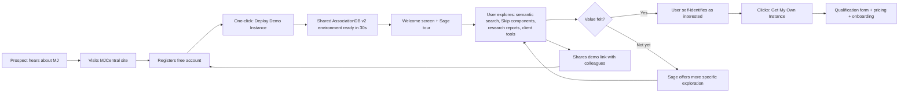
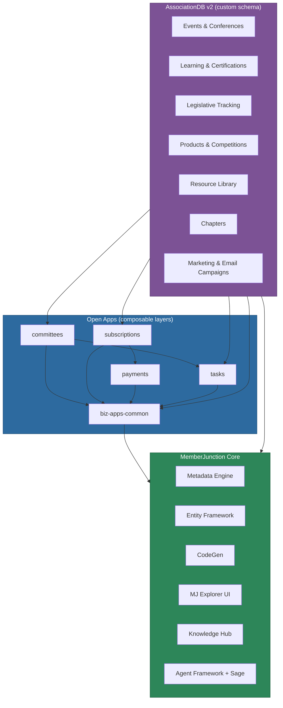
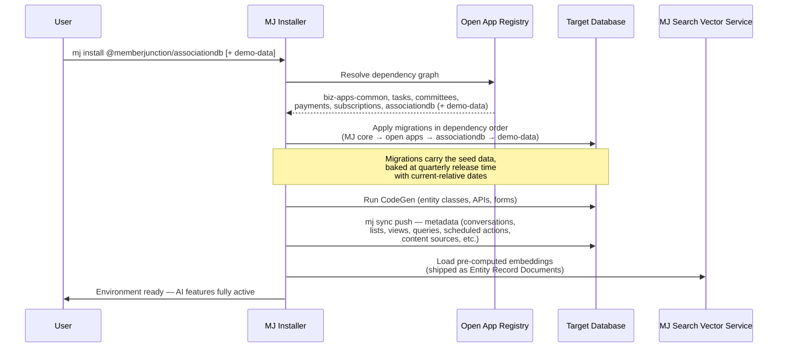
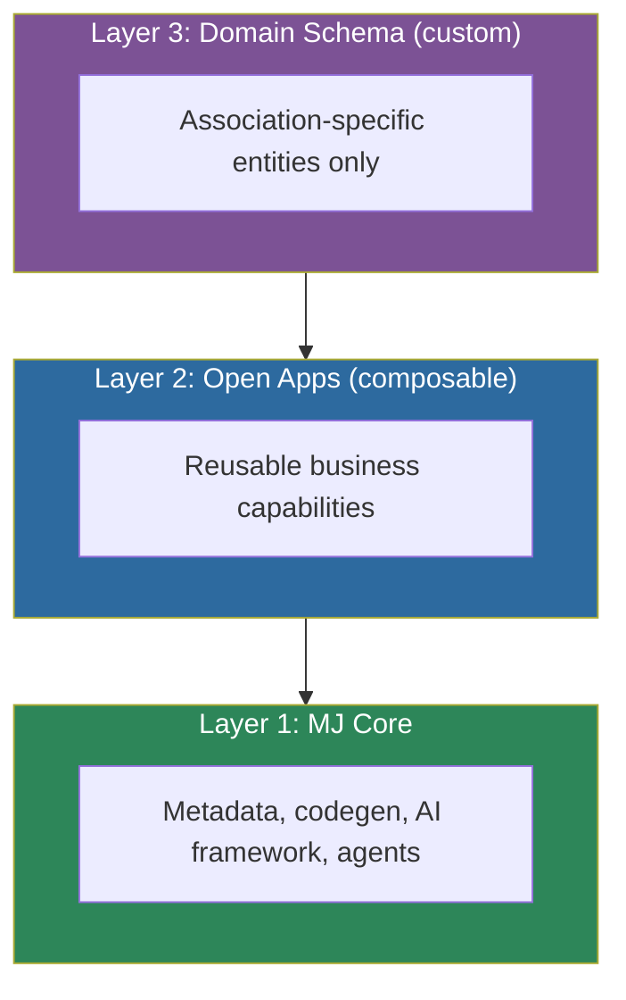
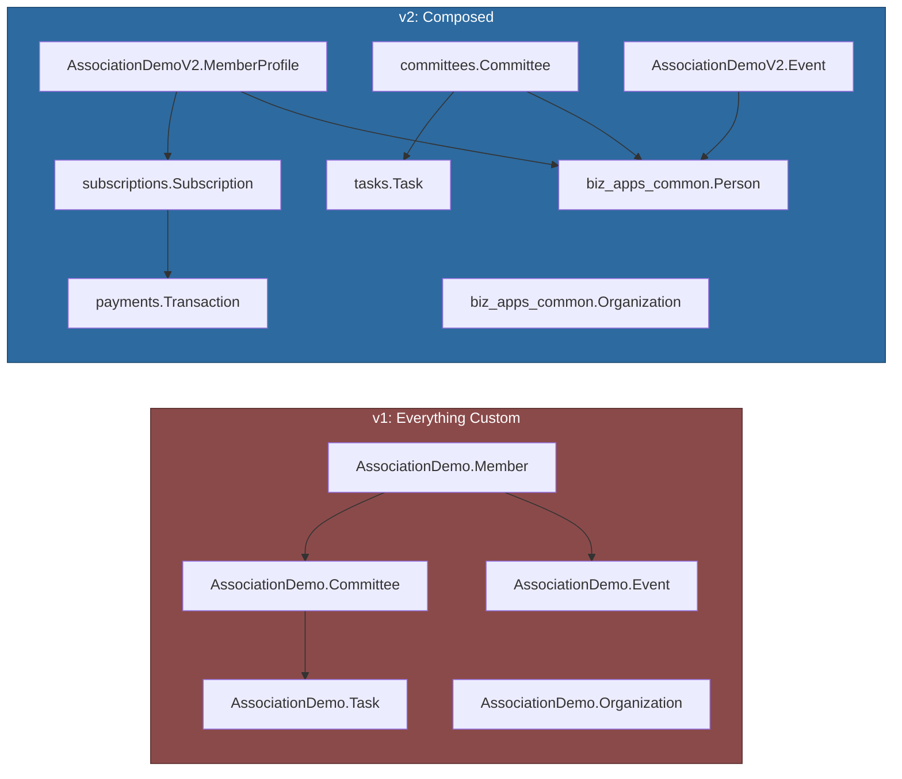
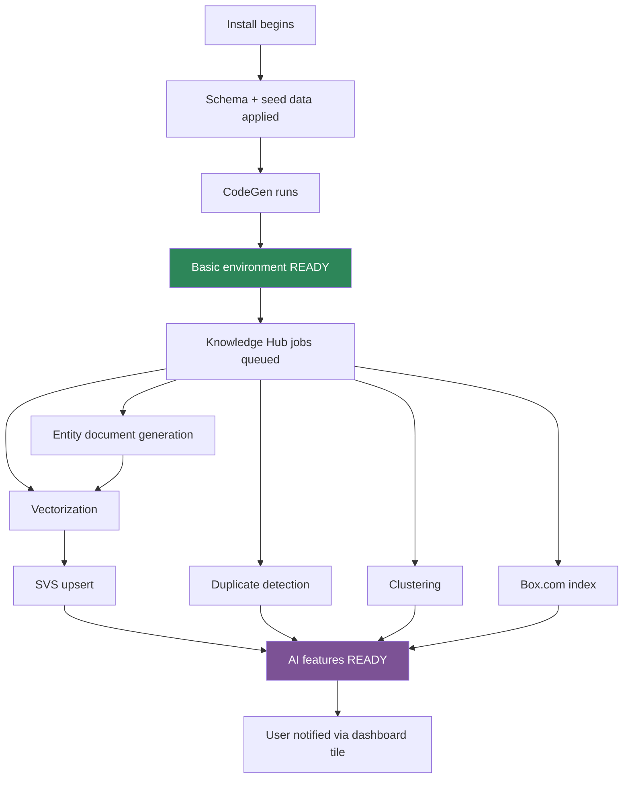
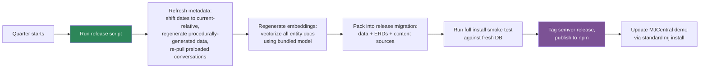
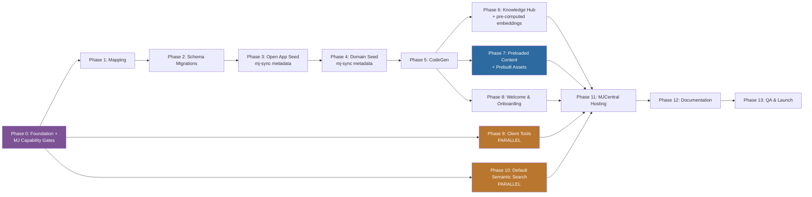

# AssociationDB v2 — Implementation Plan

**A Composable Open App Reference Implementation for MemberJunction**

> **Intended audience:** This document is the complete execution brief for a future Claude Code session that will build AssociationDB v2 end-to-end. It is also usable by any engineer on the MemberJunction team who wants to understand the what, why, and how of this effort. Every task below should be executable with no additional clarification required.

-----

## Table of Contents

1. [Executive Summary](#1-executive-summary)
1. [Business Context & Rationale](#2-business-context--rationale)
1. [Architecture Overview](#3-architecture-overview)
1. [Schema Rearchitecture: v1 vs v2](#4-schema-rearchitecture-v1-vs-v2)
1. [AI & Data Enrichment Layer](#5-ai--data-enrichment-layer)
1. [Preloaded Content & Artifact Lineage](#6-preloaded-content--artifact-lineage)
1. [Release Pipeline, Portability & MJCentral Deployment](#7-release-pipeline-portability--mjcentral-deployment)
1. [Onboarding Experience & Sage Integration](#8-onboarding-experience--sage-integration)
1. [Client Tools: Full Build-Out & Governance](#9-client-tools-full-build-out--governance)
1. [Default Semantic Search on Conversations & Artifacts](#10-default-semantic-search-on-conversations--artifacts)
1. [Implementation Phases & Task Breakdown](#11-implementation-phases--task-breakdown)
1. [Success Criteria](#12-success-criteria)
1. [Risks, Open Questions & Mitigations](#13-risks-open-questions--mitigations)
1. [Appendices](#14-appendices)

-----

## 1. Executive Summary

### 1.1 The Storyline

AssociationDB v1 has served us well as a basic demonstration database. It contains roughly 58 tables, 10,000+ records, and enough realistic association data (the fictional “American Cheese Association”) that prospects can navigate it, Skip can generate components against it, and our team can use it in sales conversations. But v1 has a structural limitation: **every table is custom to AssociationDB**. It doesn’t demonstrate what MemberJunction is actually uniquely good at — composing purpose-built open apps into a complete business ecosystem while layering AI capabilities on top of existing enterprise data.

AssociationDB v2 rebuilds the demo from the ground up around the composition story. Rather than owning its own `Member`, `Organization`, `Committee`, and `Task` tables, v2 delegates to the open app ecosystem:

- **biz-apps-common** becomes the identity substrate (People, Organizations, Relationships, Contact/Address management)
- **tasks** owns all project/task/assignment logic
- **committees** owns governance — real committee management with charters, terms, meetings, and deliverables
- **payments** owns the payment-provider abstraction (Stripe, Chase, Authorize.net)
- **subscriptions** owns recurring billing and membership-as-subscription semantics

What remains in AssociationDB v2’s custom schema is *only* the stuff that is genuinely association-specific and not yet factored into a reusable open app: events/conferences, learning/certifications, legislative tracking, cheese products/competitions, resource library, chapters, and email/marketing campaigns. This is the honest architectural split: “here’s what’s truly domain-specific, and here’s what you compose from the ecosystem.”

On top of the rearchitected schema, v2 ships with the full MJ AI feature set pre-configured and pre-populated: entity documents translating structured records into LLM-readable markdown, **pre-computed embeddings loaded into MJ’s Search Vector Service (SVS)** (no live OpenAI calls at install, no external vector DB required), Apollo-powered enrichment with pre-computed before/after data, duplicate detection results baked in, clustering pre-applied, unified search spanning database records / vector embeddings / bundled PDF Content Sources. Preloaded Skip components, **predictive models** (member churn, renewal likelihood, event ROI, lifetime value, engagement scoring, certification completion, attendance forecast), research agent reports, prebuilt Lists, Views, Queries, Scheduled Actions, Workspaces, and custom form overrides demonstrate the entire MJ capability surface as already-working examples. Every preloaded artifact includes a full conversation history so users can see *how* it was produced.

The entire v2 experience is available via one-click deployment in MJCentral. Any visitor can register for a free account, click “Demo,” and be exploring a shared AssociationDB v2 instance within minutes — no qualification, no sales call, no setup friction. This is our primary top-of-funnel motion. Private instances remain available on upgrade.

Sage, our ambient agent, becomes the onboarding experience itself. A welcome screen on first visit (persisted via the user info engine so it only shows once) introduces the environment. Context-aware client tools scoped to each dashboard let Sage take meaningful action on the user’s behalf. An onboarding tool can be invoked by the user at any time to re-run the guided experience. This makes onboarding feel like *using* the product rather than *learning* the product.

### 1.2 High-Level Bullet Points

- **Rearchitect AssociationDB on composable open apps** — biz-apps-common, tasks, committees, payments, subscriptions
- **Ship AssociationDB v2 itself as a fully portable Open App** — versioned, semver-released quarterly, installable on any MJ instance (local, MJCentral, or a customer’s own) with zero external service dependencies beyond what the host MJ already needs
- **Split into two packages**: `@memberjunction/associationdb` (the reusable application) and `@memberjunction/associationdb-demo-data` (optional companion with fake people, dirty data, sample PDFs, preloaded conversations) — so the schema and capabilities can be studied or forked without dragging demo content into a production DB
- **Pre-configure entity documents, vectorization, clustering, and Apollo enrichment** so AI features work out of the box; **ship pre-computed embeddings as Entity Record Documents loaded into MJ’s Search Vector Service (SVS)** at install time — no live OpenAI calls required during install, no external vector DB required for the demo
- **Seed preloaded research agent reports and Skip components** with complete conversation history exposed via artifact lineage; persist via `mj sync pull` → JSON in metadata folder → `mj sync push` at install (same mechanism for all seed data)
- **Bundle unstructured content as Content Sources + Content Source Items** with PDFs shipped inside the open app (local-files provider); optional Box.com configuration for users who want to demo the Box connector
- **Quarterly release cycle bakes current-relative dates and fresh embeddings into the migration** — so each release is an immutable, self-contained, "always feels recent" install
- **Enable MJCentral one-click deployment** with a shared free-tier instance for lead capture — but the same install path works locally and against any MJ instance
- **Integrate Sage with context-aware client tools**; build onboarding into agent behavior rather than modal tutorial flows
- **Enable semantic search on conversations and artifacts by default** across all of MemberJunction, not just AssociationDB
- **Audit every standard-ship dashboard and form for client tools** and add ongoing guidance to `CLAUDE.md` as a standing development requirement
- **Positioning:** v2 is a *flagship demonstration* of MemberJunction’s composition story — a teaching artifact and lead-capture vehicle, not a product we sell or an officially supported canonical reference implementation

### 1.3 Why This Matters

Prospects evaluating MemberJunction today face a common moment of friction: after they spin up an environment and pull in their data, they look at the tables and ask, “now what?” This is structurally similar to the early days of LLMs — the capability is extraordinary, but the path from capability to value is not obvious without examples. AssociationDB v2 is the answer. It is the shape of the thing. It is the “look what’s possible” they need to see before they can imagine building their own. Every major feature of MJ — composability, AI enrichment, semantic search, agentic workflows, Skip component generation — is visible, functional, and accompanied by the full provenance of how it came to be.

This document specifies how we build it.

-----

## 2. Business Context & Rationale

### 2.1 The Adoption Problem We’re Solving

Associations and nonprofits that want to adopt AI face a narrative they’ve been told repeatedly: *you must modernize your legacy systems first, you must clean your data first, you must replace your AMS/CRM first, you must do a data warehouse migration first*. This narrative is wrong, and it costs organizations years of time and millions of dollars — often delaying AI adoption indefinitely while they chase a modernization that never finishes.

MemberJunction’s thesis is the opposite: **source data where it lives, replicate it as a read-only snapshot, and build AI experiences on top immediately**. MJ has the tooling (data cleansing, entity documents, vectorization, universal search, classification, agentic frameworks) to operate on messy real-world data without demanding that data be cleaned first. Integration is bidirectional when needed, but the read-only replica is the simpler starting point and the one we lead with.

AssociationDB v2 exists to make this thesis tangible. It shows a fully realized association environment — events, certifications, committees, subscriptions, legislative tracking, competitions — and it shows AI features working *on* that data: semantic search across members and resources, auto-classification of documents, clustering of engagement patterns, enrichment correcting stale employer records, research agents producing reports. Nothing in the demo requires the user to believe the modernization narrative. It proves the alternative.

### 2.2 Why a Free Shared MJCentral Instance

The biggest conversion lever we have is reducing the time between “I heard about MemberJunction” and “I have seen MemberJunction do something impressive with realistic data.” Every minute of friction in that path costs conversions.

**Our decision: a free, shared AssociationDB v2 instance available to anyone who registers on MJCentral, with no qualification questions, no sales call, and no time limit.**

The rationale:

1. **Marginal cost is near zero.** A single shared instance with a read-only demo dataset and shared conversational AI services serves many concurrent evaluators without meaningful incremental infrastructure spend. Embeddings ship pre-computed inside the open app and load into MJ’s native SVS at install — no external vector DB cost, no per-evaluator vectorization. The dominant variable cost is agent token spend (Sage / Skip / research agents) on prospect-driven sessions, addressed by the cost guardrails in §7.7.
1. **Qualification happens *after* value demonstration, not before.** Traditional B2B SaaS gates trials behind demo calls and qualification forms because the product is not inherently self-demonstrating. MJ, with a well-constructed demo environment, can self-demonstrate. Asking qualifying questions before the “aha moment” filters out the exact people we want to reach — curious technologists, association staff who heard about us at a conference, consultants doing discovery. Asking them after they’ve spent 20 minutes exploring is completely different. They’re now invested.
1. **Viral distribution.** Evaluators who find the demo compelling will share the link with colleagues. A free shared instance means colleagues can come in directly without procurement friction. Each shared instance visitor is a potential lead, a potential advocate, and a potential champion inside an organization.
1. **Sales posture shift.** Instead of “let me show you a slide deck and schedule a demo,” our sales motion becomes “have you spent 15 minutes in the demo? Here’s the link.” This is a dramatically stronger posture because it inverts the dynamic: the prospect has already self-selected as interested before the conversation starts.
1. **Feedback and telemetry.** With opt-in analytics on the shared instance (privacy-preserving, aggregate only), we get a continuous read on what features prospects actually engage with, which questions they ask Sage, and where they drop off. This informs product prioritization in a way no amount of customer interviews can match.
1. **Upgrade path is clean.** When an evaluator decides they want their own instance — with their own data, their own branding, their own API keys — that is the natural qualification moment. At that point we ask the qualifying questions and present pricing, and they’re already bought in on the value.

### 2.3 Positioning AssociationDB v2 Within the AMS Ecosystem

A deliberate and important positioning choice: **AssociationDB v2 is not an AMS competitor, and it is not a product we sell.** It is a demonstration of composition. More importantly, it demonstrates how MemberJunction *amplifies* the AMS and line-of-business systems our customers already rely on, rather than replacing them.

**AMS vendors are our integration partners, not our competitors.** MJ’s value proposition is the AI and data layer that sits alongside a customer’s battle-hardened AMS — the system they have invested years configuring to handle their core transaction processing, member records, dues, and financial operations. Replacing that system is high-risk, expensive, and rarely justified. Modernizing it *in place* with AI capabilities is exactly what MJ is designed to do. In practice, this **extends the useful life of legacy AMS platforms by years or even decades**: customers get contemporary AI workflows (semantic search, enrichment, agentic automation, research agents, Skip-generated components) without touching the transactional substrate that actually runs their business.

This reframing unlocks a **co-selling motion** with AMS vendors. Rather than "how do we compete with this platform," the conversation becomes "how do we make your customers more valuable to you by enabling capabilities you don’t need to build yourselves." AssociationDB v2 demonstrates this story against a fictional dataset, but the same composition pattern applies to any customer running any AMS. The demo should make this narrative legible to AMS vendor audiences as well as end customers.

Other positioning considerations:

- **We want to keep AssociationDB v2’s scope disciplined.** If we started selling it, every prospect feature request would pull us into AMS-land. By keeping it as a demo, we preserve its usefulness as a teaching artifact.
- **We are comfortable if third parties use v2 as a starting point for their own applications**, including full AMS builds. That’s downstream of our goals and genuinely useful to the ecosystem. But the “we built and sell an AMS” story is not one we’re telling.

The open apps themselves (biz-apps-common, tasks, committees, payments, subscriptions) are separate commercial/open-source considerations with their own product lifecycles. AssociationDB v2 demonstrates them composed together. Users who want to build on top of those open apps for their own purposes can — that’s the point.

### 2.4 Lead Funnel Integration



This funnel is deliberately simple. The critical design choice is that *everything before step J is friction-free*. We don’t ask for a company email, we don’t ask for a role, we don’t ask for a project timeline. We ask only for what we need to authenticate them to MJCentral. Every qualifying conversation happens after the product has sold itself.

-----

## 3. Architecture Overview

### 3.1 The Open App Dependency Graph

AssociationDB v2 sits at the top of a dependency graph of open apps. Each layer provides capability that the layers above it consume.



**Key property:** each open app is independently installable and independently versioned. AssociationDB v2 declares its dependencies in its Open App manifest (the JSON file at repo root), and the MJ installer resolves and applies them in the correct order.

### 3.2 Install-Time Sequencing

When a user deploys AssociationDB v2 (locally via CLI, in MJCentral via the deploy button, or on any other MJ instance), the installer executes a single uniform sequence — no special MJCentral pipeline, no golden-image clone, no background AI ramp-up:



**Critical design choice:** every install path is identical and every install completes with full AI capability ready. Embeddings are pre-computed at release time and shipped *with the open app* as Entity Record Documents, loaded into MJ’s Search Vector Service (SVS) at install. No live OpenAI calls during install, no external vector DB required for the demo. Date math is baked into the release migration via the quarterly release pipeline (see §7) — at install time, dates are simply applied as-is.

The same open app installs in identical fashion on:
- A developer’s local MJ instance for sandboxing or learning
- A customer’s own MJ instance for evaluation
- MJCentral private tenants (one DB per customer)
- The MJCentral shared demo instance (one DB, many evaluator users via row-level security)

There is no special path for any of these. MJCentral is just one place where this open app happens to be installed — not a distinct deployment architecture.

### 3.3 The Three Layers of Responsibility



A design principle worth stating explicitly: **if a capability could reasonably be used by a non-association business (a chamber of commerce, a standards body, a professional society), it belongs in an open app, not in AssociationDB v2’s custom schema.** This is the test. Committees? Universal. In committees open app. Cheese product competitions? Association-specific (and arguably cheese-specific). Stays in AssociationDB v2.

-----

## 4. Schema Rearchitecture: v1 vs v2

### 4.1 What’s in v1 Today

v1’s schema lives entirely in the `AssociationDemo` SQL Server schema. It contains 58 tables across 13 domains:

|Domain               |v1 Tables|Notes                                                                                  |
|---------------------|---------|---------------------------------------------------------------------------------------|
|Core Membership      |4        |`Member`, `Organization`, `MembershipType`, `MembershipStatus` — owned by AssociationDB|
|Events & Conferences |3        |Events, sessions, registrations — owned by AssociationDB                               |
|Learning & Education |3        |Courses, enrollments, certificates — owned by AssociationDB                            |
|Financial Operations |3        |Invoices, line items, payments — owned by AssociationDB                                |
|Marketing & Campaigns|3        |Campaigns, segments, outreach — owned by AssociationDB                                 |
|Email Communications |3        |Templates, sends, engagement — owned by AssociationDB                                  |
|Chapters & Geographic|3        |Chapters, members, officers — owned by AssociationDB                                   |
|Governance           |4        |Committees, board positions, assignments — **duplicative with committees open app**    |
|Community Forums     |8        |Threads, posts, moderation, reactions — owned by AssociationDB                         |
|Resource Library     |6        |Resources, categories, downloads, bookmarks — owned by AssociationDB                   |
|Certifications       |6        |Certifications, CE records, renewals — owned by AssociationDB                          |
|Products & Awards    |6        |Products, competitions, judges — owned by AssociationDB                                |
|Legislative Tracking |6        |Issues, positions, advocacy actions — owned by AssociationDB                           |

### 4.2 What Changes in v2

v2’s schema lives in a new schema name, `AssociationDemoV2`, so v1 and v2 can coexist in the same database if needed. The domain table remapping:

|Domain                   |v2 Location               |Notes                                                |
|-------------------------|--------------------------|-----------------------------------------------------|
|People / Org identity    |`biz_apps_common` schema  |v2 `Member` becomes an extension that FKs to `Person`|
|Tasks & Assignments      |`tasks` schema            |Used across committees, events, legislative          |
|Committees               |`committees` schema       |Real committee app replaces fake governance tables   |
|Payments                 |`payments` schema         |Abstraction over Stripe/Chase/Authorize.net          |
|Subscriptions            |`subscriptions` schema    |Recurring billing, membership-as-subscription        |
|Events & Conferences     |`AssociationDemoV2` schema|Custom — FK to `biz_apps_common.Person`              |
|Learning & Certifications|`AssociationDemoV2` schema|Custom — FK to `biz_apps_common.Person`              |
|Chapters & Geographic    |`AssociationDemoV2` schema|Custom — FK to `biz_apps_common.Person`              |
|Community Forums         |`AssociationDemoV2` schema|Custom — FK to `biz_apps_common.Person`              |
|Resource Library         |`AssociationDemoV2` schema|Custom                                               |
|Products & Competitions  |`AssociationDemoV2` schema|Custom (cheese-specific)                             |
|Legislative Tracking     |`AssociationDemoV2` schema|Custom                                               |
|Marketing & Email        |`AssociationDemoV2` schema|Custom for now; candidate for future open app        |

### 4.3 Before/After Conceptual Comparison



The critical shift: in v1, a “member” is a free-standing entity with fields like `FirstName`, `LastName`, `Email`, `EmployerName`. In v2, a “member” becomes a *role* that a `Person` plays in the association context. The Person record lives in `biz_apps_common` with all the canonical identity fields, and the `MemberProfile` record in `AssociationDemoV2` carries association-specific attributes (member number, join date, membership type, renewal dates, chapter affiliation). This is the “Person has many Profiles” pattern and is common in well-factored identity systems.

### 4.4 The Member Entity: Detailed Example of the Refactor

**v1 structure (simplified):**

```sql
CREATE TABLE AssociationDemo.Member (
    MemberID INT IDENTITY PRIMARY KEY,
    FirstName NVARCHAR(100),
    LastName NVARCHAR(100),
    Email NVARCHAR(255),
    Phone NVARCHAR(50),
    EmployerID INT REFERENCES AssociationDemo.Organization(OrganizationID),
    JobTitle NVARCHAR(200),
    MemberNumber NVARCHAR(50),
    JoinDate DATE,
    MembershipTypeID INT,
    MembershipStatus NVARCHAR(50),
    RenewalDate DATE,
    ChapterID INT,
    -- ...dozens more fields mixing identity, employment, and membership concerns
);
```

**v2 structure (refactored across layers):**

```sql
-- In biz_apps_common schema (identity)
CREATE TABLE biz_apps_common.Person (
    PersonID UNIQUEIDENTIFIER PRIMARY KEY,
    FirstName NVARCHAR(100),
    LastName NVARCHAR(100),
    -- canonical contact info, demographics, preferences
);

CREATE TABLE biz_apps_common.PersonEmail (
    PersonEmailID UNIQUEIDENTIFIER PRIMARY KEY,
    PersonID UNIQUEIDENTIFIER REFERENCES biz_apps_common.Person(PersonID),
    Email NVARCHAR(255),
    IsPrimary BIT,
    -- etc.
);

CREATE TABLE biz_apps_common.Employment (
    EmploymentID UNIQUEIDENTIFIER PRIMARY KEY,
    PersonID UNIQUEIDENTIFIER REFERENCES biz_apps_common.Person(PersonID),
    OrganizationID UNIQUEIDENTIFIER REFERENCES biz_apps_common.Organization(OrganizationID),
    JobTitle NVARCHAR(200),
    StartDate DATE,
    EndDate DATE,
    IsPrimary BIT
);

-- In AssociationDemoV2 schema (association-specific)
CREATE TABLE AssociationDemoV2.MemberProfile (
    MemberProfileID UNIQUEIDENTIFIER PRIMARY KEY,
    PersonID UNIQUEIDENTIFIER NOT NULL REFERENCES biz_apps_common.Person(PersonID),
    MemberNumber NVARCHAR(50) NOT NULL UNIQUE,
    JoinDate DATE NOT NULL,
    MembershipTypeID UNIQUEIDENTIFIER REFERENCES AssociationDemoV2.MembershipType(MembershipTypeID),
    ChapterID UNIQUEIDENTIFIER REFERENCES AssociationDemoV2.Chapter(ChapterID),
    -- ...
);

-- Membership as subscription (not a separate concept)
CREATE TABLE AssociationDemoV2.MembershipSubscription (
    MembershipSubscriptionID UNIQUEIDENTIFIER PRIMARY KEY,
    MemberProfileID UNIQUEIDENTIFIER REFERENCES AssociationDemoV2.MemberProfile(MemberProfileID),
    SubscriptionID UNIQUEIDENTIFIER REFERENCES subscriptions.Subscription(SubscriptionID),
    -- links the member profile to the canonical subscription record
);
```

This decomposition:

- Makes identity reusable across non-association contexts
- Centralizes email, phone, and address management in one place
- Eliminates the ambiguity of “which employer is current” by making employment a history table
- Treats membership as a subscription, which it is
- Separates concerns cleanly: `MemberProfile` has only association-specific attributes

### 4.5 Mapping Table: Every v1 Table to its v2 Destination

A complete mapping table is maintained in Appendix A. The Claude Code session implementing this plan must produce this mapping as a deliverable before writing any migrations, because the seed data scripts depend on knowing where each v1 entity’s equivalent lives.

-----

## 5. AI & Data Enrichment Layer

### 5.1 What Ships Pre-Configured in v2

The design principle: **a user who has just deployed AssociationDB v2 should, without any additional configuration, be able to experience the full AI capability surface of MemberJunction.** This requires pre-configuring the following on install:

1. **Entity Documents** on high-value entities (Person, MemberProfile, Event, Course, Certification, Product, LegislativeIssue, ForumThread, Resource) — templates ship in the application package
1. **Pre-computed embeddings** generated at release time, shipped as Entity Record Documents in `associationdb-demo-data`, loaded into MJ’s SVS on install — no live vectorization jobs needed
1. **Embedding model declared in the open app manifest** (default: OpenAI `text-embedding-3-large`); install validates host MJ can produce query-time embeddings in the same model family
1. **Unified Search configuration** spanning SQL, SVS-backed vector search, and bundled Content Sources
1. **Duplicate detection** results pre-computed and surfaced on install (to showcase de-duplication on realistic dirty data with no wait)
1. **Apollo enrichment** pre-configured on Person and Organization
1. **Clustering jobs** on Person (segmentation) and Event (thematic grouping)
1. **Sample Box.com folder** with fake internal association PDFs, pre-indexed

### 5.2 Entity Documents — the Structured-to-Markdown Translation

Entity documents are one of MJ’s more subtle but high-leverage features. They translate structured records into markdown representations that LLMs can reason over natively. For example, a `MemberProfile` record becomes something like:

```markdown
# Member Profile: Elena Rodriguez

**Member Number:** 10234
**Joined:** June 14, 2022
**Membership Type:** Professional — Artisan Cheesemaker
**Chapter:** Pacific Northwest
**Status:** Active

## Identity
Elena Rodriguez is the head cheesemaker and co-owner of Foggy Valley Creamery, a 12-person artisan dairy in Port Townsend, WA. She has been a member since 2022 and holds Master Cheesemaker certification through WCMA.

## Engagement
- Attended: ACS Annual 2024, 2025; regional workshops 2023–2025
- Courses completed: Food Safety Level 2, Sensory Evaluation, HACCP for Small Producers
- Forum activity: 34 posts, primarily in Washed Rind Techniques and Small Producer Business
- Committee service: Standards Committee (2024–present)
```

This representation is what gets embedded, what gets searched, and what Sage reasons over when answering “tell me about Elena.” It is generated automatically from the structured record plus related records via the entity document template engine.

v2 ships with entity document templates for every high-value entity. The templates are stored as MJ metadata and can be viewed and edited in MJ Explorer — teaching users by example how entity documents work.

### 5.3 Duplicate Detection Showcase

Real associations have dirty data. To demonstrate MJ’s de-duplication capability convincingly, v2 intentionally seeds a subset of the Person data with realistic duplicates — same person entered twice with slight variations in name spelling, different email, different employer snapshot. The install script fires off a duplicate detection job as part of setup, and the results are surfaced on a Knowledge Hub dashboard. Users can see:

- “We found 47 probable duplicates across 2,000 members”
- Side-by-side comparison of each pair with suggested resolution
- The embedding similarity score and the heuristic signals that contributed

This turns an abstract capability into a vivid, concrete demonstration.

### 5.4 Apollo Enrichment Showcase

Apollo.io provides enrichment data for business contacts: current employer, job title, LinkedIn URL, phone numbers, etc. v2 ships with:

- A subset of Person records with *intentionally stale* employer data (person is marked as working at a company they left two years ago)
- A pre-configured Apollo integration that can be run on demand from the Person dashboard
- A before/after comparison view showing what Apollo returned and how it differs from stored data
- A user-initiated “apply updates” flow that writes the enriched data back and logs the audit trail

### 5.5 Clustering Showcase

Clustering on the Person and Event entities produces natural groupings that illuminate the association’s membership and programming. On Persons, clusters might emerge like “Small artisan producers in the Northeast,” “Retail buyers in urban markets,” “QA/food safety managers at large producers.” On Events, clusters might emerge like “Technical workshops,” “Business/operations conferences,” “Regional networking events.”

These clusters are pre-computed on install and surfaced in a Knowledge Hub dashboard. Sage has client tools to explain what a cluster means, re-cluster with different parameters, or drill into cluster members.

### 5.6 Unified Search Configuration

v2 configures unified search across:

- **SQL layer** — direct indexed search on MemberProfile, Event, Course, Resource, Forum, Committee, LegislativeIssue
- **Vector layer** — semantic search against MJ’s SVS (loaded with pre-computed entity-document embeddings at install)
- **Box.com** — full-text search against the sample internal-document repository via Box’s native search API

A unified query (“member engagement Pacific Northwest”) hits all three layers in parallel and returns a ranked, merged result set with source attribution. This is visible in the Explorer search bar and available to Sage as a client tool.

### 5.7 Knowledge Hub Jobs on Install



For MJCentral deployments, everything downstream of “Install begins” is skipped in favor of a snapshot clone (see §7).

-----

## 6. Preloaded Content & Artifact Lineage

### 6.1 What Gets Preloaded

v2 ships with a library of preloaded conversational artifacts that showcase what’s possible. These fall into three categories:

**Skip components** — fully-built interactive React components for common association analytics dashboards:

- Member engagement dashboard (activity heatmap, cohort retention, top engagers)
- Event ROI analyzer (cost, attendance, NPS, revenue attribution)
- Committee health scorecard (meeting cadence, deliverable completion, member contribution)
- Certification pipeline tracker (enrollments → completions → renewals)
- Legislative impact visualizer (positions, advocacy actions, outcome tracking)

**Research agent reports** — multi-source synthesized reports produced by Sage / research agents:

- “Membership health assessment — why are members lapsing?”
- “Event program review — which event formats drive the most engagement?”
- “Learning program effectiveness — are our courses producing certified practitioners?”
- “Legislative advocacy retrospective — what worked this year, what didn’t?”

**Conversation histories** — every preloaded artifact is accompanied by the conversation that produced it, visible and navigable in the UI.

### 6.2 Why Full Artifact Lineage Matters

A common failure mode of AI demos: the user sees an impressive output and thinks “that’s magic” rather than “I could do that.” Showing the conversation that produced each artifact — including the prompts, the iterations, the corrections — demystifies the process. The user thinks, “oh, they just asked Sage for this. I could ask Sage for something similar.” This is the psychological transition from *spectator* to *participant*.

Every preloaded artifact in v2 therefore links to:

- The full conversation thread that generated it
- The agent or agents involved
- The entity data referenced
- Any intermediate artifacts produced along the way

MJ’s artifact framework already tracks this lineage. v2 just needs to preload conversations with artifacts and ensure the navigation UX makes the lineage discoverable.

### 6.3 How Preloaded Conversations Are Authored

These aren’t real user conversations — they’re curated demo conversations. The authoring workflow:

1. A Blue Cypress team member (or Claude Code in a scripted flow) has a real conversation with Sage in a dev environment to produce the desired artifact
1. The conversation is reviewed, edited for clarity if needed, and approved
1. A “demo seeding” script exports the conversation + artifact + metadata as a JSON blob
1. The blob is committed to the AssociationDB v2 seed data directory
1. Install applies the seed blob, creating the conversation and artifact records in the demo database with a system user as the owner and `IsSharedDemo = TRUE`

All demo instance users can see these conversations in read-only mode. They can also fork them — “continue from this point” — to produce their own variations, which become their private artifacts.

-----

## 7. Release Pipeline, Portability & MJCentral Deployment

### 7.1 Design Goal: Zero External Service Dependencies for the Demo

AssociationDB v2 is a fully self-contained Open App. Every piece of content the demo needs — schema, seed data, embeddings, sample documents, preloaded conversations, prebuilt models, lists, views, queries, scheduled actions — ships *inside* the open app package (or its companion `-demo-data` package). Install is a single command: `mj install @memberjunction/associationdb [@memberjunction/associationdb-demo-data]`. No golden-image clone, no shared external Pinecone instance, no Blue Cypress-operated infrastructure required to make the demo work.

This is enabled by three architectural choices working together:

1. **Migrations carry the seed data**, baked at release time with current-relative dates (see §7.3)
1. **Embeddings ride along as Entity Record Documents** loaded into MJ’s Search Vector Service (SVS) at install time (see §7.4)
1. **Unstructured content is bundled** via Content Sources + Content Source Items, with PDFs shipped inside the package and an optional Box.com Content Source for users who want to also demo that connector (see §7.5)

The result: identical install path everywhere. Local laptop, customer’s own MJ instance, MJCentral private tenant, MJCentral shared instance — same `mj install`, same fully-ready environment when it completes.

### 7.2 Quarterly Release Cycle

The open app releases on a **quarterly cadence** with a near-fully-automated CI release pipeline:



Properties of this release process:

- **Deterministic & reproducible.** Same seed inputs → byte-identical release every time. Reviewable as a diff before tagging.
- **Date staleness ceiling = quarter length.** End-of-quarter, events that were "next week" at release are now "two months ago." For an association demo this is invisible. If a quarter slips, staleness grows but remains acceptable.
- **Each release is a self-contained, immutable artifact.** No "depends on when the install ran" math. Anyone running `mj install @memberjunction/associationdb@2026.Q2` gets exactly what was tested at release time.
- **Near-fully automated.** Release prep is a CI script. Human review of the resulting diff before tag.

### 7.3 Date Handling — Baked at Release, Not Computed at Install

Today the plan’s seed data has dates that need to feel current (events in the recent past or near future, certifications still valid, etc). Rather than computing date shifts at install time, the release pipeline does it once:

1. All seed metadata is authored with dates *relative to release date* (anchored by an `OFFSET_DAYS_FROM_RELEASE` convention or similar)
1. The release script computes the resolved absolute dates against the release-tag date and writes them into the migration
1. Install just applies the migration — dates are already correct

No `DATEDIFF` math at install time, no per-install drift. Each release is a temporal snapshot.

### 7.4 Embeddings — Pre-Computed, Shipped as Entity Record Documents, Loaded into SVS

Embeddings for the seed data are computed once at release time and committed alongside the seed data as Entity Record Document metadata. At install, `mj sync push` loads them into MJ’s Search Vector Service (SVS) — MJ’s native vector storage and similarity-search primitive.

For this demo’s scale (a few thousand vectors across People, MemberProfiles, Events, Courses, Forum threads, etc.) SVS is more than sufficient — pgvector handles it trivially under the hood, and the SVS abstraction means consumers don’t need a separate external vector DB just to run the demo. Larger production deployments can still wire SVS to external vector backends; that’s a deployment concern, not an open app concern.

**Important prerequisite**: an MJ search provider backed by SVS must exist (or be built). See Phase 0 task 0.0.5 — if this provider isn’t already in place, building it is a sibling MJ capability work item that lands as part of (and benefits beyond) v2.

**Embedding model declaration.** The open app manifest declares the embedding model used to produce the bundled vectors (default: OpenAI `text-embedding-3-large`). At install, MJ validates the host instance can produce query-time embeddings in the same model family — otherwise query vectors won’t live in the same space as the stored vectors. If unavailable, install warns the user and degrades gracefully (SQL search still works; semantic search disabled).

### 7.5 Unstructured Content — Bundled via Content Sources

The fake internal-association PDFs (board minutes, policy docs, meeting notes, research briefs, event programs) ship as **two Content Sources** in the demo package:

- **Local-files Content Source** (always-on): ~30–50 PDFs bundled inside `@memberjunction/associationdb-demo-data`, ~25MB total, with their Content Source Items declared in metadata and embeddings pre-computed. Works out of the box on every install.
- **Box.com Content Source** (optional): same content references published to a Box folder; activated only if the installer supplies Box credentials. Demonstrates the Box connector for users who want to see it.

This dogfoods the Content Source abstraction, demonstrates two providers in parallel, and avoids any hard dependency on Blue Cypress operating an external service.

### 7.6 MJCentral Deployment

With a fully portable open app, MJCentral becomes the simplest case: it’s just a hosting environment that happens to run the same `mj install`. Two product variants are exposed to evaluator users:

**Shared demo instance (free, no qualification):**

- Single shared database across many evaluator users, provisioned via one `mj install` of the open app
- Each user gets their own MJ user account with appropriate row-level scoping
- Users can create their own conversations, artifacts, saved views — scoped to their user via MJ’s standard row-level security
- Demo conversations, Skip components, prebuilt models, and other prebuilt assets are visible to all (`IsSharedDemo = TRUE`)
- Read/write on their own data; read-only on shared demo data
- Nightly reset rolls back any mutations to shared data; preserves user-scoped data

**Private demo instance (upgrade path):**

- Dedicated MJ tenant + DB, provisioned via the same `mj install`
- Full read/write across all data
- Available on a paid tier or as part of a qualified trial

The MJCentral provisioning surface for v2 is now trivial: spin up the tenant infra, drop in LLM credentials, run `mj install`. No bespoke clone scripts, no parallel Pinecone collections, no golden-image rebuild jobs to maintain. Wall time is dominated by tenant infrastructure provisioning (DNS, TLS, container startup), not by demo content loading. Realistic target: under a few minutes for private; effectively instant for shared (user just gets routed into the already-running shared instance).

### 7.7 Abuse & Cost Guardrails for the Shared Instance

A free shared instance is exposed to the open internet, so abuse prevention and cost control are operational requirements — not optional polish. Guardrails operate at three layers:

**Layer 1 — Signup gating (tiered, no hard qualification):**

- **Business-email domains** (inferred by excluding a deny-list of common personal providers: gmail.com, yahoo.com, outlook.com, hotmail.com, icloud.com, and similar) — instant provisioning after standard email verification
- **Personal-email domains** — email verification plus captcha plus a short cooldown before provisioning, with a clear explanation ("to protect the free shared demo from abuse; business email gets instant access")
- **Abuse signals** — integrate disposable-email detection, IP rate limiting, and behavioral heuristics via standard third-party services
- **No qualification questions at this stage.** The only gate is abuse prevention — not lead qualification, which happens later in the funnel when the user clicks "Get My Own Instance"

The intent is to keep friction minimal for legitimate evaluators while making bulk abuse costly. Consultants and individual technologists on personal email still get in; only throwaway spam signups are meaningfully deterred.

**Layer 2 — Per-user application-layer limits:**

- **Daily token budgets** for Sage, Skip, and other agent-driven operations (sized generously for normal exploration; excess triggers polite throttling with an "upgrade for unlimited" prompt)
- **Concurrent session caps** per user (prevents a single compromised account from spinning up parallel expensive workloads)
- **Rate limits on expensive operations** — research agents, Skip component generation, bulk vectorization — because these are the cost-dominant actions

**Layer 3 — Cost telemetry from day one:**

Guardrails are only as good as the observability behind them. Shared-instance operations include live cost and usage telemetry from launch, not added reactively after a bill shock:

- **Per-user metrics**: Sage token spend, Skip token spend, agent invocation count, session duration, API call count, vector query count
- **Aggregate metrics**: daily active users, cost per user per day, cost per user per session, spike detection, anomaly flags
- **Live operations dashboard** with per-user drilldown for abuse investigation
- **Alerting thresholds defined before launch**: a per-user daily cost ceiling triggers automatic throttling plus investigation; a daily aggregate-burn threshold triggers team escalation

The cost position today is favorable — embeddings ship pre-computed inside the open app and load into MJ’s own SVS (no external vector DB cost, no per-evaluator vectorization). The dominant variable cost is agent token spend (Sage, Skip, research agents) — real money per session, and unattended abuse can escalate quickly. Monitor, cap, and adjust as actual usage patterns emerge.

-----

## 8. Onboarding Experience & Sage Integration

### 8.1 Principle: Onboarding Is Product Usage

The goal is to make onboarding *feel like* using MJ, not *learning to use* MJ. This means:

- No modal tutorial overlays that block the UI
- No mandatory click-through sequences
- No separate “tutorial mode”
- Onboarding happens via Sage — the same agent the user will rely on for actual work

### 8.2 First-Visit Welcome Screen

On a user’s first visit to a v2 instance, we show a welcome screen. The user info engine (`UserSettings` or equivalent — Claude Code should confirm exact naming in the current codebase) tracks a `DemoWelcomeShown` flag per user, defaulting to false. On load, if the flag is false, show the welcome screen and set the flag to true after the user dismisses or interacts.

The welcome screen is visually polished and contains:

- A brief (3-sentence) introduction: “This is AssociationDB v2, a demo association built entirely from MemberJunction’s composable open apps. Explore on your own, or let Sage show you around.”
- A prominent CTA: “Start Guided Tour with Sage”
- A secondary CTA: “Explore on My Own”
- A tertiary link: “Learn about MemberJunction”
- A dismiss control that stores the “don’t show again” preference

### 8.3 The Guided Tour Mechanism

When the user clicks “Start Guided Tour,” the client invokes a tool call against Sage that loads a context snippet (think of it as a dynamic, instance-scoped system message addendum) into the Sage session. This context instructs Sage to:

- Proactively introduce each major area of the demo (members, events, certifications, committees, knowledge hub, legislative)
- Use client tools to navigate the user to relevant screens
- Offer to demonstrate specific capabilities (semantic search, Apollo enrichment, Skip component generation)
- Allow the user to interrupt and ask their own questions at any point
- Gracefully end the tour when the user indicates they’re done

The tour is not a script. It’s an agent with a loose agenda, which is the right level of structure — enough to guide, not so much that it feels canned.

### 8.4 Onboarding as a Reinvocable Tool

The welcome screen is intentionally shown only once. But some users will want to re-run the tour later — perhaps they dismissed it initially and now want guidance, or perhaps they’re bringing a colleague through. Sage exposes an `onboarding` tool that the user can invoke at any time by asking something like “can you give me the tour?” or “walk me through this demo.” This tool loads the same instance-scoped context and kicks off the tour flow.

By exposing it as a tool rather than hardcoding into Sage’s base system prompt, we avoid token cost on every Sage invocation and keep the base agent lean. Tour context is loaded only when requested.

### 8.5 Sage’s Context-Aware Client Tools

Sage is context-aware via two mechanisms:

**Client context snapshot** — the UI passes a structured snapshot to Sage on each interaction describing where the user is: current route, currently selected entity, visible data, filters applied, etc. Sage uses this to respond relevantly without the user having to re-explain context.

**Scoped client tools** — each UI surface (dashboard, form, list view) declares a set of client tools available to Sage in that context. These tools can:

- Trigger navigation
- Modify the visible state (filters, sorts, selections)
- Invoke actions on entities (save, delete, run workflow)
- Request clarification from the user
- Launch other agents

For AssociationDB v2 specifically, every dashboard needs a considered set of client tools. Examples:

|Dashboard               |Representative Client Tools                                                                                                               |
|------------------------|------------------------------------------------------------------------------------------------------------------------------------------|
|Member list             |`filter_members(status, chapter, membership_type, tenure)`, `select_member(person_id)`, `bulk_tag(tag, member_ids)`, `export_view(format)`|
|Member detail           |`enrich_with_apollo()`, `compose_email_to_member()`, `view_engagement_history()`, `add_to_committee(committee_id)`                        |
|Knowledge Hub — Clusters|`explain_cluster(cluster_id)`, `re_cluster(parameters)`, `drill_into_cluster(cluster_id)`, `export_cluster_members(cluster_id, format)`   |
|Event detail            |`view_registrations()`, `generate_attendee_report()`, `send_reminder_to_unregistered()`, `analyze_session_attendance()`                   |
|Committees dashboard    |`view_meeting_history(committee_id)`, `propose_new_member(committee_id, person_id)`, `generate_committee_report(committee_id)`            |
|Legislative issue detail|`track_advocacy_actions()`, `draft_position_statement()`, `identify_engaged_members_by_state(state)`                                      |

The build-out of these tools is a major work stream (see §9).

-----

## 9. Client Tools: Full Build-Out & Governance

### 9.1 Scope of the Audit

Every standard-ship dashboard and every standard-ship form in MemberJunction needs a client tools audit. This is not limited to AssociationDB v2 — it applies to MJ core UI surfaces as well, because client tools work across any MJ deployment, and AssociationDB v2 is simply a showcase where they must all work well.

### 9.2 Audit Methodology

For each dashboard and form, the audit produces:

1. **Context specification** — what data does the user see? What’s selected? What filters are applied? This is what gets serialized into the client context snapshot.
1. **Action inventory** — what actions could Sage reasonably take on this surface on the user’s behalf?
1. **Tool definitions** — formal TypeScript declarations of each client tool with typed parameters, validation, and invocation logic
1. **Unit tests** — per tool:
- Tool is declared correctly (shape of the declaration)
- Tool’s context-population function returns the expected shape
- Tool’s execution produces the expected side effect (mocked UI state)
1. **Integration tests** — end-to-end test that Sage can receive context, invoke the tool, and observe the effect

### 9.3 Governance: CLAUDE.md Addition

The `CLAUDE.md` file in the MJ repo needs a new section that establishes client tools as a first-class development consideration. Draft text:

> ## Client Tools Are a First-Class Concern
> 
> Any new dashboard, form, or significant UI surface that ships as part of MemberJunction must include:
> 
> 1. **Client context specification** — what structured snapshot gets passed to agents when the user is on this surface
> 1. **Client tools declaration** — the set of actions Sage (or other agents) can invoke on this surface
> 1. **Unit tests** — verifying tool declarations and context population
> 1. **Integration tests** — verifying end-to-end agent-driven action
> 
> When reviewing a PR that adds or substantially modifies a UI surface, reviewers must confirm these are present. If the surface genuinely has no actionable tools (e.g., a purely informational splash screen), the PR description must explicitly note why.
> 
> The goal: Sage’s usefulness scales with the UI surface area. Every dashboard we ship without client tools is a dashboard where the user can’t delegate work to Sage, which is a capability regression.

### 9.4 Test Harness

A dedicated test harness for client tools, `@memberjunction/client-tools-testing`, should exist or be created. It provides:

- Mock UI state container
- Mock agent invocation
- Assertion helpers for context shape and tool side effects
- Integration test harness that exercises real Sage interaction via a recorded-response mode

### 9.5 Rollout Plan for the Audit

The audit of existing surfaces is a discrete work stream from the v2 build itself but should proceed in parallel because v2 relies on many of these tools. Order of operations:

1. **Phase 1**: MJ core UI surfaces that AssociationDB v2 relies on (member list, member detail, event list, event detail, knowledge hub dashboards, admin surfaces)
1. **Phase 2**: Open app UI surfaces (biz-apps-common people/orgs list/detail, committees dashboard, tasks kanban, subscriptions admin)
1. **Phase 3**: AssociationDB v2-specific surfaces (legislative, products/competitions, resource library)
1. **Phase 4**: Remaining MJ UI surfaces not in the critical path

-----

## 10. Default Semantic Search on Conversations & Artifacts

### 10.1 The Capability

MemberJunction should automatically enable semantic search over user conversations and artifacts, scoped to:

- Conversations owned by the user
- Artifacts owned by the user
- Conversations shared with the user
- Artifacts shared with the user

When a user types a query like “member engagement” in the MJ global search, any conversation or artifact (from their accessible scope) that semantically matches should surface alongside entity records.

### 10.2 Implementation

1. **Entity documents** are defined for `Conversation` and `Artifact` entities in MJ core
1. **Vectorization pipeline** automatically processes new and updated conversations/artifacts on a scheduled cadence (every 5 minutes for recent changes, full resync nightly)
1. **Unified search** includes conversation and artifact vector indexes in the default search scope
1. **Row-level security** enforces the ownership and sharing rules at query time

Critically, this is **automatic and turned on by default** in any MJ installation — not just AssociationDB v2. AssociationDB v2 showcases it, but it’s a core MJ capability.

### 10.3 Vectorization Trigger Points

- **On artifact create**: queue vectorization job immediately (high priority)
- **On artifact update**: queue re-vectorization (batch, every 5 min)
- **On conversation close**: queue vectorization of the full thread
- **On conversation update after close**: queue re-vectorization (batch)
- **Nightly full resync**: catches anything missed, handles schema changes to entity document templates

### 10.4 Search UI Affordances

In the unified search UI, results from conversations and artifacts are visually distinguished (icon, source label) from entity records. Clicking a conversation result navigates to the conversation thread with the relevant message highlighted. Clicking an artifact result opens the artifact with a link back to its source conversation.

-----

## 11. Implementation Phases & Task Breakdown

This section is the primary execution reference. Each phase contains tasks with explicit sub-tasks. Claude Code should treat these as the work items to execute in order, with dependencies noted.

### Phase 0 — Foundation & Scaffolding

**Goal:** Establish the directory structure, repository conventions, and tooling needed for v2 work.

- [ ] **0.0** **Open App Readiness Gate** — v2 work begins only after all five open app dependencies reach production-ready status. Current state (as of plan authoring):
  - `@memberjunction/biz-apps-common` — ✅ done
  - `@memberjunction/tasks` — ✅ first cut done
  - `@memberjunction/committees` — ✅ first cut done
  - `@memberjunction/subscriptions` — 🚧 in development (**blocking**)
  - `@memberjunction/payments` — 🚧 in development (**blocking**)

  **Definition of production-ready for this gate**: migrations stable, entity classes generated and tested, package published to npm under a pinned version, README/CLAUDE.md complete, no known blocker bugs. v2 Phase 1 does not begin until `subscriptions` and `payments` clear this bar — starting earlier forces re-tooling later as those open apps settle.

- [ ] **0.0.5** **MJ Capability Readiness Gate** — confirm or build the host MJ capabilities that v2 depends on at install time. None of these are v2-specific; each is a sibling MJ feature that this work surfaces and lands as part of a complete portable-AI story:
  - **SVS (Search Vector Service) with a default in-DB search provider** — for storing/querying pre-computed embeddings on small-to-medium datasets without an external vector DB. Required for v2’s self-contained install. Build or extend if not already present.
  - **Open App install hooks** — post-migration scripts and a `mj sync push` step in the install pipeline. May require small spec extension.
  - **Embedding-model compatibility check at install time** — manifest declaration + host validation. May require small extension to the Open App manifest schema and the installer.
  - **Content Source local-files provider** — Content Source provider that serves files bundled inside a package directory. May already exist; if not, build.

- [ ] **0.1** **Package as two npm packages, not a `Demos/` subdirectory.** v2 is itself an Open App and lives under `packages/`:
  - `packages/AssociationDB/` (`@memberjunction/associationdb`) — the reusable application: schema migrations, entity-document templates, Knowledge Hub configs (jobs/clusters/duplicate detection), Sage onboarding tool, welcome screen, prebuilt models / lists / views / queries / scheduled actions / workspaces / custom form overrides (no demo personas, no fake data)
  - `packages/AssociationDB-DemoData/` (`@memberjunction/associationdb-demo-data`) — optional companion: fake People + employment + intentional dirty data, fake Organizations, sample events / certifications / forum content, bundled PDFs as local-files Content Source, preloaded conversations + artifacts, all with `IsSharedDemo = TRUE`
  - Both packages have `schema/`, `metadata/` (mj-sync JSON), `docs/`, `openapp.json`, `README.md`, `CLAUDE.md`
  - MJCentral installs both. A customer studying the architecture can install just the application. Anyone forking installs the application and supplies their own data.

- [ ] **0.2** Author `openapp.json` manifests declaring dependencies. `associationdb` declares dependencies on the five open apps + the MJ capabilities from 0.0.5; `associationdb-demo-data` declares dependency on `associationdb` only:
  - `@memberjunction/biz-apps-common` (pinned version)
  - `@memberjunction/tasks` (pinned version)
  - `@memberjunction/committees` (pinned version)
  - `@memberjunction/payments` (pinned version)
  - `@memberjunction/subscriptions` (pinned version)
  - Minimum `@memberjunction/core` version with SVS + open-app-install-hooks support
- [ ] **0.3** Verify the Open App installer correctly resolves the dependency chain, applies migrations in order, runs post-install `mj sync push`, and loads pre-computed embeddings into SVS. Write integration tests if not present.
- [ ] **0.4** Establish CI job that builds a fresh install of both packages on every PR and runs smoke tests against a fresh DB (this is also the quarterly-release smoke-test job — same script, run on every PR for safety)

### Phase 1 — Complete v1-to-v2 Entity Mapping

**Goal:** Produce the authoritative mapping document that drives all subsequent migration and seed work.

- [ ] **1.1** Produce `docs/V1_TO_V2_ENTITY_MAPPING.md` listing every v1 table and specifying its v2 destination (see §4 for framework)
- [ ] **1.2** For each entity refactored into biz-apps-common, specify the field-by-field mapping (what v1 columns go to `Person`, `PersonEmail`, `Employment`, etc.)
- [ ] **1.3** For each v1 table that moves to an open app (committees, tasks, etc.), specify which v1 columns map to the open app entity and which become deprecated
- [ ] **1.4** Identify any v1 columns that have no v2 destination (deprecated concepts) and document the rationale
- [ ] **1.5** Review mapping with the user (Amith) before proceeding to Phase 2

### Phase 2 — Schema Migrations

**Goal:** Create the v2 schema and its tables.

- [ ] **2.1** `V001__create_v2_schema.sql` — create `AssociationDemoV2` schema
- [ ] **2.2** `V002__create_member_profile.sql` — `MemberProfile`, `MembershipType`, `MembershipStatus` reference tables
- [ ] **2.3** `V003__create_events.sql` — events, sessions, registrations, speakers, tracks
- [ ] **2.4** `V004__create_learning.sql` — courses, enrollments, certificate records, CE tracking
- [ ] **2.5** `V005__create_chapters.sql` — chapters, chapter officers, chapter members (FK to biz-apps-common.Person and AssociationDemoV2.MemberProfile)
- [ ] **2.6** `V006__create_community_forums.sql` — forum categories, threads, posts, reactions, moderation
- [ ] **2.7** `V007__create_resource_library.sql` — resources, categories, downloads, bookmarks
- [ ] **2.8** `V008__create_certifications.sql` — certification programs, records, CE events, renewals
- [ ] **2.9** `V009__create_products_competitions.sql` — products, competitions, judges, entries, scores, awards
- [ ] **2.10** `V010__create_legislative.sql` — legislative bodies, issues, positions, advocacy actions, government contacts
- [ ] **2.11** `V011__create_marketing_email.sql` — campaigns, segments, email templates, sends, engagement
- [ ] **2.12** `V012__create_membership_subscriptions_link.sql` — join table linking `MemberProfile` to `subscriptions.Subscription`
- [ ] **2.13** `V013__extended_properties.sql` — table and column documentation via SQL Server extended properties for DBAutoDoc
- [ ] **2.14** `V014__views_and_indexes.sql` — performance indexes and denormalized views for common query patterns
- [ ] **2.15** Run DBAutoDoc against the v2 schema to validate extended property coverage

### Phase 3 — Open App Seed Data (mj-sync metadata, lives in `associationdb-demo-data`)

**Goal:** Populate the open apps with v2-appropriate data, declaratively, via mj-sync JSON metadata. All seed data ships in the `associationdb-demo-data` package as committed JSON files under `metadata/`. A reproducible procedural generator script (committed, run at release time) produces the JSON; the JSON is what install consumes.

- [ ] **3.0** Build the procedural data generator (seeded, deterministic) that produces all mj-sync JSON below from a small config + name/org distributions. Generator is committed; output JSON is committed; install does NOT run the generator.
- [ ] **3.1** Date anchor convention: all date fields in metadata use `OFFSET_DAYS_FROM_RELEASE` semantics. Release pipeline (see §7.3) resolves them at tag time.
- [ ] **3.2** `metadata/biz-apps-common/people/` — ~2,000 `Person` records (realistic name distributions, demographics, contact info)
- [ ] **3.3** `metadata/biz-apps-common/organizations/` — 40 `Organization` records (cheese producers, retailers, suppliers, distributors)
- [ ] **3.4** `metadata/biz-apps-common/employment/` — Employment records linking people to organizations with realistic tenure
- [ ] **3.5** `metadata/biz-apps-common/dirty-data/` — intentional ~50 duplicate Person records with realistic variations (name spelling, alternate emails, divergent employer snapshots) — sourced from a documented corruption model so they don’t feel staged
- [ ] **3.6** `metadata/biz-apps-common/stale-employment/` — intentional ~100 Person records with stale employer data (departed company X-months ago) for Apollo enrichment showcase
- [ ] **3.7** `metadata/tasks/` — task records (committee deliverables, event logistics, legislative action items)
- [ ] **3.8** `metadata/payments/` — transaction records (membership renewals, event registrations, etc.)
- [ ] **3.9** `metadata/subscriptions/` — subscription records representing memberships with varying statuses (active, lapsed, canceled)
- [ ] **3.10** `metadata/committees/` — 12 committees with charters, terms, meeting cadence, member assignments, and deliverables

### Phase 4 — AssociationDB v2 Domain Data (mj-sync metadata, lives in `associationdb-demo-data`)

**Goal:** Populate the association-specific schemas, declaratively, via mj-sync JSON metadata. Same generator + JSON pattern as Phase 3.

- [ ] **4.1** `metadata/associationdb/member-profiles/` — `MemberProfile` records linking to the `Person` records from Phase 3
- [ ] **4.2** `metadata/associationdb/membership-subscriptions/` — link `MemberProfile` to `subscriptions.Subscription`
- [ ] **4.3** `metadata/associationdb/events/` — events, sessions, registrations (5 years of history, all dates as `OFFSET_DAYS_FROM_RELEASE`)
- [ ] **4.4** `metadata/associationdb/learning/` — courses, enrollments, certificates
- [ ] **4.5** `metadata/associationdb/chapters/` — 15 chapters with geographic distribution, officers, member affiliations
- [ ] **4.6** `metadata/associationdb/forums/` — 50 threads, 200+ posts with realistic content
- [ ] **4.7** `metadata/associationdb/resources/` — 100 resources with metadata, downloads, bookmarks
- [ ] **4.8** `metadata/associationdb/certifications/` — 413 certification records across programs
- [ ] **4.9** `metadata/associationdb/products-competitions/` — 110 products, 5 competitions, 29 judges, scored entries
- [ ] **4.10** `metadata/associationdb/legislative/` — 12 issues, 7 positions, 150 advocacy actions, government contacts
- [ ] **4.11** `metadata/associationdb/marketing-email/` — 45 campaigns, 80 segments, 30 templates, email sends with engagement data
- [ ] **4.12** Add an install-time referential-integrity check (post `mj sync push`) — fail loudly if FKs don’t resolve

### Phase 5 — CodeGen & Entity Framework

**Goal:** Generate strongly-typed entity classes, GraphQL schema, and auto-generated forms.

- [ ] **5.1** Run `mj codegen` against the v2 database
- [ ] **5.2** Verify generated entity classes compile and tests pass
- [ ] **5.3** Verify GraphQL schema includes all v2 entities
- [ ] **5.4** Verify auto-generated Angular forms render correctly for key entities (spot-check MemberProfile, Event, Committee, LegislativeIssue, Product)
- [ ] **5.5** Add custom business logic subclasses where appropriate (e.g., `MemberProfileEntity` with computed properties like `FullName`, `PrimaryEmail` pulling from biz-apps-common)

### Phase 6 — Knowledge Hub: Entity Documents, Pre-Computed Embeddings, Content Sources

**Goal:** Ship a fully-configured Knowledge Hub experience: entity-document templates, pre-computed embeddings loaded into SVS at install, bundled unstructured content via Content Sources, and configured enrichment/clustering. All artifacts ride along inside the open app packages — no live jobs queued at install for the demo to "be ready."

- [ ] **6.1** `metadata/associationdb/entity-documents/` (lives in **application** package) — author entity document templates for:
  - biz-apps-common.Person
  - biz-apps-common.Organization
  - AssociationDemoV2.MemberProfile
  - AssociationDemoV2.Event
  - AssociationDemoV2.Course
  - AssociationDemoV2.Certification
  - AssociationDemoV2.Product
  - AssociationDemoV2.LegislativeIssue
  - AssociationDemoV2.ForumThread
  - AssociationDemoV2.Resource
  - committees.Committee
- [ ] **6.2** Vectorization configuration in metadata — embedding model declaration (default: OpenAI `text-embedding-3-large`), batch sizes, target = SVS via the in-DB search provider. Validated at install against host MJ’s available embedding models (see 0.0.5).
- [ ] **6.3** Pre-compute Entity Record Documents at release time (this is the heaviest step in the release pipeline, but it runs once per quarter, not per install):
  - [ ] **6.3a** Generate ERD content for every entity document template against the resolved seed data
  - [ ] **6.3b** Vectorize via the bundled embedding model
  - [ ] **6.3c** Commit the resulting ERDs (with embedding vectors as base64 / appropriate encoding) as mj-sync metadata in `metadata/associationdb-demo-data/entity-record-documents/`
  - [ ] **6.3d** Install loads these via `mj sync push` directly into the EntityRecordDocument table → SVS picks them up automatically
- [ ] **6.4** Duplicate-detection config in metadata, targeting Person — pre-computed results also baked into release (so the "we found 47 probable duplicates" UX is instant on install, not async)
- [ ] **6.5** Apollo enrichment config in metadata, field mappings, trigger conditions. Pre-computed before/after data for the ~100 stale-employment records baked into release.
- [ ] **6.6** Clustering config in metadata for Person + Event. Pre-computed cluster assignments baked into release.
- [ ] **6.7** **Content Sources** — author or source 30–50 sample internal association PDFs (board minutes, policy docs, meeting notes, research briefs, event programs), bundle inside `associationdb-demo-data/content/`. Declare:
  - **Local-files Content Source** (always-on) — provider serves the bundled PDFs; Content Source Items with their ERDs and embeddings pre-computed
  - **Optional Box.com Content Source** (config-gated) — same content references published to Box; activates only if installer supplies Box credentials. Demonstrates pluggability of Content Source providers.
- [ ] **6.8** Unified-search configuration in metadata — scopes spanning SQL + SVS + Content Sources, declared declaratively
- [ ] **6.9** No "queue jobs at install" hook needed — all jobs ran at release time. Install just applies the migration + `mj sync push` and everything is ready.
- [ ] **6.10** Dashboard tile: "AI Features Status" — but in the steady state this just shows green/ready immediately after install. Useful for showing users what is configured and how to re-run individual jobs (e.g., user clicks "re-run Apollo enrichment on this Person" to see the live flow).

### Phase 7 — Preloaded Content & Prebuilt Assets

**Goal:** Seed the demo with the full range of prebuilt MJ assets — conversations, artifacts, predictive models, lists, views, queries, scheduled actions, workspaces, custom form overrides, prompts, actions, templates, search scopes — so a fresh install shows MemberJunction’s entire capability surface as already-configured working examples, not empty shells.

All assets persist via the same uniform mechanism: authored in a dev environment, captured with `mj sync pull`, committed as JSON metadata under the `associationdb-demo-data` package, applied at install via `mj sync push`. No bespoke export utilities.

#### 7.A — Preloaded Conversations & Artifacts

- [ ] **7.A.1** Author Skip component: Member Engagement Dashboard (via real Sage conversation, reviewed and approved)
- [ ] **7.A.2** Author Skip component: Event ROI Analyzer
- [ ] **7.A.3** Author Skip component: Committee Health Scorecard
- [ ] **7.A.4** Author Skip component: Certification Pipeline Tracker
- [ ] **7.A.5** Author Skip component: Legislative Impact Visualizer
- [ ] **7.A.6** Author research report: "Membership health assessment — why are members lapsing?"
- [ ] **7.A.7** Author research report: "Event program review"
- [ ] **7.A.8** Author research report: "Learning program effectiveness"
- [ ] **7.A.9** Author research report: "Legislative advocacy retrospective"
- [ ] **7.A.10** Validate mj-sync coverage end-to-end for `Conversation`, `ConversationDetail`, `Artifact`, `ArtifactVersion` (pull → file → push → round-trip) — fix gaps in mj-sync itself, not via a v2-local workaround
- [ ] **7.A.11** Confirm binary payloads (Skip component bundles, attachments, image assets) externalize correctly via `@file:` references
- [ ] **7.A.12** Commit pulled JSON to `metadata/associationdb-demo-data/conversations/` with system demo user as owner and `IsSharedDemo = TRUE` preserved across pull/push
- [ ] **7.A.13** **Design and implement fork semantics** for shared demo conversations — the "continue from this point" affordance. Runtime copy-on-write: user’s fork is their own private conversation referencing the shared source as parent, without mutating the source. App-layer design; must land before this phase ships or shared conversations are read-only dead ends.
- [ ] **7.A.14** Verify artifact lineage navigation in MJ Explorer: artifact → source conversation → thread → fork-from-any-point

#### 7.B — Predictive Studio Models (featured — Predictive Studio is the newest major MJ capability)

The demo should heavily emphasize Predictive Studio. Ship a curated portfolio of prebuilt models covering canonical association use cases. Each model has training config, feature definitions, evaluation metrics, and ready-to-serve endpoints, all in metadata.

- [ ] **7.B.1** **Member Churn / Lapse Prediction** — probability that an active member will not renew by their renewal date. Features draw from engagement (event attendance, course completions, forum activity, committee service), tenure, payment history.
- [ ] **7.B.2** **Renewal Likelihood Scoring** — companion to churn, scored on a 0–100 scale with explanation factors surfaced in the member detail view
- [ ] **7.B.3** **Event Attendance Forecast** — predicted registration counts per event, given marketing campaigns and historical patterns
- [ ] **7.B.4** **Member Lifetime Value Estimate** — projected total revenue contribution (dues + events + courses + products) over a member’s expected tenure
- [ ] **7.B.5** **Engagement Scoring** — composite score representing how actively engaged a member is, surfaced across the UI and used as a feature input for the above
- [ ] **7.B.6** **Certification Completion Likelihood** — probability an enrolled learner completes their certification, given pace and engagement signals
- [ ] **7.B.7** **Event ROI Predictor** — projected return on an event given budget, audience, and historical comps
- [ ] **7.B.8** Pre-train all models against the seed data at release time; ship trained model artifacts in metadata; install loads them ready-to-serve
- [ ] **7.B.9** Wire predictions into UI: member detail shows lapse risk and renewal score; event detail shows attendance forecast and ROI estimate; chapter dashboard shows aggregate engagement scoring distribution
- [ ] **7.B.10** Wire predictions into Sage as client tools: "explain why this member’s lapse risk is high," "rank members in this view by renewal likelihood," "list the events with the lowest predicted ROI this quarter"

#### 7.C — Prebuilt Lists & List Details

Lists are user-curated record collections — a high-leverage MJ feature for "give me this slice of the data, persistently." Ship a meaningful set.

- [ ] **7.C.1** "VIP Members" — top engagement scoring members; auto-refreshed by a scheduled action
- [ ] **7.C.2** "Lapsed Members — High Reactivation Potential" — members who lapsed in the last 6 months with elevated historical engagement
- [ ] **7.C.3** "Board & Committee Officers" — current officer roster, computed from Committee + ChapterOfficer assignments
- [ ] **7.C.4** "Q4 Event Attendees" — registered attendees across all events in the recent quarter
- [ ] **7.C.5** "Recent Certifications Earned" — last 90 days of completions
- [ ] **7.C.6** "Stale Profile Data" — Persons flagged by Apollo enrichment as having outdated employer info
- [ ] **7.C.7** "Forum Top Contributors" — top-N posters across the most active threads
- [ ] **7.C.8** "Lapsing in Next 60 Days — Low Reach" — actionable retention list combining churn-prediction risk × low recent touch count
- [ ] **7.C.9** Each List has supporting List Details / saved configuration (sort, filter, displayed columns, color rules) and is bookmarkable
- [ ] **7.C.10** Sage exposes list-aware client tools: "add the selected Persons to a list," "send the renewal-reminder scheduled action to this list," "score every member in this list with the lapse model"

#### 7.D — Saved Views (per-entity filtered views)

- [ ] **7.D.1** Member views: Active, Lapsed, Pending Renewal, New This Quarter, By Membership Type, By Chapter, Top Engaged, Stale Profile Data
- [ ] **7.D.2** Event views: Upcoming, Last Quarter, By Track, By Region, Highest Attended, Lowest ROI
- [ ] **7.D.3** Forum views: Most Active Threads, Recently Created, Unresolved, By Category
- [ ] **7.D.4** Committee views: Active, Inactive, Most Productive (by deliverable completion), Highest Meeting Cadence
- [ ] **7.D.5** Legislative views: Active Issues, Pending Position, By Body, By State
- [ ] **7.D.6** Certification views: In Progress, Recently Completed, Renewal Coming Up
- [ ] **7.D.7** Cross-entity comparable views per persona (membership director, chapter relations, learning lead, advocacy director)

#### 7.E — Prebuilt Stored Queries

Stored Queries are MJ’s reusable parameterized analytics primitive. Ship a working library:

- [ ] **7.E.1** Membership analytics: net new vs lapsed by quarter, retention cohorts, renewal funnel
- [ ] **7.E.2** Event analytics: registration trends, attendance vs forecast, NPS by event type, revenue attribution
- [ ] **7.E.3** Learning analytics: enrollment-to-completion funnel by course, time-to-completion distributions, post-cert engagement lift
- [ ] **7.E.4** Engagement analytics: forum activity by chapter, top contributors, cross-feature engagement correlation
- [ ] **7.E.5** Financial analytics: dues collected, event revenue, refunds, lifetime value by cohort
- [ ] **7.E.6** Legislative analytics: positions over time, advocacy-action engagement, outcome tracking
- [ ] **7.E.7** Each query is exposed to Skip and Sage as a referenced source; available in the Query Studio for users to fork

#### 7.F — Scheduled Actions (prebuilt automated jobs)

Scheduled Actions are MJ’s "do this on a cadence" primitive. Demo should show several working examples.

- [ ] **7.F.1** Daily "new member welcome" email (writes to a marketing campaign send queue)
- [ ] **7.F.2** Weekly committee health digest (committee chairs receive a markdown report with deliverable progress + member contribution)
- [ ] **7.F.3** Renewal reminder cadence (60-day, 30-day, 7-day, day-of, lapsed) driven by membership renewal date
- [ ] **7.F.4** Quarterly chapter activity report (auto-generated PDF, surfaced on chapter dashboard)
- [ ] **7.F.5** Daily refresh of "VIP Members" and other auto-curated lists
- [ ] **7.F.6** Weekly stale-data sweep (flag Persons whose Apollo data is older than threshold)
- [ ] **7.F.7** Each scheduled action is visible in the Scheduled Actions admin UI with last-run and next-run timestamps, last-output preview, and one-click "run now"

#### 7.G — Prebuilt Workspaces

Workspaces are per-user persistent layouts. Ship a small set of role-shaped starter workspaces a new user can adopt instantly.

- [ ] **7.G.1** "Membership Director" workspace — member retention dashboard + VIP/Lapsed lists + Sage panel pre-scoped to membership questions
- [ ] **7.G.2** "Chapter Relations" workspace — chapters dashboard + officer lists + chapter quarterly report viewer
- [ ] **7.G.3** "Learning Lead" workspace — learning pipeline + certification tracker + course analytics
- [ ] **7.G.4** "Advocacy Director" workspace — legislative dashboard + position drafts + engaged-members-by-state list
- [ ] **7.G.5** "Executive" workspace — top-level KPIs, predictive model summary, agent-generated weekly digest

#### 7.H — Custom Form Overrides (interactive forms)

Several entities get custom form overrides demonstrating MJ’s `EntityFormOverride` capability with bespoke layouts and embedded analytics:

- [ ] **7.H.1** Member detail — engagement timeline, lapse-risk score with explanation, Apollo enrichment panel, committee/chapter chips, action shortcuts
- [ ] **7.H.2** Event detail — registration funnel, attendance forecast vs actual, session-level analytics, sponsor panel
- [ ] **7.H.3** Committee detail — meeting cadence visualization, deliverables status, member contribution chart
- [ ] **7.H.4** Legislative issue detail — position history, advocacy-action timeline, engaged-members-by-state map
- [ ] **7.H.5** Certification detail — enrollee progress board, completion forecast, renewal pipeline

#### 7.I — Prompts, Actions, Templates, Search Scopes, Record Processes

- [ ] **7.I.1** **Prompt library** — prebuilt prompts in the prompt management UI covering common association tasks (draft a member-recovery email, generate a chapter report, summarize a legislative issue, etc.) so users have working examples to fork and study
- [ ] **7.I.2** **Custom Actions** — domain-specific actions exposed to agents (e.g., "send renewal-reminder to selected members," "generate a chapter activity PDF," "score these members with the lapse model")
- [ ] **7.I.3** **Email Templates** — campaign and transactional templates (renewal reminder series, welcome series, event reminders, chapter newsletters) wired to the Email Campaign domain
- [ ] **7.I.4** **Search Scopes** — predefined scopes for common queries (e.g., "All Member Profiles + Conversations + Resources" for a member-search experience); demonstrates RAG scope composition
- [ ] **7.I.5** **Record Processes** — Bulk Operations Studio prebuilt processes such as "tag selected members as VIP," "send renewal email," "rescoring sweep with the lapse model" — shows MJ’s record-set processing substrate
- [ ] **7.I.6** **Tags & Tag Scopes** — meaningful prebuilt taxonomy (Member Status tags, Resource topic tags, Event audience tags) demonstrating MJ’s tagging primitives

#### 7.J — End-to-End Validation

- [ ] **7.J.1** Verify every prebuilt asset above survives the pull → JSON → push cycle and renders correctly on a fresh install
- [ ] **7.J.2** Verify artifact lineage navigation works end-to-end across all asset types (e.g., predictions can be inspected for input features, list memberships traceable to driving query, etc.)

### Phase 8 — Welcome Screen & Onboarding Agent Flow

**Goal:** Build the first-visit experience and the Sage-powered guided tour.

- [ ] **8.1** Verify user info engine supports a `DemoWelcomeShown` (or equivalent named) flag per user; add if missing
- [ ] **8.2** Build the welcome screen component (Angular) with polished visual design, 3-sentence intro, primary/secondary/tertiary CTAs
- [ ] **8.3** Wire welcome screen into MJ Explorer root route with conditional render based on user info engine flag
- [ ] **8.4** Author the guided tour context snippet — the instance-scoped system message addendum that instructs Sage on the tour agenda
- [ ] **8.5** Build the onboarding client tool: loads the tour context into the Sage session, initiates the tour
- [ ] **8.6** Register the onboarding tool as globally invokable so the user can trigger it anytime by asking Sage
- [ ] **8.7** Integration test: fresh user lands, sees welcome screen, clicks “Start Guided Tour,” Sage initiates, tour progresses through major areas

### Phase 9 — Client Tools Build-Out (Parallel Work Stream)

**Goal:** Audit and implement client tools for every standard MJ UI surface AssociationDB v2 relies on.

- [ ] **9.1** Produce `docs/CLIENT_TOOLS_AUDIT.md` — inventory of every existing dashboard and form in MJ core, open apps, and AssociationDB v2, with rows for context spec, tools inventory, test coverage, and status
- [ ] **9.2** Establish `@memberjunction/client-tools-testing` test harness package (create if doesn’t exist; extend if it does)
- [ ] **9.3** Add CLAUDE.md section on client tools governance (see §9.3 for draft text)
- [ ] **9.4** Implement client tools for MJ core Phase 1 surfaces (member list, member detail, event list, event detail, knowledge hub dashboards, admin)
- [ ] **9.5** Implement client tools for open app Phase 2 surfaces (biz-apps-common people, committees, tasks, subscriptions)
- [ ] **9.6** Implement client tools for AssociationDB v2 Phase 3 surfaces (legislative, products/competitions, resource library)
- [ ] **9.7** Unit tests for every new client tool and context specification
- [ ] **9.8** Integration tests covering representative Sage-driven flows on v2 dashboards
- [ ] **9.9** Update CI to enforce client tools coverage for new UI surfaces in future PRs (lint rule or checklist)

### Phase 10 — Default Semantic Search on Conversations & Artifacts

**Goal:** Enable automatic semantic indexing of conversations and artifacts across all MJ installations (not just AssociationDB v2).

- [ ] **10.1** Author entity document templates for `Conversation` and `Artifact` in MJ core
- [ ] **10.2** Configure vectorization pipeline triggers (create, update, close) in the core scheduled-jobs framework
- [ ] **10.3** Extend unified search to include conversation and artifact vector indexes by default
- [ ] **10.4** Implement row-level security filtering on search results (user’s own + shared with user)
- [ ] **10.5** UI affordances in the global search results: source attribution, click-through to thread/artifact
- [ ] **10.6** Regression test: search doesn’t return another user’s private conversations
- [ ] **10.7** Documentation update in MJ core docs explaining the default behavior

### Phase 11 — MJCentral Hosting Integration

**Goal:** Make AssociationDB v2 available as a one-click deployment in MJCentral via the same `mj install` path used everywhere else — no bespoke golden-image clone, no parallel Pinecone collections, no MJCentral-specific install pipeline.

- [ ] **11.1** Private-instance provisioning flow: provision tenant infra (DB, container, DNS/TLS) + LLM credentials → run `mj install @memberjunction/associationdb @memberjunction/associationdb-demo-data` → return URL. Wall time dominated by infra provisioning, not by demo content (a few minutes target; we no longer chase sub-60s as a hard SLA).
- [ ] **11.2** Shared-instance architecture: one MJ tenant with both packages installed, multi-user via standard row-level security. Demo data is `IsSharedDemo = TRUE` and visible to all; user-created records are private. Evaluator signup routes them straight in — no per-user provisioning step.
- [ ] **11.3** "Deploy Demo" button on MJCentral dashboard: presents user with shared (free, instant) vs private (requires tier) choice
- [ ] **11.4** **Registration flow with tiered signup gating** (see §7.7 for rationale):
  - [ ] **11.4a** Business-email domains — email verification then instant routing into the shared instance; no qualifying questions
  - [ ] **11.4b** Personal-email domains (gmail, yahoo, outlook, hotmail, icloud, and similar deny-list) — email verification + captcha + short cooldown, with a clear user-facing explanation
  - [ ] **11.4c** Integrate disposable-email detection, IP rate limiting, and behavioral abuse heuristics via standard third-party services
- [ ] **11.5** Shared instance nightly reset job: rolls back mutations to `IsSharedDemo = TRUE` records, preserves user-scoped data
- [ ] **11.6** **Cost telemetry from day one** (not added reactively):
  - [ ] **11.6a** Per-user metrics: Sage token spend, Skip token spend, agent invocation count, session duration, API call count, vector query count
  - [ ] **11.6b** Aggregate metrics: DAU, cost per user per day, cost per user per session, spike detection, anomaly flags
  - [ ] **11.6c** Live operations dashboard with per-user drilldown for abuse investigation
  - [ ] **11.6d** Alerting thresholds defined and wired before launch: a per-user daily cost ceiling triggers automatic throttling + investigation; a daily aggregate-burn threshold triggers team escalation
- [ ] **11.7** **Per-user cost guardrails** enforced at the application layer:
  - [ ] **11.7a** Daily token budgets for Sage / Skip / research agents (sized generously for normal exploration; excess throttles politely with an "upgrade for unlimited" nudge)
  - [ ] **11.7b** Concurrent agent-session cap per user
  - [ ] **11.7c** Rate limits on expensive operations: research agents, Skip component generation, bulk vectorization
- [ ] **11.8** **Opt-in product analytics** (distinct from cost telemetry): which features prospects engage with, where they drop off, what they ask Sage, conversion-funnel stage tracking. Privacy-preserving, aggregate only, clear opt-out.
- [ ] **11.9** Smoke tests against a freshly-deployed shared and private demo instance validating welcome screen, Sage, search, prebuilt models, and key dashboards
- [ ] **11.10** **Quarterly release update flow**: when a new open app version drops, MJCentral instances upgrade via the same `mj install` (rolling, transactional). Shared instance gets a brief maintenance window; private instances upgrade on customer cadence with explicit consent.

### Phase 12 — Documentation

**Goal:** Produce clear, compelling documentation that positions v2 as the reference implementation.

- [ ] **12.1** `README.md` for AssociationDB v2 — narrative introduction framing v2 as composition reference
- [ ] **12.2** `docs/SCHEMA_OVERVIEW.md` — complete schema reference with ERDs (mermaid diagrams)
- [ ] **12.3** `docs/COMPOSITION_GUIDE.md` — tutorial-style walkthrough of how the open apps compose, with code examples
- [ ] **12.4** `docs/SAMPLE_QUERIES.md` — analytics queries spanning the composed layers
- [ ] **12.5** `docs/BUSINESS_SCENARIOS.md` — member journeys, workflows, cross-layer narratives
- [ ] **12.6** `docs/AI_FEATURES.md` — how to use semantic search, clustering, enrichment, Sage
- [ ] **12.7** `docs/EXTENDING_V2.md` — guide for users who want to fork v2 as a starting point for their own applications
- [ ] **12.8** Top-level MJ README link to AssociationDB v2 as the canonical “start here” example

### Phase 13 — QA, Launch, & Ongoing Maintenance

**Goal:** Validate the complete v2 experience and establish maintenance patterns.

- [ ] **13.1** End-to-end QA: fresh local install via `install.sh`, validate every dashboard renders, every preloaded artifact loads, Sage responds correctly, search works
- [ ] **13.2** End-to-end QA: fresh MJCentral shared instance, validate user registration, welcome screen, guided tour, full capability surface
- [ ] **13.3** End-to-end QA: fresh MJCentral private instance, validate clone completed, user has full read/write, enrichment jobs can be re-run
- [ ] **13.4** Performance testing: simulate 100 concurrent users on shared instance, measure query latency, Sage response time, search latency
- [ ] **13.5** Security review: row-level security verified on shared instance, no cross-user data leakage
- [ ] **13.6** Content review: all preloaded artifacts and conversations reviewed for quality, accuracy, brand consistency
- [ ] **13.7** Launch announcement plan: blog post, social, direct outreach to MJ customer list
- [ ] **13.8** Ongoing maintenance checklist: quarterly release pipeline runbook, demo content refresh, upstream open app version bumps, embedding-model upgrade flow

### 11.1 Phase Dependency Graph



Phases 9 and 10 are parallel work streams and should be resourced independently. Phase 0’s **MJ Capability Readiness Gate** (SVS provider, install hooks, embedding-compat check, Content Source local-files provider) is now an explicit prerequisite — if any of those host capabilities are missing, they’re built as part of this effort and benefit beyond v2. Phase 7 is the heaviest content phase and the largest scope addition (Predictive Studio models + Lists + Views + Queries + Scheduled Actions + Workspaces + Custom Forms + Prompts/Actions/Templates).

-----

## 12. Success Criteria

The v2 effort is successful when all of the following are demonstrably true:

### 12.1 Technical

- A fresh `install.sh` on a developer laptop produces a working v2 environment in under 40 minutes with AI features progressively loading after
- MJCentral “Deploy Demo” button produces a usable shared instance in under 60 seconds
- Every dashboard in v2 responds within 500ms for typical queries
- Unified search returns results in under 2 seconds across SQL, vector, and Box layers
- Sage response time under 5 seconds for tool-invoking queries, under 15 seconds for research agent reports
- Zero cross-user data leakage on shared instance (verified by security review)

### 12.2 Experiential

- First-time user reaches a meaningful “aha moment” (impressive Skip component, surprising semantic search result, revealing enrichment update) within 5 minutes of landing
- Guided tour completion rate >40% among users who start it
- Average session duration on shared instance >10 minutes

### 12.3 Business

- MJCentral free account signups grow by an order of magnitude post-launch
- Shared demo instance conversion to private instance or paid tier tracked and improving
- Sales team reports reduced discovery-call length (prospects arrive pre-informed)
- AssociationDB v2 referenced as a reason-for-purchase in >25% of closed-won deals

### 12.4 Ecosystem

- v2 docs are cited by customers building their own MJ applications
- At least one external user publicly forks v2 as a starting point for their own work within six months of launch
- v2 becomes the most-viewed repository subdirectory after root

-----

## 13. Risks, Open Questions & Mitigations

### 13.1 Risks

**Risk:** Open app versions drift and break v2 install.
**Mitigation:** Pin exact versions in `openapp.json`. CI rebuild-from-scratch test on every PR and at every quarterly release.

**Risk:** mj-sync performance at v2 scale (10K+ records across people, events, certifications, etc.) is slower than acceptable.
**Mitigation:** Profile early in Phase 3. Performance gaps in mj-sync get fixed in the mj-sync package, not worked around v2-locally — these fixes benefit all consumers.

**Risk:** MJ’s native SVS / in-DB search provider isn’t mature enough to serve the demo’s vector workload smoothly.
**Mitigation:** This is exactly the kind of capability v2 surfaces. Phase 0.0.5 makes the SVS-readiness check an explicit gate; if the capability isn’t there, build or extend it. Demo scale (a few thousand vectors) is well within trivial pgvector / cosine-in-T-SQL territory — the engineering risk is moderate, not high.

**Risk:** Pre-computed embeddings become incompatible if the embedding model version changes between release and install host.
**Mitigation:** Manifest declares model + version; install validates host MJ can produce query-time embeddings in the same model family. If incompatible, semantic search degrades gracefully (SQL search still works) with a clear user-facing warning. Quarterly release recomputes against any model upgrade.

**Risk:** Shared instance becomes polluted or abused.
**Mitigation:** Nightly reset job, rate limiting per user, row-level security, biz-email-tiered signup, day-one cost telemetry (§7.7, Phase 11.6).

**Risk:** Sage guided tour feels canned or patronizing.
**Mitigation:** Prompt authoring is iterative; use real user testing with non-technical evaluators before launch; always allow user to interrupt and redirect.

**Risk:** Client tools audit becomes a sprawling effort that blocks launch.
**Mitigation:** Phase gating — only MJ core Phase 1 surfaces must be complete for v2 launch. Open app Phase 2 and MJ-wide Phase 3 can continue post-launch.

**Risk:** Phase 7 scope (Predictive Studio models + Lists + Views + Queries + Scheduled Actions + Workspaces + Custom Forms + Prompts/Actions/Templates) is large; risk of half-baked assets at launch.
**Mitigation:** Phase 7 is the heaviest content phase by design — treat it as the longest-running phase with explicit per-sub-phase quality bars. Better to ship fewer assets at high quality than many at uneven quality. The release pipeline (quarterly cadence) means anything not ready for the launch quarter ships next quarter.

**Risk:** Preloaded Skip components look stale as Skip evolves.
**Mitigation:** Each quarterly release re-validates preloaded Skip components against the current Skip version. Automated validation in CI. Stale components are regenerated in the release run.

**Risk:** Apollo or another third-party dependency becomes unavailable.
**Mitigation:** Enrichment results for the seed data are pre-computed at release time and ship in the package; live Apollo calls are optional/on-demand only. If Apollo is unavailable at runtime, the pre-computed before/after view still works for the demo flow.

### 13.2 Open Questions (for user to decide before Claude Code execution)

- **OQ-1:** Confirm embedding model — OpenAI `text-embedding-3-large` is the default suggestion for the bundled embeddings. Confirm or override.
- **OQ-2:** Confirm SVS storage backend default for the in-DB provider — pgvector (PostgreSQL) is straightforward; SQL Server may need an app-layer cosine implementation for small N. Confirm acceptable approach for both DB platforms or commit to one for the demo.
- **OQ-3:** Confirm package naming — proposed: `@memberjunction/associationdb` + `@memberjunction/associationdb-demo-data`. Some namespace alternatives: `@memberjunction/example-associationdb` (signals reference-application intent), `@memberjunction/demo-associationdb`. Decide deliberately as it normalizes how future reference applications get named.
- **OQ-4:** Confirm pricing/tier boundary between shared and private MJCentral instances — business decision.
- **OQ-5:** Should v1 be deprecated on a schedule or kept indefinitely? Current assumption: indefinite retention until v2 stabilizes, then v1 retired with notice.
- **OQ-6:** Does BCSaaS need any reference or acknowledgment in v2 docs (as "here’s how multi-tenancy is added in a real deployment") or do we keep it entirely private?
- **OQ-7:** Who authors the preloaded conversations, research reports, and the prompt library — Blue Cypress team exercise, or Claude Code-assisted with human review?
- **OQ-8:** Quarterly release cadence target month within the quarter — e.g., always release in month 2 to keep average staleness at 1.5 months, or release at the start of the quarter for maximum freshness window?
- **OQ-9:** Predictive Studio model portfolio scope — the proposed seven models (churn, renewal, attendance forecast, LTV, engagement, cert completion, event ROI) cover the headline use cases. Confirm or trim/expand.

-----

## 14. Appendices

### Appendix A — Complete v1-to-v2 Entity Mapping (to be populated in Phase 1)

|v1 Schema.Table                      |v2 Destination                                              |Mapping Notes                                            |
|-------------------------------------|------------------------------------------------------------|---------------------------------------------------------|
|`AssociationDemo.Member`             |`biz_apps_common.Person` + `AssociationDemoV2.MemberProfile`|Identity fields → Person; member-specific → MemberProfile|
|`AssociationDemo.Organization`       |`biz_apps_common.Organization`                              |Direct move with field-name normalization                |
|`AssociationDemo.Committee`          |`committees.Committee`                                      |Replace entirely; seed data regenerated                  |
|`AssociationDemo.CommitteeAssignment`|`committees.CommitteeMember`                                |Direct FK translation                                    |
|…                                    |…                                                           |(Populated fully in Phase 1 deliverable)                 |

### Appendix B — Glossary

- **AMS** — Association Management System. Market segment MJ intentionally does not compete in.
- **BCSaaS** — Blue Cypress’s internal multi-tenancy open app. Private deployment; not included in v2.
- **Biz-apps-common** — Open app providing canonical Person, Organization, and Relationship entities. The identity substrate.
- **CodeGen** — MJ’s code generation tool that produces entity classes, GraphQL schema, and Angular forms from metadata.
- **Client Tools** — Context-scoped tools that agents (primarily Sage) can invoke on a UI surface to take action on the user’s behalf.
- **Entity Documents** — Markdown representations of structured records used for LLM reasoning and vectorization.
- **Entity Record Document (ERD)** — MJ entity that stores the markdown representation of a record plus its embedding vector; the unit of vectorized content in MJ.
- **SVS (Search Vector Service)** — MJ’s native vector storage and similarity-search primitive. Pluggable backends (in-DB for small/medium datasets, external vector DBs at scale).
- **Open App** — Versioned, composable MJ application packaged via the Open App specification (JSON manifest + migrations + npm packages + docs + mj-sync metadata).
- **mj-sync** — MJ’s metadata sync tool. `mj sync pull` snapshots database records as JSON; `mj sync push` applies committed JSON to a target DB. Used for all v2 seed data.
- **Knowledge Hub** — MJ application providing vectorization, classification, clustering, enrichment, and search capabilities.
- **MJCentral** — MemberJunction’s hosting platform; one-click deployment of private cloud MJ environments.
- **Open App** — Versioned, composable MJ application packaged via the Open App specification (JSON manifest + migrations + npm packages + docs).
- **Sage** — MJ’s ambient agent; context-aware conversational assistant available across the UI.
- **Skip** — MJ’s commercial analytics platform; generates interactive components from structured prompts.

### Appendix C — References

- Open App Specification: `<link to spec in repo>`
- MemberJunction Core Documentation: https://docs.memberjunction.org
- AssociationDB v1 README: https://github.com/MemberJunction/MJ/blob/next/Demos/AssociationDB/README.md
- MJ Repository: https://github.com/MemberJunction/MJ

### Appendix D — Change Log

|Date      |Version|Author                           |Notes             |
|----------|-------|---------------------------------|------------------|
|2026-04-19|0.1    |Amith + Claude (planning session)|Initial plan draft|

-----

**End of Plan.**
