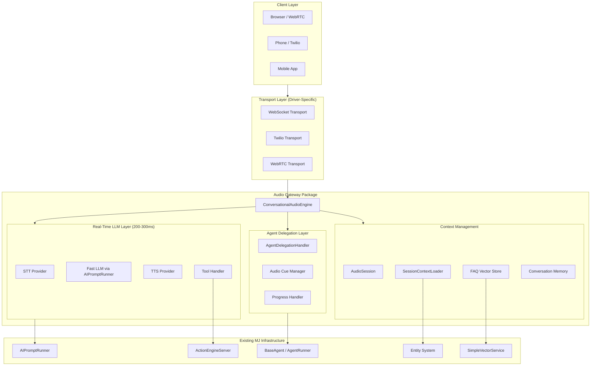
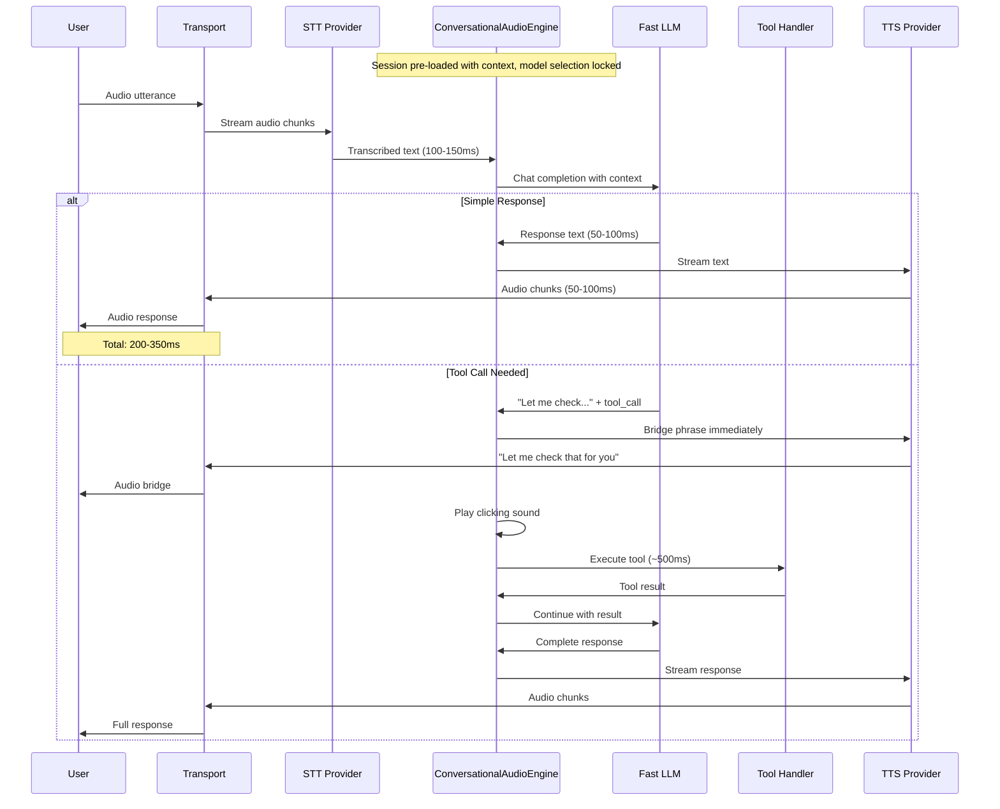
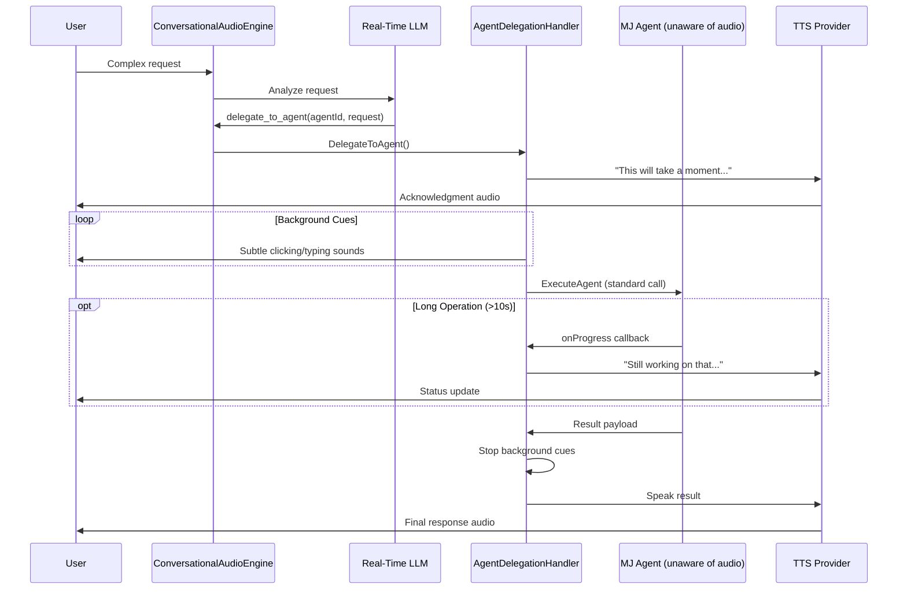
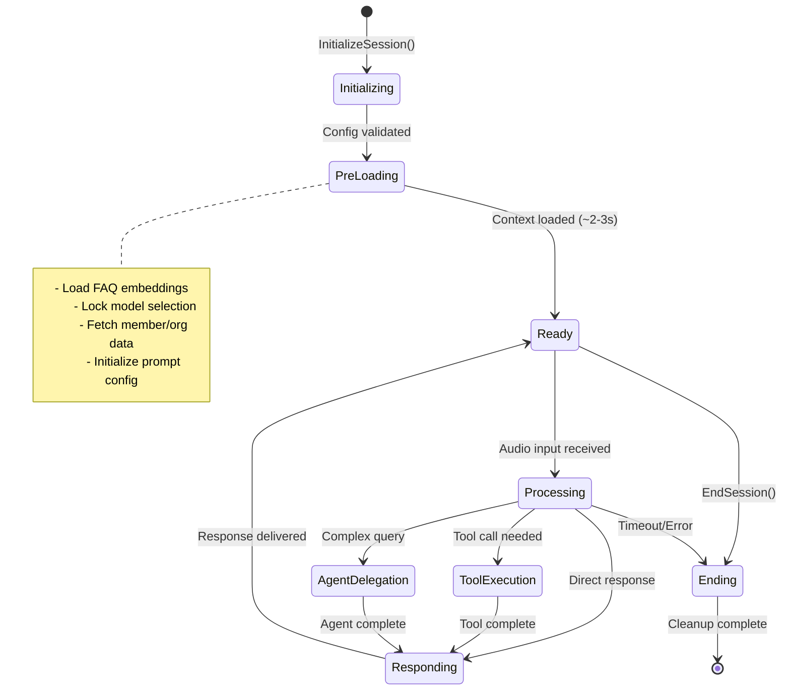
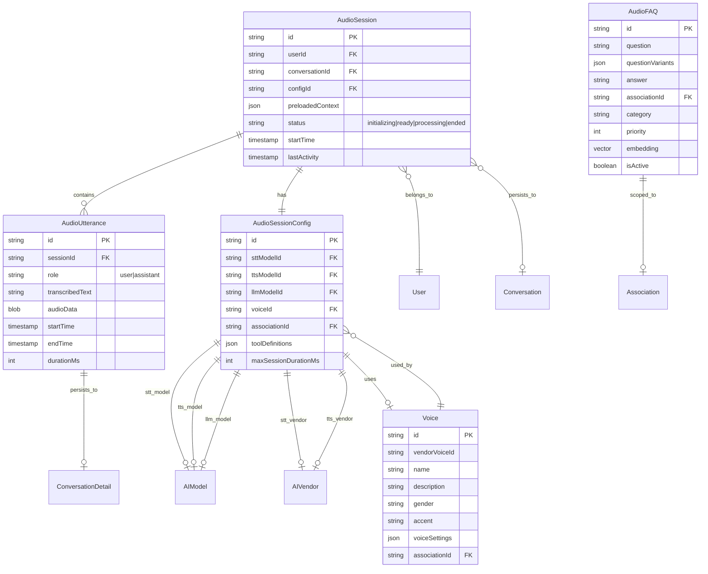
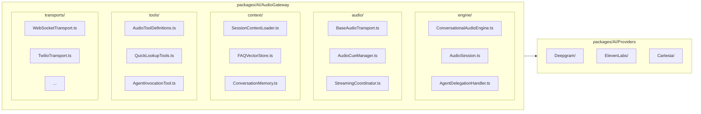
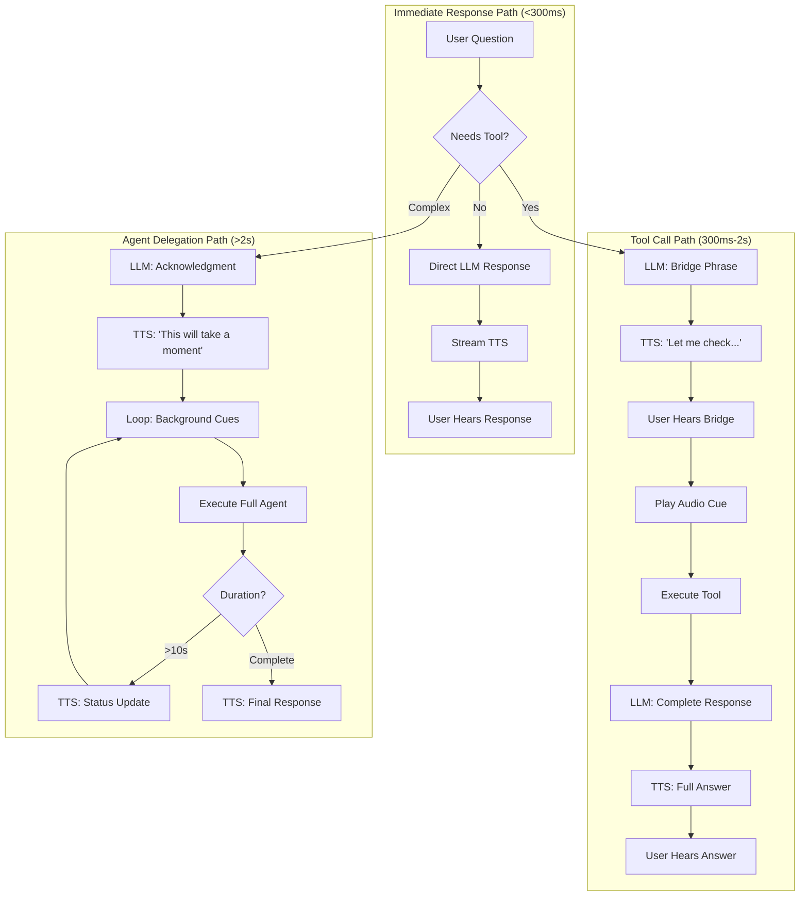
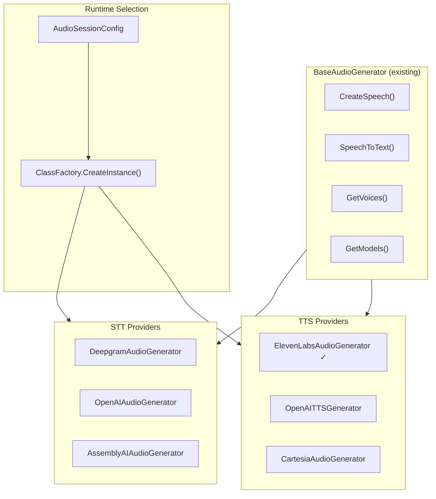

# Audio AI Agents Architecture

## Overview

A two-layer architecture for real-time audio AI interactions in MemberJunction:

1. **Real-Time Conversational Layer** - LLM-backed, optimized for 200-300ms latency
2. **Agent Delegation Layer** - Wraps any existing MJ agent for complex operations

**Key Insight**: Audio is an I/O modality wrapper, not a new agent type. The real-time layer uses the prompt infrastructure directly for speed, while complex queries delegate to standard agents transparently.

---

## System Architecture



---

## Real-Time Conversation Flow



---

## Agent Delegation Flow



---

## Session Lifecycle



---

## Data Model



---

## Package Structure



---

## Latency Budget

```mermaid
gantt
    title Real-Time Response Latency Budget (Target: 300ms)
    dateFormat X
    axisFormat %L ms

    section STT
    Streaming transcription    :stt, 0, 150

    section LLM
    Token generation (streaming) :llm, 100, 200

    section TTS
    First audio chunk          :tts, 150, 250

    section Total
    User perceives response    :done, 200, 300
```



---

## Tool Call Latency Management



---

## Knowledge Access Tiers

```mermaid
flowchart LR
    subgraph Tier1["Tier 1: Instant (Pre-loaded)"]
        FAQ["FAQ Embeddings"]
        Member["Member Profile"]
        Org["Association Info"]
        Common["Common Responses"]
    end

    subgraph Tier2["Tier 2: Quick Tool (~500ms)"]
        DB["Database Lookups"]
        Status["Member Status"]
        Schedule["Event Schedule"]
        Certs["Certifications"]
    end

    subgraph Tier3["Tier 3: Agent Delegation (seconds)"]
        Reports["Reports/Analytics"]
        Workflows["Multi-step Workflows"]
        Actions["Actions with Side Effects"]
        Research["Complex Research"]
    end

    User((User Query)) --> Router{Complexity?}
    Router -->|Simple| Tier1
    Router -->|Lookup| Tier2
    Router -->|Complex| Tier3

    Tier1 -->|Miss| Tier2
    Tier2 -->|Miss| Tier3
```



---

## Provider Integration



---

## Component Interfaces

### ConversationalAudioEngine

```typescript
class ConversationalAudioEngine {
    // Session Lifecycle
    async InitializeSession(config: AudioSessionConfig): Promise<AudioSession>
    async EndSession(sessionId: string): Promise<void>

    // Real-time Processing
    async ProcessUtterance(session: AudioSession, audioInput: AudioInput): Promise<void>

    // Internal
    private async PreloadContext(session: AudioSession): Promise<ConversationContext>
    private async HandleToolCall(session: AudioSession, tool: ToolRequest): Promise<ToolResult>
    private async DelegateToAgent(session: AudioSession, agentId: string, request: string): Promise<void>
}
```

### AudioSession

```typescript
interface AudioSession {
    id: string
    userId: string
    config: AudioSessionConfig
    status: 'initializing' | 'ready' | 'processing' | 'ended'

    // Pre-loaded at session start (immutable during session)
    context: {
        faqVectorStore: SimpleVectorService
        memberInfo: MemberContext
        associationInfo: AssociationContext
        modelSelection: AIModelSelectionInfo
        promptConfig: AIPromptEntityExtended
        toolDefinitions: ToolDefinition[]
    }

    // Mutable conversation state
    conversationHistory: ChatMessage[]

    // Audio state
    audioState: {
        currentUtterance: AudioBuffer | null
        pendingToolCalls: ToolRequest[]
        isProcessing: boolean
        isSpeaking: boolean
    }

    // Metrics
    metrics: {
        startTime: Date
        utteranceCount: number
        toolCallCount: number
        agentDelegationCount: number
        totalAudioDurationMs: number
    }
}
```

### AudioSessionConfig

```typescript
interface AudioSessionConfig {
    // Provider Selection
    sttProvider: string        // 'Deepgram' | 'OpenAI' | 'AssemblyAI'
    ttsProvider: string        // 'ElevenLabs' | 'OpenAI' | 'Cartesia'
    llmModel: string           // Model ID for real-time LLM

    // Voice Configuration
    voiceId: string
    voiceSettings?: VoiceSettings

    // Context Scope
    associationId?: string
    memberId?: string

    // Behavior
    maxSessionDurationMs: number
    idleTimeoutMs: number
    enableAgentDelegation: boolean

    // Audio Cues
    audioCueSet: 'subtle' | 'conversational' | 'none'
}
```

---

## Integration with Existing MJ Components

| Audio Gateway Component | Existing MJ Component | Integration Pattern |
|------------------------|----------------------|---------------------|
| Real-Time LLM | `AIPromptRunner` | Direct usage, pre-selected model |
| Tool Execution | `ActionEngineServer` | Invoke actions as tools |
| Agent Delegation | `AgentRunner` | Standard agent execution |
| FAQ Storage | `SimpleVectorService` | In-memory vector search |
| Conversation Persistence | `Conversation` / `ConversationDetail` | Same entities as text |
| Provider Selection | `AIModel` / `AIVendor` metadata | ClassFactory pattern |
| Context Loading | `RunView` / Entity system | Pre-load at session start |

---

## Implementation Phases

### Phase 1: Foundation
- Create `packages/AI/AudioGateway` package
- Implement `ConversationalAudioEngine` core structure
- Add streaming STT to `BaseAudioGenerator` (Deepgram)
- Basic `AudioSession` with pre-loading

### Phase 2: Real-Time Loop
- `AIPromptRunner` integration for fast LLM
- Tool definitions and execution
- Audio cue system (clicking sounds)
- Streaming TTS coordination

### Phase 3: Agent Delegation
- `AgentDelegationHandler` implementation
- Progress callback → audio feedback
- Fallback options (email/text results)

### Phase 4: Knowledge & Context
- FAQ vector store integration
- Association-scoped context loading
- Memory/learning from conversations

### Phase 5: Production Hardening
- Multiple transport drivers (WebSocket, Twilio)
- Provider failover
- Monitoring and analytics
- Voice persona system

---

## Key Files to Create/Modify

### New Package: `packages/AI/AudioGateway/`

```
packages/AI/AudioGateway/
├── src/
│   ├── index.ts
│   ├── engine/
│   │   ├── ConversationalAudioEngine.ts
│   │   ├── AudioSession.ts
│   │   └── AgentDelegationHandler.ts
│   ├── audio/
│   │   ├── BaseAudioTransport.ts
│   │   ├── AudioCueManager.ts
│   │   └── StreamingCoordinator.ts
│   ├── context/
│   │   ├── SessionContextLoader.ts
│   │   ├── FAQVectorStore.ts
│   │   └── ConversationMemory.ts
│   ├── tools/
│   │   ├── AudioToolDefinitions.ts
│   │   ├── QuickLookupTools.ts
│   │   └── AgentInvocationTool.ts
│   └── transports/
│       ├── WebSocketTransport.ts
│       └── TwilioTransport.ts
├── package.json
├── tsconfig.json
└── README.md
```

### Existing Files to Extend

| File | Changes |
|------|---------|
| `packages/AI/Core/src/generic/baseAudio.ts` | Add streaming STT interface |
| `packages/AI/Providers/Deepgram/` | New package for Deepgram STT |
| `packages/AI/Providers/Cartesia/` | New package for Cartesia TTS |
| Database migrations | Add `AudioFAQ`, `Voice`, `AudioSessionConfig` tables |

---

## Open Design Questions

1. **FAQ Storage**: New `AudioFAQ` entity or extend existing `AIAgentNote`?
2. **Voice Personas**: Per-association, per-agent, or user preference?
3. **Conversation Persistence**: Same `Conversation` entity or separate?
4. **Billing/Metering**: Track audio minutes separately?
5. **Interruption Handling**: Stop immediately, finish sentence, or queue?
