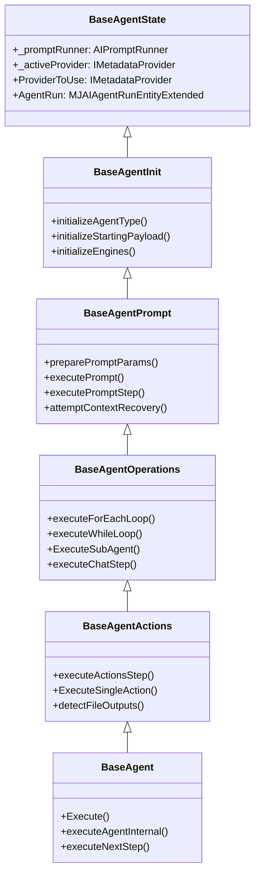

# BaseAgent Granular Refactor Plan

Refactor the monolithic `BaseAgent` class (10,156 lines) in `packages/AI/Agents/src/base-agent.ts` into a clean, modular inheritance hierarchy. This improves code readability, maintainability, and ease of subclass overriding, without introducing breaking changes or altering the public API.

## Proposed Changes

We will split `BaseAgent` into multiple files inside a new subdirectory `packages/AI/Agents/src/base-agent/` and have `packages/AI/Agents/src/base-agent.ts` extend the final layer.



### [packages/AI/Agents]

Split `BaseAgent` into logical, single-responsibility layers:

#### [NEW] [baseAgentState.ts](file:///Users/amith/Dropbox/develop/M5/MJ/packages/AI/Agents/src/base-agent/baseAgentState.ts)
- Defines the `BaseAgentState` class.
- Holds all instance variables: `_promptRunner`, `_activeProvider`, `_agentTypeState`, `_agentTypeInstance`, `_executionCounts`, `_messageLifecycleCallback`, `_generalValidationRetryCount`, `_agentRun`, `_feedbackRequestId`, `_resolvedStorageAccountId`, `_mediaOutputs`, `_fileOutputs`, `_payloadManager`, `_scratchpadManager`, `_artifactToolManager`, `_effectiveActions`, `_promptTurnCount`, `_dynamicActionLimits`, `_validationRetryCount`, `_contextRecoveryAttempts`.
- Exposes accessors/getters: `ProviderToUse`, `AgentTypeState`, `AgentTypeInstance`, `AgentRun`, `ResolvedStorageAccountId`, `MediaOutputs`.

#### [NEW] [baseAgentInit.ts](file:///Users/amith/Dropbox/develop/M5/MJ/packages/AI/Agents/src/base-agent/baseAgentInit.ts)
- Defines `BaseAgentInit` extending `BaseAgentState`.
- Implements initialization routines: `initializeAgentType`, `initializeStartingPayload`, `initializeEngines`, `loadAgentConfiguration`, `validateAgent`, `handleStartingPayloadValidation`, `checkMinimumExecutionRequirements`, `getStorageAccountID`.

#### [NEW] [baseAgentPrompt.ts](file:///Users/amith/Dropbox/develop/M5/MJ/packages/AI/Agents/src/base-agent/baseAgentPrompt.ts)
- Defines `BaseAgentPrompt` extending `BaseAgentInit`.
- Handles prompt execution, context recovery, and message compaction: `preparePromptParams`, `executePrompt`, `executePromptStep`, `attemptContextRecovery`, `pruneAndCompactExpiredMessages`, `compactMessage`, `createCompactionStep`, `updateCompactionStep`, `recoveryStrategy_CompactOldToolResults`, `recoveryStrategy_CompactAllToolResults`, `processMessageMediaPlaceholders`.

#### [NEW] [baseAgentOperations.ts](file:///Users/amith/Dropbox/develop/M5/MJ/packages/AI/Agents/src/base-agent/baseAgentOperations.ts)
- Defines `BaseAgentOperations` extending `BaseAgentPrompt`.
- Handles loops, sub-agents, client tools, and chat execution: `executeForEachLoop`, `executeWhileLoop`, `ExecuteSubAgent`, `processSubAgentStep`, `executeClientToolsStep`, `executeChatStep`, `executeArtifactToolCallsAsSteps`.

#### [NEW] [baseAgentActions.ts](file:///Users/amith/Dropbox/develop/M5/MJ/packages/AI/Agents/src/base-agent/baseAgentActions.ts)
- Defines `BaseAgentActions` extending `BaseAgentOperations`.
- Handles action executions, parameter schemas, and media/file outputs: `executeActionsStep`, `ExecuteSingleAction`, `detectFileOutputs`, `interceptLargeBinaryContent`, `resolveMediaPlaceholdersInPayload`, `resolveMediaPlaceholdersRecursive`, `resolveMediaPlaceholdersInString`.

#### [MODIFY] [base-agent.ts](file:///Users/amith/Dropbox/develop/M5/MJ/packages/AI/Agents/src/base-agent.ts)
- Refactors `BaseAgent` class to extend `BaseAgentActions`.
- Implements high-level run orchestration: `Execute()`, `executeAgentInternal`, `executeNextStep`, `checkExecutionGuardrails`, `hasExceededAgentRunGuardrails`, `createStepEntity`, `finalizeStepEntity`.
- Keeps all public class imports and types intact for backwards compatibility.

---

## Verification Plan

### Automated Tests
1. **Compilation**: Run build in `packages/AI/Agents` to verify there are no TypeScript compile errors:
   ```bash
   npm run build
   ```
2. **Unit Tests**: Run vitest in `packages/AI/Agents` to ensure all existing agent and execution tests pass:
   ```bash
   npm run test
   ```
