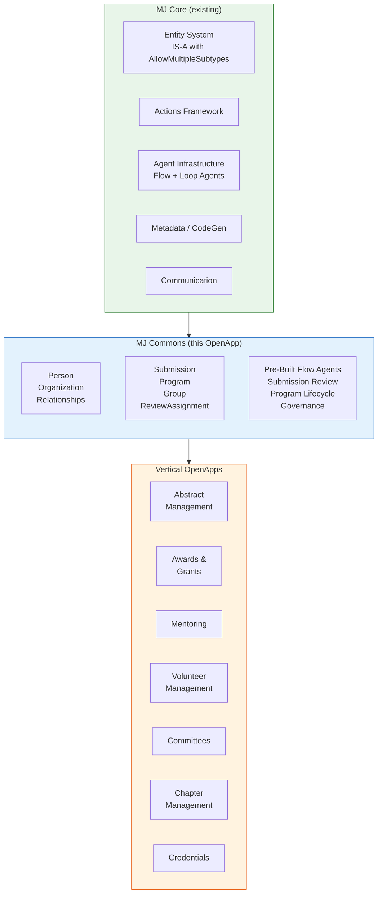
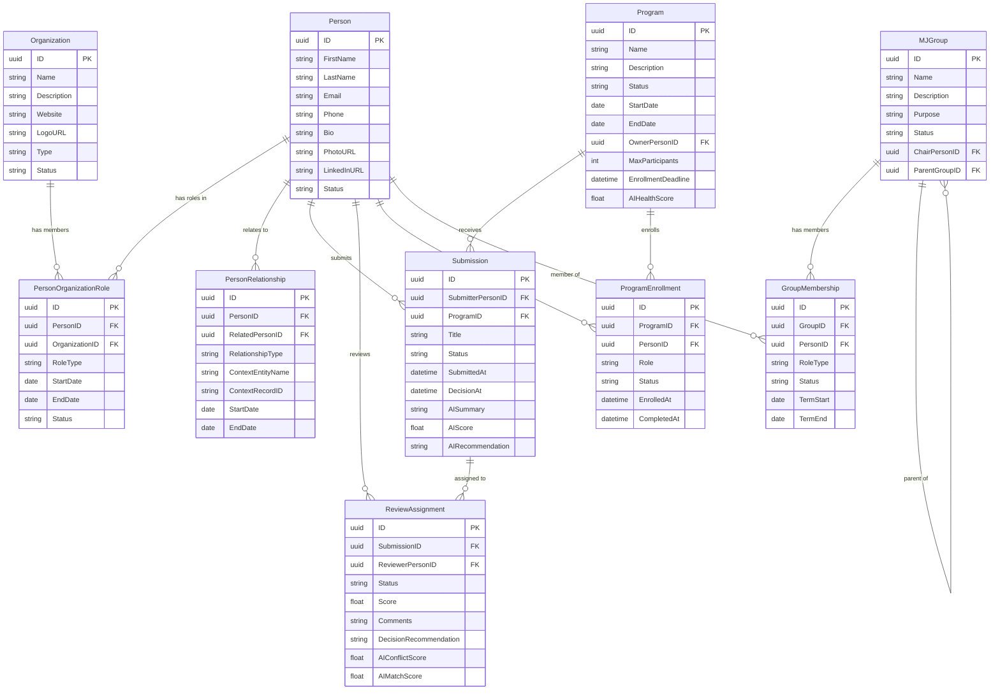
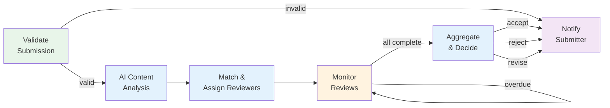
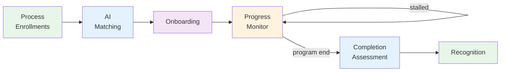
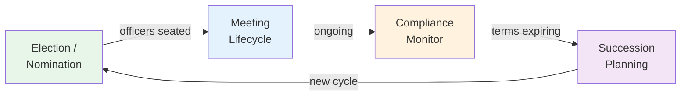

# BizApps Common OpenApp — Design Proposal

## Table of Contents
1. [Overview](#overview)
2. [Naming Options](#naming-options)
3. [Architecture: Where This Sits](#architecture-where-this-sits)
4. [Entity Model](#entity-model)
5. [Pre-Built Flow Agents](#pre-built-flow-agents)
6. [How Vertical Apps Build On This](#how-vertical-apps-build-on-this)
7. [OpenApp Packaging](#openapp-packaging)
8. [Relationship to Existing MJ Entities](#relationship-to-existing-mj-entities)
9. [Open Questions](#open-questions)
10. [Implementation Roadmap](#implementation-roadmap)

---

## Overview

This document proposes the design of a **foundational OpenApp** that provides shared entities, relationships, and pre-built AI workflow agents for the MJ BizApps ecosystem. Multiple vertical OpenApps — Committees, Abstract Management, Mentoring, Awards, Volunteer Management, Chapter Management, Credentials — all depend on this shared layer instead of each reinventing People, Organizations, Submissions, Programs, and Groups.

### Why a Shared Foundation?

Without it, each vertical app creates its own Person/Contact table, its own Organization table, its own review workflow. The same real-world person ends up in five different tables with five different IDs. Cross-app analytics become impossible. AI matching can't see a person's full engagement picture.

With it:
- **One Person, many roles** — via IS-A overlapping subtypes (`AllowMultipleSubtypes = true`)
- **One set of workflow engines** — pre-built Flow Agents that vertical apps configure, not rebuild
- **Cross-app intelligence** — AI can see someone's full engagement (committees + volunteering + mentoring) through a single Person record
- **Faster vertical app development** — each new app is thin (IsA subtypes + agent config + UI)

### Dependencies

This OpenApp depends on:
- MJ Core (entity system, metadata, IS-A support including `AllowMultipleSubtypes`)
- MJ AI infrastructure (agents, actions, prompts)
- The OpenApp runtime (once implemented)

---

## Naming Options

The placeholder "BizApps Common" needs a real name. This name appears in the `mj-app.json` manifest, the SQL schema, npm package names, and marketing.

### Candidates

| Name | SQL Schema | Package Prefix | Pros | Cons |
|---|---|---|---|---|
| **MJ Commons** | `mj_commons` | `@mj/commons-*` | "Commons" implies shared public resources (Creative Commons, Apache Commons). Short, memorable, conveys community ownership. | Could sound like a utility library rather than a business layer |
| **MJ Nexus** | `mj_nexus` | `@mj/nexus-*` | "Nexus" = connection point. Captures the linking of people, orgs, and workflows. | Abstract; doesn't immediately convey what it does |
| **MJ Keystone** | `mj_keystone` | `@mj/keystone-*` | A keystone is the central piece that holds the arch together. Exactly what this layer does. | Might sound too grand. KeystoneJS exists (different domain). |
| **MJ Foundation** | `mj_foundation` | `@mj/foundation-*` | Clear "base layer" semantics. Everyone understands "foundation." | Overloaded term (software foundations, Apple Foundation framework). |
| **MJ Fabric** | `mj_fabric` | `@mj/fabric-*` | Connective tissue metaphor. | Microsoft Fabric is a competing product name. |
| **MJ Engage** | `mj_engage` | `@mj/engage-*` | Implies engagement, participation, connection. | Sounds like marketing automation software. |
| **MJ Civic** | `mj_civic` | `@mj/civic-*` | Implies civic/community participation. Fits the association world well. | Too narrow — excludes non-civic use cases. |
| **MJ Connect** | `mj_connect` | `@mj/connect-*` | Implies connections between people, orgs, workflows. | Generic; many products use "Connect." |

### Recommendation

**MJ Commons** is the strongest candidate. It communicates:
- Shared infrastructure (the "commons" that all apps share)
- Community ownership (open source, free)
- Not trying to be the whole product (it's the commons, not the city)

The SQL schema `mj_commons` is clean. The package names (`@mj/commons-entities`, `@mj/commons-server`, `@mj/commons-ng`) read naturally.

> **Decision needed**: Final name selection before implementation begins.

---

## Architecture: Where This Sits



**Dependency chain**: `MJ Core → MJ Commons → Vertical App`

Each vertical app's `mj-app.json` declares a dependency on MJ Commons. When a user installs "MJ Abstract Management," the OpenApp installer auto-resolves and installs MJ Commons first (if not already present).

---

## Entity Model

### Design Principles

1. **IS-A overlapping subtypes** for Person and Organization — a person wears many hats
2. **IS-A disjoint subtypes** for Submission, Program, and Group — these ARE one thing at a time
3. **Junction entities** for many-to-many relationships (PersonOrganizationRole, GroupMembership, ProgramEnrollment)
4. **AI fields on base entities** — AISummary, AIScore, AIRecommendation baked into the workflow entities
5. **Polymorphic context linking** — PersonRole uses EntityName + RecordID to link to any context (committee, program, conference)

### Entity Relationship Diagram



> **Note**: `MJGroup` is used as the table name to avoid conflicts with the SQL reserved word `Group`. The entity name in MJ would be "Groups" (with the `mj_commons` schema prefix handling disambiguation).

### Entity Details

#### Person (AllowMultipleSubtypes = TRUE)

The universal identity for anyone who interacts with the system. Vertical apps create IS-A subtypes.

| Field | Type | Description |
|---|---|---|
| ID | uniqueidentifier PK | Shared across all subtypes via IS-A |
| FirstName | nvarchar(100) NOT NULL | |
| LastName | nvarchar(100) NOT NULL | |
| Email | nvarchar(255) | Primary email |
| Phone | nvarchar(50) | |
| Bio | nvarchar(MAX) | Biographical text |
| PhotoURL | nvarchar(500) | Profile photo |
| LinkedInURL | nvarchar(500) | Professional profile |
| Website | nvarchar(500) | Personal website |
| Title | nvarchar(255) | Professional title |
| Status | 'Active' \| 'Inactive' \| 'Pending' | |

**IS-A subtypes created by vertical apps:**
- Member IsA Person (MembershipLevel, JoinDate, RenewalDate, MemberNumber)
- Speaker IsA Person (SpeakerBio, Headshot, TravelPreferences, AVRequirements, SpeakerFee)
- Reviewer IsA Person (ExpertiseAreas, ReviewCapacity, AvgTurnaroundDays, ConflictDeclarations)
- Volunteer IsA Person (Availability, BackgroundCheckStatus, EmergencyContact)
- Mentor IsA Person (MentoringAreas, MaxMentees, MentoringStyle)
- Instructor IsA Person (Credentials, TeachingAreas, CertificationLevel)

#### Organization (AllowMultipleSubtypes = TRUE)

Base entity for all organizational entities. Overlapping because an org can simultaneously be a member organization AND a sponsor, for example.

| Field | Type | Description |
|---|---|---|
| ID | uniqueidentifier PK | |
| Name | nvarchar(255) NOT NULL | |
| Description | nvarchar(MAX) | |
| Website | nvarchar(500) | |
| LogoURL | nvarchar(500) | |
| Type | nvarchar(100) | Freeform type label |
| Industry | nvarchar(255) | |
| Size | nvarchar(50) | Employee count range |
| Status | 'Active' \| 'Inactive' \| 'Pending' | |

**IS-A subtypes created by vertical apps:**
- Chapter IsA Organization (Region, ChapterCode, CharterDate, ComplianceStatus, NationalOrgID)
- MemberOrganization IsA Organization (MembershipTier, JoinDate, PrimaryContactPersonID)
- SponsorOrganization IsA Organization (SponsorshipLevel, ContractStart, ContractEnd)

#### PersonOrganizationRole

Links people to organizations with typed roles. Handles the "many hats within an org" pattern.

| Field | Type | Description |
|---|---|---|
| ID | uniqueidentifier PK | |
| PersonID | FK → Person | |
| OrganizationID | FK → Organization | |
| RoleType | nvarchar(100) NOT NULL | 'Employee' \| 'Board Member' \| 'Officer' \| 'Contact' \| 'Delegate' \| custom |
| Title | nvarchar(255) | Role-specific title |
| IsPrimary | bit DEFAULT 0 | Primary contact for this org? |
| StartDate | date | |
| EndDate | date | Null = ongoing |
| Status | 'Active' \| 'Inactive' \| 'Pending' | |

#### PersonRelationship

Person-to-person relationships with optional context (e.g., "mentor-mentee within Program X").

| Field | Type | Description |
|---|---|---|
| ID | uniqueidentifier PK | |
| PersonID | FK → Person | |
| RelatedPersonID | FK → Person | |
| RelationshipType | nvarchar(100) NOT NULL | 'Mentor-Mentee' \| 'Supervisor' \| 'Colleague' \| 'Sponsor' \| custom |
| ContextEntityName | nvarchar(255) | Optional: which entity provides context |
| ContextRecordID | nvarchar(255) | Optional: which record provides context |
| StartDate | date | |
| EndDate | date | |
| Status | 'Active' \| 'Inactive' \| 'Completed' | |

#### Submission (AllowMultipleSubtypes = FALSE — disjoint)

Base entity for all submission-and-review workflows. A submission IS one thing.

| Field | Type | Description |
|---|---|---|
| ID | uniqueidentifier PK | |
| SubmitterPersonID | FK → Person | Who submitted |
| ProgramID | FK → Program | Which program this belongs to (optional) |
| Title | nvarchar(500) NOT NULL | Submission title |
| Description | nvarchar(MAX) | Summary/abstract |
| Status | (see below) | Workflow state |
| SubmittedAt | datetimeoffset | |
| DecisionAt | datetimeoffset | |
| DecisionByPersonID | FK → Person | Who made final decision |
| AISummary | nvarchar(MAX) | AI-generated summary |
| AIScore | decimal(5,2) | AI quality/relevance score |
| AIRecommendation | nvarchar(MAX) | AI decision recommendation |
| ReviewRoundNumber | int DEFAULT 1 | Current review round |
| AgentRunID | FK → AI Agent Runs | Link to the agent run processing this |

**Status values**: `'Draft' | 'Submitted' | 'Under Review' | 'Revision Requested' | 'Revised' | 'Accepted' | 'Rejected' | 'Withdrawn'`

**IS-A subtypes created by vertical apps:**
- AbstractSubmission IsA Submission (Track, Keywords, CoAuthors, PresentationType, SessionPreference)
- AwardNomination IsA Submission (NomineePersonID, AwardCategory, SupportingStatement, EndorsementCount)
- GrantApplication IsA Submission (RequestedAmount, Budget, Timeline, PrincipalInvestigatorPersonID)
- CertificationApplication IsA Submission (ExperienceLog, CredentialDocuments, References)
- SpeakerProposal IsA Submission (ProposedTitle, SessionFormat, TargetAudience, LearningObjectives)

#### ReviewAssignment

Links submissions to reviewers. Created by the Submission Review Agent.

| Field | Type | Description |
|---|---|---|
| ID | uniqueidentifier PK | |
| SubmissionID | FK → Submission | |
| ReviewerPersonID | FK → Person | |
| AssignedAt | datetimeoffset | |
| DueDate | datetimeoffset | |
| CompletedAt | datetimeoffset | |
| Status | 'Assigned' \| 'In Progress' \| 'Complete' \| 'Declined' \| 'Overdue' | |
| Score | decimal(5,2) | Reviewer's score |
| Comments | nvarchar(MAX) | Reviewer's written feedback |
| DecisionRecommendation | 'Accept' \| 'Reject' \| 'Revise' \| 'Abstain' | |
| AIConflictScore | decimal(5,2) | AI conflict-of-interest assessment |
| AIMatchScore | decimal(5,2) | AI reviewer-to-topic match quality |
| IsBlind | bit DEFAULT 1 | Whether reviewer identity is hidden from submitter |
| ReviewRoundNumber | int DEFAULT 1 | Which round this review belongs to |

#### Program (AllowMultipleSubtypes = FALSE — disjoint)

Base entity for all time-bounded programs with enrollment and milestones.

| Field | Type | Description |
|---|---|---|
| ID | uniqueidentifier PK | |
| Name | nvarchar(255) NOT NULL | |
| Description | nvarchar(MAX) | |
| Status | 'Draft' \| 'Open' \| 'In Progress' \| 'Completed' \| 'Cancelled' | |
| StartDate | date | |
| EndDate | date | |
| EnrollmentDeadline | datetimeoffset | |
| MaxParticipants | int | Null = unlimited |
| OwnerPersonID | FK → Person | Program manager/owner |
| AIHealthScore | decimal(5,2) | AI-assessed program health |
| AIRecommendations | nvarchar(MAX) | AI suggestions for improvement |
| AgentRunID | FK → AI Agent Runs | Link to lifecycle agent run |

**IS-A subtypes created by vertical apps:**
- MentoringProgram IsA Program (MatchingCriteria, CheckInFrequency, Duration, MentoringFormat)
- VolunteerProgram IsA Program (SkillsNeeded, Location, ShiftStructure)
- CertificationProgram IsA Program (RequiredCECredits, ExamInfo, RecertificationPeriod)
- FellowshipProgram IsA Program (StipendInfo, ResearchArea, CohortSize)
- CallForPapers IsA Program (Tracks, SubmissionGuidelines, ReviewCriteria, ConferenceDate)

#### ProgramEnrollment

Links people to programs with role and progress tracking.

| Field | Type | Description |
|---|---|---|
| ID | uniqueidentifier PK | |
| ProgramID | FK → Program | |
| PersonID | FK → Person | |
| Role | nvarchar(100) | 'Participant' \| 'Mentor' \| 'Mentee' \| 'Volunteer' \| 'Applicant' \| custom |
| Status | 'Applied' \| 'Enrolled' \| 'Active' \| 'Completed' \| 'Withdrawn' \| 'Removed' | |
| EnrolledAt | datetimeoffset | |
| CompletedAt | datetimeoffset | |
| ProgressPercent | decimal(5,2) | 0-100 |
| AIEngagementScore | decimal(5,2) | AI-assessed engagement level |

#### Group (AllowMultipleSubtypes = FALSE — disjoint)

Base entity for governed groups of people. Self-referential for group hierarchies.

| Field | Type | Description |
|---|---|---|
| ID | uniqueidentifier PK | |
| Name | nvarchar(255) NOT NULL | |
| Description | nvarchar(MAX) | |
| Purpose | nvarchar(MAX) | Mission/charter statement |
| Status | 'Active' \| 'Inactive' \| 'Forming' \| 'Dissolved' | |
| ChairPersonID | FK → Person | Current chair/leader |
| ParentGroupID | FK → Group | Parent in hierarchy (null = top-level) |
| MaxMembers | int | Null = unlimited |
| TermLengthMonths | int | Default term length for members |

**IS-A subtypes created by vertical apps:**
- Committee IsA Group (CommitteeType, BoardLiaison, MeetingFrequency, CharterDocumentURL)
- TaskForce IsA Group (Mandate, Deliverable, Deadline, DisbandAfterDelivery)
- AdvisoryCouncil IsA Group (AdvisoryScope, BoardLinkage, RecommendationAuthority)
- WorkingGroup IsA Group (ProjectScope, OutputType, CollaborationPlatform)

#### GroupMembership

Links people to groups with roles and terms.

| Field | Type | Description |
|---|---|---|
| ID | uniqueidentifier PK | |
| GroupID | FK → Group | |
| PersonID | FK → Person | |
| RoleType | nvarchar(100) NOT NULL | 'Chair' \| 'Vice Chair' \| 'Secretary' \| 'Member' \| 'Liaison' \| custom |
| Status | 'Active' \| 'Nominated' \| 'Elected' \| 'Expired' \| 'Removed' \| 'Emeritus' | |
| TermStart | date | |
| TermEnd | date | |
| TermNumber | int | Which term (for re-appointments) |
| AppointedByPersonID | FK → Person | Who appointed this member |
| VotingMember | bit DEFAULT 1 | Has voting rights? |

---

## Pre-Built Flow Agents

These ship as metadata JSON in the OpenApp's `metadata/agents/` directory. Each is a configurable Flow Agent template that vertical apps customize via agent configuration and step parameter overrides.

### Agent 1: Submission Review Agent

The workhorse for all submission-based workflows (abstracts, awards, grants, certifications, speaker proposals).



| Step | Type | Description |
|---|---|---|
| Validate Submission | Action | Check required fields, eligibility rules, duplicate detection |
| AI Content Analysis | Prompt (Loop Agent sub-agent) | Summarize submission, extract keywords, score quality, flag potential issues |
| Match & Assign Reviewers | Action + Prompt | AI matches reviewers to submission based on expertise, availability, conflict-of-interest. Creates ReviewAssignment records |
| Monitor Reviews | While loop | Periodically check review status. Send reminders for overdue reviews. Re-assign if reviewer declines. |
| Aggregate & Decide | Prompt | AI synthesizes all reviewer scores and comments, detects scoring outliers, generates recommendation. Can auto-decide or flag for human review based on confidence threshold. |
| Notify Submitter | Action | Send accept/reject/revise notification via MJ Communication infrastructure |

**Configurable per vertical app:**
- Validation rules (which fields required, eligibility criteria)
- Reviewer matching criteria (expertise tags, conflict rules, min/max reviewers)
- Blind review mode (single-blind, double-blind, open)
- Auto-decision threshold (confidence level above which AI decision is final)
- Notification templates
- Number of review rounds allowed

### Agent 2: Program Lifecycle Agent

Manages the full lifecycle of enrollment-based programs (mentoring, volunteering, certification, fellowships).



| Step | Type | Description |
|---|---|---|
| Process Enrollments | ForEach | Iterate over applications. Validate eligibility, create ProgramEnrollment records |
| AI Matching | Prompt (Loop Agent sub-agent) | For programs requiring pairing (mentoring, buddy systems): optimize matches based on skills, goals, personality, availability |
| Onboarding | Action | Send welcome materials, create PersonRelationship records for matched pairs, assign initial milestones |
| Progress Monitor | While loop | Periodic check-ins. AI analyzes engagement signals (login frequency, message activity, milestone completion). Detects stalled relationships, sends nudges, offers re-matching |
| Completion Assessment | Prompt | AI evaluates program outcomes. Generates summary report. Scores participant engagement |
| Recognition | Action | Issue badges/certificates, update PersonRole, send completion notification |

**Configurable per vertical app:**
- Matching algorithm (weighted criteria, hard constraints, optimization objective)
- Check-in frequency and escalation rules
- Milestone definitions
- Engagement scoring formula
- Recognition actions (badges, certificates, CE credits)

### Agent 3: Governance Agent

Manages governed groups — elections, meetings, compliance, succession.



| Step | Type | Description |
|---|---|---|
| Election / Nomination | Sub-Agent (Flow) | Manage nomination intake, eligibility checking against bylaws, voting (if applicable), result tabulation. Creates/updates GroupMembership records |
| Meeting Lifecycle | Sub-Agent (Loop) | AI-assisted agenda generation from action items and pending decisions. Post-meeting: minutes summarization, action item extraction, task assignment |
| Compliance Monitor | While loop | Periodic health checks: membership minimums, required diversity, meeting frequency requirements, reporting deadlines. Generates health scores and alerts |
| Succession Planning | Prompt | As terms approach expiration, AI analyzes group composition gaps, recommends candidates from broader membership, generates succession reports |

**Configurable per vertical app:**
- Election rules (simple majority, ranked choice, appointment)
- Term limits and rotation rules
- Compliance criteria (minimum members, diversity requirements, meeting frequency)
- Health scoring weights

---

## How Vertical Apps Build On This

Each vertical app is a thin layer: IS-A subtypes + agent configuration + custom UI.

### Example: "MJ Abstract Management" OpenApp

**1. IS-A Subtypes (migration):**
```sql
-- AbstractSubmission extends Submission
CREATE TABLE [mj_abstracts].[AbstractSubmission] (
    ID UNIQUEIDENTIFIER NOT NULL,
    Track NVARCHAR(255),
    Keywords NVARCHAR(MAX),
    CoAuthors NVARCHAR(MAX),
    PresentationType NVARCHAR(50),  -- 'Oral' | 'Poster' | 'Workshop'
    SessionPreference NVARCHAR(255),
    FullPaperURL NVARCHAR(500),
    CONSTRAINT PK_AbstractSubmission PRIMARY KEY (ID),
    CONSTRAINT FK_AbstractSubmission_Submission
        FOREIGN KEY (ID) REFERENCES [mj_commons].[Submission](ID)
);

-- CallForPapers extends Program
CREATE TABLE [mj_abstracts].[CallForPapers] (
    ID UNIQUEIDENTIFIER NOT NULL,
    Tracks NVARCHAR(MAX),           -- JSON array of available tracks
    SubmissionGuidelines NVARCHAR(MAX),
    ReviewCriteria NVARCHAR(MAX),   -- JSON scoring rubric
    ConferenceDate DATE,
    ConferenceName NVARCHAR(255),
    CONSTRAINT PK_CallForPapers PRIMARY KEY (ID),
    CONSTRAINT FK_CallForPapers_Program
        FOREIGN KEY (ID) REFERENCES [mj_commons].[Program](ID)
);
```

**2. Agent Configuration (metadata):**
- Instantiate the Submission Review Agent with abstract-specific config:
  - Validation rules: require Track, Keywords, at least 100-word Description
  - Reviewer matching: match on Track + Keywords expertise
  - Blind review: double-blind (reviewer and submitter identities hidden)
  - Auto-decision: accept if AI confidence > 0.9 and all reviewers agree
  - 2 review rounds allowed

**3. Custom UI (Angular components):**
- Author submission portal (public-facing form)
- Reviewer dashboard (assigned abstracts, scoring interface)
- Program chair dashboard (overview, manual overrides, session scheduling)
- Conference program builder (accepted abstracts → session slots)

**4. Custom Actions:**
- "Schedule Session" — assigns accepted abstracts to time slots with constraint satisfaction
- "Generate Conference Program" — produces printable/digital program from accepted sessions

### What Each Vertical App Adds

| Vertical App | IsA Subtypes | Agent Config | Custom UI | Custom Actions |
|---|---|---|---|---|
| **Abstract Management** | AbstractSubmission, CallForPapers | Submission Review Agent | Author portal, reviewer dashboard, session scheduler | Schedule Session, Generate Program |
| **Awards & Grants** | AwardNomination, GrantApplication, AwardProgram | Submission Review Agent | Nomination form, judge portal, winner gallery | Tabulate Scores, Announce Winners |
| **Mentoring** | Mentor (Person), Mentee (Person), MentoringProgram | Program Lifecycle Agent | Match dashboard, check-in tracker, pair health | Generate Match Report, Re-Match |
| **Volunteer Management** | Volunteer (Person), VolunteerProgram | Program Lifecycle Agent | Opportunity browser, shift calendar, hours log | Log Hours, Generate Impact Report |
| **Committees** | Committee (Group) | Governance Agent | Committee dashboard, nomination form, meeting tools | Record Vote, Generate Minutes |
| **Chapter Management** | Chapter (Organization) | Governance Agent | Chapter health dashboard, officer tracker, compliance | Generate Health Report, Chapter Benchmark |
| **Credentials** | CertificationApplication (Submission), CertificationProgram, Instructor (Person) | Both agents | Applicant tracker, CE log, public verification | Verify Credential, Issue Certificate |

---

## OpenApp Packaging

### mj-app.json Manifest (MJ Commons)

```json
{
  "name": "mj-commons",
  "displayName": "MJ Commons",
  "description": "Shared foundation for MJ business applications. Provides People, Organizations, Submissions, Programs, Groups, and pre-built AI workflow agents.",
  "version": "1.0.0",
  "publisher": {
    "name": "MemberJunction",
    "email": "info@memberjunction.org",
    "url": "https://memberjunction.org"
  },
  "compatibility": {
    "mjVersionRange": ">=2.x"
  },
  "schema": {
    "name": "mj_commons",
    "createIfNotExists": true
  },
  "packages": {
    "server": [
      { "name": "@mj/commons-server-bootstrap", "role": "bootstrap" },
      { "name": "@mj/commons-actions", "role": "actions" }
    ],
    "client": [
      { "name": "@mj/commons-ng-bootstrap", "role": "bootstrap" },
      { "name": "@mj/commons-ng-components", "role": "components" }
    ],
    "shared": [
      { "name": "@mj/commons-types", "role": "library" }
    ]
  },
  "dependencies": {}
}
```

### Metadata Distribution

```
metadata/
  agents/
    .submission-review-agent.json       # Submission Review Flow Agent + steps + paths
    .program-lifecycle-agent.json       # Program Lifecycle Flow Agent
    .governance-agent.json              # Governance Flow Agent
  prompts/
    templates/
      submission-review/
        content-analysis.template.md    # AI content analysis prompt
        reviewer-matching.template.md   # AI reviewer matching prompt
        decision-synthesis.template.md  # AI decision synthesis prompt
      program-lifecycle/
        matching.template.md            # AI participant matching prompt
        health-check.template.md        # AI engagement health check prompt
      governance/
        agenda-generation.template.md   # AI meeting agenda prompt
        minutes-summary.template.md     # AI minutes summarization prompt
        succession.template.md          # AI succession planning prompt
  actions/
    .commons-actions.json               # Shared actions (Validate Submission, Assign Reviewers, etc.)
  applications/
    .mj-commons-application.json        # Base application shell (optional)
```

---

## Relationship to Existing MJ Entities

### Person vs Employee

MJ's existing `Employee` entity is designed for internal organizational structure — the people who work at the organization running MJ. `Person` in MJ Commons represents anyone who interacts with the system externally: members, volunteers, speakers, reviewers, etc.

**Recommended approach**: Keep them separate initially. A future enhancement could make Employee IsA Person (since an employee IS a person), but that's a significant change to existing MJ core and should be a separate initiative.

**Bridging**: PersonOrganizationRole with RoleType='Employee' can link a Person to an Organization for external org charts, while MJ's Employee handles internal staff. Users who are both staff and members would have both an Employee record (internal) and a Person record (external), linked via their shared User record.

### Organization vs Company

Same pattern. MJ's `Company` represents the organization running MJ. MJ Commons' `Organization` represents external organizations (member orgs, chapters, sponsors). Keep separate, bridge via relationships.

### Skills

MJ already has a hierarchical `Skill` entity with `EmployeeSkill` junction. MJ Commons should add a `PersonSkill` junction entity to connect Person records to the existing Skill taxonomy. This enables the AI matching engines to use skills for reviewer-topic matching, mentor-mentee matching, and volunteer-opportunity matching.

| Field | Type | Description |
|---|---|---|
| ID | uniqueidentifier PK | |
| PersonID | FK → Person | |
| SkillID | FK → Skill (existing MJ entity) | |
| ProficiencyLevel | 'Beginner' \| 'Intermediate' \| 'Advanced' \| 'Expert' | |
| YearsExperience | int | |
| Verified | bit DEFAULT 0 | Has this been verified (by credential, endorsement, etc.)? |

### Lists

MJ's existing `List` entity (polymorphic grouping) remains useful for ad-hoc collections. MJ Commons' `Group` entity handles governed groups with formal roles, terms, and governance. They serve different purposes and coexist naturally.

---

## Open Questions

1. **Name**: Final selection between MJ Commons, MJ Nexus, MJ Keystone, MJ Foundation, or other. Recommendation: MJ Commons.

2. **Person ↔ User linking**: Should Person have a `UserID` FK to the MJ User table? Or should User have a `PersonID` FK to Person? Or a separate junction? The User is the auth identity; the Person is the business identity. They're 1:1 when both exist, but not every Person has a User (external reviewers who log in vs. people who are just in the database as contacts).

3. **Organization overlapping subtypes**: Should Organization use `AllowMultipleSubtypes = true`? An org CAN be both a member org and a sponsor simultaneously. But is that common enough to warrant the complexity? Recommend: yes, default to overlapping — it's more flexible and the cost is minimal.

4. **"Group" naming**: SQL Server reserves `GROUP` as a keyword. Options: `MJGroup`, `PersonGroup`, `GovernedGroup`, or rely on the schema prefix (`[mj_commons].[Group]`). With schema prefixing, `Group` works fine in practice.

5. **AI field granularity**: Should AI-generated fields (AISummary, AIScore, AIRecommendation) live directly on the base entities, or in a separate AI assessment entity? Direct is simpler; separate allows multiple AI assessments per record (e.g., re-analysis after revision). Recommend: direct for v1, separate entity in v2 if needed.

6. **Address / Location data**: Should Person and Organization have address fields directly, or should there be a separate Address entity supporting multiple addresses per record? Recommend: separate Address entity (people and orgs commonly have multiple addresses).

7. **Skill taxonomy seeding**: Should MJ Commons ship with a pre-seeded skill taxonomy (e.g., based on O\*NET, ESCO, or industry-specific taxonomies)? Or leave the Skill table for each deployment to populate? Recommend: ship empty, provide optional import scripts.

8. **How deep should the Submission workflow be in Commons vs vertical apps?** The scoring rubric, review rounds, and blind review configuration could live on Submission (base) or be pushed down to each subtype. Recommend: base entity has the common workflow fields; rubric specifics are in the subtype or in agent configuration.

---

## Implementation Roadmap

### Prerequisites

- [ ] **AllowMultipleSubtypes on Entity** — implement the IS-A overlapping subtypes plan (`plans/isa-overlapping-subtypes.md`)
- [ ] **OpenApp runtime** — implement enough of the OpenApp spec to support install/dependency resolution (at minimum: schema creation, migrations, metadata push)

### Phase 1: Entity Schema & Metadata

- [ ] Create `mj_commons` schema
- [ ] Create base entity tables: Person, Organization, PersonOrganizationRole, PersonRelationship, PersonSkill
- [ ] Create workflow entity tables: Submission, ReviewAssignment, Program, ProgramEnrollment
- [ ] Create governance entity tables: Group, GroupMembership
- [ ] Set IS-A flags: Person (AllowMultipleSubtypes=true), Organization (AllowMultipleSubtypes=true)
- [ ] Run CodeGen to generate entity classes, views, SPs
- [ ] Create metadata JSON files for mj-sync

### Phase 2: Actions

- [ ] Validate Submission action
- [ ] Assign Reviewers action (with AI matching)
- [ ] Send Notification action (wraps MJ Communication)
- [ ] Create Enrollment action
- [ ] Match Participants action (with AI optimization)
- [ ] Generate Health Score action
- [ ] Record Group Decision action

### Phase 3: AI Prompts

- [ ] Content Analysis prompt (submission summarization, keyword extraction, quality scoring)
- [ ] Reviewer Matching prompt (expertise matching, conflict detection)
- [ ] Decision Synthesis prompt (score aggregation, recommendation generation)
- [ ] Participant Matching prompt (mentor-mentee, volunteer-opportunity optimization)
- [ ] Engagement Health Check prompt (relationship health assessment, nudge generation)
- [ ] Meeting Agenda Generation prompt
- [ ] Minutes Summarization prompt
- [ ] Succession Planning prompt

### Phase 4: Flow Agents

- [ ] Submission Review Agent (steps, paths, configuration)
- [ ] Program Lifecycle Agent (steps, paths, configuration)
- [ ] Governance Agent (steps, paths, configuration)
- [ ] Test each agent end-to-end with sample data

### Phase 5: Angular UI Components

- [ ] Person management components (list, detail, search)
- [ ] Organization management components
- [ ] Submission dashboard components (submitter view, reviewer view, admin view)
- [ ] Program dashboard components
- [ ] Group management components
- [ ] Shared components: person picker, org picker, relationship viewer, timeline

### Phase 6: OpenApp Packaging

- [ ] Create mj-app.json manifest
- [ ] Package server-side code as npm packages
- [ ] Package client-side code as npm packages
- [ ] Create migration files
- [ ] Create metadata JSON for mj-sync distribution
- [ ] Test install into clean MJ environment

### Phase 7: First Vertical App

- [ ] Build one vertical app (recommended: Abstract Management) to validate the architecture
- [ ] Confirm IS-A subtypes work correctly
- [ ] Confirm agent configuration/customization works
- [ ] Confirm cross-app Person identity works
- [ ] Document patterns for future vertical app developers
