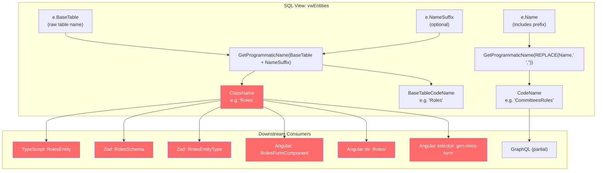
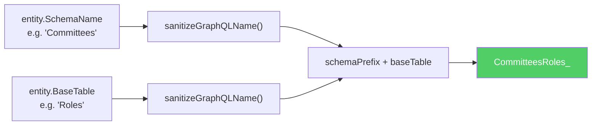
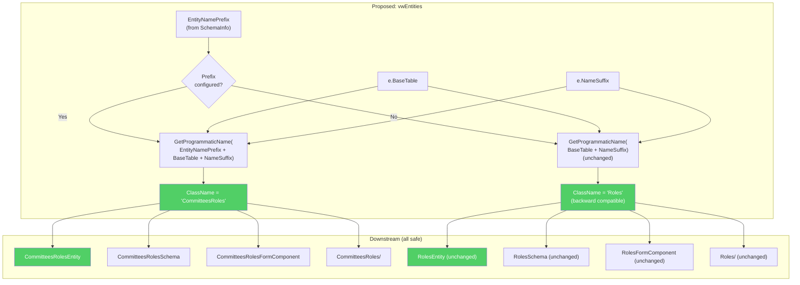
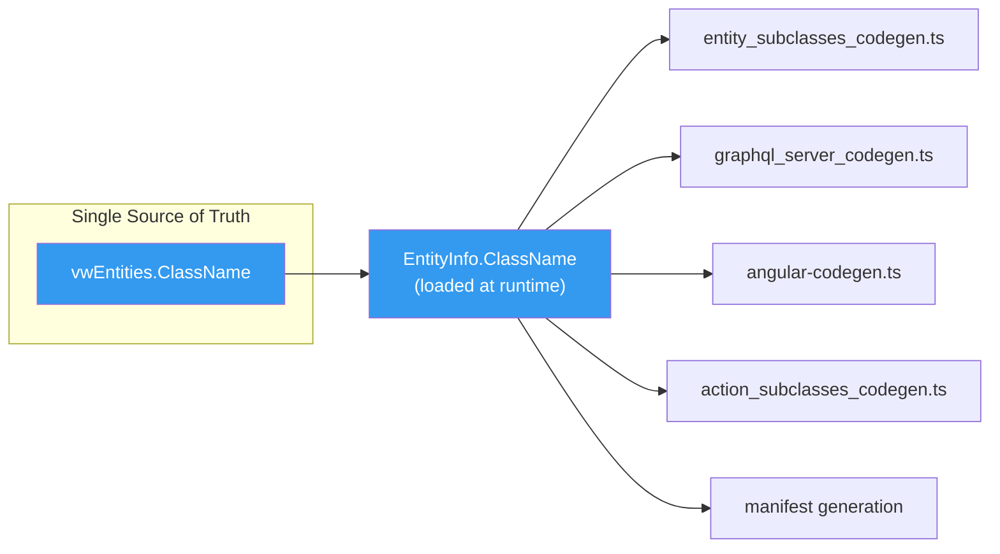
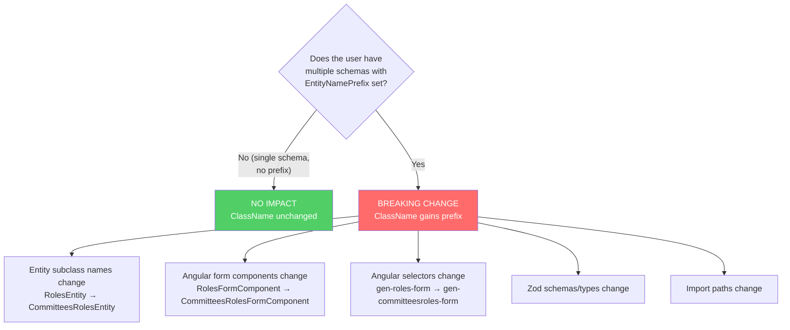

# Entity ClassName Collision Fix — Schema-Aware Class Names

## Problem Statement

When two database schemas contain tables with the same name, CodeGen produces **identical TypeScript class names** for both entities, causing compile-time collisions. The root cause is that `ClassName` is derived solely from `BaseTable` (the raw SQL table name), ignoring the entity name prefix that distinguishes entities across schemas.

### Example Scenario

A `Committees` schema and a `CRM` schema both have a `Roles` table. The user has configured `EntityNamePrefix = "Committees: "` for the Committees schema and `EntityNamePrefix = "CRM: "` for the CRM schema.

| | Committees.Roles | CRM.Roles |
|---|---|---|
| **Entity Name** | `Committees: Roles` | `CRM: Roles` |
| **CodeName** (from Name) | `CommitteesRoles` | `CRMRoles` |
| **ClassName** (from BaseTable) | `Roles` | `Roles` |
| **TS Entity Class** | `RolesEntity` | `RolesEntity` **COLLISION** |
| **Zod Schema** | `RolesSchema` | `RolesSchema` **COLLISION** |
| **Zod Type** | `RolesEntityType` | `RolesEntityType` **COLLISION** |
| **Angular Form Class** | `RolesFormComponent` | `RolesFormComponent` **COLLISION** |
| **Angular Directory** | `Roles/` | `Roles/` **OVERWRITE** |
| **GraphQL Type** | `CommitteesRoles_` | `CRMRoles_` |

GraphQL is the **only layer already protected** — it uses `getGraphQLTypeNameBase()` which prepends the sanitized schema name.

## Current Architecture

### How Names Are Computed Today



### GraphQL (Already Safe)



**Location:** `packages/MJCore/src/generic/graphqlTypeNames.ts:116` — `getGraphQLTypeNameBase()`

### Where ClassName Is Used

The `ClassName` field from `vwEntities` flows into `EntityInfo.ClassName` via `@memberjunction/core` metadata loading, and is consumed by every code generator:

| Generator File | What It Produces | Pattern |
|---|---|---|
| `entity_subclasses_codegen.ts:123` | TS entity class | `${entity.ClassName}Entity` |
| `entity_subclasses_codegen.ts:419` | Zod schema const | `${entity.ClassName}Schema` |
| `entity_subclasses_codegen.ts:428` | Zod type alias | `${entity.ClassName}EntityType` |
| `angular-codegen.ts:117` | Angular form directory | `${entity.ClassName}/` |
| `angular-codegen.ts:124` | Angular form TS file | `${entity.ClassName.toLowerCase()}.form.component.ts` |
| `angular-codegen.ts:135` | Angular component class | `${entity.ClassName}FormComponent` |
| `angular-codegen.ts:441` | Angular selector | `gen-${entity.ClassName.toLowerCase()}-form` |
| `graphql_server_codegen.ts:151` | GraphQL import | `${entity.ClassName}Entity` (from entity subclasses) |

All of these will collide if two entities share the same `ClassName`.

## Proposed Solution

### Core Idea

Make `ClassName` incorporate the entity name prefix (derived from `EntityNamePrefix` in `SchemaInfo` or `NameRulesBySchema` in `mj.config.cjs`) when one is configured. For schemas with **no prefix configured**, the behavior remains unchanged.

This mirrors how `CodeName` already works — it's computed from the full `e.Name` which includes the prefix.

### Backward-Compatibility Rule

> **If a schema has no `EntityNamePrefix` configured (either in SchemaInfo or mj.config.cjs), `ClassName` is computed exactly as it is today.** This means the vast majority of simple single-schema installations see zero impact.

Collisions can only occur when multiple schemas are in play, and those schemas necessarily require prefixes to disambiguate entity names. The fix targets exactly those configurations.

### Change Flow



## Implementation Plan

### Layer 1: SQL View Change (`vwEntities`)

**File:** `SQL Scripts/MJ_BASE_BEFORE_SQL.sql`

Change the `ClassName` computation in `vwEntities` from:

```sql
__mj.GetProgrammaticName(e.BaseTable + ISNULL(e.NameSuffix, '')) AS ClassName,
```

To:

```sql
__mj.GetProgrammaticName(
    ISNULL(si.EntityNamePrefix, '') + e.BaseTable + ISNULL(e.NameSuffix, '')
) AS ClassName,
```

This requires joining `SchemaInfo`:

```sql
FROM [__mj].Entity e
LEFT OUTER JOIN [__mj].Entity par ON e.ParentID = par.ID
LEFT OUTER JOIN [__mj].SchemaInfo si ON e.SchemaName = si.SchemaName
```

**`BaseTableCodeName` should remain unchanged** — it represents the raw table name for programmatic use and is intentionally schema-unaware. Only `ClassName` gets the prefix treatment.

> **Note:** The `GetProgrammaticName` function strips non-alphanumeric characters, so a prefix like `"Committees: "` becomes `Committees` cleanly in the output.

### Layer 2: Migration Script

A Flyway migration to:
1. Alter `vwEntities` with the new `ClassName` computation
2. No data migration needed — `ClassName` is a computed view column, not stored

### Layer 3: Verify Downstream Consumers

All downstream consumers already use `entity.ClassName` from metadata. Once the view is updated and metadata is refreshed, all generators automatically pick up the new value:



No changes needed in any TypeScript code generator — they all read `entity.ClassName` and will automatically use the prefixed value.

### Layer 4: GraphQL Alignment Check

`getGraphQLTypeNameBase()` in `packages/MJCore/src/generic/graphqlTypeNames.ts` currently computes its own schema-aware name independently. After this change, we should verify that the GraphQL type names and the new `ClassName` values are consistent. They use slightly different logic:

- **GraphQL:** `sanitizeGraphQLName(schemaName) + sanitizeGraphQLName(baseTable)` — always prefixes with schema name
- **New ClassName:** `GetProgrammaticName(EntityNamePrefix + BaseTable + NameSuffix)` — only prefixes when configured

For the MJ core schema specifically:
- GraphQL produces: `MJUser` (hardcoded "MJ" prefix)
- New ClassName would produce: `MJUser` (from `EntityNamePrefix = "MJ: "`)
- These align.

For custom schemas with prefixes, they should also align assuming the prefix is set to match the schema name (which is the expected convention). Worth verifying in testing.

## Breaking Change Analysis

### Who Is Affected?



### Detailed Impact

| Scenario | Impact |
|---|---|
| **Single schema, no prefix** (typical simple install) | **None** — `ClassName` stays exactly the same |
| **Multiple schemas, no prefixes** | **None** — no prefix means no change to `ClassName`. However, these users already have a latent collision risk if table names overlap |
| **`__mj` core schema** (MJ itself) | **Breaking** — core entity classes change from e.g. `AIModelEntity` to `MJAIModelEntity`. This is the biggest impact since it affects `@memberjunction/core-entities` and all code referencing those classes |
| **Custom schemas with `EntityNamePrefix`** | **Breaking** — class names gain the prefix. Custom code referencing old class names must be updated |

### The MJ Core Schema Question

The `__mj` schema currently has `EntityNamePrefix = "MJ: "` configured. This means **all MJ core entity classes would change**, e.g.:

- `AIModelEntity` → `MJAIModelEntity`
- `EntityEntity` → `MJEntityEntity`
- `UserEntity` → `MJUserEntity`

This is the most impactful part of the change. Options:

1. **Apply uniformly** — all schemas including `__mj` get the prefix. Clean and consistent, but massive breaking change for every MJ consumer.
2. **Exempt `__mj` schema** — only apply prefix for non-core schemas. Reduces blast radius significantly but introduces an exception.
3. **Opt-in flag** — add a `ApplyPrefixToClassName` boolean column to `SchemaInfo` (default `false`). Only schemas that explicitly opt in get the prefix. Zero breaking change until someone enables it.

### Recommendation: Option 3 (Opt-In Flag)

Add `ApplyPrefixToClassName BIT NOT NULL DEFAULT 0` to `SchemaInfo`. The `vwEntities` computation becomes:

```sql
__mj.GetProgrammaticName(
    CASE WHEN si.ApplyPrefixToClassName = 1
         THEN ISNULL(si.EntityNamePrefix, '')
         ELSE ''
    END
    + e.BaseTable + ISNULL(e.NameSuffix, '')
) AS ClassName,
```

This means:
- **Existing installations:** Zero impact. The flag defaults to `0`, `ClassName` stays the same.
- **New multi-schema setups:** Set the flag to `1` on schemas where you want prefixed class names.
- **MJ core schema:** Can optionally enable it in a future major version when the breaking change is acceptable.
- **Users who want it now:** Flip the flag and re-run CodeGen. They accept the breaking change on their own terms.

## Migration Checklist

- [ ] Add `ApplyPrefixToClassName BIT NOT NULL DEFAULT 0` to `SchemaInfo` table
- [ ] Update `vwEntities` to conditionally include prefix in `ClassName`
- [ ] Update `spCreateSchemaInfo` and `spUpdateSchemaInfo` to include the new column
- [ ] Update `vwSchemaInfos` base view (if it filters columns)
- [ ] Run CodeGen to regenerate entity field metadata for SchemaInfo entity
- [ ] Verify `getGraphQLTypeNameBase()` alignment with new ClassName values
- [ ] Add unit tests for ClassName generation with and without the flag
- [ ] Update CHANGELOG noting the new opt-in capability
- [ ] Document in CLAUDE.md / guides

## Open Questions

1. **Should `BaseTableCodeName` also get the prefix?** Current recommendation: No. `BaseTableCodeName` is meant to represent the raw table name. Adding prefix there would be redundant with the new `ClassName` and could break SQL generation that uses it for table references.

2. **Should the `CodeName` computation change?** `CodeName` already includes the prefix (via entity `Name`). No change needed.

3. **Should we automatically set `ApplyPrefixToClassName = 1` for new schemas that have a prefix configured?** This would be a good ergonomic default — if you're configuring a prefix, you probably want it applied everywhere. But existing schemas would remain `0` to preserve backward compatibility.

4. **Should we add a corresponding `ApplyPrefixToCodeName` flag?** `CodeName` already derives from `e.Name` which always includes the prefix. This is a different mechanism than `ClassName`. Probably not needed, but worth considering for symmetry.
