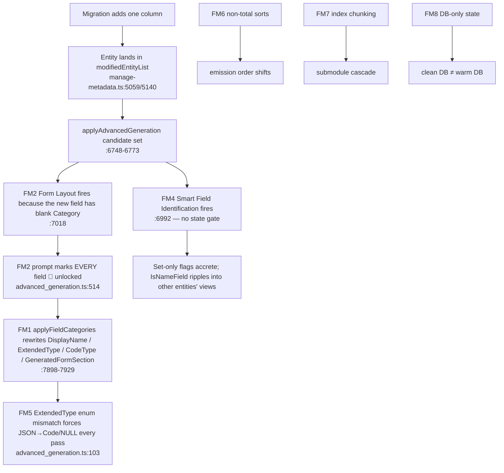

# CodeGen Idempotency, Field Change Tracking, and Drift Prevention

**Status:** rev 3.1 — verified against source, finalized for build (rev 3 added the metadata-record persistence model and modified-column re-opening; rev 3.1 folds in the V4 / V5 / V7 verification reports — §0.3)
**Branch:** `an-dev-sync-composition-axes` (PR #4296)
**Owner:** CodeGen (`@memberjunction/codegen-lib`, `@memberjunction/core` sort helpers, `@memberjunction/cli`)
**Target:** warm developer databases, clean-room CI databases, and every Open App that runs `mj codegen`

> **Rev 3.1 supersedes rev 1, rev 2 and rev 3 in full.** Every file:line below was re-verified against
> `an-dev-sync-composition-axes` at `b7912d12` by an adversarial read of the source. Where rev 1
> was wrong (function names, line ranges, mechanisms, example values) this document says so
> inline rather than silently correcting, so the builder does not go looking for code that does
> not exist. Appendix A is the claim-by-claim verification record.
>
> **Reversion Note (C7 Decision Metadata Store Reverted):**
> The `metadata/entities/decisions/` store, `DecisionMetadataWriter`, format schema, and export scripts have been removed. The decision metadata store was redundant with the migration's CodeGen capture (`migrations/v5/CodeGen_Run_*.sql`), and it actively weakened the drift gate. The field-metadata lock (`field-metadata-lock.ts`) and database migration capture SQL are the authoritative single source of truth.

---

## 0. How to use this document (builder quick-start)

1. Read §1 (definitions) and §3 (principles) once. Everything else follows from them.
2. Build in the order of §5. Each phase ends in a **checkpoint** that is a runnable command
   whose output must be empty/green before the next phase starts. Do not reorder phases —
   Phase 1 (pure determinism) must be green before Phase 2 (LLM guardrails), or you cannot tell
   which fix produced which effect.
3. Every component in §4 lists the tests it must pass (§6). Write the test first when the
   component is a pure function; write it alongside otherwise. **No component is done until its
   tests exist and pass.**
4. §7 is the integration tier. It is not optional and it is not "later" — it is the only thing
   that proves the goal, because unit tests cannot see the seam between SQL Server, the metadata
   tables, the LLM apply path, and the file writers.
5. §8 records the decisions already made (including the four questions rev 1 asked). Do not
   re-litigate them in the PR; if one turns out to be wrong in practice, write it up in §9 and
   flag it in the PR description.

### 0.1 What changed from rev 1 (for the reviewer)

- **Three failure modes rev 1 did not have**: Smart Field Identification (FM4 — set-only flag
  accretion, `IsNameField` ripple into other entities' views), the `ExtendedType` enum mismatch
  (FM5 — the actual cause of `Configuration` flipping; rev 1's `textarea`/`CodeType='JSON'`
  story was impossible), and DB-only state (FM8 — the reason a clean DB diverges from a warm one).
- **The tracking design is narrower on purpose**: only *new* fields are tracked (three INSERT
  sites, not one); "modified" cannot be derived from `@FilteredRows` because Sequence parking
  makes it entity-granular exactly when a column is added (D2).
- **The lock model is simpler**: *fill, never rewrite*; `AutoUpdate*` is a veto on filling; the
  lock is enforced in the apply path, not the prompt (§3). Rev 1's Component 2 code kept an
  `AutoUpdateCategory` term in the WHERE while removing the JS gate — half of each is worse than
  today (C8 in Appendix A).
- **Ordering** is pinned to specific sites, including two in MJCore (`providerBase.ts:4649`,
  `:4620`) and the locale-dependence of `localeCompare`; `remote_operations.ts` was a hand-edit,
  not churn.
- **Submodules**: hash buckets, plus the discovery that the `AngularCoreEntities`
  `maxComponentsPerModule=100` option is never read.
- **A backfill migration** (C7) is required for reproducibility, not just code fixes.
- **Tests**: 16 unit-test files specified case-by-case (§6) and a three-stage integration
  harness that becomes a PR gate (§7).

### 0.2 What changed from rev 2 (rev 3)

- **Decision metadata is recorded in `metadata/entities/`, not in a backfill migration.** Every
  LLM- or human-decided column on `EntityField` / `Entity` / `EntitySetting` /
  `ApplicationEntity` gets a version-controlled record (one file per entity, `@lookup`-by-name
  keys, no hardcoded IDs). CodeGen **writes** those files when it decides something; `mj sync push`
  hydrates any database from them; the release-time consolidated `Metadata_Sync` migration ships
  them (`metadata/CLAUDE.md` rule 1b). The SQL capture keeps carrying the same UPDATEs as a
  replay convenience (D13). §1.2, §3.1 principle 5, C7, D9/D13/D14/D15.
- **A modified column can re-open a decision — narrowly.** A `Description` change re-opens
  `DisplayName`; a `Type`/`Length`/`Precision`/`Scale`/`AllowsNull` change re-opens the
  type-derived columns (`ExtendedType`, `CodeType`, search flags, the `IsNameField` pass);
  nothing else re-opens anything; `Category` never re-opens. §3.4, C1.
- **CodeGen learns *what* changed on a field, and a renumber is not a change.** Rev 3 put this
  in the proc (a `ChangeReasons` column); rev 3.1 moves it to a TypeScript before/after snapshot
  diff around the proc call (§0.3, C1, D16). Either way a bare Sequence renumber no longer marks
  an entity modified on SQL Server, as it already does not on PostgreSQL.
- **The LLM is not asked about locked columns.** Locked fields go to the prompt as compact
  context only; output is requested only for new / blank / re-opened fields. C3, C4.
- **New acceptance criterion:** a freshly migrated database must report **zero** material field
  changes on its first CodeGen run — the harness prints offenders by reason when it does not. §7.

### 0.3 What changed from rev 3 (rev 3.1) — the V4 / V5 / V7 reports

Three independent readers went after rev 3's remaining assumptions (Appendix A, R8–R14).
Everything below is a verified fact about the source, not a preference.

- **The SQL Server proc is regressed, and the tracking source moves to TypeScript.**
  `V202608260829` (Aug 26) rebuilt `spUpdateExistingEntityFieldsFromSchema` from the v5.38 body
  and dropped v5.49's soft-PK guard and `#uef_*` materialization; and *neither* dialect gates the
  FK predicates on `AutoUpdateRelatedEntityInfo` / `IsSoftForeignKey`. A soft PK (SQL Server) or
  soft FK (both) is therefore "modified" on every run and `applySoftPKFKConfig` rewrites it on
  every run — a phantom that rev 3's proc-side `ChangeReasons` would have reported as a real
  change on one platform and not the other. C1 now (a) diffs a before/after snapshot in
  TypeScript — one implementation, and it sees what the UPDATE actually wrote — and (b) ships a
  separate migration restoring the v5.49 body, keeping `@IncludedSchemaNames`, and adding the
  missing soft-FK / `AutoUpdate` gating on both dialects. `ChangeReasons` is gone. D16.
- **PostgreSQL heal calls pass parameters positionally.** `callRoutineSQL` ignores `paramNames`
  (`PostgreSQLCodeGenProvider.ts:1775`) while `buildHealSchemaRoutineParams` omits `EntityIDs`
  when unscoped, so on PostgreSQL an unscoped call with `includeSchemas` lands the include list
  in `p_EntityIDs`. C1 change (5): named notation.
- **`AutoUpdateDescription` is inverted in the entity subclasses.** `Set('Description')` on
  `MJ: Entities` / `MJ: Entity Fields` flips the flag to **true** — which the proc reads as
  "overwrite from the extended property". A human edit is re-armed against itself on the next
  run, and the LLM's entity descriptions are wiped on run 2 when the table has no
  `MS_Description`. C10 fixes the subclass and makes every LLM description write clear the flag.
  The record still never carries `Description`. D18.
- **Two writers run unconditionally on every run**, one of them captured
  (`applySoftPKFKConfig`, `processEntityConfigs`). In any repository that configures
  `additionalSchemaInfo` (core points at a file that does not exist today; Open Apps use it)
  `warm-twice` cannot pass by construction. C9: compare-first, both captured; `EntitySetting`
  upserts get a deterministic ID and an existence guard.
- **`GeneratedCode` INSERTs carry no literal ID**, so the captured `UPDATE … WHERE ID = <dev id>`
  after a CHECK change matches zero rows on every other database, which then regenerates the
  validator itself (an LLM call and another orphan UPDATE). C11.
- **The decision writer runs last, and never writes `null`.** Geo `ExtendedType` is written by
  `applyLatePhaseFixups` *after* advanced generation (`sql_codegen.ts:414,492`), so a writer that
  flushed inside `applyAdvancedGeneration` would record `null` on run 1 and `GeoLatitude` on run
  2; and an explicit `null` alternates with every fill-only writer. C7, D17.
- **A5 resolved (V7):** the writer's directory is an `output[]` entry
  (`{ type: 'MetadataSync', directory: './metadata' }`; `outputDir('MetadataSync', false)` →
  `null` = off) — no new config key; the formatter is replicated in CodeGenLib (no runtime
  dependency on `@memberjunction/metadata-sync`; byte-equality pinned in T14 via a
  devDependency). No server-side subclass exists for any of the four entities; value-list
  validation rejects an out-of-list value before SQL — which is why D15's migrate-before-push
  order is not optional.
- **Smaller:** `RelatedEntityNameFieldMap` joins the Never list; the INSERT no longer starts a
  primary key with `IncludeInUserSearchAPI = 1`; `warm-twice` also asserts a post-run
  `mj sync push --dry-run` reports 0 updates; T1/T16 rewritten, T19–T22 added; C9–C11 added.

Commands assume the repo root. `pnpm` is the package manager. The workbench SQL Server
(`docker/workbench/docker-compose.yml`, service `sql-claude`, host port **1444**) is the
sanctioned throwaway database for the integration checks — never run them against a shared DB
(CLAUDE.md: *one database per agent*).

---

## 1. Goal and definitions

### 1.1 The objective

Make `mj codegen` **100% idempotent relative to a given database state**, and make its output
**reproducible** across databases at the same shipped state.

Three properties, each with a mechanical test (§7):

| Property | Statement | Test |
|---|---|---|
| **P1 Run-idempotency** | Running `mj codegen` twice against the same database, with no schema change in between, produces **zero** modified files on the second run **and** an empty CodeGen SQL capture (no `CodeGen_Run_*.sql` survives — `SQLLogging.finishSQLLogging` already deletes an empty file). | §7.2 stage `warm-twice` |
| **P2 Reproducibility** | Two databases at the same **migration frontier and the same `mj sync push` state** produce byte-identical generated files. | §7.2 stage `clean-room` (the existing `codegen-drift` CI job, promoted) |
| **P3 Minimal blast radius** | Adding one column to one table changes only that entity's artifacts, and inside them only that column's rows/lines. No sibling field's `DisplayName`, `Category`, `ExtendedType`, `CodeType`, `GeneratedFormSection`, `DefaultInView`, `IncludeInUserSearchAPI`, `UserSearchPredicateAPI`, `IsNameField` changes. No other entity changes. No Angular submodule other than the one that owns the entity changes. | §7.2 stage `single-column` |

### 1.2 What remains non-deterministic *by design* (and how it is contained)

The LLM is still consulted **once** for genuinely new metadata: a new entity, a new field on an
existing entity, or a column whose description or type changed (§3.4). Its answer for that field
(Category, DisplayName polish, ExtendedType, CodeType, DefaultInView, IncludeInUserSearchAPI,
UserSearchPredicateAPI) is:

1. written to the metadata tables **once**, on the run that created or re-opened the field;
2. **recorded** in `metadata/entities/` as a partial `MJ: Entity Fields` record under its entity
   (C7) — the version-controlled source of truth for every decided column, keyed by entity name +
   field name so it applies to any database;
3. **hydrated** into every other database by `mj sync push` (the developer loop is
   `mj migrate → mj sync push → mj codegen`, D15) and shipped to hosts by the release-time
   consolidated `Metadata_Sync` migration (`metadata/CLAUDE.md` rule 1b);
4. still **captured** into the run's `CodeGen_Run_*.sql` as today (all LLM apply paths go through
   `LogSQLAndExecute` / `LogSQLBatchAndExecute` with `isRecurringScript=false` —
   `manage-metadata.ts:7146`, `:7946`, `:7977`, `:8005`, `:8017`, `:8041`, `:8053`, `:8080`), so a
   host that replays migrations without a metadata push still gets the same values (D13).

Two developers adding the *same* new column on separate databases can therefore get different
LLM answers — that resolves as an ordinary merge conflict on one JSON file, once. It never
recurs, and it never touches any field that already had a value. That is the whole contract.

Everything else — ordering, chunking, schema-derived rows, values that already exist — is
deterministic with no LLM in the loop.

### 1.3 Terms used below

- **Candidate entity**: an entity in `ManageMetadataBase.newEntityList ∪ modifiedEntityList`
  (or every non-virtual entity when `forceRegeneration.enabled`). Only candidates reach the
  advanced-generation (LLM) pass — `manage-metadata.ts:6748-6773`, early return at `:6768`.
- **New field**: an `EntityField` row inserted by *this* CodeGen run (see C1).
- **Blank**: `NULL` or whitespace-only. `Category`, `DisplayName` and `ExtendedType` have
  different "blank" semantics — §3.2 spells them out; do not generalize.
- **Locked**: a value CodeGen will not write. Locked is a *derived* state (§3.2), never a
  stored flag; the `AutoUpdate*` flags are the human's veto on top of it.

---

## 2. Root cause analysis — eight failure modes

The PR #4296 CodeGen runs (adding `Entity.SubtypeSelector`) moved fields between form panels,
renamed `DisplayName`s on untouched columns, and flipped `MJ: Entities.Configuration` between a
code editor and a plain text area. Rev 1 named five failure modes. Verification found three more
and corrected two of the original mechanisms. All eight are below; each names the exact code and
the test in §6 that pins it.



### FM1 — `applyFieldCategories` rewrites metadata on fields that did not change

**Where:** `packages/CodeGenLib/src/Database/manage-metadata.ts:7862-7949` (rev 1 cited
7875-7940). Outer gate `:7881` `if (field && field.AutoUpdateCategory && field.ID)`; SET clauses
at `:7898` (Category), `:7906` (GeneratedFormSection), `:7909` (DisplayName), `:7913`
(ExtendedType), `:7923` (CodeType); single UPDATE at `:7931-7937` whose WHERE repeats
`AND AutoUpdateCategory = 1`.

**Mechanism (verified):**

- Each SET clause compares the LLM value to the current value and writes on any difference.
  Nothing asks whether the field was created or changed in this run.
- The only category-stability rule (`:7889-7894`) rejects moving an existing field to a **new**
  category. A move between two **existing** categories (`:7897-7899`) is accepted. So the
  prompt's 🔒 marker is the *only* thing protecting an existing field's category, and (FM2) that
  marker is never rendered.
- `GeneratedFormSection = 'Category'` (`:7906-7908`) is pushed for every field the LLM returns
  whose section is not already `Category`, **even when Category itself did not change**, with no
  `AutoUpdate*` flag of any kind. A hand-set `Top`/`Details` section is reset each time the
  entity is a candidate, and `angular-codegen.ts:606-610` branches on that value, so the field
  moves in the generated form.
- **CodeType has no flag gate at all** (`:7923` `if (fieldCategory.codeType !== undefined)`).
  There is no `AutoUpdateCodeType` column anywhere (`grep` over generated entities, CodeGenLib
  and migrations: zero hits). Its only protection is the outer `AutoUpdateCategory` gate.
- The WHERE-clause `AND AutoUpdateCategory = 1` is redundant with the JS gate at `:7881` — it
  is not the operative gate, which matters because rev 1's proposed rewrite dropped the JS gate
  but kept the WHERE, producing UPDATEs that log to the migration capture and affect zero rows.
- Two callers: `applyFormLayout` (`:7734`, regular entities — receives `isNewEntity` at `:7726`
  and does **not** forward it) and `applyVEFieldCategories` (`:3254`, virtual entities). Any
  signature change must update both.
- A third writer bypasses this function entirely on virtual entities:
  `applyLLMFieldDescriptions` (`:3404-3414`) writes `ExtendedType` gated only on
  `AutoUpdateExtendedType` and "field has no Description", keyed by `EntityID + Name`.

**Rev 1 example values were impossible.** `"textarea"` is not in `EntityFieldExtendedTypes`
(`packages/MJCore/src/generic/entityInfo.ts:33-39`) nor in `EXTENDED_TYPE_ALIASES`
(`manage-metadata.ts:3429-3458`), so `validateExtendedType` returns null and `:7917` skips the
write; `CodeType='JSON'` violates `CK_EntityField_CodeType` (CSS/HTML/JavaScript/Other/SQL/
TypeScript). What actually happened to `Configuration` is FM5: it was `ExtendedType='JSON'`, a
value the LLM is not allowed to say, so every pass rewrote it to `Code` or `NULL`.

**Pinned by:** §6 T2 (`apply-field-categories-lock.test.ts`).

### FM2 — the prompt's lock marker can never render, and the apply path never checks it

**Where:** `packages/CodeGenLib/src/Misc/advanced_generation.ts:511-515`; template
`metadata/prompts/templates/codegen/form-layout-generation.template.md:93-101`; gate
`manage-metadata.ts:7018`.

```ts
// advanced_generation.ts:514-515 (verbatim)
HasExistingCategory: !f.AutoUpdateCategory && f.Category != null,
IsNewField: f.AutoUpdateCategory === true && !f.Category,
```

**Mechanism (verified):**

- `AutoUpdateCategory` is `BIT NOT NULL DEFAULT 1`
  (`migrations/v2/V202511060837__v2.116.x__CodeGen_Advanced_Generation_Metadata.sql:13`;
  fresh-DB DF at `migrations/v5/B202605291452__v5.38.x__Baseline.sql:7587`). **Every**
  `AutoUpdate*` column in the schema defaults to 1; CodeGen never writes any of them (the three
  raw `INSERT INTO EntityField` paths at `:2986`, `:3604`, `:4891` omit them), so they are pure
  input state.
- With the flag at 1, `!f.AutoUpdateCategory` short-circuits to `false` and the template renders
  every field as `🔄 … NEEDS categorization (can be reassigned)`. The template and the code
  *agree*: rule 8 says the only lock is `AutoUpdateCategory=false`. The lock semantic itself is
  wrong for idempotency, not the implementation of it.
- `IsNewField` is computed and **never read** by the template (grep: zero matches). Dead flag.
- The code passes `existingFieldCategoryInfo` (`:542`) but the template reads
  `existingCategoryInfo[category].icon` (template line 72). Nunjucks resolves the undefined
  lookup silently, so existing category icons never reach the prompt.
- The gate at `:7018` fires the prompt for the whole entity when **one** `AutoUpdateCategory=1`
  field is blank, and sends **all** fields (`:7025-7030`). It is then the apply path (FM1), not
  the prompt, that decides what gets written — and it checks nothing.
- **Re-trigger loop:** a field the LLM omits from `fieldCategories`, or returns with a name that
  fails the case-sensitive `fields.find(f => f.Name === fieldCategory.fieldName)` at `:7879`,
  stays blank, so the entity re-fires the whole prompt on every run in which it is a candidate.

**Pinned by:** §6 T3, T4.

### FM3 — no field-level change tracking, and `@FilteredRows` cannot supply it

**Where:** `manage-metadata.ts:507` (`_newEntityList`), `:514` (`_modifiedEntityList`), `:520`
(`_deletedEntitySchemaList`), writers `:5059`, `:5100`, `:5140`, `:5285`, `:5977`.

**Corrections to rev 1:**

- The function is **`createNewEntityFieldsFromSchema`** (`:4999`, loop `:5027-5038`, INSERT
  builder `getPendingEntityFieldINSERTSQL` `:4841`). `createPendingEntityFields` does not exist.
- It is **not** the only place new `EntityField` rows are inserted. `manageSingleVirtualEntityField`
  (`:2928`, INSERT `:2986`, virtual and external entities) and `manageSingleEntityParentFields`
  (`:3530`, INSERT `:3604`, IS-A parent mirrors) also insert, and neither touches any tracking
  list. A hook placed only in `createNewEntityFieldsFromSchema` misses both.
- `@FilteredRows` from `spUpdateExistingEntityFieldsFromSchema` is **not** "the exact fields whose
  SQL definitions changed". Its predicate
  (`migrations/v6/V202608260829__v6.1.x__Heal_SPs_IncludedSchemaNames.sql:242-262`) includes
  `ef.Sequence <> fromSQL.Sequence` (`:251`). `createNewEntityFieldsFromSchema` parks every
  existing field of an entity that gained a column at `Sequence + 100000`
  (`parkEntityFieldSequencesSQL` `:4979-4990`, invoked `:5031`) immediately before the proc runs
  (`manageEntityFields` `:4158 → :4180`). So for any entity with ≥1 new column, `@FilteredRows`
  returns **every** field of that entity, and rev 1's "register every `@FilteredRows` row as
  modified" degrades straight back to entity granularity in exactly the case that matters.
- The lists are keyed on entity **Name**, deduped case-sensitively (`:5115`); the new field set
  must be keyed on `EntityID` (available at all three INSERT sites: `n.EntityID`, `entity.ID`,
  `childEntity.ID`).

- **The PostgreSQL port already fixed half of this and SQL Server did not.**
  `packages/CodeGenLib/src/Database/providers/postgresql/metadataSupportObjects.ts:316-350`
  computes `is_material_change` (every predicate *except* Sequence) separately from
  `is_sequence_change`, applies the UPDATE for both, and RETURNs only material rows — its comment:
  "a pure Sequence renumber … must NOT flag its entity as modified, or every fresh PG CodeGen run
  re-emits byte-identical views + sprocs for dozens of entities". The T-SQL proc has no such
  split, so on SQL Server a renumber marks the entity modified, which makes it an LLM candidate.

**Decision (D2, rev 3):** track **new** fields, and track **changed** fields *with reasons* by
making the proc report them (both dialects) — then re-open only what §3.4 says a given reason
re-opens. `Category` never re-opens.

**Pinned by:** §6 T1.

### FM4 — Smart Field Identification has no state gate and accretes flags monotonically

**Where:** gate `manage-metadata.ts:6992-6996`; `identifyFields`
`advanced_generation.ts:284-340`; appliers `:7288-7326` (IsNameField), `:7466-7490`
(DefaultInView), `:7503-7534` (IncludeInUserSearchAPI), `:7571-7598` (UserSearchPredicateAPI),
`:7611-7654` (entity AllowUserSearchAPI), `:7675-7712` (FullTextSearch, off by default via
`allowFullTextSearchAutoUpdate: false`, `config.ts:231`).

**Mechanism (verified). Rev 1 did not mention this path at all.**

- The gate is `fields.some(f => f.AutoUpdateIsNameField || f.AutoUpdateDefaultInView || …)` —
  every one of those flags defaults to 1, so for every **candidate** entity the LLM is called
  with **all** fields, on every run in which the entity is a candidate. (It is *not* "every
  entity every run": the candidate set at `:6748-6773` is empty on a no-change re-run. It bites
  on the run that introduces a change, and under `forceRegeneration`.)
- `DefaultInView` (`:7477-7488`), `IncludeInUserSearchAPI` (`:7523-7531`) and field-level
  `FullTextSearchEnabled` (`:7700-7708`) are **set-only**: they write `1` when the LLM lists the
  field and never clear. `UserSearchPredicateAPI` (`:7595`) and entity `AllowUserSearchAPI`
  (`:7647`) flip **both ways** whenever the LLM's answer differs. Each candidate run can add flags
  that no later run removes, so two databases at the same frontier diverge simply by having had
  different answers the last time the entity was a candidate.
- Only `IsNameField` has a stability rule (`selectNameFieldWinner` `:7336-7362`: an existing
  single eligible winner stays). Keep it; it is already the right shape.
- **Ripple:** `IsNameField` feeds `EntityInfo.NameField` → `sql_codegen.ts:2270-2276`
  (`getIsNameFieldForSingleEntity`) → the FK-name virtual column joined into **every base view
  that references the entity**. A re-pick on entity A rewrites `vw*` for every entity B that FKs
  to A — entities that are not candidates.
- Silent guardrail no-op: `isFieldEligibleForUserSearch` (`:7556`) reads `field.Length`, but the
  advanced-generation field query aliases `ef.Length AS MaxLength` (`:6841`), so the
  `length === -1` rejection never fires and `nvarchar(MAX)` columns are accepted. The sibling
  `isNameFieldTypeSafe` (`:7425`) already reads `field.Length ?? field.MaxLength` with a comment
  describing this exact bug.

**Pinned by:** §6 T5.

### FM5 — the LLM cannot reaffirm seven valid `ExtendedType`s, and three writers have no lock

**Where:** `advanced_generation.ts:103` (`FormLayoutResult.fieldCategories[].extendedType`
union), template line 205 (the enum the LLM is told), `entityInfo.ts:33-39`
(`EntityFieldExtendedTypes`, the real domain), `manage-metadata.ts:7913-7921`.

**Mechanism (verified):**

- The LLM-facing union is a strict subset of the domain: it omits `Color`, `HTML`, `Icon`,
  `Image`, `JSON`, `Markdown`, `Other`. The template requires `extendedType` on **every** field
  (line 438). So for any field currently `JSON`/`Markdown`/`HTML`/`Icon`/`Image`/`Color`/`Other`
  with `AutoUpdateExtendedType=1`, the LLM's answer is *always* different from the current value,
  `:7913` is always true, and the field is rewritten to `Code` or `NULL` on every pass. This is
  `MJ: Entities.Configuration` (JSON → Code → textarea rendering, because
  `angular-codegen.ts:772` selects the editor from `ExtendedType`).
- `CodeType` is nulled as collateral: template line 237 says `codeType` MUST be `null` unless
  `extendedType='Code'`; `sanitizeCodeType` (`:7844-7856`) coerces unknown values to `Other`.
- `applyLLMFieldDescriptions` (`:3404-3414`, virtual entities) writes `ExtendedType` outside
  `applyFieldCategories`, so `AutoUpdateCategory=0` does not protect it there.

**Pinned by:** §6 T6 (enum parity, compile-time and template-text), T2.

### FM6 — non-total sort orders

Rev 1 said "missing ORDER BY or sequence ties". Verification found the specific sites:

| Site | Comparator today | Why it is not total |
|---|---|---|
| `packages/MJCore/src/generic/providerBase.ts:4649` `e.EntityFields = entityFields.sort((a,b) => a.Sequence - b.Sequence)` | Sequence only | Sequence collides (the park/renumber pattern, IS-A mirrors, virtual name columns); ties keep SQL return order. Every generator that iterates `entity.Fields` directly inherits this. |
| `providerBase.ts:4620` `entities.sort((a,b) => a.Name.localeCompare(b.Name))` | `localeCompare`, no locale argument | Collation follows the process ICU default (`LANG`/`LC_ALL`); two machines can order `a`/`B`/`é` differently. Angular emits entities in this order. |
| `manage-metadata.ts:6829-6831` field-load query for the LLM prompts | `ORDER BY ef.EntityID, ef.Sequence` | Ties → the prompt's field order differs between DBs → different first-time LLM answers for a genuinely new entity. |
| `manage-metadata.ts:6805-6811` candidate-entity query | `ORDER BY e.Name` | Name is unique, so total — but add `, e.ID` for the paranoid case of trailing-space names. |
| `angular-codegen.ts:617-637` section sort | Top/System/inherited, then `MinSequence` | Two categories whose first field shares a Sequence keep insertion order. Needs a final `Name` tiebreak. |
| `angular-codegen.ts:238-249` `relatedEntityModuleImports` and each `match.modules` | first-encounter order over the entity list | Inserting an entity that first introduces a library reorders the `import { … } from "@memberjunction/ng-…"` lines. |
| `entityInfo.ts:269`, `:3547` `RelatedEntities` sort | Sequence only | Same tie class; `sortRelatedEntities` in CodeGenLib already re-sorts totally, but any consumer using `entity.RelatedEntities` raw does not. |
| `util.ts:119` `sortBySequenceAndCreatedAt`, `:164` `sortRelatedEntities`, and every `localeCompare` in `entity_subclasses_codegen.ts:221,1171-1177,1369-1383`, `remote_operations_codegen.ts:44,133-134`, `action_subclasses_codegen.ts:72`, `schema-emit.ts:206` | total, but via `localeCompare` | Same locale dependence as row 2. The *shape* is right; the comparator must be ordinal. |

Already correct and to be left alone: `remote_operations_codegen.ts:44` (sorted by
`OperationKey` — rev 1's "AuthorizationCheckInput moved" was a **hand-edited** generated file
being normalized by the next real run, not live non-determinism; Appendix A, C14); `sql_codegen.ts:163,671,700` (`.sort()` on ASCII schema names).

**Pinned by:** §6 T8, T10.

### FM7 — index-based Angular submodule chunking (and a dead config option)

**Where:** `packages/CodeGenLib/src/Angular/angular-codegen.ts:334-390`
(`generateAngularModuleCode`), chunk test `:364`, numbering `:366`/`:377`, `SubModuleBaseName`
`:398`, `generateSubModuleEnding` `:414-427`, option lookup `:256`.

**Corrections to rev 1:**

- The chunk size is not a code constant of 20. The code default is **25** (`:256`, `:285`); the
  `20` comes from the `Angular` output option (`mj.config.cjs:237`, `config.ts:575`). Line 256
  hardcodes `outputOptionValue('Angular', …)` for **both** the `AngularCoreEntities` run
  (`runCodeGen.ts:729-734`) and the `Angular` run (`:744-752`), so the
  `AngularCoreEntities.maxComponentsPerModule = 100` setting (`mj.config.cjs:242`) is silently
  ignored. Verified on disk: the core module has 20 submodules of 20, not 4 of 100. Fixing this
  alone would regroup everything once (every declaration moves) — so the chunking policy and the
  config fix land **together** (C5).
- `GeneratedForms_SubModule_N` are `@NgModule` **class** names inside one file
  (`generated-forms.module.ts`), not file names.
- The cascade also moves the per-submodule `imports:` list
  (`currentSubModuleAdditionalModulesToImport`, `:353-362`, reset per chunk at `:369`) — e.g.
  `JoinGridModule` sits in exactly one submodule today and migrates with the boundary.
- Measured cascades in this file's history are 48 and 66 lines, not 500; the mechanism is real,
  the magnitude was overstated. Part of the visible churn came from a hand-edited generated file
  (`0d3094c5` shows a 21-member submodule the generator cannot produce).

**Pinned by:** §6 T9.

### FM8 — state that exists only in the database

**Where:** every column the generators read that no migration or `metadata/` root ships.

- `metadata/entities/` **is** an `mj sync` root for `MJ: Entities` (`.mj-sync.json`, pattern
  `**/.*.json`) whose records nest `MJ: Entity Fields` under `relatedEntities` and identify rows
  with `@lookup` keys by entity name + field name (e.g.
  `.entity-field-hierarchy-configurations.json`, the `JSONType` files) — but today it carries
  only a handful of hand-authored records. `Category`, `DisplayName`, `ExtendedType`, `CodeType`,
  `GeneratedFormSection`, `IsNameField`, `DefaultInView`, `IncludeInUserSearchAPI`,
  `UserSearchPredicateAPI` have **no record anywhere**; they reach a host only through the CodeGen
  SQL capture appended to migrations. Any LLM write that happened on a dev database during a run
  whose capture was not committed (or was edited in Explorer) exists on that database and nowhere
  else. The hierarchy virtual fields (`ParentIDDepth`, `ParentIDPath`, `ParentIDChildCount`) are
  the concrete case: blank `Category` on `next`, so the first candidate run on a clean DB filled
  them and moved them into "Details". C7 makes those columns part of the record.
- `EntitySetting` rows `FieldCategoryInfo` / `FieldCategoryIcons`
  (`applyCategoryInfoSettings` `:7990-8060`) are **UPDATEd every time the layout prompt ran**,
  with no compare against the current value, and the JSON is built as
  `{...newFromLLM}` then overwritten by existing entries (`advanced_generation.ts:561-571`), so
  key order — and therefore the stored string — can differ run to run. `angular-codegen.ts:657-677`
  embeds `categoryInfo.icon` / `inheritedFromEntityName` into forms, so this reaches output.
- `detectAndSetGeoCodingSupport` (`:7764-7824`) derives `Entity.SupportsGeoCoding` partly from the
  **LLM result** (`hasGeoFields` over `fieldCategories`) rather than solely from persisted
  `ExtendedType`s, and queues a view regeneration on change.
- The `AutoUpdate*` flags themselves are also pushed by `metadata/` in places
  (`metadata/entities/.audit-related-entities.json` pins `AutoUpdateAllowUserSearchAPI: false` on
  ~9 entities), and `migrations/v5/V202605041250__v5.33.x__Search_Hygiene…` flips the two
  search flags to 0 in bulk. This is why P2 is stated as "same migration frontier **and** same
  sync state" — the flags are input, and CI's `codegen-drift` job already does `mj sync push`
  before `mj codegen`.

**Pinned by:** §6 T7, T11; §7.2 stage `clean-room`.

---

## 3. Design principles

Every component in §4 is an application of one of these. When a case comes up that the plan
does not cover, decide it from here.

### 3.1 The six principles

1. **Fill, never rewrite.** CodeGen may populate metadata that is *blank*. It never changes a
   value that exists — no matter what the LLM says, no matter what `AutoUpdate*` says. The
   `AutoUpdate*` flags become the human's **veto on filling** (0 = "leave it blank, I own it"),
   not a license to rewrite.
2. **New-field scope for pre-populated columns.** Some columns are never blank because the
   INSERT populates them deterministically (`DisplayName` via `createDisplayName`,
   `DefaultInView` via the name/early-sequence rule — `getPendingEntityFieldINSERTSQL`
   `:4841-4870`). For those, the LLM may *polish* the value only on the run that created the
   field (`isFieldNew`) or the entity (`isNewEntity`). After that run they are locked.
3. **Deterministic before LLM.** Where a rule can decide, the rule decides and the LLM is not
   asked: `__mj_*` fields → `System Metadata`; `SupportsGeoCoding` from persisted `ExtendedType`;
   `IsNameField` single-winner stability; `GeneratedFormSection` follows `Category`. The LLM
   fills only what rules leave blank.
4. **The lock is enforced in the apply path, not in the prompt.** The prompt still renders 🔒/🆕
   so the model has context and wastes fewer tokens, but the apply code discards any LLM entry
   for a locked field. A model that ignores instructions cannot cause a write.
5. **Record every decision; compare before every write.** Every decided value is written to the
   database **and** to its `metadata/entities/` record in the same run (C7); the SQL capture keeps
   its copy (D13). Every UPDATE is emitted **only if it changes the stored value** (semantic
   compare — canonical JSON for JSON columns), and every JSON write is a byte-identical no-op when
   nothing changed. An UPDATE that affects zero rows or restates the current value is a bug: it
   pollutes the migration tail and defeats P1.
6. **Total orders and position-independent structure.** Every emitted collection is sorted by
   a total key with an **ordinal** (code-unit) comparator — never `localeCompare` without a
   locale, never SQL default order, never `Map`/`Set` insertion order unless the source was
   itself totally ordered. Grouping into files/modules keys on a stable property of the item
   (hash of its name), never on its index.

### 3.2 The per-column lock table (normative)

"Written" means an UPDATE clause is emitted; every clause is additionally subject to principle 5
(skip when equal). `newEntity` = `ManageMetadataBase.newEntityList.includes(entity.Name)`;
`newField` = `ManageMetadataBase.isFieldNew(entity.ID, field.Name)` (C1).

| Column | Written when | Never written when | Notes |
|---|---|---|---|
| `EntityField.Category` | `AutoUpdateCategory=1` AND (Category blank OR newEntity) | Category non-blank on an existing entity | A new field is blank by construction, so "new field" needs no special case here. A blank field may take *any* category (existing or new); a non-blank field never moves — not even between existing categories. |
| `EntityField.GeneratedFormSection` | only inside the same UPDATE that writes `Category` (set to `'Category'`) | on its own | Closes the standalone reset at `:7906-7908`. |
| `EntityField.DisplayName` | `AutoUpdateDisplayName=1` AND (newEntity OR newField OR **descriptionReopened**) AND LLM value non-blank AND differs | any other existing field | Pre-populated at INSERT → principle 2. `descriptionReopened` = the proc reported a `Description` change for this field this run (§3.4). |
| `EntityField.ExtendedType` | `AutoUpdateExtendedType=1` AND (newEntity OR newField OR **typeReopened**) AND value ∈ `EntityFieldExtendedTypes` (or `null`) | any other existing field | `NULL` is a legitimate final state for most fields, so **blank is not an unlock** here. `typeReopened` = a `Type`/`Length`/`Precision`/`Scale`/`AllowsNull` change this run (§3.4). |
| `EntityField.CodeType` | same gate as ExtendedType (there is no `AutoUpdateCodeType`; `AutoUpdateExtendedType` governs both — D6) | any other existing field; any field with `AutoUpdateExtendedType=0` | Closes the flag hole at `:7923`. |
| `EntityField.IsNameField` | unchanged algorithm (`applyNameFieldUpdates`, single stable winner) — but the pass runs only when newEntity OR the entity has ≥1 new or type-reopened field | — | Already deterministic given DB state; its ripple into other entities' views is why the pass must not run gratuitously. |
| `EntityField.DefaultInView` | `AutoUpdateDefaultInView=1` AND (newEntity OR newField) | existing field | Pre-populated at INSERT → principle 2. Set-only today; stays set-only. |
| `EntityField.IncludeInUserSearchAPI` | `AutoUpdateIncludeInUserSearchAPI=1` AND (newEntity OR newField OR typeReopened) AND eligible | any other existing field | Also fix the `Length`/`MaxLength` alias bug (`:7556`). |
| `EntityField.UserSearchPredicateAPI` | `AutoUpdateUserSearchPredicate=1` AND (newEntity OR newField OR typeReopened) | any other existing field | Today flips both ways on every candidate run. |
| `EntityField.FullTextSearchEnabled` | config `allowFullTextSearchAutoUpdate` AND flag AND (newEntity OR newField OR typeReopened) | any other existing field | Off by default. |
| `Entity.AllowUserSearchAPI`, `Entity.FullTextSearchEnabled` | `AutoUpdate*=1` AND newEntity | existing entity | Today flips on every candidate run. |
| `Entity.SupportsGeoCoding` | derived **only** from persisted `ExtendedType IN (Geo*)` after the field writes are applied; compare-before-write | from the LLM result | Principle 3. |
| `Entity.Icon` | blank only (already, `:7965-7974`) | — | Already correct. |
| `EntitySetting FieldCategoryInfo` / `FieldCategoryIcons` | when the **canonical** JSON differs from the stored value; existing category entries are preserved verbatim; only new categories are added | unchanged content | Principle 5. |
| `ApplicationEntity.DefaultForNewUser` | newEntity (already, `:7754`) | — | Already correct. |
| `Entity.Name`, `Entity.Description` | new entities only (`newEntityNameWithAdvancedGeneration` `:5823`; `EntityDescriptions` feature is `enabled:false` by default) | existing entity | Verify C13 in Appendix A; no change expected. |
| VE `EntityField.Description` | blank only (already, `:3395-3398`) | — | Already correct. |
| VE `EntityField.ExtendedType` via `applyLLMFieldDescriptions` | `AutoUpdateExtendedType=1` AND newField (the VE field was inserted this run) AND valid | existing VE field | Closes the bypass at `:3404-3409`. |
| VE soft PK/FK | already gated on `hasSoftAnnotations` (`:3071-3077`) | — | Unchanged. |

### 3.3 What the human does to re-open a value

Because CodeGen never rewrites, the way to get a fresh LLM opinion on an existing value is to
**blank it** (for `Category`) or **set the value yourself** (everything else). `AutoUpdate*=0`
means "do not even fill this". This is simpler than the old model and it is the model the
prompt template already describes in its own MANDATORY rules ("NEVER rename existing
categories", "Avoid moving existing fields"). Document it in `packages/CodeGenLib/CLAUDE.md`
(Phase 5). The one automatic exception is §3.4: a schema change to the column itself.

### 3.4 Modified columns: what re-opens what (normative)

A column that already existed can change shape. `spUpdateExistingEntityFieldsFromSchema`
detects that (its WHERE at `V202608260829…:242-262`), and today CodeGen only learns "this entity
had *some* field change". With C1 it learns **which field and why**. The rule for what a change
re-opens is deliberately narrow — every re-ask costs tokens and is a chance to churn:

| Change reason (from the proc's own predicates) | Re-opens | Rationale |
|---|---|---|
| `Description` (only fires when `AutoUpdateDescription=1`, i.e. the extended property changed) | `DisplayName` | The only schema change that carries new *semantic* information about the column. |
| `Type`, `Length`, `Precision`, `Scale`, `AllowsNull` | `ExtendedType`, `CodeType`, `IncludeInUserSearchAPI`, `UserSearchPredicateAPI`, `FullTextSearchEnabled` (field), and the `IsNameField` eligibility pass | These values are functions of the type. `int → nvarchar(MAX)` legitimately changes searchability and editor choice; it says nothing about the name. |
| `DefaultValue`, `AutoIncrement`, `IsVirtual`, `IsComputed`, `IsPrimaryKey`, `IsUnique`, `RelatedEntityID`, `RelatedEntityFieldName` | nothing | Schema-derived facts the sync already wrote; no LLM decision depends on them alone. |
| `Sequence` | nothing | Parking/renumbering noise (FM3). |
| any reason | **never** `Category`, `DefaultInView`, `GeneratedFormSection` | Category is blank-fill only (§3.2); a human blanks it to re-open it. |

Three consequences the builder must implement literally:

1. The LLM is **not asked** about locked columns. The form-layout prompt receives locked fields
   as compact context (name + current category) and requests output only for fields marked
   🆕 (new), 🔄 (blank category) or ✏️ (description changed → displayName review only). Smart
   Field Identification receives the full field list (it reasons about the entity as a whole)
   but its **candidate** lists for the field-level outputs name only new / type-changed fields.
2. The apply path enforces the same table: an LLM entry for a field that is neither new nor
   re-opened for that column is discarded and counted (`ai.fieldsLocked`).
3. The run report lists every re-opened field with its reasons, so a clean-room run that flags
   spurious `Description` changes (CRLF/encoding differences between a migration-seeded
   `EntityField.Description` and the extended property — the proc trims whitespace but not line
   endings) is visible by name rather than as unexplained churn. The weekly AI-on lane's
   `ai.formLayoutCalls == 0` assertion is the backstop.

---

## 4. Components

Each component: **Files** → **Change** → **Edge cases** → **Tests** (§6 IDs). Code blocks are
sketches with the real names and shapes; the builder owns the final form. Where a sketch
differs from surrounding style, match the surrounding style.

### C1 — Field-level change tracking: NEW fields, and MODIFIED fields with reasons

**Files:** `packages/CodeGenLib/src/Database/manage-metadata.ts`; new
`packages/CodeGenLib/src/Database/entity-field-change-tracking.ts` (pure); `runCodeGen.ts`;
`packages/CodeGenLib/src/Database/providers/postgresql/PostgreSQLCodeGenProvider.ts`
(`callRoutineSQL`); `providers/postgresql/metadataSupportObjects.ts` (soft-FK gating in the PG
port); new migration
`migrations/v6/V<yyyymmddhhmm>__v6.1.x__Restore_spUpdateExistingEntityFieldsFromSchema_Guards.sql`
(T-SQL only — the `migrations-pg/` twin is the build engineer's toolchain, and the PG routine is
re-created from `metadataSupportObjects.ts` on every run anyway, `manage-metadata.ts:2200`).

**Why rev 3.1 moved the source of truth out of the proc (V5, V4 — Appendix A, R8, R9, R13):**

1. **The SQL Server body is regressed.** `V202608260829__v6.1.x__Heal_SPs_IncludedSchemaNames.sql`
   (its header, `:18`, names the ancestor it rebuilt from: `V202605281538` = v5.38) shipped without
   `V202607202100__v5.49.x__SoftPK_Guard_Materialized_…`'s two changes — the
   `#uef_cols/#uef_fk/#uef_pk/#uef_uk` materialization (`:58-66`) and the `IsSoftPrimaryKey` guard
   (`:115-117`, `:166-167`). No later migration touches the proc. On SQL Server today every
   soft-PK field (set from `additionalSchemaInfo`) has `IsPrimaryKey`/`IsUnique` reset to the
   physical catalog by the proc and re-set by `applySoftPKFKConfig` (`:4366-4371`) on every run.
   PostgreSQL kept the guard (`metadataSupportObjects.ts:339-344`).
2. **Neither dialect guards soft FKs.** The `RelatedEntityID` / `RelatedEntityFieldName`
   predicates (`V202608260829:253-254`; PG `:316-347`) fire whenever the catalog has no physical
   FK, while the UPDATE writes `IIF(AutoUpdateRelatedEntityInfo = 1, <catalog>, <keep>)`
   (`:280-281`; PG `:399-400`). `applySoftPKFKConfig` sets `RelatedEntityID` + `IsSoftForeignKey = 1`
   but leaves `AutoUpdateRelatedEntityInfo` at its default `1` (`:4396-4401`), so a soft FK is
   nulled by the proc and re-applied by config on **every** run, on **both** dialects. A pinned
   FK (`AutoUpdateRelatedEntityInfo = 0`) is never rewritten but still enters the row set every run.
3. **Reasons computed in-proc would differ by dialect** (PG has `fnNormalizeDefaultValue` and the
   `numeric`/`decimal` synonym; SQL Server does not) and would compare the catalog to the row
   *before* the UPDATE. A diff taken around the call sees what was actually written, on either
   platform, with one implementation — and cannot be dropped by the next proc rewrite.

**Decision (D16): the tracking source is a TypeScript before/after snapshot diff around the proc
call; the proc's result set is no longer read; the proc regression is fixed by its own
migration.** `modifiedEntityList` is derived from *material* diffs, so a renumber-only entity
stays out of the LLM candidate set on SQL Server exactly as it already does on PostgreSQL.

**Change (1) — the tracking surface** (`manage-metadata.ts`, next to `_newEntityList` `:507` /
`_modifiedEntityList` `:514`):

```ts
import { FieldChangeReason, DISPLAYNAME_REOPEN_REASONS, TYPE_REOPEN_REASONS } from './entity-field-change-tracking';

private static _newFieldSet = new Set<string>();                          // `${entityID}:${name}` normalized
private static _changedFields = new Map<string, Set<FieldChangeReason>>(); // same key → reasons
private static _changedFieldReport: { entityName: string; fieldName: string; reasons: FieldChangeReason[] }[] = [];
private static fieldKey(entityID: string, name: string): string { … trim + lowercase both … }

public static registerNewField(entityID: string, name: string): void
public static registerFieldChange(entityID: string, name: string, reasons: Iterable<FieldChangeReason>): void
public static isFieldNew(entityID: string, name: string): boolean
public static fieldChangeReasons(entityID: string, name: string): ReadonlySet<FieldChangeReason>   // empty set when untouched
public static isDisplayNameReopened(entityID, name): boolean  // any reason ∈ DISPLAYNAME_REOPEN_REASONS
public static isTypeReopened(entityID, name): boolean         // any reason ∈ TYPE_REOPEN_REASONS
public static get newFieldCount(): number; public static get changedFieldCount(): number
public static get changedFieldReport(): ReadonlyArray<…>       // the clean-room diagnostic (change 6)
public static clearFieldTracking(): void                       // all three structures; called once per run
```

`registerNewField` at the **three** INSERT sites (FM3): `createNewEntityFieldsFromSchema` loop
`:5027-5038` (`n.EntityID`, `n.FieldName`), `manageSingleVirtualEntityField` `:2979→:2986`
(`entity.ID`, field name), `manageSingleEntityParentFields` `:3595→:3604` (`childEntity.ID`,
parent field name). Reset in `RunCodeGenBase.Run` before `reporter.startRun()`; report
`fieldsNew` / `fieldsChanged` counters in the `finally` (`runCodeGen.ts:535`).

**Change (2) — the pure diff** (`Database/entity-field-change-tracking.ts`; no I/O; every rule
unit-tested in T1):

```ts
/** Columns the schema sync may rewrite. `Sequence` is deliberately absent: a renumber is not a change (FM3). */
export const TRACKED_FIELD_COLUMNS = [
   'Description', 'Type', 'Length', 'Precision', 'Scale', 'AllowsNull', 'DefaultValue',
   'AutoIncrement', 'IsVirtual', 'IsComputed', 'RelatedEntityID', 'RelatedEntityFieldName',
   'IsPrimaryKey', 'IsUnique', 'AllowUpdateAPI',
] as const;
export type FieldChangeReason = typeof TRACKED_FIELD_COLUMNS[number];
/** Reasons that re-open DisplayName (§3.4). */
export const DISPLAYNAME_REOPEN_REASONS: ReadonlySet<FieldChangeReason> = new Set(['Description']);
/** Reasons that re-open the type-derived columns (§3.4). */
export const TYPE_REOPEN_REASONS: ReadonlySet<FieldChangeReason> = new Set(['Type', 'Length', 'Precision', 'Scale', 'AllowsNull']);

export interface EntityFieldSnapshotRow {
   ID: string; EntityID: string; EntityName: string; Name: string;
   Description: string | null; Type: string; Length: number | null; Precision: number | null; Scale: number | null;
   AllowsNull: boolean; DefaultValue: string | null; AutoIncrement: boolean; IsVirtual: boolean; IsComputed: boolean;
   RelatedEntityID: string | null; RelatedEntityFieldName: string | null; IsPrimaryKey: boolean; IsUnique: boolean; AllowUpdateAPI: boolean;
}
export interface EntityFieldChange { entityID: string; entityName: string; fieldID: string; fieldName: string; reasons: FieldChangeReason[] }

/** Rows keyed by ID. A row only in `after` is new this run and is not a change; `isNew` excludes the INSERT sites' rows too. */
export function diffEntityFieldSnapshots(
   before: ReadonlyMap<string, EntityFieldSnapshotRow>,
   after: ReadonlyMap<string, EntityFieldSnapshotRow>,
   isNew: (entityID: string, name: string) => boolean,
): EntityFieldChange[]
```

Comparison rules live in one `normalize(column, value)` helper so T1 can enumerate them:
strings trimmed and `null ≡ ''` for `Description`, `DefaultValue`, `RelatedEntityFieldName`;
`RelatedEntityID` compared case-insensitively; SQL Server `bit` (`0`/`1`) and PostgreSQL
`boolean` both coerced with `Boolean()`; numbers as numbers (`null` stays `null`). Output is
sorted by `entityName`, then `fieldName`, with `ordinalCompare` (C5). A row present in `before`
and absent in `after` was deleted by another step and is ignored (`deleteUnneededEntityFields`
runs first, `:4148`).

**Change (3) — the caller** (`updateExistingEntityFieldsFromSchema` `:5120-5145`):

```ts
const before = await this.snapshotEntityFields(pool, entityIDs);       // entityIDs undefined = unscoped (pass 1)
const result = await this.LogSQLAndExecute(pool, sSQL, label, true);   // recurring; result set no longer consulted
const after  = await this.snapshotEntityFields(pool, entityIDs);
const changes = diffEntityFieldSnapshots(before, after, (e, n) => ManageMetadataBase.isFieldNew(e, n));
ManageMetadataBase.addNewEntitiesToModifiedList(changes.map(c => c.entityName));   // material only
for (const c of changes) ManageMetadataBase.registerFieldChange(c.entityID, c.fieldName, c.reasons);
```

`snapshotEntityFields` is one
`SELECT ID, EntityID, Entity AS EntityName, Name, <TRACKED_FIELD_COLUMNS> FROM vwEntityFields`
through `this.runQuery` (a read — never captured), with `EntityID IN (…)` when scoped and no
other filter: rows the proc does not touch diff to nothing, so mirroring its schema predicates
buys nothing. Two reads of ~6–10k rows per pass on core — negligible next to the proc. The old
`result.map(r => r.EntityName)` path is deleted; that was the entity-granular signal FM3
describes.

**Change (4) — restore the proc, once, in its own migration.** Body = `V202607202100`'s
(materialization + `IsSoftPrimaryKey` guard on the two PK/unique predicates and the two SET
lines) **plus** `V202608260829`'s `@IncludedSchemaNames` parameter, `@IncludedSchemas` table and
`@HasInclude` predicate (`:152-160`, `:239`) **plus** the gating both files lack:

- WHERE: wrap the `RelatedEntityID` and `RelatedEntityFieldName` predicates as
  `(ef.AutoUpdateRelatedEntityInfo = 1 AND ef.IsSoftForeignKey = 0 AND (<RelatedEntityID predicate> OR <RelatedEntityFieldName predicate>))`;
- SET: `RelatedEntityID = IIF(ef.AutoUpdateRelatedEntityInfo = 1 AND ef.IsSoftForeignKey = 0, fr.RelatedEntityID, ef.RelatedEntityID)`
  (same for `RelatedEntityFieldName`);
- signature unchanged (`@ExcludedSchemaNames`, `@EntityIDs = NULL`, `@IncludedSchemaNames = NULL`),
  so `R__RefreshMetadata.sql:17` and the captured recurring `EXEC` (`:5136`) are unaffected;
  `GRANT EXECUTE … TO [cdp_Developer], [cdp_Integration]` as in every predecessor;
- the final `SELECT * FROM @FilteredRows` stays (nothing reads it now) — do **not** add
  `ChangeReasons` / `IsMaterialChange`;
- the header names both ancestors and says why ("restores V202607202100; keeps V202608260829's
  include list; adds soft-FK gating") so the next "heal" rewrite starts from this file.
  **T16 pins it**: the newest T-SQL definition of the proc must contain `IsSoftPrimaryKey`,
  `IsSoftForeignKey` and `AutoUpdateRelatedEntityInfo` inside the WHERE, `@IncludedSchemaNames`,
  and `#uef_cols`.

PostgreSQL port (`metadataSupportObjects.ts:316-347`, `:399-400`): add the same
`IsSoftForeignKey` / `AutoUpdateRelatedEntityInfo` gating to `is_material_change` and to the two
`RelatedEntity*` SET lines; it already has the soft-PK guard. T16 pins both dialects.

Belt and braces in C9: `applySoftPKFKConfig` also sets `AutoUpdateRelatedEntityInfo = 0` when it
pins a soft FK, so a host whose proc predates this migration stops churning too.

**Change (5) — PostgreSQL named parameters.** `callRoutineSQL`
(`PostgreSQLCodeGenProvider.ts:1775-1790`) discards `_paramNames` and joins `params`
positionally. `buildHealSchemaRoutineParams` (`heal-schema-params.ts:46-66`) emits
`[ExcludedSchemaNames, IncludedSchemaNames]` when unscoped — so on PostgreSQL pass 1 with
`includeSchemas` passes the include list as `p_EntityIDs` (silently emptied by the uuid `TRY`
parse) and `p_IncludedSchemaNames` stays `NULL`: the include filter never applies to the unscoped
heal of any Open App on PostgreSQL, for all five heal routines. Fix: when `paramNames` is
supplied emit `p_<Name> => <value>` per parameter (named notation; the routines declare
`p_ExcludedSchemaNames, p_EntityIDs, p_IncludedSchemaNames`, `metadataSupportObjects.ts:199-202`)
in both the `SELECT * FROM …` and the `DO $$ … PERFORM …` shapes. T19.

**Change (6) — the clean-room acceptance criterion.** On a freshly migrated database,
`mj sync push` + `mj codegen` must report **zero material field changes** (`fieldsChanged = 0`)
— every `EntityField` row a migration created must already match the live schema. The harness's
`clean-room` stage asserts it (§7.1) and prints `changedFieldReport` as
`<entity>.<field>: <reasons>` when it fails. This is the single most useful diagnostic for "why
did the LLM run on a clean database".

**Edge cases:** Pass 2 re-runs the proc scoped to `entityFilter`, and the late-regen pass
(`sql_codegen.ts:411`) runs it scoped again; reasons accumulate in the same map (do not clear
between passes). A field that is both new (Pass 1) and changed (Pass 2 — the name column becomes
virtual after its FK is discovered) is simply new: `isNew` wins. V5 reports that the INSERT
(`getPendingEntityFieldINSERTSQL` `:4841-4964`) writes a *parsed* `DefaultValue` while the proc
writes the raw catalog text, so a brand-new field can differ on `DefaultValue` on its first
pass — excluded by `isNew`; if the harness confirms it, align the INSERT with the proc (§9).
`deleteUnneededEntityFields` still reports entity names only (§9).

**Tests:** T1, T16, T19.

### C2 — Lock rules in `applyFieldCategories` (regular + virtual entities)

**Files:** `manage-metadata.ts:7862-7949` (`applyFieldCategories`), `:7721-7757`
(`applyFormLayout`), `:3213-3260` (`applyVEFieldCategories`), `:3375-3420`
(`applyLLMFieldDescriptions`), `:7764-7824` (`detectAndSetGeoCodingSupport`); new file
`packages/CodeGenLib/src/Database/field-metadata-lock.ts`.

**Change (1) — a pure decision function.** Put the lock table (§3.2, the `EntityField` rows)
into one pure function so it can be unit-tested exhaustively without a database:

```ts
// field-metadata-lock.ts
export interface FieldLockContext { isNewEntity: boolean; isNewField: boolean; descriptionReopened: boolean; typeReopened: boolean; existingCategories: ReadonlySet<string>; }
export interface FieldMetadataState {           // the columns applyFieldCategories already selects
   ID: string; Name: string; Category: string | null; GeneratedFormSection: string | null;
   DisplayName: string | null; ExtendedType: string | null; CodeType: string | null;
   AutoUpdateCategory: boolean; AutoUpdateDisplayName: boolean; AutoUpdateExtendedType: boolean;
}
export interface FieldMetadataProposal {          // one LLM fieldCategories[] entry, already name-matched
   category?: string | null; displayName?: string | null; extendedType?: string | null; codeType?: string | null;
}
export interface FieldMetadataUpdate {
   Category?: string; GeneratedFormSection?: 'Category'; DisplayName?: string;
   ExtendedType?: string | null; CodeType?: string | null;
   skipped: Array<{ column: string; reason: 'locked' | 'flag' | 'invalid' | 'unchanged' | 'blank-proposal' }>;
}
export function computeFieldMetadataUpdate(
   field: FieldMetadataState, proposal: FieldMetadataProposal, ctx: FieldLockContext,
   validateExtendedType: (v: string) => string | null, sanitizeCodeType: (v: string | null | undefined) => string | null,
): FieldMetadataUpdate
```

Rules inside, in order (each row of §3.2):

1. `category`: `__mj_*` → `'System Metadata'`. Allowed iff `AutoUpdateCategory` AND
   (`Category` blank OR `ctx.isNewEntity`). Emit only if different. When emitted, also emit
   `GeneratedFormSection: 'Category'` if it is not already `'Category'`. Never emit
   `GeneratedFormSection` otherwise.
2. `displayName`: allowed iff `AutoUpdateDisplayName` AND (`isNewEntity` OR `isNewField` OR
   `descriptionReopened`) AND proposal non-blank. Emit only if different.
3. `extendedType`: allowed iff `AutoUpdateExtendedType` AND (`isNewEntity` OR `isNewField` OR
   `typeReopened`).
   `null` is a valid proposal (means "plain"); a string must pass `validateExtendedType`
   (aliases resolve; unknown → `invalid`, skipped). Emit only if different.
4. `codeType`: same gate as 3; sanitize; emit only if different. If `extendedType` resolves to
   anything other than `'Code'`, force `codeType` to `null` (template line 237 rule, enforced in
   code rather than trusted).
5. Every skip is recorded in `skipped` with its reason — the caller counts them into the
   reporter (`ai.fieldsLocked`, `ai.fieldsInvalidProposal`).

**Change (2) — `applyFieldCategories` becomes a thin adapter:**

- Signature: `applyFieldCategories(pool, entity, fields, fieldCategories, existingCategories, ctx: { isNewEntity: boolean })`.
  `applyFormLayout` passes its own `isNewEntity` (it already has it, `:7726`, and drops it today).
  `applyVEFieldCategories` computes `isNewEntity = ManageMetadataBase.newEntityList.includes(entity.Name)`.
- Name match is **case-insensitive and trimmed** (`:7879` today is `===`): add a private
  `findFieldByName(fields, name)` helper and use it here and in every SFI applier (C4).
- For each proposal → `computeFieldMetadataUpdate(field, proposal, { ...ctx, isNewField: ManageMetadataBase.isFieldNew(entity.ID, field.Name), descriptionReopened: ManageMetadataBase.isDisplayNameReopened(entity.ID, field.Name), typeReopened: ManageMetadataBase.isTypeReopened(entity.ID, field.Name) }, this.validateExtendedType.bind(this), this.sanitizeCodeType.bind(this))`.
- Every emitted column is also handed to the decision-metadata writer (C7) for the entity's JSON record — same in-memory values, same run.
- Build the UPDATE from the returned columns only. **WHERE is `ID = '<id>'` — nothing else.**
  The per-column flags were applied in the pure function; a flag in the WHERE would be the
  half-and-half rev 1 shipped (FM1). Keep the `-- UPDATE Entity Field Category Info …` comment.
- Log fields the LLM returned that do not exist (unchanged), and count fields with blank
  `Category` that the LLM **omitted** (`ai.fieldsOmittedByLLM`) so the re-trigger loop (FM2) is
  visible in the run report instead of silent.

**Change (3) — the VE bypass.** In `applyLLMFieldDescriptions` (`:3404-3409`) gate the
`ExtendedType` clause on `isFieldNew || isTypeReopened` in addition to
`AutoUpdateExtendedType`, and validate through the same function. Description stays blank-fill
(already correct).

**Change (4) — `SupportsGeoCoding` from persisted state only.** Drop the `hasGeoFields` term
computed from the LLM result (`:7781-7790`); keep the DB COUNT query (`:7794-7800`) as the sole
input, run it **after** the field UPDATE batch executed, and keep compare-before-write. The
`AddEntityRequiringViewRegen` call stays.

**Edge cases:**
- A proposal for a field with `AutoUpdateCategory=0` is skipped for Category/Section (reason
  `flag`) but may still be evaluated for DisplayName/ExtendedType under their own flags — that is
  the intended decoupling; the old outer gate at `:7881` goes away.
- An existing blank-Category field on an existing entity (the hierarchy virtual fields) takes
  whatever category the LLM proposes, new or existing — a blank has nothing to preserve.
- `isNewEntity` + `AutoUpdateCategory=1` + non-blank Category (a brand-new entity whose migration
  tail already carried categories) → allowed to move. This only happens when someone ships a
  new table with pre-categorized fields and then re-runs; acceptable and rare, and it is the
  same run that created the entity.

**Tests:** T2, T13, T11.

### C3 — Prompt lock semantics, gates, and enum parity

**Files:** `manage-metadata.ts:6969-7060` (`processEntityAdvancedGeneration`),
`advanced_generation.ts:480-600` (`generateFormLayout`), `:84` and `:103` (result types),
`metadata/prompts/templates/codegen/form-layout-generation.template.md`,
`metadata/prompts/templates/codegen/virtual-entity-field-decoration.template.md`.

**Change (1) — decorate fields with `IsNew` before they reach `AdvancedGeneration`.**
`advanced_generation.ts` must not import `ManageMetadataBase` (it is imported *by*
`manage-metadata.ts`; that would be a cycle). In `processEntityAdvancedGeneration`, after
`const fields = …` (`:6985`):

```ts
for (const f of fields) {                       // plain row objects from the metadata query
   f.IsNew = ManageMetadataBase.isFieldNew(entity.ID, f.Name);
   f.DescriptionReopened = ManageMetadataBase.isDisplayNameReopened(entity.ID, f.Name);
   f.TypeReopened = ManageMetadataBase.isTypeReopened(entity.ID, f.Name);
}
const newFieldNames = new Set(fields.filter(f => f.IsNew).map(f => String(f.Name)));
const typeReopenedNames = new Set(fields.filter(f => f.TypeReopened).map(f => String(f.Name)));
const hasNewFields = newFieldNames.size > 0;
const hasTypeReopened = typeReopenedNames.size > 0;
const hasDescriptionReopened = fields.some(f => f.DescriptionReopened);
```

**Change (2) — the gates:**

```ts
// Smart Field Identification — FM4. Runs only when there is something new to decide about.
const needsFieldAnalysis = (isNewEntity || hasNewFields || hasTypeReopened) && fields.some(f => f.AutoUpdateIsNameField || f.AutoUpdateDefaultInView || f.AutoUpdateIncludeInUserSearchAPI || f.AutoUpdateUserSearchPredicate || f.AutoUpdateFullTextSearch);
const needsEntitySearchConfig = isNewEntity && (entityRecord.AutoUpdateAllowUserSearchAPI || entityRecord.AutoUpdateFullTextSearch);
// Form Layout — fires iff a field needs a category (blank, AutoUpdateCategory=1 — unchanged
// predicate at :7018) OR a field was re-opened for DisplayName/ExtendedType review (§3.4).
const needsCategoryGeneration = fields.some(f => f.AutoUpdateCategory && (!f.Category || f.Category.trim() === ''))
   || hasNewFields || hasDescriptionReopened || hasTypeReopened;
```

Pass `{ isNewEntity, newFieldNames, typeReopenedNames }` into `applySmartFieldIdentification`
(C4) and `{ isNewEntity }` into `applyFormLayout` (C2 reads the per-field flags itself). Count every LLM invocation: `reporter.counter('ai.smartFieldCalls')`,
`reporter.counter('ai.formLayoutCalls')`. **These counters are what the warm-twice integration
stage asserts to be zero on run 2** (§7).

**Change (3) — `generateFormLayout` mapping** (`advanced_generation.ts:503-520`):

```ts
const hasCategory = f.Category != null && String(f.Category).trim().length > 0;
const isNewField = f.IsNew === true;
const categoryLocked = !isNewEntity && !isNewField && hasCategory;   // §3.2 row 1, mirrored for the prompt
const reviewOnly = categoryLocked && (f.DescriptionReopened === true || f.TypeReopened === true); // §3.4
return {
   …,
   ExistingCategory: hasCategory ? f.Category : null,
   HasExistingCategory: categoryLocked || !f.AutoUpdateCategory,   // 🔒 category is fixed
   IsNewField: isNewEntity || isNewField,                           // 🆕 — was dead, now rendered
   ReviewDisplayName: reviewOnly && f.DescriptionReopened === true, // ✏️ displayName may be revised
   ReviewExtendedType: reviewOnly && f.TypeReopened === true,       // ✏️ extendedType/codeType may be revised
   …
};
```

Fields that are 🔒 with no ✏️ flag are rendered in a compact "context only" list (name +
category) and the model is told **not** to emit entries for them — the tokens are spent on
context, not on answers nobody will apply.

and in `params.data` pass **both** `existingCategoryInfo` and `existingFieldCategoryInfo` (the
template reads the former; the code passed the latter — FM2). Build the merged `categoryInfo`
as `{ ...existing, ...newOnly }` (existing first) and leave the canonicalization to C5.

**Change (4) — the template** (this is metadata; the builder runs
`node packages/MJCLI/bin/run.js sync push --dir=metadata` after editing, and CI does the same):

- Legend: four states — `🔒 LOCKED (context only; do not include in output)`, `🆕 NEW field —
  categorize; you may also polish displayName / extendedType / codeType`, `🔄 blank — categorize
  only (keep the current displayName/extendedType)`, `✏️ REVIEW — category is fixed; revise only
  the property named (displayName after a description change, extendedType/codeType after a type
  change)`. Wire `IsNewField`, `ReviewDisplayName`, `ReviewExtendedType` into it.
- Task statement: "Return `fieldCategories` entries ONLY for 🆕, 🔄 and ✏️ fields. Entries for 🔒
  fields are discarded by the caller."
- Valid `extendedType` values (line 205 and the "Every field must have" rule at 438): the
  **full** `EntityFieldExtendedTypes` list from `entityInfo.ts:33-39`, each with the one-line
  meaning from that file's doc comment (`JSON`, `Markdown`, `HTML`, `Image`, `Icon`, `Color`,
  `Other` are the additions). Same fix in the VE template (line 119).
- Fix the `existingCategoryInfo` reference to match whichever name survives (keep both in code
  regardless — cheap insurance).

**Change (5) — types.** `FormLayoutResult.fieldCategories[].extendedType` (`:103`) and
`VirtualEntityDecorationResult.fieldDescriptions[].extendedType` (`:84`) become
`EntityFieldExtendedType | null` imported from `@memberjunction/core`. T6 pins parity at
compile time so the union can never drift from the domain again.

**Change (6) — the stale config description.** `config.ts:~1010` says FormLayoutGeneration
"will be done every time you run the tool, including for existing entities and fields". Replace
with the §3.1 contract in one sentence. Also collapse the three hand-rolled
`enableAdvancedGeneration && features.find(… 'ParseCheckConstraints' …)` guards
(`manage-metadata.ts:5352-5353`, `:5364-5365`, `:5443`) into `ag.featureEnabled('ParseCheckConstraints')`
— not an idempotency fix, but the builder is in that code and it is a fourth copy of the
default semantics (Appendix A, C9).

**Edge cases:**
- AI disabled (no key → credential circuit opens, `AICircuitOpen` `:6978`; or the new `--no-ai`
  switch, C8): new fields keep their INSERT-time defaults and blank `Category`. That is
  deterministic and correct; the nightly AI-on lane (§7.3) is where the difference is measured.
- The re-trigger loop (FM2): after the backfill (C7) no field on `next` is blank, so a blank
  can only be introduced by the PR that adds the column, and that PR's own run fills it. The
  `ai.fieldsOmittedByLLM` counter makes the residual case visible.

**Tests:** T3, T4, T6.

### C4 — Smart Field Identification: new-field scope

**Files:** `manage-metadata.ts:7121-7152` (`applySmartFieldIdentification`), the six appliers
(`:7288`, `:7466`, `:7503`, `:7571`, `:7611`, `:7675`), `:7556` (`isFieldEligibleForUserSearch`).

**Change:**

- `applySmartFieldIdentification(pool, entity, fields, result, ctx: { isNewEntity: boolean; newFieldNames: ReadonlySet<string>; typeReopenedNames: ReadonlySet<string> })`.
  Introduce `const inScope = (f) => ctx.isNewEntity || ctx.newFieldNames.has(String(f.Name)) || ctx.typeReopenedNames.has(String(f.Name))`
  and apply it as an additional filter in `applyDefaultInViewUpdates`,
  `applySearchableFieldUpdates`, `applySearchPredicateUpdates`, and the field half of
  `applyFullTextSearchUpdates`. The entity halves (`applyEntitySearchConfig`, entity FTS) run
  only when `ctx.isNewEntity`.
- `applyNameFieldUpdates` / `selectNameFieldWinner`: **no algorithm change**. It is already
  stable for a valid existing winner and only "fresh-picks" when nothing eligible is flagged.
  The C3 gate stops it running gratuitously. A type change that makes the current winner
  ineligible is exactly the case its existing "clear the wrong one" rule handles.
- The SFI prompt still receives every field (it reasons about the entity as a whole), but the
  template's candidate instructions name only the in-scope fields for the field-level outputs
  (`defaultInView`, `searchableFields`, `searchPredicates`, `fullTextSearchFields`); `nameFields`
  may name any field (the winner logic decides).
- Every emitted column is handed to the decision-metadata writer (C7).
- `isFieldEligibleForUserSearch`: read `(field.Length ?? field.MaxLength)` exactly as
  `isNameFieldTypeSafe` does (`:7425` comment explains the alias).
- All `fields.find(f => f.Name === name)` in this region → `findFieldByName` (C2).

**Edge cases:**
- A new text column on an existing entity with no name field: the winner logic may pick it —
  that is a fill, allowed.
- `normalizeSearchFlagsInPlace` (`:7160-7240`) mutates the LLM result before the appliers run;
  it is pure w.r.t. DB writes and needs no change, but T5 runs the whole
  `applySmartFieldIdentification` twice on the post-state to prove the fixpoint.

**Tests:** T5.

**While there (V4, risk 12):** `getPendingEntityFieldINSERTSQL` `:4942` writes
`IncludeInUserSearchAPI = (FieldName === 'ID' OR IsNameField)`, so every new entity's primary key
starts with the flag `isFieldEligibleForUserSearch` (`:7550`) forbids and that `V202605041250`
(search hygiene) zeroed system-wide. Change the INSERT to `IsNameField` alone — the deterministic
writer must not contradict the guardrail it feeds. Asserted in T1's INSERT-site case.

### C5 — Deterministic ordering everywhere

**Files:** `packages/MJGlobal/src/util.ts` (new `ordinalCompare`),
`packages/MJCore/src/generic/providerBase.ts:4620,4649`,
`packages/MJCore/src/generic/entityInfo.ts:269,3547`, `packages/CodeGenLib/src/Misc/util.ts`,
the generator sites in the FM6 table, `manage-metadata.ts:6805-6811,6829-6831`,
`angular-codegen.ts:617-637,238-249,~401`, `:7990-8060` (`applyCategoryInfoSettings`).

**Change (1) — one comparator.**

```ts
// @memberjunction/global util.ts
/**
 * Locale-independent total order on strings (UTF-16 code units). Use for every sort whose
 * result is EMITTED (generated code, SQL, file names, migration captures). Not for UI display —
 * users expect locale collation there. `localeCompare` without a locale argument follows the
 * process ICU default and is not reproducible across machines.
 */
export function ordinalCompare(a: string, b: string): number { return a < b ? -1 : a > b ? 1 : 0; }
```

**Change (2) — MJCore field/relationship order (total, with tiebreaks):**

```ts
// providerBase.ts:4649
e.EntityFields = entityFields.sort((a, b) => (a.Sequence - b.Sequence) || ordinalCompare(a.Name, b.Name) || ordinalCompare(a.ID, b.ID));
// providerBase.ts:4620
entities.sort((a, b) => ordinalCompare(a.Name, b.Name) || ordinalCompare(a.ID, b.ID));
// entityInfo.ts:269 and :3547 — add `|| ordinalCompare(RelatedEntity/Name) || ordinalCompare(ID)` tiebreaks
```

This is a runtime change in `@memberjunction/core`. It only changes the order of **ties**, which
was previously "whatever SQL returned". Run `packages/MJCore` tests (T10 added).

**Change (3) — CodeGenLib comparators.** In `util.ts` `sortBySequenceAndCreatedAt` and
`sortRelatedEntities`: replace every `localeCompare` with `ordinalCompare`; fix the doc comment
(it already says `__mj_CreatedAt` is not used — say so in the name too if you rename, but a
rename is optional and touches many call sites; the comment is mandatory). Then every site in
the FM6 table: `entity_subclasses_codegen.ts:221,1171-1177,1369-1383`,
`remote_operations_codegen.ts:44,133-134` (keep the `@memberjunction/core`-first rule),
`action_subclasses_codegen.ts:72`, `schema-emit.ts:206`, `angular-codegen.ts` section sort (add
`|| ordinalCompare(a.Name, b.Name)` as the final tiebreak). Grep for any `localeCompare` left in
`packages/CodeGenLib/src` — the only acceptable survivors are ones with an explicit locale and
a comment saying why.

**Change (4) — SQL ORDER BY.** `:6829-6831` → `ORDER BY ef.EntityID, ef.Sequence, ef.Name, ef.ID`;
`:6805-6811` → `ORDER BY e.Name, e.ID`. Grep `ORDER BY` in `packages/CodeGenLib/src` and add
`, Name, ID` (or the row's PK) to every query whose rows feed emitted output and whose existing
key is not unique. List them in the PR description.

**Change (5) — Angular import order.** Sort `relatedEntityModuleImports` by `library`, and each
`match.modules` by name, before emission (~`:401`); sort each submodule's
`additionalModulesToImport` before `generateSubModuleEnding`.

**Change (6) — canonical JSON + compare-before-write for `EntitySetting`.** Add
`canonicalJSONStringify(value)` (recursively sorted keys) to CodeGenLib `util.ts`. In
`applyCategoryInfoSettings`: read the current `Value` (it already does the existence SELECT —
select `Value` too), deep-compare parsed current vs proposed; if equal, emit nothing; if
different, write the canonical string. Same for the legacy `FieldCategoryIcons` row.
`applyEntityIcon` and `applyEntityImportance` already compare or are new-only. All four hand
their values to the decision-metadata writer (C7) — `EntitySetting` rows as `MJ: Entity Settings`
records nested under the entity, `ApplicationEntity.DefaultForNewUser` as an
`MJ: Application Entities` record.

**Tests:** T7, T8, T10.

### C6 — Angular submodules: stable hash buckets, and the config option that was never read

**Files:** `angular-codegen.ts:182` (`generateAngularCode` signature), `:256`, `:334-390`,
`:414-427`; `runCodeGen.ts:729-752` (callers); `config.ts:575-579` (defaults);
`mj.config.cjs:237-242`.

**Change:**

1. `generateAngularCode(entities, directory, modulePrefix, contextUser, outputType: 'Angular' | 'AngularCoreEntities' = 'Angular')`;
   both callers pass their type; `:256` becomes `outputOptionValue(outputType, …)`.
2. New output option `submoduleCount` (default **32**; documented in `config.ts` next to
   `maxComponentsPerModule`). Replace count-chunking with a stable bucket assignment:

```ts
/** FNV-1a 32-bit over UTF-16 code units — stable across Node versions and machines. */
export function stableHash32(s: string): number { let h = 0x811c9dc5; for (let i = 0; i < s.length; i++) { h ^= s.charCodeAt(i); h = Math.imul(h, 0x01000193) >>> 0; } return h >>> 0; }
export function assignSubModule(componentClassName: string, submoduleCount: number): number { return stableHash32(componentClassName) % submoduleCount; }
```

   - Bucket by the component **class name** (the thing that is emitted), not by `Entity.Name`.
   - Within a bucket, components sorted by `ordinalCompare`; the bucket's `imports:` list sorted.
   - Empty buckets are **not emitted**; the master module imports the non-empty ones in index
     order. Class names stay `GeneratedForms_SubModule_<index>` — so `_7` can exist while `_6`
     does not. That is by design: names are stable identities, not a dense sequence.
   - `maxComponentsPerModule` is kept as a **soft limit**: if any bucket exceeds it, log a
     warning naming the bucket and suggesting a larger `submoduleCount`. Never split a bucket
     (splitting reintroduces the cascade).
3. Remove the dead `sections` parameter from `generateAngularModuleCode` while there.

**One-time cost:** the first regeneration regroups every submodule (that is the same one-time
cost fixing the dead config option alone would have paid). It lands in Phase 1 together with the
ordering fixes so the PR's generated-artifact diff has exactly one "everything moved" commit,
and the reviewer can verify the *next* run is a no-op.

**Why not alternatives (rev 1's Q1):** alphabetical letter buckets collapse onto `M` (every core
class is `MJ…`); per-schema chunking still index-chunks within a schema; hysteresis packing needs
the previous file as input (stateful, unreviewable). Standalone components (no submodules at
all) is the right long-term shape and is recorded in §9 — it changes the public surface of
`ng-core-entity-forms` and is not this PR.

**Tests:** T9.

### C7 — Decision metadata lives in `metadata/entities/`: exporter, CodeGen writer, release path

> **⛔ REVERTED — this section is history, not instructions.** The decision metadata store (`metadata/entities/decisions/`, `DecisionMetadataWriter`, `decision-metadata-format.ts`, the export script, the `decisionMetadata` config block and the `MetadataSync` `output[]` entry) shipped in #4296 and was removed in full in #4397. It was redundant with the migration's CodeGen capture (`migrations/v*/CodeGen_Run_*.sql`) and it weakened the drift gate. The authoritative source of truth is the field-metadata lock (`field-metadata-lock.ts`) plus that migration capture. Everything below, and every other `C7` reference in this document (incl. tests T14/T15), describes code that no longer exists — **do not rebuild it.**

**Files:** new `scripts/codegen-decision-metadata-export.mjs`; new
`packages/CodeGenLib/src/Database/decision-metadata-writer.ts` (+ a shared
`decision-metadata-format.ts` used by both); `metadata/entities/decisions/` (new folder under the
existing `MJ: Entities` sync root — its `.mj-sync.json` pattern `**/.*.json` already includes
subfolders); `packages/CodeGenLib/src/Config/config.ts` (the `MetadataSync` `output[]` type); the committed
generated artifacts.

**Why:** P2 cannot hold while the decided columns exist only in databases (FM8). A migration
backfill (rev 2) would ship them once but leave no editable record. The record belongs in
`metadata/` — that is what `metadata/` is for, it already has an `MJ: Entities` root that nests
`MJ: Entity Fields`, and the release process already turns `metadata/` into one consolidated
`Metadata_Sync` migration per build (`metadata/CLAUDE.md` rule 1b). Between releases every
developer hydrates with `mj sync push` (D15).

**The record — one file per entity, `metadata/entities/decisions/.<schema>.<entity-slug>.json`:**

```json
[
  {
    "_comments": [
      "CodeGen decision record for MJ: Entities (schema __mj). Written by CodeGen; edit by hand to",
      "override — CodeGen never rewrites a value that exists (plan §3). CodeGen-owned columns",
      "(Type, Length, Sequence, AllowsNull, RelatedEntityID, …) are deliberately absent."
    ],
    "fields": { "Name": "MJ: Entities", "Icon": "fa-solid fa-table", "AllowUserSearchAPI": true, "SupportsGeoCoding": false },
    "primaryKey": { "ID": "@lookup:MJ: Entities.Name=MJ: Entities" },
    "relatedEntities": {
      "MJ: Entity Fields": [
        {
          "fields": {
            "Name": "SubtypeSelector",
            "DisplayName": "Subtype Selector",
            "Category": "Subtype Configuration",
            "GeneratedFormSection": "Category",
            "ExtendedType": "JSON",
            "CodeType": null,
            "DefaultInView": false,
            "IncludeInUserSearchAPI": false,
            "UserSearchPredicateAPI": "Contains",
            "IsNameField": false
          },
          "primaryKey": { "ID": "@lookup:MJ: Entity Fields.EntityID=@lookup:MJ: Entities.Name=MJ: Entities&Name=SubtypeSelector" }
        }
      ],
      "MJ: Entity Settings": [
        { "fields": { "Name": "FieldCategoryInfo", "Value": { "Subtype Configuration": { "icon": "fa-solid fa-sitemap", "description": "…" } } },
          "primaryKey": { "ID": "@lookup:MJ: Entity Settings.EntityID=@lookup:MJ: Entities.Name=MJ: Entities&Name=FieldCategoryInfo" } }
      ]
    }
  }
]
```

Rules for the record (all enforced by the shared formatter, T14):

- **Keys are `@lookup` by name**, never GUIDs — the same file applies to every database,
  including Open App installs whose IDs differ. (Existing hand-authored files in this root use the
  identical shape.)
- **Only decision columns.** `EntityField`: `DisplayName`, `Category`, `GeneratedFormSection`,
  `ExtendedType`, `CodeType`, `IsNameField`, `DefaultInView`, `IncludeInUserSearchAPI`,
  `UserSearchPredicateAPI`, `FullTextSearchEnabled`, every `AutoUpdate*` flag. `Entity`: `Icon`,
  `AllowUserSearchAPI`, `FullTextSearchEnabled`, `SupportsGeoCoding`, the entity `AutoUpdate*`
  flags. `EntitySetting`: `FieldCategoryInfo`, `FieldCategoryIcons` (native JSON, canonical key
  order). `ApplicationEntity`: `DefaultForNewUser`.
  **Never**: `Type`, `Length`, `Precision`, `Scale`, `Sequence`, `AllowsNull`, `DefaultValue`,
  `IsPrimaryKey`, `IsUnique`, `IsVirtual`, `IsComputed`, `AutoIncrement`, `ValueListType`,
  `RelatedEntityID`, `RelatedEntityFieldName`, `Name`, `RelatedEntityNameFieldMap` — `MJEntityFieldEntityExtended.Validate`
  (`packages/MJCoreEntities/src/custom/MJEntityFieldEntityExtended.ts:14-28,64-66`) **rejects** a
  save that dirties any of those ("reflected from the database schema … only updated by
  CodeGen"), which would abort the whole push. **Never `Description`** on either table:
  `MJEntityFieldEntityExtended` flips `AutoUpdateDescription=true` whenever `Set('Description')`
  sees a different value (`:40-43`), so a recorded description would silently re-arm the schema
  sync against itself (C10 fixes the inversion so a human edit survives CodeGen; the record still
  never carries it — one source, the extended property). `RelatedEntityNameFieldMap` is filled
  only when blank (`sql_codegen.ts:2205-2210`) while the view alias is recomputed every run
  (`:2186-2201`): a recorded value that differs desyncs the UI from the view with no error (V4).
  `Configuration`/`JSONType*` are owned by the existing hand-authored files in this root — the two
  sets of files must never name the same column.
- **Deterministic text, byte-identical to what `mj sync push` writes back.** Push rewrites every
  file it processes, unconditionally, through `JsonWriteHelper.writeOrderedRecordData`
  (`packages/MetadataSync/src/lib/json-write-helper.ts:20-21`: `JSON.stringify(data, null, 2)`,
  key order preserved, **no trailing newline**). The writer must produce exactly that — fixed
  key order (as listed), records sorted by field `Sequence` then `Name`, 2-space indent, LF, no
  trailing newline, key order exactly as `JsonWriteHelper` normalizes it (`json-write-helper.ts:42`,
  `knownKeys`), **null-valued keys omitted, always** (D17) — or every developer's push rewrites all
  ~380 files. A5 is resolved (V7): the package graph is cycle-free, but importing
  `@memberjunction/metadata-sync` into `codegen-lib` drags `graphql-dataprovider`,
  `@inquirer/prompts`, `chokidar` and `fast-glob` into `MJServer`/`ServerBootstrap`/`MJAPI` for a
  20-line helper. **Replicate** it in `Misc/decision-metadata-format.ts` and pin byte-equality in
  T14, with `@memberjunction/metadata-sync` as a **devDependency** of CodeGenLib only (the test
  imports `JsonWriteHelper`; production code never does).
- **No `sync` blocks are authored.** The release push writes them back (rule 1b step 3) and
  commits them; developers never hand-edit them. The writer **preserves** `sync` blocks,
  `_comments` and any key it does not own when it rewrites a file (read-modify-write).
- **Values are written exactly as the database stores them**, because "unchanged" at release
  time is `BaseEntity.Dirty` — a strict `!==` compare of the JSON value against the loaded row
  (`PushService.ts:1281`, `baseEntity.ts:229-230`), not the sync checksum. Trimmed strings,
  JSON booleans, explicit `null`. For `EntitySetting.Value` (a JSON string column) the record
  holds a native object (rule 1c of `metadata/CLAUDE.md`) and `sync-engine.ts:273` re-serializes
  it with `JSON.stringify(obj, null, 2)` before `Set` — so CodeGen must write that column to the
  database in **exactly** that form (canonical key order, 2-space pretty print) and the record
  must carry the same key order. Any other formatting re-emits a ~205-line full-row block every
  release (Appendix A, V3).

**The exporter (one-time backfill, `scripts/codegen-decision-metadata-export.mjs`):**

`node scripts/codegen-decision-metadata-export.mjs --reference "<conn>" --out metadata/entities/decisions --schemas __mj`
reads the decision columns from a **reference database** (a long-lived developer database that
produced the artifacts committed on `next`) and writes one file per entity using the shared
formatter. It emits a value only when it is non-default-and-decided — e.g. `Category` when
non-blank, `AutoUpdate*` when `0`, `ExtendedType` when non-null, `DisplayName` always (it is
always decided), `IsNameField`/`DefaultInView`/`IncludeInUserSearchAPI` when `1` — and never a
column from the **Never** list above. It prints a
summary (entities, fields, per-column counts) so the reviewer can sanity-check the size
(~380 entities / ~8,000 field records for core). It never runs against the shared database
without `--reference` naming it explicitly.

**The CodeGen writer (`decision-metadata-writer.ts`) runs once, as the last step of the run** —
after `applyLatePhaseFixups` (`sql_codegen.ts:414`), which is where geo `ExtendedType` is written
(`:492-493`), *after* advanced generation has finished. It is a read-DB → format → compare →
write step with no knowledge of which pass decided what (D17):

- Scope: `newEntityList ∪ modifiedEntityList ∪ { entities that already have a record file }`.
  For each, read the final `Entity` / `EntityField` / `EntitySetting` / `ApplicationEntity` rows
  (one bulk read for the whole scope, never per field), project the decision columns, read the
  entity's file if it exists, merge (a column value replaces the same key; other keys untouched),
  and write through the formatter only if the bytes changed. The apply paths (C2
  `applyFieldCategories`, C4's six appliers, `applyEntityIcon`, `applyCategoryInfoSettings`,
  `applyEntityImportance`, `detectAndSetGeoCodingSupport`, VE decoration) do **not** call the
  writer — they write the database; the writer records the database. That is what makes the
  exporter (step 1) and the steady-state writer the same code path, so backfill and daily runs
  cannot drift. Columns that `additionalSchemaInfo` owns are skipped and counted (C9 rule 4).
- **Reconciles dropped and renamed columns in the same run**: at flush, any `MJ: Entity Fields`
  record in the entity's file whose `Name` is no longer in `entity.Fields` is removed (and
  counted, `decisionRecordsRemoved`). This is not cosmetic — one `@lookup` that fails to resolve
  **aborts the entire `mj sync push`, every directory**, after earlier files' writes have already
  autocommitted (`sync-engine.ts:815-827`, `PushService.ts:883,937,595-602`; Appendix A, V1). The
  same reconciliation removes a whole entity file when the entity is gone.
- Resolves the directory from an `output[]` entry — `{ type: 'MetadataSync', directory: './metadata' }`
  in `mj.config.cjs`, read through the existing `outputDir('MetadataSync', false)`
  (`config.ts:1133-1145`; `null` when absent). No new config key, and no reading of `mj-app.json`
  (its `metadata.directory` is documented as a dev-time pointer nobody reads,
  `manifest-schema.ts:123-128`). When the entry is absent, or `<directory>/entities/.mj-sync.json`
  does not exist, it logs **one** warning naming the missing entry and skips JSON writes — the SQL capture still carries the values (D13), so
  nothing is lost, but the run report shows `decisionRecordsSkipped > 0`.
- Uses the `EntityInfo` already loaded for naming; never opens a second database connection.
- Reporter: `decisionRecordsWritten`, `decisionRecordsUnchanged`, `decisionRecordsSkipped`.
- **Enablement is per repository, and it is the `output[]` entry itself**: present = on, absent
  = off. Core adds the entry. Open Apps whose release generator admits only `spCreate*`
  (bizapps-caliber's `scripts/generate-metadata-sync.mjs` throws on `spUpdateEntityField`;
  `.caliber-ship.json` classifies `entities/` as never-shipping; bizapps-accounting's doctrine
  is the same) keep the CodeGen tail as their channel (D13) and omit the entry until they adopt the
  record; bizapps-common/sales/orders/contracts already ship `spUpdateEntityField` from
  `@lookup`-keyed partial records and can turn it on.

**How the record is pushed (rules, from the verified push semantics — Appendix A, V1):**

- Invocation is `mj sync push --dir=metadata --include=entities` (root config: `sqlLogging`,
  `directoryOrder`, `autoCreateMissingRecords`), never `--dir=metadata/entities` (an entity dir
  is not a root; its config would be read instead of the root's) and never `--incremental` for
  hydration (a matching `sync.checksum` skips the database entirely, even a fresh one —
  `PushService.ts:1002-1018`).
- Order is `mj migrate → mj sync push → mj codegen` (D15) and **never `mj codegen` and
  `mj sync push` concurrently on one database**: a dirty record re-sends every SP-parameter
  column from the row preloaded at push start (`sync-metadata-engine.ts:206-219`;
  `GenericDatabaseProvider.ts:1255-1277`), so a concurrent CodeGen write is overwritten with the
  snapshot.
- `metadata/entities/.mj-sync.json` keeps `"defaults": {}` — directory defaults are applied to
  every flattened record including nested `MJ: Entity Fields` (`PushService.ts:1126-1135`).
- Parent records carry `"fields": { "Name": … }` only (a no-op mirror); every decided value is
  on the nested field/setting records with `@lookup` primary keys. Literal-GUID keys with partial
  fields would, under the root's `autoCreateMissingRecords: true`, attempt an INSERT that fails
  NOT-NULL validation — stay on `@lookup`.

**Two small `@memberjunction/metadata-sync` changes ship with this** (both with unit tests,
T17/T18):

1. **No `sync.lastModified` churn on hydration.** Today a record that is dirty *relative to the
   pushing developer's database* gets a fresh `lastModified` (`PushService.ts:1555-1559`) —
   and "my DB was behind the file" is exactly the hydration case, so every post-pull push
   rewrites sync blocks in every touched file. Preserve `lastModified` when the recomputed
   checksum equals `record.sync.checksum` (mirror `RecordProcessor.calculateSyncMetadata`,
   `lib/RecordProcessor.ts:497-505`), and add `push.writeSyncMetadata?: boolean` to
   `EntityConfig.push` (`config.ts:299-306`), set `false` in `metadata/entities/.mj-sync.json` so
   the decision files never carry sync blocks at all (the release push's own write-back is then
   confined to the roots that use them).
2. **Indexed `@lookup` resolution over the preload.** Each field record's primary-key lookup
   linear-scans the whole preloaded `MJ: Entity Fields` slot with two `Get()` per row
   (`sync-engine.ts:643-663`) — O(fields × records) ≈ 50–80M `Get()` calls for core, minutes on
   a client database with tens of thousands of `EntityField` rows. Build a per-entity index keyed
   on lower-cased `field=value` pairs in `SyncMetadataEngine.buildPKIndexes`
   (`sync-metadata-engine.ts:230`; reuse `BatchContextIndex.buildCompositeKey`,
   `batch-context-index.ts:121-146`) and consult it in `SyncEngine.resolveLookup` before the scan.

**Procedure for this PR:**

1. **Reference DB (S1)** = Amith's long-lived database (read-only). **Clean DB (S0)** = workbench,
   `next` migrations, `mj sync push --dir=metadata --ci`, `mj codegen --no-ai`.
2. Run the exporter against S1 → `metadata/entities/decisions/`. Review the summary; spot-check
   `MJ: Entities` (SubtypeSelector, Configuration=`JSON`, the hierarchy fields' categories).
2b. **Measure before you push.** `mj sync push --dir=metadata --include=entities --dry-run`
   against S0 must report `updated == N` where N is the number of decisions that were never
   shipped (the hierarchy fields' categories and whatever else the exporter surfaced) and
   `created == 0`. Everything a tail already shipped compares clean and emits nothing at
   release. Record N in the PR description: each of those N becomes a full-row
   `spUpdateEntityField` block (~205 lines) in the next release's `Metadata_Sync` — that is the
   price of the one-time catch-up, paid once. If N is in the thousands, stop and look at the
   value formatting (previous bullet) before assuming the decisions are really new.
3. `mj sync push --dir=metadata` against S0, then `mj codegen --no-ai`:
   `git status --porcelain -- packages/ metadata/` must be empty against the committed `next`
   artifacts, and the run report must show `fieldsChanged = 0`. Anything else is either a column
   the exporter omitted (add it) or Phase 1's regroup/ordering diff (expected, and it must match
   the Phase 1 commit exactly).
4. On this branch: apply this PR's migrations, `mj sync push`, `mj codegen` (AI on). The only
   JSON change must be `MJ: Entities`' file gaining `SubtypeSelector`; commit artifacts + JSON.
   `git diff next --stat -- packages/ metadata/entities/decisions/` must consist only of:
   SubtypeSelector's artifacts, the hierarchy fields' categorization, the Phase 1 regroup/ordering
   commit, and the decisions folder itself. Enumerate it in the PR description.
5. Push the C3 template change (`mj sync push`) before step 4 — step 3 runs `--no-ai` so it does
   not matter there.

**Tests:** T14, T15; §7.2 stage `clean-room`.

### C8 — Integration harness, CI lanes, and the `--no-ai` switch

**Files:** new `scripts/codegen-idempotency-check.mjs`; `.github/workflows/integration.yml`
(`codegen-drift` job, `:577-700`); `packages/MJCLI/src/commands/codegen/index.ts` and
`packages/CodeGenLib/src/plugins/index.ts:100-103` (flag wiring, next to `--force-advanced-gen`).

**`--no-ai`:** a `mj codegen --no-ai` flag (and env `MJ_CODEGEN_NO_AI=1`, so CI needs no argument
plumbing) that sets `configInfo.advancedGeneration.enableAdvancedGeneration = false` after
`initializeConfig`. Today CI relies on the credential circuit breaker tripping after 3 failed
calls — that still spends three round-trips per run and logs errors; an explicit switch is what
a reproducibility harness needs. `AdvancedGeneration.enabled` (`advanced_generation.ts:134`)
already reads that key.

Full specification in §7.

**Tests:** §7.

---

### C9 — Every-run config writers become compare-first, and captured

**Files:** `packages/CodeGenLib/src/Database/manage-metadata.ts` (`applySoftPKFKConfig`
`:4318-4420`, `processEntityConfigs` `:1235-1296`, `applyCategoryInfoSettings` `:7990-8066`).

**Problem (V4, risks 3 and 7 — Appendix A, R11).** Three writers write on every run whether or
not anything differs:

- `applySoftPKFKConfig` UPDATEs `IsPrimaryKey`/`IsSoftPrimaryKey` (`:4366-4371`) and
  `RelatedEntityID`/`RelatedEntityFieldName`/`IsSoftForeignKey` (`:4396-4401`) unconditionally,
  through `LogSQLAndExecute` — so the capture of a no-op run is **not empty** in any repository
  with `additionalSchemaInfo`, and `warm-twice` fails by construction there. Core's
  `mj.config.cjs:210` points at `metadata/integrations/additionalSchemaInfo.json`, which does not
  exist in core today; Open Apps and CDP do configure it.
- `processEntityConfigs` UPDATEs every `Entity` attribute named in `additionalSchemaInfo`
  `Entities[]` unconditionally through `runQueryWithParams` (`:1283`) — **never captured**, so a
  host never receives those values from the tail, and a record that names the same column
  alternates with config on every push/CodeGen pair.
- `applyCategoryInfoSettings` upserts `FieldCategoryInfo` / `FieldCategoryIcons` with no compare
  (`:8004-8009`), minting `uuidv4()` IDs on INSERT; `EntitySetting` has no unique index on
  `(EntityID, Name)` (baseline `:3702`), so two branches that each first-decide an entity's
  categories produce two captured INSERTs and a duplicate on every host — which makes the
  record's `@lookup` key ambiguous and aborts the whole push (R7).

**Change:**

1. `applySoftPKFKConfig`: SELECT the current values first; UPDATE only when any differs; the
   soft-FK UPDATE also sets `AutoUpdateRelatedEntityInfo = 0` (the proc must never compete for a
   pinned FK — C1 change (4) gates the proc too; this covers a host whose proc predates it).
   Unchanged rows emit nothing, so the capture is empty on a no-op run.
2. `processEntityConfigs`: SELECT the named attributes first; build the UPDATE only for
   attributes that differ; execute through `LogSQLAndExecute` with literal values (mirror the
   `ParentID` pattern at `:1094-1110`) so hosts receive it. Booleans through `boolLit`, strings
   through the dialect's literal quoting.
3. `applyCategoryInfoSettings`: compare the canonical JSON (D10) before writing; the INSERT mints
   `uuidv5(<fixed namespace>, EntityID + '|' + Name)` and is wrapped in
   `IF NOT EXISTS (SELECT 1 FROM EntitySetting WHERE EntityID = … AND Name = …)` (the
   conditional-insert shape at `:3803`), so two databases that first-decide the same entity
   capture the same, idempotent statement; the UPDATE keeps its `WHERE EntityID = … AND Name = …`.
   A unique index is a §9 follow-up because adding one can fail on hosts that already carry
   duplicates.
4. **Config and record never own the same column.** The writer (C7) skips any `(entity, column)`
   that `additionalSchemaInfo` `Entities[]` / `PrimaryKey` / `ForeignKeys` declares and logs it
   once per run (`decisionRecordsSkipped` counts it) — two sources for one column is forbidden by
   code, not by convention.

**Tests:** T20.

### C10 — `AutoUpdateDescription`: fix the inverted subclasses, and lock what the LLM writes

**Files:** `packages/MJCoreEntities/src/custom/MJEntityFieldEntityExtended.ts` (`:30-48`),
`packages/MJCoreEntities/src/custom/MJEntityEntityExtended.ts` (`:12-30`);
`packages/CodeGenLib/src/Database/manage-metadata.ts` (`generateNewEntityDescriptions`
`:4717-4759`, `applyLLMFieldDescriptions` `:3377-3423`).

**Problem (V4 risk 1, V7 — Appendix A, R10).** Both `Set()` overrides react to a changed
`Description` on an existing record by setting `AutoUpdateDescription = true`, and their
`console.warn` says this "will prevent CodeGen from overwriting this description". The proc says
the opposite: `Description = IIF(AutoUpdateDescription = 1, <MS_Description>, Description)`
(`V202608260829:243,268` for fields, `:329,346` for entities), and the column's own
`MS_Description` in the baseline (`:37492`) reads "turn this bit **off** and then set the
Description field and future CodeGen runs will NOT override". Consequences today: a human edit in
Explorer (or any `Save()`, or a pushed record) is re-armed for overwrite on the next run; the
LLM's `generateNewEntityDescriptions` output (feature off by default, D12) is wiped on run 2
whenever the table has no `MS_Description` (`NULL` wins the `IIF`).

**Change:**

1. Both subclasses: set `AutoUpdateDescription = false` when a differing `Description` is set on
   an existing record; fix the warning text. `Validate()`'s reflected-property rejection is
   unchanged.
2. `generateNewEntityDescriptions` and `applyLLMFieldDescriptions`: include
   `AutoUpdateDescription = 0` in the same UPDATE that writes an LLM description — the decision
   is locked in the row that carries it (§3.1 principle 4).
3. The record still never carries `Description` (C7 Never list): for table-backed entities the
   extended property in the migration is the single source. This item protects humans and the
   LLM's own output; it does not open a second channel. No file under `metadata/entities/`
   carries `Description` today (verified by grep), so no existing push changes behaviour.
4. Changeset note (Phase 5): "a manual `Description` edit on `MJ: Entities` / `MJ: Entity Fields`
   now survives CodeGen runs" — a behaviour change worth a line, in a branch that is already
   `minor`.

**Tests:** T21.

### C11 — `GeneratedCode` rows get a literal, host-stable ID

**Files:** `packages/CodeGenLib/src/Misc/entity_subclasses_codegen.ts`
(`LogAndGenerateValidateFunction` `:1298-1362`).

**Problem (V4 risk 4 — Appendix A, R12).** The INSERT at `:1344-1347` carries no `ID`
(`DF newsequentialid()`, baseline `:9136`) and is captured non-recurring (`:1353`). Every other
database mints its own ID when the tail replays, so the later captured
`UPDATE … WHERE ID = '<dev id>'` (`:1330-1339`) after a CHECK-constraint change matches **zero
rows** anywhere else; that database's next CodeGen sees `Source ≠ CHECK`
(`manage-metadata.ts:5433`) and regenerates — an LLM call and another UPDATE only its own
database can apply. P2 fails and the drift is perpetual across every developer database.

**Change:** mint `createNewUUID()` in TypeScript; INSERT with the literal ID inside
`IF NOT EXISTS (SELECT 1 FROM GeneratedCode WHERE CategoryID = … AND LinkedEntityID = … AND LinkedRecordPrimaryKey = …)`
(the `:3803` shape); the in-memory validator record gets that ID so the UPDATE path targets it on
this run and every later one. The reporter gains `ai.validatorCalls`; `warm-twice` with AI on
asserts it is `0` on run 2. The platform-specific `Source` text (SQL Server vs PostgreSQL CHECK
definitions) stays a §9 item.

**Tests:** T22.

## 5. Build order and checkpoints

Work in this order. Each checkpoint is a command; its stated result is the exit criterion.
Commit at each checkpoint boundary (one commit per phase is ideal — the reviewer reads the
generated-artifact diff of Phase 1 and Phase 3 separately).

**Phase 0 — Baseline (no code changes).**
- `cd packages/CodeGenLib && pnpm test` — record pass/fail/skip counts.
- Bring up the workbench DB (`docker compose -f docker/workbench/docker-compose.yml up -d sql-claude`),
  bootstrap it (`docker/workbench/db-bootstrap.sh`), migrate + sync push.
- Run the harness once **before** any fix to capture the current failure for the PR description:
  `node scripts/codegen-idempotency-check.mjs --stage warm-twice --no-ai` — expect a non-empty
  diff (ordering/chunking churn) and save it. Skip this step if the harness (C8) is not written
  yet; write the harness first in that case — it is the measuring instrument for everything after.

**Phase 1 — Determinism with no LLM in the loop.** C5 (ordering), C6 (submodules), C8 harness +
`--no-ai`, C9 (compare-first config writers), C1 change (4) (the restored proc — apply it with
`mj migrate` before the first harness run so `fieldsChanged` is trustworthy) and C1 change (5)
(PostgreSQL named parameters). Tests T7–T10, T16, T19, T20. Regenerate committed artifacts once
(the "everything moved" commit).
- ✅ Checkpoint 1a: `pnpm test` green in `packages/MJGlobal`, `packages/MJCore`, `packages/CodeGenLib`.
- ✅ Checkpoint 1b: `node scripts/codegen-idempotency-check.mjs --stage warm-twice --no-ai` → **empty diff, no `CodeGen_Run_*.sql` left behind**.
- ✅ Checkpoint 1c: `--stage single-column --no-ai` → diff limited to the allow-list (§7.2).

**Phase 2 — LLM guardrails and the decision record.** C1 (snapshot-diff tracking, changes 1–3
and 6), C2 (lock rules), C3 (gates/prompt/enum), C4 (SFI scope), C10 (`AutoUpdateDescription`),
C11 (`GeneratedCode` IDs), C7's **writer** (`decision-metadata-writer.ts` as the last step of the
run; the `MetadataSync` `output[]` entry). Tests T1–T6, T11–T14, T21, T22. Push the template
metadata (`mj sync push --dir=metadata`).
- ✅ Checkpoint 2a: `pnpm test` green in `packages/CodeGenLib`.
- ✅ Checkpoint 2b: `--stage warm-twice` (AI **on**, real key) → empty diff **and** the run-2
  CodeGen report shows `ai.smartFieldCalls = 0`, `ai.formLayoutCalls = 0`.
- ✅ Checkpoint 2c: `--stage single-column` (AI on) → diff limited to the allow-list; the new
  column's `EntityField` row is the **only** metadata row the capture touches (the stage greps
  the capture for `UPDATE … EntityField` and asserts every `WHERE ID` is the new field's ID);
  exactly **one** decision file changed, gaining exactly one field record.

**Phase 3 — Decision record export and artifact reconciliation.** C7's exporter and its
procedure (steps 1–5). Test T15.
- ✅ Checkpoint 3: `--stage clean-room` on a fresh DB → after `mj sync push`, CodeGen reports
  `fieldsChanged = 0` and `decisionRecordsWritten = 0`, and `git status --porcelain -- packages/ metadata/ migrations/`
  is empty against the committed artifacts (the promoted `codegen-drift` job does exactly this in CI).

**Phase 4 — CI.** C8 workflow changes (§7.3). Open the PR checks; the drift lane must be green
on this PR before `continue-on-error` is flipped to `false` in the same PR.

**Phase 5 — Docs + changeset.** `packages/CodeGenLib/CLAUDE.md` gains an "Idempotency contract"
section (the §3.1 principles and the §3.2 table, condensed); `config.ts` descriptions fixed;
`guides/MIGRATION_CODEGEN_WORKFLOW_GUIDE.md` gets one paragraph on "why the capture matters for
reproducibility". The branch already carries a `minor` changeset (it ships a migration); add the
CodeGenLib/MJCore/MJGlobal package names to it if they are not listed.

---

## 6. Unit test specification

All in `packages/CodeGenLib/src/__tests__/idempotency/` unless noted (Vitest, shared config
`vitest.shared.ts`, `.test.ts`, no database). Existing seams to reuse:

- **Protected-method exposure** via a `class TestableManageMetadata extends ManageMetadataBase`
  (pattern: `entity-field-sequence-insert.test.ts`, `smart-field-identification-guardrails.test.ts`).
- **Recording connection**: a `CodeGenConnection` fake whose `query()` records SQL and answers
  from a scripted map (pattern: `entity-field-resolution.test.ts` — note its point that a fake
  must *apply the query's own filter* or it reproduces the fault under test).
- **Provider registration**: importing `SQLServerCodeGenProvider` registers the `'sqlserver'`
  dialect for `dbProvider` (pattern: `sql-logging-batch-separator.test.ts`).
- **LLM stub**: `(ag as unknown as { _promptRunner })._promptRunner = { ExecutePrompt }` and
  `vi.spyOn(ag, 'getPromptEntity')` (pattern: `advanced-generation-circuit.test.ts`).
- **Capture**: `SQLLogging.suppressOutputForTests()` / `resetForTests()` (`sql_logging.ts:196-218`);
  for T11 point `sqlOutputDirFlag` at a temp dir instead and read the file.
- **Config**: `vi.mock('../Config/config', …)` as in `sql-logging-batch-separator.test.ts`, or
  mutate `configInfo` directly and restore in `afterEach`.

The shared fixture (`idempotency/fixtures.ts`) builds a realistic entity — 12 fields including
`ID`, `Name`, `Description` (nvarchar MAX), two FKs, `__mj_CreatedAt/UpdatedAt`, a `JSON`-typed
`Configuration`, a `Code`/`SQL` field, a hierarchy virtual field with blank `Category` — and
helpers `fieldState(overrides)`, `proposal(overrides)`, `runTwice(fn)` (applies a result, feeds
the resulting state back in, asserts the second application emits nothing).

| ID | File | Pins | Cases (each is an `it(...)`) |
|---|---|---|---|
| **T1** | `entity-field-change-tracking.test.ts` | C1 | **The diff** (pure): identical snapshots → `[]`; one column differs → one change with that one reason; only `Sequence` differs → `[]` (`Sequence` is not a tracked column); a row only in `after` → ignored; a row only in `before` → ignored; `isNew(entityID, name)` true → ignored even when columns differ; the normalization table — trimmed strings, `null ≡ ''` for `Description`/`DefaultValue`/`RelatedEntityFieldName`, GUID case for `RelatedEntityID`, `0/1` vs `true/false` for every bit column, numeric `null` stays `null`; output ordinal-sorted by entity then field; `TRACKED_FIELD_COLUMNS` excludes `Sequence`, and `DISPLAYNAME_REOPEN_REASONS` / `TYPE_REOPEN_REASONS` are disjoint and cover exactly the §3.4 table. **The registry** (`ManageMetadataBase` statics): register/isFieldNew round-trip; key normalization (GUID case, trailing spaces, name case); blank entityID/name ignored; `clearFieldTracking` empties all three structures; **each of the three INSERT sites registers** — drive `createNewEntityFieldsFromSchema`, `manageSingleVirtualEntityField`, `manageSingleEntityParentFields` with the recording connection scripted to return one pending row each and assert `isFieldNew` afterwards (and, for the first, that the INSERT text sets `IncludeInUserSearchAPI` from `IsNameField` alone — C4); `registerFieldChange` accumulates reasons across calls; `isDisplayNameReopened` true only for `Description`; `isTypeReopened` true only for Type/Length/Precision/Scale/AllowsNull. **The caller**: `updateExistingEntityFieldsFromSchema` with the recording connection scripted to answer the before snapshot, the proc call, and the after snapshot — populates the map, adds only materially changed entities to `modifiedEntityList`, ignores the proc's result set entirely (script it to return a row for an entity whose snapshot did not change and assert that entity is *not* added), and `changedFieldReport` lists offenders; counters reported. |
| **T2** | `apply-field-categories-lock.test.ts` | C2, FM1, FM5, §3.4 | table-driven over `computeFieldMetadataUpdate`: the full §3.2 matrix for Category/Section/DisplayName/ExtendedType/CodeType × {newEntity, newField, descriptionReopened, typeReopened, untouched} × {flag on/off} × {blank/non-blank current} × {same/different proposal} — in particular: `descriptionReopened` alone re-opens DisplayName and nothing else; `typeReopened` alone re-opens ExtendedType/CodeType and never DisplayName or Category; `__mj_` → System Metadata; existing non-blank category never moves **even between existing categories**; blank existing field may take a new category; `GeneratedFormSection` only with Category; CodeType requires `AutoUpdateExtendedType`; CodeType forced null when ExtendedType ≠ Code; **every `EntityFieldExtendedTypes` member accepted** (JSON/Markdown/HTML/Icon/Image/Color/Other included) and `'textarea'` rejected as `invalid`; `skipped[]` reasons populated. Then through `applyFieldCategories` with the recording connection: WHERE clause is `ID = '…'` with **no** `AutoUpdateCategory` term; case-insensitive name match; unknown field name logged not thrown; both callers (`applyFormLayout`, `applyVEFieldCategories`) forward `isNewEntity`. |
| **T3** | `form-layout-prompt-lock.test.ts` | C3, FM2 | `generateFormLayout` with a stubbed runner: captured `params.data.fields[*]` has `HasExistingCategory` true only for (existing entity ∧ existing field ∧ non-blank) or `AutoUpdateCategory=0`; `IsNewField` true for new entity or new field; both `existingCategoryInfo` and `existingFieldCategoryInfo` present and equal; `categoryInfo` merge preserves existing entries verbatim and adds only new ones; a runner returning no `fieldCategories` yields `[]`. |
| **T4** | `advanced-generation-gates.test.ts` | C3, FM4, §3.4 | subclass `processEntityAdvancedGeneration`'s collaborators (`ag.identifyFields`, `ag.generateFormLayout` stubbed; `applySmartFieldIdentification`/`applyFormLayout` overridden to record) — existing entity, no new/re-opened fields, all categorized → **neither** LLM path invoked; existing entity + one new field → SFI invoked with `newFieldNames = {that field}`, Form Layout invoked with `isNewEntity=false`; new entity → both with `isNewEntity=true`; existing entity with a blank old field and no new fields → Form Layout only; a `Description`-reopened field only → Form Layout only, and the prompt data marks it `ReviewDisplayName` with `HasExistingCategory=true`; a `Type`-reopened field only → **both** paths, prompt marks `ReviewExtendedType`; a `Sequence`-only change → neither; `AICircuitOpen` → nothing; reporter counters incremented exactly once per call. |
| **T5** | `smart-field-new-field-scope.test.ts` | C4 | for each applier: LLM lists an existing, a new and a type-reopened field → only the new and type-reopened fields' UPDATEs emitted; entity-level `AllowUserSearchAPI`/FTS emitted only for new entity; `UserSearchPredicateAPI` not flipped on an existing field even when the proposal differs; `IsNameField` winner unchanged when a valid winner exists; `isFieldEligibleForUserSearch` rejects `MaxLength = -1` on a non-FTX entity (regression for the alias bug); **fixpoint**: `runTwice(applySmartFieldIdentification)` emits zero statements the second time. |
| **T6** | `extended-type-enum-parity.test.ts` | C3, FM5 | compile-time: `type _ = Expect<Equal<NonNullable<FormLayoutResult['fieldCategories'][number]['extendedType']>, EntityFieldExtendedType>>` (same for the VE result type); runtime: read both template `.md` files and assert every `EntityFieldExtendedTypes` member appears in their valid-values line, and that no value outside the domain appears in it. This test fails the moment someone adds an `ExtendedType` without teaching the prompt. |
| **T7** | `category-info-canonical.test.ts` | C5(6), FM8 | `canonicalJSONStringify` sorts keys recursively and is stable across insertion orders; `applyCategoryInfoSettings` emits **nothing** when stored value is semantically equal (including non-canonical stored order); emits the canonical string when different; existing categories preserved; legacy icons row mirrors. |
| **T8** | `deterministic-ordering.test.ts` | C5 | `ordinalCompare` is a total order and disagrees with `localeCompare` where it should (`'a'` vs `'B'`, `'é'` vs `'f'`, `'_'` vs `'a'`); `sortBySequenceAndCreatedAt` / `sortRelatedEntities` totality under Sequence ties, null names, duplicate names (falls to ID); Angular section sort tiebreak by Name; `relatedEntityModuleImports` emitted sorted regardless of entity order (shuffle the input entities, assert identical module text); **static guard**: read every non-test `.ts` under `packages/CodeGenLib/src` and assert no `localeCompare(` without a locale argument (allow-list with a comment marker `// locale-ok:`). |
| **T9** | `submodule-partition.test.ts` | C6, FM7 | `stableHash32` golden values for five known strings (pins the algorithm); `assignSubModule` range; **insertion property**: generate the module text for N names, then for N+1, and assert the only submodule whose declarations changed is the new name's bucket (and the master import list if the bucket was empty); removal property likewise; within-bucket ordinal order; per-bucket imports sorted and stable; empty buckets omitted, names keep their index; `AngularCoreEntities` option is honoured (the dead-config regression — assert `generateAngularCode(…, 'AngularCoreEntities')` reads that output's option); soft-limit warning fires when a bucket exceeds `maxComponentsPerModule` and nothing is split. |
| **T10** | `packages/MJCore/src/__tests__/providerBase.fieldOrder.test.ts` and `entityInfo.relatedOrder.test.ts` | C5(2) | `EntityFields` sorted `Sequence, Name, ID` under ties independent of input order; entities sorted `Name, ID`; `RelatedEntities` tiebreak; `packages/MJGlobal/src/__tests__/OrdinalCompare.test.ts` for the comparator. |
| **T11** | `sql-log-capture-of-llm-writes.test.ts` | §1.2, C2, D13 | with `sqlOutputDirFlag` pointed at a temp dir, an `applyFieldCategories` batch and an `applySmartFieldIdentification` batch land in the capture file with their `-- UPDATE …` headers and are **not** marked recurring; an empty batch writes nothing; `finishSQLLogging` deletes an empty file; the same batch hands identical values to the decision-metadata writer (spy) — capture and record never disagree. |
| **T12** | `geo-support-from-persisted-state.test.ts` | C2(4) | `SupportsGeoCoding` derives from the DB COUNT only; an LLM result proposing `GeoCity` on a locked field does not flip it; no UPDATE when unchanged; `AddEntityRequiringViewRegen` called only on change. |
| **T13** | `fixpoint.property.test.ts` | all of C2–C4 | property-style over the fixture entity with 200 randomized-but-seeded LLM results (seeded PRNG, no `Math.random` without a seed): apply → take the emitted SETs as the new state → apply the same result again → zero statements. Also: apply result A then result B (different LLM opinions) on an **existing** entity with no new/re-opened fields → the second application emits zero statements for every non-blank column. |
| **T14** | `decision-metadata-writer.test.ts` | C7 | the shared formatter: fixed key order, records sorted by Sequence then Name, 2-space, no trailing newline — **byte-identical to `JsonWriteHelper.writeOrderedRecordData` on the same data** (round-trip test), null-valued keys are omitted, always (D17) — feed a `null` `CodeType` and a `null` geo `ExtendedType`, assert neither key appears; dropped/renamed fields' records are removed at flush and counted; a `Description`/reflected-property value handed to the writer is dropped and counted; `@lookup` keys for entity, field, setting, application-entity records match the exact strings in the existing hand-authored files; **never** emits a CodeGen-owned column (feed one in, assert it is dropped and counted); merge into an existing file replaces only the recorded keys and preserves `_comments` and unknown keys; writing unchanged content is a byte-identical no-op (mtime untouched — use `writeIfChanged`); missing `MetadataSync` output entry or `entities/.mj-sync.json` → one warning, `decisionRecordsSkipped` incremented, no throw; canonical JSON for `EntitySetting.Value`; a run that decides nothing writes nothing. |
| **T15** | `decision-metadata-export.test.ts` (Node, `scripts/__tests__/`) | C7 | given a fake snapshot of `EntityField`/`Entity`/`EntitySetting`/`ApplicationEntity` rows: one file per entity, `Description` present only when `AutoUpdateDescription=0`, `AutoUpdate*` present only when `0`, boolean decision columns present only when set, schema filter honoured, deterministic file names (`.<schema>.<slug>.json`), output identical across two runs with shuffled input row order, summary counts correct. |
| **T17** | `packages/MetadataSync/src/__tests__/push-sync-metadata-preservation.test.ts` | C7 | a record whose recomputed checksum equals `record.sync.checksum` keeps its `lastModified`; a changed record gets a new one; `push.writeSyncMetadata: false` yields no sync block for new or changed records. |
| **T18** | `packages/MetadataSync/src/__tests__/lookup-index.test.ts` | C7 | the indexed `resolveLookup` returns the same record as the linear scan for single- and multi-key lookups, case-insensitively, on a preload of 10k synthetic `MJ: Entity Fields`; misses fall through unchanged; the index is rebuilt when the preload changes. |
| **T16** | `sp-definition-guard.test.ts` | C1 | **Proc definition contract, both dialects**: find the newest `migrations/v*/V*.sql` containing `CREATE OR ALTER PROC … spUpdateExistingEntityFieldsFromSchema` (highest version prefix wins) and assert its body contains `IsSoftPrimaryKey`, `IsSoftForeignKey` and `AutoUpdateRelatedEntityInfo` inside the WHERE, `@IncludedSchemaNames`, and `#uef_cols`; assert `PostgreSQLCodeGenProvider.getMetadataSupportObjectsSQL('__mj')` contains the same guards. This is the test that stops the next \"heal\" rewrite from dropping v5.49 again (same shape as the EDS guard test, `scoped-entity-fields.test.ts:114-139`). |
| **T19** | `scoped-entity-fields.test.ts` (extend) | C1 | `PostgreSQLCodeGenProvider.callRoutineSQL` with `paramNames` emits `p_ExcludedSchemaNames => '…', p_IncludedSchemaNames => '…'` (named notation, in both the `SELECT * FROM` and the `DO $$ … PERFORM` shapes); without `paramNames` it stays positional; `buildHealSchemaRoutineParams({ includeSchemas, entityIDs: undefined })` fed through it never lands the include list in `p_EntityIDs`. |
| **T20** | `config-writers-compare-first.test.ts` | C9 | recording connection: `applySoftPKFKConfig` with a row already `IsPrimaryKey = 1, IsSoftPrimaryKey = 1` captures **no** UPDATE; with `IsPrimaryKey = 0` captures exactly one; the soft-FK UPDATE carries `AutoUpdateRelatedEntityInfo = 0`; `processEntityConfigs` with matching attributes captures nothing, with one differing attribute captures one `LogSQLAndExecute`'d UPDATE naming only that attribute; `applyCategoryInfoSettings` with canonical-equal JSON writes nothing, and its INSERT carries a `uuidv5` ID (identical across two calls) inside `IF NOT EXISTS`; the writer skips a column `additionalSchemaInfo` owns and counts it in `decisionRecordsSkipped`. |
| **T21** | `packages/MJCoreEntities/src/__tests__/entity-description-lock.test.ts` | C10 | `MJEntityFieldEntityExtended` / `MJEntityEntityExtended`: `Set('Description', different)` on an existing record sets `AutoUpdateDescription` **false**; same value → flag untouched; `NewRecord` → flag untouched; `Validate()` rejects a dirty value for each of the 13 reflected properties by name; an unchanged reflected value passes. |
| **T22** | `generated-code-sql.test.ts` | C11 | the SQL `LogAndGenerateValidateFunction` emits: the INSERT carries a literal uuid `ID` inside `IF NOT EXISTS (… CategoryID … LinkedEntityID … LinkedRecordPrimaryKey …)`; the UPDATE for a regenerated validator targets that same ID; nothing is emitted when `wasGenerated` is false for every validator. |

Existing tests to **extend** rather than duplicate: `smart-field-identification-guardrails.test.ts`
(add the `MaxLength` alias case if T5 does not cover it in place), `search-guardrails.test.ts`,
`entity-field-sequence-insert.test.ts` (unchanged behaviour — keep green).

Definition of done for §6: `cd packages/CodeGenLib && pnpm test` reports the pre-existing count
plus T1–T14, T16 with **0 failures, 0 skipped among the new files** (T15 runs under `scripts/`; T17–T18 in `packages/MetadataSync`); `packages/MJCore` and
`packages/MJGlobal` likewise. Report the counts in the PR.

---

## 7. Integration test specification

Unit tests cannot see the seam this work is about: SQL Server default ordering, the metadata
tables, the sequence park/renumber, the SQL capture, and the file writers, all composed. The
integration tier is the proof. It reuses the one piece that already exists — the nightly
`codegen-drift` job (`integration.yml:577-700`) — and adds two stages and one script.

### 7.1 The script: `scripts/codegen-idempotency-check.mjs`

Node ESM, no new dependencies (uses `child_process` for `mj`, `git`, and `sqlcmd`/`mssql` via
the workbench container). Usage:

```
node scripts/codegen-idempotency-check.mjs --stage <warm-twice|single-column|clean-room> [--no-ai] [--skip-first-run] [--skip-warm] [--keep-column]
```

Environment: the same `DB_*` / `CODEGEN_DB_*` variables `mj codegen` reads. `--no-ai` sets
`MJ_CODEGEN_NO_AI=1` for the child processes. `--skip-first-run` makes `warm-twice` treat the
tree as already containing run 1 (CI uses this after its own `mj codegen` step);
`--skip-warm` lets `single-column` run without re-running `warm-twice` first. The script never
overrides `SQLOutput.omitRecurringScriptsFromLog` (`DEFAULT_CODEGEN_CONFIG` sets it `true`), which
is what makes a no-op run's capture empty — if a repo config sets it `false`, the script says so
and fails the `warm-twice` stage's empty-capture assertion with that explanation.

**Stage `warm-twice`** (P1):
1. `mj codegen` (run 1). Snapshot: `git add -N packages/ metadata/ && git diff --binary HEAD -- packages/ metadata/ > /tmp/run1.patch`; copy any `CodeGen_Run_*.sql` produced to `/tmp/run1.sql`.
2. `mj codegen` (run 2). Compute `git diff` again → `/tmp/run2.patch`.
3. **Assert** `run2.patch` is byte-identical to `run1.patch` (i.e. run 2 changed nothing further — this includes `metadata/entities/decisions/`), **and** no new `CodeGen_Run_*.sql` exists after run 2 (an empty capture is deleted by `finishSQLLogging`), **and** the run-2 CodeGen report (`codegen.report.enabled`, `MJ_CODEGEN_REPORT=1`) shows `fieldsNew = 0`, `fieldsChanged = 0`, `decisionRecordsWritten = 0` and — when AI is on — `ai.smartFieldCalls = 0`, `ai.formLayoutCalls = 0`, `ai.validatorCalls = 0`. **Then** run `mj sync push --dir=metadata --include=entities --dry-run` and assert it reports **0** records to update — the direct push-vs-CodeGen flip-flop test (V4): what CodeGen wrote to the database and what it wrote to the record must agree.
4. On failure print the run-2-only diff (files + first 40 lines each) and exit 1.

**Stage `single-column`** (P3):
1. Precondition: `warm-twice` just passed on this DB (the script runs it first unless `--skip-warm`).
2. `ALTER TABLE [__mj].[Entity] ADD [IdempotencyProbe] NVARCHAR(50) NULL;` + `sp_addextendedproperty` with a description.
3. `mj codegen`. Collect `git status --porcelain -- packages/ metadata/` and the capture file.
4. **Assert** every changed path is in the allow-list:
   `packages/MJCoreEntities/src/generated/entities/__mj.ts`,
   `packages/MJCoreEntities/src/generated/**` schema/zod files for `MJ: Entities` only,
   `packages/MJServer/src/generated/generated.ts` (the `MJEntity` type block only — assert with a hunk filter),
   `packages/Angular/Explorer/core-entity-forms/src/lib/generated/Entities/MJEntity/**`,
   `packages/Angular/Explorer/core-entity-forms/src/lib/generated/generated-forms.module.ts` **must not change** (no new component),
   `metadata/entities/decisions/.__mj.mj-entities.json` (exactly one decision file; parse it before/after and assert exactly one field record was added and no existing record changed),
   plus the SQL output dir. Any other path → fail with the list.
5. **Assert** inside `__mj.ts` the diff adds `IdempotencyProbe` and touches no other property (line-based: every `+`/`-` line must contain `IdempotencyProbe` or be a blank/brace line inside the added block).
6. **Assert** in the capture: every `UPDATE … [EntityField]` has `WHERE [ID] = '<the new field's ID>'` (read it back from the DB); every `UPDATE … [Entity]` targets `MJ: Entities`; no `UPDATE … [EntitySetting]` unless its `EntityID` is `MJ: Entities`. When AI is on, additionally assert the new field's `Category` is non-blank afterwards (the LLM filled it) and that **no other `EntityField` row's** `Category/DisplayName/ExtendedType/CodeType/GeneratedFormSection/DefaultInView/IncludeInUserSearchAPI/UserSearchPredicateAPI/IsNameField` changed — via a before/after `SELECT … FROM EntityField` snapshot compared in the script.
7. Cleanup (unless `--keep-column`): drop the column, `mj codegen` again, assert the tree is back to the run-1 state.

**Stage `clean-room`** (P2): what the `codegen-drift` job does, runnable locally: fresh DB →
`mj migrate` → `mj sync push --dir=metadata --ci` → `mj codegen` → `git status --porcelain -- packages/ metadata/ migrations/` empty,
**and** the run report shows `fieldsChanged = 0` (every `EntityField` row a migration created
already matches the live schema — when it does not, print each offender as
`<entity>.<field>: <reasons>` from `changedFieldReport`; that list is the diagnosis) and `decisionRecordsWritten = 0`
(every decision the run would have made was already in `metadata/entities/`).
The script wraps the same steps so the local and CI invocations are the same command.

### 7.2 Where each stage runs

| Stage | Local (workbench) | PR gate | Nightly |
|---|---|---|---|
| `clean-room --no-ai` | yes | **yes** (promoted `codegen-drift`; paths filter §7.3) | yes |
| `warm-twice --no-ai` | yes | **yes** (same job, second `mj codegen` + diff — costs one extra run, ~minutes) | yes |
| `single-column --no-ai` | yes | **yes** (same job, third run) | yes |
| `warm-twice` / `single-column` with AI **on** | yes (developer key) | no — keys are not available to fork PRs | **yes**, using the existing `INTEGRATION_LIVE_MODEL_KEYS` secret in a new `codegen-drift-ai` job on the weekly cron (same shape as `integration-live-model`, budget-capped by design because run 2 must make zero calls) |

### 7.3 Workflow changes (`.github/workflows/integration.yml`)

1. `codegen-drift`: change the `if:` so it also runs on `pull_request` when the workflow's
   paths filter matched `packages/CodeGenLib/**`, `packages/MJCore/src/generic/{providerBase,entityInfo}.ts`,
   `packages/MJGlobal/src/util.ts`, `migrations/**`, `metadata/**`, or any `**/generated/**`
   (the workflow already has a `changes` job/paths mechanism — extend it, do not add `on: paths:`;
   a required check that never reports blocks the PR forever).
2. After the existing "Run CodeGen against the migrated DB" step add:
   `node scripts/codegen-idempotency-check.mjs --stage warm-twice --no-ai --skip-first-run` (reuses the run just done as run 1) and `--stage single-column --no-ai`.
3. Set `MJ_CODEGEN_NO_AI: '1'` in the job env (replaces relying on the circuit breaker; keep the
   comment explaining why).
4. Flip `continue-on-error: false` on the codegen and drift steps **in this PR**, after
   Checkpoint 3 is green. The "report-first" era ends here; leave the summary table.
5. Add `codegen-drift-ai` (weekly): identical steps with the live-model secret exported and
   without `--no-ai`; asserts the counters.
6. Widen the drift diff from `packages/ metadata/` to also cover `migrations/`: on a clean-room
   run any surviving `CodeGen_Run_*.sql` **is** drift (CodeGen wrote metadata nobody shipped).
   Today it is invisible (Appendix A, C15). `metadata/entities/decisions/` is already inside
   `metadata/`; a changed decision file on a clean-room run means a decision that was never
   recorded — also drift.
7. Remove the fail-open: the drift step currently runs only `if: steps.codegen.outcome == 'success'`,
   so a failed CodeGen skips the diff and emits a warning. A failed CodeGen fails the job.
8. `docker/regression/db-setup-entrypoint.sh:59-60` patches a "known CodeGen drift issue" with
   the `__mj_CreatedAt`/`__mj_UpdatedAt` EntityField rows after running CodeGen. Once
   `clean-room` is green, remove that patch — if it is still needed, the stage is not green.
9. Release-side (not this PR's CI, but write it into `guides/RELEASE_ENGINEERING_RUNBOOK.md` and
   `metadata/CLAUDE.md` 1b): after applying a new `Metadata_Sync` to a from-nothing database,
   `SELECT COUNT(*) FROM EntityField WHERE ID IN (<ids in the file>)` must equal the number of
   `-- Save MJ: Entity Fields` blocks — the full-row proc no-ops silently on an unknown ID
   (D13). bizapps-common's migration header does this by hand today; script it.

### 7.4 Relationship to the other tiers

- The **deterministic integration suite** (`mj test suite "Integration Tests — Deterministic"`,
  IT01–IT75) runs against migrations + `mj sync push` and deliberately does **not** run CodeGen;
  it is not the place for this and must stay that way (its header comment says why).
- The **E2E golden-fixture suite** in `plans/codegen/scoped-entity-regeneration-plan.md` §2 is
  still only planned. The three stages here are its first three fixtures ("No-change run",
  "Add column", plus the clean-room baseline). When that suite is built it should absorb this
  script, not duplicate it — note it in that plan.
- `npm run check:codegen-tail` (`.github/scripts/check-codegen-tail.mjs`) stays: it is
  DB-free and catches a different shape (a new table without its entity).

---

## 8. Decisions

These are settled. Rev 1's four review questions are D1–D4.

**D1 — Submodule partitioning: stable hash buckets** (rev 1 Q1). Not alphabetical ranges (every
core class starts with `MJ`, so one bucket takes everything), not per-schema chunking (still
index-chunks inside the schema), not hysteresis packing (needs the previous file as input). Hash
buckets make membership a function of the component's own name; adding or removing one
component changes exactly one submodule. The one-time regroup is paid in Phase 1 together with
the dead-config fix that would have forced a regroup anyway.

**D2 — A modified column re-opens a decision only when the change is the kind of input that
decision depends on** (rev 1 Q2, revised in rev 3). A `Description` change (only detectable when
`AutoUpdateDescription=1`, i.e. the extended property really changed) re-opens `DisplayName`. A
`Type`/`Length`/`Precision`/`Scale`/`AllowsNull` change re-opens the type-derived columns
(`ExtendedType`, `CodeType`, search flags, the `IsNameField` eligibility pass). Nothing else
re-opens anything; `Category` never re-opens on modification. The proc reports reasons per row
(C1) and the material/sequence split the PostgreSQL port already has is brought to SQL Server, so
a renumber is no longer a "change". Rev 2's "modified never unlocks" is withdrawn: it was chosen
because `@FilteredRows` could not say *why* a row changed, and that is now fixed at the source.

**D3 — `DisplayName` may be polished by the LLM on the creating run only** (rev 1 Q3).
`createDisplayName` is the deterministic floor set at INSERT; the LLM may improve it once
(`isNewField`/`isNewEntity`); the result is captured; it is then locked forever. Same rule for
`DefaultInView`.

**D4 — Relationship to `plans/codegen/scoped-entity-regeneration-plan.md`** (rev 1 Q4).
`ManageMetadataBase.isFieldNew` is the first field-granular change signal CodeGen has; that
plan's Phase A/C should consume it rather than re-derive one. The harness in §7 is that plan's
E2E suite's first three fixtures. The `ai.*` counters feed its telemetry prerequisite. This PR
does not wait for that plan.

**D5 — The lock is enforced in code.** The prompt's 🔒/🆕 legend is advisory context; the apply
path decides. A model that ignores instructions cannot cause a write (§3.1 principle 4). The same
rule answers V7's question about `AutoUpdate*`: a recorded non-blank value with
`AutoUpdate<X> = 1` is still locked, because the apply path only fills new / blank / re-opened
fields — the flag is a veto on filling, never a licence to rewrite (§3.1 principle 1). The record
does not need to pin flags to protect values.

**D6 — No `AutoUpdateCodeType` column.** `CodeType` is meaningless without
`ExtendedType='Code'`, so `AutoUpdateExtendedType` governs both. Adding a column is a
migration + CodeGen + UI surface for no independent use.

**D7 — Ordinal comparison for everything emitted.** `localeCompare` without a locale is banned
on emit paths in CodeGenLib (T8 enforces statically). MJCore's provider/field ordering gains
total tiebreaks; the runtime order of ties was previously undefined, so no client can depend on
it.

**D8 — `--no-ai` is the CI mode.** The credential circuit breaker stays as a safety net; the
harness and the PR gate run with AI explicitly off, the weekly lane runs with AI on and asserts
zero calls on the second run.

**D9 — Decided metadata is recorded in `metadata/entities/`, not backfilled by a migration**
(revised in rev 3). The record is the source of truth for every decided column; `mj sync push`
hydrates any database; the release-time consolidated `Metadata_Sync` migration ships it. Only
decision columns are recorded — CodeGen-owned, schema-derived columns never appear, so the record
cannot fight the schema sync. The existing hand-authored files in the same root keep owning
`Configuration`/`JSONType*`; the two sets of files never name the same column.

**D10 — `EntitySetting` JSON is canonical and compare-before-write.** Semantic equality (parsed,
deep) decides whether to write; the canonical string is what gets written.

**D11 — P2's scope is the MJ core repository.** Open Apps get every lock/ordering fix for free
via `@memberjunction/codegen-lib`, but two Open App installs cannot produce byte-identical
captures because their `EntityField` IDs are minted per install (this is why caliber's
`guardCapture` exists). Cross-install identical captures are a separate problem (§9, stable IDs).

**D12 — `EntityNames` / `EntityDescriptions` stay off by default**, and when enabled the
description generator fills only a blank `Entity.Description` (today it overwrites a
migration-authored `MS_Description` on the creating run — `manage-metadata.ts:4735-4744`; C3
change 7 is a one-line guard). With either feature enabled, two databases can mint different
names/descriptions for the same new table; that is inherent and is contained by the record.

**D13 — The SQL capture keeps carrying decision UPDATEs.** The decision record (D9) is the source
of truth, but the capture is left exactly as it is: the same in-memory values are written to
both in the same run, so they cannot disagree; a host that replays migrations without a metadata
push (an Open App that has not yet adopted a `Metadata_Sync` cadence — caliber's R43) still gets
the values; and a later hand edit to the JSON wins on a fresh install because its `Metadata_Sync`
migration is versioned after the tail. Turning the capture off for decision columns is a
one-line follow-up once every consumer has the record (§9). Two facts make the tail the
*safer* of the two channels today and are why it stays: a tail is a column-scoped `UPDATE …
WHERE ID = …` (98 shipped migrations carry the `UPDATE Entity Field Category Info` marker),
whereas the release sync emits a **full-row** `spUpdateEntityField` (55 parameters, `_Clear=1`
for every null) whose `IF @@ROWCOUNT = 0` makes an ID mismatch a **silent no-op**; and
Sequence/Type/Length/AllowsNull/DefaultValue are structurally absent from that proc's signature
(so `UQ_EntityField_EntityID_Sequence` is never at risk from a sync), while
`RelatedEntityID`/`IsPrimaryKey`/`IsUnique`/`ValueListType`/`Description`/`Status`/`IsComputed`
and every `AutoUpdate*` flag ride along from the build database — safe exactly when the host row
is identical at that migration version, which holds for core because IDs and those columns come
from the same tails. Appendix A, V3.

**D14 — One decision file per entity, under the existing `MJ: Entities` root, `@lookup` keys by
name.** `metadata/entities/decisions/.<schema>.<slug>.json`. The root's `**/.*.json` pattern
already includes it; keys by name mean no hardcoded IDs and the same file applies to core and to
every Open App install. No `sync` blocks are authored — the release push writes them back.

**D15 — The developer loop is `mj migrate → mj sync push --dir=metadata → mj codegen`, in that
order, every time, and never two of them concurrently on one database.** Skipping the push means
CodeGen sees blank decisions and re-asks the LLM, which shows up as an unexpected change to a
decision file — visible in `git status`, and failed by the harness. Running push and CodeGen
together lets a full-row push overwrite CodeGen's writes with a stale snapshot (V1). Written into `packages/CodeGenLib/CLAUDE.md` and `metadata/CLAUDE.md` (Phase 5).

**D16 — Field change tracking is a TypeScript snapshot diff, not a proc result column** (rev 3.1).
One implementation for both dialects; it sees what the UPDATE wrote rather than what a
dialect-specific predicate predicted; it cannot be silently dropped by the next proc rewrite the
way v5.49's guard was. The proc's result set is not consulted. The losing design (rev 3's
`ChangeReasons` column) is recorded in C1 with the three facts that killed it.

**D17 — The decision writer runs last and never writes `null`** (rev 3.1). Last, because fill-only
writers run after advanced generation (geo `ExtendedType` in `applyLatePhaseFixups`), and a record
must describe the run's *final* state or run 2 rewrites it. No nulls, because an explicit `null`
pushed back alternates with every fill-only writer (`DisplayName`, `DefaultColumnWidth`, `Icon`,
geo `ExtendedType`) and a decided-null needs no pin — the lock is in the apply path (D5), so an
absent key is never re-asked for a locked field.

**D18 — `AutoUpdateDescription = 1` means "CodeGen owns it", and the subclasses now say so**
(rev 3.1). The proc, the baseline column description and the migration channel all agree; only
the two `Set()` overrides disagreed. C10 aligns them and makes every LLM-written description
clear the flag in the same statement.

---

## 9. Out of scope — recorded so nobody re-derives them

- **Standalone generated form components.** The right long-term shape: no submodules, one
  `imports:` list, adding an entity adds two lines. Changes the public surface of
  `ng-core-entity-forms` (custom forms extend generated ones, `standalone:false` today).
- **Turning the SQL capture off for decision columns** once every consumer (core CI, every
  Open App release process) hydrates from `metadata/`: a `SQLOutput.captureDecisionMetadata`
  switch, default `true` (D13).
- **`spUpdateExistingEntityFieldsFromSchema` on SQL Server lacks the PostgreSQL port's semantic
  `DefaultValue` normalization** (`fnNormalizeDefaultValue`) and `numeric`/`decimal` synonym
  handling — both are ways a clean-room run can report spurious material changes. The
  `clean-room` stage's `fieldsChanged = 0` assertion will say whether they matter in practice;
  fix at the proc if they do.
- **Stable IDs for CodeGen-minted rows** (UUIDv5 from `EntityID + FieldName`, `EntityID + SettingName`,
  etc.) so two databases mint identical `EntityField`/`EntityRelationship` IDs without needing
  the capture (C9 already does this for `EntitySetting`; C11 gives `GeneratedCode` a literal ID).
  Replaces `createNewUUID()` (`:5946`). Interacts with the INSERT conflict guard; design it with
  the Open-App per-install case in mind (D11).
- **Dropped-column tracking.** `deleteUnneededEntityFields` reports entity names only.
- **`JSON` rendering.** `angular-codegen.ts:772` only recognizes `Code`; a `JSON` field renders as
  a textarea. With enum parity the LLM may now correctly say `JSON` for a JSON column; rendering
  stays a textarea until the form field supports a JSON editor — stable, and a UI feature.
- **Three competing feature-default lists** (`config.ts` Zod defaults, `DEFAULT_CODEGEN_CONFIG`,
  `distribution.config.cjs` comment) and the silent all-AI-off behaviour on a config parse
  failure (Appendix A, C9). Consolidate to one list and make parse failure loud.
- **`forceRegeneration` / `--force-advanced-gen`.** With the new locks it re-asks the LLM for
  every entity but can only fill blanks and polish nothing — safe. Document that in the flag's
  help text.
- **Sequence park/renumber** bumps `__mj_UpdatedAt` on every field of an entity that gained a
  column. Harmless for output; noted because anything keyed on `__mj_UpdatedAt` will see it.
- **`UQ_EntitySetting_EntityID_Name`.** C9 makes the upsert idempotent in code; a unique index
  would make any surviving duplicate fail loudly, but the migration must first dedupe rows hosts
  may already carry (keep the newest `__mj_UpdatedAt`) — a data-destroying step for the build
  engineer to decide, not a feature PR.
- **`GeneratedCode.Source` is the platform's CHECK text**, compared by string equality
  (`manage-metadata.ts:5433`); one row cannot satisfy SQL Server and PostgreSQL, so a mixed-platform
  team regenerates validators on the other platform. Normalize `Source` per dialect or store one
  per platform (V4).
- **`DefaultValue` at INSERT vs proc.** V5 reports the INSERT writes a parsed value and the proc
  the raw catalog text; C1's `isNew` exclusion hides it and the host's `R__RefreshMetadata` EXEC
  converges it. Align `getPendingEntityFieldINSERTSQL` with the proc if the harness ever shows a
  first-run `DefaultValue` reason on a new field.
- **Four feature names are never consulted** by `featureEnabled` (`DefaultInViewFields`,
  `EntityFieldDescriptions`, `FormLayout`, `FormTabs` — `advanced_generation.ts:288,364,487,613,649,685,776`);
  they belong in the same consolidation as the three competing default lists above.
- **Partial-row release EXECs.** The release `Metadata_Sync` renders `spUpdateEntityField` with
  all ~60 parameters from the generating database (`sql-logger.ts`, `formatAsMigration`); the
  proc's `ISNULL(@p, [col])` / `_Clear` body would accept a partial EXEC built from the record's
  listed fields only, which would stop a shipped decision from overwriting a host-local
  `AutoUpdate*` or `Status` on the same row (V7). A MetadataSync change with its own gate test;
  until then D13's "unchanged rows emit nothing" bounds the volume.
- **`push.skipRecordChanges` for metadata hydrates.** All four entities have
  `TrackRecordChanges = 1`; a first hydrate of a database whose values differ writes up to ~8,000
  `RecordChange` rows (25–40 MB, attributed to the pushing user). Acceptable; a sync option wired
  to `EntitySaveOptions.SkipRecordChanges` (`GenericDatabaseProvider.ts:1297`) would make it
  free (V7).

---

## Appendix A — verification record (rev 1 claims vs source at `b7912d12`)

Each rev 1 claim was handed to an independent reader instructed to disprove it. "Verified"
means the mechanism is real as stated; corrections are folded into §2 above.

| # | Claim (rev 1) | Verdict | What changed in rev 2 |
|---|---|---|---|
| C1 | `applyFieldCategories` overwrites DisplayName/ExtendedType/CodeType on any AutoUpdate flag | **Verified**, with corrections | Real range `:7862-7949`; outer `AutoUpdateCategory` gate at `:7881` also governs; **CodeType has no flag at all**; rev 1's `textarea`/`CodeType='JSON'` values are impossible — the real mechanism is the ExtendedType enum mismatch (FM5). |
| C2 | `HasExistingCategory: !f.AutoUpdateCategory && f.Category != null` is always false | **Verified** | Scoped to "whenever the prompt is generated" (only for candidate entities with a blank field); template and code agree — the lock *semantic* is wrong; `IsNewField` is dead; `existingCategoryInfo` variable mismatch; no server-side lock enforcement; `GeneratedFormSection` reset. |
| C3 | `AutoUpdateCategory` defaults to 1; enumerate all `AutoUpdate*` defaults | **Verified** | Every `AutoUpdate*` column defaults to 1 (17 columns across `EntityField`, `Entity`, `Application`, `EntityRelationship`); two search flags are bulk-flipped to 0 by `V202605041250`; `metadata/` pins some flags → P2 requires same sync state; CodeGen never writes any flag. |
| C4 | Only entity-level tracking; hook points are `createPendingEntityFields` and `@FilteredRows` | **Refuted** as stated | Function is `createNewEntityFieldsFromSchema`; **three** INSERT sites; `@FilteredRows` is entity-granular after Sequence parking; a delete path exists; the tracking must be ID-keyed. |
| C5 | Fixed chunk of 20 by index; module *file* names index-based | **Verified**, corrected | Code default 25; `20` from the `Angular` option read for both outputs (dead `AngularCoreEntities` option); class names not file names; imports cascade too; measured cascades 48-66 lines. |
| C6 | Form-layout gate fires for every entity on a clean DB | **Refuted** | Only candidate entities reach the gate; on a clean DB nothing is "new"; shipped migrations carry Category for most fields; it fires for entities with an un-shipped blank — the hierarchy fields. Adjacent: SFI has no emptiness gate; VE decoration runs for every VE lacking soft annotations. |
| C7 | SFI invokes the LLM on every entity every run | **Refuted** as stated | Candidate entities only; but within them, all fields, every candidate run; set-only accretion; `IsNameField` ripple into other entities' views; `Length`/`MaxLength` alias bug. |
| C8 | WHERE `AutoUpdateCategory=1` gates all SET clauses | **Verified**, corrected | The JS gate at `:7881` is the operative one; rev 1's proposed code was internally inconsistent; VE `applyLLMFieldDescriptions` bypass; re-trigger loop; `existingCategories` is DB-state-dependent. |
| C9 | `enableAdvancedGeneration` has two conflicting defaults | **Verified**, corrected | Three defaults; `DEFAULT_CODEGEN_CONFIG` governs (deep-merged before Zod); effective repo config: AI on, 6 of 8 features on; a config parse failure silently turns all AI off on one machine. |
| C10 | `ExtendedType==='Code'` selects the code editor, otherwise a switch | **Verified** conclusion, mechanism corrected | The switch sets `LinkType`, not the control; the Code override sits outside the `ReadOnly` guard; loss of `Code` comes from the LLM answering `null`; DisplayName churn also renames related-entity tabs. |
| C11 | Which SFI appliers compare before writing / check new-vs-existing | **Verified** | All compare; three are set-only; none check new/modified; strict `!==` on predicate spelling under a case-insensitive collation. |
| C12 | LLM-decided UPDATEs are captured into the migration tail | **Verified** | Both emitters pass `isRecurringScript=false`; capture is mandatory when `SQLOutput.enabled`; recurring scripts are omitted by default (`omitRecurringScriptsFromLog: true` in `DEFAULT_CODEGEN_CONFIG`), so a no-op run's capture is empty and deleted; `EntitySetting` INSERTs mint `uuidv4()` per DB. |
| C13 | Entity name/description generation is new-entity-only | **Verified** | Name is gated by `EntityID IS NULL`, not the list; description is new-only but overwrites a migration-authored `MS_Description` on the creating run (D12). |
| C14 | `remote_operations.ts` reorders between runs | **Refuted** | The "before" state (`b7819d28`) was a **hand-edited** generated file (types appended after the last class — a layout the generator cannot emit); `0654f694` was a real run normalizing it. The generator already sorts by `OperationKey` (`remote_operations_codegen.ts:44`) and is unit-tested; rev 1's audit table named a `server-codegen.ts` that does not exist. Residual: `localeCompare` without a locale at `:44`/`:133` (C5 fixes). Lesson: the promoted drift gate is what stops hand edits under `src/generated/` from being reported as CodeGen churn. |
| C15 | What CodeGen integration harness exists today | **Verified** | The golden-fixture E2E suite is **planned only**; `src/__tests__/integration/` holds six PostgreSQL-only files and zero SQL Server tests; no "run twice, diff" test exists anywhere. The nightly `codegen-drift` job runs CodeGen once, diffs only `packages/ metadata/` (so a non-empty `CodeGen_Run_*.sql` written into `migrations/` on a no-change run is invisible), skips the diff when codegen fails, and is `continue-on-error` on both steps. `docker/regression/db-setup-entrypoint.sh:59-60` runs CodeGen once and then *patches* a known `__mj_CreatedAt`/`__mj_UpdatedAt` EntityField drift — a live symptom worked around in tooling instead of tested. |

### Rev 3 additions (verified while revising)

| # | Claim | Verdict | Where it landed |
|---|---|---|---|
| R1 | The PostgreSQL port of `spUpdateExistingEntityFieldsFromSchema` distinguishes material changes from Sequence renumbers and returns material rows only | **Verified** — `packages/CodeGenLib/src/Database/providers/postgresql/metadataSupportObjects.ts:316-350` (`is_material_change`, `is_sequence_change`, and the comment on why) | FM3, C1, D2 |
| R2 | `metadata/entities/` is an `MJ: Entities` sync root whose records nest `MJ: Entity Fields` under `relatedEntities` with `@lookup`-by-name keys | **Verified** — `metadata/entities/.mj-sync.json` (`filePattern: **/.*.json`), `.entity-field-hierarchy-configurations.json`, `.entity-field-jsontype-agent-settings.json` | FM8, C7, D9, D14 |
| R3 | The proc's result set has exactly one consumer that reads columns (`updateExistingEntityFieldsFromSchema` reads `EntityName`, `manage-metadata.ts:5136-5141`); `R__RefreshMetadata.sql:17` EXECs it and discards the result; the captured EXEC is a recurring script and omitted by default | **Verified** | C1 change (2) |
| R4 | Release cadence: PRs contribute declarative JSON only; the build engineer runs `mj sync push` against a clean DB at the last release and generates one consolidated `Metadata_Sync` migration per build, writing `sync` blocks back | **Verified** — `metadata/CLAUDE.md` rule 1b, `migrations/CLAUDE.md:121` | §1.2, C7, D9 |
| R5 | `mj sync push` warns and skips a record whose resolved primary key does not exist unless `push.autoCreateMissingRecords` is set | **Verified** (`PushService.ts:292`, `:1092-1114`) | C7 (a decision record for a field whose migration has not run is skipped, never created) |

**Assumptions the builder must confirm before writing C7 (readers in flight at the time of
writing; none changes the design, each can change a detail):**

- ~~A1~~ **Resolved (V1):** partial at the entity layer — only listed `fields` are `Set`
  (`PushService.ts:1149-1207`); an absent key leaves the column alone, an explicit `null` nulls
  it; `Save()` is a no-op when nothing is dirty; when dirty, the SP call re-sends every
  `IsSPParameter` column from the row preloaded at push start. One failing `@lookup` aborts the
  whole push after earlier autocommits. Folded into C7.
- ~~A2~~ **Resolved (V3):** the release generator emits a **full-row** `spUpdateEntityField`
  (55 params; `GenericDatabaseProvider.GenerateSaveSQL` iterates every `IsSPParameter` field,
  not dirty ones; `SQLServerDataProvider.RenderSaveCallBinding` adds `_Clear=1` for nulls).
  Sequence/Type/Length/AllowsNull/DefaultValue/EntityID/Name are not parameters. "Unchanged" is
  the `BaseEntity.Dirty` compare against the release DB (`PushService.ts:1281-1296`,
  `baseEntity.ts:3745/3895`): a push of 13,846 records that matched the DB emitted **one**
  `spUpdateEntityField` (`6ddeb345`). Folded into C7 and D13.
- ~~A3~~ **Resolved (V3):** `Save()` sends every SP-parameter column from the row it just
  loaded, so a push cannot resurrect a stale value within one database; the hazard is only
  cross-database (an ID minted locally) and it is a silent no-op, not a clobber — D13, §7.3 item 9.
- ~~A4~~ **Resolved for `MJ: Entity Fields` (V1):** the *shared* subclass
  `MJEntityFieldEntityExtended` (`packages/MJCoreEntities/src/custom/`) rejects dirty
  reflected properties and flips `AutoUpdateDescription` on a differing `Description` — hence the
  Never list in C7. `MJCoreEntitiesServer/src/custom/` has no `Entity`/`EntityField` override.
  **Confirmed for the other three (V7):** no `MJCoreEntitiesServer` subclass exists for any of the
  four entities (`MJApplicationEntityServer` is for `MJ: Applications`); `MJEntityEntityExtended`
  carries the same `Description` inversion (C10); value-list validation (`baseEntity.ts:361`)
  rejects an out-of-list `ExtendedType` / `CodeType` / `GeneratedFormSection` /
  `UserSearchPredicateAPI` before SQL, so a record pushed into a database behind `V202609051200`
  fails on the whole record (D15: migrate first); `ApplicationEntity` has
  `UQ_ApplicationEntity_ApplicationID_EntityID`; `EntitySetting` has no unique key (C9).
- ~~A5~~ **Resolved (V7):** CodeGen has no metadata-directory concept; its only directory source
  is `configInfo.output[]` (`outputDir(type, false)` → `null` for an absent type,
  `config.ts:1133-1145`), so the writer uses `{ type: 'MetadataSync', directory: './metadata' }`
  and no new key. The package graph is cycle-free (neither library depends on the other; none of
  metadata-sync's 13 MJ dependencies depend on codegen-lib), but a runtime import would pull
  `graphql-dataprovider` / `@inquirer/prompts` / `chokidar` / `fast-glob` into
  `MJServer`/`ServerBootstrap`/`MJAPI`; the formatter is replicated in CodeGenLib and pinned by T14
  through a devDependency. `JsonWriteHelper.writeOrderedRecordData` = `JSON.stringify(…, null, 2)`,
  utf8, no trailing newline, `knownKeys` order (`json-write-helper.ts:20-21,42`); its sibling
  `writeJson` adds a newline — never mix them.
| R6 | Release `Metadata_Sync` mechanics (full-row `spUpdateEntityField`; dirty-compare "unchanged"; sync-block write-back only for changed records; whitespace/JSON-formatting sensitivity; silent no-op on ID mismatch; Caliber/accounting generators refuse `spUpdate*`; every Open App hand-rewrites `${flyway:defaultSchema}`→`${mjSchema}` on core SP calls) | **Verified** (`PushService.ts:339-347,1074-1080,1149,1281-1296,1555-1559`; `GenericDatabaseProvider.ts:1255-1257`; `SQLServerDataProvider.ts:1152-1167`; `migrations/v6/V202608202231…:9602-9746`; `sync-engine.ts:270-273`; bizapps-caliber `scripts/generate-metadata-sync.mjs:64-80,229-234`; bizapps-common `migrations/V202608262255…:5-24`) | C7 (value fidelity, opt-in), D13, §7.3 item 9 |
| R7 | Push semantics: partial `Set` per listed field; `@lookup` PK failure aborts the entire push (all directories) with earlier Phase-1 writes autocommitted; nested `MJ: Entity Fields` are flattened parent-first and saved as separate autocommitted statements; `--ci` changes no push semantics; files are rewritten unconditionally via `JsonWriteHelper` (2-space, key order preserved, no trailing newline); `sync.lastModified` re-stamped whenever the record was dirty relative to the pushing DB; `@lookup` resolution linear-scans the preload (O(F×E)); root `defaults` leak into nested records; `MJEntityFieldEntityExtended` rejects reflected properties and re-arms `AutoUpdateDescription` | **Verified** (`PushService.ts:1149-1207,1086-1122,1290-1298,1555-1559,907-925,1126-1135,706,819-883,595-602`; `sync-engine.ts:815-827,643-663,1123-1128`; `json-write-helper.ts:20-21`; `record-dependency-analyzer.ts:229-276`; `MJEntityFieldEntityExtended.ts:14-28,40-43,64-66`) | C7 (Never list, formatting, reconciliation, invocation rules, the two MetadataSync changes), D15, T14/T17/T18 |
| R8 | The SQL Server body of `spUpdateExistingEntityFieldsFromSchema` regressed in `V202608260829` (rebuilt from v5.38; v5.49's `#uef_*` materialization and `IsSoftPrimaryKey` guard gone; no later migration touches it); PostgreSQL kept the guard | **Verified** (V5, V4; re-read: `V202608260829:18` names `V202605281538`, 0 hits for `IsSoftPrimaryKey`; `V202607202100:58-66,115-117,166`; `metadataSupportObjects.ts:339-344`) | C1 change (4); T16 |
| R9 | Neither dialect guards soft FKs: the `RelatedEntity*` predicates fire for every column without a physical FK while `applySoftPKFKConfig` leaves `AutoUpdateRelatedEntityInfo = 1` — soft FKs churn every run on both platforms | **Verified** (`V202608260829:253-254,280-281`; `metadataSupportObjects.ts:399-400`, no `IsSoftForeignKey` term anywhere in the PG port; `manage-metadata.ts:4396-4401`) | C1 change (4), C9 |
| R10 | `MJEntityFieldEntityExtended.Set` / `MJEntityEntityExtended.Set` set `AutoUpdateDescription = true` on a manual `Description` change; the proc treats `1` as "overwrite from `MS_Description`" | **Verified** (V4, V7; re-read `MJEntityFieldEntityExtended.ts:34-48`, `MJEntityEntityExtended.ts:15-30`; `V202608260829:243,268,329,346`; baseline `:37492`) | C10, D18 |
| R11 | `applySoftPKFKConfig` (captured) and `processEntityConfigs` (uncaptured) write unconditionally on every run; `applyCategoryInfoSettings` upserts without compare and mints `uuidv4` IDs; `EntitySetting` has no `(EntityID, Name)` unique key | **Verified** (`manage-metadata.ts:4366-4371,4396-4401,1283,8004-8009`; baseline `:3702`); `metadata/integrations/additionalSchemaInfo.json` is absent in core, so core's `warm-twice` is unaffected today | C9 |
| R12 | `GeneratedCode` INSERT carries no literal ID; the later captured UPDATE targets the dev database's ID | **Verified** (`entity_subclasses_codegen.ts:1330-1347,1353`; baseline `:9136`) | C11 |
| R13 | PostgreSQL `callRoutineSQL` ignores `paramNames`; `buildHealSchemaRoutineParams` omits `EntityIDs` when unscoped, so the include list lands in `p_EntityIDs` on PostgreSQL | **Verified** (`PostgreSQLCodeGenProvider.ts:1775-1790`; `heal-schema-params.ts:46-66`; PG signature `metadataSupportObjects.ts:199-202`) | C1 change (5); T19 |
| R14 | Geo `ExtendedType` is written after advanced generation, by `applyLatePhaseFixups` | **Verified** (`sql_codegen.ts:411-414,492-493`; `manageEntityFields` order `:4148 → :4158 → :4180 → :4188 → :4206 → :4214 → :4221 → :4230 → :4250`) | C7 writer runs last; D17 |
