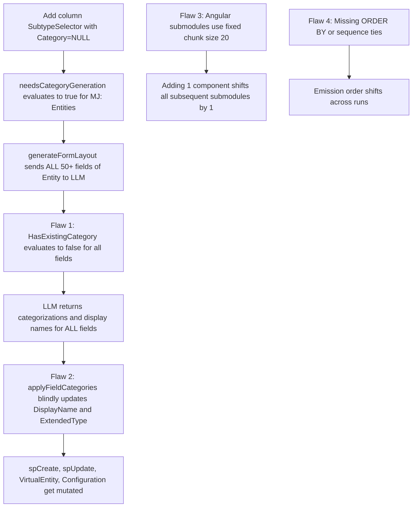

# CodeGen Idempotency, Field Change Tracking, and Drift Prevention

**Status:** Proposed — Ready for Remote Agent Review  
**Branch:** `an-dev-sync-composition-axes` (or dedicated PR branch `an-dev-codegen-idempotency`)  
**Owner:** CodeGen (`@memberjunction/codegen-lib`, `@memberjunction/cli`)  
**Target:** Clean DB builds, PR CodeGen runs, and developer workstations  

---

## 1. Executive Summary

### 1.1 The Objective
Make MemberJunction CodeGen **100% idempotent relative to a given database state**.

Running `mj codegen` twice in succession against the exact same database without schema modifications must result in `git status --porcelain` returning **zero modified files**.

Furthermore, when an incremental schema change is made (e.g., adding a single column `SubtypeSelector` to entity `MJ: Entities`):
- Only the artifacts directly associated with that modified entity must change.
- **Zero changes** must occur to untouched sibling columns (e.g., `spCreate`, `spUpdate`, `VirtualEntity` must not have their `DisplayName` or `ExtendedType` altered).
- **Zero changes** must occur to unrelated entities (no spurious recategorization or panel movement).
- **Zero cascading diffs** across Angular form submodules.

### 1.2 Core Principles
1. **Established Metadata is Immutable to Incremental AI Runs**: Once a field has a valid `DisplayName`, `Category`, or `ExtendedType` in the database metadata, an incremental AI prompt run for a sibling column must never overwrite or mutate it.
2. **Minimal Blast Radius**: An entity-level change must only touch that entity's files. A field-level change must only touch that field's definitions and forms.
3. **Deterministic Emission**: All emitted collections (classes, interfaces, validators, form fields, submodules, GraphQL types) must be deterministically sorted on multiple stable keys (`Sequence ASC, Name ASC, ID ASC`), never relying on SQL Server default return order or in-memory `Set`/`Map` iteration order.

---

## 2. Root Cause Analysis: The 5 Failure Modes

During recent CodeGen runs (specifically adding `Entity.SubtypeSelector` in PR #4296), dozens of files across `@memberjunction/ng-core-entity-forms` and `@memberjunction/core-entities` were unexpectedly modified or reordered despite having zero logical connection to `SubtypeSelector`. Analysis revealed five distinct architectural failure modes:



### Failure Mode 1: Blind Metadata Overwrites in `applyFieldCategories`
**Location:** [`packages/CodeGenLib/src/Database/manage-metadata.ts:7909–7929`](file:///Users/amith/Dropbox/develop/M5/MJ/packages/CodeGenLib/src/Database/manage-metadata.ts#L7909-L7929)

```typescript
if (fieldCategory.displayName && field.AutoUpdateDisplayName && field.DisplayName !== fieldCategory.displayName) {
    setClauses.push(`DisplayName = '${fieldCategory.displayName.replace(/'/g, "''")}'`);
}

if (field.AutoUpdateExtendedType && fieldCategory.extendedType !== undefined && field.ExtendedType !== fieldCategory.extendedType) {
    // Overwrites ExtendedType...
}
```

**Why it broke:**
CodeGen loops over all fields returned by the LLM. It only checks:
1. Did the LLM return a `displayName`?
2. Is `field.AutoUpdateDisplayName` true? (True for almost all fields by default)
3. Does `field.DisplayName !== fieldCategory.displayName`?

It **never checks whether the column was actually new or modified in this CodeGen run!**

Because the LLM had slight stylistic variations compared to the baseline metadata:
- `"Create Stored Procedure"` $\rightarrow$ `"Stored Procedure Create"`
- `"Update Stored Procedure"` $\rightarrow$ `"Stored Procedure Update"`
- `"Virtual Entity"` $\rightarrow$ `"Is Virtual Entity"`
- `Configuration` had its `ExtendedType` changed from `"Code"` (with `CodeType="JSON"`) to `"textarea"`.

CodeGen blindly emitted `UPDATE [EntityField] SET DisplayName = ...` for fields that were not touched in DDL.

### Failure Mode 2: Flawed Field Locking in Prompt Generation
**Location:** [`packages/CodeGenLib/src/Misc/advanced_generation.ts:513–515`](file:///Users/amith/Dropbox/develop/M5/MJ/packages/CodeGenLib/src/Misc/advanced_generation.ts#L513-L515)

```typescript
// HasExistingCategory=true means locked (don't update), false means can update
HasExistingCategory: !f.AutoUpdateCategory && f.Category != null,
IsNewField: f.AutoUpdateCategory === true && !f.Category,
```

**Why it broke:**
In MemberJunction, almost all fields have `AutoUpdateCategory = 1` by default. As a result:
`!f.AutoUpdateCategory` evaluates to `false`.
Therefore, `HasExistingCategory` evaluates to `false` for **every existing field on the entity**!

In the prompt template (`CodeGen: Form Layout Generation`), this rendered:
```markdown
- 🔄 spCreate - Currently in "Stored Procedures", NEEDS categorization (can be reassigned)
- 🔄 spUpdate - Currently in "Stored Procedures", NEEDS categorization (can be reassigned)
... (50+ fields)
```
Instead of treating existing fields as locked anchor context (`🔒`), CodeGen told the LLM that all 50+ fields needed recategorization. The LLM took the invitation and re-categorized / re-named the entire entity.

### Failure Mode 3: Missing Field-Level Change Tracking in `ManageMetadataBase`
**Location:** [`packages/CodeGenLib/src/Database/manage-metadata.ts:513–519`](file:///Users/amith/Dropbox/develop/M5/MJ/packages/CodeGenLib/src/Database/manage-metadata.ts#L513-L519)

CodeGen tracks changes at the **entity** level:
- `ManageMetadataBase._newEntityList: string[]`
- `ManageMetadataBase._modifiedEntityList: string[]`

However, CodeGen has **zero field-level change tracking**:
- When `createPendingEntityFields` runs, it knows exactly which fields were inserted into `EntityField`, but only records `entity.Name` in `_modifiedEntityList`.
- When `spUpdateExistingEntityFieldsFromSchema` runs, it returns `@FilteredRows` containing the exact fields whose SQL column definitions changed, but CodeGen only adds `entity.Name` to `_modifiedEntityList`.

Once an entity is flagged as modified, CodeGen treats **all fields** of that entity identically, allowing the LLM to mutate any field on that entity.

### Failure Mode 4: Cascading Churn in Fixed-Chunk Angular Submodules
**Location:** [`packages/CodeGenLib/src/Angular/angular-codegen.ts:334–375`](file:///Users/amith/Dropbox/develop/M5/MJ/packages/CodeGenLib/src/Angular/angular-codegen.ts#L334-L375)

Angular form components are grouped into submodules (`GeneratedForms_SubModule_0`, `_1`, etc.) based on a fixed chunk size (`maxComponentsPerModule: 20`):
```typescript
if ((currentComponentCount === maxComponentsPerModule - 1) || (i === combinedArray.length - 1)) {
    // Close submodule and start next
}
```
**Why it broke:**
If a single component is added, removed, or shifts position alphabetically, **every subsequent submodule shifts by 1 item**:
- SubModule 7 loses its last item to SubModule 8.
- SubModule 8 loses its last item to SubModule 9.
- ... through SubModule 19.

This produces a 500-line diff in `generated-forms.module.ts` for a 1-component change.

### Failure Mode 5: HTML Form Panel Re-grouping
**Location:** `packages/Angular/Explorer/core-entity-forms/src/lib/generated/Entities/*/*.form.component.html`

When an unassigned or miscategorized field gets assigned to a category (or moved to a new category such as `"Details"`), the HTML generator moves the field's `<mj-form-field>` markup into that category's `<mj-collapsible-panel>`. When fields like `ParentIDDepth`, `ParentIDPath`, `ParentIDChildCount` had no category in the database, an AI pass assigned them to `"Details"`, shifting hundreds of lines in form HTML.

---

## 3. Detailed Architectural Plan

### Component 1: Field Change Tracking in `ManageMetadataBase`

Extend `ManageMetadataBase` with explicit, queryable tracking of newly added and modified fields during the CodeGen lifecycle.

```typescript
export abstract class ManageMetadataBase {
    // Existing entity-level tracking:
    private static _newEntityList: string[] = [];
    private static _modifiedEntityList: string[] = [];

    // NEW: Field-level tracking:
    // Stored as normalized composite keys: `${entityID.toLowerCase()}:${fieldName.toLowerCase()}`
    private static _newFieldSet: Set<string> = new Set<string>();
    private static _modifiedFieldSet: Set<string> = new Set<string>();

    public static registerNewField(entityID: string, fieldName: string): void {
        this._newFieldSet.add(`${entityID.trim().toLowerCase()}:${fieldName.trim().toLowerCase()}`);
    }

    public static registerModifiedField(entityID: string, fieldName: string): void {
        this._modifiedFieldSet.add(`${entityID.trim().toLowerCase()}:${fieldName.trim().toLowerCase()}`);
    }

    public static isFieldNew(entityID: string, fieldName: string): boolean {
        return this._newFieldSet.has(`${entityID.trim().toLowerCase()}:${fieldName.trim().toLowerCase()}`);
    }

    public static isFieldModified(entityID: string, fieldName: string): boolean {
        return this._modifiedFieldSet.has(`${entityID.trim().toLowerCase()}:${fieldName.trim().toLowerCase()}`);
    }

    public static isFieldNewOrModified(entityID: string, fieldName: string): boolean {
        return this.isFieldNew(entityID, fieldName) || this.isFieldModified(entityID, fieldName);
    }

    public static clearFieldTracking(): void {
        this._newFieldSet.clear();
        this._modifiedFieldSet.clear();
    }
}
```

#### Population Points:
1. **In `createPendingEntityFields`** ([`manage-metadata.ts:5025–5060`](file:///Users/amith/Dropbox/develop/M5/MJ/packages/CodeGenLib/src/Database/manage-metadata.ts#L5025-L5060)):
   When iterating over `newEntityFields`:
   ```typescript
   ManageMetadataBase.registerNewField(n.EntityID, n.FieldName);
   ```
2. **In `updateExistingEntityFieldsFromSchema`** ([`manage-metadata.ts:5136–5141`](file:///Users/amith/Dropbox/develop/M5/MJ/packages/CodeGenLib/src/Database/manage-metadata.ts#L5136-L5141)):
   When processing `@FilteredRows` returned by `spUpdateExistingEntityFieldsFromSchema`:
   ```typescript
   if (result && result.length > 0) {
       for (const row of result) {
           ManageMetadataBase.registerModifiedField(row.EntityID, row.EntityFieldName);
       }
   }
   ```

---

### Component 2: Mutation Guardrails in `applyFieldCategories`

Update `applyFieldCategories` in [`manage-metadata.ts:7875–7940`](file:///Users/amith/Dropbox/develop/M5/MJ/packages/CodeGenLib/src/Database/manage-metadata.ts#L7875-L7940) to enforce strict immutability for untouched existing fields.

```typescript
protected async applyFieldCategories(
   pool: CodeGenConnection,
   entity: EntityInfo,
   fields: Array<{ ID: string; Name: string; Category: string | null; AutoUpdateCategory: boolean; AutoUpdateDisplayName: boolean; AutoUpdateExtendedType: boolean; GeneratedFormSection: string; DisplayName: string; ExtendedType: string; CodeType: string }>,
   fieldCategories: FieldCategoryResult[],
   existingCategories: Set<string>,
   isNewEntity: boolean = false
): Promise<void> {
   const sqlStatements: string[] = [];

   for (const fieldCategory of fieldCategories) {
      const field = fields.find(f => f.Name === fieldCategory.fieldName);
      if (!field || !field.ID) continue;

      const isNewField = ManageMetadataBase.isFieldNew(entity.ID, field.Name);
      const isModifiedField = ManageMetadataBase.isFieldModified(entity.ID, field.Name);
      const fieldHasExistingCategory = field.Category != null && field.Category.trim() !== '';

      // 1. CATEGORY ASSIGNMENT GUARD
      let category = fieldCategory.category;
      if (field.Name.startsWith('__mj_')) {
         category = 'System Metadata';
      }

      // If this is an existing field that already has a valid category, and it's NOT a newly added/modified field,
      // it is LOCKED. Never recategorize existing fields during incremental runs.
      if (!isNewEntity && !isNewField && fieldHasExistingCategory) {
         category = field.Category!;
      } else if (fieldHasExistingCategory && !existingCategories.has(category)) {
         // Existing safety check: prevent moving from existing category to a brand new category
         category = field.Category!;
      }

      const setClauses: string[] = [];

      if (field.AutoUpdateCategory && field.Category !== category) {
         setClauses.push(`Category = '${category.replace(/'/g, "''")}'`);
      }

      if (field.GeneratedFormSection !== 'Category') {
         setClauses.push(`GeneratedFormSection = 'Category'`);
      }

      // 2. DISPLAY NAME GUARD
      // ONLY allow updating DisplayName if:
      // - It is a brand new entity (isNewEntity = true), OR
      // - The field was newly created in this run (isNewField), OR
      // - The field's schema definition was modified in this run (isModifiedField), OR
      // - The current DisplayName is empty/null/missing
      const hasMeaningfulDisplayName = field.DisplayName && field.DisplayName.trim().length > 0;
      const canUpdateDisplayName = isNewEntity || isNewField || isModifiedField || !hasMeaningfulDisplayName;

      if (canUpdateDisplayName && fieldCategory.displayName && field.AutoUpdateDisplayName && field.DisplayName !== fieldCategory.displayName) {
         setClauses.push(`DisplayName = '${fieldCategory.displayName.replace(/'/g, "''")}'`);
      }

      // 3. EXTENDED TYPE GUARD
      // Same rule: do not let LLM overwrite ExtendedType (e.g. JSON/Code -> textarea) on untouched existing fields
      const canUpdateExtendedType = isNewEntity || isNewField || isModifiedField || !field.ExtendedType;

      if (canUpdateExtendedType && field.AutoUpdateExtendedType && fieldCategory.extendedType !== undefined && field.ExtendedType !== fieldCategory.extendedType) {
         const valid = fieldCategory.extendedType == null
            ? null
            : this.validateExtendedType(String(fieldCategory.extendedType));
         if (fieldCategory.extendedType == null || valid) {
            const extendedType = valid == null ? 'NULL' : `'${valid.replace(/'/g, "''")}'`;
            setClauses.push(`ExtendedType = ${extendedType}`);
         }
      }

      // 4. CODE TYPE GUARD
      if (canUpdateExtendedType && fieldCategory.codeType !== undefined) {
         const sanitized = this.sanitizeCodeType(fieldCategory.codeType, field.Name, entity.Name);
         if (field.CodeType !== sanitized) {
            const codeType = sanitized == null ? 'NULL' : `'${sanitized.replace(/'/g, "''")}'`;
            setClauses.push(`CodeType = ${codeType}`);
         }
      }

      if (setClauses.length > 0) {
         sqlStatements.push(`\n-- UPDATE Entity Field Category Info ${entity.Name}.${field.Name} \nUPDATE ${this.qs(mj_core_schema(), 'EntityField')}
SET 
   ${setClauses.join(',\n   ')}
WHERE 
   ID = '${field.ID}' AND AutoUpdateCategory = ${this.boolLit(true)}`);
      }
   }

   // execute batched SQL...
}
```

---

### Component 3: Prompt Lockdown & Skip in `advanced_generation.ts`

**Location:** [`packages/CodeGenLib/src/Misc/advanced_generation.ts:503–520`](file:///Users/amith/Dropbox/develop/M5/MJ/packages/CodeGenLib/src/Misc/advanced_generation.ts#L503-L520)

#### 1. Fix `HasExistingCategory` computation:
```typescript
const mappedFields = entity.Fields.map((f: any) => {
    const isNewOrModified = ManageMetadataBase.isFieldNewOrModified(entity.ID, f.Name);
    const hasCategory = f.Category != null && f.Category.trim().length > 0;
    
    // A field is locked if it already has a category and is not a new/modified field in this run.
    // AutoUpdateCategory=false also locks the field unconditionally.
    const isLocked = !isNewEntity && hasCategory && (!f.AutoUpdateCategory || !isNewOrModified);

    return {
        Name: f.Name,
        Type: f.Type,
        IsNullable: f.AllowsNull,
        IsPrimaryKey: f.IsPrimaryKey,
        IsForeignKey: f.EntityIDFieldName != null,
        RelatedEntity: f.RelatedEntity,
        Description: f.Description,
        ExistingCategory: f.Category || null,
        HasExistingCategory: isLocked,
        IsNewField: !hasCategory || isNewOrModified,
        InheritedFromEntityName: f.InheritedFromEntityName || null,
        InheritedFromEntityID: f.InheritedFromEntityID || null
    };
});
```

#### 2. Short-Circuit When No Work is Needed:
In [`manage-metadata.ts:7018`](file:///Users/amith/Dropbox/develop/M5/MJ/packages/CodeGenLib/src/Database/manage-metadata.ts#L7018):
```typescript
// Only run form layout generation if:
// 1. It's a new entity, OR
// 2. There are fields that genuinely lack a category, OR
// 3. There are new/modified fields that need categorization
const hasUncategorizedFields = fields.some((f: any) => f.AutoUpdateCategory && (!f.Category || f.Category.trim() === ''));
const hasNewFields = fields.some((f: any) => ManageMetadataBase.isFieldNew(entity.ID, f.Name));
const needsCategoryGeneration = isNewEntity || hasUncategorizedFields || hasNewFields;

if (needsCategoryGeneration) {
    // Call LLM
}
```
If an existing entity has all fields categorized and no new columns were added, **zero LLM tokens are spent and zero updates occur**.

---

### Component 4: Submodule Partitioning & Alphabetical Stability in `angular-codegen.ts`

**Location:** [`packages/CodeGenLib/src/Angular/angular-codegen.ts`](file:///Users/amith/Dropbox/develop/M5/MJ/packages/CodeGenLib/src/Angular/angular-codegen.ts)

#### 1. Deterministic Entity Sorting Before Generation
Ensure the `entities` array is sorted deterministically before iterating:
```typescript
entities.sort((a, b) => a.ClassName.localeCompare(b.ClassName));
```

#### 2. Submodule Partitioning Strategy
Currently, `generateAngularModuleCode` chunks into groups of 20 purely based on index. When an entity is inserted into the middle of the alphabet, every subsequent module shifts.

**Solution options to evaluate:**
- **Option A: Schema-based submodules (Recommended)**:
  Instead of slicing purely by count across the entire universe of entities:
  - `GeneratedForms_Core_SubModule_0`, `_1` (for `__mj` schema)
  - `GeneratedForms_App_SubModule_0`, `_1` (for app schemas)
  Adding a core entity only shifts core submodules; app submodules remain 100% clean.
- **Option B: Alphabetical range bucketing (e.g. A–C, D–F, etc.)**:
  Fixed boundaries so that adding an entity in 'S' cannot affect modules for 'A'–'R'.
- **Option C: Stable submodule packing with hysteresis/slack**:
  Allow submodules to hold between 15 and 25 components. New components are added to the existing module that contains their alphabetical neighbors until the module hits the hard limit (25), preventing ripple effects into subsequent modules.

---

### Component 5: Deterministic Ordering Across All Generators

Audit all generators for non-deterministic ordering:

| Generator | File | Action Required |
|---|---|---|
| **Entity Schemas** | `entities-codegen.ts` | Ensure entity fields are sorted by `Sequence ASC, Name ASC`. Ensure enum values in CHECK constraint unions are sorted alphabetically. |
| **Validators** | `entities-codegen.ts` | Sort validation method calls and declarations alphabetically by field name. |
| **GraphQL Schemas** | `graphql-codegen.ts` | Sort object fields and query/mutation arguments deterministically. |
| **Server Operations** | `server-codegen.ts` | Sort operation classes and types alphabetically by `OperationKey`. |
| **Base Views / SQL** | `manage-metadata.ts` | Ensure columns in generated `spCreate`, `spUpdate`, and `vw*` match physical view column order deterministically. |

---

## 4. Verification & Testing Plan

### 4.1 Automated Idempotency Test (`test:codegen-idempotency`)
Create an automated test script (`packages/CodeGenLib/test/idempotency.test.ts` or standalone script `scripts/verify-codegen-idempotency.sh`):

1. **Step 1: Baseline Run**
   Run `mj codegen` on a clean, migrated database.
2. **Step 2: Clean Check**
   Stage or commit any legitimate baseline changes so `git status --porcelain` is empty.
3. **Step 3: Repeat Run**
   Run `mj codegen` a second time against the exact same database.
4. **Step 4: Assertion**
   Execute `git status --porcelain`.
   **Assert:** Output must be completely empty (0 modified files, 0 untracked files).

### 4.2 Single-Column Delta Test
1. Execute DDL: `ALTER TABLE __mj.Entity ADD TestIdempotencyColumn NVARCHAR(100) NULL`.
2. Run `mj codegen`.
3. Verify git diff:
   - `packages/MJCoreEntities/src/generated/entities/__mj.ts` must ONLY add `TestIdempotencyColumn`.
   - `packages/Angular/Explorer/core-entity-forms/src/lib/generated/Entities/MJEntity/mjentity.form.component.html` must ONLY add `<mj-form-field FieldName="TestIdempotencyColumn">`.
   - Zero changes to `DisplayName` on `spCreate`, `spUpdate`, `VirtualEntity`.
   - Zero changes to `Configuration` field type.
   - Zero changes to any other entity in the system.

### 4.3 Unit Tests
Run standard suite:
```bash
cd packages/CodeGenLib && npm test
cd ../MJCoreEntities && npm test
cd ../MJServer && npm test
cd ../Angular/Explorer/core-entity-forms && npm test
npm run check:codegen-tail
```

---

## 5. Review Topics for Remote Agent

We invite the remote agent to review and comment directly on the following design choices:

1. **Submodule Partitioning Approach (§Component 4)**:
   - Do you prefer Schema-based submodules (`GeneratedForms_Core_SubModule_0`, etc.), Alphabetical bucketing, or Submodule packing with slack (15–25 items)?
2. **Scope of Field Modification Tracking (§Component 1)**:
   - Currently, `_modifiedFieldSet` tracks columns where physical SQL data type/length/precision/nullability changed. Should we also track when an extended property description changed in SQL?
3. **Behavior when `AutoUpdateDisplayName = 1` and DB has machine-generated name**:
   - When a field is created, its initial `DisplayName` is derived via `createDisplayName(colName)` (e.g. `SubtypeSelector` $\rightarrow$ `"Subtype Selector"`). If the LLM produces a more human-friendly name (e.g. `"Subtype Selector"` vs `"Subtype Selection"`), should we allow the LLM to polish it on the *first* run, but lock it forever once populated?
4. **Integration with `scoped-entity-regeneration-plan.md`**:
   - How should this field-level tracking coordinate with the broader entity-scoping work outlined in `plans/codegen/scoped-entity-regeneration-plan.md`?
