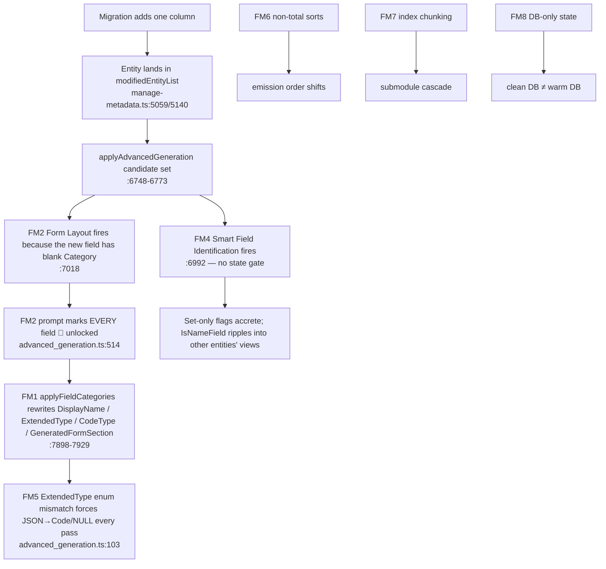

# CodeGen Idempotency, Field Change Tracking, and Drift Prevention

**Status:** rev 2 — verified against source, finalized for build
**Branch:** `an-dev-sync-composition-axes` (PR #4296)
**Owner:** CodeGen (`@memberjunction/codegen-lib`, `@memberjunction/core` sort helpers, `@memberjunction/cli`)
**Target:** warm developer databases, clean-room CI databases, and every Open App that runs `mj codegen`

> **Rev 2 supersedes rev 1 in full.** Every file:line below was re-verified against
> `an-dev-sync-composition-axes` at `b7912d12` by an adversarial read of the source. Where rev 1
> was wrong (function names, line ranges, mechanisms, example values) this document says so
> inline rather than silently correcting, so the builder does not go looking for code that does
> not exist. Appendix A is the claim-by-claim verification record.

---

## 0. How to use this document (builder quick-start)

1. Read §1 (definitions) and §3 (principles) once. Everything else follows from them.
2. Build in the order of §5. Each phase ends in a **checkpoint** that is a runnable command
   whose output must be empty/green before the next phase starts. Do not reorder phases —
   Phase 1 (pure determinism) must be green before Phase 2 (LLM guardrails), or you cannot tell
   which fix produced which effect.
3. Every component in §4 lists the tests it must pass (§6). Write the test first when the
   component is a pure function; write it alongside otherwise. **No component is done until its
   tests exist and pass.**
4. §7 is the integration tier. It is not optional and it is not "later" — it is the only thing
   that proves the goal, because unit tests cannot see the seam between SQL Server, the metadata
   tables, the LLM apply path, and the file writers.
5. §8 records the decisions already made (including the four questions rev 1 asked). Do not
   re-litigate them in the PR; if one turns out to be wrong in practice, write it up in §9 and
   flag it in the PR description.

### 0.1 What changed from rev 1 (for the reviewer)

- **Three failure modes rev 1 did not have**: Smart Field Identification (FM4 — set-only flag
  accretion, `IsNameField` ripple into other entities' views), the `ExtendedType` enum mismatch
  (FM5 — the actual cause of `Configuration` flipping; rev 1's `textarea`/`CodeType='JSON'`
  story was impossible), and DB-only state (FM8 — the reason a clean DB diverges from a warm one).
- **The tracking design is narrower on purpose**: only *new* fields are tracked (three INSERT
  sites, not one); "modified" cannot be derived from `@FilteredRows` because Sequence parking
  makes it entity-granular exactly when a column is added (D2).
- **The lock model is simpler**: *fill, never rewrite*; `AutoUpdate*` is a veto on filling; the
  lock is enforced in the apply path, not the prompt (§3). Rev 1's Component 2 code kept an
  `AutoUpdateCategory` term in the WHERE while removing the JS gate — half of each is worse than
  today (C8 in Appendix A).
- **Ordering** is pinned to specific sites, including two in MJCore (`providerBase.ts:4649`,
  `:4620`) and the locale-dependence of `localeCompare`; `remote_operations.ts` was a hand-edit,
  not churn.
- **Submodules**: hash buckets, plus the discovery that the `AngularCoreEntities`
  `maxComponentsPerModule=100` option is never read.
- **A backfill migration** (C7) is required for reproducibility, not just code fixes.
- **Tests**: 13 unit-test files specified case-by-case (§6) and a three-stage integration
  harness that becomes a PR gate (§7).

Commands assume the repo root. `pnpm` is the package manager. The workbench SQL Server
(`docker/workbench/docker-compose.yml`, service `sql-claude`, host port **1444**) is the
sanctioned throwaway database for the integration checks — never run them against a shared DB
(CLAUDE.md: *one database per agent*).

---

## 1. Goal and definitions

### 1.1 The objective

Make `mj codegen` **100% idempotent relative to a given database state**, and make its output
**reproducible** across databases at the same shipped state.

Three properties, each with a mechanical test (§7):

| Property | Statement | Test |
|---|---|---|
| **P1 Run-idempotency** | Running `mj codegen` twice against the same database, with no schema change in between, produces **zero** modified files on the second run **and** an empty CodeGen SQL capture (no `CodeGen_Run_*.sql` survives — `SQLLogging.finishSQLLogging` already deletes an empty file). | §7.2 stage `warm-twice` |
| **P2 Reproducibility** | Two databases at the same **migration frontier and the same `mj sync push` state** produce byte-identical generated files. | §7.2 stage `clean-room` (the existing `codegen-drift` CI job, promoted) |
| **P3 Minimal blast radius** | Adding one column to one table changes only that entity's artifacts, and inside them only that column's rows/lines. No sibling field's `DisplayName`, `Category`, `ExtendedType`, `CodeType`, `GeneratedFormSection`, `DefaultInView`, `IncludeInUserSearchAPI`, `UserSearchPredicateAPI`, `IsNameField` changes. No other entity changes. No Angular submodule other than the one that owns the entity changes. | §7.2 stage `single-column` |

### 1.2 What remains non-deterministic *by design* (and how it is contained)

The LLM is still consulted **once** for genuinely new metadata: a new entity, or a new field on an
existing entity. Its answer for that new field (Category, DisplayName polish, ExtendedType,
CodeType, DefaultInView, IncludeInUserSearchAPI, UserSearchPredicateAPI) is:

1. written to the metadata tables **once**, on the run that created the field;
2. **captured** into the run's `CodeGen_Run_*.sql` (all LLM apply paths already go through
   `LogSQLAndExecute` / `LogSQLBatchAndExecute` with `isRecurringScript=false`, so
   `SQLLogging.appendToSQLLogFile` records them — `manage-metadata.ts:7146`, `:7946`,
   `:7977`, `:8005`, `:8017`, `:8041`, `:8053`, `:8080`);
3. shipped in the PR's migration tail, so every other database replays the same decision.

Two developers adding the *same* new column on separate databases can therefore get different
LLM answers — that resolves as an ordinary merge conflict on the migration tail, once. It never
recurs, and it never touches any field that already had a value. That is the whole contract.

Everything else — ordering, chunking, IDs that are captured, values that already exist — is
deterministic with no LLM in the loop.

### 1.3 Terms used below

- **Candidate entity**: an entity in `ManageMetadataBase.newEntityList ∪ modifiedEntityList`
  (or every non-virtual entity when `forceRegeneration.enabled`). Only candidates reach the
  advanced-generation (LLM) pass — `manage-metadata.ts:6748-6773`, early return at `:6768`.
- **New field**: an `EntityField` row inserted by *this* CodeGen run (see C1).
- **Blank**: `NULL` or whitespace-only. `Category`, `DisplayName` and `ExtendedType` have
  different "blank" semantics — §3.2 spells them out; do not generalize.
- **Locked**: a value CodeGen will not write. Locked is a *derived* state (§3.2), never a
  stored flag; the `AutoUpdate*` flags are the human's veto on top of it.

---

## 2. Root cause analysis — eight failure modes

The PR #4296 CodeGen runs (adding `Entity.SubtypeSelector`) moved fields between form panels,
renamed `DisplayName`s on untouched columns, and flipped `MJ: Entities.Configuration` between a
code editor and a plain text area. Rev 1 named five failure modes. Verification found three more
and corrected two of the original mechanisms. All eight are below; each names the exact code and
the test in §6 that pins it.



### FM1 — `applyFieldCategories` rewrites metadata on fields that did not change

**Where:** `packages/CodeGenLib/src/Database/manage-metadata.ts:7862-7949` (rev 1 cited
7875-7940). Outer gate `:7881` `if (field && field.AutoUpdateCategory && field.ID)`; SET clauses
at `:7898` (Category), `:7906` (GeneratedFormSection), `:7909` (DisplayName), `:7913`
(ExtendedType), `:7923` (CodeType); single UPDATE at `:7931-7937` whose WHERE repeats
`AND AutoUpdateCategory = 1`.

**Mechanism (verified):**

- Each SET clause compares the LLM value to the current value and writes on any difference.
  Nothing asks whether the field was created or changed in this run.
- The only category-stability rule (`:7889-7894`) rejects moving an existing field to a **new**
  category. A move between two **existing** categories (`:7897-7899`) is accepted. So the
  prompt's 🔒 marker is the *only* thing protecting an existing field's category, and (FM2) that
  marker is never rendered.
- `GeneratedFormSection = 'Category'` (`:7906-7908`) is pushed for every field the LLM returns
  whose section is not already `Category`, **even when Category itself did not change**, with no
  `AutoUpdate*` flag of any kind. A hand-set `Top`/`Details` section is reset each time the
  entity is a candidate, and `angular-codegen.ts:606-610` branches on that value, so the field
  moves in the generated form.
- **CodeType has no flag gate at all** (`:7923` `if (fieldCategory.codeType !== undefined)`).
  There is no `AutoUpdateCodeType` column anywhere (`grep` over generated entities, CodeGenLib
  and migrations: zero hits). Its only protection is the outer `AutoUpdateCategory` gate.
- The WHERE-clause `AND AutoUpdateCategory = 1` is redundant with the JS gate at `:7881` — it
  is not the operative gate, which matters because rev 1's proposed rewrite dropped the JS gate
  but kept the WHERE, producing UPDATEs that log to the migration capture and affect zero rows.
- Two callers: `applyFormLayout` (`:7734`, regular entities — receives `isNewEntity` at `:7726`
  and does **not** forward it) and `applyVEFieldCategories` (`:3254`, virtual entities). Any
  signature change must update both.
- A third writer bypasses this function entirely on virtual entities:
  `applyLLMFieldDescriptions` (`:3404-3414`) writes `ExtendedType` gated only on
  `AutoUpdateExtendedType` and "field has no Description", keyed by `EntityID + Name`.

**Rev 1 example values were impossible.** `"textarea"` is not in `EntityFieldExtendedTypes`
(`packages/MJCore/src/generic/entityInfo.ts:33-39`) nor in `EXTENDED_TYPE_ALIASES`
(`manage-metadata.ts:3429-3458`), so `validateExtendedType` returns null and `:7917` skips the
write; `CodeType='JSON'` violates `CK_EntityField_CodeType` (CSS/HTML/JavaScript/Other/SQL/
TypeScript). What actually happened to `Configuration` is FM5: it was `ExtendedType='JSON'`, a
value the LLM is not allowed to say, so every pass rewrote it to `Code` or `NULL`.

**Pinned by:** §6 T2 (`apply-field-categories-lock.test.ts`).

### FM2 — the prompt's lock marker can never render, and the apply path never checks it

**Where:** `packages/CodeGenLib/src/Misc/advanced_generation.ts:511-515`; template
`metadata/prompts/templates/codegen/form-layout-generation.template.md:93-101`; gate
`manage-metadata.ts:7018`.

```ts
// advanced_generation.ts:514-515 (verbatim)
HasExistingCategory: !f.AutoUpdateCategory && f.Category != null,
IsNewField: f.AutoUpdateCategory === true && !f.Category,
```

**Mechanism (verified):**

- `AutoUpdateCategory` is `BIT NOT NULL DEFAULT 1`
  (`migrations/v2/V202511060837__v2.116.x__CodeGen_Advanced_Generation_Metadata.sql:13`;
  fresh-DB DF at `migrations/v5/B202605291452__v5.38.x__Baseline.sql:7587`). **Every**
  `AutoUpdate*` column in the schema defaults to 1; CodeGen never writes any of them (the three
  raw `INSERT INTO EntityField` paths at `:2986`, `:3604`, `:4891` omit them), so they are pure
  input state.
- With the flag at 1, `!f.AutoUpdateCategory` short-circuits to `false` and the template renders
  every field as `🔄 … NEEDS categorization (can be reassigned)`. The template and the code
  *agree*: rule 8 says the only lock is `AutoUpdateCategory=false`. The lock semantic itself is
  wrong for idempotency, not the implementation of it.
- `IsNewField` is computed and **never read** by the template (grep: zero matches). Dead flag.
- The code passes `existingFieldCategoryInfo` (`:542`) but the template reads
  `existingCategoryInfo[category].icon` (template line 72). Nunjucks resolves the undefined
  lookup silently, so existing category icons never reach the prompt.
- The gate at `:7018` fires the prompt for the whole entity when **one** `AutoUpdateCategory=1`
  field is blank, and sends **all** fields (`:7025-7030`). It is then the apply path (FM1), not
  the prompt, that decides what gets written — and it checks nothing.
- **Re-trigger loop:** a field the LLM omits from `fieldCategories`, or returns with a name that
  fails the case-sensitive `fields.find(f => f.Name === fieldCategory.fieldName)` at `:7879`,
  stays blank, so the entity re-fires the whole prompt on every run in which it is a candidate.

**Pinned by:** §6 T3, T4.

### FM3 — no field-level change tracking, and `@FilteredRows` cannot supply it

**Where:** `manage-metadata.ts:507` (`_newEntityList`), `:514` (`_modifiedEntityList`), `:520`
(`_deletedEntitySchemaList`), writers `:5059`, `:5100`, `:5140`, `:5285`, `:5977`.

**Corrections to rev 1:**

- The function is **`createNewEntityFieldsFromSchema`** (`:4999`, loop `:5027-5038`, INSERT
  builder `getPendingEntityFieldINSERTSQL` `:4841`). `createPendingEntityFields` does not exist.
- It is **not** the only place new `EntityField` rows are inserted. `manageSingleVirtualEntityField`
  (`:2928`, INSERT `:2986`, virtual and external entities) and `manageSingleEntityParentFields`
  (`:3530`, INSERT `:3604`, IS-A parent mirrors) also insert, and neither touches any tracking
  list. A hook placed only in `createNewEntityFieldsFromSchema` misses both.
- `@FilteredRows` from `spUpdateExistingEntityFieldsFromSchema` is **not** "the exact fields whose
  SQL definitions changed". Its predicate
  (`migrations/v6/V202608260829__v6.1.x__Heal_SPs_IncludedSchemaNames.sql:242-262`) includes
  `ef.Sequence <> fromSQL.Sequence` (`:251`). `createNewEntityFieldsFromSchema` parks every
  existing field of an entity that gained a column at `Sequence + 100000`
  (`parkEntityFieldSequencesSQL` `:4979-4990`, invoked `:5031`) immediately before the proc runs
  (`manageEntityFields` `:4158 → :4180`). So for any entity with ≥1 new column, `@FilteredRows`
  returns **every** field of that entity, and rev 1's "register every `@FilteredRows` row as
  modified" degrades straight back to entity granularity in exactly the case that matters.
- The lists are keyed on entity **Name**, deduped case-sensitively (`:5115`); the new field set
  must be keyed on `EntityID` (available at all three INSERT sites: `n.EntityID`, `entity.ID`,
  `childEntity.ID`).

**Decision (D2):** track **new** fields only. A "modified" field (type/length/nullability change)
does **not** unlock LLM-authored metadata — see §8. The `@FilteredRows` change-reason problem is
therefore out of scope for this PR; it is noted in §9 for the scoped-regeneration work.

**Pinned by:** §6 T1.

### FM4 — Smart Field Identification has no state gate and accretes flags monotonically

**Where:** gate `manage-metadata.ts:6992-6996`; `identifyFields`
`advanced_generation.ts:284-340`; appliers `:7288-7326` (IsNameField), `:7466-7490`
(DefaultInView), `:7503-7534` (IncludeInUserSearchAPI), `:7571-7598` (UserSearchPredicateAPI),
`:7611-7654` (entity AllowUserSearchAPI), `:7675-7712` (FullTextSearch, off by default via
`allowFullTextSearchAutoUpdate: false`, `config.ts:231`).

**Mechanism (verified). Rev 1 did not mention this path at all.**

- The gate is `fields.some(f => f.AutoUpdateIsNameField || f.AutoUpdateDefaultInView || …)` —
  every one of those flags defaults to 1, so for every **candidate** entity the LLM is called
  with **all** fields, on every run in which the entity is a candidate. (It is *not* "every
  entity every run": the candidate set at `:6748-6773` is empty on a no-change re-run. It bites
  on the run that introduces a change, and under `forceRegeneration`.)
- `DefaultInView` (`:7477-7488`), `IncludeInUserSearchAPI` (`:7523-7531`) and field-level
  `FullTextSearchEnabled` (`:7700-7708`) are **set-only**: they write `1` when the LLM lists the
  field and never clear. `UserSearchPredicateAPI` (`:7595`) and entity `AllowUserSearchAPI`
  (`:7647`) flip **both ways** whenever the LLM's answer differs. Each candidate run can add flags
  that no later run removes, so two databases at the same frontier diverge simply by having had
  different answers the last time the entity was a candidate.
- Only `IsNameField` has a stability rule (`selectNameFieldWinner` `:7336-7362`: an existing
  single eligible winner stays). Keep it; it is already the right shape.
- **Ripple:** `IsNameField` feeds `EntityInfo.NameField` → `sql_codegen.ts:2270-2276`
  (`getIsNameFieldForSingleEntity`) → the FK-name virtual column joined into **every base view
  that references the entity**. A re-pick on entity A rewrites `vw*` for every entity B that FKs
  to A — entities that are not candidates.
- Silent guardrail no-op: `isFieldEligibleForUserSearch` (`:7556`) reads `field.Length`, but the
  advanced-generation field query aliases `ef.Length AS MaxLength` (`:6841`), so the
  `length === -1` rejection never fires and `nvarchar(MAX)` columns are accepted. The sibling
  `isNameFieldTypeSafe` (`:7425`) already reads `field.Length ?? field.MaxLength` with a comment
  describing this exact bug.

**Pinned by:** §6 T5.

### FM5 — the LLM cannot reaffirm seven valid `ExtendedType`s, and three writers have no lock

**Where:** `advanced_generation.ts:103` (`FormLayoutResult.fieldCategories[].extendedType`
union), template line 205 (the enum the LLM is told), `entityInfo.ts:33-39`
(`EntityFieldExtendedTypes`, the real domain), `manage-metadata.ts:7913-7921`.

**Mechanism (verified):**

- The LLM-facing union is a strict subset of the domain: it omits `Color`, `HTML`, `Icon`,
  `Image`, `JSON`, `Markdown`, `Other`. The template requires `extendedType` on **every** field
  (line 438). So for any field currently `JSON`/`Markdown`/`HTML`/`Icon`/`Image`/`Color`/`Other`
  with `AutoUpdateExtendedType=1`, the LLM's answer is *always* different from the current value,
  `:7913` is always true, and the field is rewritten to `Code` or `NULL` on every pass. This is
  `MJ: Entities.Configuration` (JSON → Code → textarea rendering, because
  `angular-codegen.ts:772` selects the editor from `ExtendedType`).
- `CodeType` is nulled as collateral: template line 237 says `codeType` MUST be `null` unless
  `extendedType='Code'`; `sanitizeCodeType` (`:7844-7856`) coerces unknown values to `Other`.
- `applyLLMFieldDescriptions` (`:3404-3414`, virtual entities) writes `ExtendedType` outside
  `applyFieldCategories`, so `AutoUpdateCategory=0` does not protect it there.

**Pinned by:** §6 T6 (enum parity, compile-time and template-text), T2.

### FM6 — non-total sort orders

Rev 1 said "missing ORDER BY or sequence ties". Verification found the specific sites:

| Site | Comparator today | Why it is not total |
|---|---|---|
| `packages/MJCore/src/generic/providerBase.ts:4649` `e.EntityFields = entityFields.sort((a,b) => a.Sequence - b.Sequence)` | Sequence only | Sequence collides (the park/renumber pattern, IS-A mirrors, virtual name columns); ties keep SQL return order. Every generator that iterates `entity.Fields` directly inherits this. |
| `providerBase.ts:4620` `entities.sort((a,b) => a.Name.localeCompare(b.Name))` | `localeCompare`, no locale argument | Collation follows the process ICU default (`LANG`/`LC_ALL`); two machines can order `a`/`B`/`é` differently. Angular emits entities in this order. |
| `manage-metadata.ts:6829-6831` field-load query for the LLM prompts | `ORDER BY ef.EntityID, ef.Sequence` | Ties → the prompt's field order differs between DBs → different first-time LLM answers for a genuinely new entity. |
| `manage-metadata.ts:6805-6811` candidate-entity query | `ORDER BY e.Name` | Name is unique, so total — but add `, e.ID` for the paranoid case of trailing-space names. |
| `angular-codegen.ts:617-637` section sort | Top/System/inherited, then `MinSequence` | Two categories whose first field shares a Sequence keep insertion order. Needs a final `Name` tiebreak. |
| `angular-codegen.ts:238-249` `relatedEntityModuleImports` and each `match.modules` | first-encounter order over the entity list | Inserting an entity that first introduces a library reorders the `import { … } from "@memberjunction/ng-…"` lines. |
| `entityInfo.ts:269`, `:3547` `RelatedEntities` sort | Sequence only | Same tie class; `sortRelatedEntities` in CodeGenLib already re-sorts totally, but any consumer using `entity.RelatedEntities` raw does not. |
| `util.ts:119` `sortBySequenceAndCreatedAt`, `:164` `sortRelatedEntities`, and every `localeCompare` in `entity_subclasses_codegen.ts:221,1171-1177,1369-1383`, `remote_operations_codegen.ts:44,133-134`, `action_subclasses_codegen.ts:72`, `schema-emit.ts:206` | total, but via `localeCompare` | Same locale dependence as row 2. The *shape* is right; the comparator must be ordinal. |

Already correct and to be left alone: `remote_operations_codegen.ts:44` (sorted by
`OperationKey` — rev 1's "AuthorizationCheckInput moved" was a **hand-edited** generated file
being normalized by the next real run, not live non-determinism; Appendix A, C14); `sql_codegen.ts:163,671,700` (`.sort()` on ASCII schema names).

**Pinned by:** §6 T8, T10.

### FM7 — index-based Angular submodule chunking (and a dead config option)

**Where:** `packages/CodeGenLib/src/Angular/angular-codegen.ts:334-390`
(`generateAngularModuleCode`), chunk test `:364`, numbering `:366`/`:377`, `SubModuleBaseName`
`:398`, `generateSubModuleEnding` `:414-427`, option lookup `:256`.

**Corrections to rev 1:**

- The chunk size is not a code constant of 20. The code default is **25** (`:256`, `:285`); the
  `20` comes from the `Angular` output option (`mj.config.cjs:237`, `config.ts:575`). Line 256
  hardcodes `outputOptionValue('Angular', …)` for **both** the `AngularCoreEntities` run
  (`runCodeGen.ts:729-734`) and the `Angular` run (`:744-752`), so the
  `AngularCoreEntities.maxComponentsPerModule = 100` setting (`mj.config.cjs:242`) is silently
  ignored. Verified on disk: the core module has 20 submodules of 20, not 4 of 100. Fixing this
  alone would regroup everything once (every declaration moves) — so the chunking policy and the
  config fix land **together** (C5).
- `GeneratedForms_SubModule_N` are `@NgModule` **class** names inside one file
  (`generated-forms.module.ts`), not file names.
- The cascade also moves the per-submodule `imports:` list
  (`currentSubModuleAdditionalModulesToImport`, `:353-362`, reset per chunk at `:369`) — e.g.
  `JoinGridModule` sits in exactly one submodule today and migrates with the boundary.
- Measured cascades in this file's history are 48 and 66 lines, not 500; the mechanism is real,
  the magnitude was overstated. Part of the visible churn came from a hand-edited generated file
  (`0d3094c5` shows a 21-member submodule the generator cannot produce).

**Pinned by:** §6 T9.

### FM8 — state that exists only in the database

**Where:** every column the generators read that no migration or `metadata/` root ships.

- `MJ: Entity Fields` and `MJ: Entities` are **not** `mj sync` roots. `Category`, `DisplayName`,
  `ExtendedType`, `CodeType`, `GeneratedFormSection`, `IsNameField`, `DefaultInView`,
  `IncludeInUserSearchAPI`, `UserSearchPredicateAPI` reach a host **only** through the CodeGen
  SQL capture appended to migrations. Any LLM write that happened on a dev database during a run
  whose capture was not committed (or was edited in Explorer) exists on that database and nowhere
  else. The hierarchy virtual fields (`ParentIDDepth`, `ParentIDPath`, `ParentIDChildCount`) are
  the concrete case: blank `Category` on `next`, so the first candidate run on a clean DB filled
  them and moved them into "Details".
- `EntitySetting` rows `FieldCategoryInfo` / `FieldCategoryIcons`
  (`applyCategoryInfoSettings` `:7990-8060`) are **UPDATEd every time the layout prompt ran**,
  with no compare against the current value, and the JSON is built as
  `{...newFromLLM}` then overwritten by existing entries (`advanced_generation.ts:561-571`), so
  key order — and therefore the stored string — can differ run to run. `angular-codegen.ts:657-677`
  embeds `categoryInfo.icon` / `inheritedFromEntityName` into forms, so this reaches output.
- `detectAndSetGeoCodingSupport` (`:7764-7824`) derives `Entity.SupportsGeoCoding` partly from the
  **LLM result** (`hasGeoFields` over `fieldCategories`) rather than solely from persisted
  `ExtendedType`s, and queues a view regeneration on change.
- The `AutoUpdate*` flags themselves are also pushed by `metadata/` in places
  (`metadata/entities/.audit-related-entities.json` pins `AutoUpdateAllowUserSearchAPI: false` on
  ~9 entities), and `migrations/v5/V202605041250__v5.33.x__Search_Hygiene…` flips the two
  search flags to 0 in bulk. This is why P2 is stated as "same migration frontier **and** same
  sync state" — the flags are input, and CI's `codegen-drift` job already does `mj sync push`
  before `mj codegen`.

**Pinned by:** §6 T7, T11; §7.2 stage `clean-room`.

---

## 3. Design principles

Every component in §4 is an application of one of these. When a case comes up that the plan
does not cover, decide it from here.

### 3.1 The six principles

1. **Fill, never rewrite.** CodeGen may populate metadata that is *blank*. It never changes a
   value that exists — no matter what the LLM says, no matter what `AutoUpdate*` says. The
   `AutoUpdate*` flags become the human's **veto on filling** (0 = "leave it blank, I own it"),
   not a license to rewrite.
2. **New-field scope for pre-populated columns.** Some columns are never blank because the
   INSERT populates them deterministically (`DisplayName` via `createDisplayName`,
   `DefaultInView` via the name/early-sequence rule — `getPendingEntityFieldINSERTSQL`
   `:4841-4870`). For those, the LLM may *polish* the value only on the run that created the
   field (`isFieldNew`) or the entity (`isNewEntity`). After that run they are locked.
3. **Deterministic before LLM.** Where a rule can decide, the rule decides and the LLM is not
   asked: `__mj_*` fields → `System Metadata`; `SupportsGeoCoding` from persisted `ExtendedType`;
   `IsNameField` single-winner stability; `GeneratedFormSection` follows `Category`. The LLM
   fills only what rules leave blank.
4. **The lock is enforced in the apply path, not in the prompt.** The prompt still renders 🔒/🆕
   so the model has context and wastes fewer tokens, but the apply code discards any LLM entry
   for a locked field. A model that ignores instructions cannot cause a write.
5. **Capture everything, compare before every write.** Every UPDATE CodeGen emits goes through
   the SQL capture (already true) and is emitted **only if it changes the stored value**
   (semantic compare — canonical JSON for JSON columns). An UPDATE that affects zero rows or
   restates the current value is a bug: it pollutes the migration tail and defeats P1.
6. **Total orders and position-independent structure.** Every emitted collection is sorted by
   a total key with an **ordinal** (code-unit) comparator — never `localeCompare` without a
   locale, never SQL default order, never `Map`/`Set` insertion order unless the source was
   itself totally ordered. Grouping into files/modules keys on a stable property of the item
   (hash of its name), never on its index.

### 3.2 The per-column lock table (normative)

"Written" means an UPDATE clause is emitted; every clause is additionally subject to principle 5
(skip when equal). `newEntity` = `ManageMetadataBase.newEntityList.includes(entity.Name)`;
`newField` = `ManageMetadataBase.isFieldNew(entity.ID, field.Name)` (C1).

| Column | Written when | Never written when | Notes |
|---|---|---|---|
| `EntityField.Category` | `AutoUpdateCategory=1` AND (Category blank OR newEntity) | Category non-blank on an existing entity | A new field is blank by construction, so "new field" needs no special case here. A blank field may take *any* category (existing or new); a non-blank field never moves — not even between existing categories. |
| `EntityField.GeneratedFormSection` | only inside the same UPDATE that writes `Category` (set to `'Category'`) | on its own | Closes the standalone reset at `:7906-7908`. |
| `EntityField.DisplayName` | `AutoUpdateDisplayName=1` AND (newEntity OR newField) AND LLM value non-blank AND differs | any existing field | Pre-populated at INSERT → principle 2. |
| `EntityField.ExtendedType` | `AutoUpdateExtendedType=1` AND (newEntity OR newField) AND value ∈ `EntityFieldExtendedTypes` (or `null`) | any existing field | `NULL` is a legitimate final state for most fields, so **blank is not an unlock** here. |
| `EntityField.CodeType` | same gate as ExtendedType (there is no `AutoUpdateCodeType`; `AutoUpdateExtendedType` governs both — D6) | any existing field; any field with `AutoUpdateExtendedType=0` | Closes the flag hole at `:7923`. |
| `EntityField.IsNameField` | unchanged algorithm (`applyNameFieldUpdates`, single stable winner) — but the pass runs only when newEntity OR the entity has ≥1 new field | — | Already deterministic given DB state; its ripple into other entities' views is why the pass must not run gratuitously. |
| `EntityField.DefaultInView` | `AutoUpdateDefaultInView=1` AND (newEntity OR newField) | existing field | Pre-populated at INSERT → principle 2. Set-only today; stays set-only. |
| `EntityField.IncludeInUserSearchAPI` | `AutoUpdateIncludeInUserSearchAPI=1` AND (newEntity OR newField) AND eligible | existing field | Also fix the `Length`/`MaxLength` alias bug (`:7556`). |
| `EntityField.UserSearchPredicateAPI` | `AutoUpdateUserSearchPredicate=1` AND (newEntity OR newField) | existing field | Today flips both ways on every candidate run. |
| `EntityField.FullTextSearchEnabled` | config `allowFullTextSearchAutoUpdate` AND flag AND (newEntity OR newField) | existing field | Off by default. |
| `Entity.AllowUserSearchAPI`, `Entity.FullTextSearchEnabled` | `AutoUpdate*=1` AND newEntity | existing entity | Today flips on every candidate run. |
| `Entity.SupportsGeoCoding` | derived **only** from persisted `ExtendedType IN (Geo*)` after the field writes are applied; compare-before-write | from the LLM result | Principle 3. |
| `Entity.Icon` | blank only (already, `:7965-7974`) | — | Already correct. |
| `EntitySetting FieldCategoryInfo` / `FieldCategoryIcons` | when the **canonical** JSON differs from the stored value; existing category entries are preserved verbatim; only new categories are added | unchanged content | Principle 5. |
| `ApplicationEntity.DefaultForNewUser` | newEntity (already, `:7754`) | — | Already correct. |
| `Entity.Name`, `Entity.Description` | new entities only (`newEntityNameWithAdvancedGeneration` `:5823`; `EntityDescriptions` feature is `enabled:false` by default) | existing entity | Verify C13 in Appendix A; no change expected. |
| VE `EntityField.Description` | blank only (already, `:3395-3398`) | — | Already correct. |
| VE `EntityField.ExtendedType` via `applyLLMFieldDescriptions` | `AutoUpdateExtendedType=1` AND newField (the VE field was inserted this run) AND valid | existing VE field | Closes the bypass at `:3404-3409`. |
| VE soft PK/FK | already gated on `hasSoftAnnotations` (`:3071-3077`) | — | Unchanged. |

### 3.3 What the human does to re-open a value

Because CodeGen never rewrites, the way to get a fresh LLM opinion on an existing value is to
**blank it** (for `Category`) or **set the value yourself** (everything else). `AutoUpdate*=0`
means "do not even fill this". This is simpler than the old model and it is the model the
prompt template already describes in its own MANDATORY rules ("NEVER rename existing
categories", "Avoid moving existing fields"). Document it in `packages/CodeGenLib/CLAUDE.md`
(Phase 5).

---

## 4. Components

Each component: **Files** → **Change** → **Edge cases** → **Tests** (§6 IDs). Code blocks are
sketches with the real names and shapes; the builder owns the final form. Where a sketch
differs from surrounding style, match the surrounding style.

### C1 — Field-level "new field" tracking in `ManageMetadataBase`

**Files:** `packages/CodeGenLib/src/Database/manage-metadata.ts`;
`packages/CodeGenLib/src/runCodeGen.ts`.

**Change:**

```ts
// manage-metadata.ts — next to _newEntityList (:507) / _modifiedEntityList (:514)

/**
 * EntityField rows INSERTED by this CodeGen process, keyed `${entityID}:${fieldName}` with both
 * halves trimmed + lowercased (SQL Server returns upper-case GUIDs, PG lower-case; names are
 * compared case-insensitively everywhere else in this file). This is the ONLY per-field change
 * signal CodeGen keeps: "modified" is deliberately not tracked (see plan §8 D2).
 */
private static _newFieldSet: Set<string> = new Set<string>();
private static fieldKey(entityID: string, fieldName: string): string {
   return `${String(entityID).trim().toLowerCase()}:${String(fieldName).trim().toLowerCase()}`;
}
public static registerNewField(entityID: string, fieldName: string): void {
   if (!entityID || !fieldName) return;          // never key on a blank — see resolveEntityNamesToIDs comment :4081
   ManageMetadataBase._newFieldSet.add(ManageMetadataBase.fieldKey(entityID, fieldName));
}
public static isFieldNew(entityID: string, fieldName: string): boolean {
   return ManageMetadataBase._newFieldSet.has(ManageMetadataBase.fieldKey(entityID, fieldName));
}
public static get newFieldCount(): number { return ManageMetadataBase._newFieldSet.size; }
/** Called once at the start of every CodeGen run (runCodeGen.ts) and by tests. */
public static clearFieldTracking(): void { ManageMetadataBase._newFieldSet.clear(); }
```

Register at **all three** INSERT sites (FM3):

| Site | Where to call | Key |
|---|---|---|
| `createNewEntityFieldsFromSchema` loop `:5027-5038` | right after `const newEntityFieldUUID = this.createNewUUID();` (`:5034`) | `n.EntityID`, `n.FieldName` |
| `manageSingleVirtualEntityField` `:2928` | where `newEntityFieldUUID = this.createNewUUID()` (`:2979`) precedes the INSERT at `:2986` | `entity.ID`, the field's name variable in that scope |
| `manageSingleEntityParentFields` `:3530` | where `const newFieldID = this.createNewUUID()` (`:3595`) precedes the INSERT at `:3604` | `childEntity.ID` (the entity receiving the mirror), the parent field's name |

Reset: in `RunCodeGenBase.Run` (`runCodeGen.ts` ~`:205`, before `reporter.startRun()`), call
`ManageMetadataBase.clearFieldTracking()`. Report: in the `finally` block (`:535-536`) add
`reporter.counter('fieldsNew', ManageMetadataBase.newFieldCount)`.

**Edge cases:**
- Pass 2 (`manageEntityFields` re-run after SQL generation with an `entityFilter`) can insert
  more fields (FK-name virtual columns). They register in the same set; the set is per-process,
  not per-pass. Do not clear between passes.
- The conflict guard on the INSERT (`wrapInsertWithConflictGuard`, `:4877-4878`) exists for
  migration replay; during a live run the pending-fields query only returns fields with no
  `EntityField` row, so a registered field is always actually inserted.
- `deleteUnneededEntityFields` (`:5265`) reports dropped columns as entity names only. A dropped
  column does not need field-level tracking for this plan; note it in §9.

**Tests:** T1.

### C2 — Lock rules in `applyFieldCategories` (regular + virtual entities)

**Files:** `manage-metadata.ts:7862-7949` (`applyFieldCategories`), `:7721-7757`
(`applyFormLayout`), `:3213-3260` (`applyVEFieldCategories`), `:3375-3420`
(`applyLLMFieldDescriptions`), `:7764-7824` (`detectAndSetGeoCodingSupport`); new file
`packages/CodeGenLib/src/Database/field-metadata-lock.ts`.

**Change (1) — a pure decision function.** Put the lock table (§3.2, the `EntityField` rows)
into one pure function so it can be unit-tested exhaustively without a database:

```ts
// field-metadata-lock.ts
export interface FieldLockContext { isNewEntity: boolean; isNewField: boolean; existingCategories: ReadonlySet<string>; }
export interface FieldMetadataState {           // the columns applyFieldCategories already selects
   ID: string; Name: string; Category: string | null; GeneratedFormSection: string | null;
   DisplayName: string | null; ExtendedType: string | null; CodeType: string | null;
   AutoUpdateCategory: boolean; AutoUpdateDisplayName: boolean; AutoUpdateExtendedType: boolean;
}
export interface FieldMetadataProposal {          // one LLM fieldCategories[] entry, already name-matched
   category?: string | null; displayName?: string | null; extendedType?: string | null; codeType?: string | null;
}
export interface FieldMetadataUpdate {
   Category?: string; GeneratedFormSection?: 'Category'; DisplayName?: string;
   ExtendedType?: string | null; CodeType?: string | null;
   skipped: Array<{ column: string; reason: 'locked' | 'flag' | 'invalid' | 'unchanged' | 'blank-proposal' }>;
}
export function computeFieldMetadataUpdate(
   field: FieldMetadataState, proposal: FieldMetadataProposal, ctx: FieldLockContext,
   validateExtendedType: (v: string) => string | null, sanitizeCodeType: (v: string | null | undefined) => string | null,
): FieldMetadataUpdate
```

Rules inside, in order (each row of §3.2):

1. `category`: `__mj_*` → `'System Metadata'`. Allowed iff `AutoUpdateCategory` AND
   (`Category` blank OR `ctx.isNewEntity`). Emit only if different. When emitted, also emit
   `GeneratedFormSection: 'Category'` if it is not already `'Category'`. Never emit
   `GeneratedFormSection` otherwise.
2. `displayName`: allowed iff `AutoUpdateDisplayName` AND (`isNewEntity` OR `isNewField`) AND
   proposal non-blank. Emit only if different.
3. `extendedType`: allowed iff `AutoUpdateExtendedType` AND (`isNewEntity` OR `isNewField`).
   `null` is a valid proposal (means "plain"); a string must pass `validateExtendedType`
   (aliases resolve; unknown → `invalid`, skipped). Emit only if different.
4. `codeType`: same gate as 3; sanitize; emit only if different. If `extendedType` resolves to
   anything other than `'Code'`, force `codeType` to `null` (template line 237 rule, enforced in
   code rather than trusted).
5. Every skip is recorded in `skipped` with its reason — the caller counts them into the
   reporter (`ai.fieldsLocked`, `ai.fieldsInvalidProposal`).

**Change (2) — `applyFieldCategories` becomes a thin adapter:**

- Signature: `applyFieldCategories(pool, entity, fields, fieldCategories, existingCategories, ctx: { isNewEntity: boolean })`.
  `applyFormLayout` passes its own `isNewEntity` (it already has it, `:7726`, and drops it today).
  `applyVEFieldCategories` computes `isNewEntity = ManageMetadataBase.newEntityList.includes(entity.Name)`.
- Name match is **case-insensitive and trimmed** (`:7879` today is `===`): add a private
  `findFieldByName(fields, name)` helper and use it here and in every SFI applier (C4).
- For each proposal → `computeFieldMetadataUpdate(field, proposal, { ...ctx, isNewField: ManageMetadataBase.isFieldNew(entity.ID, field.Name) }, this.validateExtendedType.bind(this), this.sanitizeCodeType.bind(this))`.
- Build the UPDATE from the returned columns only. **WHERE is `ID = '<id>'` — nothing else.**
  The per-column flags were applied in the pure function; a flag in the WHERE would be the
  half-and-half rev 1 shipped (FM1). Keep the `-- UPDATE Entity Field Category Info …` comment.
- Log fields the LLM returned that do not exist (unchanged), and count fields with blank
  `Category` that the LLM **omitted** (`ai.fieldsOmittedByLLM`) so the re-trigger loop (FM2) is
  visible in the run report instead of silent.

**Change (3) — the VE bypass.** In `applyLLMFieldDescriptions` (`:3404-3409`) gate the
`ExtendedType` clause on `ManageMetadataBase.isFieldNew(entity.ID, field.Name)` in addition to
`AutoUpdateExtendedType`, and validate through the same function. Description stays blank-fill
(already correct).

**Change (4) — `SupportsGeoCoding` from persisted state only.** Drop the `hasGeoFields` term
computed from the LLM result (`:7781-7790`); keep the DB COUNT query (`:7794-7800`) as the sole
input, run it **after** the field UPDATE batch executed, and keep compare-before-write. The
`AddEntityRequiringViewRegen` call stays.

**Edge cases:**
- A proposal for a field with `AutoUpdateCategory=0` is skipped for Category/Section (reason
  `flag`) but may still be evaluated for DisplayName/ExtendedType under their own flags — that is
  the intended decoupling; the old outer gate at `:7881` goes away.
- An existing blank-Category field on an existing entity (the hierarchy virtual fields) takes
  whatever category the LLM proposes, new or existing — a blank has nothing to preserve.
- `isNewEntity` + `AutoUpdateCategory=1` + non-blank Category (a brand-new entity whose migration
  tail already carried categories) → allowed to move. This only happens when someone ships a
  new table with pre-categorized fields and then re-runs; acceptable and rare, and it is the
  same run that created the entity.

**Tests:** T2, T13, T11.

### C3 — Prompt lock semantics, gates, and enum parity

**Files:** `manage-metadata.ts:6969-7060` (`processEntityAdvancedGeneration`),
`advanced_generation.ts:480-600` (`generateFormLayout`), `:84` and `:103` (result types),
`metadata/prompts/templates/codegen/form-layout-generation.template.md`,
`metadata/prompts/templates/codegen/virtual-entity-field-decoration.template.md`.

**Change (1) — decorate fields with `IsNew` before they reach `AdvancedGeneration`.**
`advanced_generation.ts` must not import `ManageMetadataBase` (it is imported *by*
`manage-metadata.ts`; that would be a cycle). In `processEntityAdvancedGeneration`, after
`const fields = …` (`:6985`):

```ts
const newFieldNames = new Set(fields.filter(f => ManageMetadataBase.isFieldNew(entity.ID, f.Name)).map(f => String(f.Name)));
for (const f of fields) f.IsNew = newFieldNames.has(String(f.Name));   // plain row objects from the metadata query
const hasNewFields = newFieldNames.size > 0;
```

**Change (2) — the gates:**

```ts
// Smart Field Identification — FM4. Runs only when there is something new to decide about.
const needsFieldAnalysis = (isNewEntity || hasNewFields) && fields.some(f => f.AutoUpdateIsNameField || f.AutoUpdateDefaultInView || f.AutoUpdateIncludeInUserSearchAPI || f.AutoUpdateUserSearchPredicate || f.AutoUpdateFullTextSearch);
const needsEntitySearchConfig = isNewEntity && (entityRecord.AutoUpdateAllowUserSearchAPI || entityRecord.AutoUpdateFullTextSearch);
// Form Layout — predicate unchanged (:7018): fires iff an AutoUpdateCategory=1 field is blank.
```

Pass `{ isNewEntity, newFieldNames }` into `applySmartFieldIdentification` (C4) and
`applyFormLayout` (C2). Count every LLM invocation: `reporter.counter('ai.smartFieldCalls')`,
`reporter.counter('ai.formLayoutCalls')`. **These counters are what the warm-twice integration
stage asserts to be zero on run 2** (§7).

**Change (3) — `generateFormLayout` mapping** (`advanced_generation.ts:503-520`):

```ts
const hasCategory = f.Category != null && String(f.Category).trim().length > 0;
const isNewField = f.IsNew === true;
const isLocked = !isNewEntity && !isNewField && hasCategory;   // §3.2 row 1, mirrored for the prompt
return {
   …,
   ExistingCategory: hasCategory ? f.Category : null,
   HasExistingCategory: isLocked || !f.AutoUpdateCategory,   // 🔒 in the template
   IsNewField: isNewEntity || isNewField,                     // 🆕 in the template — was dead, now rendered
   …
};
```

and in `params.data` pass **both** `existingCategoryInfo` and `existingFieldCategoryInfo` (the
template reads the former; the code passed the latter — FM2). Build the merged `categoryInfo`
as `{ ...existing, ...newOnly }` (existing first) and leave the canonicalization to C5.

**Change (4) — the template** (this is metadata; the builder runs
`node packages/MJCLI/bin/run.js sync push --dir=metadata` after editing, and CI does the same):

- Legend: three states — `🔒 LOCKED (do not include in output)`, `🆕 NEW field — categorize;
  you may also polish displayName / extendedType / codeType`, `🔄 blank — categorize only`.
  Wire `IsNewField` into it.
- Task statement: "Return `fieldCategories` entries ONLY for 🆕 and 🔄 fields. Entries for 🔒
  fields are discarded by the caller."
- Valid `extendedType` values (line 205 and the "Every field must have" rule at 438): the
  **full** `EntityFieldExtendedTypes` list from `entityInfo.ts:33-39`, each with the one-line
  meaning from that file's doc comment (`JSON`, `Markdown`, `HTML`, `Image`, `Icon`, `Color`,
  `Other` are the additions). Same fix in the VE template (line 119).
- Fix the `existingCategoryInfo` reference to match whichever name survives (keep both in code
  regardless — cheap insurance).

**Change (5) — types.** `FormLayoutResult.fieldCategories[].extendedType` (`:103`) and
`VirtualEntityDecorationResult.fieldDescriptions[].extendedType` (`:84`) become
`EntityFieldExtendedType | null` imported from `@memberjunction/core`. T6 pins parity at
compile time so the union can never drift from the domain again.

**Change (6) — the stale config description.** `config.ts:~1010` says FormLayoutGeneration
"will be done every time you run the tool, including for existing entities and fields". Replace
with the §3.1 contract in one sentence. Also collapse the three hand-rolled
`enableAdvancedGeneration && features.find(… 'ParseCheckConstraints' …)` guards
(`manage-metadata.ts:5352-5353`, `:5364-5365`, `:5443`) into `ag.featureEnabled('ParseCheckConstraints')`
— not an idempotency fix, but the builder is in that code and it is a fourth copy of the
default semantics (Appendix A, C9).

**Edge cases:**
- AI disabled (no key → credential circuit opens, `AICircuitOpen` `:6978`; or the new `--no-ai`
  switch, C8): new fields keep their INSERT-time defaults and blank `Category`. That is
  deterministic and correct; the nightly AI-on lane (§7.3) is where the difference is measured.
- The re-trigger loop (FM2): after the backfill (C7) no field on `next` is blank, so a blank
  can only be introduced by the PR that adds the column, and that PR's own run fills it. The
  `ai.fieldsOmittedByLLM` counter makes the residual case visible.

**Tests:** T3, T4, T6.

### C4 — Smart Field Identification: new-field scope

**Files:** `manage-metadata.ts:7121-7152` (`applySmartFieldIdentification`), the six appliers
(`:7288`, `:7466`, `:7503`, `:7571`, `:7611`, `:7675`), `:7556` (`isFieldEligibleForUserSearch`).

**Change:**

- `applySmartFieldIdentification(pool, entity, fields, result, ctx: { isNewEntity: boolean; newFieldNames: ReadonlySet<string> })`.
  Introduce `const inScope = (f) => ctx.isNewEntity || ctx.newFieldNames.has(String(f.Name))`
  and apply it as an additional filter in `applyDefaultInViewUpdates`,
  `applySearchableFieldUpdates`, `applySearchPredicateUpdates`, and the field half of
  `applyFullTextSearchUpdates`. The entity halves (`applyEntitySearchConfig`, entity FTS) run
  only when `ctx.isNewEntity`.
- `applyNameFieldUpdates` / `selectNameFieldWinner`: **no algorithm change**. It is already
  stable for a valid existing winner and only "fresh-picks" when nothing eligible is flagged.
  The C3 gate stops it running gratuitously.
- `isFieldEligibleForUserSearch`: read `(field.Length ?? field.MaxLength)` exactly as
  `isNameFieldTypeSafe` does (`:7425` comment explains the alias).
- All `fields.find(f => f.Name === name)` in this region → `findFieldByName` (C2).

**Edge cases:**
- A new text column on an existing entity with no name field: the winner logic may pick it —
  that is a fill, allowed.
- `normalizeSearchFlagsInPlace` (`:7160-7240`) mutates the LLM result before the appliers run;
  it is pure w.r.t. DB writes and needs no change, but T5 runs the whole
  `applySmartFieldIdentification` twice on the post-state to prove the fixpoint.

**Tests:** T5.

### C5 — Deterministic ordering everywhere

**Files:** `packages/MJGlobal/src/util.ts` (new `ordinalCompare`),
`packages/MJCore/src/generic/providerBase.ts:4620,4649`,
`packages/MJCore/src/generic/entityInfo.ts:269,3547`, `packages/CodeGenLib/src/Misc/util.ts`,
the generator sites in the FM6 table, `manage-metadata.ts:6805-6811,6829-6831`,
`angular-codegen.ts:617-637,238-249,~401`, `:7990-8060` (`applyCategoryInfoSettings`).

**Change (1) — one comparator.**

```ts
// @memberjunction/global util.ts
/**
 * Locale-independent total order on strings (UTF-16 code units). Use for every sort whose
 * result is EMITTED (generated code, SQL, file names, migration captures). Not for UI display —
 * users expect locale collation there. `localeCompare` without a locale argument follows the
 * process ICU default and is not reproducible across machines.
 */
export function ordinalCompare(a: string, b: string): number { return a < b ? -1 : a > b ? 1 : 0; }
```

**Change (2) — MJCore field/relationship order (total, with tiebreaks):**

```ts
// providerBase.ts:4649
e.EntityFields = entityFields.sort((a, b) => (a.Sequence - b.Sequence) || ordinalCompare(a.Name, b.Name) || ordinalCompare(a.ID, b.ID));
// providerBase.ts:4620
entities.sort((a, b) => ordinalCompare(a.Name, b.Name) || ordinalCompare(a.ID, b.ID));
// entityInfo.ts:269 and :3547 — add `|| ordinalCompare(RelatedEntity/Name) || ordinalCompare(ID)` tiebreaks
```

This is a runtime change in `@memberjunction/core`. It only changes the order of **ties**, which
was previously "whatever SQL returned". Run `packages/MJCore` tests (T10 added).

**Change (3) — CodeGenLib comparators.** In `util.ts` `sortBySequenceAndCreatedAt` and
`sortRelatedEntities`: replace every `localeCompare` with `ordinalCompare`; fix the doc comment
(it already says `__mj_CreatedAt` is not used — say so in the name too if you rename, but a
rename is optional and touches many call sites; the comment is mandatory). Then every site in
the FM6 table: `entity_subclasses_codegen.ts:221,1171-1177,1369-1383`,
`remote_operations_codegen.ts:44,133-134` (keep the `@memberjunction/core`-first rule),
`action_subclasses_codegen.ts:72`, `schema-emit.ts:206`, `angular-codegen.ts` section sort (add
`|| ordinalCompare(a.Name, b.Name)` as the final tiebreak). Grep for any `localeCompare` left in
`packages/CodeGenLib/src` — the only acceptable survivors are ones with an explicit locale and
a comment saying why.

**Change (4) — SQL ORDER BY.** `:6829-6831` → `ORDER BY ef.EntityID, ef.Sequence, ef.Name, ef.ID`;
`:6805-6811` → `ORDER BY e.Name, e.ID`. Grep `ORDER BY` in `packages/CodeGenLib/src` and add
`, Name, ID` (or the row's PK) to every query whose rows feed emitted output and whose existing
key is not unique. List them in the PR description.

**Change (5) — Angular import order.** Sort `relatedEntityModuleImports` by `library`, and each
`match.modules` by name, before emission (~`:401`); sort each submodule's
`additionalModulesToImport` before `generateSubModuleEnding`.

**Change (6) — canonical JSON + compare-before-write for `EntitySetting`.** Add
`canonicalJSONStringify(value)` (recursively sorted keys) to CodeGenLib `util.ts`. In
`applyCategoryInfoSettings`: read the current `Value` (it already does the existence SELECT —
select `Value` too), deep-compare parsed current vs proposed; if equal, emit nothing; if
different, write the canonical string. Same for the legacy `FieldCategoryIcons` row.
`applyEntityIcon` and `applyEntityImportance` already compare or are new-only.

**Tests:** T7, T8, T10.

### C6 — Angular submodules: stable hash buckets, and the config option that was never read

**Files:** `angular-codegen.ts:182` (`generateAngularCode` signature), `:256`, `:334-390`,
`:414-427`; `runCodeGen.ts:729-752` (callers); `config.ts:575-579` (defaults);
`mj.config.cjs:237-242`.

**Change:**

1. `generateAngularCode(entities, directory, modulePrefix, contextUser, outputType: 'Angular' | 'AngularCoreEntities' = 'Angular')`;
   both callers pass their type; `:256` becomes `outputOptionValue(outputType, …)`.
2. New output option `submoduleCount` (default **32**; documented in `config.ts` next to
   `maxComponentsPerModule`). Replace count-chunking with a stable bucket assignment:

```ts
/** FNV-1a 32-bit over UTF-16 code units — stable across Node versions and machines. */
export function stableHash32(s: string): number { let h = 0x811c9dc5; for (let i = 0; i < s.length; i++) { h ^= s.charCodeAt(i); h = Math.imul(h, 0x01000193) >>> 0; } return h >>> 0; }
export function assignSubModule(componentClassName: string, submoduleCount: number): number { return stableHash32(componentClassName) % submoduleCount; }
```

   - Bucket by the component **class name** (the thing that is emitted), not by `Entity.Name`.
   - Within a bucket, components sorted by `ordinalCompare`; the bucket's `imports:` list sorted.
   - Empty buckets are **not emitted**; the master module imports the non-empty ones in index
     order. Class names stay `GeneratedForms_SubModule_<index>` — so `_7` can exist while `_6`
     does not. That is by design: names are stable identities, not a dense sequence.
   - `maxComponentsPerModule` is kept as a **soft limit**: if any bucket exceeds it, log a
     warning naming the bucket and suggesting a larger `submoduleCount`. Never split a bucket
     (splitting reintroduces the cascade).
3. Remove the dead `sections` parameter from `generateAngularModuleCode` while there.

**One-time cost:** the first regeneration regroups every submodule (that is the same one-time
cost fixing the dead config option alone would have paid). It lands in Phase 1 together with the
ordering fixes so the PR's generated-artifact diff has exactly one "everything moved" commit,
and the reviewer can verify the *next* run is a no-op.

**Why not alternatives (rev 1's Q1):** alphabetical letter buckets collapse onto `M` (every core
class is `MJ…`); per-schema chunking still index-chunks within a schema; hysteresis packing needs
the previous file as input (stateful, unreviewable). Standalone components (no submodules at
all) is the right long-term shape and is recorded in §9 — it changes the public surface of
`ng-core-entity-forms` and is not this PR.

**Tests:** T9.

### C7 — One-time metadata backfill migration, template sync, and artifact regeneration

**Files:** new `scripts/codegen-metadata-backfill.mjs`; new
`migrations/v6/V<yyyymmddhhmm>__v6.1.x__CodeGen_Metadata_Backfill.sql` (T-SQL only — PG is the
build engineer's toolchain, CLAUDE.md); the committed generated artifacts.

**Why:** P2 cannot hold while `next`'s committed artifacts were generated from a warm database
whose LLM-written values never shipped (FM8). The backfill ships them once, as the CodeGen
capture would have if it had been committed at the time.

**Procedure:**

1. **Clean DB (S0):** workbench SQL Server, fresh database; check out `next` (not this branch);
   `mj migrate`; `mj sync push --dir=metadata --ci`; `mj codegen --no-ai` (C8) so the LLM cannot
   fill anything. This is what every fresh install has.
2. **Reference DB (S1):** a long-lived developer database that produced the artifacts currently
   committed on `next` (Amith's). Read-only.
3. `node scripts/codegen-metadata-backfill.mjs --clean "<conn S0>" --reference "<conn S1>" --out migrations/v6/V…__CodeGen_Metadata_Backfill.sql`
   - Compares, joined on `ID`: `EntityField` → `Category, GeneratedFormSection, DisplayName, ExtendedType, CodeType, IsNameField, DefaultInView, IncludeInUserSearchAPI, UserSearchPredicateAPI, FullTextSearchEnabled`; `Entity` → `Icon, AllowUserSearchAPI, FullTextSearchEnabled, SupportsGeoCoding`; `EntitySetting` (by `EntityID + Name` for `FieldCategoryInfo` / `FieldCategoryIcons`) → `Value` compared as canonical JSON.
   - Emits, per differing row, `UPDATE [${flyway:defaultSchema}].[EntityField] SET … WHERE [ID] = '…'` grouped by entity with a comment header; `EntitySetting` rows as `IF EXISTS … UPDATE … ELSE INSERT …` with **hardcoded UUIDs** for new rows (`.github/scripts/check-migration-id-determinism.sh` is the gate that catches `NEWID()`).
   - Rows present in S1 but absent in S0 are **not** emitted — they are un-shipped schema, which is a different bug; the script prints them so the builder can raise it.
   - Rows whose only difference is trailing whitespace / CRLF are normalized and skipped.
   - Header comment states: "Captured CodeGen metadata that predates the capture discipline; equivalent to a `CodeGen_Run_*.sql` tail. Not a sync-root — `MJ: Entity Fields` has no `metadata/` root by design."
4. Apply the migration to S0; `mj codegen --no-ai`; `git status --porcelain -- packages/ metadata/`
   must be **empty** against the committed `next` artifacts. If it is not, the diff is either
   (a) a column the script did not compare — add it, or (b) an ordering/chunking change from
   Phase 1 — expected, and it must match the Phase 1 commit exactly.
5. Now on **this branch**: apply this PR's migrations on top, `mj codegen` (AI on), commit the
   artifacts. `git diff next --stat -- packages/` must consist only of: SubtypeSelector's own
   artifacts; the hierarchy virtual fields' categorization fix; the Phase 1 regroup/ordering
   commit. Enumerate the file list in the PR description.
6. The `ExtendedType` template/enum fix (C3) must be pushed to S0 before step 4 or the
   comparison is against the wrong prompt — but since step 4 runs with `--no-ai` it does not
   matter for the diff; it matters for step 5.

**Tests:** §7.2 stage `clean-room`.

### C8 — Integration harness, CI lanes, and the `--no-ai` switch

**Files:** new `scripts/codegen-idempotency-check.mjs`; `.github/workflows/integration.yml`
(`codegen-drift` job, `:577-700`); `packages/MJCLI/src/commands/codegen/index.ts` and
`packages/CodeGenLib/src/plugins/index.ts:100-103` (flag wiring, next to `--force-advanced-gen`).

**`--no-ai`:** a `mj codegen --no-ai` flag (and env `MJ_CODEGEN_NO_AI=1`, so CI needs no argument
plumbing) that sets `configInfo.advancedGeneration.enableAdvancedGeneration = false` after
`initializeConfig`. Today CI relies on the credential circuit breaker tripping after 3 failed
calls — that still spends three round-trips per run and logs errors; an explicit switch is what
a reproducibility harness needs. `AdvancedGeneration.enabled` (`advanced_generation.ts:134`)
already reads that key.

Full specification in §7.

**Tests:** §7.

---

## 5. Build order and checkpoints

Work in this order. Each checkpoint is a command; its stated result is the exit criterion.
Commit at each checkpoint boundary (one commit per phase is ideal — the reviewer reads the
generated-artifact diff of Phase 1 and Phase 3 separately).

**Phase 0 — Baseline (no code changes).**
- `cd packages/CodeGenLib && pnpm test` — record pass/fail/skip counts.
- Bring up the workbench DB (`docker compose -f docker/workbench/docker-compose.yml up -d sql-claude`),
  bootstrap it (`docker/workbench/db-bootstrap.sh`), migrate + sync push.
- Run the harness once **before** any fix to capture the current failure for the PR description:
  `node scripts/codegen-idempotency-check.mjs --stage warm-twice --no-ai` — expect a non-empty
  diff (ordering/chunking churn) and save it. Skip this step if the harness (C8) is not written
  yet; write the harness first in that case — it is the measuring instrument for everything after.

**Phase 1 — Determinism with no LLM in the loop.** C5 (ordering), C6 (submodules), C8 harness +
`--no-ai`. Tests T7–T10. Regenerate committed artifacts once (the "everything moved" commit).
- ✅ Checkpoint 1a: `pnpm test` green in `packages/MJGlobal`, `packages/MJCore`, `packages/CodeGenLib`.
- ✅ Checkpoint 1b: `node scripts/codegen-idempotency-check.mjs --stage warm-twice --no-ai` → **empty diff, no `CodeGen_Run_*.sql` left behind**.
- ✅ Checkpoint 1c: `--stage single-column --no-ai` → diff limited to the allow-list (§7.2).

**Phase 2 — LLM guardrails.** C1 (tracking), C2 (lock rules), C3 (gates/prompt/enum), C4 (SFI
scope). Tests T1–T6, T11–T13. Push the template metadata (`mj sync push --dir=metadata`).
- ✅ Checkpoint 2a: `pnpm test` green in `packages/CodeGenLib`.
- ✅ Checkpoint 2b: `--stage warm-twice` (AI **on**, real key) → empty diff **and** the run-2
  CodeGen report shows `ai.smartFieldCalls = 0`, `ai.formLayoutCalls = 0`.
- ✅ Checkpoint 2c: `--stage single-column` (AI on) → diff limited to the allow-list; the new
  column's `EntityField` row is the **only** metadata row the capture touches (the stage greps
  the capture for `UPDATE … EntityField` and asserts every `WHERE ID` is the new field's ID).

**Phase 3 — Backfill and artifact reconciliation.** C7.
- ✅ Checkpoint 3: `--stage clean-room` on a fresh DB → empty drift against committed artifacts
  (the promoted `codegen-drift` job does exactly this in CI).

**Phase 4 — CI.** C8 workflow changes (§7.3). Open the PR checks; the drift lane must be green
on this PR before `continue-on-error` is flipped to `false` in the same PR.

**Phase 5 — Docs + changeset.** `packages/CodeGenLib/CLAUDE.md` gains an "Idempotency contract"
section (the §3.1 principles and the §3.2 table, condensed); `config.ts` descriptions fixed;
`guides/MIGRATION_CODEGEN_WORKFLOW_GUIDE.md` gets one paragraph on "why the capture matters for
reproducibility". The branch already carries a `minor` changeset (it ships a migration); add the
CodeGenLib/MJCore/MJGlobal package names to it if they are not listed.

---

## 6. Unit test specification

All in `packages/CodeGenLib/src/__tests__/idempotency/` unless noted (Vitest, shared config
`vitest.shared.ts`, `.test.ts`, no database). Existing seams to reuse:

- **Protected-method exposure** via a `class TestableManageMetadata extends ManageMetadataBase`
  (pattern: `entity-field-sequence-insert.test.ts`, `smart-field-identification-guardrails.test.ts`).
- **Recording connection**: a `CodeGenConnection` fake whose `query()` records SQL and answers
  from a scripted map (pattern: `entity-field-resolution.test.ts` — note its point that a fake
  must *apply the query's own filter* or it reproduces the fault under test).
- **Provider registration**: importing `SQLServerCodeGenProvider` registers the `'sqlserver'`
  dialect for `dbProvider` (pattern: `sql-logging-batch-separator.test.ts`).
- **LLM stub**: `(ag as unknown as { _promptRunner })._promptRunner = { ExecutePrompt }` and
  `vi.spyOn(ag, 'getPromptEntity')` (pattern: `advanced-generation-circuit.test.ts`).
- **Capture**: `SQLLogging.suppressOutputForTests()` / `resetForTests()` (`sql_logging.ts:196-218`);
  for T11 point `sqlOutputDirFlag` at a temp dir instead and read the file.
- **Config**: `vi.mock('../Config/config', …)` as in `sql-logging-batch-separator.test.ts`, or
  mutate `configInfo` directly and restore in `afterEach`.

The shared fixture (`idempotency/fixtures.ts`) builds a realistic entity — 12 fields including
`ID`, `Name`, `Description` (nvarchar MAX), two FKs, `__mj_CreatedAt/UpdatedAt`, a `JSON`-typed
`Configuration`, a `Code`/`SQL` field, a hierarchy virtual field with blank `Category` — and
helpers `fieldState(overrides)`, `proposal(overrides)`, `runTwice(fn)` (applies a result, feeds
the resulting state back in, asserts the second application emits nothing).

| ID | File | Pins | Cases (each is an `it(...)`) |
|---|---|---|---|
| **T1** | `field-change-tracking.test.ts` | C1 | register/isFieldNew round-trip; key normalization (GUID case, trailing spaces, name case); blank entityID/name ignored; `clearFieldTracking` empties; **each of the three INSERT sites registers** — drive `createNewEntityFieldsFromSchema`, `manageSingleVirtualEntityField`, `manageSingleEntityParentFields` with the recording connection scripted to return one pending row each and assert `isFieldNew` afterwards; `newFieldCount` reported. |
| **T2** | `apply-field-categories-lock.test.ts` | C2, FM1, FM5 | table-driven over `computeFieldMetadataUpdate`: the full §3.2 matrix for Category/Section/DisplayName/ExtendedType/CodeType × {newEntity, newField, existing} × {flag on/off} × {blank/non-blank current} × {same/different proposal}; `__mj_` → System Metadata; existing non-blank category never moves **even between existing categories**; blank existing field may take a new category; `GeneratedFormSection` only with Category; CodeType requires `AutoUpdateExtendedType`; CodeType forced null when ExtendedType ≠ Code; **every `EntityFieldExtendedTypes` member accepted** (JSON/Markdown/HTML/Icon/Image/Color/Other included) and `'textarea'` rejected as `invalid`; `skipped[]` reasons populated. Then through `applyFieldCategories` with the recording connection: WHERE clause is `ID = '…'` with **no** `AutoUpdateCategory` term; case-insensitive name match; unknown field name logged not thrown; both callers (`applyFormLayout`, `applyVEFieldCategories`) forward `isNewEntity`. |
| **T3** | `form-layout-prompt-lock.test.ts` | C3, FM2 | `generateFormLayout` with a stubbed runner: captured `params.data.fields[*]` has `HasExistingCategory` true only for (existing entity ∧ existing field ∧ non-blank) or `AutoUpdateCategory=0`; `IsNewField` true for new entity or new field; both `existingCategoryInfo` and `existingFieldCategoryInfo` present and equal; `categoryInfo` merge preserves existing entries verbatim and adds only new ones; a runner returning no `fieldCategories` yields `[]`. |
| **T4** | `advanced-generation-gates.test.ts` | C3, FM4 | subclass `processEntityAdvancedGeneration`'s collaborators (`ag.identifyFields`, `ag.generateFormLayout` stubbed; `applySmartFieldIdentification`/`applyFormLayout` overridden to record) — existing entity, no new fields, all categorized → **neither** LLM path invoked; existing entity + one new field → SFI invoked with `newFieldNames = {that field}`, Form Layout invoked with `isNewEntity=false`; new entity → both with `isNewEntity=true`; existing entity with a blank old field and no new fields → Form Layout only; `AICircuitOpen` → nothing; reporter counters incremented exactly once per call. |
| **T5** | `smart-field-new-field-scope.test.ts` | C4 | for each applier: LLM lists an existing and a new field → only the new field's UPDATE emitted; entity-level `AllowUserSearchAPI`/FTS emitted only for new entity; `UserSearchPredicateAPI` not flipped on an existing field even when the proposal differs; `IsNameField` winner unchanged when a valid winner exists; `isFieldEligibleForUserSearch` rejects `MaxLength = -1` on a non-FTX entity (regression for the alias bug); **fixpoint**: `runTwice(applySmartFieldIdentification)` emits zero statements the second time. |
| **T6** | `extended-type-enum-parity.test.ts` | C3, FM5 | compile-time: `type _ = Expect<Equal<NonNullable<FormLayoutResult['fieldCategories'][number]['extendedType']>, EntityFieldExtendedType>>` (same for the VE result type); runtime: read both template `.md` files and assert every `EntityFieldExtendedTypes` member appears in their valid-values line, and that no value outside the domain appears in it. This test fails the moment someone adds an `ExtendedType` without teaching the prompt. |
| **T7** | `category-info-canonical.test.ts` | C5(6), FM8 | `canonicalJSONStringify` sorts keys recursively and is stable across insertion orders; `applyCategoryInfoSettings` emits **nothing** when stored value is semantically equal (including non-canonical stored order); emits the canonical string when different; existing categories preserved; legacy icons row mirrors. |
| **T8** | `deterministic-ordering.test.ts` | C5 | `ordinalCompare` is a total order and disagrees with `localeCompare` where it should (`'a'` vs `'B'`, `'é'` vs `'f'`, `'_'` vs `'a'`); `sortBySequenceAndCreatedAt` / `sortRelatedEntities` totality under Sequence ties, null names, duplicate names (falls to ID); Angular section sort tiebreak by Name; `relatedEntityModuleImports` emitted sorted regardless of entity order (shuffle the input entities, assert identical module text); **static guard**: read every non-test `.ts` under `packages/CodeGenLib/src` and assert no `localeCompare(` without a locale argument (allow-list with a comment marker `// locale-ok:`). |
| **T9** | `submodule-partition.test.ts` | C6, FM7 | `stableHash32` golden values for five known strings (pins the algorithm); `assignSubModule` range; **insertion property**: generate the module text for N names, then for N+1, and assert the only submodule whose declarations changed is the new name's bucket (and the master import list if the bucket was empty); removal property likewise; within-bucket ordinal order; per-bucket imports sorted and stable; empty buckets omitted, names keep their index; `AngularCoreEntities` option is honoured (the dead-config regression — assert `generateAngularCode(…, 'AngularCoreEntities')` reads that output's option); soft-limit warning fires when a bucket exceeds `maxComponentsPerModule` and nothing is split. |
| **T10** | `packages/MJCore/src/__tests__/providerBase.fieldOrder.test.ts` and `entityInfo.relatedOrder.test.ts` | C5(2) | `EntityFields` sorted `Sequence, Name, ID` under ties independent of input order; entities sorted `Name, ID`; `RelatedEntities` tiebreak; `packages/MJGlobal/src/__tests__/OrdinalCompare.test.ts` for the comparator. |
| **T11** | `sql-log-capture-of-llm-writes.test.ts` | §1.2, C2 | with `sqlOutputDirFlag` pointed at a temp dir, an `applyFieldCategories` batch and an `applySmartFieldIdentification` batch land in the capture file with their `-- UPDATE …` headers and are **not** marked recurring; an empty batch writes nothing; `finishSQLLogging` deletes an empty file. |
| **T12** | `geo-support-from-persisted-state.test.ts` | C2(4) | `SupportsGeoCoding` derives from the DB COUNT only; an LLM result proposing `GeoCity` on a locked field does not flip it; no UPDATE when unchanged; `AddEntityRequiringViewRegen` called only on change. |
| **T13** | `fixpoint.property.test.ts` | all of C2–C4 | property-style over the fixture entity with 200 randomized-but-seeded LLM results (seeded PRNG, no `Math.random` without a seed): apply → take the emitted SETs as the new state → apply the same result again → zero statements. Also: apply result A then result B (different LLM opinions) on an **existing** entity with no new fields → the second application emits zero statements for every non-blank column. |

Existing tests to **extend** rather than duplicate: `smart-field-identification-guardrails.test.ts`
(add the `MaxLength` alias case if T5 does not cover it in place), `search-guardrails.test.ts`,
`entity-field-sequence-insert.test.ts` (unchanged behaviour — keep green).

Definition of done for §6: `cd packages/CodeGenLib && pnpm test` reports the pre-existing count
plus T1–T13 with **0 failures, 0 skipped among the new files**; `packages/MJCore` and
`packages/MJGlobal` likewise. Report the counts in the PR.

---

## 7. Integration test specification

Unit tests cannot see the seam this work is about: SQL Server default ordering, the metadata
tables, the sequence park/renumber, the SQL capture, and the file writers, all composed. The
integration tier is the proof. It reuses the one piece that already exists — the nightly
`codegen-drift` job (`integration.yml:577-700`) — and adds two stages and one script.

### 7.1 The script: `scripts/codegen-idempotency-check.mjs`

Node ESM, no new dependencies (uses `child_process` for `mj`, `git`, and `sqlcmd`/`mssql` via
the workbench container). Usage:

```
node scripts/codegen-idempotency-check.mjs --stage <warm-twice|single-column|clean-room> [--no-ai] [--skip-first-run] [--skip-warm] [--keep-column]
```

Environment: the same `DB_*` / `CODEGEN_DB_*` variables `mj codegen` reads. `--no-ai` sets
`MJ_CODEGEN_NO_AI=1` for the child processes. `--skip-first-run` makes `warm-twice` treat the
tree as already containing run 1 (CI uses this after its own `mj codegen` step);
`--skip-warm` lets `single-column` run without re-running `warm-twice` first. The script never
overrides `SQLOutput.omitRecurringScriptsFromLog` (`DEFAULT_CODEGEN_CONFIG` sets it `true`), which
is what makes a no-op run's capture empty — if a repo config sets it `false`, the script says so
and fails the `warm-twice` stage's empty-capture assertion with that explanation.

**Stage `warm-twice`** (P1):
1. `mj codegen` (run 1). Snapshot: `git add -N packages/ metadata/ && git diff --binary HEAD -- packages/ metadata/ > /tmp/run1.patch`; copy any `CodeGen_Run_*.sql` produced to `/tmp/run1.sql`.
2. `mj codegen` (run 2). Compute `git diff` again → `/tmp/run2.patch`.
3. **Assert** `run2.patch` is byte-identical to `run1.patch` (i.e. run 2 changed nothing further), **and** no new `CodeGen_Run_*.sql` exists after run 2 (an empty capture is deleted by `finishSQLLogging`), **and** — when AI is on — the run-2 CodeGen report (`codegen.report.enabled`, `MJ_CODEGEN_REPORT=1`) shows `ai.smartFieldCalls = 0` and `ai.formLayoutCalls = 0`.
4. On failure print the run-2-only diff (files + first 40 lines each) and exit 1.

**Stage `single-column`** (P3):
1. Precondition: `warm-twice` just passed on this DB (the script runs it first unless `--skip-warm`).
2. `ALTER TABLE [__mj].[Entity] ADD [IdempotencyProbe] NVARCHAR(50) NULL;` + `sp_addextendedproperty` with a description.
3. `mj codegen`. Collect `git status --porcelain -- packages/ metadata/` and the capture file.
4. **Assert** every changed path is in the allow-list:
   `packages/MJCoreEntities/src/generated/entities/__mj.ts`,
   `packages/MJCoreEntities/src/generated/**` schema/zod files for `MJ: Entities` only,
   `packages/MJServer/src/generated/generated.ts` (the `MJEntity` type block only — assert with a hunk filter),
   `packages/Angular/Explorer/core-entity-forms/src/lib/generated/Entities/MJEntity/**`,
   `packages/Angular/Explorer/core-entity-forms/src/lib/generated/generated-forms.module.ts` **must not change** (no new component),
   plus the SQL output dir. Any other path → fail with the list.
5. **Assert** inside `__mj.ts` the diff adds `IdempotencyProbe` and touches no other property (line-based: every `+`/`-` line must contain `IdempotencyProbe` or be a blank/brace line inside the added block).
6. **Assert** in the capture: every `UPDATE … [EntityField]` has `WHERE [ID] = '<the new field's ID>'` (read it back from the DB); every `UPDATE … [Entity]` targets `MJ: Entities`; no `UPDATE … [EntitySetting]` unless its `EntityID` is `MJ: Entities`. When AI is on, additionally assert the new field's `Category` is non-blank afterwards (the LLM filled it) and that **no other `EntityField` row's** `Category/DisplayName/ExtendedType/CodeType/GeneratedFormSection/DefaultInView/IncludeInUserSearchAPI/UserSearchPredicateAPI/IsNameField` changed — via a before/after `SELECT … FROM EntityField` snapshot compared in the script.
7. Cleanup (unless `--keep-column`): drop the column, `mj codegen` again, assert the tree is back to the run-1 state.

**Stage `clean-room`** (P2): what the `codegen-drift` job does, runnable locally: fresh DB →
`mj migrate` → `mj sync push --dir=metadata --ci` → `mj codegen` → `git status --porcelain -- packages/ metadata/` empty.
The script wraps the same steps so the local and CI invocations are the same command.

### 7.2 Where each stage runs

| Stage | Local (workbench) | PR gate | Nightly |
|---|---|---|---|
| `clean-room --no-ai` | yes | **yes** (promoted `codegen-drift`; paths filter §7.3) | yes |
| `warm-twice --no-ai` | yes | **yes** (same job, second `mj codegen` + diff — costs one extra run, ~minutes) | yes |
| `single-column --no-ai` | yes | **yes** (same job, third run) | yes |
| `warm-twice` / `single-column` with AI **on** | yes (developer key) | no — keys are not available to fork PRs | **yes**, using the existing `INTEGRATION_LIVE_MODEL_KEYS` secret in a new `codegen-drift-ai` job on the weekly cron (same shape as `integration-live-model`, budget-capped by design because run 2 must make zero calls) |

### 7.3 Workflow changes (`.github/workflows/integration.yml`)

1. `codegen-drift`: change the `if:` so it also runs on `pull_request` when the workflow's
   paths filter matched `packages/CodeGenLib/**`, `packages/MJCore/src/generic/{providerBase,entityInfo}.ts`,
   `packages/MJGlobal/src/util.ts`, `migrations/**`, `metadata/**`, or any `**/generated/**`
   (the workflow already has a `changes` job/paths mechanism — extend it, do not add `on: paths:`;
   a required check that never reports blocks the PR forever).
2. After the existing "Run CodeGen against the migrated DB" step add:
   `node scripts/codegen-idempotency-check.mjs --stage warm-twice --no-ai --skip-first-run` (reuses the run just done as run 1) and `--stage single-column --no-ai`.
3. Set `MJ_CODEGEN_NO_AI: '1'` in the job env (replaces relying on the circuit breaker; keep the
   comment explaining why).
4. Flip `continue-on-error: false` on the codegen and drift steps **in this PR**, after
   Checkpoint 3 is green. The "report-first" era ends here; leave the summary table.
5. Add `codegen-drift-ai` (weekly): identical steps with the live-model secret exported and
   without `--no-ai`; asserts the counters.
6. Widen the drift diff from `packages/ metadata/` to also cover `migrations/`: on a clean-room
   run any surviving `CodeGen_Run_*.sql` **is** drift (CodeGen wrote metadata nobody shipped).
   Today it is invisible (Appendix A, C15).
7. Remove the fail-open: the drift step currently runs only `if: steps.codegen.outcome == 'success'`,
   so a failed CodeGen skips the diff and emits a warning. A failed CodeGen fails the job.
8. `docker/regression/db-setup-entrypoint.sh:59-60` patches a "known CodeGen drift issue" with
   the `__mj_CreatedAt`/`__mj_UpdatedAt` EntityField rows after running CodeGen. Once
   `clean-room` is green, remove that patch — if it is still needed, the stage is not green.

### 7.4 Relationship to the other tiers

- The **deterministic integration suite** (`mj test suite "Integration Tests — Deterministic"`,
  IT01–IT75) runs against migrations + `mj sync push` and deliberately does **not** run CodeGen;
  it is not the place for this and must stay that way (its header comment says why).
- The **E2E golden-fixture suite** in `plans/codegen/scoped-entity-regeneration-plan.md` §2 is
  still only planned. The three stages here are its first three fixtures ("No-change run",
  "Add column", plus the clean-room baseline). When that suite is built it should absorb this
  script, not duplicate it — note it in that plan.
- `npm run check:codegen-tail` (`.github/scripts/check-codegen-tail.mjs`) stays: it is
  DB-free and catches a different shape (a new table without its entity).

---

## 8. Decisions

These are settled. Rev 1's four review questions are D1–D4.

**D1 — Submodule partitioning: stable hash buckets** (rev 1 Q1). Not alphabetical ranges (every
core class starts with `MJ`, so one bucket takes everything), not per-schema chunking (still
index-chunks inside the schema), not hysteresis packing (needs the previous file as input). Hash
buckets make membership a function of the component's own name; adding or removing one
component changes exactly one submodule. The one-time regroup is paid in Phase 1 together with
the dead-config fix that would have forced a regroup anyway.

**D2 — A modified column does not unlock LLM-authored metadata** (rev 1 Q2). Type/length/
nullability/description changes flow deterministically through
`spUpdateExistingEntityFieldsFromSchema` (`Description` under `AutoUpdateDescription`). They do
not re-open `Category`/`DisplayName`/`ExtendedType`/search flags. Reasons: (a) `@FilteredRows`
cannot express "which columns changed" without a stored-procedure change (FM3) — Sequence
parking makes it entity-granular exactly when it matters; (b) a re-evaluation on type change is
rare and a human can trigger it by blanking the value (§3.3); (c) fewer moving parts to test.
Per-field change *reasons* are recorded in §9 for the scoped-regeneration work.

**D3 — `DisplayName` may be polished by the LLM on the creating run only** (rev 1 Q3).
`createDisplayName` is the deterministic floor set at INSERT; the LLM may improve it once
(`isNewField`/`isNewEntity`); the result is captured; it is then locked forever. Same rule for
`DefaultInView`.

**D4 — Relationship to `plans/codegen/scoped-entity-regeneration-plan.md`** (rev 1 Q4).
`ManageMetadataBase.isFieldNew` is the first field-granular change signal CodeGen has; that
plan's Phase A/C should consume it rather than re-derive one. The harness in §7 is that plan's
E2E suite's first three fixtures. The `ai.*` counters feed its telemetry prerequisite. This PR
does not wait for that plan.

**D5 — The lock is enforced in code.** The prompt's 🔒/🆕 legend is advisory context; the apply
path decides. A model that ignores instructions cannot cause a write (§3.1 principle 4).

**D6 — No `AutoUpdateCodeType` column.** `CodeType` is meaningless without
`ExtendedType='Code'`, so `AutoUpdateExtendedType` governs both. Adding a column is a
migration + CodeGen + UI surface for no independent use.

**D7 — Ordinal comparison for everything emitted.** `localeCompare` without a locale is banned
on emit paths in CodeGenLib (T8 enforces statically). MJCore's provider/field ordering gains
total tiebreaks; the runtime order of ties was previously undefined, so no client can depend on
it.

**D8 — `--no-ai` is the CI mode.** The credential circuit breaker stays as a safety net; the
harness and the PR gate run with AI explicitly off, the weekly lane runs with AI on and asserts
zero calls on the second run.

**D9 — Backfill ships as a migration, not a `metadata/` root.** `MJ: Entity Fields` stays out of
`mj sync` — thousands of CodeGen-owned rows are not authored data, and the CodeGen capture is
their sanctioned channel. The backfill is that capture, reconstructed once. Its header says so.

**D10 — `EntitySetting` JSON is canonical and compare-before-write.** Semantic equality (parsed,
deep) decides whether to write; the canonical string is what gets written.

**D11 — P2's scope is the MJ core repository.** Open Apps get every lock/ordering fix for free
via `@memberjunction/codegen-lib`, but two Open App installs cannot produce byte-identical
captures because their `EntityField` IDs are minted per install (this is why caliber's
`guardCapture` exists). Cross-install identical captures are a separate problem (§9, stable IDs).

**D12 — `EntityNames` / `EntityDescriptions` stay off by default**, and when enabled the
description generator fills only a blank `Entity.Description` (today it overwrites a
migration-authored `MS_Description` on the creating run — `manage-metadata.ts:4735-4744`; C3
change 7 is a one-line guard). With either feature enabled, two databases can mint different
names/descriptions for the same new table; that is inherent and is contained by the capture.

---

## 9. Out of scope — recorded so nobody re-derives them

- **Standalone generated form components.** The right long-term shape: no submodules, one
  `imports:` list, adding an entity adds two lines. Changes the public surface of
  `ng-core-entity-forms` (custom forms extend generated ones, `standalone:false` today).
- **Per-field change reasons.** Extend `spUpdateExistingEntityFieldsFromSchema` to return which
  predicates fired per row (`ChangeReasons`), excluding Sequence-only diffs, so a true
  "modified field" signal exists for scoped regeneration and telemetry.
- **Stable IDs for CodeGen-minted rows** (UUIDv5 from `EntityID + FieldName`, `EntityID + SettingName`,
  etc.) so two databases mint identical `EntityField`/`EntitySetting`/`EntityRelationship` IDs
  without needing the capture. Replaces `createNewUUID()` (`:5946`) and the two bare `uuidv4()`
  sites in `applyCategoryInfoSettings` (`:8015`, `:8051`). Interacts with the INSERT conflict
  guard; design it with the Open-App per-install case in mind (D11).
- **Dropped-column tracking.** `deleteUnneededEntityFields` reports entity names only.
- **`JSON` rendering.** `angular-codegen.ts:772` only recognizes `Code`; a `JSON` field renders as
  a textarea. With enum parity the LLM may now correctly say `JSON` for a JSON column; rendering
  stays a textarea until the form field supports a JSON editor — stable, and a UI feature.
- **Three competing feature-default lists** (`config.ts` Zod defaults, `DEFAULT_CODEGEN_CONFIG`,
  `distribution.config.cjs` comment) and the silent all-AI-off behaviour on a config parse
  failure (Appendix A, C9). Consolidate to one list and make parse failure loud.
- **`forceRegeneration` / `--force-advanced-gen`.** With the new locks it re-asks the LLM for
  every entity but can only fill blanks and polish nothing — safe. Document that in the flag's
  help text.
- **`processEntityConfigs` parameterized UPDATEs** (`:1228-1290`) execute live and are never
  captured — a DB-vs-migration drift source unrelated to the LLM.
- **Sequence park/renumber** bumps `__mj_UpdatedAt` on every field of an entity that gained a
  column. Harmless for output; noted because anything keyed on `__mj_UpdatedAt` will see it.

---

## Appendix A — verification record (rev 1 claims vs source at `b7912d12`)

Each rev 1 claim was handed to an independent reader instructed to disprove it. "Verified"
means the mechanism is real as stated; corrections are folded into §2 above.

| # | Claim (rev 1) | Verdict | What changed in rev 2 |
|---|---|---|---|
| C1 | `applyFieldCategories` overwrites DisplayName/ExtendedType/CodeType on any AutoUpdate flag | **Verified**, with corrections | Real range `:7862-7949`; outer `AutoUpdateCategory` gate at `:7881` also governs; **CodeType has no flag at all**; rev 1's `textarea`/`CodeType='JSON'` values are impossible — the real mechanism is the ExtendedType enum mismatch (FM5). |
| C2 | `HasExistingCategory: !f.AutoUpdateCategory && f.Category != null` is always false | **Verified** | Scoped to "whenever the prompt is generated" (only for candidate entities with a blank field); template and code agree — the lock *semantic* is wrong; `IsNewField` is dead; `existingCategoryInfo` variable mismatch; no server-side lock enforcement; `GeneratedFormSection` reset. |
| C3 | `AutoUpdateCategory` defaults to 1; enumerate all `AutoUpdate*` defaults | **Verified** | Every `AutoUpdate*` column defaults to 1 (17 columns across `EntityField`, `Entity`, `Application`, `EntityRelationship`); two search flags are bulk-flipped to 0 by `V202605041250`; `metadata/` pins some flags → P2 requires same sync state; CodeGen never writes any flag. |
| C4 | Only entity-level tracking; hook points are `createPendingEntityFields` and `@FilteredRows` | **Refuted** as stated | Function is `createNewEntityFieldsFromSchema`; **three** INSERT sites; `@FilteredRows` is entity-granular after Sequence parking; a delete path exists; the tracking must be ID-keyed. |
| C5 | Fixed chunk of 20 by index; module *file* names index-based | **Verified**, corrected | Code default 25; `20` from the `Angular` option read for both outputs (dead `AngularCoreEntities` option); class names not file names; imports cascade too; measured cascades 48-66 lines. |
| C6 | Form-layout gate fires for every entity on a clean DB | **Refuted** | Only candidate entities reach the gate; on a clean DB nothing is "new"; shipped migrations carry Category for most fields; it fires for entities with an un-shipped blank — the hierarchy fields. Adjacent: SFI has no emptiness gate; VE decoration runs for every VE lacking soft annotations. |
| C7 | SFI invokes the LLM on every entity every run | **Refuted** as stated | Candidate entities only; but within them, all fields, every candidate run; set-only accretion; `IsNameField` ripple into other entities' views; `Length`/`MaxLength` alias bug. |
| C8 | WHERE `AutoUpdateCategory=1` gates all SET clauses | **Verified**, corrected | The JS gate at `:7881` is the operative one; rev 1's proposed code was internally inconsistent; VE `applyLLMFieldDescriptions` bypass; re-trigger loop; `existingCategories` is DB-state-dependent. |
| C9 | `enableAdvancedGeneration` has two conflicting defaults | **Verified**, corrected | Three defaults; `DEFAULT_CODEGEN_CONFIG` governs (deep-merged before Zod); effective repo config: AI on, 6 of 8 features on; a config parse failure silently turns all AI off on one machine. |
| C10 | `ExtendedType==='Code'` selects the code editor, otherwise a switch | **Verified** conclusion, mechanism corrected | The switch sets `LinkType`, not the control; the Code override sits outside the `ReadOnly` guard; loss of `Code` comes from the LLM answering `null`; DisplayName churn also renames related-entity tabs. |
| C11 | Which SFI appliers compare before writing / check new-vs-existing | **Verified** | All compare; three are set-only; none check new/modified; strict `!==` on predicate spelling under a case-insensitive collation. |
| C12 | LLM-decided UPDATEs are captured into the migration tail | **Verified** | Both emitters pass `isRecurringScript=false`; capture is mandatory when `SQLOutput.enabled`; recurring scripts are omitted by default (`omitRecurringScriptsFromLog: true` in `DEFAULT_CODEGEN_CONFIG`), so a no-op run's capture is empty and deleted; `EntitySetting` INSERTs mint `uuidv4()` per DB. |
| C13 | Entity name/description generation is new-entity-only | **Verified** | Name is gated by `EntityID IS NULL`, not the list; description is new-only but overwrites a migration-authored `MS_Description` on the creating run (D12). |
| C14 | `remote_operations.ts` reorders between runs | **Refuted** | The "before" state (`b7819d28`) was a **hand-edited** generated file (types appended after the last class — a layout the generator cannot emit); `0654f694` was a real run normalizing it. The generator already sorts by `OperationKey` (`remote_operations_codegen.ts:44`) and is unit-tested; rev 1's audit table named a `server-codegen.ts` that does not exist. Residual: `localeCompare` without a locale at `:44`/`:133` (C5 fixes). Lesson: the promoted drift gate is what stops hand edits under `src/generated/` from being reported as CodeGen churn. |
| C15 | What CodeGen integration harness exists today | **Verified** | The golden-fixture E2E suite is **planned only**; `src/__tests__/integration/` holds six PostgreSQL-only files and zero SQL Server tests; no "run twice, diff" test exists anywhere. The nightly `codegen-drift` job runs CodeGen once, diffs only `packages/ metadata/` (so a non-empty `CodeGen_Run_*.sql` written into `migrations/` on a no-change run is invisible), skips the diff when codegen fails, and is `continue-on-error` on both steps. `docker/regression/db-setup-entrypoint.sh:59-60` runs CodeGen once and then *patches* a known `__mj_CreatedAt`/`__mj_UpdatedAt` EntityField drift — a live symptom worked around in tooling instead of tested. |
