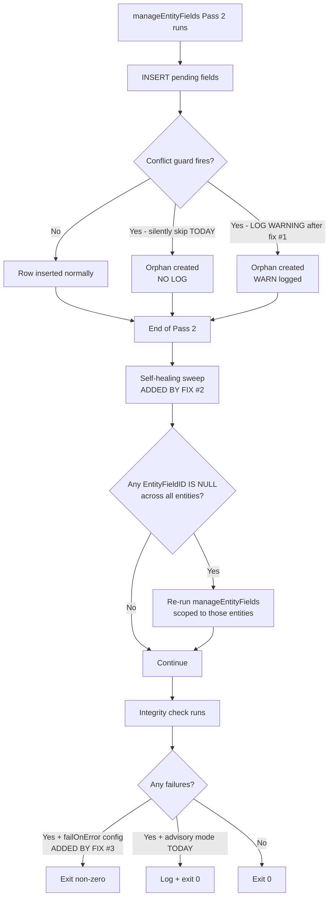

# CodeGen `manageEntityFields` Robustness

## Status
- **Status**: Draft
- **Created**: 2026-05-14
- **Author**: Amith Nagarajan + Claude
- **Branch**: amith-nagarajan/codegen-manage-entity-fields-robustness

## Overview

CodeGen's `manageEntityFields` pipeline is silently dropping virtual `EntityField` rows during the initial ingest of new entities. The ingest produces a half-synced state (some virtual fields land, others don't) and **no future codegen run will heal it on its own** because Pass 2 of the field-sync is scoped to entities that have been touched in the current run. The post-codegen integrity check correctly identifies the broken state, but only as an advisory log line — it does not fail the run.

The combination produces a particularly nasty failure mode: the user gets a successful codegen log, a passing build, and broken metadata that won't surface until much later (or until the integrity check is read carefully). Diagnosed concretely on `AssociationDemo.Certifications` where the `CertificationType` virtual field landed but the `Member` virtual field did not — leaving `vwSQLColumnsAndEntityFields` showing `Member` as pending forever.

This plan addresses three structural weaknesses in the pipeline that allow these failures and prevent self-healing. The fixes are layered: each closes a smaller window than the previous one. Together they convert silent drops into loud failures, give stuck state a recovery path, and let CI gate on metadata correctness.

## Goals & Non-Goals

### Goals
- **Eliminate silent INSERT skips** in the pending-fields path. Any disagreement between the SELECT (says "row is missing") and the conflict guard (says "row already exists") must be observable.
- **Self-heal orphaned pending virtual fields** on the next codegen run without requiring `forceRegeneration`.
- **Allow CI to gate on metadata integrity** by promoting `entityFieldsSequenceCheck` (and other checks) from advisory-only to fatal under a config flag.
- **Establish an explicit repair command** (`mj codegen --repair-entity <name>`) so users have a deterministic way to recover stuck state without resorting to `forceRegeneration` of the whole DB.

### Non-Goals
- **Root-cause investigation of the original `Member`-drop incident** during AssociationDB ingest. The chain of events that produced the orphan is uncertain; this plan adds defenses that prevent recurrence regardless of cause. A separate investigation can chase the original trigger if desired.
- **Reworking `vwSQLColumnsAndEntityFields`** itself. The view's discovery query is correct; the bug is downstream in how results get processed and what happens when an INSERT silently no-ops.
- **Auto-repair from the integrity check.** The check stays a check — repair stays explicit, behind an opt-in command. Mixing detection with repair makes both harder to reason about.
- **Performance regression on large schemas.** The Pass 2 scoping was a real perf win and stays. The new safety sweep is additive and aggressively filtered.

## Background & Context

### The pipeline today

CodeGen runs `manageEntityFields` twice in a single run:

1. **Pass 1** — runs in `ManageMetadataBase.manageMetadata()` *before* SQL views are regenerated. At this point the base view for a newly-discovered entity may not exist, so virtual columns from JOINs are not yet visible. Pass 1 inserts what it can see (typically only base-table columns). See [packages/CodeGenLib/src/Database/manage-metadata.ts:1216-1224](../packages/CodeGenLib/src/Database/manage-metadata.ts#L1216-L1224).

2. **Pass 2** — runs in `SQLCodeGenBase.manageSQLScriptsAndExecution()` *after* views have been regenerated. Now virtual columns (FK display fields like `Member`, `CertificationType`) appear in `vwSQLColumnsAndEntityFields`. Pass 2 is **scoped** to `newEntityList ∪ modifiedEntityList` — entities that haven't changed in the current run get skipped entirely. See [packages/CodeGenLib/src/Database/sql_codegen.ts:330-353](../packages/CodeGenLib/src/Database/sql_codegen.ts#L330-L353).

3. **Late-phase regen pass** — runs only for entities flagged in `EntitiesRequiringViewRegen` (e.g., when `SupportsGeoCoding` toggles during advanced generation). Same scoping issue. See [packages/CodeGenLib/src/Database/sql_codegen.ts:355-403](../packages/CodeGenLib/src/Database/sql_codegen.ts#L355-L403).

### The discovery + insert path

`createNewEntityFieldsFromSchema` ([manage-metadata.ts:3342-3389](../packages/CodeGenLib/src/Database/manage-metadata.ts#L3342-L3389)) does:

1. SELECT pending rows from `vwSQLColumnsAndEntityFields` filtered by `EntityFieldID IS NULL` (and optionally a per-entity filter).
2. Open a transaction.
3. For each pending row, generate a new UUID and INSERT — **wrapped in `wrapInsertWithConflictGuard`**.
4. Commit.

The conflict guard generated by [SQLServerCodeGenProvider.ts:1042-1047](../packages/CodeGenLib/src/Database/providers/sqlserver/SQLServerCodeGenProvider.ts#L1042-L1047) is:

```sql
IF NOT EXISTS (
  SELECT 1 FROM EntityField
  WHERE ID = '<new-uuid>' OR (EntityID = '<eid>' AND Name = '<fname>')
) BEGIN
  INSERT INTO EntityField (...) VALUES (...);
END
```

If the conflict check matches, the INSERT silently does nothing. No error, no warning, no log. The transaction commits, the orphan persists, the user sees a green codegen log.

### The integrity check

`SystemIntegrityBase.CheckEntityFieldSequencesInternal` ([packages/CodeGenLib/src/Misc/system_integrity.ts:116-196](../packages/CodeGenLib/src/Misc/system_integrity.ts#L116-L196)) runs after codegen and does three checks per entity:

1. No duplicate `Sequence` values within an entity.
2. Sequences are 1..N consecutive.
3. The metadata-Sequence order matches the physical column ordinals of the base view.

Check #3 is what catches the orphan: if the view has 19 columns but metadata has only 18 EntityField rows (the 18th being `CertificationType` instead of the `Member` it should be at view ordinal 18), the check fails with a clear message.

The check itself works correctly. Its return value is logged but **does not affect codegen's exit code**. CI doesn't notice. Pre-commit hooks don't notice.

### Concrete incident (AssociationDemo.Certifications)

Observed on a clean MJ_5_34_0 install with AssociationDB schema added:

- `vwCertifications` has 19 columns: 17 base + `Member` (ordinal 18, JOIN to `Member.FirstName`) + `CertificationType` (ordinal 19, JOIN to `CertificationType.Name`).
- `EntityField` table has 18 rows for Certifications: 17 base + `CertificationType` (Sequence=18, IsVirtual=1). **`Member` is missing.**
- `vwSQLColumnsAndEntityFields` correctly shows `Member` with `EntityFieldID = NULL` — i.e., still pending.
- Re-running codegen does **not** fix it: nothing about Certifications changed in the DB, so it's not in `newEntityList` or `modifiedEntityList`, so Pass 2 skips it.
- The integrity check fires `Integrity check FAILED: entityFieldsSequenceCheck - Entity Certifications has a mismatch between the metadata sequence and the physical column order in the base view [AssociationDemo].[vwCertifications] for position 18. Expected CertificationType but found Member` — but codegen exits 0.

The exact trigger that caused only one of the two virtual fields to land during the original ingest is not pinned down. Plausible candidates: collation differences between the LEFT JOIN in `vwSQLColumnsAndEntityFields` (matches `c.name = ef.Name`) and the conflict guard's `Name = 'Member'` literal; multiple view DROP/CREATE cycles within one codegen run shifting column ordinals between phases; a transient EntityField row created by an unrelated path (IS-A inheritance? virtual entity sync?) that later got cleaned up but hit the conflict guard during INSERT. Investigating root cause is non-goal #1.

## Architecture / Design

### Three layered defenses



### Fix #1 — Replace silent skip with let-it-throw + targeted catch

The current per-row `try/catch` at [manage-metadata.ts:3360-3368](../packages/CodeGenLib/src/Database/manage-metadata.ts#L3360-L3368) re-throws on any error. Combined with the conflict guard, the only path where an INSERT "succeeds" without inserting is the silent-skip path. Remove the `wrapInsertWithConflictGuard` call entirely and rely on the database's unique constraint to enforce idempotency. When the constraint fires, the catch block branches:

- **Unique-constraint error** (SQL Server: 2627 or 2601; PostgreSQL: 23505) → log a clear warning with EntityID + FieldName, then **continue without re-throwing**. This preserves the original idempotency intent (re-running the same codegen shouldn't crash on duplicate inserts) while making the skip observable.
- **Any other error** → re-throw. Transaction rolls back, as today.

Applies to both SQL Server and PostgreSQL providers. The `wrapInsertWithConflictGuard` abstract method on `CodeGenDatabaseProvider` becomes unused and gets removed (or kept as a utility but no longer wired into this path).

### Fix #2 — Self-healing sweep at end of Pass 2

After the scoped Pass 2 in [sql_codegen.ts:339-352](../packages/CodeGenLib/src/Database/sql_codegen.ts#L339-L352), do a single cheap unscoped query:

```sql
SELECT DISTINCT EntityID, EntityName
FROM vwSQLColumnsAndEntityFields
WHERE EntityFieldID IS NULL
```

On a healthy DB this returns zero rows and is essentially free. On a stuck DB (Certifications case) it returns the affected entities. For each, run `manageEntityFields` scoped to just that entity. Log a warning for each one identified ("found N orphaned pending fields in entity X — recovering").

### Fix #3 — Promote integrity check to optionally-fatal

Add a config flag `integrityChecks.failOnError` (default `false` for backward compatibility). When true, `manageSystemIntegrityChecks` aggregates check results and returns failure if any check failed. This propagates through the existing `overallSuccess` path and changes codegen's exit code. Recommended setting is `true` in CI configs and `false` in dev configs.

### Fix #4 — Explicit repair command

Add `mj codegen --repair-entity <entity-name>` (and `--repair-entity-id <uuid>` for unambiguous targeting). Behavior:

1. Load metadata for the named entity.
2. Force-regenerate its view + SPs (same path as late-phase regen at [sql_codegen.ts:373-385](../packages/CodeGenLib/src/Database/sql_codegen.ts#L373-L385)).
3. Run `manageEntityFields` scoped to just that entity, with `skipDeleteUnneededFields=false` so stale rows also get cleaned up.
4. Re-run the integrity check on the repaired entity to confirm.

Distinct from `forceRegeneration` (whole-DB sweep) — this is surgical, fast, and idempotent.

## API Changes

No external API changes. CLI gains one new flag (`--repair-entity`). Config schema gains one new boolean (`integrityChecks.failOnError`).

## Implementation Plan

### Phase 1 — Replace silent INSERT skip with let-it-throw + targeted catch

1. **Modify `createNewEntityFieldsFromSchema`** at [manage-metadata.ts:3342-3389](../packages/CodeGenLib/src/Database/manage-metadata.ts#L3342-L3389):
   - Stop calling `wrapInsertWithConflictGuard`. Have the per-row INSERT issued directly.
   - Expand the existing per-row `try/catch` to inspect error codes:
     - SQL Server: catch errors with `originalError.info.number === 2627` or `2601`.
     - PostgreSQL: catch errors with `error.code === '23505'`.
     - On match: `logWarning` with `EntityID`, `FieldName`, and a hint about likely cause (concurrent codegen, prior partial run, etc.). Continue.
     - On non-match: re-throw to roll back the transaction, as today.
2. **Modify `getPendingEntityFieldINSERTSQL`** at [manage-metadata.ts:3225-3324](../packages/CodeGenLib/src/Database/manage-metadata.ts#L3225-L3324):
   - Drop the `conflictCheck` / `guard` setup at lines 3258-3259 and the `${guard.prefix}` / `${guard.suffix}` wrap at lines 3262/3323.
   - Method now returns a plain INSERT.
3. **Decide on `wrapInsertWithConflictGuard`**:
   - Grep for other callers. If none, remove the abstract method from `CodeGenDatabaseProvider` and the SQL Server / PostgreSQL implementations.
   - If used elsewhere, leave the method but remove this caller.
4. **Add unit tests** in `packages/CodeGenLib/src/__tests__/manage-metadata.test.ts` (or create the file if absent):
   - Verify INSERT SQL no longer contains `IF NOT EXISTS`.
   - Mock a duplicate-key error and assert the catch logs a warning and does NOT re-throw.
   - Mock a non-duplicate error and assert it re-throws and rolls back.

### Phase 2 — Self-healing sweep

1. **Add a method `findOrphanedPendingFields`** to `ManageMetadataBase` in `manage-metadata.ts`:
   - Runs the discovery query unscoped.
   - Returns `{ EntityID: string; EntityName: string }[]`.
2. **Modify Pass 2 in `sql_codegen.ts`** at the end of the `Managing entity fields metadata...` block (around line 352):
   - Call `findOrphanedPendingFields(pool)`.
   - If non-empty, log a warning listing the entities, then call `manageEntityFields` again with that list as the filter and `skipDeleteUnneededFields=false`.
   - Wrap in its own spinner: `Recovering orphaned pending fields...` / `Recovered N entities`.
3. **Cap recovery iterations at 1**. If the recovery sweep itself leaves orphans, log an error and surface in `overallSuccess` so the integrity check + Phase 3 can decide to fail the build. Avoid infinite loops.
4. **Add an integration-style test** that simulates an orphan (insert a fake row in `EntityField` for one of two view virtual columns, run the recovery, assert both columns now have rows).

### Phase 3 — Promote integrity check to optionally-fatal

1. **Add config field `integrityChecks.failOnError: boolean`** in `packages/CodeGenLib/src/Config/config.ts`:
   - Add to `IntegrityChecksConfig` Zod schema (around line 238).
   - Add default `false` to both default config blocks (around lines 480 and 660).
2. **Modify the integrity check runner** (the calling site in `sql_codegen.ts` or wherever `CheckEntityFieldSequences` is invoked):
   - If `configInfo.integrityChecks.failOnError === true` and any check returned `Success: false`, set `overallSuccess = false` so codegen's exit code reflects it.
   - Keep the log output unchanged so dev mode still gets the advisory message.
3. **Update CI config** (e.g., the workbench / sandbox configs in `docker/`) to set `failOnError: true`. Leave shipped default at `false`.
4. **Document** the new flag in `packages/CodeGenLib/CLAUDE.md` or wherever integrity check docs live.

### Phase 4 — Explicit repair command

1. **Add CLI flag** in `packages/MJCLI/src/commands/codegen.ts` (or wherever the codegen command is defined):
   - `--repair-entity <name>` (string)
   - `--repair-entity-id <uuid>` (uuid string)
   - Mutually exclusive with each other and with `forceRegeneration`.
2. **Add a `repairEntity` method** to the codegen orchestrator (likely `SQLCodeGenBase` or a sibling class):
   - Resolve entity by name or ID.
   - If not found, log and exit 1.
   - Run a focused mini-pipeline: regenerate the view + SPs for that one entity → re-run `manageEntityFields` for it → re-run integrity check for it.
   - On success, exit 0; on failure, exit non-zero with a clear message.
3. **Add an integration test** that creates an orphan, invokes `--repair-entity`, asserts the orphan is gone.

## Migration & Data

No migrations required. All changes are in CodeGen library code. The repair command operates on existing metadata; it doesn't change schemas.

If a user wants to fix an existing orphaned-state DB without waiting for the next codegen to self-heal, they can:

```bash
# Option A: targeted repair (preferred, post-Phase 4)
npx mj codegen --repair-entity Certifications

# Option B: full force-regeneration (works today, heavyweight)
# enable forceRegeneration in mj.config.cjs and re-run codegen
```

## Testing Strategy

### Unit tests

- **`manageEntityFields` insert path**: silent-skip removed, duplicate-key correctly logged + continues, non-duplicate errors re-throw.
- **`findOrphanedPendingFields`**: returns expected shape, filters correctly.
- **Config schema**: new `failOnError` flag parses, defaults to `false`.

### Integration tests (require a live DB — likely against the workbench Docker SQL Server)

- **Orphan repair self-heal**: seed a Certifications-like state with a missing virtual EntityField row, run codegen, assert Phase 2 sweep recovered it without `forceRegeneration`.
- **`--repair-entity`**: same as above but using the explicit command, assert it's faster (only touches one entity).
- **Integrity check fail-on-error**: create an orphan, run codegen with `failOnError: true`, assert exit code is non-zero. Run with `failOnError: false`, assert exit 0 + warning logged.

### Regression / canary

- Run the full CodeGen pipeline against a clean MJ baseline + AssociationDemo, twice. First run: should self-heal Certifications. Second run: should produce zero diff.
- Run against a long-lived dev DB. Should produce zero diff (no false-positive orphans).

## Risks & Open Questions

### Risks

- **Self-healing sweep could mask a deeper bug**. If the orphan keeps recurring on every codegen run, the recovery would also fire on every run — masking the real issue. Mitigation: log loudly with entity names, and the integrity check (especially with `failOnError`) would still surface the recurrence.
- **Removing `wrapInsertWithConflictGuard` might affect other callers**. Need to grep before deleting. If used elsewhere, just stop using it from this site.
- **Repair command + active codegen**. If a user runs `--repair-entity` while another codegen is in flight against the same DB, the result is undefined. Mitigation: document as advisory-only, no locking. Most teams have a single codegen run at a time.

### Open questions

- **Should `findOrphanedPendingFields` filter excluded schemas?** Today, `manageEntityFields` respects `excludeSchemas`. The recovery sweep should too — otherwise it could try to "recover" entities the user explicitly excluded. Resolve during implementation by passing `excludeSchemas` through.
- **Should the repair command also clean up stale rows?** I.e., if the entity has an EntityField row for a column that no longer exists in the view, should `--repair-entity` delete it? Current proposal says yes (`skipDeleteUnneededFields=false`). Confirm during review.
- **PostgreSQL parity**. The diagnosed incident is SQL Server. The same code path applies to Postgres but the conflict guard and error codes differ. Phase 1 should cover both providers; Phase 2/3/4 are provider-agnostic.

## Files to Modify

| File | Change |
|------|--------|
| `packages/CodeGenLib/src/Database/manage-metadata.ts` | Phase 1: drop conflict guard from `createNewEntityFieldsFromSchema` + `getPendingEntityFieldINSERTSQL`; expand try/catch with duplicate-key handling. Phase 2: add `findOrphanedPendingFields`. |
| `packages/CodeGenLib/src/Database/sql_codegen.ts` | Phase 2: add self-healing sweep at end of Pass 2 metadata sync block. Phase 3: gate integrity check failure into `overallSuccess`. |
| `packages/CodeGenLib/src/Database/codeGenDatabaseProvider.ts` | Phase 1: optionally remove `wrapInsertWithConflictGuard` abstract method (depends on grep for other callers). |
| `packages/CodeGenLib/src/Database/providers/sqlserver/SQLServerCodeGenProvider.ts` | Phase 1: optionally remove `wrapInsertWithConflictGuard` impl. |
| `packages/CodeGenLib/src/Database/providers/postgresql/PostgreSQLCodeGenProvider.ts` | Phase 1: same as above for Postgres parity. |
| `packages/CodeGenLib/src/Config/config.ts` | Phase 3: add `integrityChecks.failOnError` to schema + defaults. |
| `packages/CodeGenLib/src/Misc/system_integrity.ts` | Phase 3: surface failure to the caller cleanly so `failOnError` can act on it. |
| `packages/MJCLI/src/commands/codegen.ts` (or equivalent) | Phase 4: add `--repair-entity` and `--repair-entity-id` flags. |
| `packages/CodeGenLib/CLAUDE.md` | All phases: document new flag, recovery behavior, repair command. |
| `packages/CodeGenLib/src/__tests__/manage-metadata.test.ts` (new file) | Unit tests for Phase 1 + Phase 2 logic. |
| `packages/CodeGenLib/src/__tests__/codegen-reporter.test.ts` | Phase 3: assert integrity-check failures propagate to exit code under `failOnError`. |

## References

- Investigation conversation that surfaced the bug — diagnosed `AssociationDemo.Certifications` with missing `Member` virtual field after MJ_5_34_0 + AssociationDB clean-install codegen on 2026-05-14.
- The shipped determinism + spCreate fix (PR #2598, merged into `next` 2026-05-14) — this plan builds on that branch's work but is **scope-disjoint**: those PRs fixed cross-environment ordering and a separate Madhav-introduced spCreate regression; this plan addresses a third, structurally distinct bug class.
- `vwSQLColumnsAndEntityFields` view definition — the discovery query that correctly identifies pending virtual columns but whose results were silently dropped downstream.
- `system_integrity.ts:CheckEntityFieldSequencesInternal` — the post-codegen check that surfaced the orphan as advisory.
