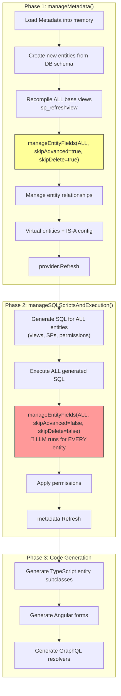
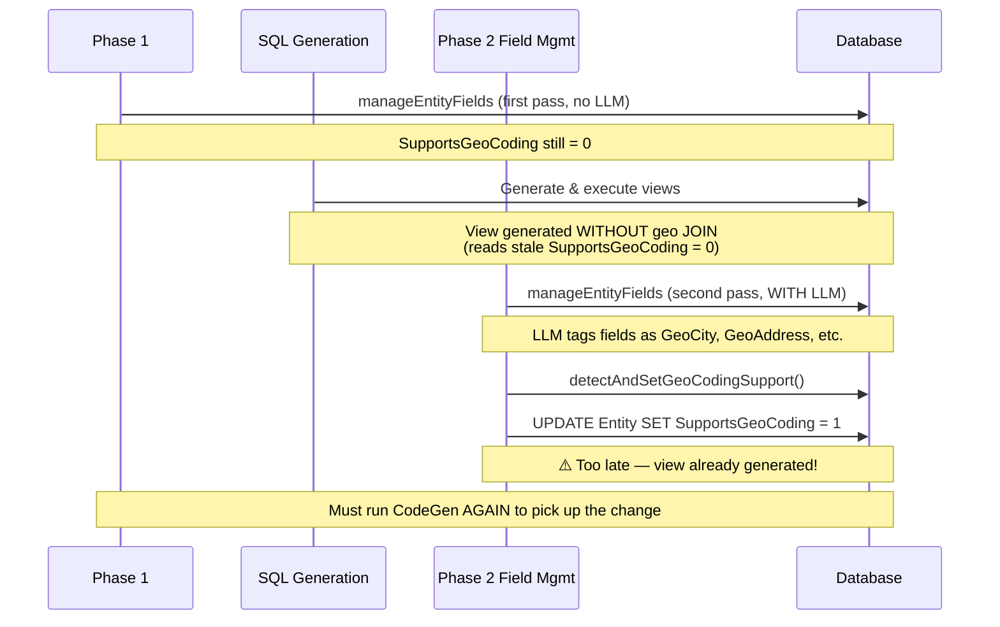
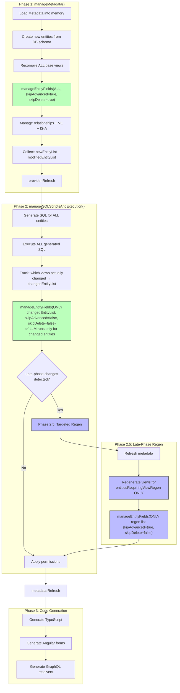

# Scoped Entity Regeneration in CodeGen

## Prerequisites

Two foundational pieces land before the optimization work in this plan starts:

### 1. Telemetry (opt-in)

CodeGen currently has sparse logging and no way to attribute time to specific phases or LLM calls. Before we claim any perf win from the scoping work below, we need the ability to measure it. An opt-in `CodeGenReporter` captures:

- Phase timings (nested spans for `manageMetadata`, `manageSQLScriptsAndExecution`, etc.)
- Per-entity work inside each phase
- Per-LLM-call data (prompt, model, tokens, latency, cost)
- Counters from `ManageMetadataBase` static lists (new / modified / regen entities)

Writes one JSON artifact per run to `~/.mj/codegen-state/`, mirroring the file-based pattern from `metadata-sync` rather than extending MJCore's runtime `TelemetryManager` (which is session-scoped for live apps and the wrong fit for a CLI build tool).

**Off by default.** Enabled via one of:
- `--report` CLI flag on `mj codegen`
- `codegen.report.enabled: true` in `mj.config.cjs`
- `MJ_CODEGEN_REPORT=1` env var

When off, the reporter is a no-op. Retention defaults to the last 20 runs.

### 2. E2E regression suite

CodeGen has had minor and significant silent regressions while adding new features or fixing unrelated issues. The scoping work in this plan touches hot paths; shipping it without a regression safety net is risky.

A golden-fixture E2E suite runs in CI against a seeded SQL Server (via the docker workbench so it doesn't interfere with anyone's local DB) and asserts generator output is stable across canonical schema operations:

- No-change run: zero migration output, zero file diffs
- Add column: only the affected entity's view/SP/entity subclass diff
- Rename column: stale field deleted, new field created, dependents regenerated
- Add FK: relationship auto-created, FK index generated, nothing else touched
- New entity from schema: spCreate/Update/Delete + view + permissions generated
- IS-A chain: parent/child view regeneration still correct after column change on parent
- Virtual entity fields: not orphaned during scoped field deletion
- Cascade delete SPs: regenerated when FK relationships change
- Form generation: picks up new virtual fields from scoped regen
- Custom base views (`BaseViewGenerated=false`): not affected by scoped regen

Comparison is file-diff-based against golden fixtures, re-generatable via `--update-snapshots`.

> These prerequisites ship as their own PR(s) ahead of the scoping work below. The existing "Testing Strategy" section later in this doc is subsumed by the regression suite.

## Problem Statement

CodeGen's `manageEntityFields()` runs against ALL entities in both phases, even though most entities haven't changed. On large databases (500+ entities), this is expensive — especially the LLM-powered advanced generation pass. Additionally, late-phase changes (like setting `SupportsGeoCoding = 1` during advanced generation) produce stale views that require a full second CodeGen run to pick up.

## How It Works Today

### Current Phase Flow



### The Two Problems

#### Problem 1: Full-Scope Waste
Both `manageEntityFields` passes process ALL entities. In Phase 2, the LLM advanced generation runs for every entity — even those whose fields haven't changed since the last CodeGen run. On a 500-entity DB, this means ~500 LLM calls when maybe 5 entities actually changed.

#### Problem 2: Late-Phase Stale Views
When advanced generation (Phase 2, Step 3) sets `SupportsGeoCoding = 1` or makes other changes that affect view structure, the views were already generated in Step 2. The entity's view doesn't include the new geo JOIN until a full second CodeGen run.



## Proposed Design

### Overview

1. Scope `manageEntityFields` to only process entities that actually changed
2. Add a late-phase view regeneration step for entities that need it
3. Add optional `@EntityID` parameter to field management stored procedures

### Proposed Phase Flow



### Detailed Implementation

#### 1. New Static Lists in ManageMetadataBase

```typescript
// Existing
private static _newEntityList: string[] = [];
private static _modifiedEntityList: string[] = [];

// New
private static _entitiesRequiringViewRegen: string[] = [];
private static _changedViewEntities: string[] = [];

public static AddEntityRequiringViewRegen(entityName: string): void {
    if (!this._entitiesRequiringViewRegen.includes(entityName)) {
        this._entitiesRequiringViewRegen.push(entityName);
    }
}
```

#### 2. Stored Procedure Changes

Add optional `@EntityID` parameter to these SPs (NULL = process all, maintaining backward compatibility):

**`spDeleteUnneededEntityFields`**
```sql
ALTER PROCEDURE __mj.spDeleteUnneededEntityFields
    @ExcludeSchemas NVARCHAR(MAX),
    @EntityID UNIQUEIDENTIFIER = NULL  -- NEW: optional filter
AS
BEGIN
    -- Existing logic with added filter:
    -- AND (@EntityID IS NULL OR ef.EntityID = @EntityID)
END
```

**`spCreateNewEntityFieldsFromSchema`**
```sql
ALTER PROCEDURE __mj.spCreateNewEntityFieldsFromSchema
    @EntityID UNIQUEIDENTIFIER = NULL  -- NEW: optional filter
AS
BEGIN
    -- Existing logic with added filter:
    -- AND (@EntityID IS NULL OR e.ID = @EntityID)
END
```

**`spUpdateExistingEntityFieldsFromSchema`**
```sql
ALTER PROCEDURE __mj.spUpdateExistingEntityFieldsFromSchema
    @ExcludeSchemas NVARCHAR(MAX),
    @EntityID UNIQUEIDENTIFIER = NULL  -- NEW: optional filter
AS
BEGIN
    -- Existing logic with added filter:
    -- AND (@EntityID IS NULL OR ef.EntityID = @EntityID)
END
```

#### 3. manageEntityFields Refactored Signature

```typescript
public async manageEntityFields(
    pool: CodeGenConnection,
    excludeSchemas: string[],
    skipCreatedAtUpdatedAtDeletedAtFieldValidation: boolean,
    skipEntityFieldValues: boolean,
    currentUser: UserInfo,
    skipAdvancedGeneration: boolean,
    skipDeleteUnneededFields: boolean = false,
    entityFilter?: string[]  // NEW: optional list of entity names to process
): Promise<boolean>
```

When `entityFilter` is provided:
- Pass entity IDs to the SP `@EntityID` parameter (one call per entity, or batch)
- Skip advanced generation for entities not in the filter
- Skip field deletion for entities not in the filter

#### 4. View Change Detection

In `generateSingleEntitySQLToSeparateFiles`, after `checkBaseViewChangedInDB()` returns true:

```typescript
if (viewChanged) {
    ManageMetadataBase.addChangedViewEntity(entity.Name);
}
```

#### 5. Late-Phase Change Detection

In `detectAndSetGeoCodingSupport`, when `shouldSupportGeo !== currentValue`:

```typescript
if (shouldSupportGeo !== currentValue) {
    await pool.query(`UPDATE ... SET SupportsGeoCoding = ...`);
    ManageMetadataBase.AddEntityRequiringViewRegen(entity.Name);
    logStatus(`  Entity ${entity.Name}: SupportsGeoCoding changed, queued for view regen`);
}
```

#### 6. Phase 2.5 Implementation (in sql_codegen.ts)

After Step 3 (second `manageEntityFields`):

```typescript
// Phase 2.5: Late-phase targeted regen
const regenList = ManageMetadataBase.entitiesRequiringViewRegen;
if (regenList.length > 0) {
    startSpinner(`Regenerating ${regenList.length} entities with late-phase changes...`);

    // Refresh metadata to pick up DB changes from Phase 2
    const md = new Metadata();
    await md.Refresh();

    // Resolve entity names to EntityInfo objects
    const entitiesToRegen = regenList
        .map(name => md.EntityByName(name))
        .filter((e): e is EntityInfo => e !== null);

    // Regen views + SPs for affected entities only
    const regenResult = await this.generateAndExecuteEntitySQLToSeparateFiles({
        pool,
        entities: entitiesToRegen,
        directory,
        onlyPermissions: false,
        skipExecution: false,
        writeFiles: true,
        batchSize: 1
    });

    if (regenResult.Success) {
        // Sync fields for affected entities to pick up new virtual fields
        await manageMD.manageEntityFields(
            pool, configInfo.excludeSchemas,
            true, true, currentUser,
            true,   // skipAdvancedGeneration — already ran
            false,  // DO delete unneeded fields
            regenList  // NEW: entity filter
        );
        succeedSpinner(`Regenerated ${entitiesToRegen.length} entities`);
    } else {
        failSpinner('Late-phase regen failed');
        overallSuccess = false;
    }
}
```

### Performance Impact

| Scenario | Current (500 entities) | Proposed |
|----------|----------------------|----------|
| Phase 2 field mgmt (no changes) | ~500 LLM calls | ~0 LLM calls |
| Phase 2 field mgmt (5 changed) | ~500 LLM calls | ~5 LLM calls |
| Late-phase geo regen (3 entities) | Full second CodeGen run | ~3 entity view regen + field sync |
| Total time (typical) | 5-10 minutes | 2-4 minutes |

### Migration Required

Single migration to add `@EntityID` parameter to 3 stored procedures:

```sql
-- V20260411__Scoped_EntityField_SPs.sql

ALTER PROCEDURE __mj.spDeleteUnneededEntityFields
    @ExcludeSchemas NVARCHAR(MAX),
    @EntityID UNIQUEIDENTIFIER = NULL
AS ...

ALTER PROCEDURE __mj.spCreateNewEntityFieldsFromSchema
    @EntityID UNIQUEIDENTIFIER = NULL
AS ...

ALTER PROCEDURE __mj.spUpdateExistingEntityFieldsFromSchema
    @ExcludeSchemas NVARCHAR(MAX),
    @EntityID UNIQUEIDENTIFIER = NULL
AS ...
```

### Testing Strategy

#### Unit Tests
- `manageEntityFields` with `entityFilter = undefined` behaves identically to current
- `manageEntityFields` with `entityFilter = ['Members']` only processes Members fields
- `entitiesRequiringViewRegen` list populated correctly by `detectAndSetGeoCodingSupport`
- Phase 2.5 regen produces correct view SQL with geo JOIN

#### Integration Tests
- Full CodeGen on fresh DB: all entities processed, no regressions
- Second CodeGen run with no changes: no LLM calls in Phase 2
- Add new column to existing entity: only that entity re-processed
- First-time geo detection: view includes geo JOIN after single CodeGen run
- Entity with SupportsGeoCoding already set: no unnecessary regen

#### Regression Tests
- IS-A entity chains: parent/child view regeneration still correct
- Virtual entity fields: not orphaned during scoped field deletion
- Cascade delete SPs: regenerated when FK relationships change
- Form generation: picks up new virtual fields from scoped regen
- Custom base views: not affected by scoped regen (BaseViewGenerated=false)

### Risks and Mitigations

| Risk | Impact | Mitigation |
|------|--------|------------|
| Missing a changed entity | Stale view until next run | Conservative detection: include entity if ANY field changed, not just geo |
| SP parameter breaks existing behavior | All entities incorrectly filtered | Default `@EntityID = NULL` means no filter — backward compatible |
| Scoped field deletion deletes valid fields | Data loss in metadata | Only delete for entities in filter; orphan detection uses same SP logic |
| Phase 2.5 regen order dependency | View references another view not yet regenerated | Process in dependency order (same as Phase 2) |
| LLM skip for unchanged entities misses prompt updates | Stale LLM results | Add `--force-advanced-gen` CLI flag to override; also detect prompt version changes |

### Estimated Effort

| Task | Estimate |
|------|----------|
| SP migration (add @EntityID param) | 0.5 day |
| Refactor manageEntityFields with entityFilter | 1 day |
| View change tracking in generateSingleEntitySQL | 0.5 day |
| Phase 2.5 late-regen pipeline | 1 day |
| Scoped Phase 2 (only changed entities for LLM) | 1 day |
| Unit + integration tests | 2 days |
| Regression testing on production-scale DB | 1 day |
| **Total** | **6-7 days** |

### Rollout Plan

0. **Prerequisites** (see top of doc): opt-in telemetry + E2E regression suite. These land first so Phases A/C/D can be benchmarked and regression-checked.
1. **Phase A**: Add `@EntityID` to SPs (backward compatible, zero risk)
2. **Phase B**: Implement Phase 2.5 late-regen (fixes the geo bug, low risk) — **DONE** (merged in `search-geo-phase-3`, commit `0f3c217015`)
3. **Phase C**: Scope Phase 2 manageEntityFields to changed entities only (performance win, medium risk)
4. **Phase D**: Add `--force-advanced-gen` flag and prompt version detection (safety net)

> **Status**: Phase B is complete. The `entitiesRequiringViewRegen` list, `detectAndSetGeoCodingSupport` population, and Step 3.5 targeted regen are all implemented and working. Phases A, C, D remain as future work requiring the SP migration and broader testing.

Each phase can be shipped independently as its own PR.

### Dependencies

- Stored procedure migration must deploy before TypeScript changes
- CodeGen test infrastructure (currently manual — automated tests would de-risk significantly)
- [PR #2325](https://github.com/MemberJunction/MJ/pull/2325) — Geo features (already merged)
