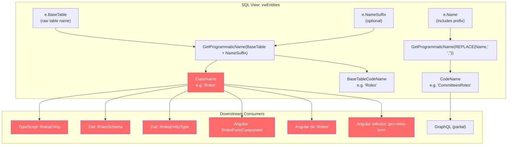
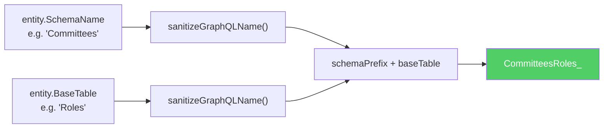
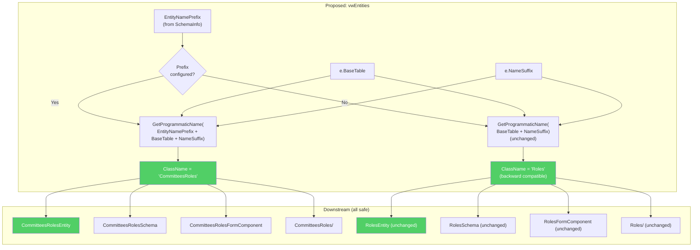
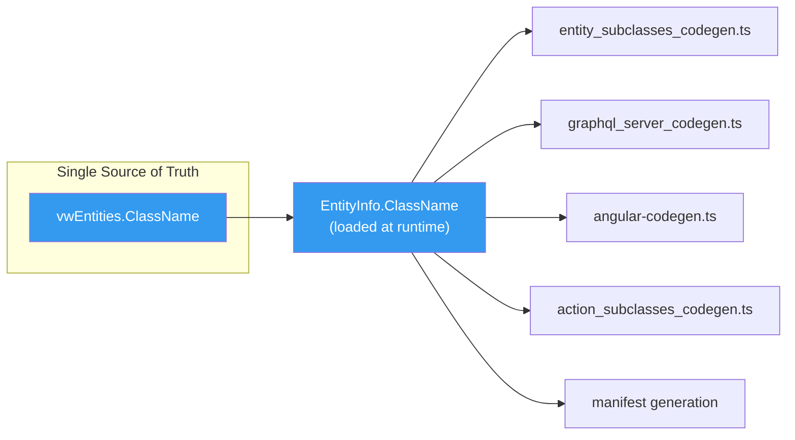
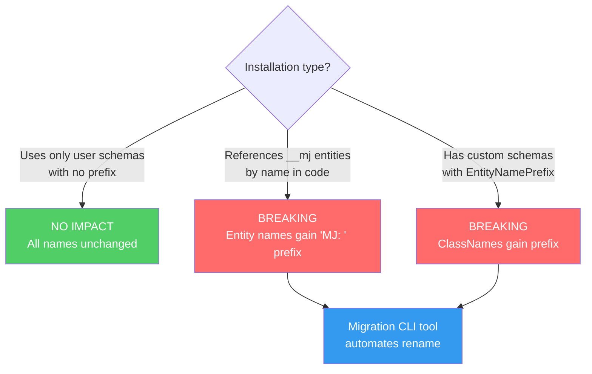
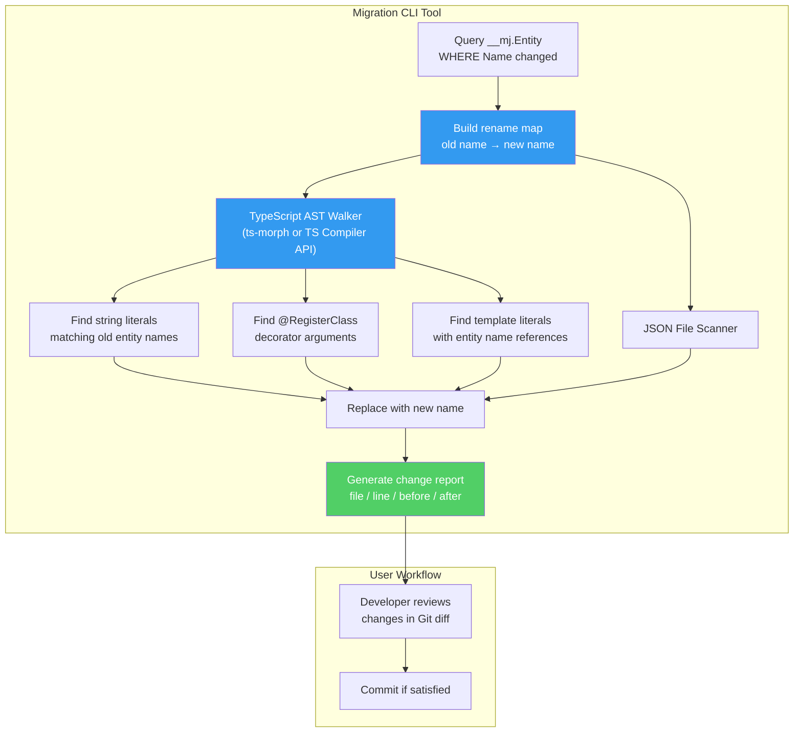
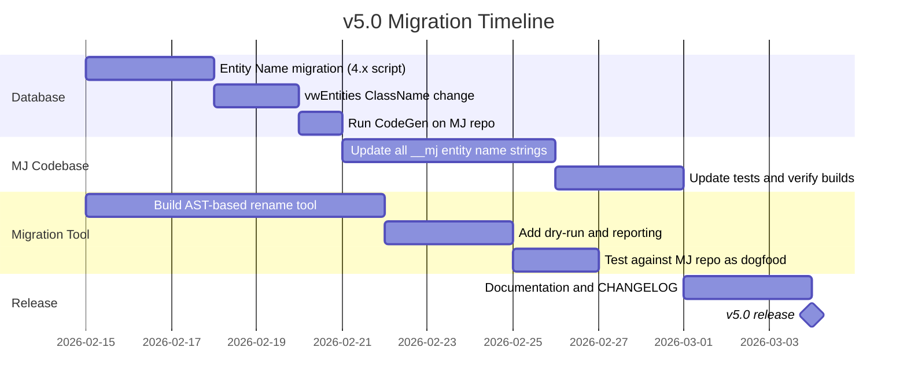

# Entity ClassName Collision Fix — Schema-Aware Class Names

## Problem Statement

When two database schemas contain tables with the same name, CodeGen produces **identical TypeScript class names** for both entities, causing compile-time collisions. The root cause is that `ClassName` is derived solely from `BaseTable` (the raw SQL table name), ignoring the entity name prefix that distinguishes entities across schemas.

### Example Scenario

A `Committees` schema and a `CRM` schema both have a `Roles` table. The user has configured `EntityNamePrefix = "Committees: "` for the Committees schema and `EntityNamePrefix = "CRM: "` for the CRM schema.

| | Committees.Roles | CRM.Roles |
|---|---|---|
| **Entity Name** | `Committees: Roles` | `CRM: Roles` |
| **CodeName** (from Name) | `CommitteesRoles` | `CRMRoles` |
| **ClassName** (from BaseTable) | `Roles` | `Roles` |
| **TS Entity Class** | `RolesEntity` | `RolesEntity` **COLLISION** |
| **Zod Schema** | `RolesSchema` | `RolesSchema` **COLLISION** |
| **Zod Type** | `RolesEntityType` | `RolesEntityType` **COLLISION** |
| **Angular Form Class** | `RolesFormComponent` | `RolesFormComponent` **COLLISION** |
| **Angular Directory** | `Roles/` | `Roles/` **OVERWRITE** |
| **GraphQL Type** | `CommitteesRoles_` | `CRMRoles_` |

GraphQL is the **only layer already protected** — it uses `getGraphQLTypeNameBase()` which prepends the sanitized schema name.

## Current Architecture

### How Names Are Computed Today



### GraphQL (Already Safe)



**Location:** `packages/MJCore/src/generic/graphqlTypeNames.ts:116` — `getGraphQLTypeNameBase()`

### Where ClassName Is Used

The `ClassName` field from `vwEntities` flows into `EntityInfo.ClassName` via `@memberjunction/core` metadata loading, and is consumed by every code generator:

| Generator File | What It Produces | Pattern |
|---|---|---|
| `entity_subclasses_codegen.ts:123` | TS entity class | `${entity.ClassName}Entity` |
| `entity_subclasses_codegen.ts:419` | Zod schema const | `${entity.ClassName}Schema` |
| `entity_subclasses_codegen.ts:428` | Zod type alias | `${entity.ClassName}EntityType` |
| `angular-codegen.ts:117` | Angular form directory | `${entity.ClassName}/` |
| `angular-codegen.ts:124` | Angular form TS file | `${entity.ClassName.toLowerCase()}.form.component.ts` |
| `angular-codegen.ts:135` | Angular component class | `${entity.ClassName}FormComponent` |
| `angular-codegen.ts:441` | Angular selector | `gen-${entity.ClassName.toLowerCase()}-form` |
| `graphql_server_codegen.ts:151` | GraphQL import | `${entity.ClassName}Entity` (from entity subclasses) |

All of these will collide if two entities share the same `ClassName`.

## Proposed Solution

### Core Idea

Make `ClassName` incorporate the entity name prefix (derived from `EntityNamePrefix` in `SchemaInfo` or `NameRulesBySchema` in `mj.config.cjs`) when one is configured. For schemas with **no prefix configured**, the behavior remains unchanged.

This mirrors how `CodeName` already works — it's computed from the full `e.Name` which includes the prefix.

### Backward-Compatibility Rule

> **If a schema has no `EntityNamePrefix` configured (either in SchemaInfo or mj.config.cjs), `ClassName` is computed exactly as it is today.** This means the vast majority of simple single-schema installations see zero impact.

Collisions can only occur when multiple schemas are in play, and those schemas necessarily require prefixes to disambiguate entity names. The fix targets exactly those configurations.

### Change Flow



## Implementation Plan

### Layer 1: SQL View Change (`vwEntities`)

**File:** `SQL Scripts/MJ_BASE_BEFORE_SQL.sql`

Change the `ClassName` computation in `vwEntities` from:

```sql
__mj.GetProgrammaticName(e.BaseTable + ISNULL(e.NameSuffix, '')) AS ClassName,
```

To:

```sql
__mj.GetProgrammaticName(
    ISNULL(si.EntityNamePrefix, '') + e.BaseTable + ISNULL(e.NameSuffix, '')
) AS ClassName,
```

This requires joining `SchemaInfo`:

```sql
FROM [__mj].Entity e
LEFT OUTER JOIN [__mj].Entity par ON e.ParentID = par.ID
LEFT OUTER JOIN [__mj].SchemaInfo si ON e.SchemaName = si.SchemaName
```

**`BaseTableCodeName` should remain unchanged** — it represents the raw table name for programmatic use and is intentionally schema-unaware. Only `ClassName` gets the prefix treatment.

> **Note:** The `GetProgrammaticName` function strips non-alphanumeric characters, so a prefix like `"Committees: "` becomes `Committees` cleanly in the output.

### Layer 2: Migration Script

A Flyway migration to:
1. Alter `vwEntities` with the new `ClassName` computation
2. No data migration needed — `ClassName` is a computed view column, not stored

### Layer 3: Verify Downstream Consumers

All downstream consumers already use `entity.ClassName` from metadata. Once the view is updated and metadata is refreshed, all generators automatically pick up the new value:



No changes needed in any TypeScript code generator — they all read `entity.ClassName` and will automatically use the prefixed value.

### Layer 4: GraphQL Alignment Check

`getGraphQLTypeNameBase()` in `packages/MJCore/src/generic/graphqlTypeNames.ts` currently computes its own schema-aware name independently. After this change, we should verify that the GraphQL type names and the new `ClassName` values are consistent. They use slightly different logic:

- **GraphQL:** `sanitizeGraphQLName(schemaName) + sanitizeGraphQLName(baseTable)` — always prefixes with schema name
- **New ClassName:** `GetProgrammaticName(EntityNamePrefix + BaseTable + NameSuffix)` — only prefixes when configured

For the MJ core schema specifically:
- GraphQL produces: `MJUser` (hardcoded "MJ" prefix)
- New ClassName would produce: `MJUser` (from `EntityNamePrefix = "MJ: "`)
- These align.

For custom schemas with prefixes, they should also align assuming the prefix is set to match the schema name (which is the expected convention). Worth verifying in testing.

## Breaking Change Analysis — v5.0

### Decision: Bite the Bullet

Rather than an opt-in flag that defers the problem, we will make this a clean breaking change in **MemberJunction v5.0**. The reasoning:

1. **The `__mj` entity name inconsistency is tech debt** — older entities like "AI Models" have no `"MJ: "` prefix while newer ones like "MJ: AI Prompt Models" do. This is confusing, hard to remember, and will only get worse over time.
2. **MJ's external consumer base is still small** — doing this now is far less painful than doing it later with a larger user base.
3. **Multi-schema support requires this** — without prefixed ClassNames, cross-schema table name collisions are unresolvable. This is foundational for MJ to be truly multi-schema capable.
4. **An opt-in flag just kicks the can** — it adds complexity, introduces an exception for `__mj`, and means the codebase carries two naming conventions indefinitely.

### What Changes

#### Entity Name Normalization (the bigger change)

All `__mj` entities that currently lack the `"MJ: "` prefix will be renamed to include it. This eliminates the inconsistency between older and newer entities.

Examples:

| Current Name | New Name |
|---|---|
| `AI Models` | `MJ: AI Models` |
| `AI Actions` | `MJ: AI Actions` |
| `Entities` | `MJ: Entities` |
| `Entity Fields` | `MJ: Entity Fields` |
| `Entity Relationships` | `MJ: Entity Relationships` |
| `Users` | `MJ: Users` |
| `Roles` | `MJ: Roles` |
| `Applications` | `MJ: Applications` |
| ... | ... |

Entities that already have the prefix (e.g., "MJ: AI Prompt Models") are unaffected.

#### ClassName Prefixing (the original problem)

With `EntityNamePrefix` now consistently applied, `vwEntities.ClassName` incorporates the prefix for all schemas that have one configured. No opt-in flag needed — the prefix in `SchemaInfo` is the signal.

#### Combined Impact

For a core entity like "AI Models" (BaseTable: `AIModel`):

| Artifact | Before (v4.x) | After (v5.0) |
|---|---|---|
| Entity Name | `AI Models` | `MJ: AI Models` |
| CodeName | `AIModels` | `MJAIModels` |
| ClassName | `AIModel` | `MJAIModel` |
| TS Class | `AIModelEntity` | `MJAIModelEntity` |
| Zod Schema | `AIModelSchema` | `MJAIModelSchema` |
| Zod Type | `AIModelEntityType` | `MJAIModelEntityType` |
| Angular Form | `AIModelFormComponent` | `MJAIModelFormComponent` |
| GetEntityObject | `'AI Models'` | `'MJ: AI Models'` |
| @RegisterClass | `'AI Models'` | `'MJ: AI Models'` |
| RunView EntityName | `'AI Models'` | `'MJ: AI Models'` |

For user-schema entities with no prefix configured, **nothing changes**.

### Who Is Affected?



### Surfaces Where Entity Names Appear

Entity name strings are referenced in many contexts. The migration must cover all of them:

| Surface | Example | Migration Approach |
|---|---|---|
| TypeScript string literals | `GetEntityObject<T>('AI Models')` | AST-based tool |
| TypeScript string literals | `RunView({ EntityName: 'AI Models' })` | AST-based tool |
| TypeScript decorators | `@RegisterClass(BaseEntity, 'AI Models')` | AST-based tool |
| SQL filter strings in TS | `ExtraFilter: "EntityName = 'AI Models'"` | AST-based tool (string content scan) |
| Metadata JSON files | `{ "EntityName": "AI Models" }` | JSON key-value scan |
| Config files (mj.config.cjs) | Entity name references | AST-based tool |
| Database Entity.Name column | Stored entity names | SQL migration script |
| External APIs / webhooks | Entity name parameters | Manual audit (documented) |
| Angular templates | Typically use selectors, not names | Verify — likely no direct impact |

---

## v5.0 Migration Strategy

### Versioning

This is a **semver major version bump** (v4.x → v5.0). The breaking changes are:
1. All `__mj` entity names gain `"MJ: "` prefix (affects `GetEntityObject`, `RunView`, `@RegisterClass`, etc.)
2. All `ClassName` values for schemas with `EntityNamePrefix` gain the prefix (affects TS classes, Zod types, Angular components)
3. All `CodeName` values change accordingly (derived from entity Name)

### Phase 1: Database Migration (v4.x migration script)

A Flyway migration that runs as part of the upgrade path to v5.0:

```sql
-- Rename all __mj entities that don't already have the 'MJ: ' prefix
UPDATE [__mj].Entity
SET Name = 'MJ: ' + Name
WHERE SchemaName = '__mj'
  AND Name NOT LIKE 'MJ: %'
  AND Name NOT LIKE 'MJ:%'
```

This migration ships as a **v4.x migration** so that the database is ready before the v5.0 baseline assumes the new names. The v5.0 baseline will already reflect the prefixed names.

The `vwEntities` view change (incorporating `SchemaInfo.EntityNamePrefix` into `ClassName`) is also part of this migration.

### Phase 2: MJ Codebase Update

After the database migration, run CodeGen against the MJ repo itself. This regenerates:
- `entity_subclasses.ts` — all class names updated
- `generated.ts` (GraphQL resolvers) — imports updated
- Angular generated forms — component names/selectors updated

Then update all non-generated MJ code that references entity names by string. This is a large but mechanical change across the monorepo.

### Phase 3: AST-Based Migration CLI Tool

Build an `mj migrate-entity-names` CLI command that automates the rename for user codebases.

#### Architecture



#### Key Design Decisions

1. **AST-based, not regex-based** — Use the TypeScript Compiler API (`ts.createSourceFile`) or `ts-morph` to parse source files into ASTs. Walk the AST looking for:
   - `StringLiteral` nodes whose text matches an old entity name
   - `NoSubstitutionTemplateLiteral` nodes (backtick strings)
   - `TemplateExpression` nodes (template literals with embedded entity names in the static parts)
   - Decorator arguments (for `@RegisterClass`)

   This eliminates false positives from comments, variable names, or partial matches within longer strings.

2. **Rename map built from the database** — Query all entities where the name was changed (or more simply, all `__mj` entities where `Name` doesn't match `'MJ: ' + <old pattern>`). The tool doesn't maintain a hardcoded list — it discovers the mapping dynamically. This also means it works for any schema's prefix changes, not just `__mj`.

3. **Dry-run mode** — `mj migrate-entity-names --dir ./src --dry-run` outputs a report of every proposed change without modifying files. The report includes:
   - File path and line number
   - Before/after text
   - AST node type (string literal, decorator, template, etc.)
   - Confidence level (exact match vs. substring within a larger string)

4. **SQL strings within TypeScript** — Entity names also appear inside SQL filter strings (e.g., `ExtraFilter: "EntityName = 'AI Models'"`). The AST walker finds the outer string literal, then scans its text content for entity name patterns. These are flagged with lower confidence since the tool is doing string matching inside a string, but they're still caught.

5. **JSON file support** — Scan `.json` files for values matching old entity names. This covers metadata files, config files, and any JSON-based entity references.

6. **Git-friendly output** — The tool modifies files in place. Users see the full diff in `git diff` and can review every change before committing. The change report is also saved to a file for reference.

#### Handling Edge Cases

| Edge Case | Approach |
|---|---|
| Entity name as substring of a longer string | AST ensures we only match complete string literals, not substrings |
| Entity name in comments | AST skips comment nodes — no false positives |
| Entity name in SQL within a TS string | Scan string content, flag as lower confidence |
| Entity name in `.json` files | JSON parser, match property values |
| Dynamic string construction (`'AI ' + 'Models'`) | Cannot catch — document as limitation |
| Entity names in non-TS files (`.py`, `.sql`, etc.) | Out of scope for AST — offer a separate grep-based fallback with manual review |
| External APIs / webhooks | Cannot catch — document in migration guide |

#### CLI Interface

```bash
# Dry run — show what would change
mj migrate-entity-names --dir ./src --dry-run

# Apply changes
mj migrate-entity-names --dir ./src

# Target specific schemas only
mj migrate-entity-names --dir ./src --schema __mj

# Include JSON files
mj migrate-entity-names --dir ./src --include-json

# Output report to file
mj migrate-entity-names --dir ./src --dry-run --report ./migration-report.md
```

### Phase 4: Documentation and CHANGELOG

The v5.0 release includes:

1. **Complete rename table** — every entity whose name changed, old → new
2. **Migration guide** — step-by-step instructions:
   - Run Flyway migrations to update database
   - Run `mj migrate-entity-names` on your codebase
   - Review Git diff carefully
   - Rebuild and test
   - Audit external integrations manually
3. **Known limitations** — what the tool cannot catch (dynamic strings, external APIs, non-TS files)
4. **CHANGELOG entry** clearly marking this as a breaking change with semver major bump rationale

### Timeline



---

## Implementation Checklist

### Database & Views
- [x] Write v4.x Flyway migration to rename all unprefixed `__mj` entity names
  - **File:** `migrations/v4/V202602121500__v4.4.x__Entity_Name_Normalization_And_ClassName_Prefix_Fix.sql`
  - Includes conflict check, DisplayName preservation, entity rename, vwEntities update, and dependent view refresh
- [x] Update `vwEntities` to incorporate `SchemaInfo.EntityNamePrefix` into `ClassName`
  - Both ClassName AND CodeName formulas updated
  - Created `StripToAlphanumeric()` helper function to clean prefix before concatenation
- [x] Update `MJ_BASE_BEFORE_SQL.sql` with the new view definition
  - Added `StripToAlphanumeric` function definition
  - Updated `vwEntities` with new JOIN to SchemaInfo and prefix-aware formulas
- [x] `spCreateSchemaInfo` and `spUpdateSchemaInfo` — no changes needed (already updated in prior migration v4.3.x)
- [x] Verify `vwEntityFields`, `vwEntityRelationships` and other dependent views propagate correctly
  - `vwEntityFields`, `vwEntityRelationships`, `vwApplicationEntities`, `vwEntitiesWithExternalChangeTracking`, `vwEntitiesWithMissingBaseTables` all covered with `sp_refreshview` calls
- [x] DisplayName set explicitly for ALL __mj entities (both newly renamed and already-prefixed)

### MJ Codebase — Phase 2a: Unblock CodeGen
- [x] Fix entity name references in CodeGen dependency chain (AI Engine, Action Engine, CodeGenLib)
- [x] Fix `@RegisterClass` decorators in custom entity subclasses (MJCoreEntities/src/custom/)
- [x] Fix entity name references in MJCoreEntitiesServer custom subclasses
- [x] Fix entity name references in MJCore (metadata.ts, providerBase.ts)
- [x] Fix entity name references in SQLServerDataProvider (Audit Logs, Record Changes)
- [x] Fix entity name references in MJServer (ResolverBase Audit Logs)
- [x] Fix entity name references in Credentials (CredentialEngine Audit Logs)
- [x] Fix entity name references in Encryption (EnableFieldEncryption, RotateEncryptionKey)
- [x] Fix entity name references in AI/MCPClient (Action Categories)
- [ ] Recompile dependent SQL views/SPs in database (resolves nesting level 32 error)
- [ ] Rebuild all affected packages
- [ ] Run CodeGen to regenerate all entity subclasses, resolvers, and Angular forms
- [ ] Verify CodeGen runs cleanly

### MJ Codebase — Phase 2b: Remaining Codebase Sweep
- [ ] Update remaining entity name string references across Angular packages
- [ ] Update remaining entity name string references across Communication packages
- [ ] Update remaining entity name string references across other packages
- [ ] Update metadata JSON files
- [ ] Verify `getGraphQLTypeNameBase()` alignment with new ClassName values
- [ ] Run full test suite — fix any broken tests

### Migration CLI Tool
- [ ] Implement AST-based TypeScript string literal scanner
- [ ] Implement decorator argument scanner
- [ ] Implement JSON file scanner
- [ ] Build rename map from database query
- [ ] Add dry-run mode with change report
- [ ] Add `--dir`, `--schema`, `--include-json`, `--report` flags
- [ ] Dogfood against MJ repo itself
- [ ] Add unit tests for the tool

### Documentation & Release
- [ ] Write complete entity rename table (old → new)
- [ ] Write step-by-step migration guide
- [ ] Document known limitations
- [ ] Write CHANGELOG entry
- [ ] Tag v5.0 release

## Implementation Decisions Made

### 1. `GetProgrammaticName` replaces non-alphanumeric chars with underscores, not strips them
**Problem:** Directly concatenating `EntityNamePrefix + BaseTable` and passing to `GetProgrammaticName` produces ugly results: `"MJ: " + "AIModel"` → `"MJ__AIModel"` (colon→underscore, space→underscore).

**Solution:** Created a new `StripToAlphanumeric()` SQL function that **removes** non-alphanumeric characters entirely (keeps only `[A-Za-z0-9]`). The prefix is cleaned through this function before concatenation:
```sql
StripToAlphanumeric('MJ: ') → 'MJ'
'MJ' + 'AIModel' → 'MJAIModel'
GetProgrammaticName('MJAIModel') → 'MJAIModel'  ✓
```

### 2. CodeName formula also updated (not just ClassName)
**Problem:** The original plan said "CodeName already includes the prefix via entity Name. No formula change needed." But the old formula `GetProgrammaticName(REPLACE(Name, ' ', ''))` would produce `"MJ_AIModels"` (colon→underscore) for "MJ: AI Models".

**Solution:** CodeName now strips the prefix from the entity Name, prepends the cleaned prefix, then removes spaces:
```sql
StripToAlphanumeric('MJ: ') + REPLACE(REPLACE('MJ: AI Models', 'MJ: ', ''), ' ', '')
→ 'MJ' + 'AIModels' → 'MJAIModels'  ✓
```

### 3. DisplayName set for ALL __mj entities
- Entities being renamed: `DisplayName = Name` (preserves the old short name, e.g., "AI Models")
- Entities already prefixed: `DisplayName = SUBSTRING(Name, 5, ...)` (strips "MJ: " prefix, e.g., "AI Prompt Models")
- This ensures the Explorer UI shows user-friendly names without "MJ: " prefix

### 4. BaseTableCodeName unchanged
Confirmed the decision: `BaseTableCodeName` remains schema-unaware, derived solely from `BaseTable + NameSuffix`. It's used for SQL table references and should not include the schema prefix.

## Resolved Open Questions

1. **Should `BaseTableCodeName` also get the prefix?** → **No.** Confirmed. (See decision #4)

2. **Should the `CodeName` computation change?** → **Yes!** The plan originally said no, but the `GetProgrammaticName` function turns `:` into `_`, producing ugly `"MJ_AIModels"`. The formula was updated. (See decision #2)

3. **Should we automatically set `ApplyPrefixToClassName`?** → **Moot.** No opt-in flag. The `vwEntities` view unconditionally uses `SchemaInfo.EntityNamePrefix` if present.

4. **How do we handle `DisplayName`?** → **Set explicitly for all entities.** (See decision #3)

---

## Phase 2a Implementation Log — Entity Name Reference Fixes

### Pattern Categories Discovered

When fixing entity name references to unblock CodeGen, we identified these distinct pattern categories that the future AST migration tool must handle:

| # | Pattern | Example | Fix Approach |
|---|---------|---------|--------------|
| 1 | `@RegisterClass(BaseEntity, 'EntityName')` | `@RegisterClass(BaseEntity, 'AI Models')` | Decorator string literal |
| 2 | `EntityName: 'EntityName'` in engine configs | `EntityName: 'AI Models'` in BaseEngine params | Object property string literal |
| 3 | `GetEntityObject<T>('EntityName', user)` | `md.GetEntityObject('Entities', u)` | Function argument string literal |
| 4 | `EntityByName('EntityName')` | `md.EntityByName('Users')` | Function argument string literal |
| 5 | `e.Name === 'EntityName'` | `md.Entities.find(e=>e.Name === 'Entity Fields')` | Comparison string literal |
| 6 | `EntityName: 'EntityName'` in RunView params | `RunView({EntityName: 'User Views', ...})` | Object property string literal |
| 7 | `Entity: "EntityName"` in JSON data strings | `JSON.stringify({Entity: "Resource Permissions"})` | String inside JSON construction |

### Category 7 (JSON data strings) is tricky for AST tools:
The entity name appears inside a JSON string that gets stored as data. The AST tool needs to:
1. Find `JSON.stringify()` calls or object literals that contain entity name strings
2. Recognize that these are data values, not direct API calls
3. Still flag them for update since downstream code reads them back

### Files Changed — Detailed Log

Each entry below documents the exact file, line, old value, and new value. This serves as the
reference for building the AST migration tool's test suite.

#### AI Engine (BaseAIEngine)
| File | Line | Old | New | Pattern |
|------|------|-----|-----|---------|
| `packages/AI/BaseAIEngine/src/BaseAIEngine.ts` | 119 | `'AI Models'` | `'MJ: AI Models'` | Engine config EntityName |
| `packages/AI/BaseAIEngine/src/BaseAIEngine.ts` | 125 | `'AI Model Types'` | `'MJ: AI Model Types'` | Engine config EntityName |
| `packages/AI/BaseAIEngine/src/BaseAIEngine.ts` | 130 | `'AI Prompts'` | `'MJ: AI Prompts'` | Engine config EntityName |
| `packages/AI/BaseAIEngine/src/BaseAIEngine.ts` | 140 | `'AI Prompt Types'` | `'MJ: AI Prompt Types'` | Engine config EntityName |
| `packages/AI/BaseAIEngine/src/BaseAIEngine.ts` | 145 | `'AI Prompt Categories'` | `'MJ: AI Prompt Categories'` | Engine config EntityName |
| `packages/AI/BaseAIEngine/src/BaseAIEngine.ts` | 150 | `'Vector Databases'` | `'MJ: Vector Databases'` | Engine config EntityName |
| `packages/AI/BaseAIEngine/src/BaseAIEngine.ts` | 155 | `'AI Agent Actions'` | `'MJ: AI Agent Actions'` | Engine config EntityName |
| `packages/AI/BaseAIEngine/src/BaseAIEngine.ts` | 160 | `'AI Agent Note Types'` | `'MJ: AI Agent Note Types'` | Engine config EntityName |
| `packages/AI/BaseAIEngine/src/BaseAIEngine.ts` | 165 | `'AI Agent Notes'` | `'MJ: AI Agent Notes'` | Engine config EntityName |
| `packages/AI/BaseAIEngine/src/BaseAIEngine.ts` | 175 | `'AI Agents'` | `'MJ: AI Agents'` | Engine config EntityName |

#### AI CorePlus
| File | Line | Old | New | Pattern |
|------|------|-----|-----|---------|
| `packages/AI/CorePlus/src/AIModelExtended.ts` | 5 | `'AI Models'` | `'MJ: AI Models'` | @RegisterClass |
| `packages/AI/CorePlus/src/AIPromptExtended.ts` | 6 | `"AI Prompts"` | `"MJ: AI Prompts"` | @RegisterClass |

#### Action Engine
| File | Line | Old | New | Pattern |
|------|------|-----|-----|---------|
| `packages/Actions/Base/src/ActionEngine-Base.ts` | 217 | `'Actions'` | `'MJ: Actions'` | Engine config EntityName |
| `packages/Actions/Base/src/ActionEngine-Base.ts` | 222 | `'Action Categories'` | `'MJ: Action Categories'` | Engine config EntityName |
| `packages/Actions/Base/src/ActionEngine-Base.ts` | 227 | `'Action Filters'` | `'MJ: Action Filters'` | Engine config EntityName |
| `packages/Actions/Base/src/ActionEngine-Base.ts` | 232 | `'Action Result Codes'` | `'MJ: Action Result Codes'` | Engine config EntityName |
| `packages/Actions/Base/src/ActionEngine-Base.ts` | 237 | `'Action Params'` | `'MJ: Action Params'` | Engine config EntityName |
| `packages/Actions/Base/src/ActionEngine-Base.ts` | 242 | `'Action Libraries'` | `'MJ: Action Libraries'` | Engine config EntityName |
| `packages/Actions/Base/src/ActionEntity-Extended.ts` | 6 | `'Actions'` | `'MJ: Actions'` | @RegisterClass |

#### CodeGenLib
| File | Line | Old | New | Pattern |
|------|------|-----|-----|---------|
| `packages/CodeGenLib/src/Database/sql_codegen.ts` | 941 | `'Entities'` | `'MJ: Entities'` | GetEntityObject argument |
| `packages/CodeGenLib/src/Misc/entity_subclasses_codegen.ts` | 269 | `'Entity Fields'` | `'MJ: Entity Fields'` | Name comparison |
| `packages/CodeGenLib/src/Misc/entity_subclasses_codegen.ts` | 270 | `'Entities'` | `'MJ: Entities'` | Name comparison |
| `packages/CodeGenLib/src/Misc/createNewUser.ts` | 32 | `'Users'` | `'MJ: Users'` | GetEntityObject argument |
| `packages/CodeGenLib/src/Misc/createNewUser.ts` | 49 | `'User Roles'` | `'MJ: User Roles'` | GetEntityObject argument |

#### MJCoreEntities (custom subclasses and engines)
| File | Line | Old | New | Pattern |
|------|------|-----|-----|---------|
| `packages/MJCoreEntities/src/custom/EntityEntityExtended.ts` | 10 | `'Entities'` | `'MJ: Entities'` | @RegisterClass |
| `packages/MJCoreEntities/src/custom/DashboardEntityExtended.ts` | 6 | `'Dashboards'` | `'MJ: Dashboards'` | @RegisterClass |
| `packages/MJCoreEntities/src/custom/TemplateEntityExtended.ts` | 5 | `'Templates'` | `'MJ: Templates'` | @RegisterClass |
| `packages/MJCoreEntities/src/custom/UserViewEntity.ts` | 7 | `'User Views'` | `'MJ: User Views'` | @RegisterClass |
| `packages/MJCoreEntities/src/custom/UserViewEntity.ts` | 708 | `'User Views'` | `'MJ: User Views'` | RunView EntityName |
| `packages/MJCoreEntities/src/custom/UserViewEntity.ts` | 724 | `'User Views'` | `'MJ: User Views'` | RunView EntityName |
| `packages/MJCoreEntities/src/custom/EntityFieldEntityExtended.ts` | 9 | `'Entity Fields'` | `'MJ: Entity Fields'` | @RegisterClass |
| `packages/MJCoreEntities/src/custom/ResourcePermissions/ResourcePermissionEngine.ts` | 25 | `'Resource Permissions'` | `'MJ: Resource Permissions'` | Engine config EntityName |
| `packages/MJCoreEntities/src/custom/ResourcePermissions/ResourcePermissionEngine.ts` | 174 | `'Users'` | `'MJ: Users'` | EntityByName argument |
| `packages/MJCoreEntities/src/custom/ResourcePermissions/ResourcePermissionSubclass.ts` | 9 | `'Resource Permissions'` | `'MJ: Resource Permissions'` | @RegisterClass |
| `packages/MJCoreEntities/src/custom/ResourcePermissions/ResourcePermissionSubclass.ts` | 55 | `'User Notifications'` | `'MJ: User Notifications'` | GetEntityObject argument |
| `packages/MJCoreEntities/src/custom/ResourcePermissions/ResourcePermissionSubclass.ts` | 58 | `'Users'` | `'MJ: Users'` | GetEntityObject argument |
| `packages/MJCoreEntities/src/custom/ResourcePermissions/ResourcePermissionSubclass.ts` | 65 | `"Resource Permissions"` | `"MJ: Resource Permissions"` | JSON data string |
| `packages/MJCoreEntities/src/engines/dashboards.ts` | 84 | `'Dashboards'` | `'MJ: Dashboards'` | Engine config EntityName |
| `packages/MJCoreEntities/src/engines/dashboards.ts` | 96 | `'Dashboard Categories'` | `'MJ: Dashboard Categories'` | Engine config EntityName |
| `packages/MJCoreEntities/src/engines/UserInfoEngine.ts` | 136 | `'User Notifications'` | `'MJ: User Notifications'` | Engine config EntityName |
| `packages/MJCoreEntities/src/engines/UserInfoEngine.ts` | 148 | `'Workspaces'` | `'MJ: Workspaces'` | Engine config EntityName |
| `packages/MJCoreEntities/src/engines/UserInfoEngine.ts` | 160 | `'User Applications'` | `'MJ: User Applications'` | Engine config EntityName |
| `packages/MJCoreEntities/src/engines/UserInfoEngine.ts` | 166 | `'User Favorites'` | `'MJ: User Favorites'` | Engine config EntityName |
| `packages/MJCoreEntities/src/engines/UserInfoEngine.ts` | 172 | `'User Record Logs'` | `'MJ: User Record Logs'` | Engine config EntityName |
| `packages/MJCoreEntities/src/engines/UserViewEngine.ts` | 58 | `'User Views'` | `'MJ: User Views'` | Engine config EntityName |

#### MJCoreEntitiesServer
| File | Line | Old | New | Pattern |
|------|------|-----|-----|---------|
| `packages/MJCoreEntitiesServer/src/custom/ApplicationEntity.server.ts` | 13 | `'Applications'` | `'MJ: Applications'` | @RegisterClass |
| `packages/MJCoreEntitiesServer/src/custom/ApplicationEntity.server.ts` | 135 | `'Applications'` | `'MJ: Applications'` | RunView EntityName |
| `packages/MJCoreEntitiesServer/src/custom/AIPromptEntityExtended.server.ts` | 13 | `"AI Prompts"` | `"MJ: AI Prompts"` | @RegisterClass |
| `packages/MJCoreEntitiesServer/src/custom/AIPromptEntityExtended.server.ts` | 231 | `"Templates"` | `"MJ: Templates"` | GetEntityObject argument |
| `packages/MJCoreEntitiesServer/src/custom/userViewEntity.server.ts` | 17 | `'User Views'` | `'MJ: User Views'` | @RegisterClass |
| `packages/MJCoreEntitiesServer/src/custom/QueryEntity.server.ts` | 40 | `'Queries'` | `'MJ: Queries'` | @RegisterClass |
| `packages/MJCoreEntitiesServer/src/custom/reportEntity.server.ts` | 6 | `'Reports'` | `'MJ: Reports'` | @RegisterClass |

#### MJCore
| File | Line | Old | New | Pattern |
|------|------|-----|-----|---------|
| `packages/MJCore/src/generic/metadata.ts` | 216 | `"Record Changes"` | `"MJ: Record Changes"` | RunView EntityName |

#### SQLServerDataProvider
| File | Line | Old | New | Pattern |
|------|------|-----|-----|---------|
| `packages/SQLServerDataProvider/src/SQLServerDataProvider.ts` | 2663 | `'Audit Logs'` | `'MJ: Audit Logs'` | GetEntityObject argument |
| `packages/SQLServerDataProvider/src/SQLServerDataProvider.ts` | 3152 | `'Record Changes'` | `'MJ: Record Changes'` | Name comparison |
| `packages/SQLServerDataProvider/src/SQLServerDataProvider.ts` | 4167 | `'Record Changes'` | `'MJ: Record Changes'` | Name comparison |

#### MJServer
| File | Line | Old | New | Pattern |
|------|------|-----|-----|---------|
| `packages/MJServer/src/generic/ResolverBase.ts` | 882 | `'Audit Logs'` | `'MJ: Audit Logs'` | GetEntityObject argument |

#### Credentials
| File | Line | Old | New | Pattern |
|------|------|-----|-----|---------|
| `packages/Credentials/Engine/src/CredentialEngine.ts` | 712 | `'Audit Logs'` | `'MJ: Audit Logs'` | GetEntityObject argument |

#### Encryption
| File | Line | Old | New | Pattern |
|------|------|-----|-----|---------|
| `packages/Encryption/src/actions/EnableFieldEncryptionAction.ts` | 160 | `'Entity Fields'` | `'MJ: Entity Fields'` | RunView EntityName |
| `packages/Encryption/src/actions/RotateEncryptionKeyAction.ts` | 205 | `'Entity Fields'` | `'MJ: Entity Fields'` | RunView EntityName |

#### AI/MCPClient
| File | Line | Old | New | Pattern |
|------|------|-----|-----|---------|
| `packages/AI/MCPClient/src/MCPClientManager.ts` | 1009 | `'Action Categories'` | `'MJ: Action Categories'` | RunView EntityName |

#### ExternalChangeDetection
| File | Line | Old | New | Pattern |
|------|------|-----|-----|---------|
| `packages/ExternalChangeDetection/src/ChangeDetector.ts` | 699 | `"Record Changes"` | `"MJ: Record Changes"` | GetEntityObject argument |

### Deferred Items (Not Changed Yet)

These data comparison references compare against **database data values** (ResourceType.Name, ResourceType.Entity), not entity metadata names. They may need updating after CodeGen updates the data, or via a separate data migration:

| File | Line | Code | Reason Deferred |
|------|------|------|-----------------|
| `UserViewEntity.ts` | 251 | `rt.Name === 'User Views'` | ResourceType.Name is separate data, not entity name |
| `UserViewEntity.ts` | 333 | `r.Entity === 'User Views'` | ResourceType.Entity column data may auto-update via CodeGen |
| `providerBase.ts` | 1591 | `ItemCode: 'Entities'` | Dataset item codes, not entity names |
| `providerBase.ts` | 1592 | `ItemCode: 'EntityFields'` | Dataset item codes, not entity names |

### Key Insight for AST Tool Design

**Mixed-prefix entities**: Not all entities referenced in code needed updating. Entities that were ALREADY prefixed (created after the "MJ: " convention was established) were left unchanged. The AST tool must:
1. Query the DB for the rename map (old name → new name)
2. Only replace exact matches of OLD names
3. Skip strings that already have the "MJ: " prefix

**Entity count**: Of the ~272 __mj entities, approximately 160+ had their Name changed (gained "MJ: " prefix). The remaining ~110 already had the prefix. The tool must handle this asymmetry.

### SQL Nesting Level Error Resolution

The "Maximum stored procedure, function, trigger, or view nesting level exceeded (limit 32)" error during `spDeleteUnneededEntityFields` execution was caused by stale cached metadata in dependent views/SPs after `vwEntities` was changed to include the SchemaInfo JOIN. **Resolution: recompile all dependent SQL views and stored procedures** in the database. The user is handling this manually via database recompilation.
