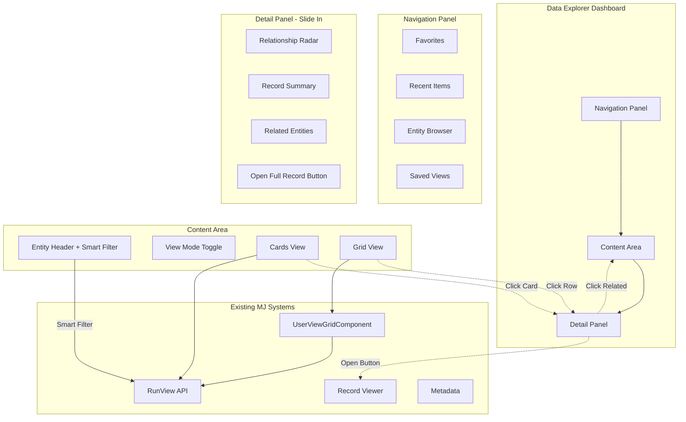
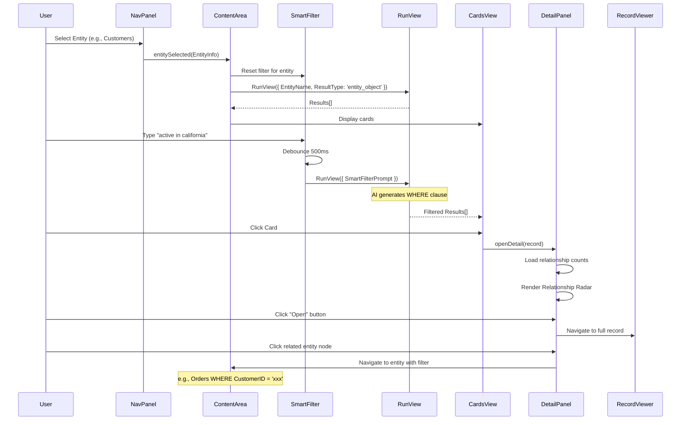
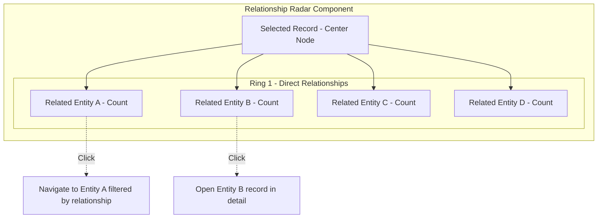
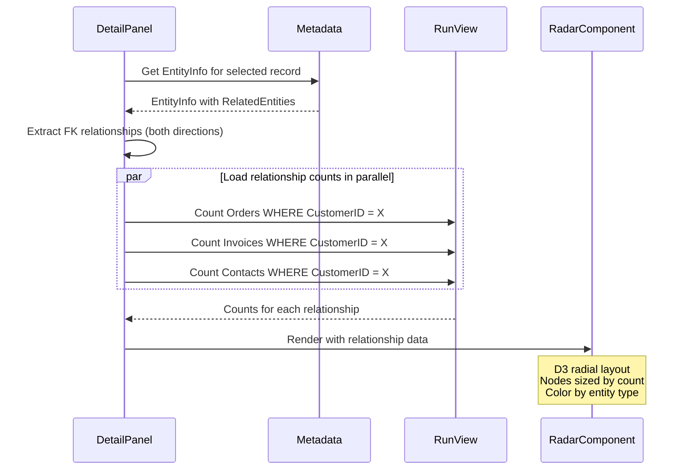
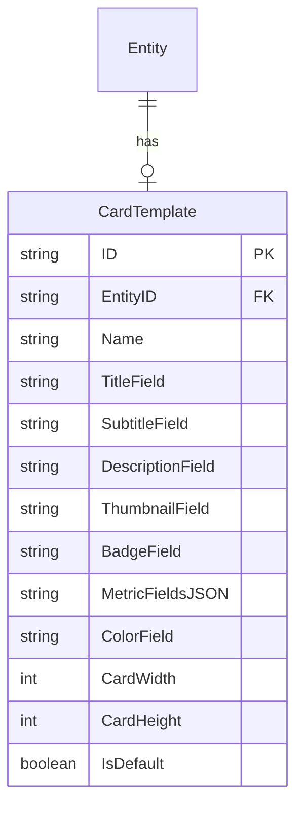
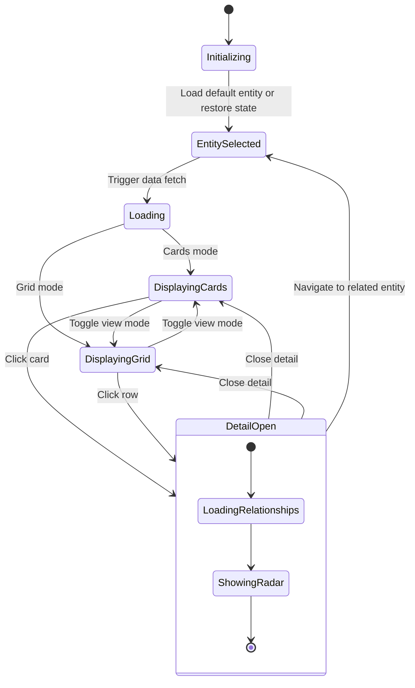
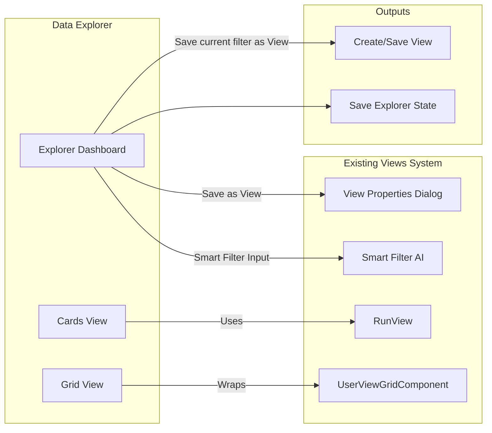
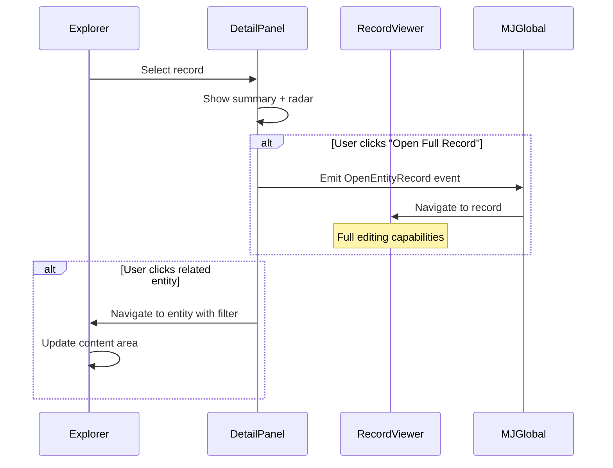

# Data Explorer Dashboard - Design Plan

## Executive Summary

A power-user-focused dashboard for exploring data across the MemberJunction ecosystem. Combines visual card-based browsing with grid views, leveraging the existing Views system while adding relationship visualization capabilities.

**Target User**: Power users (not DBAs/admins) who need to navigate, search, browse, and understand data relationships quickly and intuitively.

**Core Philosophy**: Stitch together existing building blocks (Views, Record Viewer, Entity Forms) with new visual exploration capabilities.

---

## Problem Statement

### Current State
- Views provide powerful grid-based data display with natural language filtering
- Record Viewer provides full entity editing/viewing
- Entity Admin Dashboard provides ERD visualization for admins
- **Gap**: No unified exploration experience that lets users visually browse data and understand relationships

### User Needs

| Need | Description |
|------|-------------|
| **Visual Browsing** | See data at a glance without opening each record |
| **Relationship Discovery** | "What's connected to this record?" |
| **Quick Navigation** | Jump between related records seamlessly |
| **Multiple Views** | Switch between cards and grids based on task |
| **Smart Filtering** | Natural language queries (already built!) |
| **History Tracking** | "Where was I just looking?" |

---

## High-Level Architecture



---

## Component Architecture

```mermaid
graph TB
    subgraph "DataExplorerDashboardComponent"
        direction TB
        BASE[extends BaseDashboard]
        STATE[Dashboard State Management]
    end

    subgraph "Child Components"
        NP[NavigationPanelComponent]
        CA[ContentAreaComponent]
        DP[RecordDetailPanelComponent]
    end

    DataExplorerDashboardComponent --> NP
    DataExplorerDashboardComponent --> CA
    DataExplorerDashboardComponent --> DP

    subgraph "NavigationPanelComponent"
        FavSection[FavoritesSectionComponent]
        RecentSection[RecentItemsSectionComponent]
        EntityTree[EntityBrowserComponent]
        ViewsList[SavedViewsListComponent]
    end

    subgraph "ContentAreaComponent"
        EntityHeader[EntityHeaderComponent]
        SmartFilter[SmartFilterInputComponent]
        ViewToggle[ViewModeToggleComponent]
        CardsView[DataCardsViewComponent]
        GridView[DataGridViewComponent]
    end

    subgraph "RecordDetailPanelComponent"
        RadarViz[RelationshipRadarComponent]
        RecordSummary[RecordSummaryComponent]
        RelatedList[RelatedEntitiesListComponent]
        ActionButtons[RecordActionsComponent]
    end

    NP --> FavSection
    NP --> RecentSection
    NP --> EntityTree
    NP --> ViewsList

    CA --> EntityHeader
    CA --> SmartFilter
    CA --> ViewToggle
    CA --> CardsView
    CA --> GridView

    DP --> RadarViz
    DP --> RecordSummary
    DP --> RelatedList
    DP --> ActionButtons
```



---

## Data Flow



---

## UI Mockups

### Main Explorer View - Cards Mode

```
┌─────────────────────────────────────────────────────────────────────────────────┐
│  DATA EXPLORER                                                    [Grid] [Cards]│
├──────────────┬──────────────────────────────────────────────────────────────────┤
│ NAVIGATION   │  CUSTOMERS                                                       │
│              │  ┌─────────────────────────────────────────────────────────────┐ │
│ ★ Favorites  │  │ 🔍 "active customers in california"              [Clear]   │ │
│   Acme Corp  │  │ Smart Filter: Status='Active' AND State='CA'    ✓ Applied  │ │
│   Order #123 │  └─────────────────────────────────────────────────────────────┘ │
│              │                                                                   │
│ ⏱ Recent     │  Showing 24 of 156 customers                    [< 1 2 3 ... >] │
│   Customer   │  ───────────────────────────────────────────────────────────────  │
│   Product    │                                                                   │
│   Invoice    │  ┌─────────────┐  ┌─────────────┐  ┌─────────────┐  ┌──────────┐ │
│              │  │ 🏢 ACME     │  │ 🏢 TECHCO   │  │ 🏢 DATAFLOW │  │ 🏢 GLOB  │ │
│ 📁 Entities  │  │ Corp        │  │ Inc         │  │ LLC         │  │ Services │ │
│ ▶ Customers  │  │             │  │             │  │             │  │          │ │
│   Orders     │  │ San Fran,CA │  │ LA, CA      │  │ Oakland,CA  │  │ SD, CA   │ │
│   Products   │  │ $145K LTV   │  │ $89K LTV    │  │ $234K LTV   │  │ $12K LTV │ │
│   Invoices   │  │ 12 orders   │  │ 5 orders    │  │ 18 orders   │  │ 2 orders │ │
│   Vendors    │  │ ●●●●○       │  │ ●●●○○       │  │ ●●●●●       │  │ ●●○○○    │ │
│   ...        │  │             │  │             │  │             │  │          │ │
│              │  │    [Open]   │  │    [Open]   │  │    [Open]   │  │   [Open] │ │
│ 📋 Views     │  └─────────────┘  └─────────────┘  └─────────────┘  └──────────┘ │
│   CA Cust... │                                                                   │
│   Q4 Orders  │  ┌─────────────┐  ┌─────────────┐  ┌─────────────┐  ┌──────────┐ │
│   Top Prods  │  │ ...         │  │ ...         │  │ ...         │  │ ...      │ │
│              │  └─────────────┘  └─────────────┘  └─────────────┘  └──────────┘ │
└──────────────┴──────────────────────────────────────────────────────────────────┘
```

### Main Explorer View - Grid Mode

```
┌─────────────────────────────────────────────────────────────────────────────────┐
│  DATA EXPLORER                                                    [Grid] [Cards]│
├──────────────┬──────────────────────────────────────────────────────────────────┤
│ NAVIGATION   │  CUSTOMERS                                                       │
│              │  ┌─────────────────────────────────────────────────────────────┐ │
│ ★ Favorites  │  │ 🔍 "active customers in california"              [Clear]   │ │
│   ...        │  └─────────────────────────────────────────────────────────────┘ │
│              │                                                                   │
│ ⏱ Recent     │  ┌─────────────────────────────────────────────────────────────┐ │
│   ...        │  │ Name          │ City      │ State │ LTV      │ Orders │ ★   │ │
│              │  ├───────────────┼───────────┼───────┼──────────┼────────┼─────┤ │
│ 📁 Entities  │  │ Acme Corp     │ San Fran  │ CA    │ $145,000 │ 12     │ ●●●●│ │
│   ...        │  │ TechCo Inc    │ LA        │ CA    │ $89,000  │ 5      │ ●●● │ │
│              │  │ DataFlow LLC  │ Oakland   │ CA    │ $234,000 │ 18     │ ●●●●│ │
│ 📋 Views     │  │ Global Svc    │ San Diego │ CA    │ $12,000  │ 2      │ ●●  │ │
│   ...        │  │ ...           │ ...       │ ...   │ ...      │ ...    │ ... │ │
│              │  └─────────────────────────────────────────────────────────────┘ │
│              │                                                                   │
│              │  ← Leverages existing UserViewGridComponent with all features →  │
└──────────────┴──────────────────────────────────────────────────────────────────┘
```

### Detail Panel with Relationship Radar (Slide-in)

```
┌─────────────────────────────────────────────────────────────────────────────────┐
│                                                                                 │
│  [Cards/Grid dimmed]                      ┌───────────────────────────────────┐ │
│                                           │ ACME CORPORATION              [×] │ │
│                                           ├───────────────────────────────────┤ │
│                                           │                                   │ │
│                                           │  ┌─────────────────────────────┐  │ │
│                                           │  │    RELATIONSHIP MAP         │  │ │
│                                           │  │                             │  │ │
│                                           │  │      [Order]    [Order]     │  │ │
│                                           │  │         ╲        ╱          │  │ │
│                                           │  │    [Inv]─[● ACME ●]─[Ticket]│  │ │
│                                           │  │         ╱        ╲          │  │ │
│                                           │  │   [Contact]   [Address]     │  │ │
│                                           │  │                             │  │ │
│                                           │  │  Click any node to explore  │  │ │
│                                           │  └─────────────────────────────┘  │ │
│                                           │                                   │ │
│                                           │  ▼ DETAILS                        │ │
│                                           │    ID: CUST-1234                  │ │
│                                           │    Status: Active                 │ │
│                                           │    City: San Francisco            │ │
│                                           │    State: CA                      │ │
│                                           │    Lifetime Value: $145,000       │ │
│                                           │                                   │ │
│                                           │  ▼ ORDERS (12)              [→]   │ │
│                                           │    #10234 - $12,500 - Shipped     │ │
│                                           │    #10198 - $8,200 - Delivered    │ │
│                                           │    #10156 - $15,800 - Processing  │ │
│                                           │    [View all orders...]           │ │
│                                           │                                   │ │
│                                           │  ▶ INVOICES (8)             [→]   │ │
│                                           │  ▶ CONTACTS (3)             [→]   │ │
│                                           │  ▶ SUPPORT TICKETS (2)      [→]   │ │
│                                           │                                   │ │
│                                           │  ┌─────────────────────────────┐  │ │
│                                           │  │     [ Open Full Record ]    │  │ │
│                                           │  └─────────────────────────────┘  │ │
│                                           └───────────────────────────────────┘ │
└─────────────────────────────────────────────────────────────────────────────────┘
```

---

## Relationship Radar - Detailed Design

The Relationship Radar is a simplified, record-centric version of the ERD visualization.



### Radar Data Loading Strategy



### Radar Node Interactions

| Interaction | Behavior |
|-------------|----------|
| **Hover** | Show tooltip with entity name, relationship type, count |
| **Click (count > 1)** | Navigate main content to that entity filtered by FK |
| **Click (count = 1)** | Open that single record in detail panel |
| **Center node click** | Open full record viewer |

---

## Card Templates System

Cards need configurable layouts per entity type.

### Card Template Entity (New Metadata)



### Default Card Layout (No Template)

When no template exists, auto-generate from entity metadata:

```typescript
interface AutoCardTemplate {
  titleField: string;      // First string field marked as "Name" or entity's NameField
  subtitleField: string;   // Status or Type field if exists
  metricFields: string[];  // First 2-3 numeric fields
  thumbnailField: string;  // First image/URL field if exists
}
```

### Card Component Structure

```
┌─────────────────────────────────────────┐
│ [Thumbnail/Icon]                        │
│                                         │
│ TITLE FIELD (Name)                      │
│ Subtitle (Status/Type)                  │
│                                         │
│ Metric 1: $XXX    Metric 2: XX          │
│ ●●●●○ (Rating/Score if available)       │
│                                         │
│                           [Open]        │
└─────────────────────────────────────────┘
```

---

## State Management



### Dashboard State Interface

```typescript
interface DataExplorerState {
  // Navigation panel
  navigationPanelWidth: number;
  navigationPanelCollapsed: boolean;

  // Current context
  selectedEntityName: string | null;
  selectedViewId: string | null;

  // Smart filter
  smartFilterPrompt: string;
  smartFilterEnabled: boolean;

  // View mode
  viewMode: 'cards' | 'grid';

  // Detail panel
  detailPanelOpen: boolean;
  detailPanelWidth: number;
  selectedRecordId: string | null;

  // Radar
  radarDepth: 1 | 2;

  // Section states
  favoritesSectionExpanded: boolean;
  recentSectionExpanded: boolean;
  entitiesSectionExpanded: boolean;
  viewsSectionExpanded: boolean;

  // Recent items (persisted)
  recentItems: RecentItem[];

  // Favorites (persisted)
  favorites: FavoriteItem[];
}

interface RecentItem {
  entityName: string;
  recordId: string;
  displayName: string;
  timestamp: Date;
}

interface FavoriteItem {
  type: 'record' | 'view' | 'entity';
  entityName?: string;
  recordId?: string;
  viewId?: string;
  displayName: string;
}
```

---

## Integration with Existing Systems

### Views Integration



### Record Viewer Integration



---

## Implementation Phases

### Phase 1: Foundation (MVP)
- [ ] DataExplorerDashboardComponent shell
- [ ] NavigationPanelComponent with entity browser
- [ ] ContentAreaComponent with entity header
- [ ] DataCardsViewComponent (basic cards, auto-template)
- [ ] View mode toggle (Cards ↔ Grid using UserViewGridComponent)
- [ ] Smart filter input (leverage existing infrastructure)

### Phase 2: Detail Panel
- [ ] RecordDetailPanelComponent (slide-in)
- [ ] RecordSummaryComponent
- [ ] RelatedEntitiesListComponent
- [ ] "Open Full Record" button integration
- [ ] Click-to-navigate for related entities

### Phase 3: Relationship Radar
- [ ] RelationshipRadarComponent (D3 radial visualization)
- [ ] Relationship count loading (batched)
- [ ] Node interactions (hover, click)
- [ ] Animation and visual polish

### Phase 4: Navigation Enhancements
- [ ] Recent items tracking
- [ ] Favorites system (pin records/views)
- [ ] Saved Views list integration
- [ ] State persistence (user preferences)

### Phase 5: Card Templates
- [ ] CardTemplate entity (metadata)
- [ ] Card template editor (admin)
- [ ] Per-entity card customization
- [ ] Smart defaults for entities without templates

### Phase 6: Polish & Advanced Features
- [ ] Keyboard navigation
- [ ] Drag to reorder favorites
- [ ] Multi-select cards for bulk actions
- [ ] Export selected records
- [ ] Dark mode support

---

## Technical Considerations

### Performance

| Concern | Mitigation |
|---------|------------|
| Large entity lists | Virtual scroll in cards view |
| Relationship counts | Batch load with RunViews (plural) |
| Card rendering | OnPush change detection |
| Detail panel | Lazy load related data |
| State persistence | Debounced saves (1000ms) |

### Accessibility

- Keyboard navigation for cards (arrow keys)
- ARIA labels for radar nodes
- Screen reader announcements for state changes
- Focus management when panel opens/closes

### Responsive Design

- Collapsible navigation panel on smaller screens
- Cards reflow based on container width
- Detail panel becomes full-screen on mobile
- Touch-friendly interactions for radar

---

## File Structure

```
packages/Angular/Explorer/dashboards/src/
├── DataExplorer/
│   ├── data-explorer-dashboard.component.ts
│   ├── data-explorer-dashboard.component.html
│   ├── data-explorer-dashboard.component.scss
│   │
│   ├── components/
│   │   ├── navigation-panel/
│   │   │   ├── navigation-panel.component.ts
│   │   │   ├── favorites-section.component.ts
│   │   │   ├── recent-items-section.component.ts
│   │   │   ├── entity-browser.component.ts
│   │   │   └── saved-views-list.component.ts
│   │   │
│   │   ├── content-area/
│   │   │   ├── content-area.component.ts
│   │   │   ├── entity-header.component.ts
│   │   │   ├── smart-filter-input.component.ts
│   │   │   ├── view-mode-toggle.component.ts
│   │   │   ├── data-cards-view.component.ts
│   │   │   └── data-card.component.ts
│   │   │
│   │   └── detail-panel/
│   │       ├── record-detail-panel.component.ts
│   │       ├── relationship-radar.component.ts
│   │       ├── record-summary.component.ts
│   │       ├── related-entities-list.component.ts
│   │       └── record-actions.component.ts
│   │
│   ├── services/
│   │   ├── explorer-state.service.ts
│   │   ├── recent-items.service.ts
│   │   └── card-template.service.ts
│   │
│   ├── models/
│   │   ├── explorer-state.interface.ts
│   │   ├── card-template.interface.ts
│   │   └── relationship-data.interface.ts
│   │
│   └── index.ts
```

---

## Open Questions

1. **Card Template Storage**: New entity vs. JSON in existing entity metadata?
2. **Search Scope**: Should explorer search across all entities or just selected?
3. **Radar Performance**: Pre-compute relationship counts vs. load on demand?
4. **View Saving**: Allow saving explorer state as a new View type?
5. **Entity Permissions**: Show all entities or only those user can access?

---

## Success Metrics

- **Adoption**: % of power users using explorer vs. direct navigation
- **Efficiency**: Time to find related records (before vs. after)
- **Satisfaction**: User feedback on visual browsing experience
- **Performance**: Page load time, interaction responsiveness

---

## References

- Entity Admin Dashboard: `packages/Angular/Explorer/dashboards/src/EntityAdmin/`
- Views System: `packages/MJCore/src/views/`
- UserViewGridComponent: `packages/Angular/Explorer/`
- BaseDashboard: `packages/Angular/Explorer/dashboards/src/generic/base-dashboard.ts`
- D3.js Documentation: https://d3js.org/

---

*Created: November 2025*
*Status: Design Phase*
