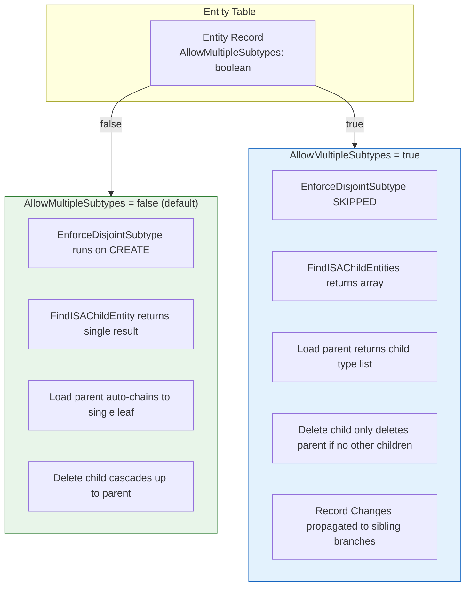
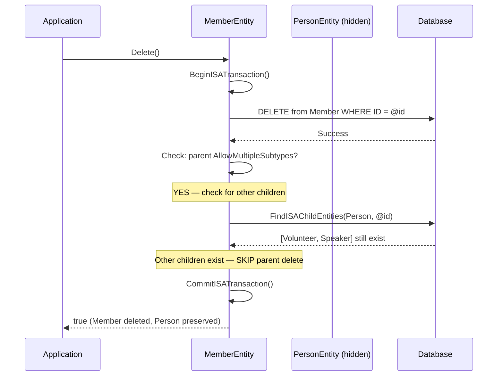

# IS-A Overlapping Subtypes — Implementation Plan

**Status: COMPLETE** — All phases implemented and verified.

## Table of Contents
1. [Overview](#overview)
2. [Problem Statement](#problem-statement)
3. [Solution Design](#solution-design)
4. [Column Naming Decision](#column-naming-decision)
5. [Behavior Specification](#behavior-specification)
6. [Record Changes for Overlapping Subtypes](#record-changes-for-overlapping-subtypes)
7. [Cross-Branch Validation](#cross-branch-validation)
8. [Database Changes](#database-changes)
9. [Implementation Tasks](#implementation-tasks)
10. [Implementation Notes — Divergences from Original Plan](#implementation-notes--divergences-from-original-plan)
11. [Resolved Decisions](#resolved-decisions)
12. [Future Work](#future-work)

---

## Overview

The IS-A type system currently enforces **disjoint subtypes** — a parent record can only be ONE child type at a time. This works perfectly for hierarchies like Product -> Meeting | Publication (a product is either a meeting or a publication, never both).

However, real-world domain modeling frequently requires **overlapping subtypes** — a single Person can simultaneously be a Member, a Volunteer, a Speaker, and a Reviewer. The current disjoint constraint prevents this.

This plan adds a single configurable flag on the Entity table that controls whether an entity's child types are exclusive (disjoint, current behavior) or allow multiple simultaneous subtypes. The change is minimal because the existing IS-A infrastructure (save chains, field routing, transactions, child discovery) already works correctly — the disjoint enforcement is a thin check layered on top.

**Motivation**: This enhancement directly unblocks the MJ BizApps Common initiative, which requires Person and Organization base entities with overlapping child types for association management applications (committees, mentoring, volunteering, abstract submission, awards, etc.).

---

## Problem Statement

### The Disjoint Constraint

Today, `EnforceDisjointSubtype()` in `BaseEntity._InnerSave()` runs a batch query across all sibling child tables during CREATE operations. If any sibling already has a record with the same PK, the save throws:

```
Cannot create Members record: ID 'abc-123' already exists as Volunteers.
A Persons record can only be one child type at a time.
```

This is correct for type hierarchies where subtypes are mutually exclusive:

```
Product (disjoint — a product IS one thing)
  |-- Meeting
  |-- Publication
  +-- Webinar (child of Meeting)
```

But it fails for identity hierarchies where subtypes represent roles:

```
Person (overlapping — a person wears many hats)
  |-- Member          <-- same person can be all of these
  |-- Volunteer       <-- simultaneously
  |-- Speaker
  +-- Reviewer
```

### What Works Today (No Changes Needed)

The rest of the IS-A system handles overlapping subtypes naturally:

- **Save chains**: Saving a Member saves Person -> Member in a transaction. Saving a Volunteer for the same person saves Person -> Volunteer in a separate transaction. These are independent operations that don't conflict.
- **Field routing**: `member.Set('Name', 'Jane')` routes to Person. `member.Set('MembershipLevel', 'Gold')` stays on Member. No ambiguity — you always work through a specific child type.
- **Transactions**: Each save chain has its own transaction scope. No cross-chain coordination needed.
- **CodeGen**: Views, SPs, GraphQL input types, TypeScript classes — all generated per child entity, unaffected by sibling subtypes.
- **Dirty tracking**: Each entity checks its own fields + parent dirty state. This is per-chain and doesn't involve siblings. No change needed.
- **GetAll()**: Parent `GetAll()` returns only parent fields. Child `GetAll()` returns parent + child merged fields. Parent never includes child fields. This pattern extends cleanly to overlapping subtypes.

### What Needs to Change

1. **Disjoint enforcement**: Skip the sibling check when the parent entity allows multiple types
2. **Child discovery**: Return multiple results instead of assuming at most one
3. **Loading a parent entity**: When overlapping, don't auto-chain to a single child — present the list of existing child types
4. **Delete behavior**: Don't cascade-delete the parent when other children still exist
5. **Record Changes**: Propagate ancestor-level changes to sibling branches for complete audit history
6. **UI**: Show "also exists as: Member, Volunteer, Speaker" instead of auto-navigating to a single leaf

---

## Solution Design

### Core Principle

Add one boolean column to the Entity table. When false (default), behavior is identical to today. When true, the disjoint enforcement check is skipped and child discovery returns a list.

### Architecture Impact



### Object Model: Overlapping vs Disjoint

**Disjoint (current — unchanged):**
```
Load Meeting #abc -> auto-discovers Webinar child -> chains to leaf
meeting.ISAChild = WebinarEntity (single)
meeting.LeafEntity = WebinarEntity
meeting.Save() -> delegates to leaf -> saves full chain
```

**Overlapping (new):**
```
Load Person #abc -> discovers [Member, Volunteer, Speaker] children -> does NOT auto-chain
person.ISAChild = null (no single child to chain to)
person.ISAChildren = [info about Member, Volunteer, Speaker] (new: list of child type info)
person.Save() -> saves Person only (no delegation — no single leaf)

Load Member #abc -> chains to Person parent (upward chain works as today)
member.ISAParent = PersonEntity
member.Save() -> saves Person -> Member (normal IS-A save chain)
```

The key insight: **when you work through a child type, everything works exactly as today.** The only behavioral change is when you load the parent entity directly.

### BaseEntity Internal Fields: `_childEntity` vs `_childEntities`

Two private fields serve fundamentally different roles:

- **`_childEntity`** (`BaseEntity | null`) — **Disjoint only.** A live composition chain link for save/delete orchestration and `LeafEntity` traversal. Points to the single child entity in the chain.

- **`_childEntities`** (`{ entityName: string }[] | null`) — **Overlapping only.** An informational list of which child entity types have records for this PK. Used for UI display (IS-A related panel, breadcrumb tree) and Record Change propagation. Does NOT participate in save/delete orchestration.

For overlapping parents, `ISAChild` returns `null` and `ISAChildren` returns the list. For disjoint parents, the reverse: `ISAChild` returns the chained entity and `ISAChildren` returns `null`.

### Why No `LoadChildType()` Method Is Needed

When you have a parent loaded with overlapping subtypes and want to work through a specific child type, just call `GetEntityObject` for that child type directly:

```typescript
const member = await md.GetEntityObject<MemberEntity>('Members', compositeKey);
```

This loads the Member view (which JOINs to Person), initializes the parent chain, and gives you full access to Person fields via IS-A routing. A specialized `LoadChildType()` method was considered but provides no meaningful savings — you still need to hit the DB for the child-specific fields since they live in a different table. The standard `GetEntityObject` path handles this perfectly.

---

## Column Naming Decision

The new column on the Entity table needs a name. Candidates considered:

| Column Name | Default | To Enable | Style Match | Readability |
|---|---|---|---|---|
| `AllowMultipleTypes` | `0` | Set to `1` | Matches `AllowCreateAPI`, `AllowUpdateAPI` pattern | "Types" is overloaded in TypeScript codebases |
| **`AllowMultipleSubtypes`** | `0` | Set to `1` | Matches `AllowXxxAPI` pattern AND uses IS-A terminology | "Person allows multiple subtypes" (precise, clear) |
| `DisjointSubtypes` | `1` | Set to `0` | Matches code terminology (`EnforceDisjointSubtype`) | "Person disjoint subtypes = false" (double negative) |
| `ExclusiveSubtypes` | `1` | Set to `0` | More accessible than "disjoint" | Same double-negative issue |
| `OverlappingTypes` | `0` | Set to `1` | Direct intent | No existing precedent in codebase |

**Selected**: `AllowMultipleSubtypes` — follows the `AllowXxxAPI` naming convention already on Entity, default `false` preserves current behavior, `Person.AllowMultipleSubtypes = true` reads naturally, and "subtypes" directly ties to IS-A terminology used throughout the codebase.

---

## Behavior Specification

### Behavior Matrix

| Scenario | AllowMultipleSubtypes = false (disjoint) | AllowMultipleSubtypes = true (overlapping) |
|----------|:---:|:---:|
| **Create child when no siblings exist** | Allowed | Allowed |
| **Create child when sibling exists** | **BLOCKED** (disjoint violation) | Allowed |
| **Load parent -> child discovery** | Returns single child, auto-chains | Returns array of children, no auto-chain |
| **Save via child entity** | Saves parent -> child chain (transaction) | Same — no change |
| **Save via parent entity (with child)** | Delegates to single leaf | Saves parent only (no single leaf) |
| **Delete child entity** | Deletes child -> parent (full chain) | Deletes child; deletes parent **only if no other children** |
| **Delete parent entity directly** | Blocked if children exist (unless CascadeDeletes) | Blocked if children exist (unless CascadeDeletes) |
| **Field routing (Set/Get)** | Routes through chain | Same — no change |
| **Dirty tracking** | Checks own fields + parent dirty state | Same — no change (per-chain only) |
| **Validation** | Validates active chain only | Same — validates active chain only (see [Cross-Branch Validation](#cross-branch-validation)) |
| **Record Changes** | One entry per entity in save chain | Same for active chain + **propagated entries for sibling branches** (see [Record Changes](#record-changes-for-overlapping-subtypes)) |
| **CodeGen (views, SPs, classes)** | No change | No change |
| **Polymorphic leaf resolution** | Deterministic (single leaf) | Non-deterministic (multiple possible leaves) |

### Child Discovery: Single vs Multiple

**Current** (`FindISAChildEntity` — singular):
```typescript
// Returns { ChildEntityName: string } | null
// Assumes at most one result from UNION ALL
```

**New** (`FindISAChildEntities` — plural, new method):
```typescript
// Returns { ChildEntityName: string }[] (array, possibly empty)
// Used when parent AllowMultipleSubtypes = true
```

The existing `FindISAChildEntity` (singular) remains unchanged for disjoint parents. A new `FindISAChildEntities` (plural) method is added for overlapping parents. `InitializeChildEntity()` checks the flag and calls the appropriate method.

### Delete Safety for Overlapping Subtypes

When deleting a child in an overlapping hierarchy, the parent must NOT be deleted if other children still reference it:



If no other children exist, the delete proceeds up the chain as normal.

---

## Record Changes for Overlapping Subtypes

### The Problem

When saving through one branch of an overlapping hierarchy, Record Change entries are only created for entities in the active save chain. Sibling branches that share the same ancestor get no Record Change entries, even though their composite views include the changed ancestor fields.

**Example**: Person -> [Member (active), Speaker, Volunteer]. Saving `Member.FirstName = 'Jane'` creates Record Changes for Person and Member, but Speaker and Volunteer's history is blind to the FirstName change.

### Design Decision: Write-Time Denormalization

We propagate Record Change entries to **all active sibling branches** during the save, within the same database transaction. This preserves the existing denormalization pattern (where each entity in a chain gets its own Record Change with `FullRecordJSON`) and extends it to sibling branches that are affected by ancestor-level changes.

### Architecture: Provider-Level Propagation

> **Implementation note**: The original plan placed propagation logic on `BaseEntity` with a `_lastSaveRecordChangeData` transient property. During implementation, this was **refactored to the provider level** (SQLServerDataProvider) for several reasons:
> 1. **Entry point coverage**: Provider-level propagation fires for ALL save paths — chain saves from leaves, direct parent saves, and server-side GraphQL mutations — without relying on BaseEntity orchestration.
> 2. **Simpler data flow**: Change data flows via `GetSaveSQLWithDetails()` return value (`overlappingChangeData`) instead of a transient property on the entity.
> 3. **No public API surface**: `_lastSaveRecordChangeData` was removed from BaseEntity, keeping the public API clean.

The actual implementation:
- `GetSaveSQLWithDetails()` computes the diff and returns `overlappingChangeData` alongside the SQL
- `Save()` checks three conditions after successful save: `overlappingChangeData` exists, `AllowMultipleSubtypes = true`, `TrackRecordChanges = true`
- `PropagateRecordChangesToSiblings()` generates and executes a single SQL batch
- `ISAActiveChildEntityName` on `EntitySaveOptions` communicates which branch to skip

### Change Segmentation

Each overlapping branch point propagates only its own level's changes. This prevents siblings from receiving changes they can't see:

```
Person (overlapping)
  overlappingChangeData = {FirstName: old/new}         <-- Person-only changes
  |
  |-- Member
  |     |
  |     +-- GoldMember (active leaf)
  |
  |-- Speaker (sibling at Person level)
  |     +-- KeynoteSpeaker
  |           Gets: {FirstName: old/new} only -- NO MemberLevel or GoldTier
  |
  +-- Volunteer (sibling at Person level)
        Gets: {FirstName: old/new} only -- NO MemberLevel or GoldTier
```

### Implementation: Single SQL Batch (Provider-Level)

The entire propagation executes as **one SQL Server network round-trip** by generating a single SQL batch from metadata knowledge. No runtime discovery queries are needed — the entity tree structure is known from `EntityInfo.ChildEntities` (recursively). Runtime existence checks are folded into the batch via `IF @var IS NOT NULL`.

#### Provider Method: `PropagateRecordChangesToSiblings()`

Located in `SQLServerDataProvider.Save()`, called after the main save completes:

```typescript
// In Save(), after successful save:
if (sqlDetails.overlappingChangeData
    && entity.EntityInfo.AllowMultipleSubtypes
    && entity.EntityInfo.TrackRecordChanges) {
  await this.PropagateRecordChangesToSiblings(
    entity.EntityInfo,
    sqlDetails.overlappingChangeData,
    entity.PrimaryKey.Values(),
    user?.ID ?? '',
    options.ISAActiveChildEntityName,
    entity.ProviderTransaction as sql.Transaction ?? undefined
  );
}
```

#### `ISAActiveChildEntityName` — Skip the Active Branch

When a child entity saves its parent (chain save), it passes its own entity name as `ISAActiveChildEntityName` in `EntitySaveOptions`. The provider uses this to skip the active branch during propagation — that branch already has its own Record Change from the normal save flow.

For direct parent saves (no child initiated the save), `ISAActiveChildEntityName` is undefined, so all children receive propagated Record Changes.

#### Generated SQL Batch

Each entity in the divergent sub-tree gets one block in the batch:

```sql
-- Speaker (sibling branch of Person)
DECLARE @_rc_prop_0 NVARCHAR(MAX) = (
    SELECT * FROM [dbo].[vwSpeakers] WHERE [ID] = 'pk-value'
    FOR JSON PATH, WITHOUT_ARRAY_WRAPPER
);
IF @_rc_prop_0 IS NOT NULL
    EXEC [__mj].spCreateRecordChange_Internal
        @EntityName='Speakers', @RecordID='ID|pk-value',
        @UserID='user-id', @Type='Update',
        @ChangesJSON='ancestor-changes-json',
        @ChangesDescription='ancestor-changes-desc',
        @FullRecordJSON=@_rc_prop_0, @Status='Complete', @Comments=NULL;
```

#### RecordID Format: CompositeKey Convention

RecordID values use the CompositeKey format (`FieldName|Value` for single PKs, `Field1|Value1||Field2|Value2` for composites) to match the convention used by the main save flow and the UI Record Changes History panel. This was a critical fix discovered during testing — raw PK values caused the UI to fail to display sibling Record Changes.

**Key properties of this approach:**

- **Zero discovery queries**: Entity tree structure known from metadata
- **One SQL round-trip**: Single batch handles existence checks (`IF NOT NULL`), full record retrieval (`FOR JSON`), and Record Change creation (`spCreateRecordChange_Internal`) for all sibling entities
- **Atomic**: Runs within the existing IS-A transaction — if anything fails, everything rolls back
- **No wasted writes**: If a sibling entity has no record for this PK, the `SELECT ... FOR JSON` returns NULL and the INSERT is skipped
- **Correct segmentation**: Each branch point propagates only its own level's changes
- **No BaseEntity loading**: Works entirely at the SQL level — no entity instantiation, validation, or save pipeline for siblings
- **All entry points covered**: Fires for chain saves, direct parent saves, and server-side GraphQL mutations

### Performance Analysis

For a typical hierarchy (Person with 3 overlapping children, each being a leaf):

| Operation | Count |
|-----------|-------|
| Build SQL batch from metadata | 0 DB queries (metadata only) |
| Execute batch | 1 round-trip |
| Within batch: SELECT per sibling | 3 (one per sibling entity) |
| Within batch: INSERT per sibling | 3 (one Record Change each) |

Total: **1 additional SQL Server round-trip** per save, only when:
- `AllowMultipleSubtypes = true` at some level in the chain
- `TrackRecordChanges` is enabled on the parent entity
- The ancestor's `overlappingChangeData` has actual changes
- There are sibling child entities defined in metadata

---

## Cross-Branch Validation

### Known Limitation

When saving through one branch of an overlapping subtype hierarchy, **only the active chain is validated**. Sibling branches are not loaded or validated.

**Example**: Speaker has a custom `Validate()` that checks `Person.FirstName.length + Speaker.SpecialField.length <= 40`. If you change `Person.FirstName` through the Member chain, Speaker's validation does not run.

### Design Decision: Accept and Document

Loading all sibling entities for validation on every save would add disproportionate overhead for a rare edge case. Cross-subtype validation rules (where a rule on one child type depends on fields from a sibling child type) are uncommon in practice.

### Recommended Patterns for Cross-Subtype Validation

If cross-subtype validation is required, implementers have three options:

#### 1. Parent-Level Validation (Recommended for Shared Fields)

If a rule depends only on parent fields (e.g., `FirstName.length + LastName.length <= 30`), add it to the parent entity's `Validate()`. It runs regardless of which child chain initiates the save.

```typescript
// On PersonEntity custom subclass
Validate(): ValidationResult {
    const result = super.Validate();
    if (this.Get('FirstName').length + this.Get('LastName').length > 30) {
        result.Errors.push({ Source: 'Person', Message: 'Name too long', ...});
        result.Success = false;
    }
    return result;
}
```

#### 2. Database Constraints (Recommended for Hard Cross-Entity Rules)

For rules involving fields from multiple branches, use SQL Server CHECK constraints or triggers. These enforce at the database level regardless of which application path triggers the write.

```sql
-- Trigger-based cross-subtype validation
CREATE TRIGGER TR_Person_CrossSubtypeValidation ON Person
AFTER UPDATE AS
BEGIN
    -- Check Speaker constraint when Person name changes
    IF EXISTS (
        SELECT 1 FROM inserted i
        JOIN Speaker s ON i.ID = s.ID
        WHERE LEN(i.FirstName) + LEN(i.LastName) + LEN(s.SpecialField) > 40
    )
    BEGIN
        RAISERROR('Combined name + speaker field exceeds 40 characters', 16, 1);
        ROLLBACK;
    END
END
```

#### 3. Custom Save Override (For Application-Level Cross-Branch Rules)

Override `_InnerSave()` on the child entity to load and validate specific sibling entities before proceeding. This is opt-in per entity and only incurs cost when explicitly enabled.

```typescript
// On MemberEntity custom subclass
protected async _InnerSave(options?: EntitySaveOptions): Promise<boolean> {
    // Load Speaker sibling and validate cross-branch rule
    if (this.EntityInfo.ParentEntityInfo?.AllowMultipleSubtypes) {
        const speaker = await md.GetEntityObject<SpeakerEntity>('Speakers', this.PrimaryKey);
        if (speaker.IsSaved) {
            const totalLen = this.Get('FirstName').length + speaker.Get('SpecialField').length;
            if (totalLen > 40) {
                throw new Error('Combined name + speaker field exceeds 40 characters');
            }
        }
    }
    return super._InnerSave(options);
}
```

---

## Database Changes

### Migration: Add AllowMultipleSubtypes Column

**File**: `migrations/v4/V202602141421__v4.5.x__Add_AllowMultipleSubtypes_to_Entity.sql`

```sql
-- Add AllowMultipleSubtypes column to Entity table
-- Default false (0) preserves current disjoint behavior for all existing entities
ALTER TABLE ${flyway:defaultSchema}.Entity
ADD AllowMultipleSubtypes BIT NOT NULL
    CONSTRAINT DF_Entity_AllowMultipleSubtypes DEFAULT 0;

-- Add description
EXEC sp_addextendedproperty
    @name = N'MS_Description',
    @value = N'When false (default), child types are disjoint - a record can only be one child type at a time. When true, a record can simultaneously exist as multiple child types (e.g., a Person can be both a Member and a Volunteer).',
    @level0type = N'SCHEMA', @level0name = N'${flyway:defaultSchema}',
    @level1type = N'TABLE',  @level1name = N'Entity',
    @level2type = N'COLUMN', @level2name = N'AllowMultipleSubtypes';
```

No indexes needed — this column is read at metadata load time, not queried at runtime.

---

## Implementation Tasks

### Phase 1: Database Schema & Metadata

- [x] **1.1** Create migration file adding `AllowMultipleSubtypes BIT NOT NULL DEFAULT 0` to Entity table
- [x] **1.2** Run CodeGen to sync EntityField metadata and regenerate entity classes
- [x] **1.3** Verify `MJEntityEntity` class has `AllowMultipleSubtypes` getter/setter in generated code

---

### Phase 2: EntityInfo Updates

**File**: `packages/MJCore/src/generic/entityInfo.ts`

- [x] **2.1** Add `AllowMultipleSubtypes` property to `EntityInfo` class (read from metadata)
- [x] **2.2** Update `ChildEntities` JSDoc to reference the new overlapping behavior
- [x] **2.3** Add computed property `HasOverlappingSubtypes: boolean` (alias for readability in consuming code)

---

### Phase 3: Disjoint Enforcement Bypass

**File**: `packages/MJCore/src/generic/baseEntity.ts`

- [x] **3.1** Modify `_InnerSave()` guard condition to check `AllowMultipleSubtypes`
- [x] **3.2** Update `EnforceDisjointSubtype()` JSDoc to note it is only called for disjoint parents
- [x] **3.3** Add unit test: create two child types for same PK when `AllowMultipleSubtypes = true` -> succeeds
- [x] **3.4** Add unit test: create two child types for same PK when `AllowMultipleSubtypes = false` -> still fails

---

### Phase 4: Child Discovery for Overlapping Parents

- [x] **4.1** Add `FindISAChildEntities` method to `SQLServerDataProvider`
- [x] **4.2** Add `FindISAChildEntities` to `IEntityDataProvider` interface
- [x] **4.3** Add `FindISAChildEntities` to `GraphQLDataProvider` (calls server resolver)
- [x] **4.4** Add `FindISAChildEntities` GraphQL query resolver in `ISAEntityResolver`

---

### Phase 5: BaseEntity — Overlapping Child Initialization

**File**: `packages/MJCore/src/generic/baseEntity.ts`

- [x] **5.1** Add `_childEntities: { entityName: string }[] | null` field alongside existing `_childEntity`
- [x] **5.2** Modify `InitializeChildEntity()` to branch on `AllowMultipleSubtypes`
- [x] **5.3** Implement `discoverOverlappingChildren()`
- [x] **5.4** Add public accessor `ISAChildren`
- [x] **5.5** Update `ISAChild` getter to return null for overlapping parents
- [x] **5.6** Update `LeafEntity` getter: for overlapping parents, return `this`
- [x] **5.7** Update save delegation: skip leaf delegation when `AllowMultipleSubtypes = true`

---

### Phase 6: Delete Safety for Overlapping Subtypes

**File**: `packages/MJCore/src/generic/baseEntity.ts`

- [x] **6.1** Modify delete orchestration to check for remaining siblings before parent delete
- [x] **6.2** Add unit test: delete Member when Volunteer exists -> Person preserved
- [x] **6.3** Add unit test: delete Member when no other children exist -> Person also deleted
- [x] **6.4** Add unit test: delete in disjoint hierarchy -> unchanged behavior

---

### Phase 7: Record Change Propagation to Sibling Branches

> **Architectural change**: Originally planned for `BaseEntity` with `_lastSaveRecordChangeData`. Refactored to `SQLServerDataProvider` during implementation. See [Implementation Notes](#implementation-notes--divergences-from-original-plan).

**File**: `packages/SQLServerDataProvider/src/SQLServerDataProvider.ts`

- [x] **7.1** Add `PropagateRecordChangesToSiblings()` method to `SQLServerDataProvider`, called from `Save()` after successful save when overlapping conditions are met
- [x] **7.2** Add `getFullSubTree()` helper (recursive metadata-only sub-tree enumeration) — implemented as `isEntityOrAncestorOf()` for active branch skipping
- [x] **7.3** Add `buildSiblingRecordChangeSQL()` helper with CompositeKey RecordID format
- [x] **7.4** Wire propagation into `Save()` with three-condition guard (overlappingChangeData, AllowMultipleSubtypes, TrackRecordChanges)
- [x] **7.5** Add `ISAActiveChildEntityName` to `EntitySaveOptions` for active branch communication
- [x] **7.6** Return `overlappingChangeData` from `GetSaveSQLWithDetails()` for provider-level access
- [x] **7.7** Fix RecordID format to use CompositeKey convention (`FieldName|Value`)

---

### Phase 8: UI Updates

**Files**: `packages/Angular/Generic/base-forms/`, `packages/Angular/Explorer/core-entity-forms/`

- [x] **8.1** Update IS-A breadcrumb/badges with recursive descendant tree and CSS connector lines
- [x] **8.2** Add IS-A related panel (`MjIsaRelatedPanelComponent` + `MjIsaRelatedCardComponent`) showing sibling/child entity records with DefaultInView fields
- [x] **8.3** Related panel integrates into record-form-container with flex layout, hidden in edit mode

---

### Phase 9: Documentation Updates

- [x] **9.1** Update `packages/MJCore/docs/isa-relationships.md` with overlapping subtypes documentation
- [x] **9.2** Update `plans/entity-system-enhancements-virtual-and-supertype.md` — mark overlapping subtypes as implemented

---

### Phase 10: Testing & Validation

- [x] **10.1** Unit tests: MJCore — 308 tests passing (overlapping discovery, save/delete orchestration, disjoint regression)
- [x] **10.2** Unit tests: SQLServerDataProvider — 73 tests passing
- [x] **10.3** Manual end-to-end: create multiple child types for same PK -> succeeds
- [x] **10.4** Manual end-to-end: save from leaf -> Record Changes propagated to siblings
- [x] **10.5** Manual end-to-end: save from parent directly -> Record Changes propagated to ALL children
- [x] **10.6** Manual end-to-end: RecordID format displays correctly in UI Record Changes History
- [x] **10.7** Manual end-to-end: IS-A related panel loads and displays sibling records
- [x] **10.8** Manual end-to-end: existing disjoint hierarchies completely unaffected

---

## Implementation Notes — Divergences from Original Plan

Several aspects of the implementation diverged from the original plan during development. These are documented here for traceability.

### 1. Record Change Propagation Moved from BaseEntity to SQLServerDataProvider

**Plan**: `PropagateRecordChangesToSiblingBranches()` on BaseEntity, using `_lastSaveRecordChangeData` transient property populated during `PrepareSave()`.

**Actual**: `PropagateRecordChangesToSiblings()` on SQLServerDataProvider, called from `Save()`. Change data flows via `GetSaveSQLWithDetails()` return value (`overlappingChangeData`). `_lastSaveRecordChangeData` was added then removed from BaseEntity.

**Why**: The BaseEntity approach only worked for chain saves initiated from a leaf entity. Direct parent saves (editing Person directly in the UI) and server-side GraphQL mutations did not trigger propagation because they bypassed the BaseEntity IS-A orchestration. Moving to the provider ensures ALL save paths trigger propagation.

### 2. `ISAActiveChildEntityName` Added to `EntitySaveOptions`

**Plan**: Not originally planned.

**Actual**: When a child entity saves its parent (chain save), it sets `ISAActiveChildEntityName` on the save options. The provider uses this to skip the active branch during Record Change propagation (that branch already has its own Record Change from the normal flow). For direct parent saves, this is undefined, so ALL children receive propagated entries.

### 3. RecordID CompositeKey Format Fix

**Plan**: RecordID format not explicitly addressed.

**Actual**: Initial implementation used raw PK values for sibling RecordID entries. The UI Record Changes History panel expects CompositeKey format (`FieldName|Value`). Fixed in `buildSiblingRecordChangeSQL()` to construct RecordID using `CompositeKey.DefaultValueDelimiter` and `CompositeKey.DefaultFieldDelimiter`.

### 4. Phase 3 Tasks 3.5/3.6 Superseded

**Plan**: Add `_lastSaveRecordChangeData` to BaseEntity (3.5) and populate in `PrepareSave()` (3.6).

**Actual**: These were implemented, then removed during the provider-level refactor. The functionality is now internal to SQLServerDataProvider — `GetSaveSQLWithDetails()` returns `overlappingChangeData` directly to `Save()`.

### 5. Phase 7 Tests Moved to Provider Level

**Plan**: Unit tests 7.5–7.9 for Record Change propagation on BaseEntity.

**Actual**: BaseEntity-level tests for propagation were removed since the functionality moved to the provider. The propagation behavior was verified through manual end-to-end testing with a live database. Automated provider-level integration tests are deferred to future work.

---

## Resolved Decisions

| # | Decision | Resolution | Rationale |
|---|----------|-----------|-----------|
| 1 | **Column type** | `BIT` (boolean), not string | Only two modes needed (disjoint vs overlapping). No foreseeable third mode. Simpler than string enum. |
| 2 | **Default value** | `0` (false = disjoint) | Preserves existing behavior for all current entities. Zero migration risk. |
| 3 | **Which entity gets the flag** | The **parent** entity | The parent defines whether its children are exclusive. Child entities don't need to know — they just exist. |
| 4 | **Load parent with overlapping children** | Return child type list, no auto-chain | Auto-chaining to one child would be arbitrary. Better to present the list and let the user/code choose. |
| 5 | **Save from parent with overlapping children** | Save parent only, no delegation | No single leaf to delegate to. Each child chain is saved independently when working through that child type. |
| 6 | **Delete child in overlapping hierarchy** | Check for remaining siblings before parent delete | Prevents orphaning or destroying data for other child types. Simple additional UNION ALL query. |
| 7 | **Existing `FindISAChildEntity` (singular)** | Keep unchanged, add new plural method | No breaking changes. Disjoint code paths untouched. New method only used for overlapping parents. |
| 8 | **Polymorphic leaf resolution** | Non-deterministic for overlapping parents | `ResolveLeafEntity()` should return all possible leaf types for overlapping parents, not just one. Callers must handle the ambiguity. |
| 9 | **Column name** | `AllowMultipleSubtypes` confirmed | Follows `AllowXxxAPI` naming convention, avoids double negatives, "subtypes" ties directly to IS-A terminology. |
| 10 | **Multi-level overlapping** | Each level independently controls its own children | A `Person(overlapping) -> Member(disjoint) -> SpecialMember` hierarchy is valid. Member's disjoint/overlapping setting is independent of Person's. |
| 11 | **Cross-type field conflicts** | No issue — parent GetAll() returns only parent fields | Loading Person directly shows only Person fields. Child-specific fields only visible through that child type. Overlapping siblings are independent chains. |
| 12 | **UI entity form** | Navigation links in "Related Types" panel | Simpler and more consistent than tabs. Matches current child types panel pattern. |
| 13 | **Record Changes for sibling branches** | Write-time denormalization via single SQL batch | Ancestor changes propagated to all active sibling branches during save, within the same transaction. Each branch point propagates only its own level's changes. One SQL round-trip. |
| 14 | **Cross-branch validation** | Document limitation, validate active chain only | Loading all siblings per save is disproportionate overhead. Recommend parent-level validation, DB constraints, or custom save overrides for cross-entity rules. |
| 15 | **`LoadChildType()` method** | Not needed — use `GetEntityObject` directly | Still requires DB query for child-specific fields. No meaningful savings over the standard load path. |
| 16 | **Dirty tracking** | No change needed | Per-chain (checks own fields + parent dirty state). Sibling branches are independent — a change through Member doesn't make an unloaded Speaker dirty. |
| 17 | **Record Change propagation location** | Provider-level (`SQLServerDataProvider.Save()`), not BaseEntity | Covers all save entry points (chain saves, direct parent saves, GraphQL mutations). Simpler data flow via return value instead of transient property. |
| 18 | **RecordID format** | CompositeKey format (`FieldName\|Value`) | Matches the convention used by the main save flow and expected by the UI Record Changes History panel. Raw PK values caused UI display failures. |

---

## Future Work

1. **BizApps Common OpenApp**: Use overlapping subtypes for Person -> Member | Volunteer | Speaker | Reviewer | Mentor base entities. This plan directly enables that initiative.

2. **Bulk overlapping child discovery optimization**: For list views showing many parent records, batch the `FindISAChildEntities` queries to avoid N+1.

3. **GraphQL polymorphic queries**: "Give me all Person records regardless of child type, with a type discriminator." Would require a generated union type or interface in the GraphQL schema.

4. **Server-side delete optimization**: Generate `spDelete` stored procedures that check for sibling children server-side, eliminating the extra round-trip currently needed for the `FindISAChildEntities` check during delete operations.

5. **Opt-in cross-branch validation**: Add `ValidateOverlappingSiblings` option to `EntitySaveOptions` that loads and validates all sibling branches during save. Disabled by default for performance, opt-in per entity or per save operation for entities with cross-subtype validation requirements.

6. **Automated provider-level integration tests**: Add integration tests for Record Change propagation in SQLServerDataProvider that run against a live database, covering chain saves, direct parent saves, and the CompositeKey RecordID format.
