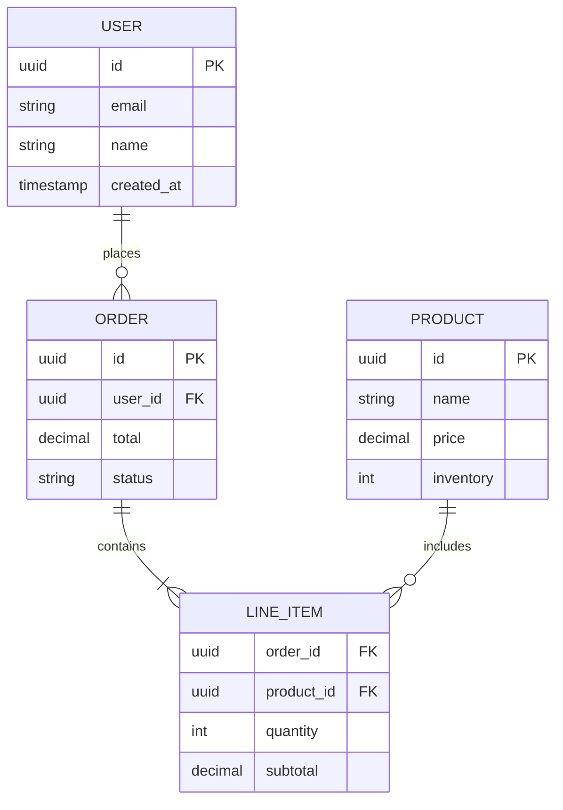

# Mermaid SVG Action Implementation Plan

## Overview

Add Mermaid diagram support to MemberJunction through both server-side Actions (for AI agents) and client-side artifact viewing (for interactive use). Mermaid.js is an MIT-licensed open-source library that generates diagrams from text-based syntax.

## Objectives

1. **Enable AI agents** to generate diagrams (flowcharts, sequence diagrams, ERDs, etc.) as SVG outputs
2. **Allow users** to view and edit Mermaid diagrams within the artifact viewer
3. **Integrate seamlessly** with existing SVG action infrastructure
4. **Support markdown/HTML** artifacts containing `mermaid` code blocks

## Implementation Strategy: Combined Approach (Option C)

### Phase 1: Server-Side Action (Priority 1)
Create a flexible action that handles all Mermaid diagram types for AI agent use.

### Phase 2: Markdown/HTML Code Block Support (Priority 2)
Enhance existing viewers to render Mermaid blocks inline within markdown/HTML artifacts.

### Phase 3: Dedicated Artifact Plugin (Optional - Priority 3)
Add standalone Mermaid artifact viewer for editing/preview if needed.

---

## Phase 1: Server-Side Action Implementation

### File Structure

```
packages/Actions/CoreActions/
├── src/
│   └── custom/
│       └── visualization/
│           ├── create-mermaid-diagram.action.ts  [NEW]
│           └── shared/
│               ├── mermaid-types.ts              [NEW]
│               └── svg-types.ts                  [EXISTING - reuse]
```

### Action Class Design

**File:** `packages/Actions/CoreActions/src/custom/visualization/create-mermaid-diagram.action.ts`

```typescript
import { BaseAction, RegisterClass, RunActionParams } from '@memberjunction/actions';
import mermaid from 'mermaid';
import { SVGActionResult } from './shared/svg-types';
import { SVGUtils } from './shared/svg-utils';
import { MermaidDiagramType, MermaidTheme, MermaidConfig } from './shared/mermaid-types';

/**
 * Creates SVG diagrams from Mermaid syntax for flowcharts, sequence diagrams,
 * ER diagrams, class diagrams, state diagrams, and more.
 *
 * Mermaid is a text-based diagram generation tool that converts markdown-like
 * syntax into rich visual diagrams. This action uses the Mermaid library to
 * render diagrams server-side as SVG, suitable for embedding in reports,
 * artifacts, and AI-generated content.
 *
 * @example
 * // Flowchart
 * const params = {
 *   Code: "flowchart TD\n  A[Start] --> B[Process]\n  B --> C{Decision}\n  C -->|Yes| D[End]\n  C -->|No| A",
 *   Theme: "default"
 * };
 *
 * @example
 * // Sequence Diagram
 * const params = {
 *   Code: "sequenceDiagram\n  Client->>Server: Request\n  Server->>Database: Query\n  Database-->>Server: Results\n  Server-->>Client: Response",
 *   Theme: "dark"
 * };
 *
 * @example
 * // ER Diagram
 * const params = {
 *   Code: "erDiagram\n  USER ||--o{ ORDER : places\n  ORDER ||--|{ LINE-ITEM : contains",
 *   Theme: "forest"
 * };
 */
@RegisterClass(BaseAction, '__CreateMermaidDiagram')
export class CreateMermaidDiagramAction extends BaseAction {

    /**
     * Generates an SVG diagram from Mermaid syntax.
     *
     * @param params.Code - Raw Mermaid diagram syntax (required)
     * @param params.Theme - Visual theme: 'default' | 'dark' | 'forest' | 'neutral' (default: 'default')
     * @param params.Config - Optional Mermaid configuration JSON for advanced customization
     *
     * @returns SVGActionResult with rendered SVG string, width, height
     */
    protected async InternalRunAction(params: RunActionParams): Promise<SVGActionResult> {
        try {
            // Extract parameters
            const code = this.getStringParam(params, 'Code');
            if (!code) {
                throw new Error('Code parameter is required');
            }

            const theme = this.getStringParam(params, 'Theme', 'default') as MermaidTheme;
            const configParam = this.getParamValue(params, 'Config');
            const config: MermaidConfig = configParam
                ? this.parseJSON<MermaidConfig>(configParam, 'Config')
                : {};

            // Validate theme
            const validThemes: MermaidTheme[] = ['default', 'dark', 'forest', 'neutral'];
            if (!validThemes.includes(theme)) {
                throw new Error(`Invalid theme: ${theme}. Valid themes: ${validThemes.join(', ')}`);
            }

            // Initialize Mermaid with configuration
            mermaid.initialize({
                theme,
                startOnLoad: false,  // Headless mode for server-side rendering
                ...config
            });

            // Render diagram to SVG
            const renderId = `mermaid-${Date.now()}-${Math.random().toString(36).substr(2, 9)}`;
            const { svg } = await mermaid.render(renderId, code);

            // Sanitize SVG (XSS prevention)
            const sanitizedSvg = SVGUtils.sanitizeSVG(svg);

            // Extract dimensions from SVG
            const dimensions = this.extractDimensions(sanitizedSvg);

            return {
                Success: true,
                ResultCode: 'SUCCESS',
                Message: sanitizedSvg,
                svg: sanitizedSvg,
                width: dimensions.width,
                height: dimensions.height
            };

        } catch (error) {
            const errorMessage = error instanceof Error ? error.message : String(error);
            return {
                Success: false,
                ResultCode: 'ERROR',
                Message: `Failed to generate Mermaid diagram: ${errorMessage}`,
                svg: '',
                width: 0,
                height: 0
            };
        }
    }

    /**
     * Extracts width and height from SVG viewBox or explicit attributes
     */
    private extractDimensions(svg: string): { width: number; height: number } {
        // Try to extract from viewBox attribute
        const viewBoxMatch = svg.match(/viewBox=["']([^"']+)["']/);
        if (viewBoxMatch) {
            const [, , , width, height] = viewBoxMatch[1].split(/\s+/).map(Number);
            return { width: width || 800, height: height || 600 };
        }

        // Try to extract from width/height attributes
        const widthMatch = svg.match(/width=["'](\d+(?:\.\d+)?)/);
        const heightMatch = svg.match(/height=["'](\d+(?:\.\d+)?)/);

        return {
            width: widthMatch ? parseFloat(widthMatch[1]) : 800,
            height: heightMatch ? parseFloat(heightMatch[1]) : 600
        };
    }

    /**
     * Helper: Get parameter value by name (case-insensitive)
     */
    private getParamValue(params: RunActionParams, paramName: string): string | null {
        const param = params.Params.find(p =>
            p.Name.trim().toLowerCase() === paramName.toLowerCase()
        );
        return param?.Value?.trim() || null;
    }

    /**
     * Helper: Get string parameter with optional default
     */
    private getStringParam(params: RunActionParams, paramName: string, defaultValue?: string): string {
        const value = this.getParamValue(params, paramName);
        if (value === null) {
            if (defaultValue !== undefined) return defaultValue;
            throw new Error(`Required parameter missing: ${paramName}`);
        }
        return value;
    }

    /**
     * Helper: Parse JSON parameter (handles both string and object inputs)
     */
    private parseJSON<T>(value: any, paramName: string): T {
        if (typeof value === 'object' && value !== null) {
            return value as T;
        }
        if (typeof value === 'string') {
            try {
                return JSON.parse(value) as T;
            } catch (error) {
                throw new Error(`Invalid JSON in parameter ${paramName}: ${value}`);
            }
        }
        throw new Error(`Parameter ${paramName} must be JSON string or object`);
    }
}
```

### Type Definitions

**File:** `packages/Actions/CoreActions/src/custom/visualization/shared/mermaid-types.ts`

```typescript
/**
 * Mermaid diagram themes
 */
export type MermaidTheme = 'default' | 'dark' | 'forest' | 'neutral';

/**
 * Supported Mermaid diagram types (documentation only - detected from syntax)
 */
export type MermaidDiagramType =
    | 'flowchart'      // Flowcharts and process flows
    | 'sequenceDiagram' // Sequence diagrams for interactions
    | 'classDiagram'   // UML class diagrams
    | 'stateDiagram'   // State machine diagrams
    | 'erDiagram'      // Entity-relationship diagrams
    | 'gantt'          // Gantt charts for timelines
    | 'pie'            // Pie charts
    | 'gitGraph'       // Git branching diagrams
    | 'journey'        // User journey diagrams
    | 'requirementDiagram' // Requirements diagrams
    | 'mindmap'        // Mind maps
    | 'timeline'       // Timeline diagrams
    | 'quadrantChart'  // Quadrant/matrix charts
    | 'c4'             // C4 architecture diagrams
    | 'sankey';        // Sankey flow diagrams

/**
 * Mermaid configuration options
 * See: https://mermaid.js.org/config/schema-docs/config.html
 */
export interface MermaidConfig {
    /**
     * Flowchart-specific configuration
     */
    flowchart?: {
        curve?: 'basis' | 'linear' | 'step' | 'stepBefore' | 'stepAfter';
        padding?: number;
        useMaxWidth?: boolean;
        defaultRenderer?: 'dagre-d3' | 'dagre-wrapper' | 'elk';
    };

    /**
     * Sequence diagram configuration
     */
    sequence?: {
        diagramMarginX?: number;
        diagramMarginY?: number;
        boxMargin?: number;
        boxTextMargin?: number;
        noteMargin?: number;
        messageMargin?: number;
        mirrorActors?: boolean;
        showSequenceNumbers?: boolean;
    };

    /**
     * ER diagram configuration
     */
    er?: {
        layoutDirection?: 'TB' | 'BT' | 'LR' | 'RL';
        minEntityWidth?: number;
        minEntityHeight?: number;
        entityPadding?: number;
    };

    /**
     * Class diagram configuration
     */
    class?: {
        arrowMarkerAbsolute?: boolean;
    };

    /**
     * State diagram configuration
     */
    state?: {
        dividerMargin?: number;
        sizeUnit?: number;
        padding?: number;
    };

    /**
     * Gantt chart configuration
     */
    gantt?: {
        titleTopMargin?: number;
        barHeight?: number;
        barGap?: number;
        topPadding?: number;
        leftPadding?: number;
        gridLineStartPadding?: number;
        fontSize?: number;
    };

    /**
     * Font configuration (applies to all diagrams)
     */
    fontFamily?: string;
    fontSize?: number;

    /**
     * Security level
     */
    securityLevel?: 'strict' | 'loose' | 'sandbox';

    /**
     * Log level for debugging
     */
    logLevel?: 'debug' | 'info' | 'warn' | 'error' | 'fatal';
}

/**
 * Common Mermaid syntax examples for documentation
 */
export const MERMAID_EXAMPLES = {
    flowchart: `flowchart TD
    Start[Start] --> Process[Process Data]
    Process --> Decision{Is Valid?}
    Decision -->|Yes| Success[Success]
    Decision -->|No| Error[Error]
    Success --> End[End]
    Error --> End`,

    sequence: `sequenceDiagram
    participant Client
    participant Server
    participant Database
    Client->>Server: Request Data
    Server->>Database: Query
    Database-->>Server: Results
    Server-->>Client: Response`,

    erDiagram: `erDiagram
    USER ||--o{ ORDER : places
    USER {
        string id PK
        string name
        string email
    }
    ORDER ||--|{ LINE_ITEM : contains
    ORDER {
        string id PK
        date orderDate
        string userId FK
    }
    PRODUCT ||--o{ LINE_ITEM : "ordered in"
    PRODUCT {
        string id PK
        string name
        decimal price
    }
    LINE_ITEM {
        string orderId FK
        string productId FK
        int quantity
    }`,

    classDiagram: `classDiagram
    class Animal {
        +String name
        +int age
        +makeSound()
    }
    class Dog {
        +String breed
        +bark()
    }
    class Cat {
        +String color
        +meow()
    }
    Animal <|-- Dog
    Animal <|-- Cat`,

    stateDiagram: `stateDiagram-v2
    [*] --> Idle
    Idle --> Processing : Start
    Processing --> Success : Complete
    Processing --> Error : Fail
    Success --> [*]
    Error --> Idle : Retry`,

    gantt: `gantt
    title Project Timeline
    dateFormat YYYY-MM-DD
    section Planning
    Research           :done, des1, 2024-01-01, 2024-01-15
    Design             :active, des2, 2024-01-16, 2024-02-01
    section Development
    Backend            :des3, 2024-02-01, 2024-03-01
    Frontend           :des4, 2024-02-15, 2024-03-15
    section Testing
    QA                 :des5, 2024-03-01, 2024-03-20`
};
```

### Package Dependencies

**File:** `packages/Actions/CoreActions/package.json`

Add to dependencies:
```json
{
  "dependencies": {
    "mermaid": "^11.0.0"
  }
}
```

### Action Metadata (Database)

```sql
-- Insert into Actions table
INSERT INTO [__mj].[Action] (
    [CategoryID],
    [Name],
    [Description],
    [Type],
    [UserPrompt],
    [UserComments],
    [Code],
    [CodeComments],
    [CodeApprovalStatus],
    [CodeApprovalComments],
    [CodeApprovedByUserID],
    [CodeApprovedAt],
    [CodeLocked],
    [ForceCodeGeneration],
    [RetentionPeriod],
    [Status],
    [__mj_CreatedAt],
    [__mj_UpdatedAt]
)
VALUES (
    (SELECT [ID] FROM [__mj].[ActionCategory] WHERE [Name] = 'Visualization'),
    'Create Mermaid Diagram',
    'Generates SVG diagrams from Mermaid text syntax. Supports flowcharts, sequence diagrams, ER diagrams, class diagrams, state machines, Gantt charts, and more.',
    'Generated',
    'Generate a diagram from Mermaid syntax',
    'Uses Mermaid.js library to render text-based diagram definitions into SVG format suitable for reports, artifacts, and AI-generated content.',
    '__CreateMermaidDiagram',
    'Server-side Mermaid rendering with XSS sanitization and theme support',
    'Approved',
    'Follows standard SVG action patterns, uses existing sanitization infrastructure',
    (SELECT [ID] FROM [__mj].[User] WHERE [Email] = 'system@memberjunction.org'),
    GETUTCDATE(),
    0, -- Not locked
    0, -- No forced generation
    NULL, -- No retention period
    'Active',
    GETUTCDATE(),
    GETUTCDATE()
);

-- Insert parameters
DECLARE @ActionID UNIQUEIDENTIFIER = (SELECT [ID] FROM [__mj].[Action] WHERE [Code] = '__CreateMermaidDiagram');

INSERT INTO [__mj].[ActionParam] ([ActionID], [Name], [Description], [Type], [IsOptional], [DefaultValue])
VALUES
    (@ActionID, 'Code', 'Mermaid diagram syntax (required)', 'string', 0, NULL),
    (@ActionID, 'Theme', 'Visual theme: default, dark, forest, neutral', 'string', 1, 'default'),
    (@ActionID, 'Config', 'Optional Mermaid configuration JSON', 'object', 1, NULL);
```

---

## Phase 2: Markdown/HTML Code Block Support

### Enhancement Locations

1. **MarkdownArtifactViewerComponent**
   - File: `packages/Angular/Generic/artifacts/src/lib/components/plugins/markdown-artifact-viewer.component.ts`
   - Add Mermaid block detection and rendering

2. **HtmlArtifactViewerComponent**
   - File: `packages/Angular/Generic/artifacts/src/lib/components/plugins/html-artifact-viewer.component.ts`
   - Add Mermaid block detection within HTML content

### Implementation Approach

**Option A: Custom Renderer for ngx-markdown**

Extend the existing `ngx-markdown` renderer to handle `mermaid` code blocks:

```typescript
import { MarkedOptions, MarkedRenderer } from 'ngx-markdown';
import mermaid from 'mermaid';

export function markedOptionsFactory(): MarkedOptions {
    const renderer = new MarkedRenderer();

    // Custom code block renderer
    const originalCode = renderer.code.bind(renderer);
    renderer.code = (code: string, language: string | undefined) => {
        if (language === 'mermaid') {
            // Return placeholder div that will be rendered by Mermaid
            const id = `mermaid-${Math.random().toString(36).substr(2, 9)}`;
            return `<div class="mermaid" id="${id}">${code}</div>`;
        }
        return originalCode(code, language);
    };

    return { renderer };
}

// In module
MarkdownModule.forRoot({
    markedOptions: {
        provide: MarkedOptions,
        useFactory: markedOptionsFactory
    }
})
```

**Option B: Post-Process HTML**

After markdown rendering, find and replace mermaid blocks:

```typescript
ngAfterViewInit(): void {
    // Find all .mermaid divs
    const mermaidBlocks = this.elementRef.nativeElement.querySelectorAll('.mermaid');

    // Initialize Mermaid
    mermaid.initialize({
        startOnLoad: false,
        theme: 'default'
    });

    // Render each block
    mermaidBlocks.forEach(async (block: HTMLElement) => {
        const code = block.textContent || '';
        const id = block.id || `mermaid-${Date.now()}`;

        try {
            const { svg } = await mermaid.render(id, code);
            block.innerHTML = svg;
        } catch (error) {
            console.error('Mermaid render failed:', error);
            block.innerHTML = `<pre><code>${code}</code></pre>`;
        }
    });
}
```

### Package Dependencies

**File:** `packages/Angular/Generic/artifacts/package.json`

Add to dependencies:
```json
{
  "dependencies": {
    "mermaid": "^11.0.0"
  }
}
```

---

## Phase 3: Dedicated Mermaid Artifact Plugin (Optional)

### When to Implement

Only implement if users need:
- Standalone Mermaid artifact editing (not embedded in markdown)
- Live preview with source editing
- Download as SVG capability
- Version control of Mermaid diagrams

### Component Structure

**File:** `packages/Angular/Generic/artifacts/src/lib/components/plugins/mermaid-artifact-viewer.component.ts`

```typescript
import { Component, OnInit } from '@angular/core';
import { DomSanitizer, SafeHtml } from '@angular/platform-browser';
import { RegisterClass } from '@memberjunction/global';
import { BaseArtifactViewerPluginComponent } from '../base-artifact-viewer.component';
import mermaid from 'mermaid';

@Component({
    selector: 'mj-mermaid-artifact-viewer',
    template: `
        <div class="mermaid-artifact-viewer">
            <div class="toolbar">
                <button class="btn-icon"
                        [class.active]="viewMode === 'preview'"
                        (click)="viewMode = 'preview'">
                    <i class="fa fa-eye"></i> Preview
                </button>
                <button class="btn-icon"
                        [class.active]="viewMode === 'source'"
                        (click)="viewMode = 'source'">
                    <i class="fa fa-code"></i> Source
                </button>
                <button class="btn-icon" (click)="onCopy()">
                    <i class="fa fa-copy"></i> Copy
                </button>
                <button class="btn-icon" (click)="onDownloadSvg()">
                    <i class="fa fa-download"></i> SVG
                </button>
            </div>

            @if (viewMode === 'preview') {
                <div class="mermaid-preview" [innerHTML]="safeMermaidSvg"></div>
            } @else {
                <mj-code-editor
                    [(ngModel)]="mermaidContent"
                    [language]="'mermaid'"
                    [readonly]="readonly"
                    (ngModelChange)="onContentChange()">
                </mj-code-editor>
            }
        </div>
    `,
    styles: [`
        .mermaid-artifact-viewer {
            display: flex;
            flex-direction: column;
            height: 100%;
        }

        .toolbar {
            display: flex;
            gap: 8px;
            padding: 8px;
            border-bottom: 1px solid #e0e0e0;
            background: #f5f5f5;
        }

        .btn-icon {
            padding: 6px 12px;
            border: 1px solid #ccc;
            background: white;
            cursor: pointer;
            border-radius: 4px;
            font-size: 13px;
        }

        .btn-icon.active {
            background: #007acc;
            color: white;
            border-color: #007acc;
        }

        .btn-icon:hover:not(.active) {
            background: #e8e8e8;
        }

        .mermaid-preview {
            flex: 1;
            overflow: auto;
            padding: 16px;
            background: white;
        }

        mj-code-editor {
            flex: 1;
        }
    `]
})
@RegisterClass(BaseArtifactViewerPluginComponent, 'MermaidArtifactViewerPlugin')
export class MermaidArtifactViewerComponent extends BaseArtifactViewerPluginComponent implements OnInit {
    public mermaidContent: string = '';
    public safeMermaidSvg: SafeHtml = '';
    public viewMode: 'preview' | 'source' = 'preview';

    constructor(private sanitizer: DomSanitizer) {
        super();
    }

    ngOnInit(): void {
        this.mermaidContent = this.getContent();

        // Initialize Mermaid
        mermaid.initialize({
            startOnLoad: false,
            theme: 'default'
        });

        this.renderMermaid();
    }

    private async renderMermaid(): Promise<void> {
        if (!this.mermaidContent) return;

        try {
            const id = `mermaid-${Date.now()}-${Math.random().toString(36).substr(2, 9)}`;
            const { svg } = await mermaid.render(id, this.mermaidContent);

            // Sanitize SVG (SecurityContext.HTML = 1)
            this.safeMermaidSvg = this.sanitizer.sanitize(1, svg) || '';
        } catch (error) {
            console.error('Mermaid render failed:', error);
            this.safeMermaidSvg = `<pre>Error rendering Mermaid diagram:\n${error}</pre>`;
        }
    }

    public onContentChange(): void {
        if (!this.readonly) {
            this.renderMermaid();
        }
    }

    public onCopy(): void {
        navigator.clipboard.writeText(this.mermaidContent);
        // TODO: Show toast notification
    }

    public onDownloadSvg(): void {
        // Extract raw SVG from SafeHtml
        const svgString = String(this.safeMermaidSvg);

        const blob = new Blob([svgString], { type: 'image/svg+xml' });
        const url = URL.createObjectURL(blob);

        const link = document.createElement('a');
        link.href = url;
        link.download = `${this.getDisplayName()}.svg`;
        link.click();

        URL.revokeObjectURL(url);
    }
}
```

### Module Registration

**File:** `packages/Angular/Generic/artifacts/src/lib/artifacts.module.ts`

```typescript
import { MermaidArtifactViewerComponent } from './components/plugins/mermaid-artifact-viewer.component';

@NgModule({
    declarations: [
        // ... existing components
        MermaidArtifactViewerComponent  // Add this
    ],
    // ... rest of module
})
export class ArtifactsModule { }
```

### Database Metadata

```sql
-- Insert artifact type
INSERT INTO [__mj].[ArtifactType] (
    [Name],
    [Description],
    [DriverClass]
)
VALUES (
    'Mermaid Diagram',
    'Text-based diagram using Mermaid syntax',
    'MermaidArtifactViewerPlugin'
);
```

---

## Design Decisions

### 1. Why Raw Mermaid Syntax vs Structured Inputs?

**✅ Use Raw Mermaid Syntax:**
- LLMs excel at generating Mermaid syntax directly
- Simpler parameter structure (just `Code` string)
- More flexible (supports all Mermaid features)
- Easier for users to edit and customize

**❌ Don't Use Structured Inputs:**
```typescript
// DON'T DO THIS - overly complex
{
  "DiagramType": "flowchart",
  "Nodes": [
    { "id": "A", "label": "Start", "shape": "rectangle" },
    { "id": "B", "label": "Process", "shape": "rectangle" }
  ],
  "Edges": [
    { "from": "A", "to": "B", "label": "Next" }
  ]
}
```

### 2. Why Combined Approach (Action + Viewer)?

**Server-Side Action Benefits:**
- Works in headless environments
- No browser dependency
- Consistent SVG output
- Cacheable, printable results
- Agents can use directly

**Client-Side Viewer Benefits:**
- Interactive editing
- Live preview
- Better user experience
- No round-trip to server

### 3. Why Reuse Existing SVG Infrastructure?

**Leverage Existing Code:**
- `SVGUtils.sanitizeSVG()` - XSS prevention (tested, proven)
- `SVGActionResult` - Consistent return type
- `svg-theming.ts` - Theme mapping
- Same patterns as other SVG actions

**Benefits:**
- Faster implementation
- Consistent behavior
- Less maintenance
- Familiar to developers

### 4. Theme Mapping Strategy

Map MJ branding themes to Mermaid themes:

| MJ Theme | Mermaid Theme | Use Case |
|----------|---------------|----------|
| mjDefault | default | Standard diagrams |
| dark | dark | Dark mode reports |
| pastel | forest | Softer color palette |
| highContrast | neutral | Accessibility |

---

## Implementation Checklist

### Phase 1: Server-Side Action
- [ ] Add `mermaid` dependency to CoreActions package.json
- [ ] Create `mermaid-types.ts` with type definitions
- [ ] Implement `CreateMermaidDiagramAction` class
- [ ] Add action metadata to database (SQL script)
- [ ] Add action parameters to database
- [ ] Test with various diagram types (flowchart, sequence, ER, etc.)
- [ ] Verify SVG sanitization works correctly
- [ ] Test theme support
- [ ] Add JSDoc examples for common diagram types
- [ ] Update CoreActions index.ts exports

### Phase 2: Markdown/HTML Support
- [ ] Add `mermaid` dependency to artifacts package.json
- [ ] Implement custom marked renderer for mermaid blocks
- [ ] Update MarkdownArtifactViewerComponent
- [ ] Update HtmlArtifactViewerComponent
- [ ] Test rendering in markdown artifacts
- [ ] Test rendering in HTML artifacts
- [ ] Verify syntax highlighting in source view
- [ ] Handle rendering errors gracefully

### Phase 3: Dedicated Plugin (Optional)
- [ ] Create MermaidArtifactViewerComponent
- [ ] Register with BaseArtifactViewerPluginComponent
- [ ] Add to artifacts.module.ts
- [ ] Implement edit/preview toggle
- [ ] Implement copy functionality
- [ ] Implement SVG download
- [ ] Add artifact type to database
- [ ] Test with artifact versioning
- [ ] Add syntax highlighting for 'mermaid' language in code editor

### Documentation
- [ ] Add usage examples to action metadata
- [ ] Document supported diagram types
- [ ] Create sample Mermaid templates for common use cases
- [ ] Add to MJ documentation site
- [ ] Update CHANGELOG.md

### Testing
- [ ] Unit tests for action parameter validation
- [ ] Integration tests for SVG generation
- [ ] Test XSS prevention in sanitization
- [ ] Test error handling for invalid syntax
- [ ] Test all supported diagram types
- [ ] Test theme variations
- [ ] Test in AI agent workflows
- [ ] Test in artifact viewer
- [ ] Performance testing (large diagrams)

---

## Example Usage Scenarios

### 1. Agent Generates Flowchart in Report

**User Prompt:**
> "Explain how our authentication system works"

**Agent Workflow:**
```typescript
// Agent calls CreateMermaidDiagram action
const result = await actionRunner.executeAction('Create Mermaid Diagram', {
    Code: `flowchart TD
        A[User Login] --> B{Credentials Valid?}
        B -->|Yes| C[Generate JWT Token]
        B -->|No| D[Return 401 Error]
        C --> E[Set Cookie]
        E --> F[Redirect to Dashboard]
        D --> G[Show Error Message]`,
    Theme: 'default'
});

// Embed SVG in report artifact
report.addSection({
    title: 'Authentication Flow',
    content: result.svg
});
```

### 2. User Views ER Diagram in Artifact

**Scenario:** Developer saves database schema as Mermaid artifact

**Artifact Content:**
````markdown
# Database Schema


````

**Viewer Behavior:**
- Markdown viewer detects ```mermaid block
- Renders diagram inline automatically
- User can toggle to source view to see/edit syntax

### 3. Agent Creates Sequence Diagram for API Call

**User Prompt:**
> "Document the process for placing an order via our API"

**Agent Response:**
```typescript
const diagram = await actionRunner.executeAction('Create Mermaid Diagram', {
    Code: `sequenceDiagram
        participant Client
        participant API
        participant Auth
        participant OrderService
        participant PaymentGateway
        participant Database

        Client->>API: POST /orders
        API->>Auth: Validate JWT Token
        Auth-->>API: Token Valid
        API->>OrderService: Create Order
        OrderService->>Database: Check Inventory
        Database-->>OrderService: Stock Available
        OrderService->>PaymentGateway: Process Payment
        PaymentGateway-->>OrderService: Payment Confirmed
        OrderService->>Database: Save Order
        Database-->>OrderService: Order ID
        OrderService-->>API: Order Created
        API-->>Client: 201 Created`,
    Theme: 'default'
});
```

---

## Performance Considerations

### Server-Side Rendering
- Mermaid rendering is CPU-intensive
- Consider caching generated SVGs by content hash
- Set reasonable timeout limits (5-10 seconds)
- Monitor memory usage for large diagrams

### Client-Side Rendering
- Debounce live preview updates (500ms)
- Limit diagram complexity in browser (performance warning)
- Use lazy loading for artifacts with many diagrams
- Consider web worker for rendering if performance issues

### Optimization Ideas
```typescript
// Cache SVG results by Mermaid code hash
private svgCache = new Map<string, string>();

private async renderMermaid(code: string): Promise<string> {
    const hash = this.hashCode(code);

    if (this.svgCache.has(hash)) {
        return this.svgCache.get(hash)!;
    }

    const { svg } = await mermaid.render(id, code);
    this.svgCache.set(hash, svg);

    return svg;
}
```

---

## Security Considerations

### XSS Prevention
- Always sanitize SVG output with `SVGUtils.sanitizeSVG()`
- Validate Mermaid code doesn't contain script injection
- Use `DomSanitizer` in Angular components
- Set `securityLevel: 'strict'` in Mermaid config

### Input Validation
```typescript
// Validate Mermaid code size
if (code.length > 100000) {  // 100KB limit
    throw new Error('Mermaid code too large');
}

// Detect suspicious patterns
const suspiciousPatterns = [
    /<script/i,
    /javascript:/i,
    /on\w+\s*=/i  // Event handlers
];

for (const pattern of suspiciousPatterns) {
    if (pattern.test(code)) {
        throw new Error('Invalid Mermaid code: contains suspicious content');
    }
}
```

### Rate Limiting
- Implement rate limiting for action execution
- Prevent DoS attacks via complex diagram generation
- Monitor CPU usage per request

---

## Future Enhancements

### 1. AI-Powered Diagram Generation
Create specialized actions that generate Mermaid code from descriptions:

```typescript
@RegisterClass(BaseAction, '__GenerateFlowchartFromDescription')
export class GenerateFlowchartFromDescriptionAction extends BaseAction {
    // Input: Natural language description
    // Output: Mermaid flowchart syntax
    // Uses LLM to convert text → Mermaid code
}
```

### 2. Diagram Templates Library
Pre-built templates for common scenarios:
- Authentication flows
- CRUD operations
- Microservice interactions
- Database schemas
- State machines

### 3. Interactive Diagram Editing
Advanced UI features:
- Visual node/edge editing
- Drag-and-drop layout
- Property panels
- Real-time collaboration

### 4. Export Formats
Additional export options:
- PNG/JPEG raster images
- PDF documents
- PowerPoint slides
- Draw.io format

---

## References

### Mermaid.js Documentation
- Official Docs: https://mermaid.js.org/
- Syntax Reference: https://mermaid.js.org/intro/syntax-reference.html
- Configuration: https://mermaid.js.org/config/schema-docs/config.html
- Live Editor: https://mermaid.live/

### Existing MJ Infrastructure
- SVG Actions: `/packages/Actions/CoreActions/src/custom/visualization/`
- SVG Utils: `/packages/Actions/CoreActions/src/custom/visualization/shared/svg-utils.ts`
- Artifact Viewers: `/packages/Angular/Generic/artifacts/src/lib/components/plugins/`
- Base Viewer: `/packages/Angular/Generic/artifacts/src/lib/components/base-artifact-viewer.component.ts`

### Similar Implementations
- GitHub Mermaid Support: https://github.blog/2022-02-14-include-diagrams-markdown-files-mermaid/
- GitLab Mermaid Support: https://docs.gitlab.com/ee/user/markdown.html#mermaid
- Notion Mermaid Support: https://www.notion.so/help/diagrams-in-notion

---

## Conclusion

This implementation plan provides a comprehensive, phased approach to adding Mermaid diagram support to MemberJunction:

1. **Phase 1** gives AI agents immediate SVG generation capability
2. **Phase 2** enhances user experience with inline markdown rendering
3. **Phase 3** adds advanced editing features when needed

The design leverages existing MJ infrastructure (SVG utils, artifact viewers, action patterns) while following established best practices for security, performance, and maintainability.

**Recommended Start:** Implement Phase 1 (Server-Side Action) first to validate the approach and provide immediate value to AI agents.
