# Multi-Database Platform Support for MemberJunction

**Status**: Draft
**Created**: 2026-02-16
**Author**: Architecture Team
**Target Version**: MJ v5.x
**Prerequisite**: [Skyway Multi-Database Support](./multi-database-skyway-support.md)

---

## Table of Contents

1. [Executive Summary](#1-executive-summary)
2. [Current State Analysis](#2-current-state-analysis)
3. [Architecture Overview](#3-architecture-overview)
4. [Phase 1: SQL Dialect Abstraction Layer](#4-phase-1-sql-dialect-abstraction-layer)
5. [Phase 2: Data Provider Refactoring](#5-phase-2-data-provider-refactoring)
6. [Phase 3: CodeGen Provider Architecture](#6-phase-3-codegen-provider-architecture)
7. [Phase 4: RunView/RunQuery Multi-Platform Extensions](#7-phase-4-runviewrunquery-multi-platform-extensions)
8. [Phase 5: Query Metadata Platform Variants](#8-phase-5-query-metadata-platform-variants)
9. [Phase 6: LLM Build-Time SQL Translation Pipeline](#9-phase-6-llm-build-time-sql-translation-pipeline)
10. [Phase 7: Docker Development Environment](#10-phase-7-docker-development-environment)
11. [Phase 8: Migration Strategy & Baseline Generation](#11-phase-8-migration-strategy--baseline-generation)
12. [Phase 9: Full Feature Parity & Testing](#12-phase-9-full-feature-parity--testing)
13. [Package Inventory & Impact Map](#13-package-inventory--impact-map)
14. [Risk Register](#14-risk-register)
15. [Open Questions](#15-open-questions)

---

## 1. Executive Summary

This plan adds PostgreSQL as a first-class database backend for MemberJunction, while establishing the architecture for future database platform support (MySQL, SQLite, etc.). The design preserves 100% backward compatibility with SQL Server deployments while introducing clean provider abstractions at every layer of the stack.

### Key Design Principles

1. **One DB per installation** - A given MJ deployment uses exactly one database backend
2. **Core MJ ships variants** - MJ's own SQL (queries, filters, views) ships with all supported platform variants
3. **Backward compatible** - All existing APIs, types, and patterns continue to work unchanged
4. **Build-time, not runtime** - SQL dialect translation happens at build/dev time via LLM tooling, never at runtime
5. **Provider pattern everywhere** - Database-specific code lives in swappable provider packages

### Architectural Layers Affected

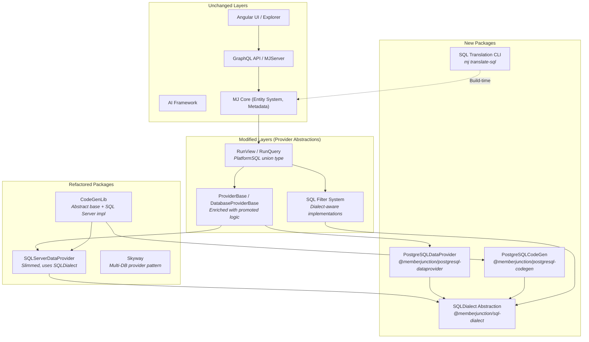

---

## 2. Current State Analysis

### SQL Server Coupling Inventory

| Layer | Files | SQL Server Patterns | Severity |
|-------|-------|-------------------|----------|
| **SQLServerDataProvider** | 1 file, 5,966 lines | `TOP`, `[brackets]`, `OFFSET/FETCH`, `EXEC`, `NVARCHAR`, stored proc calls, `SCOPE_IDENTITY`, full-text functions | Critical |
| **CodeGenLib** | ~12 files, ~8,000+ lines | All DDL generation (SPs, views, triggers, indexes, TVFs), `sys.*` queries, `INFORMATION_SCHEMA`, `sqlcmd` CLI, `mssql` driver | Critical |
| **SQL Filter Implementations** | 2 files | `[bracket]` quoting, `1/0` booleans, SQL Server date formats | Medium |
| **Query Parameter Processor** | 1 file | Boolean→BIT (`1/0`), date format handling | Medium |
| **Migrations** | 138,700+ lines | T-SQL DDL, 837 SPs, 282 views, 272 triggers, 40 TVFs, 612 indexes | Critical (new baseline needed) |
| **MJCLI** | Config files | JDBC connection string format, Flyway→Skyway config | Low |
| **Stored Metadata** | DB records | `QueryInfo.SQL`, `ViewInfo.WhereClause`, `ExtraFilter` strings, RLS filters | Hard (addressed in Phase 5-6) |

### What's Already Well-Abstracted

- `ProviderBase` separates orchestration (caching, telemetry, entity hydration) from SQL generation
- `ClassFactory` enables runtime provider substitution
- `GraphQLDataProvider` (client-side) is 100% DB-agnostic (sends GraphQL, receives JSON)
- Angular UI has zero database coupling
- AI framework has zero database coupling
- All CodeGen classes already use `Base` suffix and `ClassFactory` registration

---

## 3. Architecture Overview

### Provider Registration & Resolution

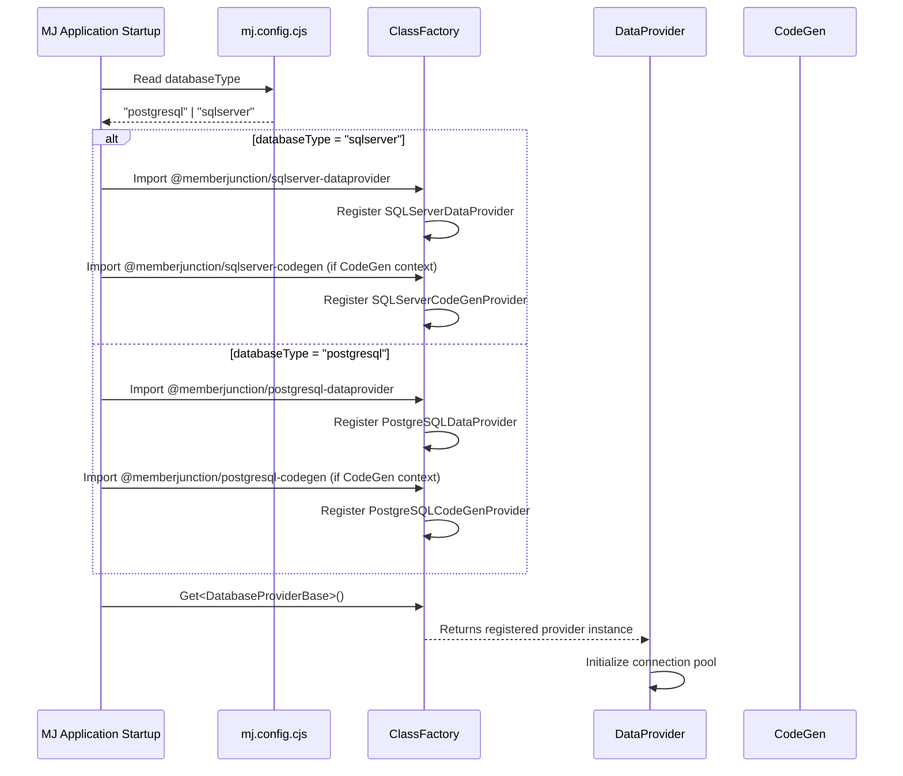

### Full Stack Data Flow (PostgreSQL Path)

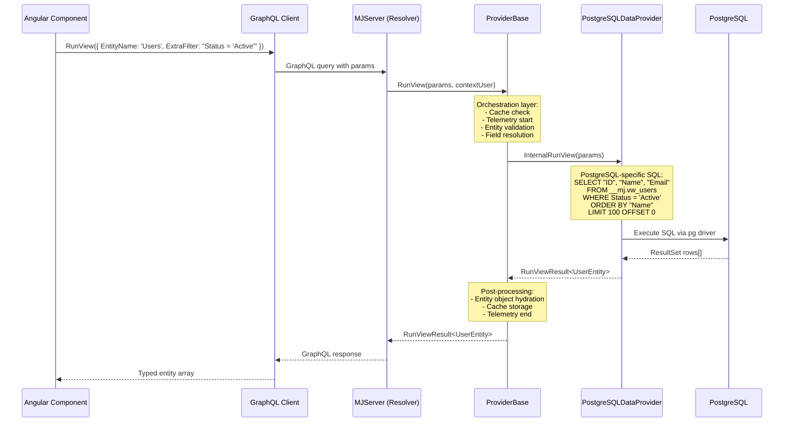

---

## 4. Phase 1: SQL Dialect Abstraction Layer

### New Package: `@memberjunction/sql-dialect`

This is the foundation everything else builds on. It encapsulates ALL database-specific SQL syntax patterns into a single, testable abstraction.

```mermaid
classDiagram
    class SQLDialect {
        <<abstract>>
        +platformKey: DatabasePlatform
        +quoteIdentifier(name: string): string
        +quoteSchema(schema: string, object: string): string
        +limitClause(limit: number, offset?: number): LimitClauseResult
        +booleanLiteral(value: boolean): string
        +currentTimestampUTC(): string
        +newUUID(): string
        +coalesce(expr: string, fallback: string): string
        +castToText(expr: string): string
        +castToUUID(expr: string): string
        +returnInsertedClause(columns?: string[]): string
        +autoIncrementPKExpression(): string
        +uuidPKDefault(): string
        +scopeIdentityExpression(): string
        +rowCountVariable(): string
        +batchSeparator(): string
        +existenceCheckSQL(objectType: string, schema: string, name: string): string
        +createOrReplaceSupported(objectType: string): boolean
        +fullTextSearchPredicate(column: string, searchTerm: string): string
        +fullTextIndexDDL(table: string, columns: string[], catalog?: string): string
        +recursiveCTESyntax(): string
        +typeMap: DataTypeMap
        +mapDataType(sqlServerType: string): string
        +parameterPlaceholder(index: number): string
        +concatOperator(): string
        +stringSplitFunction(value: string, delimiter: string): string
        +jsonExtract(column: string, path: string): string
        +procedureCallSyntax(schema: string, name: string, params: string[]): string
        +triggerDDL(options: TriggerOptions): string
        +indexDDL(options: IndexOptions): string
        +grantPermission(permission: string, objectType: string, schema: string, object: string, role: string): string
        +commentOnObject(objectType: string, schema: string, name: string, comment: string): string
        +schemaIntrospectionQueries(): SchemaIntrospectionSQL
    }

    class SQLServerDialect {
        +platformKey = "sqlserver"
        +quoteIdentifier(name) → "[name]"
        +booleanLiteral(v) → "1" / "0"
        +currentTimestampUTC() → "GETUTCDATE()"
        +newUUID() → "NEWID()"
        +batchSeparator() → "GO"
        +parameterPlaceholder(i) → "@p{i}"
        +typeMap: SQL Server types
    }

    class PostgreSQLDialect {
        +platformKey = "postgresql"
        +quoteIdentifier(name) → "\"name\""
        +booleanLiteral(v) → "true" / "false"
        +currentTimestampUTC() → "NOW() AT TIME ZONE 'UTC'"
        +newUUID() → "gen_random_uuid()"
        +batchSeparator() → "" (none needed)
        +parameterPlaceholder(i) → "$i"
        +typeMap: PostgreSQL types
    }

    SQLDialect <|-- SQLServerDialect
    SQLDialect <|-- PostgreSQLDialect

    class DataTypeMap {
        +mapType(sourceType: string, sourceLength?: number): MappedType
    }

    class LimitClauseResult {
        +prefix: string
        +suffix: string
    }

    class SchemaIntrospectionSQL {
        +listTables: string
        +listColumns: string
        +listConstraints: string
        +listForeignKeys: string
        +listIndexes: string
        +objectExists: string
    }

    SQLDialect --> DataTypeMap
    SQLDialect --> LimitClauseResult
    SQLDialect --> SchemaIntrospectionSQL
```

### Data Type Mapping Table

| SQL Server Type | PostgreSQL Type | Notes |
|----------------|----------------|-------|
| `UNIQUEIDENTIFIER` | `UUID` | PG has native UUID, use `gen_random_uuid()` |
| `NVARCHAR(n)` | `VARCHAR(n)` | PG VARCHAR is already Unicode |
| `NVARCHAR(MAX)` | `TEXT` | PG TEXT has no length limit |
| `INT` / `BIGINT` | `INTEGER` / `BIGINT` | Same semantics |
| `BIT` | `BOOLEAN` | PG uses `true`/`false`, not `1`/`0` |
| `DATETIMEOFFSET` | `TIMESTAMPTZ` | Both store timezone-aware timestamps |
| `DATETIME2` | `TIMESTAMP` | Without timezone |
| `FLOAT(53)` | `DOUBLE PRECISION` | Equivalent |
| `DECIMAL(p,s)` | `NUMERIC(p,s)` | Equivalent |
| `VARBINARY(MAX)` | `BYTEA` | Binary data |
| `XML` | `XML` | PG has native XML type |
| `NTEXT` | `TEXT` | NTEXT is deprecated in SQL Server anyway |
| `IMAGE` | `BYTEA` | Legacy binary type |
| `MONEY` | `NUMERIC(19,4)` | PG has MONEY but NUMERIC is safer |
| `TINYINT` | `SMALLINT` | PG has no TINYINT |
| `SMALLDATETIME` | `TIMESTAMP(0)` | Lower precision timestamp |

### Pagination Pattern Differences

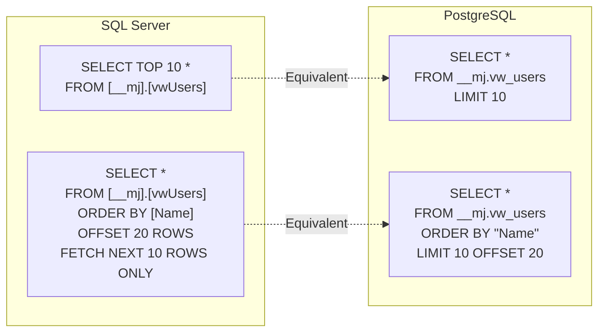

The `SQLDialect.limitClause()` method returns a `LimitClauseResult` with `prefix` and `suffix` properties because SQL Server puts `TOP` before columns while PostgreSQL puts `LIMIT` at the end:

```typescript
// SQL Server
limitClause(limit: number, offset?: number): LimitClauseResult {
    if (offset != null) {
        return { prefix: '', suffix: `OFFSET ${offset} ROWS FETCH NEXT ${limit} ROWS ONLY` };
    }
    return { prefix: `TOP ${limit}`, suffix: '' };
}

// PostgreSQL
limitClause(limit: number, offset?: number): LimitClauseResult {
    const parts = [`LIMIT ${limit}`];
    if (offset != null) parts.push(`OFFSET ${offset}`);
    return { prefix: '', suffix: parts.join(' ') };
}
```

### Schema Introspection Queries

Each dialect provides its own schema introspection SQL. These are used by CodeGen and metadata sync:

**SQL Server** uses `sys.*` catalog views and `INFORMATION_SCHEMA`:
- `sys.tables`, `sys.columns`, `sys.types`, `sys.schemas`
- `sys.indexes`, `sys.index_columns`, `sys.key_constraints`
- `sys.foreign_keys`, `sys.foreign_key_columns`
- `sys.default_constraints`, `sys.fulltext_catalogs`
- `INFORMATION_SCHEMA.TABLE_CONSTRAINTS`

**PostgreSQL** uses `pg_catalog` and `information_schema`:
- `pg_catalog.pg_tables`, `pg_catalog.pg_class`, `pg_catalog.pg_attribute`
- `pg_catalog.pg_type`, `pg_catalog.pg_namespace`
- `pg_catalog.pg_index`, `pg_catalog.pg_constraint`
- `information_schema.columns`, `information_schema.table_constraints`
- `pg_catalog.pg_description` (for COMMENT ON equivalents)

### Package Structure

```
packages/SQLDialect/
  package.json         → @memberjunction/sql-dialect
  src/
    index.ts
    sqlDialect.ts          → Abstract SQLDialect class + types
    dataTypeMap.ts         → DataTypeMap interface + types
    sqlServerDialect.ts    → SQL Server implementation
    postgresqlDialect.ts   → PostgreSQL implementation
    __tests__/
      sqlServerDialect.test.ts
      postgresqlDialect.test.ts
      dataTypeMap.test.ts
```

### Deliverables

- [ ] `SQLDialect` abstract class with full interface
- [ ] `SQLServerDialect` implementation (extracted from existing hardcoded patterns)
- [ ] `PostgreSQLDialect` implementation
- [ ] `DataTypeMap` with bidirectional type mappings
- [ ] `SchemaIntrospectionSQL` query sets for both platforms
- [ ] Comprehensive unit tests (every method, both dialects)
- [ ] Zero dependencies on database drivers (pure string/logic operations)

---

## 5. Phase 2: Data Provider Refactoring

### Current vs Target Architecture

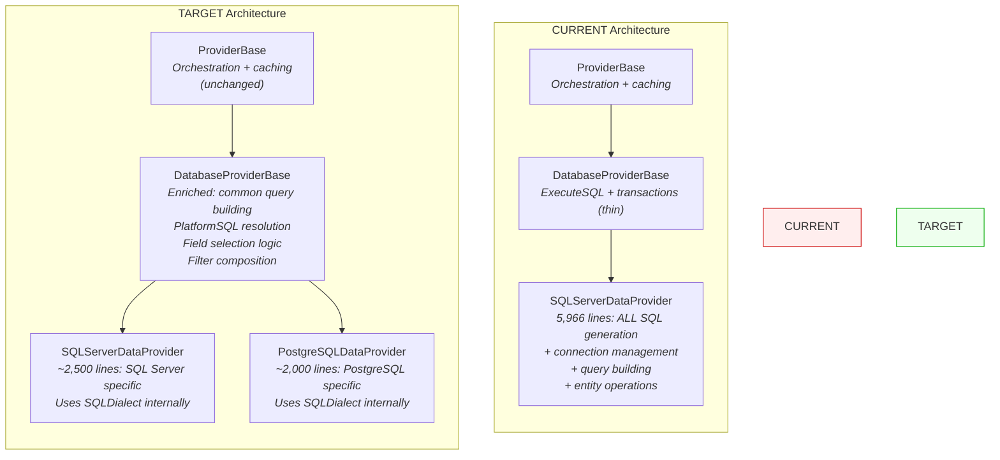

### Logic Promotion: What Moves to DatabaseProviderBase

Analyze `SQLServerDataProvider`'s 5,966 lines and classify each method:

| Method | Lines | Classification | Action |
|--------|-------|---------------|--------|
| `InternalRunView` | ~200 | **Mixed** | Promote query assembly logic, keep SQL dialect calls |
| `InternalRunViews` | ~50 | **Generic** | Promote entirely |
| `buildViewSQL` (field selection) | ~100 | **Mixed** | Promote field selection logic, abstract SQL building |
| `buildPaginatedSQL` | ~30 | **DB-specific** | Keep as abstract, implement per provider |
| `buildCountSQL` | ~20 | **Mixed** | Promote logic, abstract quoting |
| `buildAggregateSQL` | ~60 | **Mixed** | Promote aggregation logic, abstract SQL |
| `buildUserSearchSQL` | ~80 | **DB-specific** | Keep as abstract (full-text search differs vastly) |
| `InternalRunQuery` | ~180 | **Mixed** | Promote template processing + caching, abstract execution |
| `InternalSave/Load/Delete` | ~400 | **Mixed** | Promote entity hydration, abstract SP/function calls |
| `ExecuteSQL` | ~50 | **DB-specific** | Keep as abstract |
| Connection management | ~100 | **DB-specific** | Keep as abstract |
| User view run logging | ~100 | **Mixed** | Promote logic, abstract SQL |
| Entity metadata operations | ~200 | **Mostly generic** | Promote most logic |
| Query parameter processing | ~150 | **Mixed** | Promote Nunjucks processing, abstract type conversion |

### New Abstract Methods on DatabaseProviderBase

```typescript
abstract class DatabaseProviderBase extends ProviderBase {
    // Existing (unchanged)
    abstract ExecuteSQL<T>(query: string, params?: unknown[], options?: ExecuteSQLOptions, contextUser?: UserInfo): Promise<T[]>;
    abstract BeginTransaction(): Promise<void>;
    abstract CommitTransaction(): Promise<void>;
    abstract RollbackTransaction(): Promise<void>;

    // NEW: Dialect access
    abstract get Dialect(): SQLDialect;
    abstract get PlatformKey(): DatabasePlatform;

    // NEW: Connection lifecycle
    abstract InitializeConnection(config: DatabaseConnectionConfig): Promise<void>;
    abstract CloseConnection(): Promise<void>;
    abstract get IsConnected(): boolean;

    // NEW: SQL building (abstract - each provider implements with its dialect)
    protected abstract BuildSelectSQL(entity: EntityInfo, fields: string[], filter?: string, orderBy?: string, limit?: number, offset?: number): string;
    protected abstract BuildCountSQL(entity: EntityInfo, filter?: string): string;
    protected abstract BuildAggregateSQL(entity: EntityInfo, aggregations: AggregationInfo[], filter?: string): string;
    protected abstract BuildUserSearchSQL(entity: EntityInfo, searchString: string): string;
    protected abstract ExecuteCRUDProcedure(type: 'create' | 'update' | 'delete', entity: EntityInfo, params: Record<string, unknown>, contextUser?: UserInfo): Promise<Record<string, unknown>>;

    // PROMOTED: Generic logic now in base class
    protected ResolveSQL(value: string | PlatformSQL): string {
        if (typeof value === 'string') return value;
        return value[this.PlatformKey] ?? value.default;
    }

    protected BuildFieldList(entity: EntityInfo, requestedFields?: string[]): string[] {
        // Field selection logic promoted from SQLServerDataProvider
    }

    protected ComposeFilter(entity: EntityInfo, params: RunViewParams, contextUser?: UserInfo): string {
        // Filter composition logic (ExtraFilter + RLS + entity filters)
        // Calls this.ResolveSQL() for PlatformSQL filters
    }

    protected ProcessQueryTemplate(query: QueryInfo, params: Record<string, unknown>): string {
        // Nunjucks template processing (promoted, DB-agnostic)
    }
}
```

### PostgreSQLDataProvider Package

```
packages/PostgreSQLDataProvider/
  package.json         → @memberjunction/postgresql-dataprovider
  src/
    index.ts
    PostgreSQLDataProvider.ts    → Main provider class
    pgConnectionManager.ts       → pg pool management
    queryParameterProcessor.ts   → PG-specific type conversions
    __tests__/
      PostgreSQLDataProvider.test.ts
      pgConnectionManager.test.ts
```

### Key PostgreSQL-Specific Implementations

```typescript
class PostgreSQLDataProvider extends DatabaseProviderBase {
    private pool: pg.Pool;

    get Dialect(): SQLDialect { return new PostgreSQLDialect(); }
    get PlatformKey(): DatabasePlatform { return 'postgresql'; }

    protected BuildSelectSQL(entity: EntityInfo, fields: string[], filter?: string,
                             orderBy?: string, limit?: number, offset?: number): string {
        const d = this.Dialect;
        const fieldList = fields.map(f => d.quoteIdentifier(f)).join(', ');
        let sql = `SELECT ${fieldList} FROM ${d.quoteSchema(entity.SchemaName, entity.BaseView)}`;
        if (filter) sql += ` WHERE ${filter}`;
        if (orderBy) sql += ` ORDER BY ${orderBy}`;
        if (limit != null) {
            const lc = d.limitClause(limit, offset);
            sql += ` ${lc.suffix}`;
        }
        return sql;
    }

    protected async ExecuteCRUDProcedure(
        type: 'create' | 'update' | 'delete',
        entity: EntityInfo,
        params: Record<string, unknown>,
        contextUser?: UserInfo
    ): Promise<Record<string, unknown>> {
        // PostgreSQL uses FUNCTION, called with SELECT * FROM fn_name(...)
        const fnName = this.getCRUDFunctionName(type, entity);
        const paramValues = this.buildParameterValues(entity, params, type);
        const placeholders = paramValues.map((_, i) => `$${i + 1}`).join(', ');
        const sql = `SELECT * FROM ${this.Dialect.quoteSchema(entity.SchemaName, fnName)}(${placeholders})`;
        const result = await this.ExecuteSQL<Record<string, unknown>>(sql, paramValues);
        return result[0]; // Single record returned
    }

    async ExecuteSQL<T>(query: string, params?: unknown[], options?: ExecuteSQLOptions): Promise<T[]> {
        const client = await this.pool.connect();
        try {
            const result = await client.query(query, params);
            return result.rows as T[];
        } finally {
            client.release();
        }
    }
}
```

### CRUD Function Call Patterns

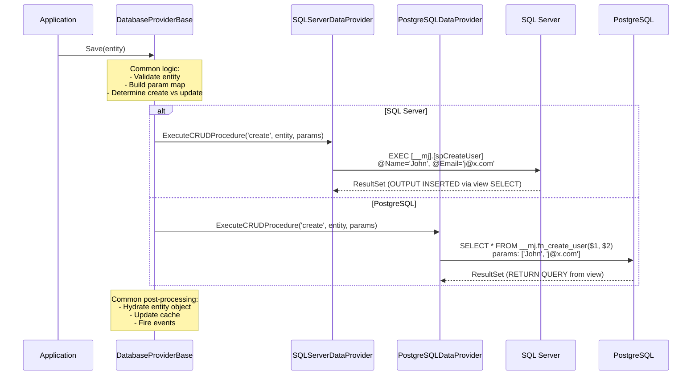

### Deliverables

- [ ] Enriched `DatabaseProviderBase` with promoted generic logic
- [ ] New abstract methods for DB-specific operations
- [ ] `PlatformSQL` resolution in base class
- [ ] Refactored `SQLServerDataProvider` (slimmed from ~5,966 to ~2,500 lines)
- [ ] New `PostgreSQLDataProvider` package with `pg` driver
- [ ] Connection pool management for PostgreSQL
- [ ] PG-specific query parameter processing (boolean→`true`/`false`, dates, etc.)
- [ ] Unit tests for both providers (mock DB connections)
- [ ] Integration tests against Docker PostgreSQL

---

## 6. Phase 3: CodeGen Provider Architecture

This is the largest single phase. CodeGen currently generates ~837 stored procedures, ~282 views, ~272 triggers, ~40 TVFs, and ~612 indexes - all in T-SQL.

### Current CodeGen Class Hierarchy

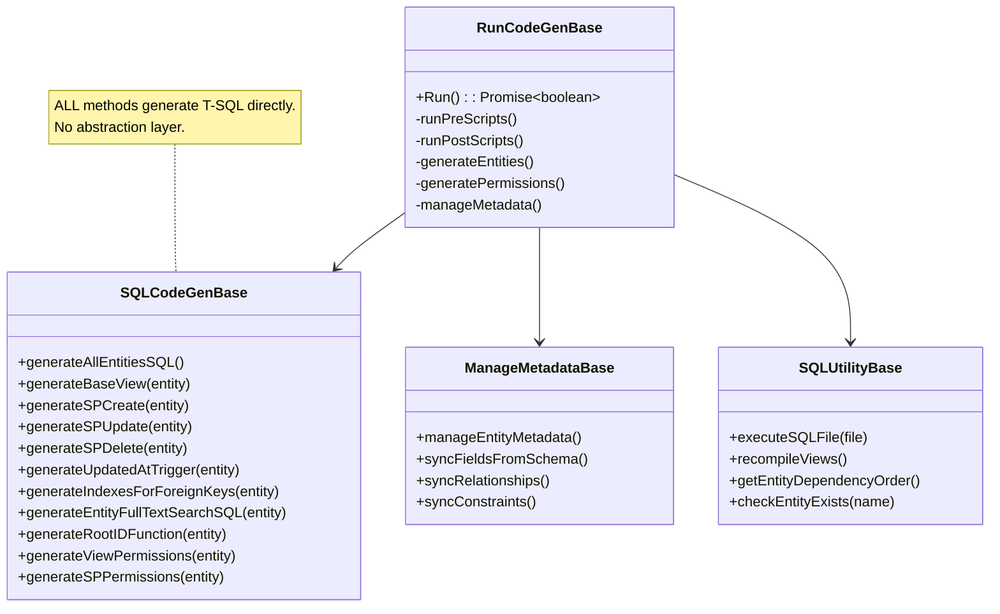

### Target CodeGen Architecture

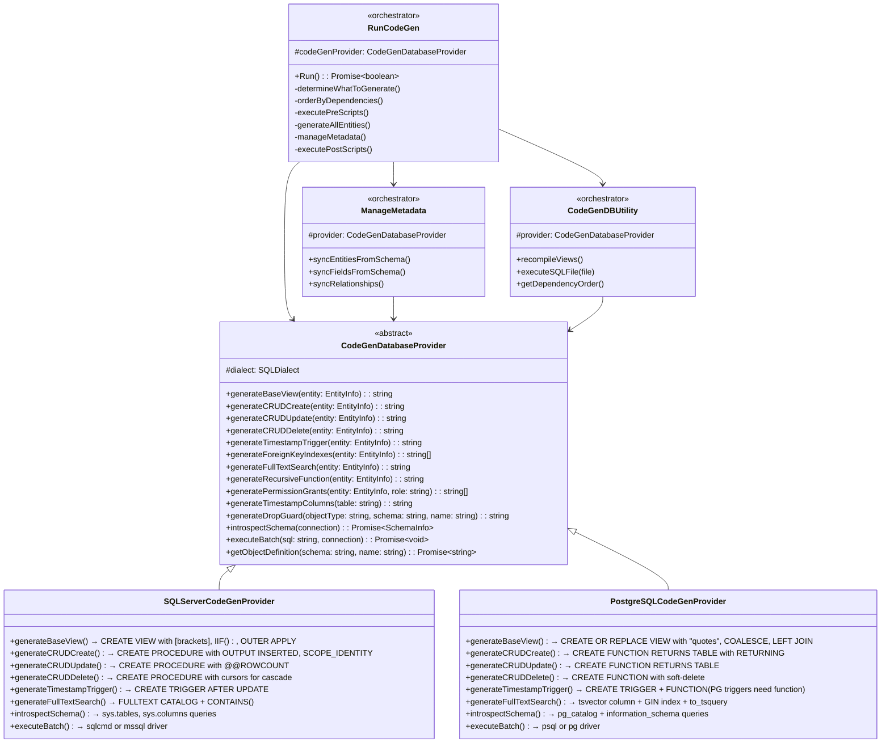

### CodeGen Flow - Orchestrator vs Provider

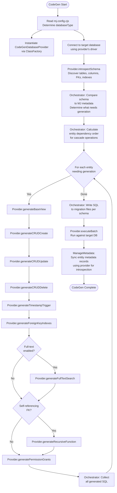

### CRUD Generation Comparison

#### spCreate (SQL Server) vs fn_create (PostgreSQL)

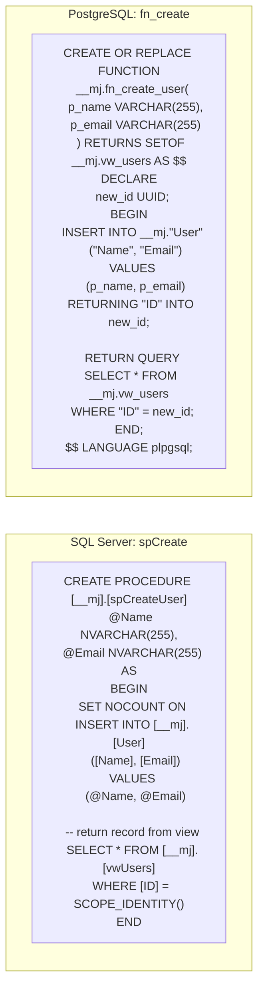

#### Trigger Comparison

SQL Server triggers are standalone; PostgreSQL triggers require a companion function:

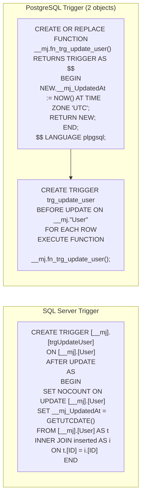

Note: PostgreSQL uses `BEFORE UPDATE` with `RETURN NEW` (more efficient than SQL Server's `AFTER UPDATE` + self-join pattern).

### Full-Text Search Comparison

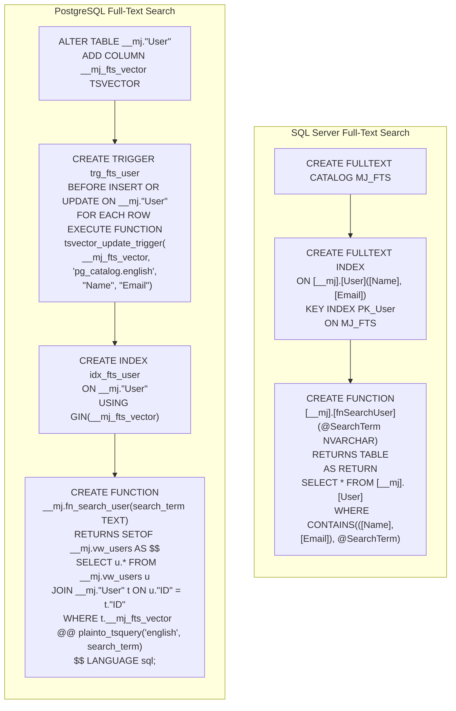

### Recursive Root ID Functions

SQL Server uses `OUTER APPLY` with inline TVFs. PostgreSQL uses standard recursive CTEs (which SQL Server also supports, but MJ wraps them in TVFs for performance):

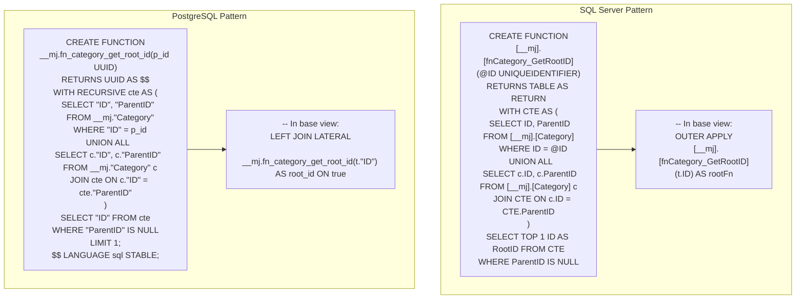

### Package Structure

The CodeGen provider implementations live alongside their respective DataProvider packages for cohesion:

```
packages/SQLServerDataProvider/
  src/
    SQLServerDataProvider.ts        (existing, refactored)
    codegen/
      SQLServerCodeGenProvider.ts   (extracted from CodeGenLib)
      sqlTemplates.ts               (T-SQL template helpers)

packages/PostgreSQLDataProvider/
  src/
    PostgreSQLDataProvider.ts       (new)
    codegen/
      PostgreSQLCodeGenProvider.ts  (new)
      pgTemplates.ts                (PL/pgSQL template helpers)

packages/CodeGenLib/
  src/
    Database/
      codeGenDatabaseProvider.ts    (NEW abstract base)
      sql_codegen.ts                (REFACTORED - orchestration only)
      manage-metadata.ts            (REFACTORED - uses provider)
      sql.ts                        (REFACTORED - uses provider)
```

### Deliverables

- [ ] `CodeGenDatabaseProvider` abstract base class
- [ ] Extract `SQLServerCodeGenProvider` from existing `SQLCodeGenBase`
- [ ] Refactor `SQLCodeGenBase` to orchestration-only (delegates to provider)
- [ ] Refactor `ManageMetadataBase` to use provider for introspection
- [ ] Refactor `SQLUtilityBase` to use provider for execution
- [ ] New `PostgreSQLCodeGenProvider` implementing all generation methods
- [ ] PostgreSQL view generation (with `"double-quote"` identifiers, `LEFT JOIN LATERAL`, `COALESCE`)
- [ ] PostgreSQL CRUD function generation (fn_create/fn_update/fn_delete)
- [ ] PostgreSQL trigger generation (function + trigger pairs)
- [ ] PostgreSQL index generation
- [ ] PostgreSQL full-text search generation (`tsvector` + `GIN`)
- [ ] PostgreSQL recursive function generation
- [ ] PostgreSQL permission grant generation
- [ ] Schema introspection for PostgreSQL (`pg_catalog` queries)
- [ ] Integration tests: generate SQL for test entities, validate against PG

---

## 7. Phase 4: RunView/RunQuery Multi-Platform Extensions

### PlatformSQL Type System

```typescript
/**
 * Supported database platforms.
 * Extensible - add new platforms as support is implemented.
 */
type DatabasePlatform = 'sqlserver' | 'postgresql';

/**
 * Represents a SQL fragment that may have platform-specific variants.
 * Used for ExtraFilter, OrderBy, WhereClause, and other user-provided SQL.
 *
 * Backward compatible: where a string was accepted before,
 * PlatformSQL is also accepted via union type.
 */
interface PlatformSQL {
    /** The default/fallback SQL. Used if no platform-specific variant exists. */
    default: string;
    /** SQL Server specific variant */
    sqlserver?: string;
    /** PostgreSQL specific variant */
    postgresql?: string;
}

/**
 * Type guard to check if a value is a PlatformSQL object vs plain string.
 */
function isPlatformSQL(value: string | PlatformSQL): value is PlatformSQL {
    return typeof value === 'object' && value !== null && 'default' in value;
}
```

### RunViewParams Extension

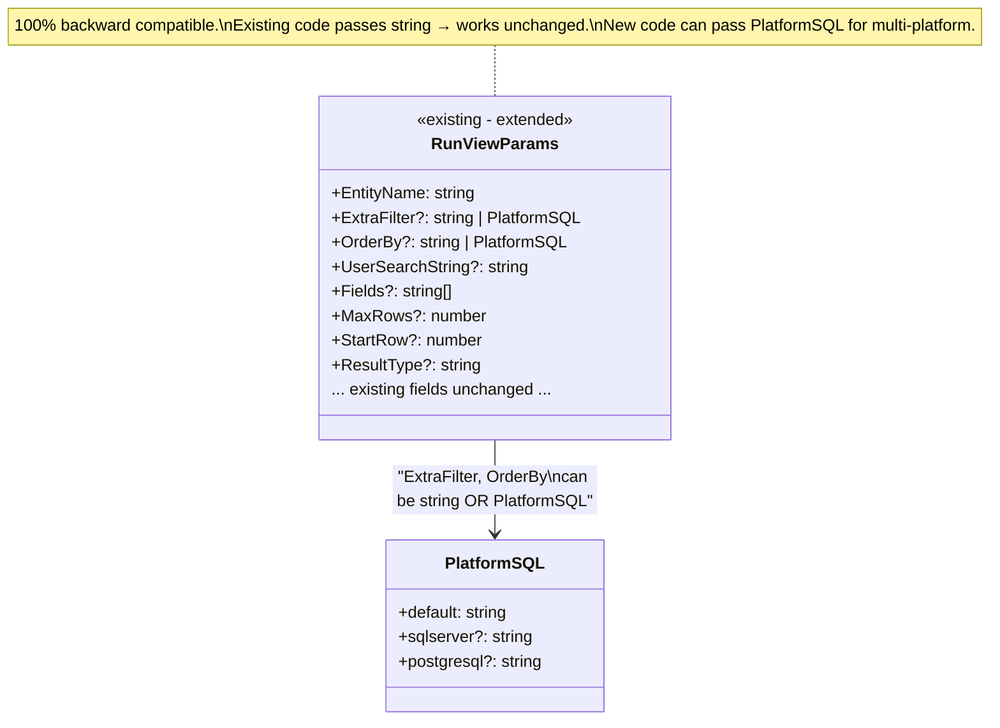

### Resolution Flow

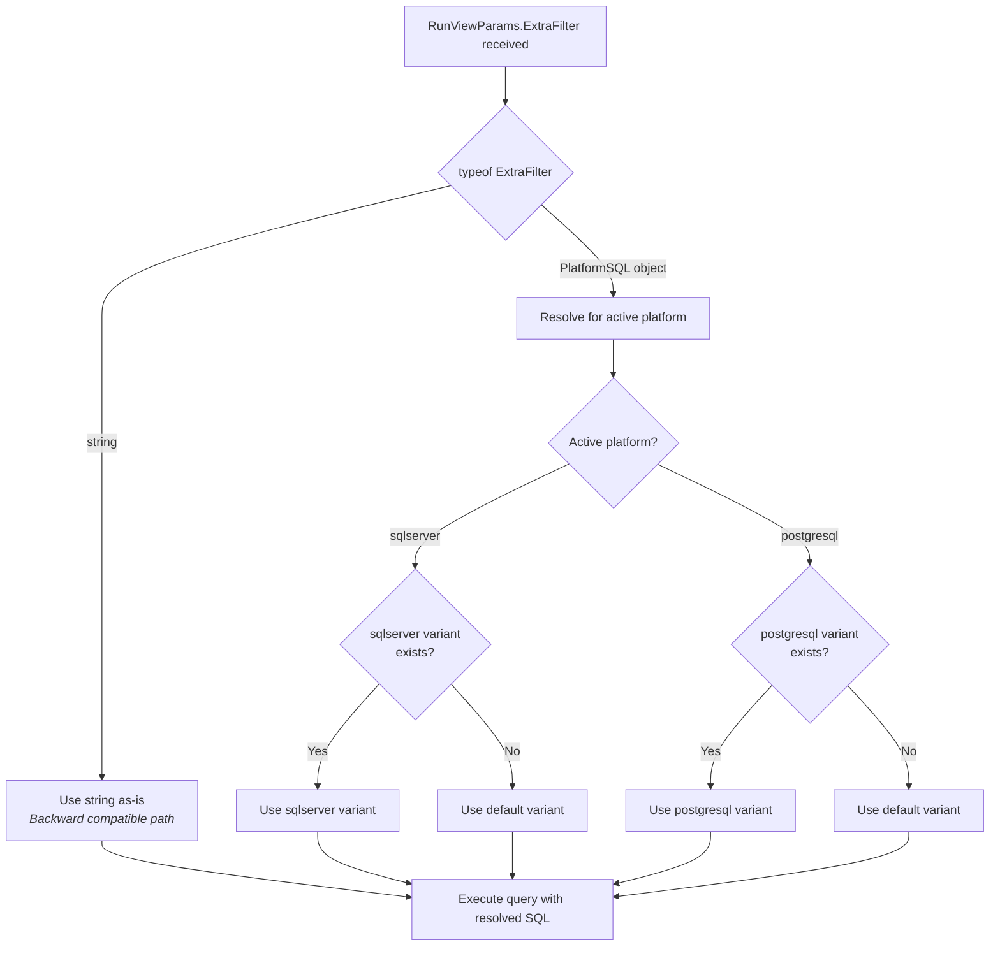

### Usage Examples

```typescript
// Existing code - works unchanged (backward compatible)
const result = await rv.RunView<UserEntity>({
    EntityName: 'Users',
    ExtraFilter: "Status = 'Active' AND Name LIKE 'J%'",
    OrderBy: 'Name ASC'
});

// New multi-platform code
const result = await rv.RunView<UserEntity>({
    EntityName: 'Users',
    ExtraFilter: {
        default: "Status = 'Active'",  // Standard SQL, works on both
        sqlserver: "[IsAdmin] = 1 AND [Name] LIKE 'J%'",
        postgresql: '"IsAdmin" = true AND "Name" LIKE \'J%\''
    },
    OrderBy: {
        default: 'Name ASC',
        sqlserver: '[LastLogin] DESC',
        postgresql: '"LastLogin" DESC NULLS LAST'
    }
});

// Common case: SQL that's already cross-platform
const result = await rv.RunView<UserEntity>({
    EntityName: 'Users',
    ExtraFilter: {
        default: "Status = 'Active' AND CreatedAt > '2024-01-01'"
        // No platform-specific variants needed - standard SQL
    }
});
```

### SQL Filter System Updates

The filter implementations in `runQuerySQLFilterImplementations.ts` become dialect-aware:

```mermaid
classDiagram
    class RunQuerySQLFilterManager {
        -dialect: SQLDialect
        +SetDialect(dialect: SQLDialect)
    }

    class SqlIdentifierFilter {
        +Apply(value: string): string
    }

    class SqlBooleanFilter {
        +Apply(value: boolean): string
    }

    class SqlStringFilter {
        +Apply(value: string): string
    }

    RunQuerySQLFilterManager --> SqlIdentifierFilter
    RunQuerySQLFilterManager --> SqlBooleanFilter
    RunQuerySQLFilterManager --> SqlStringFilter

    note for SqlIdentifierFilter "SQL Server: [value]\nPostgreSQL: \"value\""
    note for SqlBooleanFilter "SQL Server: 1 / 0\nPostgreSQL: true / false"
```

### Deliverables

- [ ] `PlatformSQL` type definition and `isPlatformSQL` type guard
- [ ] `DatabasePlatform` type definition
- [ ] `RunViewParams.ExtraFilter` extended to `string | PlatformSQL`
- [ ] `RunViewParams.OrderBy` extended to `string | PlatformSQL`
- [ ] `ResolveSQL()` method in `DatabaseProviderBase`
- [ ] Updated `RunQuerySQLFilterManager` with dialect injection
- [ ] Updated `sqlIdentifier` filter to use dialect quoting
- [ ] Updated `sqlBoolean` filter to use dialect booleans
- [ ] Updated `queryParameterProcessor` for PG type conversions
- [ ] Unit tests for PlatformSQL resolution
- [ ] Unit tests for updated filters with both dialects

---

## 8. Phase 5: Query Metadata Platform Variants

### Schema Design

Add a `PlatformVariants` JSON column to the existing `Query` entity (Option B from our discussion):

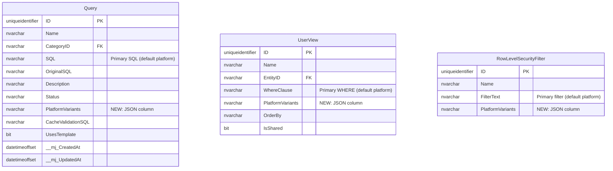

### PlatformVariants JSON Structure

```typescript
/**
 * Stored as JSON in the PlatformVariants column.
 * Maps platform keys to variant data for each SQL field that has variants.
 */
interface PlatformVariantsJSON {
    /** Platform variants for the main SQL field */
    SQL?: {
        sqlserver?: string;
        postgresql?: string;
    };
    /** Platform variants for WhereClause (UserViews) */
    WhereClause?: {
        sqlserver?: string;
        postgresql?: string;
    };
    /** Platform variants for CacheValidationSQL (Queries) */
    CacheValidationSQL?: {
        sqlserver?: string;
        postgresql?: string;
    };
    /** Platform variants for OrderBy */
    OrderBy?: {
        sqlserver?: string;
        postgresql?: string;
    };
    /** Platform variants for FilterText (RLS) */
    FilterText?: {
        sqlserver?: string;
        postgresql?: string;
    };
    /** Metadata about translation */
    _meta?: {
        translatedAt?: string;
        translatedBy?: 'manual' | 'llm';
        sourceDialect?: DatabasePlatform;
        llmModel?: string;
        verified?: boolean;
    };
}
```

### Runtime Resolution

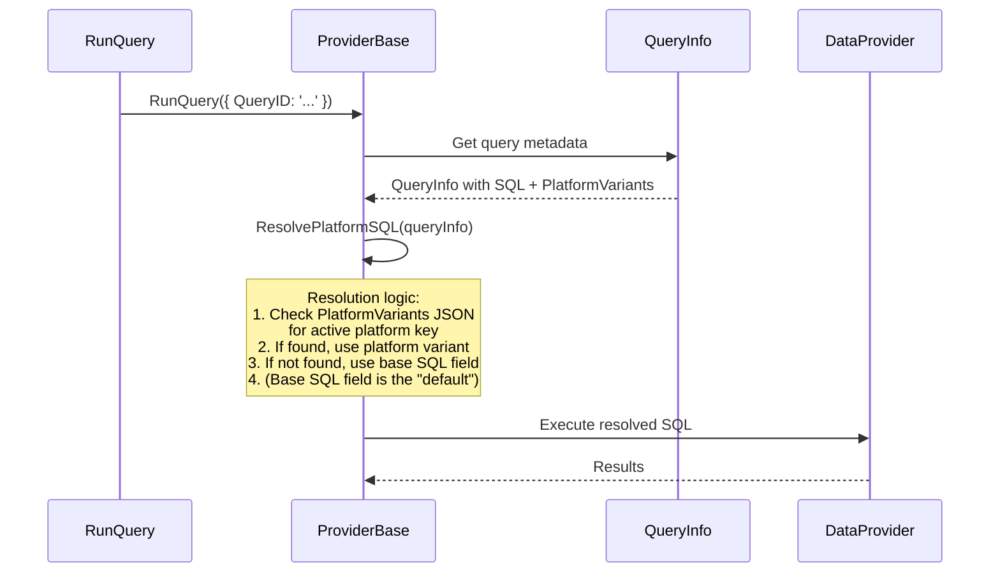

### TypeScript Interface for QueryInfo Extension

```typescript
// In queryInfo.ts - extend existing QueryInfo class
class QueryInfo {
    // ... existing properties ...

    /** JSON column containing platform-specific SQL variants */
    PlatformVariants: string | null = null;

    /**
     * Resolves the SQL for a given platform.
     * Checks PlatformVariants first, falls back to base SQL property.
     */
    GetPlatformSQL(platform: DatabasePlatform): string {
        if (this.PlatformVariants) {
            const variants: PlatformVariantsJSON = JSON.parse(this.PlatformVariants);
            if (variants.SQL?.[platform]) {
                return variants.SQL[platform];
            }
        }
        return this.SQL; // Default fallback
    }

    /**
     * Resolves CacheValidationSQL for a given platform.
     */
    GetPlatformCacheValidationSQL(platform: DatabasePlatform): string | null {
        if (this.PlatformVariants) {
            const variants: PlatformVariantsJSON = JSON.parse(this.PlatformVariants);
            if (variants.CacheValidationSQL?.[platform]) {
                return variants.CacheValidationSQL[platform];
            }
        }
        return this.CacheValidationSQL;
    }
}
```

### Migration for PlatformVariants Column

```sql
-- SQL Server migration
ALTER TABLE ${flyway:defaultSchema}.Query
ADD PlatformVariants NVARCHAR(MAX) NULL;

ALTER TABLE ${flyway:defaultSchema}.UserView
ADD PlatformVariants NVARCHAR(MAX) NULL;

ALTER TABLE ${flyway:defaultSchema}.RowLevelSecurityFilter
ADD PlatformVariants NVARCHAR(MAX) NULL;

-- PostgreSQL migration
ALTER TABLE __mj."Query"
ADD COLUMN "PlatformVariants" JSONB NULL;

ALTER TABLE __mj."UserView"
ADD COLUMN "PlatformVariants" JSONB NULL;

ALTER TABLE __mj."RowLevelSecurityFilter"
ADD COLUMN "PlatformVariants" JSONB NULL;
```

Note: PostgreSQL uses `JSONB` (binary JSON with indexing support) rather than `TEXT`/`VARCHAR` for JSON storage. This gives PG native JSON querying capabilities.

### Deliverables

- [ ] Migration adding `PlatformVariants` column to Query, UserView, RowLevelSecurityFilter entities
- [ ] `PlatformVariantsJSON` TypeScript interface
- [ ] `QueryInfo.GetPlatformSQL()` method
- [ ] `ViewInfo.GetPlatformWhereClause()` method
- [ ] `RowLevelSecurityFilterInfo.GetPlatformFilterText()` method
- [ ] Provider resolution logic in `ProviderBase.InternalRunQuery`
- [ ] Provider resolution logic in `ProviderBase.InternalRunView` (for saved views)
- [ ] CodeGen updates for new entity fields
- [ ] Unit tests for variant resolution (with/without variants, fallback behavior)

---

## 9. Phase 6: LLM Build-Time SQL Translation Pipeline

### Pipeline Architecture

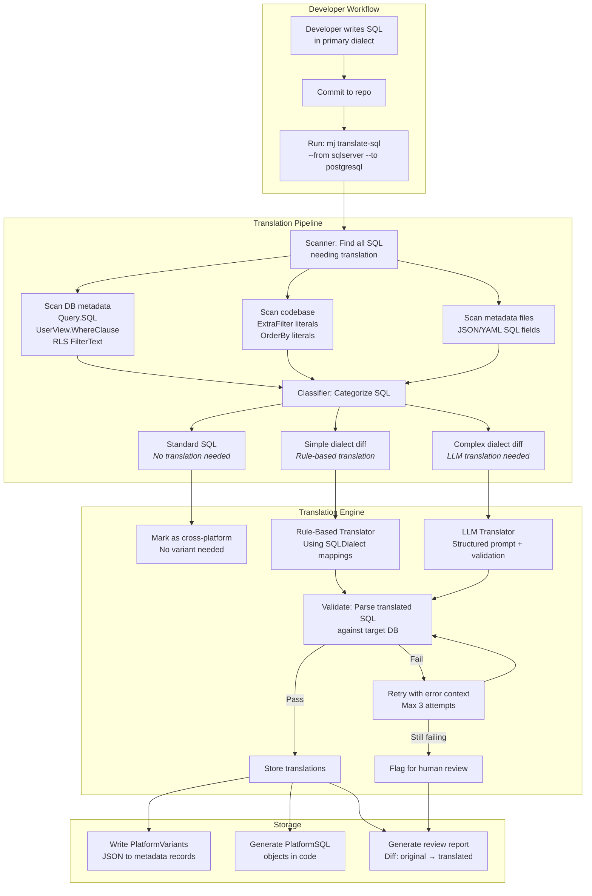

### SQL Classification Rules

```mermaid
graph TB
    INPUT[SQL Fragment] --> PARSE[Parse for dialect markers]

    PARSE --> CHECK_BRACKET{"Contains [brackets]?"}
    CHECK_BRACKET -->|Yes| DIALECT_SPECIFIC[SQL Server specific]
    CHECK_BRACKET -->|No| CHECK_TOP

    CHECK_TOP{"Contains TOP n?"}
    CHECK_TOP -->|Yes| DIALECT_SPECIFIC
    CHECK_TOP -->|No| CHECK_FUNCS

    CHECK_FUNCS{"Contains GETUTCDATE(),<br/>ISNULL(), IIF(),<br/>SCOPE_IDENTITY()?"}
    CHECK_FUNCS -->|Yes| DIALECT_SPECIFIC
    CHECK_FUNCS -->|No| CHECK_TYPES

    CHECK_TYPES{"Contains NVARCHAR,<br/>BIT, UNIQUEIDENTIFIER?"}
    CHECK_TYPES -->|Yes| DIALECT_SPECIFIC
    CHECK_TYPES -->|No| CHECK_STD

    CHECK_STD{"Only standard SQL?<br/>WHERE, AND, OR, IN,<br/>LIKE, =, <, >"}
    CHECK_STD -->|Yes| STANDARD[Standard SQL<br/>No translation needed]
    CHECK_STD -->|No| AMBIGUOUS[Needs LLM analysis]

    DIALECT_SPECIFIC --> SIMPLE_CHECK{"Only identifier quoting<br/>and boolean literals?"}
    SIMPLE_CHECK -->|Yes| RULE_BASED[Rule-based translation]
    SIMPLE_CHECK -->|No| LLM_NEEDED[LLM translation]
```

### LLM Translation Prompt Design

```typescript
interface TranslationPrompt {
    systemPrompt: string;
    userPrompt: string;
    validationSQL: string;
}

// Ground truth examples stored per dialect pair
const GROUND_TRUTH_EXAMPLES: TranslationExample[] = [
    {
        source: { platform: 'sqlserver', sql: "[Status] = 1 AND [CreatedAt] > GETUTCDATE() - 30" },
        target: { platform: 'postgresql', sql: '"Status" = true AND "CreatedAt" > NOW() - INTERVAL \'30 days\'' }
    },
    {
        source: { platform: 'sqlserver', sql: "SELECT TOP 10 [Name], [Email] FROM [__mj].[vwUsers] WHERE [IsActive] = 1 ORDER BY [Name]" },
        target: { platform: 'postgresql', sql: 'SELECT "Name", "Email" FROM __mj.vw_users WHERE "IsActive" = true ORDER BY "Name" LIMIT 10' }
    },
    {
        source: { platform: 'sqlserver', sql: "ISNULL([MiddleName], '') + ' ' + [LastName]" },
        target: { platform: 'postgresql', sql: "COALESCE(\"MiddleName\", '') || ' ' || \"LastName\"" }
    },
    // Many more examples covering edge cases...
];
```

### CLI Interface

```
mj translate-sql [options]

Options:
  --from <platform>      Source dialect (sqlserver, postgresql)
  --to <platform>        Target dialect (sqlserver, postgresql)
  --scope <scope>        What to scan (queries|views|filters|code|all)
  --review               Generate review report only (no writes)
  --dry-run              Show what would be translated
  --verify               Validate existing translations against target DB
  --model <model>        LLM model to use (default: claude-sonnet-4-5-20250929)
  --ground-truth <path>  Path to ground truth examples file
  --connection <name>    Named DB connection for validation
  --output <path>        Output directory for reports
  --force                Re-translate even if variants exist
```

### Translation Verification

```mermaid
sequenceDiagram
    participant CLI as mj translate-sql
    participant LLM as LLM (Claude)
    participant PG as PostgreSQL (Docker)

    CLI->>CLI: Load SQL fragment to translate
    CLI->>LLM: Translate with ground truth examples
    LLM-->>CLI: Translated SQL

    CLI->>PG: EXPLAIN (translated SQL)

    alt Parse succeeds
        PG-->>CLI: Query plan (confirms valid SQL)
        CLI->>CLI: Store translation ✓
    else Parse fails
        PG-->>CLI: Syntax error details
        CLI->>LLM: Retry with error context
        LLM-->>CLI: Corrected SQL
        CLI->>PG: EXPLAIN (corrected SQL)
        PG-->>CLI: Success or final failure
    end
```

### Deliverables

- [ ] `mj translate-sql` CLI command in MJCLI
- [ ] SQL Scanner (metadata DB records + codebase literals)
- [ ] SQL Classifier (standard / simple-rule / LLM-needed)
- [ ] Rule-based translator (using SQLDialect mappings for simple cases)
- [ ] LLM translator with structured prompting and ground truth examples
- [ ] Translation validator (EXPLAIN against target DB)
- [ ] PlatformVariants storage writer
- [ ] Review report generator (markdown diff format)
- [ ] Ground truth examples file for SQL Server ↔ PostgreSQL
- [ ] Integration with `mj codegen` workflow (optional auto-translate after generation)

---

## 10. Phase 7: Docker Development Environment

### Extended Docker Compose Architecture

```mermaid
graph TB
    subgraph "Docker Compose Network"
        subgraph "sql-claude"
            SS[SQL Server 2022<br/>Port: 1433 internal<br/>Port: 1444 host<br/>Memory: 4GB]
        end

        subgraph "postgres-claude"
            PG[PostgreSQL 16<br/>Port: 5432 internal<br/>Port: 5433 host<br/>Memory: 1GB]
        end

        subgraph "claude-dev"
            DEV[Development Container<br/>Node 24 + tools<br/>+ mssql-tools18<br/>+ postgresql-client<br/>+ psql, pg_dump, pg_restore<br/>Memory: 8GB]
        end

        DEV -->|"sql-claude:1433"| SS
        DEV -->|"postgres-claude:5432"| PG
    end

    subgraph "Host Machine"
        HOST_SS[localhost:1444 → SQL Server]
        HOST_PG[localhost:5433 → PostgreSQL]
        HOST_API[localhost:4000 → MJAPI]
        HOST_UI[localhost:4200 → Explorer]
    end

    SS -.-> HOST_SS
    PG -.-> HOST_PG
    DEV -.-> HOST_API
    DEV -.-> HOST_UI
```

### New Docker Compose Service

```yaml
# Added to docker/workbench/docker-compose.yml
  postgres-claude:
    image: postgres:16-bookworm
    container_name: postgres-claude
    environment:
      POSTGRES_USER: mj_admin
      POSTGRES_PASSWORD: ${PG_PASSWORD:-Claude2Pg99}
      POSTGRES_DB: MJ_Workbench
      # Performance tuning
      POSTGRES_INITDB_ARGS: "--data-checksums"
    ports:
      - "${PG_HOST_PORT:-5433}:5432"
    volumes:
      - postgres-claude-data:/var/lib/postgresql/data
      - ./pg-init:/docker-entrypoint-initdb.d  # Init scripts
    deploy:
      resources:
        limits:
          memory: 1g
        reservations:
          memory: 256m
    healthcheck:
      test: ["CMD-SHELL", "pg_isready -U mj_admin -d MJ_Workbench"]
      interval: 10s
      timeout: 5s
      retries: 10
      start_period: 30s
    command: >
      postgres
        -c shared_buffers=256MB
        -c effective_cache_size=512MB
        -c work_mem=16MB
        -c maintenance_work_mem=128MB
        -c max_connections=100
```

### PostgreSQL Init Script

```
docker/workbench/pg-init/
  01-create-schema.sql    # CREATE SCHEMA __mj;
  02-create-extensions.sql # CREATE EXTENSION IF NOT EXISTS "uuid-ossp";
                           # CREATE EXTENSION IF NOT EXISTS "pgcrypto";
```

### Database Bootstrap Script Extension

```bash
# docker/workbench/db-bootstrap-pg.sh
#!/bin/bash
# Bootstrap PostgreSQL database for MJ Workbench

PG_HOST="${PG_HOST:-postgres-claude}"
PG_PORT="${PG_PORT:-5432}"
PG_USER="${PG_USER:-mj_admin}"
PG_PASSWORD="${PG_PASSWORD:-Claude2Pg99}"
PG_DATABASE="${PG_DATABASE:-MJ_Workbench}"

export PGPASSWORD="$PG_PASSWORD"

echo "Checking PostgreSQL connectivity..."
until pg_isready -h "$PG_HOST" -p "$PG_PORT" -U "$PG_USER"; do
    echo "Waiting for PostgreSQL..."
    sleep 2
done

echo "Running Skyway migrations for PostgreSQL..."
cd /workspace/MJ
npx skyway migrate \
    --database-type postgresql \
    --host "$PG_HOST" \
    --port "$PG_PORT" \
    --database "$PG_DATABASE" \
    --user "$PG_USER" \
    --password "$PG_PASSWORD" \
    --schema __mj \
    --locations "filesystem:./migrations/postgresql"
```

### Container Dockerfile Additions

```dockerfile
# Add to docker/workbench/Dockerfile

# PostgreSQL client tools
RUN apt-get update && apt-get install -y \
    postgresql-client-16 \
    && rm -rf /var/lib/apt/lists/*
```

### Environment Configuration

```bash
# .env.database additions
PG_HOST=postgres-claude
PG_PORT=5432
PG_USER=mj_admin
PG_PASSWORD=Claude2Pg99
PG_DATABASE=MJ_Workbench

# Database type selection
DB_TYPE=sqlserver  # or postgresql
```

### Shell Aliases for PostgreSQL

```bash
# Added to .zshrc
alias pgcli="psql -h postgres-claude -U mj_admin -d MJ_Workbench"
alias pgq="psql -h postgres-claude -U mj_admin -d MJ_Workbench -c"
alias pgdbs="psql -h postgres-claude -U mj_admin -l"
alias pgtables="psql -h postgres-claude -U mj_admin -d MJ_Workbench -c '\\dt __mj.*'"
alias pgviews="psql -h postgres-claude -U mj_admin -d MJ_Workbench -c '\\dv __mj.*'"
alias pgfuncs="psql -h postgres-claude -U mj_admin -d MJ_Workbench -c '\\df __mj.*'"
```

### Deliverables

- [ ] Add `postgres-claude` service to `docker-compose.yml`
- [ ] PostgreSQL init scripts (schema, extensions)
- [ ] `db-bootstrap-pg.sh` script
- [ ] Add `postgresql-client-16` to Dockerfile
- [ ] Add PG environment variables to `.env.database`
- [ ] Add PG shell aliases to `.zshrc`
- [ ] Add `DB_TYPE` configuration to `mj.config.cjs`
- [ ] Update `entrypoint.sh` to handle PG bootstrap
- [ ] Test: both databases running simultaneously in Docker
- [ ] Update `docker/CLAUDE.md` with PG documentation

---

## 11. Phase 8: Migration Strategy & Baseline Generation

### Dual-Track Migration Architecture

```mermaid
graph TB
    subgraph "Migration File System"
        ROOT[migrations/]
        ROOT --> SS_DIR[sqlserver/]
        ROOT --> PG_DIR[postgresql/]
        ROOT --> SHARED[shared/]

        SS_DIR --> SS_BASE["B202602061600__v4.0_Baseline.sql<br/><i>(existing, moved)</i>"]
        SS_DIR --> SS_V["V202603XXXXXX__description.sql<br/><i>(T-SQL incremental)</i>"]
        SS_DIR --> SS_R["R__RefreshMetadata.sql<br/><i>(T-SQL repeatable)</i>"]

        PG_DIR --> PG_BASE["B202603XXXXXX__v5.0_PG_Baseline.sql<br/><i>(PL/pgSQL generated)</i>"]
        PG_DIR --> PG_V["V202603XXXXXX__description.sql<br/><i>(PL/pgSQL incremental)</i>"]
        PG_DIR --> PG_R["R__RefreshMetadata.sql<br/><i>(PL/pgSQL repeatable)</i>"]

        SHARED --> SHARED_META["metadata-seed.json<br/><i>Platform-agnostic metadata<br/>Applied by CodeGen post-migration</i>"]
    end

    subgraph "Skyway Configuration"
        SKYWAY_CFG["skyway.json"]
        SKYWAY_CFG -->|"databaseType: sqlserver"| SS_DIR
        SKYWAY_CFG -->|"databaseType: postgresql"| PG_DIR
    end
```

### PostgreSQL Baseline Generation Process

```mermaid
flowchart TB
    START([Generate PG Baseline]) --> LOAD[Load MJ metadata schema<br/>from entity definitions]

    LOAD --> TABLES[Generate CREATE TABLE statements<br/>for all ~275 MJ tables]
    TABLES --> MAP_TYPES[Map SQL Server types → PG types<br/>using SQLDialect.typeMap]
    MAP_TYPES --> MAP_DEFAULTS[Map defaults:<br/>NEWSEQUENTIALID → gen_random_uuid<br/>GETUTCDATE → NOW<br/>etc.]
    MAP_DEFAULTS --> CONSTRAINTS[Generate constraints:<br/>PRIMARY KEY, FOREIGN KEY,<br/>UNIQUE, CHECK]

    CONSTRAINTS --> SCHEMA_CREATE["CREATE SCHEMA __mj;"]
    SCHEMA_CREATE --> EXTENSIONS["CREATE EXTENSION uuid-ossp;<br/>CREATE EXTENSION pgcrypto;"]
    EXTENSIONS --> TABLE_DDL[All CREATE TABLE statements<br/>in dependency order]
    TABLE_DDL --> VIEWS[Generate views via<br/>PostgreSQLCodeGenProvider]
    VIEWS --> FUNCTIONS[Generate CRUD functions via<br/>PostgreSQLCodeGenProvider]
    FUNCTIONS --> TRIGGERS[Generate triggers via<br/>PostgreSQLCodeGenProvider]
    TRIGGERS --> INDEXES[Generate indexes]
    INDEXES --> FTS[Generate full-text search objects]
    FTS --> PERMS[Generate permission grants]
    PERMS --> SEED[Generate seed data<br/>(system entities, fields, etc.)]

    SEED --> VALIDATE[Validate: Run against<br/>Docker PostgreSQL]
    VALIDATE -->|Success| WRITE[Write to<br/>migrations/postgresql/B_baseline.sql]
    VALIDATE -->|Failure| FIX[Fix issues, re-generate]
    FIX --> VALIDATE
```

### PostgreSQL Naming Conventions

| SQL Server Convention | PostgreSQL Convention | Notes |
|----------------------|---------------------|-------|
| `[__mj].[User]` | `__mj."User"` | Preserve PascalCase with quotes |
| `[__mj].[vwUsers]` | `__mj.vw_users` | Views use snake_case (PG convention) |
| `[__mj].[spCreateUser]` | `__mj.fn_create_user()` | Functions use snake_case + fn_ prefix |
| `[__mj].[trgUpdateUser]` | `__mj.trg_update_user` | Triggers use snake_case + trg_ prefix |
| `[__mj].[fnUser_GetRootID]` | `__mj.fn_user_get_root_id()` | Functions use snake_case |
| `IDX_AUTO_MJ_FKEY_User_RoleID` | `idx_auto_mj_fkey_user_roleid` | Indexes use snake_case (PG lowercases unquoted) |

### Repeatable Migration: R__RefreshMetadata.sql (PostgreSQL version)

The SQL Server version calls system stored procedures. The PostgreSQL version calls equivalent functions:

```sql
-- PostgreSQL R__RefreshMetadata.sql
SELECT __mj.fn_recompile_all_views();
SELECT __mj.fn_update_existing_entities_from_schema();
SELECT __mj.fn_update_schema_info_from_database();
SELECT __mj.fn_delete_unneeded_entity_fields();
SELECT __mj.fn_update_existing_entity_fields_from_schema();
SELECT __mj.fn_set_default_column_width_where_needed();
-- Note: PG doesn't need sp_recompile equivalent;
-- CREATE OR REPLACE handles this automatically
```

### Deliverables

- [ ] Restructure `migrations/` directory with `sqlserver/` and `postgresql/` subdirectories
- [ ] Move existing migrations to `migrations/sqlserver/`
- [ ] Skyway configuration for platform-based migration directory selection
- [ ] PostgreSQL baseline generator tool (uses CodeGenDatabaseProvider)
- [ ] Generated PostgreSQL baseline migration
- [ ] PostgreSQL `R__RefreshMetadata.sql`
- [ ] System utility functions for PostgreSQL (equivalents of system SPs)
- [ ] Seed data for PostgreSQL (entity metadata, system records)
- [ ] Validation: full baseline runs clean against Docker PG
- [ ] Documentation of naming conventions

---

## 12. Phase 9: Full Feature Parity & Testing

### Feature Parity Matrix

```mermaid
graph TB
    subgraph "Feature Parity Tracking"
        direction LR

        subgraph "Core Data Operations"
            C1[RunView - basic SELECT ✓]
            C2[RunView - pagination ✓]
            C3[RunView - aggregations]
            C4[RunView - user search / FTS]
            C5[RunQuery - template queries]
            C6[RunQuery - parameterized]
            C7[Entity CRUD - Create]
            C8[Entity CRUD - Update]
            C9[Entity CRUD - Delete/Soft-Delete]
            C10[Entity CRUD - Load]
            C11[Transaction Groups]
            C12[Composite Keys]
        end

        subgraph "CodeGen"
            G1[Base View generation]
            G2[CRUD function generation]
            G3[Trigger generation]
            G4[Index generation]
            G5[Full-text search]
            G6[Recursive functions]
            G7[Permission grants]
            G8[Schema introspection]
            G9[Metadata sync]
            G10[Column reorder]
        end

        subgraph "Advanced"
            A1[Record Changes / Versioning]
            A2[Row Level Security]
            A3[Audit Logging]
            A4[Entity Dependencies]
            A5[Record Merge]
            A6[Duplicate Detection]
        end
    end
```

### Testing Strategy

```mermaid
flowchart TB
    subgraph "Test Pyramid"
        direction TB
        UNIT["Unit Tests<br/><i>Per package, mocked DB</i><br/>SQLDialect, PlatformSQL resolution,<br/>SQL generation string comparison"]
        INTEG["Integration Tests<br/><i>Against Docker containers</i><br/>RunView, CRUD, CodeGen output,<br/>Migration execution"]
        E2E["End-to-End Tests<br/><i>Full stack with API + DB</i><br/>GraphQL → Provider → PostgreSQL<br/>Entity lifecycle, search, queries"]

        E2E --> INTEG --> UNIT
    end

    subgraph "Test Matrix"
        UNIT_SS[Unit: SQL Server Dialect]
        UNIT_PG[Unit: PostgreSQL Dialect]
        INTEG_SS[Integration: SQL Server Docker]
        INTEG_PG[Integration: PostgreSQL Docker]
        E2E_SS[E2E: Full Stack SQL Server]
        E2E_PG[E2E: Full Stack PostgreSQL]
    end

    UNIT --> UNIT_SS & UNIT_PG
    INTEG --> INTEG_SS & INTEG_PG
    E2E --> E2E_SS & E2E_PG
```

### Integration Test Framework

```typescript
// test-utils addition: DatabaseTestContext
class DatabaseTestContext {
    static async create(platform: DatabasePlatform): Promise<DatabaseTestContext> {
        // Connects to Docker container for the specified platform
        // Creates an isolated test schema
        // Returns a context with provider + connection
    }

    async runMigrations(): Promise<void>;
    async runCodeGen(): Promise<void>;
    async seedTestData(): Promise<void>;
    async cleanup(): Promise<void>;

    get Provider(): DatabaseProviderBase;
    get RunView(): RunView;
    get Metadata(): Metadata;
}

// Usage in tests
describe('RunView on PostgreSQL', () => {
    let ctx: DatabaseTestContext;

    beforeAll(async () => {
        ctx = await DatabaseTestContext.create('postgresql');
        await ctx.runMigrations();
        await ctx.runCodeGen();
        await ctx.seedTestData();
    });

    afterAll(async () => {
        await ctx.cleanup();
    });

    it('should execute basic SELECT with LIMIT', async () => {
        const result = await ctx.RunView.RunView({
            EntityName: 'Users',
            MaxRows: 10
        });
        expect(result.Success).toBe(true);
        expect(result.Results.length).toBeLessThanOrEqual(10);
    });
});
```

### Deliverables

- [ ] Feature parity checklist with pass/fail per platform
- [ ] Unit tests for all SQLDialect methods (both platforms)
- [ ] Unit tests for PlatformSQL resolution
- [ ] Integration tests for RunView (basic, pagination, aggregation, search)
- [ ] Integration tests for RunQuery (template, parameterized)
- [ ] Integration tests for CRUD operations
- [ ] Integration tests for CodeGen output (validate generated SQL runs clean)
- [ ] E2E tests: GraphQL → PostgreSQL full stack
- [ ] `DatabaseTestContext` utility in `@memberjunction/test-utils`
- [ ] CI pipeline running tests against both databases
- [ ] Performance benchmarks: SQL Server vs PostgreSQL for key operations

---

## 13. Package Inventory & Impact Map

### New Packages

| Package | Description | Dependencies |
|---------|------------|-------------|
| `@memberjunction/sql-dialect` | SQL dialect abstraction (types, quoting, type mapping) | None (pure logic) |
| `@memberjunction/postgresql-dataprovider` | PostgreSQL data provider | `pg`, `@mj/sql-dialect`, `@mj/core` |
| `@memberjunction/postgresql-codegen` | PostgreSQL CodeGen provider (if separate from dataprovider) | `pg`, `@mj/sql-dialect`, `@mj/codegen-lib` |

### Modified Packages

| Package | Changes | Risk |
|---------|---------|------|
| `@memberjunction/core` (MJCore) | Add `PlatformSQL` type, extend `RunViewParams`, extend `QueryInfo`, enrich `DatabaseProviderBase` | **Medium** - backward compatible additions |
| `@memberjunction/sqlserver-dataprovider` | Refactor to use `SQLDialect`, slim down by promoting logic to base | **High** - major refactor of 5,966 lines |
| `@memberjunction/codegen-lib` | Extract abstract base, convert to orchestration-only | **High** - major refactor |
| `@memberjunction/mjcli` | Add `translate-sql` command, update Skyway integration | **Low** - additive |
| `@memberjunction/server` (MJServer) | Config for `databaseType`, provider loading | **Low** - config change |
| `@memberjunction/test-utils` | Add `DatabaseTestContext` | **Low** - additive |

### Unchanged Packages

All Angular packages, AI packages, GraphQL resolvers (they work through the provider abstraction), Actions, and the client-side `GraphQLDataProvider`.

---

## 14. Risk Register

| Risk | Likelihood | Impact | Mitigation |
|------|-----------|--------|-----------|
| SQLServerDataProvider refactor introduces regressions | High | High | Comprehensive test coverage before refactoring; refactor incrementally with CI gates |
| CodeGen PostgreSQL output doesn't match expected schema | Medium | High | Validate every generated SQL against Docker PG; compare entity metadata round-trip |
| LLM translation produces subtly wrong SQL | Medium | Medium | EXPLAIN validation + human review; ground truth test suite; never use at runtime |
| PostgreSQL performance differs significantly from SQL Server | Low | Medium | Benchmark key operations; tune PG config; adjust generated SQL if needed |
| `ExtraFilter` strings in existing applications break on PG | Medium | Medium | Most are standard SQL; provide `mj translate-sql` tool for developers |
| Stored procedures vs functions behavioral differences | Low | Medium | Thorough testing of CRUD operations; handle edge cases in provider |
| Docker workbench memory pressure with two databases | Low | Low | PG is lightweight (~256MB-1GB); configurable memory limits |
| Skyway multi-DB support delays MJ multi-DB work | Medium | Medium | Skyway refactor is smaller scope; can be done in parallel |

---

## 15. Open Questions

1. **View naming convention**: Should PostgreSQL views use `vw_users` (snake_case, PG convention) or `vwUsers` (matching SQL Server)? Recommended: snake_case for PG-native feel, with the `BaseView` field in metadata mapping to the correct name per platform.

2. **Schema name**: Should PostgreSQL use `__mj` schema (matching SQL Server) or a more PG-conventional name? Recommended: keep `__mj` for consistency - it works fine in PG.

3. **Table naming**: PascalCase table names require quoting in PG (`"User"` not `User`). Should we keep PascalCase (consistency) or switch to snake_case for PG tables? Recommended: keep PascalCase with quoting - this matches the entity names and avoids confusion.

4. **Full-text search parity**: SQL Server and PostgreSQL FTS have different capabilities (language support, ranking algorithms, phrase search). How much parity do we need? Recommended: functional parity (search works), not feature parity (same ranking scores).

5. **Connection pooling**: SQL Server uses `mssql` connection pool; PostgreSQL uses `pg.Pool`. Should pooling config be unified? Recommended: same config shape in `mj.config.cjs` with provider-specific defaults.

6. **CI/CD**: Should every PR run tests against both databases? Recommended: Yes for provider packages; No for unrelated packages (Angular, AI, etc.).

---

## Implementation Timeline

```mermaid
gantt
    title Multi-Database Platform Support - Implementation Phases
    dateFormat YYYY-MM-DD
    axisFormat %b %d

    section Foundation
    Phase 1: SQL Dialect Abstraction        :p1, 2026-03-01, 14d
    Phase 7: Docker Environment             :p7, 2026-03-01, 7d
    Skyway Multi-DB (parallel)              :sky, 2026-03-01, 21d

    section Core Providers
    Phase 2: Data Provider Refactoring      :p2, after p1, 21d
    Phase 4: RunView/RunQuery Extensions    :p4, after p1, 14d

    section CodeGen
    Phase 3: CodeGen Provider Architecture  :p3, after p2, 28d

    section Metadata & Translation
    Phase 5: Query Metadata Variants        :p5, after p4, 14d
    Phase 6: LLM Translation Pipeline       :p6, after p5, 21d

    section Migration & Testing
    Phase 8: Migration & Baseline           :p8, after p3, 21d
    Phase 9: Full Parity & Testing          :p9, after p8, 28d
```

Note: Phases 1 and 7 can start immediately in parallel. The Skyway multi-DB refactor runs in parallel with MJ foundation work. The critical path is Phase 1 → Phase 2 → Phase 3 → Phase 8 → Phase 9.
