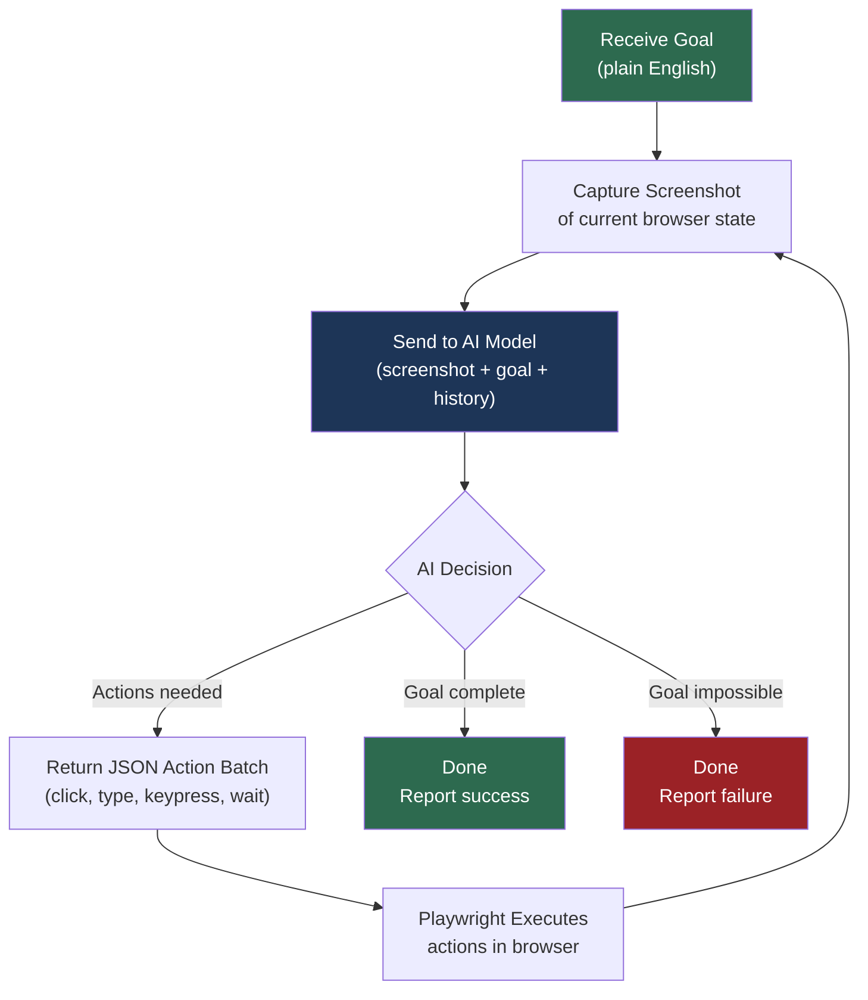

# Project Brief for Caleb

## Computer Use Agent Prototype (Vision-Action Browser Automation)

---

## 1. Project Context

Welcome aboard, Caleb!

Your first project at Blue Cypress is to build an early prototype of something we believe will become a major capability inside the MemberJunction ecosystem:

**A Computer Use Agent** — an AI-driven system that can control a web browser the way a human would, based on screenshots and plain-language instructions.

This prototype is intentionally standalone, outside of MemberJunction, so you can work quickly without needing to understand the full MJ codebase yet.

---

## 2. The Big Idea

### Why Computer Use Matters

Most AI integrations today work through APIs — structured data in, structured data out. That's powerful, but it has a hard ceiling: it only works with systems that *have* APIs. The vast majority of software in the world — legacy enterprise apps, internal tools, third-party SaaS platforms, desktop applications — has no API at all. The only interface is the screen.

Computer Use agents break through that ceiling. Instead of requiring an API, the agent interacts with software the same way a human does: it looks at the screen, decides what to do, and performs clicks and keystrokes. This means:

- **Any application becomes automatable** — no API, no integration code, no vendor cooperation required
- **Testing becomes visual** — you can verify what a *user* actually sees, not just what an API returns
- **The last mile of automation is solved** — the countless manual workflows that exist only because "there's no API for that" can finally be automated
- **AI agents become truly general-purpose** — they can operate across applications, browsers, and even desktops without bespoke connectors for each one

For MemberJunction specifically, this unlocks end-to-end regression testing of the Explorer UI, automated QA workflows, and eventually a general-purpose "Computer Use Agent" type that MJ customers can deploy against their own applications.

### The Core Loop

We want to prove that we can build a loop like this:



This is sometimes called:

- **Vision-Action agent**
- **Computer Use agent**
- **UI automation agent**
- **Multimodal browser agent**

The core concept is:

- The system **sees** the UI visually (via screenshot)
- It receives an English instruction
- It emits a structured set of browser actions
- Playwright executes those actions

---

## 3. Primary Goal of This Prototype

The prototype should demonstrate:

- A headless browser can be controlled through AI-driven action planning
- Plain-English instructions can produce real UI navigation
- Actions can be returned in strict JSON
- The system can complete simple tasks end-to-end

This prototype will later evolve into:

- Automated regression testing for MemberJunction Explorer
- UI-based verification agent for API-driven tests
- A general "Computer Use Agent" type in MJ's agent framework

---

## 4. MVP Scope (Minimum Viable Prototype)

Your first milestone is extremely simple:

**Build a Node.js program that:**

1. Launches Chromium using Playwright
2. Navigates to a public site (no login required)
3. Accepts a goal like: `"Go to CNN and search for 'AI'"`
4. Captures a screenshot
5. Sends the screenshot + goal to a multimodal model
6. Receives back JSON actions like:

```json
[
  { "type": "click", "x": 210, "y": 115 },
  { "type": "type", "text": "AI" },
  { "type": "keypress", "key": "Enter" }
]
```

7. Executes them
8. Takes a new screenshot
9. Loops until the goal is completed

That's it.

If you can do one full loop successfully, the concept is proven.

---

## 5. Key Design Principles

### 5.1 Standalone First

Do **NOT** integrate with MemberJunction yet.

This should run independently:

```bash
node run-agent.js
```

### 5.2 Public Website First

Start with something like:

- wikipedia.org
- cnn.com
- nytimes.com
- amazon.com

No authentication.

### 5.3 Actions Should Be Batched

The AI should be able to return multiple actions at once, not just one.

Example:

- Click input
- Type text
- Press enter

One model call should produce a meaningful sequence.

### 5.4 Strict JSON Output

The model must return structured actions. No prose. The output must validate cleanly.

### 5.5 Model-Agnostic Architecture

We may start with Gemini, but we want the system designed so we can swap models later.

---

## 6. Technical Stack

| Component           | Technology                              |
| ------------------- | --------------------------------------- |
| Runtime             | Node.js + TypeScript                    |
| Browser Automation  | Playwright + Chromium                   |
| Containerization    | Docker (later)                          |
| AI Vision Model     | Gemini Flash (eventually Gemini 3 Flash)|
| Action Contract     | Strict JSON schema                      |

---

## 7. Project Structure Recommendation

Create a repo like:

```
computer-use-agent-prototype/
|
├── src/
│   ├── agent/
│   │   ├── agentLoop.ts
│   │   ├── actionSchema.ts
│   │   ├── actionExecutor.ts
│   │   ├── modelClient.ts
│   │   └── visionPacket.ts
│   │
│   ├── main.ts
│   └── config.ts
│
├── screenshots/
│
├── package.json
├── tsconfig.json
└── README.md
```

---

## 8. Core System Components

### A. Agent Loop

This is the orchestrator:

```typescript
while (!done) {
  screenshot = captureScreen();
  actions = model.plan(goal, screenshot);
  execute(actions);
}
```

### B. Vision Packet (Model Input)

Each loop iteration should send:

```json
{
  "goal": "Search Wikipedia for 'Machine Learning'",
  "screenshot": "<base64>",
  "available_actions": ["click", "type", "keypress", "wait"],
  "step": 3
}
```

Later we will include screenshot history, URL, etc.

### C. Action Schema

Start with:

| Action Type | Fields |
| ----------- | ------ |
| `click`     | x, y   |
| `type`      | text   |
| `keypress`  | key    |
| `wait`      | ms     |

Example TypeScript:

```typescript
export type Action =
  | { type: "click"; x: number; y: number }
  | { type: "type"; text: string }
  | { type: "keypress"; key: string }
  | { type: "wait"; ms: number };
```

### D. Executor (Playwright)

```typescript
if (action.type === "click") {
  await page.mouse.click(action.x, action.y);
}
```

### E. Model Client

Stub it at first:

```typescript
return [
  { type: "click", x: 200, y: 120 },
  { type: "type", text: "AI" },
  { type: "keypress", key: "Enter" }
];
```

Then plug in Gemini.

---

## 9. Authentication Strategy (Future)

When we move to MemberJunction, authentication becomes real. MFA is not practical for agents.

**Solution:**

- Create a dedicated Auth0 tenant
- Username/password only
- No MFA
- No access to production systems
- Tokens are valid only inside the test environment

This gives the agent safe login capability.

---

## 10. Docker Compose (Later)

Eventually, regression testing MJ will look like:

| Container       | Role                    |
| --------------- | ----------------------- |
| `sqlserver`     | MemberJunction DB       |
| `mjapi`         | Node API server         |
| `mjexplorer`    | Angular UI              |
| `agent-runner`  | Playwright + AI agent   |

Compose file will live in repo:

```bash
docker-compose up
```

---

## 11. Learning Resources

### Node.js + TypeScript

- [Node Basics](https://nodejs.org/en/learn)
- [TypeScript Handbook](https://www.typescriptlang.org/docs/)
- [TS for Node Projects](https://khalilstemmler.com/blogs/typescript/node-starter-project/)

### Playwright

- [Official Docs](https://playwright.dev/docs/intro)
- [Playwright API Reference](https://playwright.dev/docs/api/class-page)
- [Running Headless Chromium](https://playwright.dev/docs/browsers)
- [Docker Support](https://playwright.dev/docs/docker)

### Browser Automation Concepts

- [Selenium vs Playwright Overview](https://playwright.dev/docs/why-playwright)

### Multimodal AI Agents (Vision + Action)

- [Gemini Vision Capabilities](https://ai.google.dev/gemini-api/docs/vision)
- [Function Calling + Structured Output](https://ai.google.dev/gemini-api/docs/function-calling)
- [Agentic Design Patterns](https://www.deeplearning.ai/short-courses/ai-agents/)

### JSON Schema Validation

- [Ajv Validator (Node standard)](https://ajv.js.org/)

### Docker + Compose

- [Docker Overview](https://docs.docker.com/get-started/)
- [Docker Compose Intro](https://docs.docker.com/compose/)
- [Compose YAML Reference](https://docs.docker.com/compose/compose-file/)

---

## 12. Deliverables (Due Wednesday COB)

By close of business Wednesday, you should have:

- [ ] Node project bootstrapped
- [ ] Playwright launching headless Chromium
- [ ] Goal -> Screenshot -> Action loop running
- [ ] Actions executed from JSON array
- [ ] Demo task working on a public website
- [ ] Clean README with instructions

**Stretch goal:**

- [ ] Plug in Gemini Vision API for real decision-making

---

## 13. Example Demo Goals

Use these as test prompts:

1. "Go to Wikipedia and search for 'Artificial Intelligence'"
2. "Open CNN and click on the first headline"
3. "Go to Amazon and search for 'wireless mouse'"
4. "Navigate to nytimes.com and open the Technology section"

---

## 14. Next Phase (After Prototype Works)

Once stable, we will:

- Integrate into MemberJunction agent framework
- Run against MJ Explorer UI
- Add login support
- Add UI assertions and regression reporting
- Add parallel execution in Docker

---

## Final Note

Caleb — this is a perfect starter project because it's:

- **Self-contained** — no MJ dependencies to learn upfront
- **Highly modern** — cutting-edge AI agent patterns
- **Directly tied to MJ's future** — will become a real agent type
- **A real AI-agent capability** — not a toy

We're not expecting perfection — we're proving the loop.
