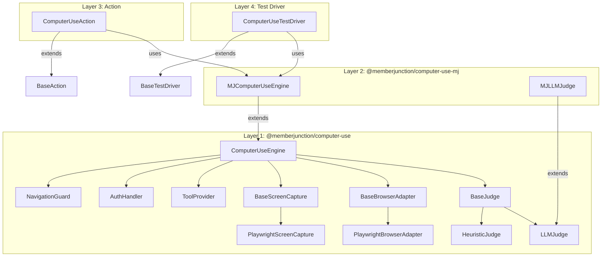
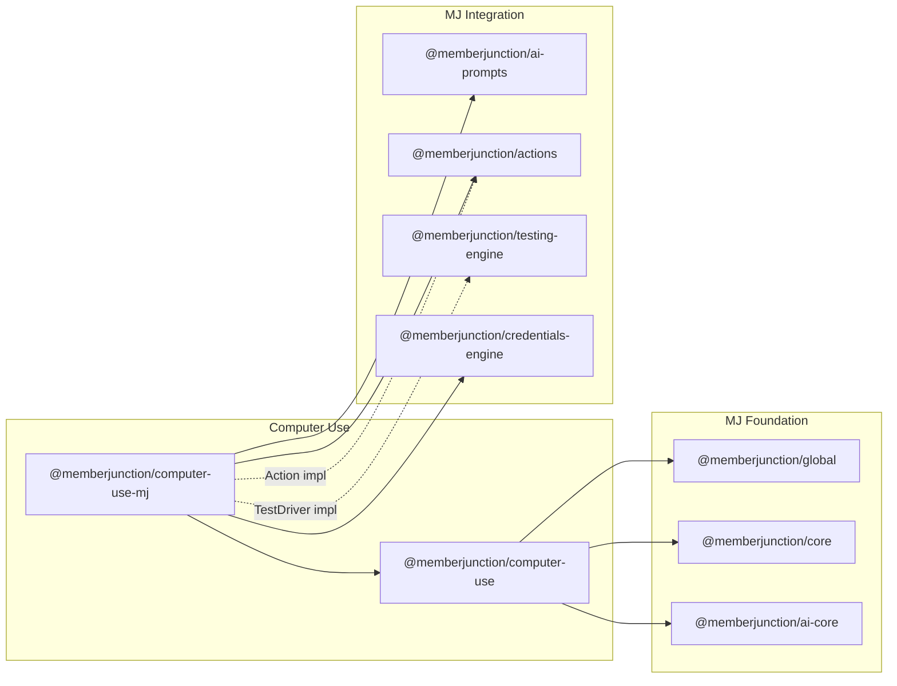
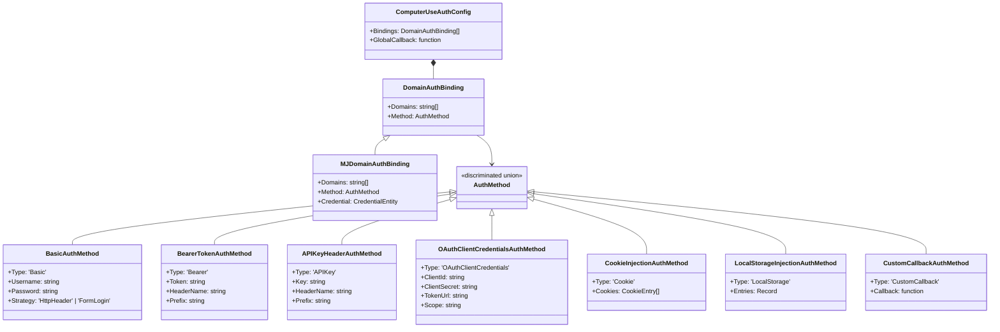
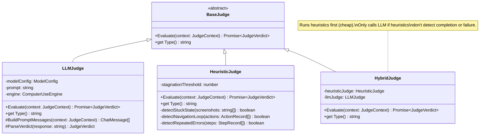
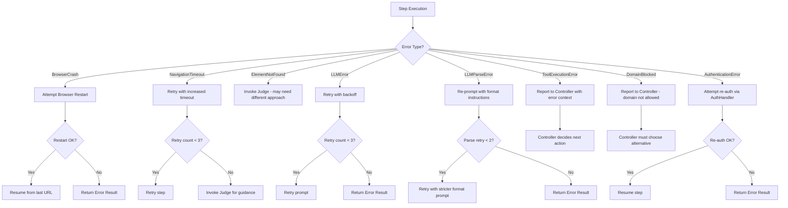
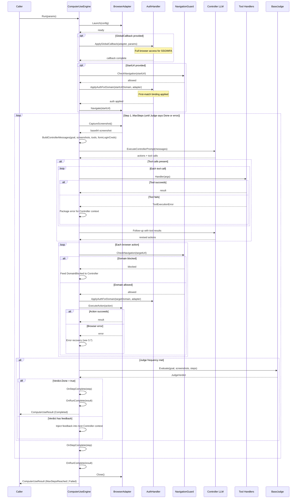
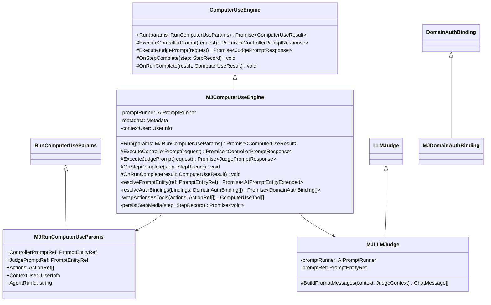
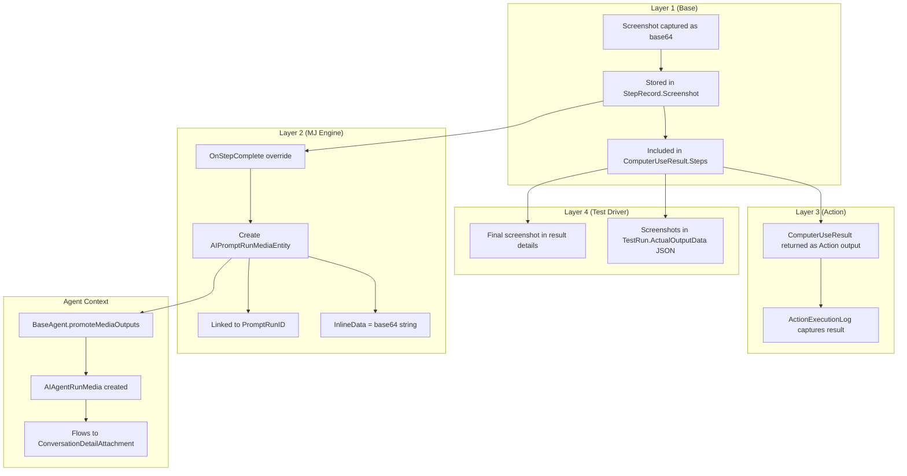

# MemberJunction Computer Use: Architecture & Implementation Plan

**Version:** 2.1
**Authors:** Amith Nagarajan (Product/Architecture), Caleb (Implementation Lead)
**Last Updated:** 2026-02-06

---

## 1. Executive Summary

This document defines the production architecture for a **Computer Use** capability in MemberJunction: a Vision-to-Action framework that drives a web browser via LLM reasoning over screenshots. The design follows MJ's established patterns: hardcore OOP with base classes, `@RegisterClass` + ClassFactory, provider/strategy patterns, and PascalCase public member conventions.

### Key Deliverables

| Layer | Class | MJ Pattern | Package |
|-------|-------|------------|---------|
| 1 - Engine | `ComputerUseEngine` | Standalone base class | `@memberjunction/computer-use` |
| 2 - MJ Engine | `MJComputerUseEngine` | Subclass of Layer 1 | `@memberjunction/computer-use-mj` |
| 3 - Action | `ComputerUseAction` | `extends BaseAction` | `@memberjunction/core-actions` (or dedicated) |
| 4 - Test Driver | `ComputerUseTestDriver` | `extends BaseTestDriver` | `@memberjunction/testing-engine` (or dedicated) |

### Design Principles

1. **Inheritance over composition** - Layer 2 extends Layer 1 via virtual method overrides, not callback injection
2. **Strategy pattern for extensibility** - Judge, ScreenCapture, and BrowserAdapter are pluggable strategies
3. **No `any` types** - All contracts use proper generics and discriminated unions
4. **PascalCase public / camelCase private** - Non-negotiable MJ convention
5. **Screenshots as base64 strings** - No persistence at Layer 1; Layer 2+ persists via AIPromptRunMedia, AgentRunMedia, and TestRun entities
6. **Per-domain auth bindings** - Auth is scoped to domains, supports multi-site scenarios, MJ Credentials integration at Layer 2

---

## 2. Architecture Overview

### 2.1 Layer Diagram



### 2.2 Dependency Graph



**Layer 1 depends only on:** `@memberjunction/global`, `@memberjunction/core`, `@memberjunction/ai-core` + Playwright (peer dependency)

**Layer 2 additionally depends on:** `@memberjunction/ai-prompts`, `@memberjunction/actions-base`, `@memberjunction/core-entities`, `@memberjunction/credentials-engine`

---

## 3. Layer 1: ComputerUseEngine (MJ-Independent)

### 3.1 Class Hierarchy

```mermaid
classDiagram
    class ComputerUseEngine {
        +Run(params: RunComputerUseParams) Promise~ComputerUseResult~
        +Stop() void
        #ExecuteControllerPrompt(request: ControllerPromptRequest) Promise~ControllerPromptResponse~
        #ExecuteJudgePrompt(request: JudgePromptRequest) Promise~JudgePromptResponse~
        #OnStepComplete(step: StepRecord) void
        #OnRunComplete(result: ComputerUseResult) void
        -executeMainLoop(context: RunContext) Promise~ComputerUseResult~
        -executeSingleStep(context: RunContext, stepNumber: number) Promise~StepRecord~
        -buildControllerMessages(context: RunContext) ControllerPromptRequest
    }

    class BaseJudge {
        <<abstract>>
        +Evaluate(context: JudgeContext) Promise~JudgeVerdict~
        +get Type() string
    }

    class LLMJudge {
        +Evaluate(context: JudgeContext) Promise~JudgeVerdict~
        +get Type() string
        #BuildPromptMessages(context: JudgeContext) ChatMessage[]
    }

    class HeuristicJudge {
        +Evaluate(context: JudgeContext) Promise~JudgeVerdict~
        +get Type() string
        -detectStuckState(screenshots: string[]) boolean
        -detectNavigationLoop(actions: ActionRecord[]) boolean
    }

    class HybridJudge {
        +Evaluate(context: JudgeContext) Promise~JudgeVerdict~
        +get Type() string
        -heuristicJudge: HeuristicJudge
        -llmJudge: LLMJudge
    }

    class BaseBrowserAdapter {
        <<abstract>>
        +Launch(config: BrowserConfig) Promise~void~
        +Navigate(url: string) Promise~void~
        +CaptureScreenshot() Promise~string~
        +ExecuteAction(action: BrowserAction) Promise~ActionResult~
        +Close() Promise~void~
        +get CurrentUrl() string
        +get IsOpen() boolean
    }

    class PlaywrightBrowserAdapter {
        +Launch(config: BrowserConfig) Promise~void~
        +Navigate(url: string) Promise~void~
        +CaptureScreenshot() Promise~string~
        +ExecuteAction(action: BrowserAction) Promise~ActionResult~
        +Close() Promise~void~
        -browser: Browser
        -context: BrowserContext
        -page: Page
    }

    class AuthHandler {
        +ApplyAuthForDomain(domain: string, adapter: BaseBrowserAdapter) Promise~void~
        +ApplyGlobalCallback(adapter: BaseBrowserAdapter, params: RunComputerUseParams) Promise~void~
        -findMatchingBinding(domain: string) DomainAuthBinding
        -applyMethod(method: AuthMethod, domain: string, adapter: BaseBrowserAdapter) Promise~void~
        -bindings: DomainAuthBinding[]
        -appliedDomains: Set~string~
    }

    class NavigationGuard {
        +CheckNavigation(url: string) NavigationDecision
        -allowedDomains: string[]
        -blockedDomains: string[]
    }

    BaseJudge <|-- LLMJudge
    BaseJudge <|-- HeuristicJudge
    BaseJudge <|-- HybridJudge
    BaseBrowserAdapter <|-- PlaywrightBrowserAdapter
    ComputerUseEngine --> BaseJudge
    ComputerUseEngine --> BaseBrowserAdapter
    ComputerUseEngine --> AuthHandler
    ComputerUseEngine --> NavigationGuard
```



### 3.2 Core Types (All PascalCase Public Members)

```typescript
// ─── Run Params ────────────────────────────────────────────
export class RunComputerUseParams {
    /** Natural-language goal for the agent to accomplish */
    public Goal: string;

    /** Starting URL to navigate to */
    public StartUrl?: string;

    /** Run browser in headless mode (default: true) */
    public Headless?: boolean;

    /** Domains the browser is allowed to visit. If set, all others blocked. */
    public AllowedDomains?: string[];

    /** Domains explicitly blocked. Evaluated after AllowedDomains. */
    public BlockedDomains?: string[];

    /** Maximum number of controller loop steps before forced termination */
    public MaxSteps?: number;

    /** Number of recent screenshots to include in controller context */
    public ScreenshotHistoryDepth?: number;

    /** Override for the controller system prompt */
    public ControllerPrompt?: string;

    /** Override for the judge prompt */
    public JudgePrompt?: string;

    /** Model selection for the controller LLM */
    public ControllerModel?: ModelConfig;

    /** Model selection for the judge LLM */
    public JudgeModel?: ModelConfig;

    /** Tools the LLM can invoke during execution */
    public Tools?: ComputerUseTool[];

    /** Per-domain authentication configuration (see section 3.7) */
    public Auth?: ComputerUseAuthConfig;

    /** Judge strategy (default: HybridJudge) */
    public JudgeStrategy?: BaseJudge;

    /** Judge evaluation frequency (default: every step) */
    public JudgeFrequency?: JudgeFrequency;

    /** Browser adapter override (default: PlaywrightBrowserAdapter) */
    public BrowserAdapter?: BaseBrowserAdapter;

    /** Browser-specific configuration (viewport, user agent, timeouts) */
    public BrowserConfig?: BrowserConfig;
}

// ─── Model Config ──────────────────────────────────────────
export class ModelConfig {
    public Vendor: string;
    public Model: string;
}

// ─── Tool Definition ───────────────────────────────────────
export class ComputerUseTool<TInput = Record<string, unknown>, TOutput = unknown> {
    public Name: string;
    public Description: string;
    public InputSchema: JsonSchema;
    public OutputSchema?: JsonSchema;
    public Handler: (args: TInput) => Promise<TOutput>;
}
```

### 3.3 Per-Domain Authentication System

Authentication is scoped to domains. Each `DomainAuthBinding` says "for these domains, use this auth method." The engine's `AuthHandler` matches the current navigation target against bindings and applies the right auth lazily on first navigation to each domain.

#### Auth Class Hierarchy



#### Auth Type Definitions (Layer 1 - Base)

```typescript
// ─── Auth Container (on RunComputerUseParams) ──────────────
export class ComputerUseAuthConfig {
    /**
     * Per-domain auth bindings. Evaluated in order - first matching domain wins.
     *
     * Single-auth scenario:
     *   [{ Domains: ["*"], Method: { Type: 'Basic', ... } }]
     *
     * Multi-domain scenario:
     *   [
     *     { Domains: ["app.internal.com"],  Method: { Type: 'Basic', ... } },
     *     { Domains: ["api.partner.com"],   Method: { Type: 'APIKey', ... } },
     *     { Domains: ["*.auth0.com"],       Method: { Type: 'OAuthClientCredentials', ... } },
     *   ]
     */
    public Bindings: DomainAuthBinding[];

    /**
     * Global auth callback - runs once after browser launch, before main loop.
     * Use for complex flows that span multiple domains (SSO, MFA, OAuth redirects).
     * Runs IN ADDITION to domain bindings, not instead of them.
     */
    public GlobalCallback?: (context: AuthCallbackContext) => Promise<void>;
}

// ─── Domain-Scoped Auth Binding ────────────────────────────
export class DomainAuthBinding {
    /**
     * Domains this auth applies to.
     * - ["*"]                 → default/fallback for all domains
     * - ["example.com"]       → exact match
     * - ["*.example.com"]     → wildcard subdomains
     * - ["a.com", "b.com"]    → multiple domains, same auth
     */
    public Domains: string[];

    /** The auth method to apply for matching domains */
    public Method: AuthMethod;
}

// ─── Discriminated Union of Auth Methods ───────────────────
export type AuthMethod =
    | BasicAuthMethod
    | BearerTokenAuthMethod
    | APIKeyHeaderAuthMethod
    | OAuthClientCredentialsAuthMethod
    | CookieInjectionAuthMethod
    | LocalStorageInjectionAuthMethod
    | CustomCallbackAuthMethod;

export class BasicAuthMethod {
    public readonly Type = 'Basic' as const;
    public Username: string;
    public Password: string;
    /**
     * How to apply credentials:
     * - 'HttpHeader': Set HTTP Basic Auth header on all requests to matching domains
     * - 'FormLogin': Inject credentials into Controller context so the LLM navigates
     *   the login form and types username/password (useful for testing web UIs)
     */
    public Strategy: 'HttpHeader' | 'FormLogin';
}

export class BearerTokenAuthMethod {
    public readonly Type = 'Bearer' as const;
    public Token: string;
    public HeaderName: string;  // default: 'Authorization'
    public Prefix: string;      // default: 'Bearer'
}

export class APIKeyHeaderAuthMethod {
    public readonly Type = 'APIKey' as const;
    public Key: string;
    public HeaderName: string;  // e.g. 'X-API-Key', 'Authorization'
    public Prefix?: string;     // e.g. 'Api-Key '
}

export class OAuthClientCredentialsAuthMethod {
    public readonly Type = 'OAuthClientCredentials' as const;
    public ClientId: string;
    public ClientSecret: string;
    public TokenUrl: string;
    public Scope?: string;
    // Engine acquires token at runtime via client_credentials grant,
    // then injects as Bearer header for matching domains
}

export class CookieInjectionAuthMethod {
    public readonly Type = 'Cookie' as const;
    public Cookies: CookieEntry[];
}

export class LocalStorageInjectionAuthMethod {
    public readonly Type = 'LocalStorage' as const;
    public Entries: Record<string, string>;
}

export class CustomCallbackAuthMethod {
    public readonly Type = 'CustomCallback' as const;
    /**
     * Called when engine first navigates to a matching domain.
     * Receives full browser access for complex per-domain auth flows.
     */
    public Callback: (context: AuthCallbackContext) => Promise<void>;
}

// ─── Auth Callback Context ─────────────────────────────────
export class AuthCallbackContext {
    public BrowserAdapter: BaseBrowserAdapter;
    public Params: RunComputerUseParams;
    /** The domain that triggered this auth callback */
    public TargetDomain: string;
}
```

#### Auth Type Definitions (Layer 2 - MJ Extension)

```typescript
/**
 * MJ-aware auth binding that can resolve from MJ Credentials.
 * Either Method OR Credential must be provided, not both.
 *
 * When Credential is provided, MJComputerUseEngine resolves the
 * credential's CredentialType and auto-maps to the correct AuthMethod:
 *   CredentialType "API Key"                   → APIKeyHeaderAuthMethod
 *   CredentialType "Basic Auth"                → BasicAuthMethod
 *   CredentialType "OAuth2 Client Credentials" → OAuthClientCredentialsAuthMethod
 *   CredentialType "API Key with Endpoint"     → BearerTokenAuthMethod
 *
 * The Credential's encrypted Values field is decrypted server-side
 * automatically by MJ's field-level encryption when the entity loads.
 */
export class MJDomainAuthBinding extends DomainAuthBinding {
    /**
     * ALTERNATIVE to Method: resolve auth from an MJ CredentialEntity.
     * Uses the actual CredentialEntity from @memberjunction/core-entities.
     * If Credential is set, Method is ignored.
     */
    public Credential?: CredentialEntity;
}
```

#### AuthHandler: Per-Domain Resolution

```typescript
/**
 * Manages per-domain auth application during browser navigation.
 * Auth is applied lazily: on first navigation to each domain.
 */
export class AuthHandler {
    private bindings: DomainAuthBinding[];
    private appliedDomains: Set<string> = new Set();
    private acquiredTokens: Map<string, string> = new Map(); // domain → bearer token

    constructor(authConfig: ComputerUseAuthConfig) {
        this.bindings = authConfig.Bindings;
    }

    /**
     * Called by the engine before each navigation.
     * Finds matching binding and applies auth if not already applied for this domain.
     */
    public async ApplyAuthForDomain(
        domain: string,
        adapter: BaseBrowserAdapter
    ): Promise<void> {
        if (this.appliedDomains.has(domain)) return;

        const binding = this.findMatchingBinding(domain);
        if (!binding) return;

        await this.applyMethod(binding.Method, domain, adapter);
        this.appliedDomains.add(domain);
    }

    /**
     * First matching binding wins. Bindings are evaluated in array order.
     * Specific domains should come before wildcard ["*"] fallback.
     */
    private findMatchingBinding(domain: string): DomainAuthBinding | undefined {
        return this.bindings.find(b =>
            b.Domains.some(pattern => this.matchesDomain(domain, pattern))
        );
    }

    private async applyMethod(
        method: AuthMethod,
        domain: string,
        adapter: BaseBrowserAdapter
    ): Promise<void> {
        switch (method.Type) {
            case 'Bearer':
                await adapter.SetExtraHeaders(domain, {
                    [method.HeaderName]: `${method.Prefix} ${method.Token}`.trim()
                });
                break;
            case 'APIKey':
                const value = method.Prefix ? `${method.Prefix}${method.Key}` : method.Key;
                await adapter.SetExtraHeaders(domain, { [method.HeaderName]: value });
                break;
            case 'Cookie':
                await adapter.SetCookies(method.Cookies);
                break;
            case 'LocalStorage':
                await adapter.SetLocalStorage(domain, method.Entries);
                break;
            case 'OAuthClientCredentials':
                const token = await this.acquireOAuthToken(method);
                await adapter.SetExtraHeaders(domain, { 'Authorization': `Bearer ${token}` });
                break;
            case 'Basic':
                if (method.Strategy === 'HttpHeader') {
                    const encoded = Buffer.from(`${method.Username}:${method.Password}`).toString('base64');
                    await adapter.SetExtraHeaders(domain, { 'Authorization': `Basic ${encoded}` });
                }
                // 'FormLogin' strategy: credentials injected into Controller context, not applied here
                break;
            case 'CustomCallback':
                await method.Callback({ BrowserAdapter: adapter, Params: this.params, TargetDomain: domain });
                break;
        }
    }

    /** Wildcard matching: *.example.com matches foo.example.com */
    private matchesDomain(actual: string, pattern: string): boolean {
        if (pattern === '*') return true;
        if (pattern.startsWith('*.')) {
            const suffix = pattern.slice(1); // .example.com
            return actual.endsWith(suffix) || actual === pattern.slice(2);
        }
        return actual === pattern;
    }

    /** Acquire OAuth2 token via client_credentials grant */
    private async acquireOAuthToken(method: OAuthClientCredentialsAuthMethod): Promise<string> {
        // POST to TokenUrl with client_id, client_secret, grant_type=client_credentials
        // Cache token, return access_token
    }
}
```

#### MJ Credential Resolution (Layer 2)

```typescript
// Inside MJComputerUseEngine, BEFORE calling base Run():

/**
 * Resolve all MJDomainAuthBinding instances that have Credential set.
 * Maps CredentialEntity → concrete AuthMethod based on CredentialType.
 * Returns a clean DomainAuthBinding[] that the base engine can consume.
 */
private async resolveAuthBindings(
    bindings: DomainAuthBinding[]
): Promise<DomainAuthBinding[]> {
    const resolved: DomainAuthBinding[] = [];

    for (const binding of bindings) {
        if (binding instanceof MJDomainAuthBinding && binding.Credential) {
            // Credential.Values is already decrypted by MJ field-level encryption
            const values = JSON.parse(binding.Credential.Values);
            const credType = this.getCredentialTypeName(binding.Credential.CredentialTypeID);

            // Map credential type → AuthMethod
            const method = this.mapCredentialToAuthMethod(credType, values);

            const resolvedBinding = new DomainAuthBinding();
            resolvedBinding.Domains = binding.Domains;
            resolvedBinding.Method = method;
            resolved.push(resolvedBinding);
        } else {
            // Already has a concrete Method, pass through
            resolved.push(binding);
        }
    }

    return resolved;
}

/**
 * Automatic mapping from MJ CredentialType → base AuthMethod.
 * Uses the CredentialType name and the decrypted Values JSON.
 */
private mapCredentialToAuthMethod(
    credentialTypeName: string,
    values: Record<string, string>
): AuthMethod {
    switch (credentialTypeName) {
        case 'API Key':
            return {
                Type: 'APIKey',
                Key: values.apiKey,
                HeaderName: 'Authorization',
                Prefix: 'Bearer ',
            };
        case 'API Key with Endpoint':
            return {
                Type: 'Bearer',
                Token: values.apiKey,
                HeaderName: 'Authorization',
                Prefix: 'Bearer',
            };
        case 'Basic Auth':
            return {
                Type: 'Basic',
                Username: values.username,
                Password: values.password,
                Strategy: 'FormLogin', // default for web testing
            };
        case 'OAuth2 Client Credentials':
            return {
                Type: 'OAuthClientCredentials',
                ClientId: values.clientId,
                ClientSecret: values.clientSecret,
                TokenUrl: values.tokenUrl,
                Scope: values.scope,
            };
        default:
            throw new Error(
                `Unsupported credential type for auth mapping: ${credentialTypeName}. ` +
                `Use a DomainAuthBinding with an explicit Method instead.`
            );
    }
}
```

#### Usage Examples

**Single domain, simple credentials:**
```typescript
const params = new RunComputerUseParams();
params.Auth = new ComputerUseAuthConfig();
params.Auth.Bindings = [
    { Domains: ['*'], Method: { Type: 'Basic', Username: 'test', Password: 'pass', Strategy: 'FormLogin' } }
];
```

**Multi-domain, mixed auth:**
```typescript
params.Auth = new ComputerUseAuthConfig();
params.Auth.Bindings = [
    { Domains: ['app.mysite.com'],    Method: { Type: 'Cookie', Cookies: [...] } },
    { Domains: ['api.partner.com'],   Method: { Type: 'APIKey', Key: 'sk-...', HeaderName: 'X-API-Key' } },
    { Domains: ['*.auth0.com'],       Method: { Type: 'OAuthClientCredentials', ClientId: '...', ClientSecret: '...', TokenUrl: '...' } },
    { Domains: ['*'],                 Method: { Type: 'Bearer', Token: 'fallback-token', HeaderName: 'Authorization', Prefix: 'Bearer' } },
];
```

**MJ Credentials at Layer 2:**
```typescript
const mjParams = new MJRunComputerUseParams();

// Load credentials via MJ entity system
const appCred = await md.GetEntityObject<CredentialEntity>('MJ: Credentials', contextUser);
await appCred.Load(appCredentialId);

const apiCred = await md.GetEntityObject<CredentialEntity>('MJ: Credentials', contextUser);
await apiCred.Load(apiCredentialId);

// Mix MJ credentials with inline auth
const mjBinding1 = new MJDomainAuthBinding();
mjBinding1.Domains = ['app.mysite.com'];
mjBinding1.Credential = appCred; // auto-resolved to BasicAuthMethod

const mjBinding2 = new MJDomainAuthBinding();
mjBinding2.Domains = ['api.external.com'];
mjBinding2.Credential = apiCred; // auto-resolved to APIKeyHeaderAuthMethod

const inlineBinding = new DomainAuthBinding();
inlineBinding.Domains = ['*.cdn.com'];
inlineBinding.Method = { Type: 'Bearer', Token: 'cdn-token', HeaderName: 'Authorization', Prefix: 'Bearer' };

mjParams.Auth = new ComputerUseAuthConfig();
mjParams.Auth.Bindings = [mjBinding1, mjBinding2, inlineBinding];
```

#### Auth Design Decisions

| Decision | Rationale |
|----------|-----------|
| **Bindings array, not a map** | Order matters - first match wins. Specific domains before wildcard `["*"]` fallback. |
| **`MJDomainAuthBinding extends DomainAuthBinding`** | Type-compatible via LSP, so base engine accepts MJ bindings transparently. MJ layer resolves credentials before passing down. |
| **`CredentialEntity` directly, no wrapper** | Leverages MJ's existing entity system: field-level encryption auto-decrypts Values, audit logging, LastUsedAt tracking. No need to reinvent. |
| **Credential → AuthMethod mapping is automatic** | MJ `CredentialType.Name` tells us exactly what fields the credential contains. Mapping is deterministic. |
| **Auth applied lazily per-domain** | Can't set localStorage for a domain you haven't navigated to yet. Auth is applied on first navigation to each domain. |
| **`GlobalCallback` separate from per-domain bindings** | SSO flows span multiple domains (redirects). A global callback handles these; per-domain bindings handle the rest. Both can coexist. |
| **`BasicAuthMethod.Strategy`** | Some sites need HTTP Basic Auth header; others need the LLM to fill a login form. Caller specifies which. |
| **OAuth token acquisition in AuthHandler** | `OAuthClientCredentials` grant is a simple HTTP POST. AuthHandler acquires and caches the token, then injects as Bearer header. |

### 3.4 Remaining Core Types

```typescript
// ─── Judge Types ───────────────────────────────────────────
export class JudgeContext {
    public Goal: string;
    public CurrentScreenshot: string; // base64
    public ScreenshotHistory: string[]; // base64 array
    public StepHistory: StepRecord[];
    public StepNumber: number;
    public MaxSteps: number;
}

export class JudgeVerdict {
    public Done: boolean;
    public Confidence: number; // 0.0 - 1.0
    public Feedback: string;
    public Reason: string;
    public SuggestedNextAction?: string;
}

export type JudgeFrequency =
    | { Type: 'EveryStep' }
    | { Type: 'EveryNSteps'; N: number }
    | { Type: 'OnStagnation'; StagnationThreshold: number };

// ─── Step Record ───────────────────────────────────────────
export class StepRecord {
    public StepNumber: number;
    public Screenshot: string; // base64
    public ControllerResponse: ControllerPromptResponse;
    public ActionsExecuted: BrowserAction[];
    public ActionResults: ActionExecutionResult[];
    public ToolCalls: ToolCallRecord[];
    public JudgeVerdict?: JudgeVerdict;
    public DurationMs: number;
    public Error?: string;
}

// ─── Run Result ────────────────────────────────────────────
export class ComputerUseResult {
    public Success: boolean;
    public Status: ComputerUseStatus;
    public Steps: StepRecord[];
    public TotalDurationMs: number;
    public TotalSteps: number;
    public FinalScreenshot: string; // base64
    public FinalJudgeVerdict?: JudgeVerdict;
    public Error?: ComputerUseError;
}

export type ComputerUseStatus =
    | 'Completed'       // Judge confirmed goal met
    | 'Failed'          // Judge confirmed goal not met after max attempts
    | 'MaxStepsReached' // Hit step limit without judge confirmation
    | 'Error'           // Infrastructure/runtime error
    | 'Cancelled';      // Externally cancelled via Stop()

// ─── Error Types ───────────────────────────────────────────
export class ComputerUseError {
    public Category: ErrorCategory;
    public Message: string;
    public StepNumber?: number;
    public OriginalError?: Error;
}

export type ErrorCategory =
    | 'BrowserCrash'
    | 'NavigationTimeout'
    | 'ElementNotFound'
    | 'LLMError'
    | 'LLMParseError'
    | 'ToolExecutionError'
    | 'AuthenticationError'
    | 'DomainBlocked'
    | 'Cancelled';
```

### 3.5 ComputerUseEngine Implementation Design

```typescript
/**
 * Core Vision-to-Action engine. MJ-independent.
 *
 * Subclasses override protected virtual methods to customize behavior:
 * - ExecuteControllerPrompt: how the controller LLM is called
 * - ExecuteJudgePrompt: how the judge LLM is called (if using LLMJudge)
 * - OnStepComplete: hook after each step (for logging/persistence)
 * - OnRunComplete: hook after run finishes
 */
export class ComputerUseEngine {
    protected browserAdapter: BaseBrowserAdapter;
    protected judge: BaseJudge;
    protected navigationGuard: NavigationGuard;
    protected authHandler: AuthHandler;
    protected cancelled: boolean = false;

    public async Run(params: RunComputerUseParams): Promise<ComputerUseResult> {
        // 1. Initialize browser adapter (default: PlaywrightBrowserAdapter)
        // 2. Initialize AuthHandler with params.Auth
        // 3. Run GlobalCallback if present
        // 4. Navigate to StartUrl (AuthHandler applies domain auth lazily)
        // 5. Execute main loop
        // 6. Return result
    }

    public Stop(): void {
        this.cancelled = true;
    }

    /**
     * Virtual method: execute the controller LLM prompt.
     * Base implementation calls AI provider directly via MJ AI Core.
     * MJComputerUseEngine overrides to use AIPromptRunner.
     */
    protected async ExecuteControllerPrompt(
        request: ControllerPromptRequest
    ): Promise<ControllerPromptResponse> {
        // Default: direct LLM call via BaseLLM provider
    }

    /**
     * Virtual method: execute the judge LLM prompt.
     * Only called if the Judge strategy is LLMJudge or HybridJudge.
     */
    protected async ExecuteJudgePrompt(
        request: JudgePromptRequest
    ): Promise<JudgePromptResponse> {
        // Default: direct LLM call via BaseLLM provider
    }

    /** Hook: called after each step completes. Override for logging. */
    protected OnStepComplete(step: StepRecord): void { }

    /** Hook: called when run completes. Override for persistence. */
    protected OnRunComplete(result: ComputerUseResult): void { }

    private async executeMainLoop(context: RunContext): Promise<ComputerUseResult> {
        // Step loop with error handling, judge evaluation, cancellation
    }

    private async executeSingleStep(
        context: RunContext,
        stepNumber: number
    ): Promise<StepRecord> {
        // 1. Capture screenshot
        // 2. Build controller messages (goal + screenshot history + tool defs + BasicAuth credentials if FormLogin)
        // 3. Call ExecuteControllerPrompt
        // 4. Parse actions and tool calls from response
        // 5. Execute tool calls (if any), feed results back
        // 6. For each browser action: NavigationGuard check → AuthHandler.ApplyAuthForDomain → execute
        // 7. Evaluate judge (if frequency says so)
        // 8. Build StepRecord
        // 9. Call OnStepComplete hook
    }
}
```

### 3.6 Judge Strategy Pattern



**Judge conflict resolution:**
- The Judge is the **sole authority** on whether the goal is met or the run is stuck
- The Controller proposes actions; the Judge evaluates outcomes
- `HybridJudge` (recommended default) runs cheap heuristic checks first, only invokes the LLM judge when heuristics are inconclusive
- Heuristic checks: repeated identical screenshots, navigation loops, repeated error patterns

**Cost control:**
- `JudgeFrequency.EveryNSteps(3)` reduces LLM calls by 66%
- `HybridJudge` avoids LLM calls when heuristics can determine state
- `HeuristicJudge` is free (no LLM calls) for cost-sensitive scenarios

### 3.7 Error Handling Strategy



**Error categories and recovery:**

| Category | Recoverable? | Strategy |
|----------|-------------|----------|
| `BrowserCrash` | Maybe | Restart browser, navigate back to last URL |
| `NavigationTimeout` | Yes | Retry with backoff, then ask Judge |
| `ElementNotFound` | Yes | Feed error to Controller for alternative approach |
| `LLMError` | Yes | Retry with exponential backoff (3 attempts) |
| `LLMParseError` | Yes | Re-prompt with stricter format instructions |
| `ToolExecutionError` | Yes | Report error to Controller, let it decide |
| `DomainBlocked` | No | Inform Controller, it must choose another path |
| `AuthenticationError` | Maybe | Reset appliedDomains for that domain, retry auth once, then fail |
| `Cancelled` | No | Graceful shutdown, return partial results |

### 3.8 Main Loop Sequence (Including Error & Judge Flows)



---

## 4. Layer 2: MJComputerUseEngine (MJ-Aware Subclass)

### 4.1 Class Design



### 4.2 Key Overrides

```typescript
export class MJComputerUseEngine extends ComputerUseEngine {
    private promptRunner: AIPromptRunner;
    private metadata: Metadata;
    private contextUser: UserInfo;
    private agentRunId?: string;

    public override async Run(params: MJRunComputerUseParams): Promise<ComputerUseResult> {
        this.contextUser = params.ContextUser;
        this.agentRunId = params.AgentRunId;

        // 1. Resolve MJDomainAuthBindings with CredentialEntity → concrete AuthMethod
        if (params.Auth?.Bindings) {
            params.Auth.Bindings = await this.resolveAuthBindings(params.Auth.Bindings);
        }

        // 2. Wrap MJ Actions as tools
        if (params.Actions?.length) {
            const actionTools = this.wrapActionsAsTools(params.Actions);
            params.Tools = [...(params.Tools || []), ...actionTools];
        }

        // 3. Delegate to base
        return super.Run(params);
    }

    /**
     * Override: route all controller prompts through MJ AIPromptRunner.
     * This gives us: template rendering, prompt run logging, model failover,
     * token tracking, and cost attribution.
     */
    protected override async ExecuteControllerPrompt(
        request: ControllerPromptRequest
    ): Promise<ControllerPromptResponse> {
        const promptParams = new AIPromptParams();
        promptParams.prompt = await this.resolvePromptEntity(this.mjParams.ControllerPromptRef);
        promptParams.data = {
            Goal: request.Goal,
            CurrentScreenshot: request.CurrentScreenshot,
            ScreenshotHistory: request.ScreenshotHistory,
            AvailableTools: request.ToolDefinitions,
            PreviousFeedback: request.JudgeFeedback,
        };
        promptParams.contextUser = this.contextUser;
        promptParams.agentRunId = this.agentRunId;

        const result = await this.promptRunner.ExecutePrompt(promptParams);
        return this.parseControllerResponse(result);
    }

    /**
     * Override: persist screenshots as AIPromptRunMedia after each step.
     */
    protected override OnStepComplete(step: StepRecord): void {
        this.persistStepMedia(step).catch(err =>
            this.logError('Failed to persist step media', err)
        );
    }

    /** Auto-wrap MJ Actions into ComputerUseTool instances */
    private wrapActionsAsTools(actionRefs: ActionRef[]): ComputerUseTool[] {
        return actionRefs.map(ref => {
            const action = ActionEngineBase.Instance.Actions.find(
                a => a.ID === ref.ActionId || a.Name === ref.ActionName
            );
            if (!action) throw new Error(`Action not found: ${ref.ActionName}`);

            return new ComputerUseTool({
                Name: this.sanitizeToolName(action.Name),
                Description: action.Description || action.Name,
                InputSchema: this.buildSchemaFromActionParams(action.Params),
                OutputSchema: this.buildOutputSchema(action.ResultCodes),
                Handler: async (args: Record<string, unknown>) => {
                    const actionParams = this.mapArgsToActionParams(args, action.Params);
                    const result = await ActionEngineServer.Instance.RunAction({
                        Action: action,
                        ContextUser: this.contextUser,
                        Params: actionParams,
                        Filters: [],
                    });
                    return {
                        Success: result.Success,
                        Message: result.Message,
                        ResultCode: result.Result?.ResultCode,
                        Outputs: result.Params?.filter(p => p.Type === 'Output'),
                    };
                },
            });
        });
    }
}
```

### 4.3 Screenshot Persistence Flow



**Key points:**
- Layer 1 holds screenshots in memory as base64 strings only - zero persistence
- Layer 2's `OnStepComplete` override persists each screenshot as an `AIPromptRunMediaEntity` with `InlineData` (base64) and `MimeType: 'image/png'`
- When called from an Agent, `BaseAgent.promoteMediaOutputs()` flows screenshots to `AIAgentRunMedia` → `ConversationDetailAttachment` automatically
- Test driver stores screenshot references in `TestRun.ActualOutputData` JSON
- Screenshots are not high-resolution; base64 inline storage is appropriate

---

## 5. Layer 3: ComputerUseAction

See original section (unchanged). Action extends `BaseAction`, maps flat `ActionParam[]` to `MJRunComputerUseParams`, delegates to `MJComputerUseEngine`. Action metadata defines Input/Output params as string scalars with comma-delimited formats for lists.

---

## 6. Layer 4: ComputerUseTestDriver

See original section (unchanged). Driver extends `BaseTestDriver`, parses test config JSON into typed interfaces, delegates to `MJComputerUseEngine`, runs oracles (goal-completion, url-match, plus configurable registry oracles).

---

## 7. Concurrency, Domain Policy, Package Structure

See original sections (unchanged). Key points:
- Each test run gets its own browser instance (full isolation)
- BlockedDomains always wins over AllowedDomains
- Two packages: `packages/AI/ComputerUse/` (base) and `packages/AI/ComputerUseMJ/` (MJ layer)

---

## 8. Implementation Task List

> **IMPORTANT: This task list is the working memory and state for the implementation session.** Instead of using Claude's in-memory todo tracking, this document IS the state. Mark each task `[x]` as it's completed during the session. The implementing session should read this file at start and update it as work progresses.

> **Caleb's Learning Path:** Tasks marked with **CHECKPOINT** are reflection/discussion points. At these points, pause implementation and have a conversation. Caleb should explain what he just built, how it connects to MJ's patterns, and what the next step requires. These checkpoints ensure deep understanding, not just mechanical coding.

### Phase 1: Foundation & Types (Layer 1 Core)

#### 1A: Package Scaffolding
- [ ] **1A.1** Create `packages/AI/ComputerUse/` directory with `package.json`, `tsconfig.json`
- [ ] **1A.2** Configure package name `@memberjunction/computer-use`, dependencies (`@memberjunction/global`, `@memberjunction/core`, `@memberjunction/ai-core`), peer dependency on `playwright`
- [ ] **1A.3** Create `src/index.ts` with placeholder exports
- [ ] **1A.4** Add to root `package.json` workspaces array
- [ ] **1A.5** Run `npm install` at repo root, verify workspace detection
- [ ] **1A.6** Verify `npm run build` succeeds in the package directory (empty build)

#### 1B: Type System
- [ ] **1B.1** Create `src/types/params.ts` — `RunComputerUseParams`, `ModelConfig`
- [ ] **1B.2** Create `src/types/auth.ts` — `ComputerUseAuthConfig`, `DomainAuthBinding`, all `AuthMethod` discriminated union types (`BasicAuthMethod`, `BearerTokenAuthMethod`, `APIKeyHeaderAuthMethod`, `OAuthClientCredentialsAuthMethod`, `CookieInjectionAuthMethod`, `LocalStorageInjectionAuthMethod`, `CustomCallbackAuthMethod`), `AuthCallbackContext`
- [ ] **1B.3** Create `src/types/results.ts` — `ComputerUseResult`, `StepRecord`, `ComputerUseStatus`, `ActionExecutionResult`, `ToolCallRecord`
- [ ] **1B.4** Create `src/types/errors.ts` — `ComputerUseError`, `ErrorCategory`
- [ ] **1B.5** Create `src/types/judge.ts` — `JudgeContext`, `JudgeVerdict`, `JudgeFrequency`
- [ ] **1B.6** Create `src/types/browser.ts` — `BrowserAction`, `BrowserConfig`, `NavigationDecision`, `CookieEntry`
- [ ] **1B.7** Create `src/types/tools.ts` — `ComputerUseTool<TInput, TOutput>`, `JsonSchema` type
- [ ] **1B.8** Export all types from `src/index.ts`
- [ ] **1B.9** Build the package — verify zero TypeScript errors, no `any` types

> **CHECKPOINT 1B** — Walk through the type system. Caleb explains:
> - How `RunComputerUseParams` will flow through the engine
> - Why auth is a discriminated union and how `DomainAuthBinding` enables per-domain scoping
> - How the type system enforces no `any` (generics on `ComputerUseTool`)
> - How these types compare to other MJ type patterns (e.g., `ExecuteAgentParams`, `RunActionParams`)

#### 1C: Browser Adapter
- [ ] **1C.1** Create `src/browser/BaseBrowserAdapter.ts` — abstract class with `Launch()`, `Navigate()`, `CaptureScreenshot()`, `ExecuteAction()`, `Close()`, `SetExtraHeaders()`, `SetCookies()`, `SetLocalStorage()`, `get CurrentUrl()`, `get IsOpen()`
- [ ] **1C.2** Create `src/browser/PlaywrightBrowserAdapter.ts` — concrete implementation using Playwright
- [ ] **1C.3** Implement `Launch()` with headless/visible support and `BrowserConfig` (viewport, user agent, timeouts)
- [ ] **1C.4** Implement `CaptureScreenshot()` returning base64 PNG string
- [ ] **1C.5** Implement `ExecuteAction()` — click, type, navigate, scroll, wait actions
- [ ] **1C.6** Implement `SetExtraHeaders()` with per-domain route interception
- [ ] **1C.7** Implement `SetCookies()`, `SetLocalStorage()` via Playwright context APIs
- [ ] **1C.8** Implement `Close()` with proper cleanup (context, browser)
- [ ] **1C.9** Write a manual test: launch browser, navigate to a URL, capture screenshot, close
- [ ] **1C.10** Build — verify no errors

> **CHECKPOINT 1C** — Caleb demonstrates the browser adapter working. Discussion:
> - How does `BaseBrowserAdapter` compare to MJ's provider pattern?
> - Why is Playwright a peer dependency and not a direct dependency?
> - How does `SetExtraHeaders` with domain scoping work with Playwright's route interception?

#### 1D: Navigation Guard
- [ ] **1D.1** Create `src/browser/NavigationGuard.ts`
- [ ] **1D.2** Implement `CheckNavigation()` with precedence: BlockedDomains wins → AllowedDomains filter → open navigation
- [ ] **1D.3** Implement wildcard domain matching (`*.example.com`)
- [ ] **1D.4** Write unit tests for: exact match, wildcard match, blocked wins over allowed, empty allowlist = open, mixed scenarios

> **CHECKPOINT 1D** — Quick review. Why does blocked always win? What happens if both lists are empty?

#### 1E: Auth Handler
- [ ] **1E.1** Create `src/auth/AuthHandler.ts`
- [ ] **1E.2** Implement constructor accepting `ComputerUseAuthConfig`
- [ ] **1E.3** Implement `ApplyAuthForDomain()` with first-match binding lookup and lazy application (tracks applied domains)
- [ ] **1E.4** Implement `applyMethod()` switch for each AuthMethod type:
  - [ ] `Bearer` → `SetExtraHeaders`
  - [ ] `APIKey` → `SetExtraHeaders`
  - [ ] `Cookie` → `SetCookies`
  - [ ] `LocalStorage` → `SetLocalStorage`
  - [ ] `OAuthClientCredentials` → acquire token via HTTP POST, then `SetExtraHeaders`
  - [ ] `Basic` with `HttpHeader` → `SetExtraHeaders` with base64 encoding
  - [ ] `Basic` with `FormLogin` → no-op here (credentials injected into Controller context)
  - [ ] `CustomCallback` → invoke callback with `AuthCallbackContext`
- [ ] **1E.5** Implement `ApplyGlobalCallback()` for SSO/MFA flows
- [ ] **1E.6** Implement OAuth token acquisition and caching
- [ ] **1E.7** Implement re-auth capability (reset `appliedDomains` for a specific domain)
- [ ] **1E.8** Write unit tests: single domain auth, multi-domain with different auth types, wildcard fallback, OAuth token flow

> **CHECKPOINT 1E** — Deep dive on auth. Caleb explains:
> - The full lifecycle: binding resolution → lazy application → per-domain tracking → re-auth on failure
> - How `FormLogin` strategy differs from all others (it tells the Controller LLM to fill a form)
> - How this integrates with NavigationGuard (auth applied AFTER navigation is allowed)
> - How `GlobalCallback` + per-domain bindings coexist (global runs once upfront, domain bindings run lazily)

#### 1F: Judge Strategy
- [ ] **1F.1** Create `src/judge/BaseJudge.ts` — abstract class with `Evaluate()`, `get Type()`
- [ ] **1F.2** Create `src/judge/HeuristicJudge.ts` — detect stuck state (identical screenshots), navigation loops, repeated errors
- [ ] **1F.3** Create `src/judge/LLMJudge.ts` — builds prompt from JudgeContext, calls engine's `ExecuteJudgePrompt()`, parses structured `JudgeVerdict`
- [ ] **1F.4** Create `src/judge/HybridJudge.ts` — runs HeuristicJudge first; if inconclusive, runs LLMJudge
- [ ] **1F.5** Write default judge prompt text in `src/prompts/default-judge.ts`
- [ ] **1F.6** Write unit tests for HeuristicJudge: stuck detection with identical screenshots, loop detection
- [ ] **1F.7** Build — verify no errors

> **CHECKPOINT 1F** — Strategy pattern discussion. Caleb explains:
> - Why `BaseJudge` is abstract (not an interface) — MJ prefers abstract classes for extension points
> - How `HybridJudge` composes the other two without inheritance diamond problems
> - The cost tradeoff: when to use each judge type
> - How `LLMJudge` calls back into the engine (via `ExecuteJudgePrompt`) rather than calling the LLM directly

#### 1G: Tool Provider
- [ ] **1G.1** Create `src/tools/ToolProvider.ts` — manages tool registration, schema validation, dispatch
- [ ] **1G.2** Implement `RegisterTools()` accepting `ComputerUseTool[]`
- [ ] **1G.3** Implement `GetToolDefinitions()` returning schemas for LLM function calling format
- [ ] **1G.4** Implement `ExecuteToolCall()` — dispatch by name, validate args against schema, call handler, return typed result
- [ ] **1G.5** Implement error wrapping for failed tool calls (ToolExecutionError category)

#### 1H: Controller Prompt
- [ ] **1H.1** Write default controller prompt in `src/prompts/default-controller.ts`
- [ ] **1H.2** Define `ControllerPromptRequest` and `ControllerPromptResponse` types
- [ ] **1H.3** Implement response parser: extract browser actions + tool calls from LLM structured output

#### 1I: Main Engine
- [ ] **1I.1** Create `src/engine/ComputerUseEngine.ts` — class skeleton with all public/protected/private methods
- [ ] **1I.2** Create `src/engine/RunContext.ts` — internal mutable state for a single run (screenshot ring buffer, step history, current URL)
- [ ] **1I.3** Implement `Run()`: initialize browser adapter → init AuthHandler → global callback → navigate StartUrl → main loop → close → return result
- [ ] **1I.4** Implement `executeSingleStep()`: screenshot → build messages → controller prompt → parse → tool calls → browser actions → judge → step record
- [ ] **1I.5** Implement `executeMainLoop()`: step loop with MaxSteps, cancellation check, judge frequency evaluation
- [ ] **1I.6** Implement `Stop()` and cancellation propagation
- [ ] **1I.7** Implement error recovery logic per error category (see section 3.7)
- [ ] **1I.8** Implement screenshot ring buffer in RunContext (bounded by `ScreenshotHistoryDepth`)
- [ ] **1I.9** Implement `BasicAuth` with `FormLogin` strategy: inject credentials into Controller context
- [ ] **1I.10** Wire NavigationGuard + AuthHandler into the step loop (check nav → apply auth → execute action)
- [ ] **1I.11** Implement default `ExecuteControllerPrompt()` using MJ AI Core `BaseLLM` provider directly
- [ ] **1I.12** Implement default `ExecuteJudgePrompt()` using MJ AI Core `BaseLLM` provider directly
- [ ] **1I.13** Build — verify no errors

> **CHECKPOINT 1I** — **MAJOR MILESTONE.** Full engine walkthrough. Caleb:
> - Traces a complete run from `Run()` call to `ComputerUseResult`
> - Explains every virtual method and when a subclass would override it
> - Explains how the screenshot ring buffer prevents memory issues
> - Demonstrates a working end-to-end run against a test URL
> - Discusses: "If I were building the MJ subclass, what would I override and why?"

#### 1J: Integration Test
- [ ] **1J.1** Write an integration test: `ComputerUseEngine.Run()` against a simple public website (e.g., navigate to a URL, verify screenshot captured, judge says done)
- [ ] **1J.2** Write an integration test: multi-step navigation with tool calls
- [ ] **1J.3** Write an integration test: NavigationGuard blocks a domain mid-run
- [ ] **1J.4** Write an integration test: auth with Bearer token header
- [ ] **1J.5** Verify all tests pass

> **CHECKPOINT 1J** — Phase 1 complete. Retrospective:
> - What was harder than expected?
> - What would you change about the architecture now that you've built it?
> - How does the virtual method pattern feel vs the callback pattern from the original PRD?

---

### Phase 2: MJ Integration (Layer 2)

#### 2A: Package Scaffolding
- [ ] **2A.1** Create `packages/AI/ComputerUseMJ/` with `package.json`, `tsconfig.json`
- [ ] **2A.2** Configure package `@memberjunction/computer-use-mj`, add dependencies on `@memberjunction/computer-use`, `@memberjunction/ai-prompts`, `@memberjunction/actions-base`, `@memberjunction/core-entities`, `@memberjunction/credentials-engine`
- [ ] **2A.3** Add to workspaces, `npm install`, verify build

#### 2B: MJ Auth Extension
- [ ] **2B.1** Create `src/types/mj-params.ts` — `MJRunComputerUseParams extends RunComputerUseParams`, `MJDomainAuthBinding extends DomainAuthBinding`
- [ ] **2B.2** `MJDomainAuthBinding` adds `Credential?: CredentialEntity` field (uses entity directly from `@memberjunction/core-entities`)
- [ ] **2B.3** Implement `resolveAuthBindings()` — iterate bindings, for `MJDomainAuthBinding` with `Credential`, parse `Credential.Values` JSON, map `CredentialType` → `AuthMethod`
- [ ] **2B.4** Implement `mapCredentialToAuthMethod()` — switch on credential type name: "API Key" → `APIKeyHeaderAuthMethod`, "Basic Auth" → `BasicAuthMethod`, "OAuth2 Client Credentials" → `OAuthClientCredentialsAuthMethod`, etc.
- [ ] **2B.5** Test credential resolution: load a test credential via `Metadata.GetEntityObject`, pass as `MJDomainAuthBinding.Credential`, verify correct `AuthMethod` produced

> **CHECKPOINT 2B** — MJ Credentials deep dive. Caleb explains:
> - How MJ field-level encryption auto-decrypts `Credential.Values` on entity load
> - The full credential type system: `CredentialType.FieldSchema` defines what fields exist
> - How `AICredentialBinding` works for AI providers vs how we're using credentials for browser auth
> - Why we use `CredentialEntity` directly instead of a custom `CredentialRef` wrapper

#### 2C: MJ Engine Subclass
- [ ] **2C.1** Create `src/engine/MJComputerUseEngine.ts` extending `ComputerUseEngine`
- [ ] **2C.2** Override `Run()` — resolve auth bindings, wrap MJ Actions as tools, then call `super.Run()`
- [ ] **2C.3** Override `ExecuteControllerPrompt()` — use `AIPromptRunner.ExecutePrompt()` with MJ prompt entity, Nunjucks data, contextUser, agentRunId
- [ ] **2C.4** Override `ExecuteJudgePrompt()` — same pattern with judge prompt entity
- [ ] **2C.5** Override `OnStepComplete()` — persist screenshot as `AIPromptRunMediaEntity` with `InlineData` (base64), linked to prompt run
- [ ] **2C.6** Override `OnRunComplete()` — any final MJ persistence/logging
- [ ] **2C.7** Build — verify no errors

> **CHECKPOINT 2C** — **MAJOR MILESTONE.** MJ integration walkthrough. Caleb:
> - Explains the inheritance chain: `ComputerUseEngine` → `MJComputerUseEngine` and what each override does
> - Traces how `AIPromptRunner` gives us: template rendering, prompt run logging, model failover, token tracking
> - Explains the media persistence flow: screenshot → `AIPromptRunMediaEntity.InlineData`
> - Demonstrates a working run using MJ infrastructure (prompts, logging, credentials)

#### 2D: Action-to-Tool Wrapping
- [ ] **2D.1** Implement `wrapActionsAsTools()` — load action metadata, generate `ComputerUseTool` per action with schema from `ActionParam` metadata and handler that routes to `ActionEngineServer.Instance.RunAction()`
- [ ] **2D.2** Implement `buildSchemaFromActionParams()` — convert `ActionParamEntity[]` to `JsonSchema`
- [ ] **2D.3** Implement `mapArgsToActionParams()` — convert tool call args back to `ActionParam[]`
- [ ] **2D.4** Test: wrap a known MJ Action, verify the LLM can call it as a tool

#### 2E: MJ LLM Judge
- [ ] **2E.1** Create `src/judge/MJLLMJudge.ts` extending `LLMJudge`
- [ ] **2E.2** Override `BuildPromptMessages()` to use MJ prompt entity + `AIPromptRunner`
- [ ] **2E.3** Test: MJLLMJudge with a real prompt entity, verify logged in MJ

#### 2F: Integration Tests
- [ ] **2F.1** End-to-end test: `MJComputerUseEngine.Run()` with MJ prompt entities, credential-based auth, and action tools
- [ ] **2F.2** Verify prompt run entities are created in database
- [ ] **2F.3** Verify screenshot media entities are persisted

> **CHECKPOINT 2F** — Phase 2 complete. Discussion:
> - How the two-package split keeps Layer 1 portable
> - Where screenshots end up in the MJ entity graph
> - What happens if an MJ Action tool call fails inside the vision loop

---

### Phase 3: Action Wrapper (Layer 3)

#### 3A: ComputerUseAction
- [ ] **3A.1** Create `src/action/ComputerUseAction.ts` in ComputerUseMJ package
- [ ] **3A.2** Implement `@RegisterClass(BaseAction, "Computer Use")`
- [ ] **3A.3** Implement `InternalRunAction()` — extract `ActionParam[]` into `MJRunComputerUseParams`, call `MJComputerUseEngine.Run()`, map result to `ActionResultSimple`
- [ ] **3A.4** Implement `buildRunParams()` — flat param extraction with proper type coercion (strings to booleans, comma-delimited to arrays, etc.)
- [ ] **3A.5** Implement `mapToActionResult()` — add output params (Success, Status, TotalSteps, FinalScreenshot, JudgeVerdict, Error)
- [ ] **3A.6** Build — verify no errors

#### 3B: Action Metadata
- [ ] **3B.1** Create metadata JSON file for the "Computer Use" action with all input/output params and result codes (or prepare SQL migration)
- [ ] **3B.2** Load metadata into database
- [ ] **3B.3** Verify action appears in `ActionEngineServer.Instance.Actions`

#### 3C: Integration Test
- [ ] **3C.1** Test: invoke "Computer Use" action via `ActionEngineServer.RunAction()` with proper `ActionParam[]`
- [ ] **3C.2** Verify `ActionExecutionLog` is created
- [ ] **3C.3** Verify output params contain results

> **CHECKPOINT 3C** — Phase 3 complete. Caleb explains:
> - How any MJ agent can now invoke Computer Use as a standard action
> - The `ActionParam[]` serialization approach (all strings, comma-delimited for lists)
> - How this follows the exact same pattern as "Execute AI Prompt" action

---

### Phase 4: Test Driver (Layer 4)

#### 4A: ComputerUseTestDriver
- [ ] **4A.1** Create `src/test-driver/ComputerUseTestDriver.ts` in ComputerUseMJ package
- [ ] **4A.2** Implement `@RegisterClass(BaseTestDriver, 'ComputerUseTestDriver')`
- [ ] **4A.3** Define config interfaces: `ComputerUseTestConfig`, `ComputerUseTestInput`, `ComputerUseExpectedOutcomes`
- [ ] **4A.4** Implement `Execute()` — parse config/input/expected → build `MJRunComputerUseParams` → execute with timeout → run oracles → calculate score → return `DriverExecutionResult`
- [ ] **4A.5** Implement `executeWithTimeout()` using `engine.Stop()` on timer
- [ ] **4A.6** Implement `Validate()` override — validate test config JSON structure

#### 4B: Built-in Oracles
- [ ] **4B.1** Implement goal-completion oracle — checks `FinalJudgeVerdict.Done`
- [ ] **4B.2** Implement url-match oracle — regex match on final URL
- [ ] **4B.3** Implement visible-text oracle (future) — check text presence on final screenshot (may require OCR or LLM)
- [ ] **4B.4** Wire to existing oracle registry (`LLMJudgeOracle`, `SchemaValidatorOracle`, etc.)

#### 4C: Test Type Metadata
- [ ] **4C.1** Create TestType record: "Computer Use" with DriverClass "ComputerUseTestDriver"
- [ ] **4C.2** Create a sample test with Configuration, InputDefinition, ExpectedOutcomes JSON

#### 4D: Integration Test
- [ ] **4D.1** Test: `TestEngine.Instance.RunTest()` with a Computer Use test
- [ ] **4D.2** Verify `TestRun` entity created with proper status, score, oracle results
- [ ] **4D.3** Test suite execution with multiple Computer Use tests

> **CHECKPOINT 4D** — **FINAL MILESTONE.** Full stack walkthrough. Caleb:
> - Traces a test execution from TestEngine → ComputerUseTestDriver → MJComputerUseEngine → ComputerUseEngine → Playwright and back
> - Explains how oracle results determine pass/fail
> - Explains how this matches the AgentEvalDriver pattern
> - Demonstrates the complete system working end-to-end

---

### Phase 5: Polish & Hardening

#### 5A: Error Recovery Hardening
- [ ] **5A.1** Test and harden browser crash recovery
- [ ] **5A.2** Test LLM parse error recovery with re-prompting
- [ ] **5A.3** Test auth failure → re-auth flow
- [ ] **5A.4** Test cancellation mid-run (verify graceful cleanup)

#### 5B: Prompt Tuning
- [ ] **5B.1** Iterate on default controller prompt for better action planning
- [ ] **5B.2** Iterate on default judge prompt for accurate completion detection
- [ ] **5B.3** Test with multiple LLM providers (Claude, GPT, Gemini) to verify model-agnostic behavior

#### 5C: Performance
- [ ] **5C.1** Measure and optimize screenshot capture time
- [ ] **5C.2** Profile memory usage on long runs (20+ steps)
- [ ] **5C.3** Optimize prompt token usage (screenshot compression if needed)

#### 5D: Documentation
- [ ] **5D.1** JSDoc all public APIs
- [ ] **5D.2** Create README.md for `@memberjunction/computer-use`
- [ ] **5D.3** Create README.md for `@memberjunction/computer-use-mj`

> **CHECKPOINT 5D** — Final retrospective:
> - What are the top 3 things you'd improve?
> - Where are the remaining edge cases?
> - What would a "Computer Use Agent Type" look like if we built it?

---

## 9. Risks & Mitigations

| Risk | Impact | Mitigation |
|------|--------|------------|
| LLM produces unparseable actions | Step fails | Re-prompt with format instructions (2 retries), then skip step |
| Browser crashes mid-run | Run fails | Try restart + navigate back; if fails, return partial results |
| Screenshot memory pressure | OOM on long runs | Bounded ring buffer (ScreenshotHistoryDepth), base64 not high-res |
| Auth token expiry during long run | Steps fail with 401 | Detect 401/403, reset domain in AuthHandler, retry auth once |
| Flaky UI interactions | Test instability | Judge feedback loop, configurable retries, heuristic stuck detection |
| Model costs for judge-per-step | Expensive test runs | HybridJudge (heuristics first), configurable JudgeFrequency |
| Playwright version conflicts | Build failures | Playwright as peer dependency in L1 |
| Action param serialization complexity | Lossy mapping | All action params are string-typed scalars with documented formats |
| Multi-domain auth ordering | Wrong auth applied | Bindings evaluated in array order; specific domains before wildcards |

---

## 10. Appendix: Why Action, Not Agent Type

Computer Use is a **capability** (a tool/primitive), not an autonomous agent identity. In MJ's architecture:

- **Actions** are composable primitives any agent can invoke
- **Agent Types** define autonomous execution lifecycles with their own scheduling, UI, and state

Computer Use is invoked as a step within larger agent workflows. Making it an Action maximizes reuse. If we later need dedicated scheduling, streaming UI, or persistent state, we can wrap the Action in an Agent Type without breaking the Action interface.

---

## 11. Appendix: Naming Convention Reference

All types in this document follow MJ conventions:

| Scope | Convention | Example |
|-------|-----------|---------|
| Public class members | PascalCase | `Run()`, `Goal`, `MaxSteps` |
| Private/protected class members | camelCase | `browserAdapter`, `executeMainLoop()` |
| Public class names | PascalCase | `ComputerUseEngine`, `BaseJudge` |
| Type/interface names | PascalCase | `RunComputerUseParams`, `JudgeVerdict` |
| Discriminated union tags | PascalCase | `Type: 'Basic'`, `Type: 'Bearer'` |
| Enum-like union values | PascalCase | `'Completed'`, `'MaxStepsReached'` |
| Local variables | camelCase | `const runParams = ...` |
