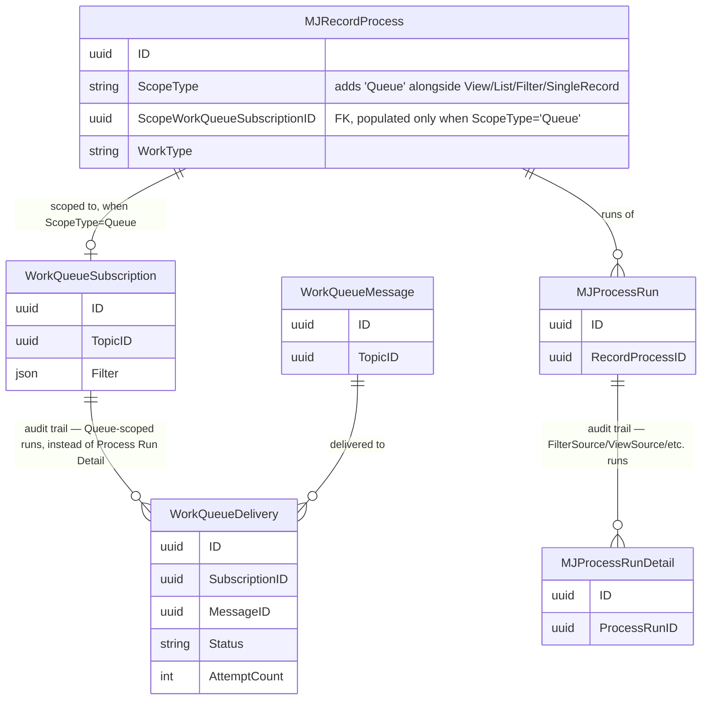
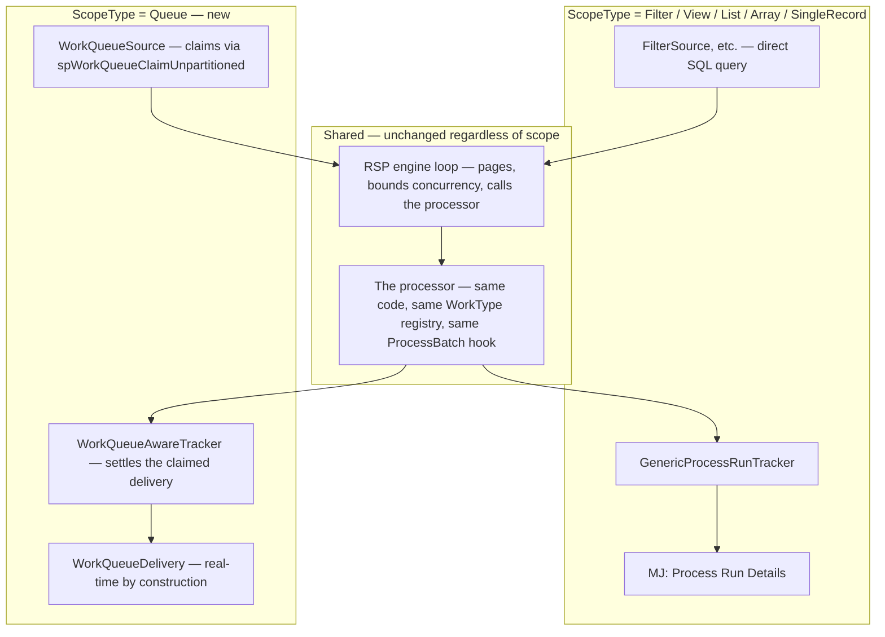

# Content Pipeline Framework — Merged: Record Set Processing + Work Queue

## Status
- **Status**: Draft — competing alternative (option 3 of 3)
- **Created**: 2026-09-28
- **Author**: Dray + Claude
- **Branch**: dray/content-pipeline-framework
- **Depends on**: `feat/work-queue` landing on `next`, **and** a small set of new capabilities in `packages/RecordSetProcessor` (see Architecture). This is the only one of the three plans in this PR that requires changes to both systems rather than depending on one, unmodified.

## Relationship to the other two plans in this PR

This PR now contains three competing architectures for the same five-stage content pipeline:

1. `content-pipeline-framework.md` — built entirely on Record Set Processing (RSP), unmodified.
2. `content-pipeline-framework-workqueue.md` — built entirely on Work Queue, unmodified.
3. **This document** — proposes that RSP and Work Queue aren't actually two competing ways to do the same thing; they're one processing engine (RSP) and one queue substrate (Work Queue) that should compose, not duplicate each other. Concretely: add a Work-Queue-backed `IRecordSetSource` to RSP, so a Record Process's *only* configuration difference between "single-instance, synchronous, entity-filter-driven" and "safely distributed across any number of concurrent, crash-tolerant consumers" is which source it points at — not a different engine, different audit model, or different declarative-work-type registry.

None of the three documents were altered to accommodate this one; they stand as independent options for the reviewing team to weigh.

## Overview

RSP already treats "where do records come from" (`IRecordSetSource`) and "how is progress recorded" (`IProcessRunTracker`) as pluggable seams, independent of "what do we do to each record" (the processor / declarative `WorkType`). Work Queue is not a second processing engine competing with RSP for that same job — it's a queue substrate (atomic claim, lease, sweep, dedup, retry, fan-out) that happens to also run handlers against what it distributes, because nothing else in the platform offered it a processing engine to plug into.

This plan adds exactly that: a `WorkQueueSource` implementing `IRecordSetSource`, backed by Work Queue's already-built, already-tested Database transport claim mechanism, plus a matched `IProcessRunTracker` that settles Work Queue deliveries instead of writing generic detail rows. A Record Process pointed at a Work Queue subscription gets atomic multi-consumer claiming, crash-safe lease recovery, and real-time tracking. A Record Process pointed at a plain entity filter keeps behaving exactly as it does today. Same processor code, same declarative `WorkType` registry, same `ProcessBatch` bulk-efficiency hook, in both cases.

## Goals & Non-Goals

### Goals
- One processing engine, one declarative `WorkType` registry, one bulk-efficiency mechanism (`ProcessBatch`), usable identically whether the working set comes from a live entity filter or a Work Queue subscription.
- Preserve every capability of both systems rather than trading one set for the other: ad hoc/synchronous/UI-driven single-shot operations (RSP's existing strength) and safe atomic multi-consumer claiming with real-time tracking and bounded retry (Work Queue's existing strength).
- Let a Record Process move between "single-tracked" and "distributed across N consumers" by changing its scope configuration, not by rewriting its processor.
- Avoid asking either team to build a redundant version of something the other already has and has already tested.

### Non-Goals
- Not proposing Work Queue's queue mechanics change at all — claim, lease, sweep, dedup, fencing, the topic/subscription model, all remain exactly as built. This proposal only changes where "run a handler against a claimed message" logic lives.
- Not proposing to remove RSP's existing sources (View/List/Filter/Array/SingleRecord/Keyset) — they remain fully available for ad hoc and synchronous use cases that have nothing to do with this pipeline or with concurrent claiming.
- Not attempting to unify `MJ: Process Run Details` and `WorkQueueDelivery` into one schema. They remain two separate tables, selected automatically by which source a Record Process uses — not overlapping responsibilities, just two backing stores for the same audit concept, chosen by mode.
- Not deciding here whether every pipeline stage needs queue mode — that's a per-stage call in the Implementation Plan, though in practice all five likely want it eventually.

## Background & Context

Verified, existing primitives this plan composes rather than reinvents:

- `IRecordSetSource` is already pluggable (`packages/RecordSetProcessor/base/src/interfaces.ts`) — `ViewSource`, `ListSource`, `FilterSource`, `KeysetSource`, `ArraySource` are all independent implementations behind the same contract.
- Work Queue's Database transport claim is already atomic and batched in one round trip for the unpartitioned case — `spWorkQueueClaimUnpartitioned` (`migrations/v6/V202609241637__v6.2.x__Work_Queue_Guarded_Write_Sprocs.sql:311`), a single `TOP (@MaxRows) ... UPDLOCK, READPAST` read feeding one `UPDATE ... OUTPUT`.
- `IRecordProcessor.ProcessBatch?` already exists and the RSP engine already dispatches to it when present (`packages/RecordSetProcessor/base/src/interfaces.ts:93`, `packages/RecordSetProcessor/engine/src/RecordSetProcessor.ts:245-249`) — this already solves the bulk-external-call efficiency problem (Embed's shape) that Work Queue's own `ConsumerRuntime.ProcessBatch` does not (it runs N individual handler calls concurrently, not one bulk call across all N payloads).
- `RecordProcessorRegistry` (`packages/RecordSetProcessor/base/src/registry.ts`) is the existing, precedented pattern for teaching RSP about a new work type from a separate package, without RSP's own base/engine depending on that package — already used by Predictive Studio's `'ML Model'` work type. This plan's `WorkQueueSource`/tracker should live behind the same kind of arm's-length integration, not inside RSP's own packages (see Files to Modify).

This idea came directly out of comparing the other two plans side by side: a Work Queue Subscription and an RSP Record Process differ only in how they select and claim records, not in what happens to a record once it's claimed. Once `ProcessBatch` is accounted for, that similarity becomes exact.

## Architecture / Design

### Data Model Changes



The two audit tables are alternates, not overlapping: a Queue-scoped Record Process's per-record history lives in `WorkQueueDelivery` (already real-time); every other scope type keeps using `Process Run Detail` exactly as today. Nothing about this merges the two tables — it routes to the right one automatically based on `ScopeType`.

### Component / Flow Design



The processor box is identical in both paths — the same `PipelineProcessor` (or a plain `WorkType='Action'`/`'Agent'`/`'FieldRules'` processor) runs whether its records came from a live filter or a claimed queue delivery.

### API Changes

Two small, generic additions to `record-set-processor-base` — neither is Work-Queue-specific, both are useful to any future source/failure model, not just this one:

```typescript
// interfaces.ts — additive, optional, no breaking change
export interface IRecordSetSource {
    NextBatch(cursor, batchSize, contextUser, provider?): Promise<RecordBatch>;
    Describe(): SourceDescriptor;
    /**
     * Optional liveness hook. When present, the engine calls this periodically for any
     * batch this source produced that is still being processed, so a source backed by a
     * leased claim (e.g. Work Queue) can renew it. Sources without a lease concept omit this.
     */
    KeepAlive?(records: RecordRef[]): Promise<void>;
}

// RecordResult — additive field, defaults preserve today's Succeeded/Failed/Skipped behavior
export interface RecordResult {
    Status: 'Succeeded' | 'Failed' | 'Skipped';
    /** Only meaningful to a tracker that can act on it (e.g. WorkQueueAwareTracker deciding
     *  retry-with-backoff vs. immediate dead-letter). Ignored by GenericProcessRunTracker. */
    FailureKind?: 'Fatal' | 'Transient';
    // ...existing fields unchanged
}
```

`WorkQueueSource` and `WorkQueueAwareTracker` themselves are **not** added to `packages/RecordSetProcessor` — they live in a new, separate integration package (working name `@memberjunction/record-set-processor-work-queue`) that depends on both `record-set-processor-base` and Work Queue's client packages. This mirrors exactly how Predictive Studio's `ML Model` work type teaches RSP about itself via `RecordProcessorRegistry` from its own package, rather than RSP depending on Predictive Studio. Neither `RecordSetProcessor` nor `WorkQueue` needs to know the other exists at the package level — they compose only through this third package.

## Implementation Plan

### Phase M0 — `RecordResult.FailureKind` + engine plumbing
Additive field on `RecordResult`. `GenericProcessRunTracker` ignores it (no behavior change for existing scopes). No schema change — it's a field on an in-memory result type a tracker reads, not a persisted column on the generic table.

### Phase M1 — `KeepAlive?` on `IRecordSetSource` + engine support
Add the optional method to the interface. The engine's per-batch execution starts a periodic timer for any source implementing `KeepAlive?`, calling it with the currently in-flight records until they've all settled. Sources without it (every existing one) are entirely unaffected — this is the one genuinely new RSP engine capability neither system has today; nothing about it is Work-Queue-specific.

### Phase M2 — `WorkQueueSource` (new package)
Implements `IRecordSetSource.NextBatch()` by calling Work Queue's atomic unpartitioned claim (`spWorkQueueClaimUnpartitioned` or its client-library equivalent), wrapping each claimed delivery as a `RecordRef` and internally tracking its lease token. Implements `KeepAlive?()` by extending those leases (mirrors what `ConsumerRuntime`'s own auto-heartbeat does today, reused at the protocol level, not the code level, since `WorkQueueSource` isn't running inside `ConsumerRuntime`).

### Phase M3 — `WorkQueueAwareTracker` (same new package)
Implements `IProcessRunTracker`. `RecordResult` settles the matching delivery: `FailureKind: 'Fatal'` or attempts exhausted → dead-letter; anything else → release for retry with backoff; success → complete. Real-time status comes from `WorkQueueDelivery` natively — no open-on-start/update-in-place workaround needed, unlike the RSP-only plan's F2.

### Phase M4 — `ScopeType='Queue'` on `MJ: Record Processes`
New value plus `ScopeWorkQueueSubscriptionID` field. `RecordProcessExecutor.BuildSource` gains a case recognizing it (mirrors its existing View/List/Filter/SingleRecord switch), constructing a `WorkQueueSource` for that subscription. A parallel case in whatever builds the tracker selects `WorkQueueAwareTracker` for the same scope.

### Phase M5 — Prove it end to end
A trivial no-op `WorkType` against a real Work Queue subscription and a real `ScopeType='Queue'` Record Process — same proof pattern the RSP-only plan's F1 uses, now covering the new source/tracker pair before any real stage exists. Includes a multi-instance test: run the same Record Process concurrently from two processes, confirm no double-processing.

### Phase M6 — Apply to the five pipeline stages
Each stage's Record Process (Discover/Extract/Tag/Segment/Embed) uses `ScopeType='Queue'`, pointed at a per-stage subscription (or per-source subscriptions where dedicated resource isolation is wanted — same topology choice as the Work-Queue-only plan, now expressed through `ScopeWorkQueueSubscriptionID` selection rather than a bespoke dispatch layer). Stage domain logic, the working record, drivers — identical to both other plans; only the scope configuration differs from the RSP-only plan's F0–F11.

### Phase M7 — Retire nothing
Plain filter-scoped Record Processes remain fully available platform-wide for ad hoc, synchronous, single-instance use — this phase is explicitly a no-op, called out so it's clear nothing is being deprecated.

## Migration & Data

All additive:
- `ScopeType` gains a `'Queue'` value (metadata, mirrors how `WorkType` gained `'ML Model'` for Predictive Studio).
- `ScopeWorkQueueSubscriptionID` field on `MJ: Record Processes`.
- `RecordResult.FailureKind` — a TypeScript field, not a database column; only `WorkQueueDelivery` (Work Queue's own, already-existing schema) persists anything derived from it.
- No changes to `MJ: Process Runs` / `MJ: Process Run Details` schema, and no changes to any Work Queue table.

## Testing Strategy

- `WorkQueueSource`/`WorkQueueAwareTracker` claim and settle mechanics, tested against a live database — same live-conformance pattern Work Queue's own engine package already uses (`MJ_WORKQUEUE_LIVE_DB=1`).
- `KeepAlive?` timing under a deliberately slow fake processor, confirming a lease survives a longer-than-`LeaseSeconds` operation.
- Same processor code run against both a `FilterSource` and a `WorkQueueSource` in the same test suite, asserting identical output and confirming the audit trail lands in the correct table for each.
- Multi-instance test: N concurrent RSP runs against one `ScopeType='Queue'` Record Process, asserting no record is processed twice — this is the test that would have failed for the RSP-only plan's F12 and passes here by construction.

## Risks & Open Questions

- **`KeepAlive?` has no precedent in either system** — it's the one piece being designed from scratch here, not composed from something already built. Needs real design: timing, what happens if a `KeepAlive?` call itself fails transiently, whether it's engine-driven (a shared timer) or delegated entirely to the source's own implementation.
- **Cross-team dependency.** This is the only one of the three plans needing sign-off and coordinated work from both the RSP codeowners and the Work Queue codeowners, rather than being a single-team ask. Worth surfacing early rather than discovering it mid-implementation.
- **Whether `FailureKind` should ever be inferred automatically** (certain thrown error types mapping to `Transient` by convention, the way `FatalWorkError`/anything-else already works for a plain `WorkHandler`) or should always be set explicitly by the processor. Leaning toward explicit for now, revisit if it proves tedious.
- **This plan makes the `HandleBatch` feedback (queued up for the Work Queue developer under the Work-Queue-only plan) unnecessary if this direction is chosen** — `ProcessBatch` already covers that need once `WorkQueueSource` exists, for free, on both mode. Don't raise that request until this direction is decided one way or the other; asking for it prematurely risks Work Queue building something this plan makes redundant. This is specific to *this* plan being chosen — if the Work-Queue-only plan is chosen instead, that ask still stands on its own merits.
- **The declarative `WorkType` registry (Action/Agent/FieldRules/ML Model) becomes usable against queue-distributed work for free** under this plan — worth a deliberate conversation with whoever owns those work types about whether that's desired as-is, or needs its own guardrails (e.g., should an ad hoc `Action` really be runnable at arbitrary queue-distributed concurrency without additional review).
- **Whether `WorkQueueAwareTracker` should be a genuinely new class or whether `GenericProcessRunTracker` should grow an optional "settle against Work Queue instead" mode** is an implementation detail, not a design question — leaning toward a new class for a cleaner separation, per Files to Modify below.

## Files to Modify

| File / Package | Change |
|---|---|
| `packages/RecordSetProcessor/base/src/interfaces.ts` | Additive: `IRecordSetSource.KeepAlive?`, `RecordResult.FailureKind` |
| `packages/RecordSetProcessor/engine/src/RecordSetProcessor.ts` | Engine calls `source.KeepAlive?()` periodically for any batch still in flight |
| `packages/RecordSetProcessor/engine/src/RecordProcessExecutor.ts` | `BuildSource` gains a `ScopeType='Queue'` case; tracker selection gains the matching case |
| New package `@memberjunction/record-set-processor-work-queue` | `WorkQueueSource`, `WorkQueueAwareTracker` — depends on both `record-set-processor-base` and Work Queue's client packages; neither existing package depends on this one |
| `packages/WorkQueue/*` | **No changes** — this plan uses Work Queue's existing claim/lease/dedup/sweep mechanics entirely as-is |
| `packages/MJCoreEntities` (generated) | `ScopeType` value, `ScopeWorkQueueSubscriptionID` field on `MJ: Record Processes` — via `mj sync push` + CodeGen |
| `metadata/*.json` | Five stages' Record Process rows set to `ScopeType='Queue'`, pointed at their subscriptions |

## References

- The two sibling plans in this PR: `content-pipeline-framework.md`, `content-pipeline-framework-workqueue.md`.
- `packages/RecordSetProcessor/base/src/interfaces.ts`, `registry.ts` — the existing pluggable seams this plan extends.
- `packages/RecordSetProcessor/engine/src/RecordProcessExecutor.ts`, `trackers/GenericProcessRunTracker.ts` — the existing dispatch and tracker this plan mirrors for the new scope.
- `migrations/v6/V202609241637__v6.2.x__Work_Queue_Guarded_Write_Sprocs.sql` — the claim stored procedures `WorkQueueSource` calls.
