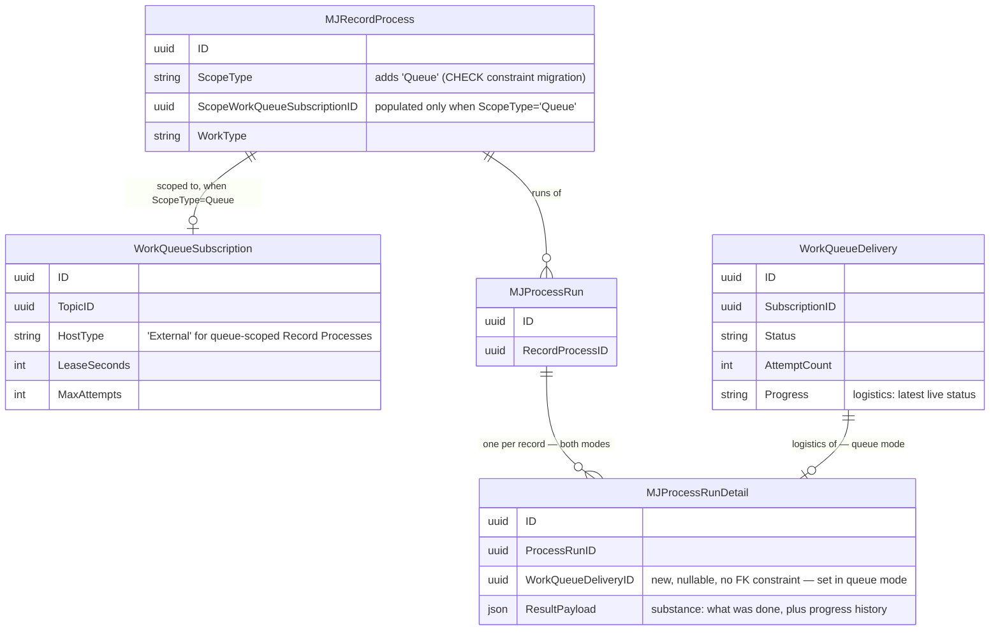
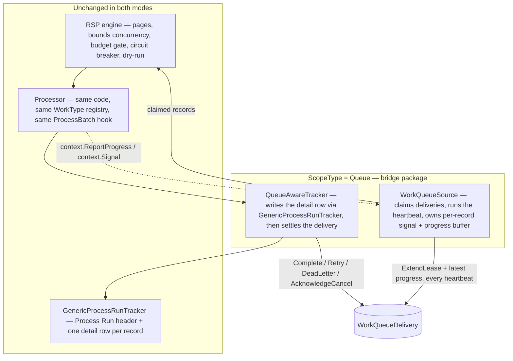

# Content Pipeline Framework — Merged: Record Set Processing + Work Queue

## Status
- **Status**: Draft — competing alternative (option 3 of 3)
- **Created**: 2026-09-28
- **Revised**: 2026-09-28 — per-record detail rows kept in queue mode; heartbeat with buffered progress; cooperative in-flight cancel; record-cap fix; scope-provider registry
- **Revised**: 2026-09-29 — lease semantics and the 30-second heartbeat ceiling; `MaxProcessingSeconds` honored by the source; stall detection; deployment guidance removed
- **Revised**: 2026-09-29 — attempt info for final failures; child results; run-time queue scope; delivery reference without a foreign key
- **Author**: Dray + Claude
- **Branch**: dray/content-pipeline-framework
- **Depends on**: `feat/work-queue` landing on `next`, **and** a small set of generic additions to `packages/RecordSetProcessor` (see API Changes). This is the only one of the three plans in this PR that changes both systems rather than depending on one, unmodified.

## Relationship to the other two plans in this PR

This PR contains three competing architectures for the same five-stage content pipeline:

1. `content-pipeline-framework.md` — built entirely on Record Set Processing (RSP), unmodified.
2. `content-pipeline-framework-workqueue.md` — built entirely on Work Queue, unmodified.
3. **This document** — RSP and Work Queue are not two ways to do the same job. RSP is the processing engine; Work Queue is a queue substrate. They should compose, not duplicate each other.

None of the three documents were altered to accommodate this one.

## Overview

A Record Process is always the unit you configure and run. Its **scope** decides where its records come from:

- **Filter / View / List / SingleRecord** (today): RSP queries the entity directly. Single-tracked; exactly today's behavior.
- **Queue** (new): RSP claims records from a Work Queue subscription. Any number of containers can run the same Record Process concurrently, each claiming its own records atomically, with crash recovery via leases.

Same processor code, same declarative `WorkType` registry, same `ProcessBatch` bulk hook, same run history in both modes. Moving a stage from single-tracked to distributed is a scope change, not a rewrite.

The two systems each keep the job they're best at:

| Concern | Owned by | Recorded in |
|---|---|---|
| **Logistics** — is it running, on which container, since when, how many attempts, live status | Work Queue | `WorkQueueDelivery` |
| **Substance** — what was read, what was found, what failed and why | RSP | `MJ: Process Runs` / `MJ: Process Run Details` |

In queue mode a record gets both: a delivery row that tracks its logistics live, and a detail row that records what it actually did. Neither table is asked to do the other's job.

How records get *into* the queue is outside this framework; Work Queue's existing publish paths cover it.

## Goals & Non-Goals

### Goals
- One processing engine, one `WorkType` registry, one bulk-efficiency mechanism, one run history, whether records come from a filter or a queue.
- Safe concurrent processing across any number of containers, regardless of how long an individual record runs.
- Live status for long-running records, fed by the processor itself and flushed on each lease heartbeat.
- In-system cancellation: remove an item before pickup, and request a cooperative stop for one in flight.
- No capability of either system is lost, and neither team is asked to build something the other already has.

### Non-Goals
- No change to Work Queue's queue mechanics: claim, lease, sweep, dedup, fencing, topic/subscription model are used exactly as built.
- No removal of RSP's existing scopes — they remain the right choice for ad hoc, synchronous, single-instance work.
- No merging of `Process Run Details` and `WorkQueueDelivery` into one table. They record different things (see Overview).
- No decision on how records are published to the queue.
- No guarantee that an in-flight cancel stops work — it's cooperative (see Cancellation).

## Background & Context

Verified against source on the `feat/work-queue` branch:

**RSP**
- `IRecordSetSource` is pluggable (`packages/RecordSetProcessor/base/src/interfaces.ts`); `FilterSource`, `ViewSource`, `ListSource`, `ArraySource`, `KeysetSource` are independent implementations.
- `IRecordProcessor.ProcessBatch?` is dispatched once per page with every eligible record when present (`engine/src/RecordSetProcessor.ts:245`). A thrown batch fails every record in the page.
- The engine processes one page at a time: it claims/fetches the next page only after every record in the current page has settled (`runBatchLoop` → `processBatch` → `runWithConcurrency`).
- The engine trims a page to the run's `maxRecords` cap *after* the source returns it (`RecordSetProcessor.ts:134-144`). Harmless for a query; wrong for a claim (see Phase M0).
- `RecordProcessorContext` is built once per page and shared by every record in it; it carries no cancellation signal or progress channel.
- `RecordProcessExecutor.Run()` never passes a tracker, so every run gets `GenericProcessRunTracker`. Every built-in trigger — the scheduled-job driver, the Run Now remote operation, and on-change (via the `Run Record Process` action) — goes through `RunByID`.
- `ScopeType` and `WorkType` are database CHECK constraints (`CK_RecordProcess_ScopeType`, `CK_RecordProcess_WorkType`). New values need a migration that drops and re-adds the constraint, then CodeGen — the same path `'ML Model'` took.
- `RecordProcessorRegistry` (`base/src/registry.ts`) is the existing pattern for teaching RSP about something new from a separate package: the engine handles built-ins, then consults the registry. Predictive Studio uses it.

**Work Queue**
- `ITransportConsumer` (`packages/WorkQueue/core/src/transport.ts:88`) exposes every primitive this plan needs: `Receive(max)`, `ExtendLease(delivery, seconds, progress)`, `Complete`, `Retry(delaySeconds)`, `DeadLetter`, `Release` (no attempt consumed on the Database transport), `AcknowledgeCancel`, `Close`. `DatabaseTransportConsumer` is exported from `@memberjunction/work-queue-engine`.
- The unpartitioned claim takes up to N deliveries in one call (`spWorkQueueClaimUnpartitioned`, `migrations/v6/V202609241637__v6.2.x__Work_Queue_Guarded_Write_Sprocs.sql:311`).
- Database transport capabilities include `CancelPending`, `CancelInFlight` and `PersistsProgress` (`engine/src/transports/database/databaseCapabilities.ts`).
- `ExtendLease` is fenced on the lease token, `Status='InFlight'` and no cancel request (`spWorkQueueExtendLease`). It returns `'Held' | 'Lost' | 'Cancelled'`.
- A heartbeat carries `WorkProgress { Percent?: 0..100; Message?: ≤500 chars; Checkpoint?: small JSON }` into `WorkQueueDelivery.Progress`. Each heartbeat **replaces** the previous value — it is a latest-status slot, not a log.
- `HeartbeatIntervalSeconds(policy)` = `min(LeaseSeconds / 3, 30)`. The 30-second ceiling is `HEARTBEAT_INTERVAL_MAX_SECONDS`, hard-coded in `@memberjunction/work-queue-core/src/backoff.ts`. `ComputeBackoffSeconds` is exported from the same package.
- `LeaseSeconds` is a subscription column: default 60, minimum 5 (`CK_WorkQueueSubscription_LeaseSeconds`).
- `MaxProcessingSeconds` (nullable subscription column) is not enforced by any database procedure; Work Queue's own consumer runtime applies it. The bridge doesn't use that runtime, so it honors the value itself (see Heartbeat and progress).
- Subscriptions carry `MaxAttempts`, backoff, `LeaseSeconds`, `HeartbeatMode`, `MaxProcessingSeconds`, and `HostType` (`'MJWorker' | 'External'`). An `External` subscription is not consumed by MJ's own Work Queue host, so it won't compete with this plan's consumers.
- Consumer concurrency is host/process configuration, not a subscription column. N containers each running concurrency C process up to N×C records at once. Neither system enforces a global per-source rate limit across processes.

## Architecture / Design

### Data Model Changes



`WorkQueueDeliveryID` on the detail row is the join between "what happened" and "where and how it ran." It is a plain column with no foreign-key constraint. Work Queue's sweeper deletes completed and discarded deliveries once a topic's retention period passes (`spWorkQueuePurgeTerminalDeliveries`); a constraint would make those deletes fail and let RSP data block Work Queue's retention. The detail row is the durable record; the delivery is logistics that may be purged, after which the reference simply no longer resolves.

### Component / Flow Design



A queue-mode run, start to finish:
1. A container runs the Record Process — the same call any run uses. RSP opens a Process Run.
2. The engine asks the source for the next page, never more than the run's remaining cap. The source claims that many deliveries in one call and starts heartbeating all of them immediately, including records still waiting their turn in the page.
3. The processor runs each record, with a per-record context carrying a cancellation signal and a progress reporter.
4. As the processor reports progress, the source buffers it. Every heartbeat flushes the latest status to the delivery.
5. As each record finishes, the tracker writes its detail row — including the accumulated progress history — then settles the delivery.
6. When nothing is left to claim, the tracker closes the Process Run, the source stops its heartbeat timer and closes its consumer, and the run returns.

### Heartbeat and progress

**Lease semantics.** A subscription's `LeaseSeconds` is an inactivity timeout: how long the queue waits without hearing from a claim's holder before returning the record to `Pending`. It does not limit how long a record may run — every heartbeat extends the expiry. The heartbeat interval is `HeartbeatIntervalSeconds(policy)`, which is `LeaseSeconds / 3` but never more than 30 seconds (`HEARTBEAT_INTERVAL_MAX_SECONDS`, hard-coded in Work Queue). Every queue-scoped run therefore heartbeats at least every 30 seconds, whatever the lease length or record duration. Choosing a lease length is a deployment decision: it trades how quickly a crashed holder's records return to the queue against how long a stall — a network blip, a database pause — the claim survives.

**The source owns the heartbeat.**
- One timer per run renews every claimed, unsettled delivery, including records still waiting their turn in the current page.
- Renewal is independent of the processor. Processors contain no heartbeat code.
- When a subscription sets `MaxProcessingSeconds`, the source honors it: once a record exceeds it, the source aborts that record's signal with reason `'MaxProcessingSeconds'`. Work Queue's database procedures don't enforce this value, so the source must.
- Heartbeats run on the Node event loop. A driver doing long synchronous CPU work blocks them and loses its lease; such work must yield or move to a worker thread — the same rule Work Queue documents for its own handlers.

**Progress.**
- A processor calls `context.ReportProgress({ Message, Percent, Checkpoint })` whenever it likes. The source keeps the latest value per record in memory and sends it with the next heartbeat; reports between heartbeats cost nothing.
- `WorkQueueDelivery.Progress` holds only the latest value and is overwritten on each heartbeat, so it reflects current status. The source keeps every report, and the tracker writes that history into the record's detail row when it finishes.
- `Checkpoint` carries small structured values for a UI to render without parsing the message.

**Stall detection.** A timer-based heartbeat can't distinguish a working processor from a hung one, so a hung processor would hold its claim indefinitely.
- The source records the time of the last `ReportProgress` call in each heartbeat's `Checkpoint`, making "alive but not progressing" visible.
- An optional no-progress threshold, set in the Record Process's configuration so Work Queue needs no new column: when exceeded, the source aborts the record's signal with reason `'Stalled'` and stops renewing its lease. Off by default.
- A processor that responds to the signal is settled as a transient failure. One that never returns loses its lease; the sweeper returns the record to `Pending` with the attempt counted. If it later wakes, its settle call is refused because the lease token no longer matches — but entity writes it makes still land, so stage commits must be safe to repeat.

### Cancellation

Two levels, both in-system:
- **Before pickup:** an operator cancels the pending delivery. The claim procedure already skips cancelled deliveries, so no container ever picks it up. Nothing to build.
- **In flight (cooperative):** an operator requests cancel on an in-flight delivery. The next heartbeat's `ExtendLease` returns `'Cancelled'`. The source aborts that record's `context.Signal` with reason `'Cancelled'`. A processor that checks the signal stops at its next safe point and returns. The tracker records the outcome in the detail row and calls `AcknowledgeCancel`, which marks the delivery `Discarded` and frees it.

A processor that doesn't check the signal runs to completion; cancellation can't stop work the code doesn't pause for. That's the same guarantee Work Queue gives its own handlers.

A cancel request can never cause a record to run twice. Verified in the procedures: once a cancel is requested, `spWorkQueueCompleteDelivery` refuses to complete the delivery and `spWorkQueueExtendLease` stops renewing it. If the lease then expires while an unresponsive processor is still running, `spWorkQueueExpireLeases` marks it `Discarded` rather than returning it to `Pending`. So the tracker always ends a cancel-requested delivery with `AcknowledgeCancel`, even when the processor finished the work anyway. The detail row records what really happened; the queue records that it was cancelled.

Run-level pause/cancel (the Process Run's `CancellationRequested`, checked between pages) is unchanged and still works in queue mode.

If a heartbeat returns `'Lost'` — the lease expired and another container may now own the record — the source aborts the signal with reason `'LeaseLost'` and the tracker does **not** settle the delivery. The detail row still records what this container did.

### Settling a delivery

After writing the detail row, the tracker decides what the queue should do, checking in this order:

| Outcome | Settle call |
|---|---|
| Lease lost | none — another holder owns it |
| Cancel was requested during processing — whatever the processor's outcome | `AcknowledgeCancel` |
| `Succeeded` or `Skipped` | `Complete` |
| `Failed` with `FailureKind: 'Fatal'`, or attempts reached `MaxAttempts` | `DeadLetter` |
| Any other `Failed` | `Retry(ComputeBackoffSeconds(...))` |

That's the entire retry policy on this side. The backoff math is Work Queue's own exported function, not a re-implementation.

**Knowing a failure is final.** A processor often records the outcome on the entity itself, for example a status field that decides whether the record is queued again. It must write a terminal failure only when the queue won't retry. So each record's binding carries its attempt: the delivery's attempt number and the subscription's `MaxAttempts`. A processor that fails fatally, or fails on its final attempt, records a terminal failure; one that fails transiently before its final attempt leaves the entity alone and lets the retry happen. Without this, a dead-lettered record's entity would still look ready, and whatever publishes ready records would queue it again indefinitely.

### API Changes

All additive and generic. None of them mention Work Queue.

```typescript
// record-set-processor-base — types.ts
export interface RecordResult {
    // ...existing fields unchanged
    /** Lets a tracker that supports retries distinguish "never retry" from "try again". Ignored by GenericProcessRunTracker. */
    FailureKind?: 'Fatal' | 'Transient';
    /** Records the processor produced inside this call (items a crawl found, parts a document split into). The tracker writes one detail row per child. */
    Children?: { Record: RecordRef; Result: RecordResult }[];
}

export interface RecordProgress {
    Message?: string;   // a sink may truncate (Work Queue keeps 500 chars)
    Percent?: number;   // 0..100
    Checkpoint?: Record<string, unknown>;
}

// record-set-processor-base — interfaces.ts
export interface RecordProcessorContext {
    // ...existing fields unchanged
    /** From the source's binding; absent for sources that don't retry. */
    Attempt?: { Number: number; Max: number };
    /** Aborted when this record should stop: 'Cancelled', 'LeaseLost', 'MaxProcessingSeconds', 'Stalled', or run shutdown. Absent for sources with no such concept. */
    Signal?: AbortSignal;
    /** Report status as often as convenient; the source decides how and when it's persisted. No-op when absent. */
    ReportProgress?: (progress: RecordProgress) => void;
}

export interface RecordBinding {
    Signal?: AbortSignal;
    ReportProgress?: (progress: RecordProgress) => void;
    /** Present when the source retries records: this attempt's number and the maximum. */
    Attempt?: { Number: number; Max: number };
}

export interface IRecordSetSource {
    // ...existing NextBatch / Describe unchanged
    /** Optional. Supplies per-record controls; the engine merges them into that record's context. */
    BindRecord?(record: RecordRef): RecordBinding | undefined;
}

// core-entities — RecordProcess.RunNow remote operation input (generated from its metadata)
export type RecordProcessScopeOverride =
    | { Kind: 'records'; RecordIDs: string[] }
    | { Kind: 'view'; ViewID: string }
    | { Kind: 'list'; ListID: string }
    | { Kind: 'filter'; Filter?: string }
    | { Kind: 'queue'; SubscriptionID: string };   // new

// record-set-processor-base — registry.ts (alongside RecordProcessorRegistry)
/** Builds the source and its paired tracker for a ScopeType the executor doesn't handle natively. */
export type RecordScopeProviderFactory = (context: RecordScopeBuildContext) => { Source: IRecordSetSource; Tracker: IProcessRunTracker };
export class RecordScopeProviderRegistry { Register(scopeType: string, factory: RecordScopeProviderFactory): void; /* ... */ }
```

Engine and executor changes:
- **Record cap:** ask the source for `min(batchSize, maxRecords - processed)`, not `batchSize`, so nothing is claimed that won't be processed.
- **Per-record context:** build each record's context from the page context plus `source.BindRecord?.(record)`. For the `ProcessBatch` path there is one call per page, so it receives a page-level signal (aborted on run shutdown) and a page-level progress reporter. Per-record cancels are honored when results are settled.
- **Scope provider:** `RecordProcessExecutor` handles the built-in scopes as today, then consults `RecordScopeProviderRegistry`, then fails — the same fall-through `BuildProcessor` already uses for work types. When a provider supplies a tracker, `Run()` passes it into `Process()`.
- **Run-time queue scope:** a run can override a queue-scoped Record Process's subscription with `{ Kind: 'queue', SubscriptionID }`, the same way it can already override a filter or view. One Record Process can then drain many subscriptions, for example one per source, without a Record Process row per subscription.
- **Child results:** `GenericProcessRunTracker` writes one detail row per entry in `RecordResult.Children`, in both scopes. A child's `RecordID` is its real key once committed, or its ephemeral identity when nothing was committed, as in a dry run.

The source and its tracker come from one factory because they share state: which deliveries are claimed, their lease tokens, their signals and progress buffers.

`WorkQueueSource` and `QueueAwareTracker` live in a new package, `@memberjunction/record-set-processor-work-queue`, which depends on `record-set-processor-base` and Work Queue's packages and registers the `'Queue'` scope provider at startup. Neither `RecordSetProcessor` nor `WorkQueue` depends on it — the same arm's-length pattern Predictive Studio uses for its work type.

## Implementation Plan

### Phase M0 — Record-cap fix
The engine requests no more than the remaining cap from the source. Fixes a latent issue for any claiming source, and saves a wasted read for query sources. Unit test: a run capped at 30 with a page size of 100 requests 30.

### Phase M1 — Contract additions
`RecordResult.FailureKind` and `Children`; `RecordProcessorContext.Signal` / `ReportProgress` / `Attempt`; `RecordProgress`; `IRecordSetSource.BindRecord?`. The engine builds a per-record context. `GenericProcessRunTracker` writes child detail rows. Existing sources, processors and trackers are unaffected — every new member is optional and absent today.

### Phase M2 — Scope-provider registry
`RecordScopeProviderRegistry` in base; `RecordProcessExecutor.BuildSource` and `Run()` consult it and pass the provider's tracker into `Process()`. Built-in scopes behave exactly as today. The `RecordProcess.RunNow` remote operation's input gains the `queue` override kind (metadata, then CodeGen).

### Phase M3 — `ScopeType = 'Queue'`
Migration dropping and re-adding `CK_RecordProcess_ScopeType` with `'Queue'`; new nullable `ScopeWorkQueueSubscriptionID` (FK to `WorkQueueSubscription`); new nullable `WorkQueueDeliveryID` on `ProcessRunDetail`, deliberately without a foreign-key constraint (see Data Model Changes); CodeGen. Record Process UI surfaces that switch on `ScopeType` need the new value handled.

### Phase M4 — `WorkQueueSource` (bridge package)
- `NextBatch` calls `DatabaseTransportConsumer.Receive(n)` and returns claimed deliveries as `RecordRef`s; `Exhausted` when fewer than requested come back. The cursor is unused and resume is disabled.
- Starts the heartbeat timer on first claim: renews every unsettled delivery with the latest buffered progress; maps `'Cancelled'` and `'Lost'` to that record's abort signal; retries a thrown `ExtendLease` on the next tick.
- `BindRecord` returns the record's signal, a `ReportProgress` that updates its buffer and appends to its history, and its attempt (the delivery's attempt count and the subscription's `MaxAttempts`).

### Phase M5 — `QueueAwareTracker` (bridge package)
- Delegates the Process Run header, checkpoints, pause/cancel handshake and completion to a wrapped `GenericProcessRunTracker`.
- For each record: writes the detail row through the wrapped tracker, adding `WorkQueueDeliveryID` and the progress history, then settles the delivery per the table above.
- On `CompleteRun`: stops the heartbeat, `Release`s any delivery still claimed but never processed (e.g. after an unexpected exception — costs no attempt), closes the consumer.

### Phase M6 — Prove it end to end
No-op processor against a real `ScopeType='Queue'` Record Process, then:
- a slow processor outliving several lease periods, confirming heartbeats keep it and progress appears on the delivery;
- a record exceeding `MaxProcessingSeconds` and one exceeding the no-progress threshold, confirming each aborts with the right reason;
- an in-flight cancel honored via the signal, ending `Discarded` with a detail row;
- a lease deliberately lost, confirming no settle and no double completion;
- two concurrent runs of the same Record Process, confirming no record is processed twice;
- a capped run, confirming nothing is claimed beyond the cap;
- a processor failing on its final attempt, confirming it sees the final attempt and the delivery is dead-lettered;
- a processor returning child results, confirming one detail row per child in both scopes.

### Phase M7 — Apply to the pipeline stages
Each stage's Record Process uses `ScopeType='Queue'`, pointed at a subscription. How subscriptions are laid out — one per stage, or per source for resource isolation — is a deployment choice; the framework supports either. Stage logic, working record and drivers are the same as in the other two plans. Drivers that run long check `context.Signal` at safe points and report status through `context.ReportProgress`.

### Nothing retired
Filter, View, List and SingleRecord scopes stay available platform-wide for ad hoc and synchronous work.

## Migration & Data

- `CK_RecordProcess_ScopeType` re-created with `'Queue'`.
- `RecordProcess.ScopeWorkQueueSubscriptionID` — nullable FK.
- `ProcessRunDetail.WorkQueueDeliveryID` — nullable, no foreign-key constraint.
- `RecordProcess.RunNow` remote operation input: new `queue` scope-override kind.
- `RecordResult.FailureKind` and `Children`, `RecordProgress`, the context members and `BindRecord` are TypeScript only.
- No changes to any Work Queue table or procedure.

## Testing Strategy

- **Unit (RSP):** record-cap request size; per-record context merges `BindRecord`; scope-provider fall-through and tracker pass-through; built-in scopes unchanged.
- **Unit (bridge):** heartbeat cadence from `LeaseSeconds`; progress buffered and flushed only on heartbeat; history written to the detail row; `'Cancelled'` and `'Lost'` map to the right signal reasons; settle table, including backoff from `ComputeBackoffSeconds`.
- **Live database** (the pattern Work Queue's engine tests already use, `MJ_WORKQUEUE_LIVE_DB=1`): the Phase M6 scenarios.
- **Integration tier:** one bundle running the same processor through a `FilterSource` and a `WorkQueueSource`, asserting identical detail rows apart from `WorkQueueDeliveryID`.

## Risks & Open Questions

- **Cooperative cancel only.** A processor that never checks `context.Signal` runs to completion. Drivers need to be written with checkpoints where stopping is safe.
- **Head-of-line blocking within a page.** The engine fetches the next page only after the current page fully settles, so a page moves at the speed of its slowest record. Stages whose records vary widely in duration need a small page size until the engine supports replacing records as they finish, rather than a page at a time.
- **Event-loop blocking** stops heartbeats (see Heartbeat and progress). Needs to be in driver-author guidance.
- **Hung processors keep their claims.** A timer-based heartbeat can't tell a working processor from a hung one. The last-progress timestamp makes a stall visible; the optional no-progress threshold makes it recoverable. Whether the threshold should have a platform default is open.
- **Progress is latest-value.** The delivery holds one status up to 500 characters plus percent and a small checkpoint; history lives in the detail row, written at the end. If history must be visible *while* a record runs, the tracker would also update the detail row in place — deferred until needed.
- **No cross-process concurrency or rate ceiling.** Consumer concurrency is per process, and neither system enforces a limit across processes. A strict ceiling today requires a single consumer process.
- **Cross-team dependency.** Needs RSP and Work Queue codeowners' sign-off, though Work Queue itself needs no changes.
- **`FailureKind` inference.** Explicit per processor for now; revisit if a thrown-error convention (like Work Queue's `FatalWorkError`) proves simpler.
- **Declarative work types at queue scale.** `Action`/`Agent`/`FieldRules`/`ML Model` Record Processes become runnable against queue scope for free; worth confirming with their owners that no extra guardrails are wanted.
- **No batch-handler addition to Work Queue.** `ProcessBatch` already covers bulk work for queue-scoped records, so the batch-handler addition proposed in the Work-Queue-only plan isn't needed here.

## Files to Modify

| File / Package | Change |
|---|---|
| `packages/RecordSetProcessor/base/src/types.ts` | `RecordResult.FailureKind` and `Children`, `RecordProgress` |
| `packages/RecordSetProcessor/base/src/interfaces.ts` | `RecordProcessorContext.Signal` / `ReportProgress` / `Attempt`, `RecordBinding`, `IRecordSetSource.BindRecord?` |
| `packages/RecordSetProcessor/engine/src/trackers/GenericProcessRunTracker.ts` | One detail row per child result |
| `RecordProcess.RunNow` remote operation metadata | `queue` scope-override kind; regenerates `RecordProcessScopeOverride` in `packages/MJCoreEntities/src/generated/remote_operations.ts` |
| `packages/RecordSetProcessor/base/src/registry.ts` | `RecordScopeProviderRegistry` |
| `packages/RecordSetProcessor/engine/src/RecordSetProcessor.ts` | Cap-aware page request; per-record context |
| `packages/RecordSetProcessor/engine/src/RecordProcessExecutor.ts` | Scope-provider fall-through; pass provider tracker into `Process()` |
| New `@memberjunction/record-set-processor-work-queue` | `WorkQueueSource`, `QueueAwareTracker`, `'Queue'` provider registration |
| `packages/WorkQueue/*` | None |
| `migrations/v6/` | `ScopeType` CHECK, two nullable FK columns |
| `packages/MJCoreEntities` (generated) | Via CodeGen |
| Record Process Explorer UI | Handle `ScopeType='Queue'`; link detail rows to deliveries |

## References

- Sibling plans: `content-pipeline-framework.md`, `content-pipeline-framework-workqueue.md`.
- `packages/RecordSetProcessor/base/src/interfaces.ts`, `types.ts`, `registry.ts`.
- `packages/RecordSetProcessor/engine/src/RecordSetProcessor.ts`, `RecordProcessExecutor.ts`, `trackers/GenericProcessRunTracker.ts`.
- `packages/WorkQueue/core/src/transport.ts`, `handler.ts`, `backoff.ts`.
- `packages/WorkQueue/engine/src/transports/database/` — `DatabaseTransportConsumer`, `databaseCapabilities.ts`.
- `migrations/v6/V202609241637__v6.2.x__Work_Queue_Guarded_Write_Sprocs.sql` — claim, extend-lease and settle procedures.
