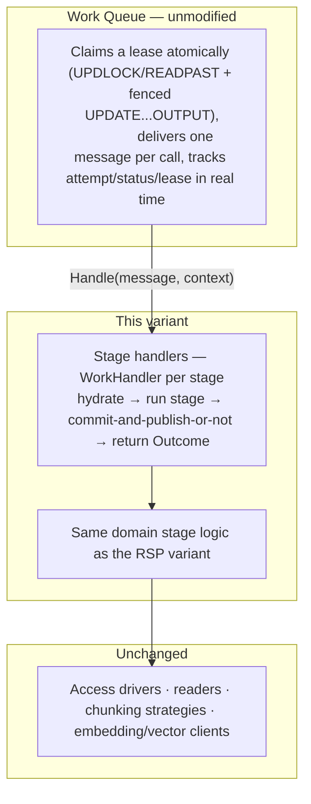

# Content Pipeline Framework — Work Queue variant

## Status
- **Status**: Draft — competing alternative
- **Created**: 2026-09-28
- **Author**: Dray + Claude
- **Branch**: dray/content-pipeline-framework
- **Depends on**: `feat/work-queue` (not yet merged to `next`)

## Relationship to `plans/content-pipeline-framework.md`

This is a second, competing architecture for the same content pipeline — Discover, Extract, Tag, Segment, Embed — built on the `feat/work-queue` branch's Work Queue subsystem instead of Record Set Processing (RSP). It is not a revision of the RSP-based plan and does not replace it; the two are meant to be read side by side so the trade-offs are visible in one sitting, and the team can pick a direction with both fully specified rather than deciding on a sketch. `plans/content-pipeline-framework.md` is unmodified.

Section numbers below match the RSP-based plan's original design (§04–§12) where a section carries over unchanged; new material gets its own heading. The working record's three-part structure, the driver layer (Access drivers, readers, chunking strategies, embedding/vector-store clients), and every stage's actual domain logic are identical in both variants — nothing below touches them except to note where the *wrapping* around them changes. This plan is contingent on `feat/work-queue` landing on `next`; it is not actionable before that.

## What stays exactly the same

- **04 The working record** — identity (ephemeral URL until committed, then the real key), well-known fields with per-field confidence + `SetBy`, the extension space, the completion signal. None of this has anything to do with distribution or tracking; it's the payload shape a stage reads and writes, independent of what delivers it.
- **07 Access** — `OpenSession(contentSource, role)` only, registered driver per source type, role resolution via `ContentSourceParam`/`ContentSourceTypeParam`. One change in scope, not mechanism: the promise-cache (keyed by source+role) lived on the RSP processor instance, "built once per run, one source." Here it lives on the consumer/handler instance, built once per container's lifetime — which may span multiple sources if a container's subscription isn't source-scoped (see Topology, below). Same cache, same eviction-on-failure and evict-and-retry rules; it just may hold more than one or two entries at a time.
- **08 The five built-in stages** — Discover, Extract, Tag, Segment, Embed keep their exact domain logic: the file-type/content-type resolution cascade, the reader-priority cascade, multi-modal handling, the chunking-strategy cascade, Embed's bulk-generate-then-bulk-upsert shape. What changes is only how a stage is invoked and how its readiness is signaled — covered below.
- **09 Reprocessing and reset** — the flat reset (every downstream status field set to `Pending` in one operation) is unchanged, and it composes automatically with the new triggering mechanism: since reset still goes through the standard `Save()` path, it fires the same publish-on-transition hook as any other commit (see Triggering, below) — no special-casing needed.
- **The drivers** — Access drivers, `IContentReader`, `IContentDiscoverer`, `IChunkingStrategy`, embedding/vector-store clients. Untouched in both variants; neither ever depends on how work reached the stage above it.

## 05′ The stage contract → `WorkHandler`

A stage becomes a `WorkHandler<WorkingRecordRef>` (`@memberjunction/work-queue-core`):

```typescript
interface WorkingRecordRef {
    EntityID: string;
    RecordID: string; // the real PK, or the ephemeral URL identity pre-commit
}

class ExtractHandler implements WorkHandler<WorkingRecordRef> {
    async Handle(message: WorkMessage<WorkingRecordRef>, context: WorkContext): Promise<Outcome> {
        const record = await hydrate(message.Payload, context); // same WorkingRecordHydrator as the RSP variant
        const updated = await runExtractStage(record, context); // same domain logic, unchanged
        if (updated has a fatal, unrecoverable problem) throw new FatalWorkError('...');
        await commitAndPublishDownstream(updated, context); // see below
        return Outcome.Complete();
    }
}
```

Same design properties the original contract required still hold: cold-start-safe (a handler always hydrates fresh from `message.Payload`'s reference — never trusts embedded field values, since a message can sit in the queue for a while before being picked up and the record could theoretically be touched in between), declared reads/writes (advisory, same as before), test/live visibility via `context` (see Test mode, below).

**Why the message payload carries a reference, not the full record**: `WorkMessage.Payload` is arbitrary JSON, so it *could* carry the record's full field set instead of just an identity. Deliberately not doing that: it would violate "hydrate and commit are the only two places a database is touched" by baking a third, implicit read path (trusting message data) into the design, it risks staleness (a message published when a record became ready could be consumed much later), and it bloats message size for a field like `Text`. A message payload is exactly what an RSP `RecordRef` already is — this is a direct, low-risk substitution, not a new concept.

## 06′ Running a stage on Work Queue

Three layers, same shape as the RSP variant's three layers, different middle:



- **Concurrency/claiming is not a design problem here — it's a solved property of the substrate.** The RSP variant's entire §06.6 (three candidate claiming mechanisms, none chosen, deferred to F12) collapses to nothing. Work Queue's Database transport claim is atomic (`UPDLOCK, READPAST` plus a fenced `UPDATE ... OUTPUT`, with a unique-constraint backstop for partitioned/exclusive keys), tested against a 26-case conformance suite, and explicitly documented as safe for any number of concurrent consumer instances. A deployment can run 1 or 50 Extract containers against the same backlog with no additional design work.
- **Failure is now two-tiered, and more precise than the RSP variant's single `Failed`.** A handler throws `FatalWorkError` for "this will never succeed" (bad content, a permanent 404, a validation failure) — dead-lettered immediately, no retry. Anything else is treated as transient and retried with backoff up to `SubscriptionPolicy.MaxAttempts` (default 5), *then* dead-lettered. This directly answers the original "database was unreachable" scenario better than the RSP variant did: that case no longer needs special-casing as "leave the record silently `Pending` forever" — it's just a transient failure, gets a bounded number of retries with backoff, and surfaces as a dead-lettered, human-visible failure if the outage outlasts the retry budget, instead of an indefinitely-recurring silent retry.
- **The entity's own status field is a coarser signal than before, on purpose.** It flips to `Failed` only when the *delivery* reaches a terminal dead-lettered state (fatal, or retries exhausted) — not on every transient retry attempt. While a delivery is being retried, the entity's status field stays `Pending` (it genuinely is still in progress), and the live detail — attempt count, last error, lease state — lives on the `WorkQueueDelivery` row instead. This preserves the original design's split ("the status field is the gate, the detail is the why") with the detail side now real-time instead of write-once.
- **Batch efficiency (Embed) is a real, honest gap here — not a free win.** RSP's `ProcessBatch`/finalize hook is a first-class contract: the engine holds per-record results as provisional and calls one bulk method per page. Work Queue's `ConsumerRuntime.ProcessBatch` (`packages/WorkQueue/core/src/runtime/ConsumerRuntime.ts:93`) is a *different* thing — it's a batch **runner** for Lambda-style invocation (take N already-received deliveries, run each through the handler individually, concurrently, grouped into partition "lanes"), not a batch **handler** that receives all N payloads in one call. There is no built-in "accumulate up to a page size, make one bulk call, settle N deliveries with N individual outcomes" primitive. Getting Embed's bulk-embed-and-bulk-upsert efficiency here means building a custom accumulation wrapper: receive deliveries without immediately settling them, heartbeat their leases to keep them checked out while waiting to fill a batch (or hit a time budget), then run one bulk call and settle all of them at once. This is genuinely comparable in effort to what F1/F8 needed to build for RSP (a conditional `ProcessBatch` assignment on the processor) — Work Queue doesn't make it free, it just doesn't hand it to us either. Worth being explicit about this rather than assuming Work Queue is a strict upgrade on every axis.

## Triggering — readiness, without RSP's filter-and-page loop

This is the piece with no RSP equivalent to fall back on, since Work Queue is push-based (something must publish) rather than pull-based (RSP's engine runs the filter itself).

- **Primary path — publish on commit.** Every status-field transition to `Pending` already goes through `BaseEntity.Save()` (commit is the only place a working record touches storage, exactly as before). An Entity Action (or a hook in the entity-specific committer) publishes one Work Queue message whenever a save transitions a status field to `Pending`, using a metadata mapping of status-field → topic (e.g. `ExtractionStatus` → `pipeline.extract`). Running inside the same save gives atomicity for free: the message exists if and only if the status write committed — no window where one happens without the other, which is a correctness property that's genuinely hard to get any other way (a separate "commit, then publish" step always has a crash-in-between risk).
- **Backstop — reconciliation sweep.** Whatever currently polls to decide "does this source have enough backlog to spin up a container" (the deployment's own scheduling, out of scope for the framework itself, same as before) additionally re-sweeps for `Pending` records with no message currently in flight, and publishes for them. The dedup ledger (keyed on a deduplication key, reserve/confirm semantics) means this can run as often as convenient without risking a duplicate publish for something already queued. This catches anything the fast path missed — a crash between commit and publish, a bulk backfill that set many rows `Pending` at once through a path that didn't fire the hook, etc.
- **`TrainingJob` simplifies to container lifecycle only.** It no longer needs to know or care which records are ready — that's now Work Queue's job entirely. A `TrainingJob` row becomes purely "a container claimed to run the Extract consumer," with `ProcessRunID` replaced by whatever Work Queue subscription/consumer identity is relevant for observability. This is a real simplification of the deployment layer, though it's out of scope for the framework-facing plan itself.

## Audit trail — replaced, not rebuilt

The RSP variant's §10 (a custom tracker working around `IProcessRunTracker`'s lack of a per-record start hook, sharing a reference with the processor, opening a detail row eagerly and updating it in place) has no equivalent need here. `WorkQueueMessage` and `WorkQueueDelivery` rows are already real-time by construction — status, attempt count, and lease state are live for the duration of processing, not written once at the end. Nothing custom needs to be built for this.

Records the platform never handed to a "run" directly — Discover's fan-out, a splitting reader's children — also stop needing the bolted-on child-row mechanism (§10.3's `RecordChildOutcome`). Each one is simply its own published message once Discover or Extract runs the standard publish-on-commit path for it, and gets its own first-class `WorkQueueDelivery` row the moment something consumes it — no synthetic child-row concept required.

## Test and dry-run mode — a real answer, not a reinvention

A `WorkHandler` is just an object with `Handle(message, context)`; the queue only decides how a message *gets to* it in production. Two workable options, not mutually exclusive:

1. **Direct invocation.** A test harness builds a `WorkingRecordRef` (or, pre-commit, the ephemeral URL identity) in memory, calls `Handle()` for each stage in the test's configured list directly, and feeds one stage's output into the next call — the same in-memory chaining the RSP variant's §11.1 already does. Nothing is published, nothing is committed.
2. **`InMemoryTransport`.** Work Queue's core package already ships an in-memory transport with "Database-transport semantics" (`@memberjunction/work-queue-core`), built for their own conformance testing. Running a test through the real publish → consume → handle path, backed by this transport instead of the real Database transport, exercises the actual subscription/filter/handler-resolution logic too, not just the handler bodies.

Either way resolves the fan-out concern from the audit-trail section for test mode specifically: Discover's test-mode output either publishes to the in-memory topic (consumed synchronously within the same test) or is handed directly to Extract's handler — per-item visibility, nothing durable, nothing really queued.

Persistence and publishing become the same joint run-level policy: a live run's handler commits *and* publishes to trigger the next stage on success; a test run's handler does neither, using in-memory chaining instead.

## 12′ Extending the pipeline

Adding a stage: write a handler implementing `WorkHandler`, register it, declare a status field on the entity it runs over, add a topic + subscription (+ a status-field → topic mapping entry for the publish-on-commit hook), give the subscription's consumer a schedule/scaling policy. Same "an addition, not an edit to neighbors" property as the RSP variant — a new stage's status field is what the stage before it now sets to `Pending` on commit, same as before.

## Topology — per-source isolation is a choice, not a trade-off

RSP's model is inherently per-source-scoped: a Record Process run is started with a filter narrowing to one source, so a container is always dedicated to one source by construction. That isolation is a deliberate business requirement, not just an artifact of RSP's design — dedicating resources to a source (customer) both guarantees it a share of capacity and prevents one large or noisy source from starving everyone else's processing. Work Queue doesn't override this; it gives you the choice per source rather than forcing one shape everywhere:

- **Dedicated pool** (matches RSP's isolation exactly): a subscription on `pipeline.extract` filtered on `Attributes.ContentSourceID = X`, consumed only by that source's own container pool. Same guarantee RSP gives today.
- **Shared pool**: an unfiltered subscription on the same topic, consumed by a pool sized against aggregate backlog across every source using it.
- **Mixed**, in the same topology at once: dedicated subscriptions for large or premium sources, one shared catch-all subscription for the long tail of smaller ones. This is metadata configuration (which subscriptions exist, which sources' messages route to which), not a code fork — a source's isolation level can change without touching any handler.

This is strictly more flexible than RSP's topology, not a replacement for what RSP already gives you: RSP can only do per-source; Work Queue can do per-source, pooled, or both at once, decided per source.

### Batching and per-source concurrency, verified against the actual claim stored procedures

Claiming genuinely batches in one database round trip for the common case. `spWorkQueueClaimUnpartitioned` (`migrations/v6/V202609241637__v6.2.x__Work_Queue_Guarded_Write_Sprocs.sql:311`) claims up to `@MaxRows` leases in a single atomic `TOP (@MaxRows) ... UPDLOCK, READPAST` read feeding one `UPDATE ... OUTPUT` — fifty leases, one call, not fifty pokes. The consumer runtime then fires each claimed delivery's handler concurrently, bounded by that subscription's `SubscriptionPolicy.Concurrency`.

Because each source already gets its own subscription under the topology above, **per-source parallelism falls out for free**: a fast, permissive source's subscription sets a high `Concurrency`; a source that needs to crawl slowly to avoid getting blocked sets `Concurrency: 1`. No batch-handoff mechanism is needed to get "sometimes fire fifty in parallel, sometimes go one at a time, and it varies by source" — it's a direct consequence of per-source subscriptions plus a per-subscription setting that already exists.

One caveat found while verifying this: the single-round-trip batching above is specific to **unpartitioned** claims. A subscription using `Exclusive`/`Ordered` partitioning (reached for only when two messages sharing a key must never process concurrently — not something a plain per-record Extract stage needs, since each message already represents a distinct record) claims one delivery per call (`spWorkQueueClaimPartitionCandidate`) even though candidate *selection* is a single batched query. Extract's plain per-record case has no reason to use partitioning, so it stays on the fast unpartitioned path — worth knowing this exists, not a concern for the stages as designed.

### The remaining gap: one handler call across many distinct records

The above explains claiming fifty deliveries in one round trip and running fifty individual handler calls concurrently — it does not give a way to hand all fifty payloads to *one* handler call for a single bulk external operation (Embed's one-model-call-for-fifty-texts case). That gap still stands as described earlier; nothing about per-source subscriptions or unpartitioned batching resolves it, since it's about the shape of the handler invocation, not the claim.

### Feedback worth raising with the Work Queue developer

- **The concrete ask**: an optional `HandleBatch(messages, context): Promise<Outcome[]>` on `WorkHandler`, used instead of `Handle()` when present — the runtime accumulates claimed deliveries up to a batch size or a linger/time budget, heartbeats their leases while waiting to fill the batch, then calls `HandleBatch` once and settles each delivery from the returned array. `IRecordProcessor.ProcessBatch?` in `packages/RecordSetProcessor/base/src/interfaces.ts` is prior art already shipped in this codebase for the same problem (optional method, array or keyed-map result, positionally aligned when an array) — worth pointing to as a reference shape rather than designing from scratch. This would also let a handler decide fan-out shape dynamically per call (`Promise.all` vs. sequential, or backing off after a 429) rather than being fixed to one static `Concurrency` number per subscription.
- **A smaller, secondary note**: `spWorkQueueClaimPartitionCandidate` claims one delivery per call even though candidate selection is already batched. Worth asking whether it could accept a list of candidate IDs and claim as many as still validate in one round trip, falling back to per-row handling only where a candidate lost the race. Lower priority — only matters once something actually needs `Exclusive`/`Ordered` partitioning at volume.

## Assumptions and open items in this variant

- The Fatal/Transient error split and `MaxAttempts` default (5) need to be reviewed against each stage's actual failure modes — some failures we'd currently call "fatal" (unrecoverable content) vs "transient" (a rate limit, a timeout) need to be enumerated per stage, not assumed.
- The batch/finalize gap for Embed (above) needs a concrete design before this variant can claim parity with the RSP variant on that stage specifically.
- Whether a status-field → topic mapping lives in `metadata/*.json` (parallel to how the RSP variant's Record Process rows are metadata-driven) or in code needs a decision; metadata-driven is the more consistent choice given the rest of this design.
- ~~Not yet checked: whether Work Queue's Subscription filter model can cleanly express "route to a dedicated pool for source X, otherwise the shared pool"~~ — resolved: this needs two subscriptions on the same topic with non-overlapping filters (a source-scoped one plus an unfiltered catch-all), confirmed workable in the Topology section above. Not a priority-rule primitive, but sufficient.
