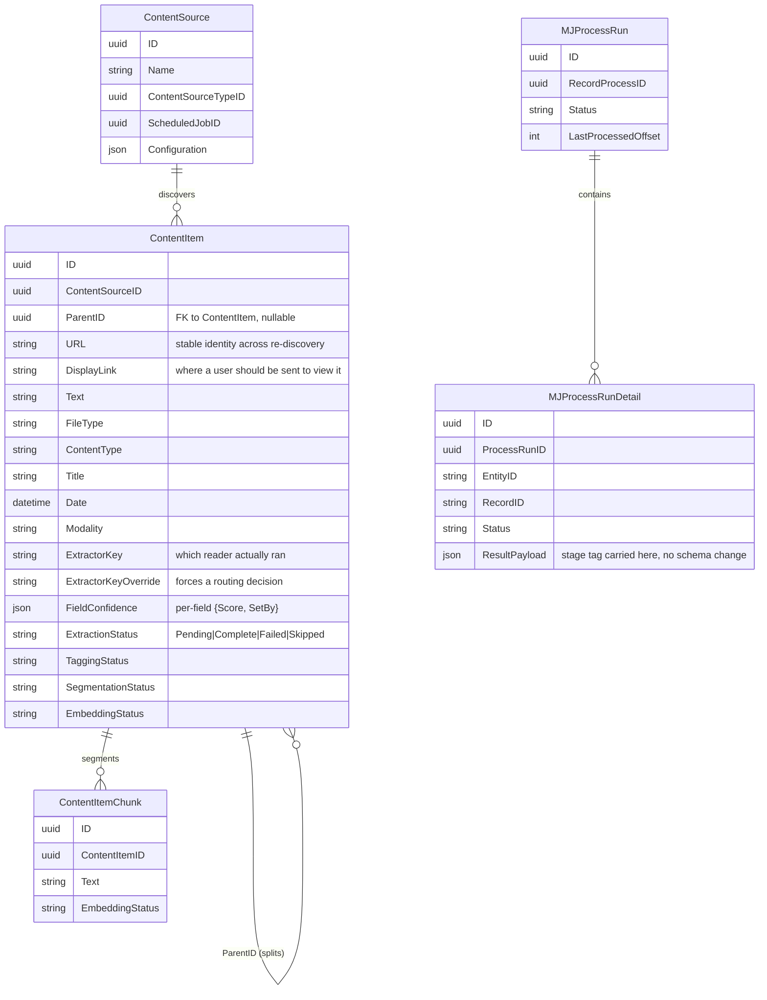
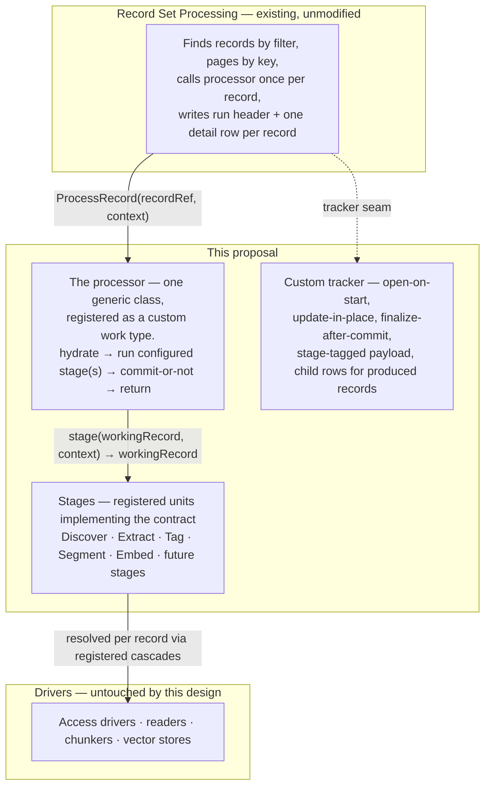

# Content Pipeline Framework — Stages on Record Set Processing

## Status
- **Status**: Draft
- **Created**: 2026-09-24
- **Author**: Dray + Claude
- **Branch**: content-pipeline-framework-plan

## Overview

This proposes a generic content-pipeline framework built entirely on the existing Record Set Processing (RSP) substrate (`packages/RecordSetProcessor`). A content pipeline turns raw material (a crawled page, a file in object storage, an API row, or a record written directly) into retrievable, classified, chunked, embedded content. The work breaks into five independent stages — Discover, Extract, Tag, Segment, Embed — each run on its own schedule against whatever is ready for it, never as a fixed chain.

The core proposal is three pieces, all framework-level (nothing here is deployment-specific):

1. **A working record** — one generic structure passed between stages, carrying identity, a small set of well-known fields (each with a confidence score so competing stages can resolve a shared field without knowing about each other), and an open extension space for anything else a stage wants to hand forward.
2. **A stage contract** — a registered unit (via `MJGlobal.Instance.ClassFactory`) that takes a working record plus run context and returns an updated working record. Cold-start-safe, declared inputs/outputs, identical code whether committed live or run as a test.
3. **One generic processor** — a single class registered as an RSP work type that hydrates a working record, runs the configured stage(s) on it, commits (or doesn't, for a test run), and returns the outcome. RSP supplies the loop, the paging, the concurrency bound, and the audit rows; the pipeline supplies the stage.

**Notably, this requires zero changes to Record Set Processing itself.** An earlier draft of this plan proposed three small engine additions (a batch-finalize hook, full-row source fetch, a Stage column on Process Run Detail). Re-checking the current `IRecordProcessor` interface found that the batch hook already exists — `ProcessBatch?(records, context) => Promise<Map<string,RecordResult>|RecordResult[]>` — and the engine already dispatches to it. Real-time per-record tracking is also already a supported extension point via a custom `IProcessRunTracker`. Both needs are met by existing seams; see Background & Context below. This plan is framework work only.

## Goals & Non-Goals

### Goals
- Treat Discover, Extract, Tag, Segment, Embed as independent stages, each runnable on its own schedule against whatever is ready — never a chain that must run start to finish.
- Make what passes between two adjacent stages one generic, open-ended structure, not a contract two specific stages privately negotiate.
- Make inserting a new stage between two existing ones an addition (write it, register it, give it a schedule) — never an edit to its neighbors.
- Separate a stage's decision about what to do from when its output becomes durable, so persistence (live vs. test/dry-run) is a run-level policy, not something each stage implements.
- Give every stage a real, persisted, per-record account of what happened, using RSP's existing run-tracking (`MJ: Process Runs` / `MJ: Process Run Details`) rather than a parallel set of tables.

### Non-Goals
- **No changes to Record Set Processing itself.** Everything here uses existing, documented extension seams (custom work type / processor, custom tracker, `ProcessBatch`).
- **No specification of how a deployment schedules, queues, or fires a stage's run.** That's entirely implementation-defined — this plan describes the framework once a run has been started; how a given deployment decides *when* to start one (polling, queueing, autoscaling, claiming) is out of scope here.
- **No per-record claiming mechanism.** Safe only under the assumption of at most one concurrent run per (source, stage) — see Risks & Open Questions. Building a claim mechanism is deferred until a deployment actually wants to relax that bound.
- **No enforcement of stages' declared inputs/outputs at registration time.** The declaration is documentation-grade for now; enforcement is a possible future addition once there are enough stages for a mismatch to matter.

## Background & Context

This design builds on existing MJ mechanisms rather than introducing new infrastructure:

| Mechanism | What it provides | State |
|---|---|---|
| Record Set Processing (`MJ: Record Processes` / `Process Runs` / `Process Run Details`, package `RecordSetProcessor`) | Given a filter over an entity, finds matching records, pages by key, calls a registered processor once per record with bounded concurrency, and writes a run header plus one detail row per record. Pause/cancel, progress, an error-rate circuit breaker, three trigger types. | Existing, unmodified |
| Class registration (`MJGlobal.Instance.ClassFactory` / `@RegisterClass`) | A base class declares a contract; concrete implementations register under a key, discoverable and instantiable by name with no compile-time list. | Existing — this is what the stage registry and the Access driver registry are built from |
| `BaseEntity` / entity metadata | Wherever a stage's output needs to be durable, it's a typed field write through the standard save path (validation, audit, cache invalidation included). | Existing |
| `MJ: Credentials` / `ContentSourceParam` / `ContentSourceTypeParam` | Credential storage/reuse and per-source-type declaration of which access roles a source needs. | Existing |
| `FileStorageBase` / `MJ: Files` / `MJ: File Storage Account` | Durable, non-text media storage independent of the original source. | Existing |
| Scheduled jobs (`MJ: Scheduled Jobs`) | Per-source cadence, and RSP's scheduled-job trigger. | Existing |

**What we checked and confirmed does not need to change**, directly against the current source (`packages/RecordSetProcessor/base/src/interfaces.ts`, `packages/RecordSetProcessor/engine/src/RecordSetProcessor.ts`, and `guides/RECORD_SET_PROCESSING_GUIDE.md`):

- **Batch efficiency (needed by Embed)**: `IRecordProcessor.ProcessBatch?(records, context)` already exists and the engine already calls it when present, before falling back to per-record `ProcessRecord`. Its doc comment frames the motivating case as distinct-key dedup/fan-out, but the signature is fully generic — hand it the batch, get back one `RecordResult` per record — which is exactly what a bulk-call stage (generate N embeddings in one model call, upsert in one store call, return N outcomes) needs.
- **Real-time / open-then-update tracking**: RSP's default tracker writes one detail row per record after it finishes. This design wants a row opened when work starts and updated in place as a stage progresses. That's already a documented, supported extension point — implement a custom `IProcessRunTracker` (`BeginRun` / `RecordResult` / `Checkpoint` / `CompleteRun` / `LoadResumeCursor`) — not an engine change.
- **Resume**: the run header carries a paging cursor, but a fresh `Process Run` is created per run and reads the cursor from that row, so a crashed run doesn't automatically resume unless a custom tracker's `LoadResumeCursor` supplies a prior run's cursor on `BeginRun`. This design doesn't depend on resume — a crashed run's records simply stay `Pending` and the next run picks them up — but a custom tracker wanting resume-from-crash semantics can build it on this existing seam.
- **Source row-fetch shape**: `ViewSource`/`FilterSource`/etc. fetch primary keys only (`Fields: entity.PrimaryKeys.map(...)`); the processor does a second lookup per record to hydrate. This is a real, minor inefficiency (two DB trips per record instead of one per page) but not a correctness issue, and not something we're asking to change here — noted for completeness, not part of this proposal.

## Architecture / Design

### Data Model Changes (mermaid erDiagram)

All additions are additive fields on existing entities — no new tables.



### Component / Flow Design (mermaid flowchart)



Each layer knows only the one below it: RSP knows there's a processor; the processor knows there are stages; a stage knows there are drivers. Drivers know nothing about any of it.

### API Changes

No changes to any RSP public interface. New framework-level interfaces/classes (illustrative shapes, not final signatures):

```typescript
interface WorkingRecord {
    Identity: RecordRef; // ephemeral (URL) until committed, then the real key
    Fields: Record<string, { Value: unknown; Confidence: number; SetBy: string }>;
    Extensions: Record<string, unknown>; // namespaced by stage name
    Complete: boolean;
}

interface IPipelineStage {
    readonly Name: string;
    readonly Reads: string[];   // declared well-known fields / extension keys
    readonly Writes: string[];
    Run(record: WorkingRecord, context: StageContext): Promise<WorkingRecord>;
    // Optional — used only when this stage is last/only in the run's stage list
    Finalize?(provisional: WorkingRecord[], context: StageContext): Promise<RecordResult[]>;
}

// Registered as a custom RSP work type
class PipelineProcessor implements IRecordProcessor {
    ProcessRecord(record: RecordRef, context: RecordProcessorContext): Promise<RecordResult>;
    ProcessBatch(records: RecordRef[], context: RecordProcessorContext): Promise<RecordResult[]>; // delegates to a stage's Finalize when the configured stage list ends in one
}
```

## Implementation Plan

Thirteen phases, in dependency order. Nothing here requires a Record Set Processing change.

### Phase F0 — Working record + status fields
Define the working record shape: identity, the well-known field set for Content Source / Content Item / Content Item Chunk, the confidence-scoring convention (`FieldConfidence` JSON per entity), the extension-space convention, hydrate and commit, the completion signal. Define every stage's status field with `Pending` / `Complete` / `Failed` (+ `Skipped`).

### Phase F1 — Stage registry + generic processor
Build the stage registry and the one generic processor, registered as a custom Record Set Processing work type: hydrate → run the configured stage list → commit-or-not → return. Prove it end to end with a no-op stage and a Record Process row before any real stage exists.

### Phase F2 — Pipeline tracker
Build a custom `IProcessRunTracker`: open-on-start, update-in-place, finalize-after-commit, stage tagging in `ResultPayload`, and child rows for records produced in memory (Discover's items, split children).

### Phase F3 — Access
Build Access as a registered driver contract: `OpenSession(contentSource, role)` only — returns a permission artifact, never fetches bytes itself. Role-based credential resolution via `ContentSourceParam` / `ContentSourceTypeParam`, a promise-cached handshake (cache the in-flight promise, not the resolved value, keyed by source+role, on the processor instance built once per run), evict-on-failure, evict-and-retry on staleness, and a directly-callable entry point outside any stage or run (for connectivity testing).

### Phase F4 — Discover
Build and register Discover, with its Record Process row over Content Source. The only stage whose input needs no other stage's output; proves child-row accounting (F2) on real output.

### Phase F5 — Extract
Build and register Extract: obtain the Access artifact if needed → fetch → resolve file type → resolve content type (structural signature matching) → select a reader via a priority cascade → read, falling back to sanity-checked plain text when type can't be determined. Handles multi-block splitting (`ParentID`) and multi-modal/durable-copy handling.

### Phase F6 — Test mode
Test Record Process rows (at minimum `[Discover, Extract]`) and the run-budget dial (sample size, time budget). This is the first point a source can be validated end to end without committing anything — same processor, commits switched off, more than one stage in its configured list.

### Phase F7 — Tag + Segment
Build and register Tag and Segment, with their rows. Independent of each other; Segment depends on Extract (F5) for text to chunk. Chunk-strategy registration mirrors the reader cascade.

### Phase F8 — Embed
Build and register Embed: light per-record step (hydrate, gather text) plus `ProcessBatch` doing batched embedding generation and a bulk upsert, sub-batched and rate-limited against the configured vector store's limits, returning a per-record outcome. Uses the existing `ProcessBatch` seam — no longer gated on any engine change.

### Phase F9 — Multi-modal cascade + durable copies
Multi-modal default/override cascade and durable copy persistence within Extract, keyed via `FieldPathResolver` for tenant isolation. Depends on Access (F3) and Extract's modality detection (F5).

### Phase F10 — Archive reader
A standard archive reader, proving multi-block splitting via `ParentID` and child-row accounting end to end.

### Phase F11 — Change detection + reset
Change detection (checksum), the flat reset (resets every downstream stage's status field in one operation rather than relying on each intermediate stage to run and propagate it), and parent/child reconciliation by URL. Needs every stage's status field to exist first (F0, F5, F7, F8).

### Phase F12 — Per-record claiming (deferred)
Choose a claiming mechanism (see Risks & Open Questions) and build it, plus a stale-claim release sweep. Only needed once a deployment wants more than one concurrent run per (source, stage). Deliberately last.

## Migration & Data

All schema changes are additive:
- `FieldConfidence` (JSON) and equivalent per-field confidence tracking on Content Source / Content Item / Content Item Chunk (F0).
- Status fields (`ExtractionStatus`, `TaggingStatus`, `SegmentationStatus`, `EmbeddingStatus`) where missing (F0).
- `ContentSourceTypeParam` rows per source type, an Access-driver reference on Content Source Type / Content Source (F3).
- `ExtractorKey`, `ExtractorKeyOverride`, `ContentItem.Modality` (F5).
- A segmentation status field (F7).
- A file reference field, source/type multi-modal flags (F9).

No changes to `MJ: Process Runs` / `MJ: Process Run Details` schema — the stage tag rides in the existing `ResultPayload` JSON column rather than a new column.

## Testing Strategy

- **F1** proves the processor/RSP integration with a no-op stage before any real stage exists.
- **F6** is the primary test-mode mechanism: a Record Process row whose configuration names a stage list (e.g., `[Discover, Extract]`) and sets test mode. The platform finds the starting records and hands each to the processor once; the processor runs every listed stage on that record in memory, handing each stage's output straight to the next, and never commits. Real authentication, real fetches, real parsing — nothing stored. Stage code is identical to production; only the processor knows commits are off.
- Sample size and time budget are both tunable — a fast handful of records for a routine sanity check, up to full-volume/full-pace for revealing real rate limits before a production run hits them.
- Results persist in the same `Process Run` / `Process Run Detail` rows as any run, distinguished as a test only by which Record Process they belong to (no marker column needed).
- **F10** is the first end-to-end proof of the multi-block split pattern (archive reader → `ParentID` children → per-child tracker rows).

## Risks & Open Questions

- **Per-record claiming mechanism (F12)**: three candidate approaches — a uniqueness constraint scoped to open claims, a conditional update checked by affected-row count, or a locking read that skips already-held rows. Laid out as a comparison rather than a recommendation; worth settling with whoever owns the data-access layer when a deployment actually wants more than one concurrent run per (source, stage). Not gating anything in this plan.
- **Cross-stage race**: a source's downstream reset (F11) and another stage's in-flight commit can race — e.g., Discover resets an item's status to `Pending` while an Extract run is mid-commit on stale bytes it fetched before the change. Fix is a conditional commit (advance a status only if it's still what the run read). Cheap, worth doing proactively, not gating anything.
- **Repeated-failure cap**: `MJ: Process Run Detail.AttemptCount` is written today but never read; nothing retries a failed record automatically (by design — failure is a deliberate stop, not silent retry). Whether a record failing the same stage N times should eventually need something other than a person resetting it is open; `AttemptCount` is the natural home if a cap is ever wanted.
- **Extension-key namespacing (F0)**: scoping each stage's own extension keys under its registered stage name is the obvious convention to prevent collisions, but isn't yet formally fixed.
- **Declared inputs/outputs enforcement**: advisory only for now, given the small number of stages; revisit if that set grows enough for a mismatch to actually bite.
- **Source row-fetch inefficiency**: sources fetch primary keys only, so the processor does a second lookup per record on hydrate (two DB trips instead of one per page). Not part of this proposal; noted as a possible future ask if it matters at scale.

## Files to Modify

| File / Package | Change |
|---|---|
| `packages/MJCoreEntities` (generated) | New/additive fields per F0/F3/F5/F7/F9 — via `mj sync push` + CodeGen, not hand-edited |
| `packages/RecordSetProcessor` (base/engine) | None — used as-is via existing `IRecordProcessor`, `IProcessRunTracker`, `ProcessBatch` seams |
| New package or module for the pipeline framework (naming TBD with MJ team) | `WorkingRecord`, `IPipelineStage` contract, stage registry, `PipelineProcessor` (F1), pipeline tracker (F2), Access driver contract (F3) |
| New package/module — stage implementations | Discover, Extract, Tag, Segment, Embed (F4, F5, F7, F8) |
| `metadata/*.json` | New `Record Process` rows per stage, `ContentSourceTypeParam` rows, status-field metadata (via `mj sync push`) |
| `migrations/v*/` | Additive schema migrations per the Migration & Data section above |

## References

- [`guides/RECORD_SET_PROCESSING_GUIDE.md`](../guides/RECORD_SET_PROCESSING_GUIDE.md) — the authoritative substrate reference this design builds on.
- `packages/RecordSetProcessor/base/src/interfaces.ts` — `IRecordProcessor`, `IProcessRunTracker`, `ProcessBatch` (already-existing seams this design uses).
- Internal design document "The Handoff" (not included in this PR) — full narrative rationale, worked examples, and the mechanisms considered and set aside.
