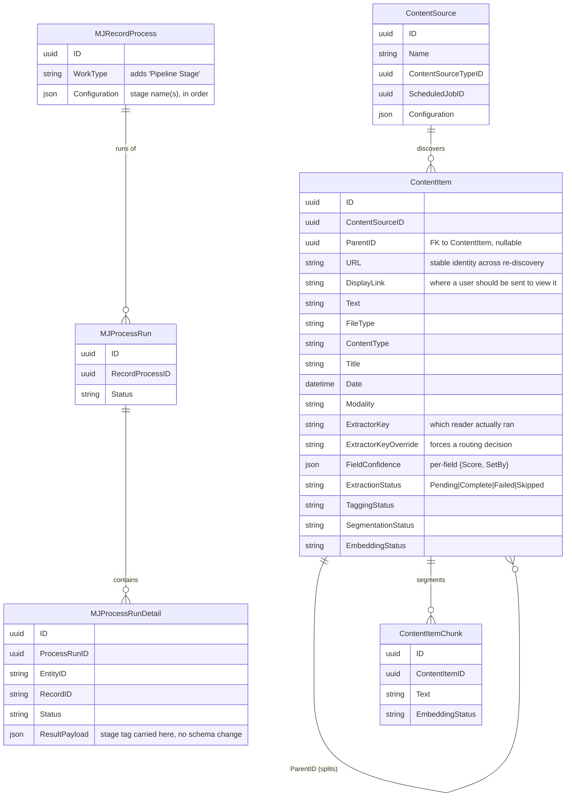
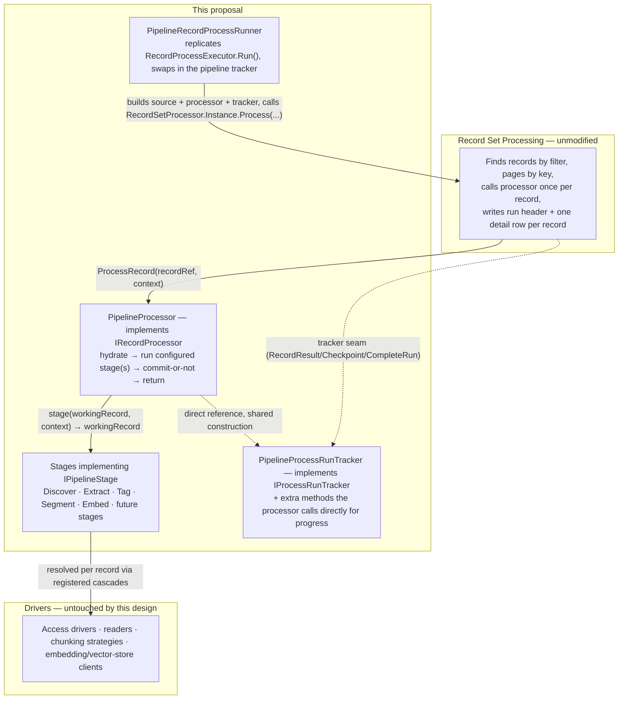

# Content Pipeline Framework — Stages on Record Set Processing

## Status
- **Status**: Draft
- **Created**: 2026-09-24
- **Author**: Dray + Claude
- **Branch**: dray/content-pipeline-framework

## Overview

This proposes a generic content-pipeline framework built on Record Set Processing (RSP) (`packages/RecordSetProcessor`). A content pipeline turns raw material (a crawled page, a file in object storage, an API row, or a record written directly) into retrievable, classified, chunked, embedded content. The work breaks into five independent stages — Discover, Extract, Tag, Segment, Embed — each run on its own schedule against whatever is ready for it, never as a fixed chain.

The core proposal is three pieces, all framework-level (nothing here is deployment-specific — how a run actually gets started is out of scope, see Non-Goals):

1. **A working record** — one generic structure passed between stages, carrying identity, a small set of well-known fields (each with a confidence score so competing stages can resolve a shared field without knowing about each other), and an open extension space for anything else a stage wants to hand forward.
2. **A stage contract** — a registered unit (via `MJGlobal.Instance.ClassFactory`) that takes a working record plus run context and returns an updated working record. Cold-start-safe, declared inputs/outputs, identical code whether committed live or run as a test.
3. **One generic processor** — a single class registered against RSP's work-type registry that hydrates a working record, runs the configured stage(s) on it, commits (or doesn't, for a test run), and returns the outcome.

## Goals & Non-Goals

### Goals
- Treat Discover, Extract, Tag, Segment, Embed as independent stages, each runnable on its own schedule against whatever is ready — never a chain that must run start to finish.
- Make what passes between two adjacent stages one generic, open-ended structure, not a contract two specific stages privately negotiate.
- Make inserting a new stage between two existing ones an addition (write it, register it, give it a schedule) — never an edit to its neighbors.
- Separate a stage's decision about what to do from when its output becomes durable, so persistence (live vs. test/dry-run) is a run-level policy, not something each stage implements.
- Give every stage a real, persisted, per-record account of what happened, using RSP's existing run-tracking (`MJ: Process Runs` / `MJ: Process Run Details`) rather than a parallel set of tables.

### Non-Goals
- No specification of how a deployment schedules, queues, or fires a stage's run. This plan describes the framework once a run has been started.
- No per-record claiming mechanism. Safe only under the assumption of at most one concurrent run per (source, stage) — see Risks & Open Questions.
- No enforcement of stages' declared inputs/outputs at registration time. Advisory only for now.

## Background & Context

This design builds on existing MJ mechanisms:

| Mechanism | What it provides |
|---|---|
| Record Set Processing (`MJ: Record Processes` / `Process Runs` / `Process Run Details`, package `RecordSetProcessor`) | Given a filter over an entity, finds matching records, pages by key, calls a registered processor once per record with bounded concurrency, and writes a run header plus one detail row per record. Pause/cancel, progress, an error-rate circuit breaker, three trigger types. |
| `RecordProcessorRegistry` (`packages/RecordSetProcessor/base/src/registry.ts`) | The open seam that lets a consumer package teach RSP about a new `WorkType` without `RecordSetProcessor` depending on it — already used by Predictive Studio's `'ML Model'` work type. This is how the pipeline's processor gets wired in (F1) with no engine change. |
| Class registration (`MJGlobal.Instance.ClassFactory` / `@RegisterClass`) | A base class declares a contract; concrete implementations register under a key, discoverable by name with no compile-time list. |
| `BaseEntity` / entity metadata | Wherever a stage's output needs to be durable, it's a typed field write through the standard save path. |
| `MJ: Credentials` / `ContentSourceParam` / `ContentSourceTypeParam` | Credential storage/reuse and per-source-type declaration of which access roles a source needs. |
| `FileStorageBase` / `MJ: Files` / `MJ: File Storage Account` | Durable, non-text media storage independent of the original source. |
| Scheduled jobs (`MJ: Scheduled Jobs`) | Per-source cadence, and RSP's scheduled-job trigger. |

## Architecture / Design

### Data Model Changes

All additions are additive fields on existing entities — no new tables.



### Component / Flow Design



Each layer knows only the one below it: RSP knows there's a processor; the processor knows there are stages; a stage knows there are drivers.

### API Changes

```typescript
// content-pipeline-base package

interface WorkingRecordField {
    Value: unknown;
    Confidence: number;
    SetBy: string; // registered stage name that set it
}

class WorkingRecord {
    readonly Identity: RecordRef; // ephemeral (URL-based) until committed, then the real PK
    readonly Fields: Map<string, WorkingRecordField>;
    readonly Extensions: Record<string, unknown>; // namespaced by stage name, e.g. "Tag.Categories"
    Complete: boolean;

    // Enforces "a new proposal only overwrites what's there if its score is strictly higher"
    SetField(name: string, value: unknown, confidence: number, setBy: string): void;
    GetField(name: string): WorkingRecordField | undefined;
}

interface StageContext {
    contextUser: UserInfo;
    provider: IMetadataProvider;
    isTestRun: boolean;
    recordProcessID?: string;
    reportProgress?: (message: string) => void; // wired to the tracker's in-place update
}

interface IPipelineStage {
    readonly Name: string;
    readonly Reads: string[];
    readonly Writes: string[];
    Run(record: WorkingRecord, context: StageContext): Promise<WorkingRecord>;
    // Present only on stages whose bulk operation is cheaper batched (Embed)
    Finalize?(provisional: WorkingRecord[], context: StageContext): Promise<RecordResult[]>;
}

abstract class BasePipelineStage implements IPipelineStage {
    abstract readonly Name: string;
    abstract readonly Reads: string[];
    abstract readonly Writes: string[];
    abstract Run(record: WorkingRecord, context: StageContext): Promise<WorkingRecord>;
}

// content-pipeline-engine package

class PipelineProcessor implements IRecordProcessor {
    constructor(stageNames: string[], tracker: PipelineProcessRunTracker, isTestRun: boolean);
    ProcessRecord(record: RecordRef, context: RecordProcessorContext): Promise<RecordResult>;
    // Assigned in the constructor ONLY when the last configured stage declares Finalize —
    // left undefined otherwise so RSP's own `typeof processor.ProcessBatch === 'function'`
    // check falls through to per-record ProcessRecord.
    ProcessBatch?: (records: RecordRef[], context: RecordProcessorContext) => Promise<RecordResult[]>;
}

class PipelineProcessRunTracker implements IProcessRunTracker {
    // Standard IProcessRunTracker methods RSP calls directly (BeginRun/RecordResult/Checkpoint/CompleteRun/LoadResumeCursor)

    // Extra methods — NOT part of IProcessRunTracker — called directly by PipelineProcessor,
    // which holds a reference to this same tracker instance (see F2).
    OpenDetail(handle: RunHandle, record: RecordRef, stageName: string): Promise<void>;
    UpdateProgress(handle: RunHandle, record: RecordRef, message: string): Promise<void>;
    RecordChildOutcome(handle: RunHandle, parent: RecordRef, child: RecordRef, result: RecordResult): Promise<void>;
}

// Fires one stage's run against a Record Process row, bypassing RecordProcessExecutor.Run()
// (which hardcodes GenericProcessRunTracker with no override point — see F1/F2) while reusing
// its public BuildSource/BuildProcessor helpers.
class PipelineRecordProcessRunner {
    async Run(recordProcessID: string, options: RunRecordProcessOptions): Promise<ProcessRunResult>;
}
```

## Implementation Plan

Thirteen phases, in dependency order.

### Phase F0 — Working record + status fields
- Define `WorkingRecord` and `WorkingRecordField` (`content-pipeline-base`, plain classes — no `BaseEntity` involved, since a working record may not be persisted yet).
- Add a `FieldConfidence` JSON column to Content Source / Content Item / Content Item Chunk (via `metadata/*.json` + migration + `mj sync push` + CodeGen), holding `{ "Title": { "Score": 4, "SetBy": "Discover.RSS" } }` per field.
- Add status fields where missing: `ExtractionStatus`, `TaggingStatus`, `SegmentationStatus`, `EmbeddingStatus` on the relevant entities — each a value-list field, `Pending` / `Complete` / `Failed` / `Skipped`, default `Pending`.
- Build `WorkingRecordHydrator` / `WorkingRecordCommitter` — entity-specific (one per Content Source / Content Item / Content Item Chunk) mapping between `BaseEntity` fields + `FieldConfidence` JSON and a `WorkingRecord`'s `Fields` map. These are the only two places a working record touches the database (4.4 in the internal design doc), and neither belongs to any stage's own code.
- **Assumption**: the well-known field set and its entity mapping is fixed for v1 (three entities); a stage needing a field beyond that set uses the extension space instead.

### Phase F1 — Stage registry + generic processor
- Build the stage registry: `IPipelineStage` resolved via `MJGlobal.Instance.ClassFactory` by registered name (`@RegisterClass(BasePipelineStage, 'Discover')`, etc.).
- Build `PipelineProcessor implements IRecordProcessor` (`content-pipeline-engine`). Register it against RSP's `RecordProcessorRegistry.Instance.Register('Pipeline Stage', factory)` (`packages/RecordSetProcessor/base/src/registry.ts`) — the exact seam Predictive Studio's `'ML Model'` work type already uses, so `WorkType = 'Pipeline Stage'` needs only an additive metadata value (new `EntityFieldValue` row), not an engine change.
- The registered factory reads `RecordProcessorBuildContext.Configuration` (the ordered stage-name list) and constructs `PipelineProcessor` once — this is what "built once per run, configuration in hand before the first record" means concretely: the factory closure captures the resolved `IPipelineStage` instances at construction time, not per-record.
- **Key technical point — tracker injection isn't available through the normal entry point.** `RecordProcessExecutor.Run()` (`packages/RecordSetProcessor/engine/src/RecordProcessExecutor.ts:97`) calls `RecordSetProcessor.Instance.Process({...})` without ever passing a `tracker`, so any run started via `RecordProcessExecutor.RunByID()` — the path the UI's "Run Record Process" action and the scheduled-job trigger use — always gets the default `GenericProcessRunTracker`. There is no supported way today to plug in a custom tracker for a metadata-driven Record Process run. Since real-time tracking (F2) requires our own tracker, the fix is architectural, not an engine change: build `PipelineRecordProcessRunner`, which calls `RecordProcessExecutor.BuildSource(rp, provider)` and `RecordProcessExecutor.BuildProcessor(rp, dryRun, provider)` — both already `public` — then calls `RecordSetProcessor.Instance.Process({ source, processor, tracker: new PipelineProcessRunTracker(), ... })` directly, replicating the handful of pass-through fields (`batchSize`, `skipUnchanged`, `watermarkStrategy`, `lastRunAt`) that `RecordProcessExecutor.Run()` sets. Whatever fires a pipeline stage's run calls this runner instead of `RecordProcessExecutor.RunByID`.
- Prove F0+F1 end to end with a trivial `NoOpStage` and a real `Record Process` row before any real stage exists.

### Phase F2 — Pipeline tracker
- Build `PipelineProcessRunTracker implements IProcessRunTracker`, constructed together with `PipelineProcessor` by `PipelineRecordProcessRunner` (F1) so the two share a direct object reference — not wired through RSP.
- **Key technical point — how "open on start, update in place" actually works.** `IProcessRunTracker` has no per-record start hook; `GenericProcessRunTracker`'s own source comments this directly ("Reliable/insert-before-fire mode is a future enhancement — it needs a per-record start hook on `IProcessRunTracker`"). This is handled entirely on the pipeline side: `PipelineProcessor.ProcessRecord` calls `tracker.OpenDetail(handle, record, stageName)` — a method that exists only on `PipelineProcessRunTracker`, not on the `IProcessRunTracker` contract — before running any stage. `OpenDetail` creates and saves an `MJProcessRunDetailEntity` with `Status = 'Pending'`, `StartedAt = now`, and keeps the loaded entity object in an in-memory map keyed by record identity for the run's lifetime. A stage calls `context.reportProgress(message)`, which resolves to `tracker.UpdateProgress`, mutating and re-saving that same entity in place. When RSP later calls the standard `tracker.RecordResult(handle, record, result, ...)` (its normal, once-per-record call), the tracker looks up the already-open entity from its map and finalizes it (`Status`, `CompletedAt`, `ResultPayload`) instead of creating a new one — turning what `GenericProcessRunTracker` does as a single fire-and-forget insert into an open-then-update pair.
- The stage tag rides in `ResultPayload` JSON (e.g. `{ "Stage": "Extract", ... }`) — no new column.
- `RecordChildOutcome` handles records the platform never handed to the processor (Discover's produced items, a splitting reader's children) — one additional detail row per child, `RecordID` set to the real key once committed or the ephemeral URL identity when the run is a test.
- **Assumption**: the in-memory open-detail map is safe because `maxConcurrency` bounds how many records are in flight at once within a single processor instance, and a processor instance is never shared across runs.

### Phase F3 — Access
- `IAccessDriver` interface (`content-pipeline-base`): single method `OpenSession(contentSource, role): Promise<AccessArtifact>`. Registered via `@RegisterClass(IAccessDriver, <ContentSourceType key>)`, with a per-source override.
- Role → credential resolution via `ContentSourceParam` / `ContentSourceTypeParam` rows referencing `MJ: Credentials` — no JSON configuration field.
- The promise-cache lives as a private `Map<string, Promise<AccessArtifact>>` field **on the `PipelineProcessor` instance** (built once per run, per F1), keyed by `${ContentSourceID}:${role}`. The check-and-store on first use happens synchronously before any `await`, so no two records can both start a handshake for the same key. Evict on rejection (a failed handshake shouldn't stay cached and poison every later record); evict-and-retry when a stage reports mid-run staleness.
- Directly-callable entry point (`AccessDriverRegistry.OpenSession(contentSource, role)`) outside any stage or run, for a connectivity-testing tool to call.

### Phase F4 — Discover
- `DiscoverStage extends BasePipelineStage`, registered as `'Discover'`. Its own `Run` is a thin dispatcher: resolves an `IContentDiscoverer` by `ContentSource.ContentSourceTypeID` (same registration pattern as Access and readers), and delegates enumeration to it.
- `IContentDiscoverer.Enumerate(contentSource, context): AsyncIterable<DiscoveredItem>` — one concrete implementation per source type (paginated API list, folder walk, sitemap crawl).
- Each `DiscoveredItem` becomes a new `WorkingRecord` with no prior identity; populates whatever well-known fields the source declared (file type, title, date), each tagged with its own confidence. May set `Complete = true` when the source already provided everything needed.
- Runs over `Content Source`; the platform sees one record per run (the source itself) — the items Discover produces in memory are accounted for via `tracker.RecordChildOutcome` (F2), not via RSP's own per-record loop.

### Phase F5 — Extract
- `ExtractStage extends BasePipelineStage`, registered as `'Extract'`. Runs over `Content Item`; ready when `ExtractionStatus = 'Pending'`.
- Orchestration: obtain an Access artifact via `IAccessDriver.OpenSession` if the source declares a content role → fetch bytes → resolve file type (`FileTypeResolver`: declared-at-discovery, then unambiguous byte-signature correction, then sniffing, then extension, in that precedence) → resolve content type (`IContentTypeSignature` matchers, keyed by file type, run in parallel against the same bytes, each proposing a content type at a declared confidence) → select a reader.
- `IContentReader` interface: `SupportsFileType(fileType): boolean`, `Priority: number`, `Read(bytes, context): Promise<ExtractedBlock[]>`. Resolution cascade, most specific first: an explicit `ExtractorKeyOverride` stamped on the record → `ContentSourceExtractor` rows (per-source override, ranked by `Priority`) → `ContentType.ExtractorKey` default → built-in fallback reader (sanity-checked plain text).
- More than one `ExtractedBlock` becomes more than one child `WorkingRecord`, linked by `ParentID`; each child inherits the parent's temporal identity. `ExtractorKey` records which reader actually ran, for traceability.
- Multi-modal handling and durable-copy persistence are deferred to F9.

### Phase F6 — Test mode
- A `Record Process` row whose `Configuration` names an ordered stage list (e.g. `['Discover', 'Extract']`) and sets a test flag. `PipelineProcessor` runs every listed stage on the record in memory, handing each stage's output straight to the next, and skips the commit step in `WorkingRecordCommitter` entirely.
- Run-budget dial: sample size (record cap, already an RSP option) and a per-stage wall-clock budget (new — a stage checks elapsed time against a budget passed in `StageContext` and stops early, reporting what it already found).
- **Assumption**: `[Discover, Extract]` as one chained test is the first concrete proof; other chains follow the same mechanism with no processor changes.

### Phase F7 — Tag + Segment
- `TagStage extends BasePipelineStage`, registered as `'Tag'`. Runs over `Content Item`; ready when `TaggingStatus = 'Pending'`. Delegates classification to a registered classifier (implementation-defined per deployment — an AI Prompt via the existing prompt-execution path, or a plain function); writes results as extension keys or well-known fields depending on the deployment's downstream needs.
- `SegmentStage extends BasePipelineStage`, registered as `'Segment'`. Runs over `Content Item`; ready when `SegmentationStatus = 'Pending'`. Resolves an `IChunkingStrategy` by content type (same cascade pattern as readers): `Chunk(text, context): ChunkSpec[]`. Each `ChunkSpec` becomes a child `WorkingRecord` targeting `Content Item Chunk`, inheriting decorator/multi-modal handling from its parent.
- Independent of each other; Segment depends on Extract (F5) only for there being text to chunk, not on any shared code.

### Phase F8 — Embed
- `EmbedStage extends BasePipelineStage`, registered as `'Embed'`. Runs over `Content Item Chunk` (or `Content Item` directly for the single-chunk case); ready when `EmbeddingStatus = 'Pending'`.
- `Run` (per-record) only hydrates and gathers the record's text into `context`'s provisional bucket — no external call.
- `Finalize(provisional, context)` generates embeddings for the whole page in one call to a registered embedding provider and upserts them in one call to a registered vector store, sub-batched and rate-limited against each store's own limits, then returns one `RecordResult` per input record.
- In `PipelineProcessor` (F1), `Finalize` is used only when Embed is the last stage in the run's configured list — `PipelineProcessor.ProcessBatch` is assigned in the constructor precisely when `stages[stages.length - 1].Finalize` exists, and otherwise left `undefined` so RSP's engine falls back to per-record `ProcessRecord` (this is also why a chained test run that includes Embed earlier in a list runs it per-record: `Finalize` never applies to a non-last stage).
- Uses the existing `IRecordProcessor.ProcessBatch` seam (`packages/RecordSetProcessor/base/src/interfaces.ts:93`) — the engine already dispatches to it when present.

### Phase F9 — Multi-modal cascade + durable copies
- Extract's multi-modal default/override cascade (`ContentSourceType`-level default, `Content Source`-level override) and durable-copy persistence via `FileStorageBase`/`MJ: Files`, keyed via `FieldPathResolver` for tenant isolation in the object key. Depends on Access (F3) and Extract's modality detection (F5).

### Phase F10 — Archive reader
- A standard archive `IContentReader` implementation, proving multi-block splitting via `ParentID` and child-row accounting (F2's `RecordChildOutcome`) end to end on real, non-trivial output.

### Phase F11 — Change detection + reset
- Change detection: a checksum comparison on re-discovery; unchanged content is a no-op.
- `ContentPipelineResetService.ResetRecord(entityID, recordID)` / `ResetFailedForSource(contentSourceID)` — a flat operation writing `Pending` to every downstream status field on an entity in one pass (not relying on each intermediate stage actually running to propagate the reset forward). Used both for a changed record and for the deliberate, human-triggered "retry a failed record" action.
- Parent/child reconciliation on re-extraction: match new blocks against existing children by `URL`; update in place, delete orphaned children (recursively through their own chunks/children), create unmatched new blocks.
- Needs every stage's status field to exist first (F0, F5, F7, F8).

### Phase F12 — Per-record claiming (deferred)
- Choose a claiming mechanism (see Risks & Open Questions) and build it, plus a stale-claim release sweep. Only needed once a deployment wants more than one concurrent run per (source, stage). Deliberately last.

## Migration & Data

All schema changes are additive:
- `FieldConfidence` (JSON) on Content Source / Content Item / Content Item Chunk (F0).
- Status fields (`ExtractionStatus`, `TaggingStatus`, `SegmentationStatus`, `EmbeddingStatus`) where missing (F0).
- A new `WorkType` value, `'Pipeline Stage'`, on `MJ: Record Processes` (F1) — additive metadata (new `EntityFieldValue` row), the same mechanism already used to add Predictive Studio's `'ML Model'` work type.
- `ContentSourceTypeParam` rows per source type, an Access-driver reference on Content Source Type / Content Source (F3).
- `ExtractorKey`, `ExtractorKeyOverride`, `ContentItem.Modality` (F5).
- A segmentation status field (F7).
- A file reference field, source/type multi-modal flags (F9).

No changes to `MJ: Process Runs` / `MJ: Process Run Details` schema — the stage tag rides in the existing `ResultPayload` JSON column.

## Testing Strategy

- **F1** proves the processor/RSP integration with a no-op stage before any real stage exists.
- **F6** is the primary test-mode mechanism: a `Record Process` row whose configuration names a stage list and sets test mode. `PipelineProcessor` runs every listed stage on a record in memory and skips the commit step; stage code is identical to production, only the processor knows commits are off.
- Sample size and time budget are both tunable — a fast handful of records for a routine sanity check, up to full-volume/full-pace for revealing real rate limits before a production run hits them.
- Results persist in the same `Process Run` / `Process Run Detail` rows as any run, distinguished as a test only by which `Record Process` they belong to.
- **F10** is the first end-to-end proof of the multi-block split pattern (archive reader → `ParentID` children → per-child tracker rows).

## Risks & Open Questions

- **Per-record claiming mechanism (F12)**: three candidate approaches — a uniqueness constraint scoped to open claims, a conditional update checked by affected-row count, or a locking read that skips already-held rows. Worth settling with whoever owns the data-access layer when a deployment actually wants more than one concurrent run per (source, stage). Not gating anything in this plan.
- **Cross-stage race**: a source's downstream reset (F11) and another stage's in-flight commit can race — e.g., Discover resets an item's status to `Pending` while an Extract run is mid-commit on stale bytes fetched before the change. Fix is a conditional commit (advance a status only if it's still what the run read). Cheap, worth doing proactively, not gating anything.
- **Tracker injection at the `RecordProcessExecutor` level (Substrate-adjacent)**: F1/F2 work around `RecordProcessExecutor.Run()` hardcoding `GenericProcessRunTracker` by building `PipelineRecordProcessRunner` on top of its public `BuildSource`/`BuildProcessor` methods instead of calling `Run()` directly. This works today with no engine change, but duplicates the handful of pass-through fields (`batchSize`, `skipUnchanged`, `watermarkStrategy`, `lastRunAt`) `Run()` already sets. Worth asking, at low priority, whether `RunRecordProcessOptions` should accept an optional `tracker` override — a small, generically useful addition, not something this plan depends on.
- **Repeated-failure cap**: `MJ: Process Run Detail.AttemptCount` is written today but never read; nothing retries a failed record automatically (by design — failure is a deliberate stop, not silent retry). Whether a record failing the same stage N times should eventually need something other than a person resetting it is open; `AttemptCount` is the natural home if a cap is ever wanted.
- **Extension-key namespacing (F0)**: scoping each stage's own extension keys under its registered stage name is the obvious convention to prevent collisions, but isn't yet formally fixed.
- **Declared inputs/outputs enforcement**: advisory only for now, given the small number of stages; revisit if that set grows enough for a mismatch to actually bite.
- **Source row-fetch inefficiency**: `ViewSource`/`FilterSource`/etc. fetch primary keys only (`Fields: entity.PrimaryKeys.map(...)`), so `WorkingRecordHydrator` does a second lookup per record. Not part of this proposal; noted as a possible future ask if it matters at scale.

## Files to Modify

| File / Package | Change |
|---|---|
| `packages/MJCoreEntities` (generated) | New/additive fields per F0/F3/F5/F7/F9 — via `mj sync push` + CodeGen, not hand-edited |
| `packages/RecordSetProcessor` (base/engine) | No code changes. `RecordProcessorRegistry.Instance.Register('Pipeline Stage', ...)` called from the new package at startup; `RecordProcessExecutor.BuildSource`/`BuildProcessor` reused as-is |
| New package `content-pipeline-base` | `WorkingRecord`, `WorkingRecordField`, `IPipelineStage`, `BasePipelineStage`, `StageContext`, `IAccessDriver`, `IContentReader`, `IContentDiscoverer`, `IChunkingStrategy` (naming TBD with MJ team) |
| New package `content-pipeline-engine` | `PipelineProcessor`, `PipelineProcessRunTracker`, `PipelineRecordProcessRunner`, `WorkingRecordHydrator`/`Committer`, `AccessDriverRegistry`, `FileTypeResolver`, `ContentPipelineResetService` |
| New package/module — stage implementations | `DiscoverStage`, `ExtractStage`, `TagStage`, `SegmentStage`, `EmbedStage` (F4, F5, F7, F8) and their concrete drivers (readers, discoverers, chunking strategies) |
| `metadata/*.json` | New `Record Process` rows per stage, `ContentSourceTypeParam` rows, status-field metadata, the `'Pipeline Stage'` `WorkType` value (via `mj sync push`) |
| `migrations/v*/` | Additive schema migrations per the Migration & Data section above |

## References

- [`guides/RECORD_SET_PROCESSING_GUIDE.md`](../guides/RECORD_SET_PROCESSING_GUIDE.md) — the substrate reference this design builds on.
- `packages/RecordSetProcessor/base/src/interfaces.ts` — `IRecordProcessor`, `IProcessRunTracker`, `ProcessBatch`.
- `packages/RecordSetProcessor/base/src/registry.ts` — `RecordProcessorRegistry`, the work-type extension seam this design registers against.
- `packages/RecordSetProcessor/engine/src/RecordProcessExecutor.ts` — `BuildSource`/`BuildProcessor`, reused by `PipelineRecordProcessRunner`.
- `packages/RecordSetProcessor/engine/src/trackers/GenericProcessRunTracker.ts` — the default tracker this design's tracker diverges from for real-time updates.
- Internal design document "The Handoff" (not included in this PR) — full narrative rationale, worked examples, and the mechanisms considered and set aside.
