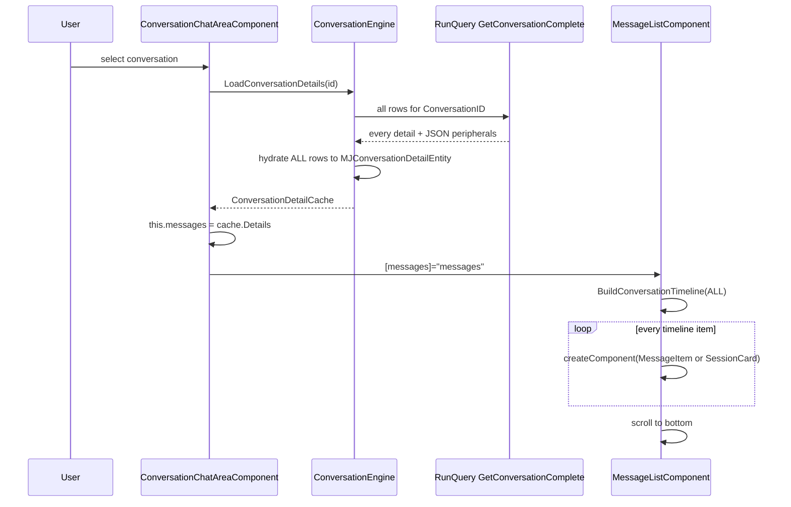
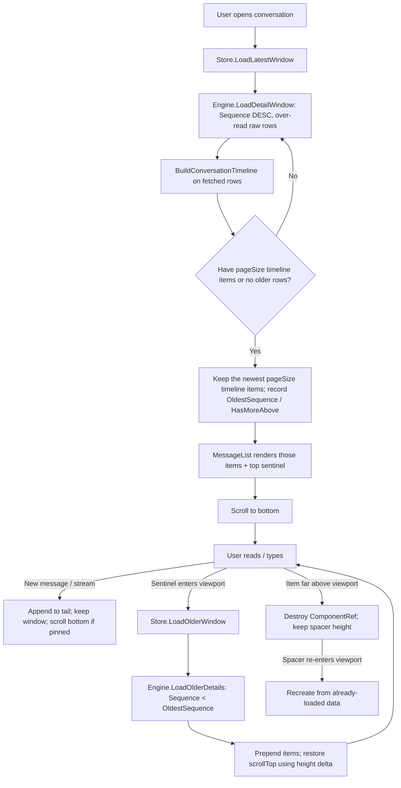

# Conversation Detail Windowing

## Status
- **Status**: Draft — plan-only, no implementation in this PR
- **Created**: 2026-08-13
- **Author**: AN-BC
- **Branch**: `an-bc/conversation-detail-windowing`

## Overview

Opening a conversation today loads **every** `MJ: Conversation Details` row for that conversation, hydrates each one into a `MJConversationDetailEntity`, then dynamically creates an Angular component (or embedded view) for **every** timeline item. That is fine for a 12-message chat. It is the hot-path tax on a 400-message (or 4,000-message) thread: one fat `GetConversationComplete` query, a large hydrate, and a large DOM.

The product behavior we want:

1. Opening a conversation shows the **most recent ~10 display items**, scrolled to the bottom (today's default).
2. Everything older is represented by a **sentinel / placeholder** at the top ("N earlier messages").
3. When that sentinel scrolls into view, load the **previous page**, splice real content into the placeholders, and keep the user's scroll position stable (no jump to the top, no jump to the bottom).
4. Components that have scrolled far off-screen can be **unmounted** and replaced with a height-holding spacer so the DOM stays bounded even after the user has paged a long way up.

This is a **chat-surface** change. The work lives primarily in `@memberjunction/ng-conversations`. A thin additive API on `ConversationEngine` (`@memberjunction/core-entities`) is required because that engine is already the chat area's source of truth for details and peripherals — do not re-implement RunView + artifact/rating/agent-run loading inside Angular.

This plan is written so someone who has not been in the design conversation can implement it in order, with concrete files, function names, and acceptance checks at each step.

## Goals & Non-Goals

### Goals

- First paint of a conversation transfers and hydrates only the **latest window** of details, not the full history.
- The user can scroll upward to load older windows, indefinitely, until the first message.
- Scroll position is preserved when older content is prepended.
- Newly sent / streamed messages still append at the bottom and auto-scroll, same as today.
- Switching conversations cancels in-flight window loads (the existing `loadToken` pattern stays).
- Session cards from `BuildConversationTimeline` still collapse `AgentSessionID` rows. Paging is in **display-timeline space**, not raw-row space.
- Unit tests cover the window math with no Angular and no database.
- Package tests for `@memberjunction/ng-conversations` and `@memberjunction/core-entities` stay green.

### Non-Goals

- Changing how **agents** assemble their context window. `ConversationEngine.GetAgentContextWindow` / `LoadWindowRowsFresh` stay on the full-history path. Do not make `LoadConversationDetails` return a partial set — server and agent callers depend on a complete cache.
- Rewriting `GetConversationComplete` into a pager. Stored queries have no `AfterKey`, and that query is the wrong primitive for "previous 10."
- Windowing the **thread panel** (`thread-panel.component.ts`). Replies for one parent are a small set; leave `DataCacheService` as-is there.
- Changing `DataCacheService.loadConversationDetails`. Chat-area does **not** call it (it is an unused / thread-adjacent helper). Do not build the feature on that method.
- Virtualizing with a third-party grid. This is a chat transcript, not AG Grid.
- Changing Explorer chrome, routing, or the conversations-runtime agent dispatch path.
- A new database table or a new entity. No migration is required for the first implementation.
- PostgreSQL authoring. If a stored query is added later (not in v1), that is a metadata change for the build engineer — do not hand-write `migrations-pg/`.

## Background & Context

### What happens today when you open a chat



Key call sites (read these before writing code):

| File | What to notice |
|------|----------------|
| `packages/Angular/Generic/conversations/src/lib/components/conversation/conversation-chat-area.component.ts` | `loadMessages` (~1504) is the chat hot path. It calls `this.engine.LoadConversationDetails`, assigns `this.messages = cacheEntry.Details`, then `loadPeripheralData`. A `loadToken` already cancels stale loads when the user switches conversations. |
| `packages/MJCoreEntities/src/engines/conversations.ts` | `LoadConversationDetails` (~1099) always runs `GetConversationComplete` with only `{ ConversationID }`. No `MaxRows`, no cursor. Hydrates every row. Cache key is `NormalizeUUID(conversationId)`. |
| `metadata/queries/SQL/get-conversation-complete.sql` | `WHERE cd.ConversationID = {{ ConversationID }}` then `ORDER BY cd.__mj_CreatedAt ASC`. Returns **all** messages plus per-row JSON for agent runs, artifacts, ratings, user avatars. |
| `packages/Angular/Generic/conversations/src/lib/components/message/message-list.component.ts` | `updateMessages` builds the timeline, then `createComponent` for **every** item. `_renderedMessages` is a `Map` keyed by message ID or `session:<uuid>`. There is already add/remove-by-key logic — we will extend it, not throw it away. |
| `packages/Angular/Generic/conversations/src/lib/utils/realtime-session-timeline.ts` | `BuildConversationTimeline` is **pure**. Rows with `AgentSessionID` collapse to one session card. This is why we must not page raw SQL rows as if they were bubbles. |
| `packages/Angular/Generic/conversations/src/lib/services/data-cache.service.ts` | `loadConversationDetails` does an unpaged `RunView` `entity_object`. **Chat-area does not use this.** Thread panel and message-input use other methods on this service. Leave it alone. |
| `packages/Angular/Generic/conversations/src/lib/components/conversation/conversation-chat-area.component.html` | `<mj-conversation-message-list [messages]="messages">` around line 271. |

### Two different "windows" already in the codebase — do not confuse them

`ConversationEngine` already has `GetAgentContextWindow` / `AssembleContextWindow` / `LoadWindowRowsFresh`. Those exist for **agent prompt assembly** (summary boundary + tail of tokens). They are not a UI pager, they still cold-load the full conversation into `_detailCache` on the client path, and they must keep doing that.

This feature is a **UI transcript window**. New names should say `DetailWindow` / `TranscriptWindow` so the two never get mixed.

### Why `AfterKey` is the wrong cursor here

`RunViewParams.AfterKey` seeks on the entity **primary key**. `MJ: Conversation Details.ID` is a `uniqueidentifier`. UUID order is not chat order.

The display ordinal is `Sequence`:

```text
MJConversationDetailEntity.Sequence
  SQL type: int, default 0
  "Monotonic, per-conversation ordinal assigned on insert (1-based)."
```

Agent compaction already treats `Sequence` as the addressable handle. The UI pager must use the same field.

**Correct older-page seek** (not `AfterKey`):

```typescript
ExtraFilter: `ConversationID='${conversationId}' AND Sequence < ${oldestLoadedSequence}`,
OrderBy: 'Sequence DESC',
MaxRows: rawFetchSize,
```

Then reverse the page so the UI sees chronological order (low Sequence → high Sequence).

`StartRow` / OFFSET is also acceptable as a fallback, but do not use it — a Sequence seek is simpler and stays cheap as the user pages into a long thread.

### Display items vs raw rows (the rule that makes this correct)

`BuildConversationTimeline` can turn 40 raw rows into **one** session card. If you `MaxRows: 10` on the table, a long voice session at the tail can produce 1 visible item and a broken card (session rows split across pages).

Rules:

1. The user-visible page size is a count of **timeline items** (`Kind: 'message' | 'session'`), default **10**.
2. A data fetch may over-read raw rows (start at `3 × pageSize`, grow if needed) until the timeline of that fetch contains `pageSize` items, **or** there are no older rows.
3. Never split a session. If the oldest raw row in a fetch has an `AgentSessionID`, expand the fetch backward until every row with that session id is included (or you hit Sequence 1).
4. `HiddenToUser` rows still load when they belong to a session you are showing — the grouping pass needs them. They do not count as their own timeline item.

### Layering (where code goes)

```text
┌─ @memberjunction/ng-conversations          ★ this feature's home
│    ConversationDetailWindowStore          (new) loaded window + cursors + requests
│    MessageListComponent                   sentinel, placeholders, DOM unmount
│    ConversationChatAreaComponent          call the store instead of full LoadConversationDetails
│
├─ @memberjunction/core-entities
│    ConversationEngine                     additive LoadDetailWindow / LoadOlderDetails
│    (do NOT change LoadConversationDetails semantics)
│
└─ conversations-runtime / agent server
     unchanged — still LoadWindowRowsFresh / GetAgentContextWindow
```

`@memberjunction/ng-conversations` is a Generic Angular **widget** (`mjUILayer: "widgets"`). That means:

- No `@angular/router` imports.
- No `new RunView()` / `new Metadata()` — use `this.ProviderToUse` or call the engine (the engine already owns a provider).
- No Explorer / `NavigationService` imports.

## Architecture / Design

### Data Model Changes

None for v1. No new table, column, or CHECK. `Sequence` already exists on `MJ: Conversation Details`.

A follow-up (out of scope) could add a parameterized stored query `GetConversationWindow` that returns the same JSON shape as `GetConversationComplete` for a Sequence range. That would be a **metadata** change (changeset `minor`) and is only worth it if the extra peripheral `RunViews` show up in a profile. Do not start there.

### Component / Flow Design



### New types (pure TypeScript, no Angular)

Create these in the conversations package so the store and the tests share one contract. Suggested file:

`packages/Angular/Generic/conversations/src/lib/utils/conversation-detail-window.ts`

```typescript
import type { MJConversationDetailEntity } from '@memberjunction/core-entities';
import type { ConversationTimelineItem } from './realtime-session-timeline';

/** Default number of *timeline items* shown on first paint and per older page. */
export const DEFAULT_TRANSCRIPT_PAGE_SIZE = 10;

/** Raw-row over-read so session collapse still fills a page of timeline items. */
export const DEFAULT_RAW_OVERREAD = DEFAULT_TRANSCRIPT_PAGE_SIZE * 3;

export interface ConversationDetailWindowCursor {
    /** Exclusive upper bound for the next older fetch. Null only when the window is empty. */
    OldestSequence: number | null;
    /** Inclusive high-water mark of the loaded tail. Used to detect live appends. */
    NewestSequence: number | null;
    /** True when at least one older raw row exists that is not in LoadedDetails. */
    HasMoreAbove: boolean;
}

export interface ConversationDetailWindow {
    ConversationID: string;
    /** All details loaded so far, chronological by Sequence. Grows as the user pages up. */
    LoadedDetails: MJConversationDetailEntity[];
    Cursor: ConversationDetailWindowCursor;
    /** Timeline of LoadedDetails — derived, never stored separately as source of truth. */
    Timeline: ConversationTimelineItem<MJConversationDetailEntity>[];
}

export interface DetailWindowFetchResult {
    Details: MJConversationDetailEntity[];
    HasMoreAbove: boolean;
}
```

Keep `LoadedDetails` as the source of truth. Recompute `Timeline` with `BuildConversationTimeline(LoadedDetails)` after every fetch or local append. Do not keep two arrays that can drift.

### Engine API (additive only)

Add to `ConversationEngine` in `packages/MJCoreEntities/src/engines/conversations.ts`. **Do not change** `LoadConversationDetails` / `RefreshConversationDetails` / `GetAgentContextWindow`.

Suggested methods:

```typescript
export interface LoadDetailWindowParams {
    ConversationID: string;
    /** Exclusive: return rows with Sequence < this. Omit for the latest window. */
    BeforeSequence?: number;
    /** Timeline items we are trying to fill. Default 10. */
    PageSize?: number;
    /** Raw rows to pull per attempt. Default PageSize * 3. */
    RawOverread?: number;
}

export interface DetailWindowLoadResult {
    Details: MJConversationDetailEntity[];
    RawData: ConversationDetailComplete[]; // or a slimmer row type if not using the stored query
    AgentRunsByDetailId: Map<string, MJAIAgentRunEntity>;
    UserAvatars: Map<string, UserAvatarInfo>;
    RatingsByDetailId: Map<string, RatingJSON[]];
    ArtifactsByDetailId: Map<string, ArtifactJSON[]>;
    HasMoreAbove: boolean;
    OldestSequence: number | null;
    NewestSequence: number | null;
}

public async LoadDetailWindow(
    params: LoadDetailWindowParams,
    contextUser: UserInfo
): Promise<DetailWindowLoadResult>;
```

Implementation sketch for the **row fetch** (the part people get wrong):

```typescript
const rv = RunView.FromMetadataProvider(this.ProviderToUse);
const before = params.BeforeSequence;
const filter = before == null
    ? `ConversationID='${params.ConversationID}'`
    : `ConversationID='${params.ConversationID}' AND Sequence < ${before}`;

const result = await rv.RunView<MJConversationDetailEntity>({
    EntityName: 'MJ: Conversation Details',
    ExtraFilter: filter,
    OrderBy: 'Sequence DESC',
    MaxRows: params.RawOverread ?? DEFAULT_RAW_OVERREAD,
    ResultType: 'entity_object',
}, contextUser);
```

Then:

1. If `!result.Success`, return an empty result with the engine's usual error log. Do not throw for the UI path (match `LoadConversationDetails`).
2. Reverse `result.Results` so Sequence is ascending.
3. If the first (oldest) row has `AgentSessionID`, issue **one more** RunView:
   `ConversationID='…' AND AgentSessionID='…' AND Sequence < {that row's Sequence}`
   and prepend those rows so the session is complete. Bound this (e.g. MaxRows 200) so a pathological session cannot pull the whole table.
4. `HasMoreAbove = result.Results.length === MaxRows` **or** you know a lower Sequence exists. Safer check: a cheap `COUNT` / `MaxRows: 1` of `Sequence < oldestReturned`. Prefer the extra 1-row probe over guessing from a short page, because session expansion can change the count.
5. Merge peripherals for **only the returned IDs** (see below).
6. Do **not** write this window into `_detailCache` as if it were a complete `LoadConversationDetails`. If you want incremental cache for pins / jump-to-date later, use a separate `_partialDetailCache` map. Mixing a partial into `_detailCache` will make `GetAgentContextWindow` silently starve the agent of history.

#### `entity_object` vs `simple` (locked decision)

`MessageItemComponent` currently types `message` as `MJConversationDetailEntity` and the chat area mutates the **tail** (send, stream, edit, pin, delete, in-progress reconnect). A 10-row `entity_object` window is cheap. The expensive part today is *N = entire conversation*.

**v1: `ResultType: 'entity_object'` for the window.** Do not refactor `MessageItemComponent` onto a structural interface in the same PR.

A later PR can load older (immutable) pages as `simple` + `Fields` and only hydrate an entity when the user edits/pins/deletes that row. Call that out in a code comment so it is not forgotten; do not do it now.

#### Peripherals for the window

`GetConversationComplete` is one query for the **whole** conversation. For a window, do **not** call it.

After you know the window's detail IDs, load peripherals with **one** `RunViews` batch (plural), filtered to those IDs. Reuse the same maps the chat area already expects (`AgentRunsByDetailId`, `ArtifactsByDetailId`, `RatingsByDetailId`, `UserAvatars`).

Shape the IN-list with quoted UUIDs. Keep it as a helper so the filter is not rebuilt in three places:

```typescript
function detailIdFilter(ids: string[]): string {
    const list = ids.map(id => `'${id}'`).join(',');
    return `ConversationDetailID IN (${list})`;
}
```

Use the real entity names from `entity_subclasses.ts` (they carry the `MJ: ` prefix):

- Agent runs: `MJ: AI Agent Runs` filtered by `ConversationDetailID`
- Artifacts: whatever `GetConversationComplete` reads (`MJ: Conversation Detail Artifacts` + versions) — read the stored query and mirror **only the fields the UI already consumes**
- Ratings: `MJ: Conversation Detail Ratings`
- Avatars: from the user fields already on the detail view if present; otherwise a Users lookup for distinct `UserID`s in the window

If a peripheral query fails, log and continue with empty maps for that peripheral — the transcript should still render.

Do **not** copy/paste `buildDetailCacheFromRawData`. Extract the map-building you can share, or write a sibling `buildWindowPeripherals(details, user)` next to it.

### Angular store

New service:

`packages/Angular/Generic/conversations/src/lib/services/conversation-detail-window.store.ts`

This is the only object `ConversationChatAreaComponent` should talk to for **history loading**. Keep it a plain injectable (or a small class the component owns) — not a `BaseSingleton` unless you have a cross-component reason. Per-chat-area instance is simpler and avoids leaking window state across hosts.

Responsibilities:

- `Reset(conversationId)` — drop state, bump a generation counter (same idea as `loadToken`).
- `LoadLatest(conversationId, user)` — first paint.
- `LoadOlder(user)` — prepend. No-op if `!HasMoreAbove` or a load is already in flight.
- `ApplyLocalDetail(detail)` — send / stream / edit path. Insert or replace by ID, keep Sequence order, recompute timeline. Does not hit the network.
- `GetSnapshot()` — `{ details, timeline, cursor, isLoadingLatest, isLoadingOlder }`.

Guard every `await` with the generation counter. If the user switched conversations, discard the result.

Export the store from `public-api.ts` only if a host needs it. The chat area can use it internally without exporting. Prefer **not** exporting until a second consumer exists.

Register the service in `conversations.module.ts` if it is provided-in-module; `providedIn: 'root'` is fine if the store holds no conversation state in the constructor (state lives on the instance after `Reset`).

### Message list (DOM)

`message-list.component.ts` / `.html` / `.css`

#### Top sentinel

Above `#messageContainer`, render a sentinel element when `HasMoreAbove` is true.

```html
@if (HasMoreAbove) {
  <div #olderSentinel class="transcript-older-sentinel" role="status">
    @if (IsLoadingOlder) {
      <mj-loading text="Loading earlier messages…" size="small"></mj-loading>
    } @else {
      <span class="transcript-older-label">Earlier messages</span>
    }
  </div>
}
```

- Use design tokens only (`--mj-text-muted`, `--mj-bg-surface`, etc.). No hex.
- `IntersectionObserver` on `#olderSentinel` with `root` = `#scrollContainer` (the existing `.message-list-container`). Threshold `0.01`. When intersecting and `HasMoreAbove` and not already loading, emit `OlderRequested`.
- Chat-area listens and calls `store.LoadOlder`.
- Disconnect the observer in `ngOnDestroy`.

Do **not** use an infinite `scroll` listener that fires on every pixel. Observer-on-sentinel is the whole point.

#### Scroll restoration on prepend

This is the bug everyone hits once:

1. User is scrolled near the top.
2. You prepend 10 items.
3. The browser keeps `scrollTop` in px, so the user is now looking at the **new** top, not the message they were reading.

Fix:

```typescript
const el = this.scrollContainer.nativeElement;
const previousHeight = el.scrollHeight;
// prepend / updateMessages
const delta = el.scrollHeight - previousHeight;
el.scrollTop = el.scrollTop + delta;
```

Do this **after** the new `ComponentRef`s have been created and change detection has run (the same `ngAfterViewChecked` tick you already use for scroll-to-bottom). Gate it with a flag `_restoreScrollAfterPrepend`, not on every `updateMessages`.

First paint still sets `_shouldScrollToBottom = true` as today.

#### Do not rebuild the whole list on prepend

`updateMessages` already destroys keys that left the set and creates keys that appeared. Prepending older messages should only **create** the new keys. Confirm by logging / a unit test that existing message IDs keep the same `ComponentRef`.

When you prepend, `ViewContainerRef.createComponent` appends by default. You must **insert at the correct index** so DOM order matches timeline order. `createComponent(Cmp, { index: n })` (or `insert` after create) — read the current Angular 21 `ViewContainerRef` signature in this repo and use it. After a prepend, either:

- create new items at index `0..k-1`, or
- recreate order by moving views.

Simplest correct approach for v1: after computing the new timeline, for each new key, `createComponent(..., { index: timelineIndex })`. Existing refs stay. Walk the timeline once and assert DOM order matches. Add a helper `syncTimelineOrder(timeline)` if index insertion gets messy — keep it under ~40 lines.

#### DOM unmount (phase after data window works)

Only start this once prepend + sentinel are stable.

- Keep a mounted window of roughly the last `pageSize` **plus** whatever is in or near the viewport (e.g. buffer of 5 items above and below).
- For timeline items outside that range, `ref.destroy()`, delete from `_renderedMessages`, and insert a spacer `div` with an estimated height.
- Estimate: measure `offsetHeight` the first time an item is mounted and remember it by key. Fallback: 72px for a message, 88px for a session card (tune to whatever the current CSS actually produces — measure in the browser, do not guess forever).
- When a spacer intersects the viewport, remount from `LoadedDetails` (already in memory — **no** network).

Spacers must use the same timeline key so they can be swapped back.

### Chat-area wiring

In `conversation-chat-area.component.ts`:

1. Construct / inject the window store.
2. Replace the body of `loadMessages` so it calls `store.LoadLatest` instead of `engine.LoadConversationDetails`.
3. Assign `this.messages = snapshot.details` (still the array the list binds to).
4. Copy peripheral maps from the window result the same way `loadPeripheralData` copies from `cacheEntry` today. Best: have `loadPeripheralData` read from the store snapshot instead of `engine.GetCachedDetailEntry`. If the engine cache is empty (because we did not call `LoadConversationDetails`), the current `loadPeripheralData` will warn and skip — that is the bug you are fixing.
5. Keep `inProgressMessageIds` detection — it only sees the loaded tail, which is what we want (in-progress work is at the tail).
6. `onMessageSent` / streaming updates already append or splice `this.messages`. Also call `store.ApplyLocalDetail(message)` so the cursor's `NewestSequence` stays correct.
7. `reloadMessagesForActiveConversation` currently merges `engine.GetCachedDetails`. That cache will **not** be populated. Change this path to: apply any new tail details the engine/event handlers know about via `ApplyLocalDetail`, or re-fetch `LoadDetailWindow` for the latest page only. Do **not** fall back to a full `LoadConversationDetails` "just to refresh."
8. `pinnedMessages` getter filters `this.messages`. Pins older than the window would disappear. **v1 requirement:** when loading the latest window, also load pinned details for that conversation (`ExtraFilter: ConversationID='…' AND IsPinned=1`) and union them into `LoadedDetails` (dedupe by ID). They can sit out of Sequence order in the pins panel; the transcript still shows them only if they fall inside the loaded range, **or** you show them only in the pins panel. Pins panel should list **all** pins, not only pins in the window. Document this in the store.
9. Jump-to-date (`jumpToDate` in the message list) currently assumes every day is mounted. **v1:** if the target date is not in `LoadedDetails`, keep loading older pages until it is or `HasMoreAbove` is false, then jump. Cap at a sane number of pages (e.g. 50) and if you still have not found it, leave the user at the oldest loaded page. Do not silently no-op.
10. Pass `[HasMoreAbove]` and `[IsLoadingOlder]` into the message list. New `@Input()`s, PascalCase, getter/setter if they need to kick the observer.

### What stays on `GetConversationComplete`

Nothing in the chat **open** path, after this ships.

Leave the stored query in place. `LoadConversationDetails` still uses it for:

- `GetAgentContextWindow` (client)
- `RefreshConversationDetails`
- any non-UI caller (`ConversationToolManager`, etc.)

Do not delete it. Do not add `TOP (@N)` hacks to it.

## Implementation Plan

Work in this order. Do not start step 5 until step 4's tests pass. Each step lists **done when**.

### Phase 0 — Orient (no code)

1. **Read the files in the table above**, plus:
   - `packages/Angular/Generic/conversations/src/__tests__/realtime-session-timeline.test.ts` — how timeline collapse is tested (copy this style).
   - `packages/MJCoreEntities/src/__tests__/ConversationEngine.test.ts` around `LoadConversationDetails` — how the engine is mocked.
   - `packages/Angular/Generic/CLAUDE.md` — no Router, no `new RunView()`.
   - `guides/KEYSET_PAGINATION_GUIDE.md` — so you understand why we are **not** using `AfterKey`.
2. **Confirm the branch.** Cut an implementation branch from latest `origin/next` (not from this plan branch unless you are stacking). Track `origin/<same-name>`.
3. **Confirm entity names** in `packages/MJCoreEntities/src/generated/entity_subclasses.ts`: `MJ: Conversation Details`, `Sequence`, `HiddenToUser`, `AgentSessionID`, `IsPinned`, `ParentID`.

**Done when:** you can explain, in your own words, why `LoadConversationDetails` cannot become the pager and why `AfterKey` cannot be the cursor.

### Phase 1 — Pure window math (no Angular, no engine)

1. Add `conversation-detail-window.ts` with the types and constants above.
2. Add a **pure** helper in the same file (or `conversation-detail-window.math.ts` if the file grows):

```typescript
export function SelectLatestTimelinePage<T extends RealtimeTimelineSourceDetail>(
    chronologicalDetails: readonly T[],
    pageSize: number
): { Page: T[]; OldestIncluded: T | null } { /* ... */ }

export function NeedsSessionExpansion(
    oldestFetched: RealtimeTimelineSourceDetail | undefined
): string | null { /* return AgentSessionID or null */ }
```

   `SelectLatestTimelinePage` builds the timeline, walks from the end, and collects details that belong to the last `pageSize` timeline items (a session item contributes all of its folded details).

3. Add `packages/Angular/Generic/conversations/src/__tests__/conversation-detail-window.test.ts`.
   Cover at least:
   - Empty input → empty page, no cursor.
   - 7 plain messages, pageSize 10 → all 7, `HasMoreAbove` decided by the caller (the helper only slices).
   - 30 plain messages, pageSize 10 → last 10 details by Sequence.
   - A 20-row session at the tail + 5 plain messages after it, pageSize 10 → the session is **atomic** (all 20 rows included) plus the 5 messages? No: pageSize 10 counts **timeline items**. That case is 6 items (1 session + 5 messages). All of them fit. Include every session row.
   - A 20-row session in the **middle** of 40 plain messages, pageSize 10 — the page is the last 10 timeline items; if the session is not in that page, none of its rows are included.
   - Oldest fetched row has `AgentSessionID` → `NeedsSessionExpansion` returns that id.

**Done when:** `cd packages/Angular/Generic/conversations && pnpm test` — new file green. No component changes yet.

### Phase 2 — Engine window fetch

1. Add `LoadDetailWindow` (and a private `fetchDetailRowsBySequence` if that keeps the public method short) on `ConversationEngine`.
2. Add `buildWindowPeripherals` (or equivalent) that `RunViews` artifacts / ratings / agent runs / avatars for the returned IDs.
3. **Do not** assign the result to `_detailCache`.
4. Tests in `packages/MJCoreEntities/src/__tests__/ConversationEngine.test.ts`:
   - Latest window: mock RunView to return 10 of 25 rows (`MaxRows` respected). `HasMoreAbove === true`.
   - Older window: `BeforeSequence` appears in `ExtraFilter` as `Sequence < N`.
   - Failed RunView → empty details, no throw.
   - Session expansion: first page's oldest row has a session id; second RunView is issued with that `AgentSessionID`.
   - Peripheral `RunViews` is one batch, not a loop of `RunView`.

   Follow the existing mock style in that file (`enqueue` helpers near line 189). No database.

5. Build the package: `cd packages/MJCoreEntities && pnpm run build`. Fix every TypeScript error before moving on.

**Done when:** engine tests green, package builds, `LoadConversationDetails` tests still pass unchanged.

### Phase 3 — Window store

1. Add `conversation-detail-window.store.ts`.
2. Implement `Reset`, `LoadLatest`, `LoadOlder`, `ApplyLocalDetail`, `GetSnapshot`.
3. `LoadOlder` is a no-op when `!Cursor.HasMoreAbove` or `isLoadingOlder`.
4. Deduplicate by ID when merging an older page (the session-expansion probe can overlap).
5. Keep `LoadedDetails` sorted by `Sequence` ascending after every merge.
6. Tests in `packages/Angular/Generic/conversations/src/__tests__/conversation-detail-window.store.test.ts`:
   - `LoadLatest` then `LoadOlder` concatenates without dupes.
   - A second `LoadOlder` while the first is in flight is ignored.
   - `Reset` mid-flight drops the stale result (generation counter).
   - `ApplyLocalDetail` for a new high Sequence updates `NewestSequence` and does not flip `HasMoreAbove` to false incorrectly.
   - Switching `Reset('conv-b')` after loading `conv-a` leaves no `conv-a` details in the snapshot.

Mock the engine methods with `vi.fn()`. Do not instantiate Angular TestBed unless you need DI — a direct `new Store()` with an injected fake is enough.

**Done when:** store tests green.

### Phase 4 — Chat area uses the store for first paint

1. Wire `loadMessages` to `LoadLatest`.
2. Wire peripherals from the window result (see "Chat-area wiring" §4).
3. Pass `HasMoreAbove` / `IsLoadingOlder` into the message list. First paint of the list can ignore the sentinel (Phase 5) as long as the inputs exist.
4. `onMessageSent` / stream completion call `ApplyLocalDetail`.
5. Fix `reloadMessagesForActiveConversation` so it does not read an empty `GetCachedDetails` and wipe the UI.
6. Union pinned details into the store on latest load.
7. Existing chat-area tests: `packages/Angular/Generic/conversations/src/__tests__/conversation-cache.test.ts` is a **stand-alone** model of an older cache. Update it only if you change that file's helpers. Add/adjust tests that exercise `loadMessages` if any exist (`chat-area-header-actions.test.ts` etc.). Grep for `LoadConversationDetails` under `packages/Angular/Generic/conversations` and update every caller that is the **chat open** path.

   Leave non-UI callers in other packages on `LoadConversationDetails`.

8. `cd packages/Angular/Generic/conversations && pnpm run build` and `pnpm test`.

**Done when:** opening a conversation in code (and later in the browser) requests a windowed fetch, not `GetConversationComplete`. A conversation with 3 messages still shows 3. A conversation with 50 messages shows the last 10 timeline items and does not mount 50 bubbles.

### Phase 5 — Sentinel + prepend + scroll restore

1. Sentinel markup + `IntersectionObserver` in `MessageListComponent`.
2. `@Output() OlderRequested = new EventEmitter<void>()`.
3. Chat-area calls `store.LoadOlder`, then assigns `this.messages = [...snapshot.details]` so `ngOnChanges` fires.
4. Scroll restoration flag as specified.
5. Insert new components at the correct `ViewContainerRef` index.
6. CSS for the sentinel using tokens only. `npm run check:ui-tokens -- --file packages/Angular/Generic/conversations/src/lib/components/message/message-list.component.css` if you touch CSS (the script also accepts `--file`).
7. Tests:
   - Observer callback emits `OlderRequested` only when `HasMoreAbove && !IsLoadingOlder`.
   - Prepend does not destroy existing `ComponentRef`s (spy on `destroy`).
   - Scroll restoration adds `delta` to `scrollTop` (mock `scrollHeight`).

   Angular class-level tests are fine (`guides/ANGULAR_TESTING_GUIDE.md`). You do not need TestBed DOM for the math; you do need it if you want to assert the sentinel exists. Prefer class-level + a thin observer test.

**Done when:** in the browser, a long conversation shows a top sentinel; scrolling it into view prepends older messages; the message you were looking at stays under your eyes; the composer still auto-scrolls on send.

### Phase 6 — DOM unmount

1. After Phase 5 is stable, add spacer unmount as specified.
2. Never unmount the **last** message (streaming / `isLastMessage` / suggested responses live there).
3. Never unmount an in-progress message.
4. Tests: an item outside the buffer is destroyed; scrolling back remounts from memory (engine `LoadOlder` is **not** called).

**Done when:** a user who has paged up 20 times does not have 200 live `MessageItemComponent`s. `document.querySelectorAll('mj-conversation-message-item').length` stays near the buffer size.

### Phase 7 — Edge cases (same PR if small; otherwise a fast follow-up)

Handle these before calling the feature done. Each is a real chat-area path today.

| Case | What to do |
|------|------------|
| Empty conversation | No sentinel. Existing empty state (`showEmptyFill`) unchanged. |
| Conversation shorter than page size | Load all rows. `HasMoreAbove = false`. No sentinel. |
| User switches conversation mid-load | Generation counter / existing `loadToken` discards the result. No flash of the wrong transcript. |
| Streaming token updates | Still mutate the last item in place. Do **not** call `LoadLatest` per token. See `plans/mjexplorer-performance-regression-2026-07.md` — do not re-run `BuildConversationTimeline` on every token if you can avoid it. |
| In-progress reconnect | `inProgressMessageIds` from the loaded tail is enough. |
| Delete a message | Remove from `LoadedDetails` by ID; recompute timeline. |
| Edit a message | `ApplyLocalDetail` replace by ID. |
| Pin / unpin | Update the entity; pins panel reads the unioned pin set, not just the visible window. |
| Jump-to-date | Older-page until the date is loaded, with a page cap. |
| Realtime session card | Session is atomic (Phase 1 math). Opening the review overlay is unchanged. |
| Custom `messageRenderer` slot | Spacers / prepend must work for `embedded` entries too, not only `MessageItemComponent`. |
| `reloadMessages()` from Explorer refresh | Refresh the **latest** window (and keep already-loaded older pages if their IDs still exist). Do not dump the user back to a 10-row tail if they had paged up, unless a full refresh is the explicit UX of that button — match today's "refresh means get new tail" intent, keep older loaded rows that the server still has. |

### Phase 8 — Docs, changeset, verification

1. Short section in `packages/Angular/Generic/conversations/README.md`: the transcript is windowed; hosts do not need to opt in; `LoadConversationDetails` is no longer what the widget calls on open.
2. Changeset (implementation PR, not this plan PR):

```markdown
---
"@memberjunction/ng-conversations": patch
"@memberjunction/core-entities": patch
---

Window the chat transcript: load the latest display page on open, prepend older
pages from a top sentinel, and keep the ConversationEngine full-history API
unchanged for agents.
```

   No `minor` — there is no migration and no `metadata/` change in v1.

3. `cd packages/MJCoreEntities && pnpm test`
4. `cd packages/Angular/Generic/conversations && pnpm test`
5. `cd packages/Angular/Generic/conversations && pnpm run build`
6. `cd packages/MJCoreEntities && pnpm run build`
7. Browser verification (required — this is UI):
   - Start MJAPI + MJExplorer (ports from this repo's convention: API `GRAPHQL_PORT`, Explorer 4201).
   - Open a **short** conversation: identical to today.
   - Open a **long** conversation (seed one with 80+ details if needed): first paint is the tail; Network tab shows a windowed `RunView`, not a full `GetConversationComplete`.
   - Scroll up: older pages load; scroll position holds; send a message: still pins to bottom.
   - Switch conversations quickly: no mixed transcripts.
   - Pins panel still lists older pins.
   - Dark mode: sentinel uses tokens.
   - Desktop and a narrow viewport.

8. Deterministic integration tier is **not** the primary gate for this UI feature. If you add an engine method that other server tests might touch, run `pnpm run test:integration` and report pass/fail/skip. Do not add an LLM-backed live-model test.

## Migration & Data

- **v1: no migration, no metadata, no CodeGen.**
- `Sequence` is already populated on insert. Do not write a backfill. If you find rows with `Sequence = 0` in a very old conversation, treat `0` as a valid cursor value and still compare with `<`. Mention it in a test.
- If a later PR adds `GetConversationWindow` as a stored query, that is metadata → changeset `minor`, `mj sync push` **before** CodeGen, and no hand-written PG SQL.

## Testing Strategy

### Unit (required)

| Package | File | Focus |
|---------|------|--------|
| `ng-conversations` | `src/__tests__/conversation-detail-window.test.ts` | Timeline page selection, session atomicity |
| `ng-conversations` | `src/__tests__/conversation-detail-window.store.test.ts` | Merge, in-flight, reset, local apply |
| `ng-conversations` | message-list tests (new or existing) | Sentinel emit, prepend keeps refs, scroll delta, unmount buffer |
| `core-entities` | `ConversationEngine.test.ts` | `LoadDetailWindow` filter/order/HasMoreAbove/session expand/peripherals |

Existing tests that assume `loadMessages` fills `this.messages` with the full set must be updated to the windowed contract. Do not delete them — change the assertion.

### Browser (required before merge of the implementation PR)

Walk Phase 8.7. A screenshot of the tail is not enough: exercise scroll-up, send, switch, pins.

### What "good" looks like on a long thread

- First open: one details query with `MaxRows` near 30 (over-read), not hundreds of rows.
- First open: ~10 `MessageItemComponent` instances (plus session cards if the tail is a session).
- After paging up once: ~20 mounted items (until Phase 6), then a bounded number after unmount.
- No `GetConversationComplete` on the chat-area open path.

## Risks & Open Questions

| Risk | Mitigation |
|------|------------|
| Partial `_detailCache` starves `GetAgentContextWindow` | Never write a window into `_detailCache`. Leave `LoadConversationDetails` as the full-history API. |
| Session split across pages | Over-read + `NeedsSessionExpansion` + atomic include of all session rows. Tests in Phase 1. |
| Scroll jump on prepend | Height-delta restore; flag so first paint still goes to bottom. |
| Pins older than the window vanish | Separate `IsPinned=1` fetch unioned into the store for the pins panel. |
| Jump-to-date assumes full history | Page-up until found, with a cap. |
| `reloadMessagesForActiveConversation` reads empty engine cache | Rewrite to the store / latest-window refresh. |
| Implementer reaches for `AfterKey` | This plan forbids it. Cursor is `Sequence`. |
| Implementer pages raw rows | This plan forbids it. Page size is timeline items. |
| `DataCacheService.loadConversationDetails` looks like the hook | It is not. Do not use it. |
| `simple` + `Fields` refactor explodes the PR | Locked to `entity_object` for v1. |
| Generic widget `new RunView()` gate | Call the engine; engine uses `RunView.FromMetadataProvider(this.ProviderToUse)`. |
| `ParentID` thread replies mixed into the main transcript | The main list already receives whatever `loadMessages` assigned. If the current query returns replies as first-class rows, keep that behavior inside the window. Do not invent a new `ParentID IS NULL` filter unless you first prove today's UI already hides replies — grep `ParentID` in `conversation-chat-area` / `message-list` before filtering. (Today the chat-area does not filter `HiddenToUser` either; do not add filters this PR does not need.) |

### Decisions already locked (do not re-litigate in the implementation PR)

1. Home of the UX is `@memberjunction/ng-conversations`.
2. Home of the paged fetch is an **additive** `ConversationEngine.LoadDetailWindow`.
3. Cursor is `Sequence`, descending fetch, reverse for display.
4. Page size counts `BuildConversationTimeline` items, default 10.
5. `LoadConversationDetails` / `GetConversationComplete` stay full-history.
6. v1 hydrates window rows as `entity_object`.
7. No migration, no new stored query in v1.
8. DOM unmount is the last implementation phase, not the first.

## Files to Modify

Implementation PR (not this plan PR) is expected to touch:

| File | Change |
|------|--------|
| `packages/Angular/Generic/conversations/src/lib/utils/conversation-detail-window.ts` | **New.** Types, constants, pure page-selection helpers. |
| `packages/Angular/Generic/conversations/src/__tests__/conversation-detail-window.test.ts` | **New.** Timeline paging tests. |
| `packages/Angular/Generic/conversations/src/lib/services/conversation-detail-window.store.ts` | **New.** Loaded window + cursors + in-flight guards. |
| `packages/Angular/Generic/conversations/src/__tests__/conversation-detail-window.store.test.ts` | **New.** Store tests. |
| `packages/Angular/Generic/conversations/src/lib/conversations.module.ts` | Provide the store if it is not `providedIn: 'root'`. |
| `packages/Angular/Generic/conversations/src/lib/components/conversation/conversation-chat-area.component.ts` | `loadMessages` / reload / send / pins use the store. |
| `packages/Angular/Generic/conversations/src/lib/components/conversation/conversation-chat-area.component.html` | Bind `HasMoreAbove`, `IsLoadingOlder`, `OlderRequested` on the list. |
| `packages/Angular/Generic/conversations/src/lib/components/message/message-list.component.ts` | Sentinel observer, prepend insert index, scroll restore, later unmount. |
| `packages/Angular/Generic/conversations/src/lib/components/message/message-list.component.html` | Sentinel above `#messageContainer`. |
| `packages/Angular/Generic/conversations/src/lib/components/message/message-list.component.css` | Token-only sentinel / spacer styles. |
| `packages/Angular/Generic/conversations/README.md` | Short behavior note. |
| `packages/MJCoreEntities/src/engines/conversations.ts` | Additive `LoadDetailWindow` + peripheral batch for a window. |
| `packages/MJCoreEntities/src/__tests__/ConversationEngine.test.ts` | Tests for the new method. |
| `.changeset/<implementation-slug>.md` | Patch on the two packages. |

Do **not** modify:

| File | Why |
|------|-----|
| `metadata/queries/SQL/get-conversation-complete.sql` | Still the full-history query. |
| `packages/Angular/Generic/conversations/src/lib/services/data-cache.service.ts` | Not on the chat-area load path. |
| `packages/MJCoreEntities/src/engines/conversations.ts` `LoadConversationDetails` body | Semantics stay "load everything." |
| `packages/AI/Agents/src/ConversationToolManager.ts` | Keep using full `LoadConversationDetails`. |
| Any `migrations/` or `migrations-pg/` file | No schema change. |

## Suggested day-by-day order

This is a suggested pacing, not a deadline.

1. **Day 1** — Phase 0 + Phase 1. Land the pure helper and its tests. If the session-atomicity cases feel unclear, stop and re-read `realtime-session-timeline.ts` before writing engine code.
2. **Day 2** — Phase 2. Engine method + mocks. Build `core-entities`.
3. **Day 3** — Phase 3 + start of Phase 4. Store, then point `loadMessages` at it. First browser check: short conversation still works.
4. **Day 4** — Finish Phase 4 + Phase 5. Sentinel, prepend, scroll restore. Browser-check a long conversation.
5. **Day 5** — Phase 6 + Phase 7 table + Phase 8. Unmount, pins, jump-to-date, changeset, full test run, desktop + narrow viewport.

If something slips, **cut Phase 6 (DOM unmount)** from the first implementation PR rather than shipping a jumpy prepend. Data window + stable prepend is the user-visible win. Unmount is the follow-up that keeps a 2,000-item scrolled session cheap.

## How to verify you are on the right path

At any point, these are true:

- You have not changed `LoadConversationDetails` to return a subset.
- You have not used `AfterKey`.
- You have not used `DataCacheService.loadConversationDetails` for the chat area.
- You have not imported `Router`.
- You have not written `any`.
- You have not used `record.Get('Sequence')` — use `detail.Sequence`.
- You have not hardcoded hex in CSS.
- You have not committed from a branch that tracks `origin/next`.

## References

- Chat-area load: `packages/Angular/Generic/conversations/src/lib/components/conversation/conversation-chat-area.component.ts` (`loadMessages`)
- Engine full load: `packages/MJCoreEntities/src/engines/conversations.ts` (`LoadConversationDetails`, `GetAgentContextWindow`, `LoadWindowRowsFresh`)
- Stored query: `metadata/queries/.get-conversation-complete.json`, `metadata/queries/SQL/get-conversation-complete.sql`
- Timeline grouping: `packages/Angular/Generic/conversations/src/lib/utils/realtime-session-timeline.ts`
- Message list mounting: `packages/Angular/Generic/conversations/src/lib/components/message/message-list.component.ts` (`updateMessages`)
- Keyset guide (why PK seek is the wrong tool here): `guides/KEYSET_PAGINATION_GUIDE.md`
- Conversations layering: `guides/CONVERSATIONS_UX_STACK_GUIDE.md`
- Generic Angular constraints: `packages/Angular/Generic/CLAUDE.md`
- Existing streaming / list-rebuild performance notes: `plans/mjexplorer-performance-regression-2026-07.md`
- Entity field `Sequence`: `packages/MJCoreEntities/src/generated/entity_subclasses.ts` (`MJConversationDetailEntity`)
