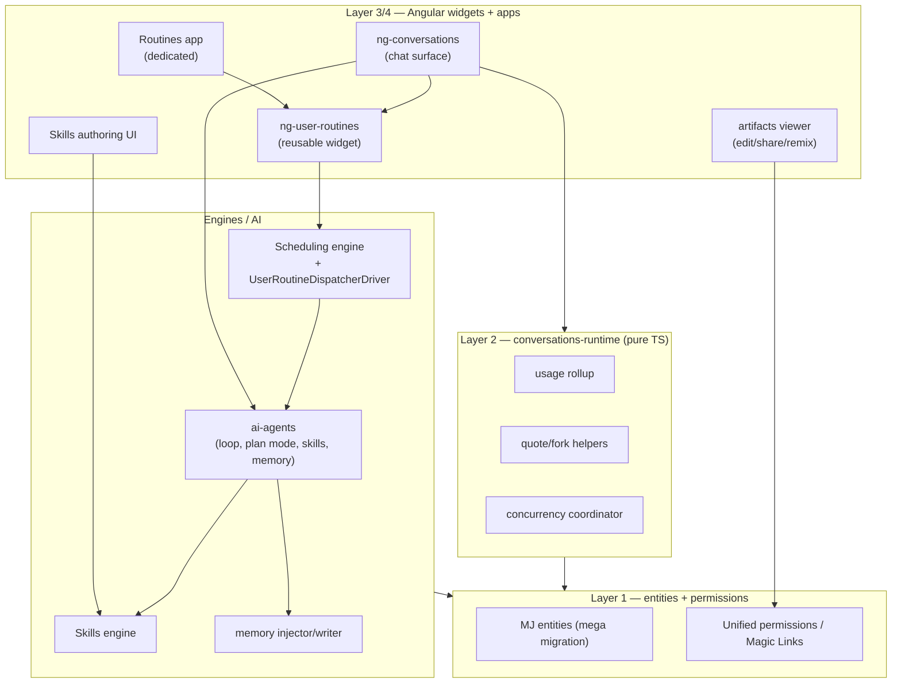
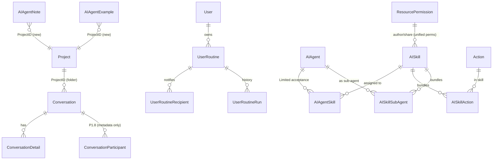
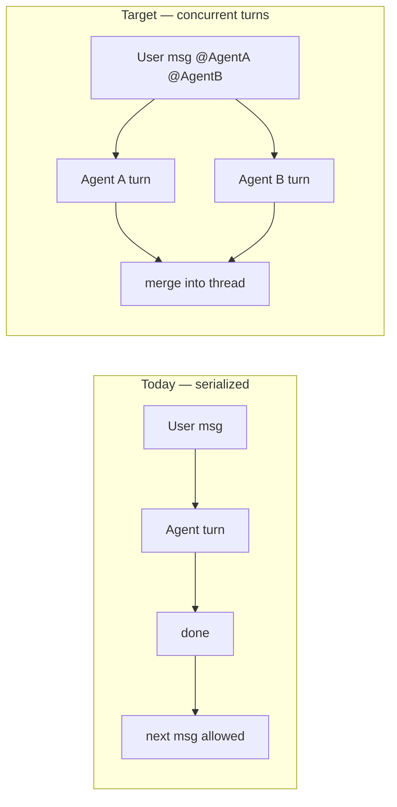
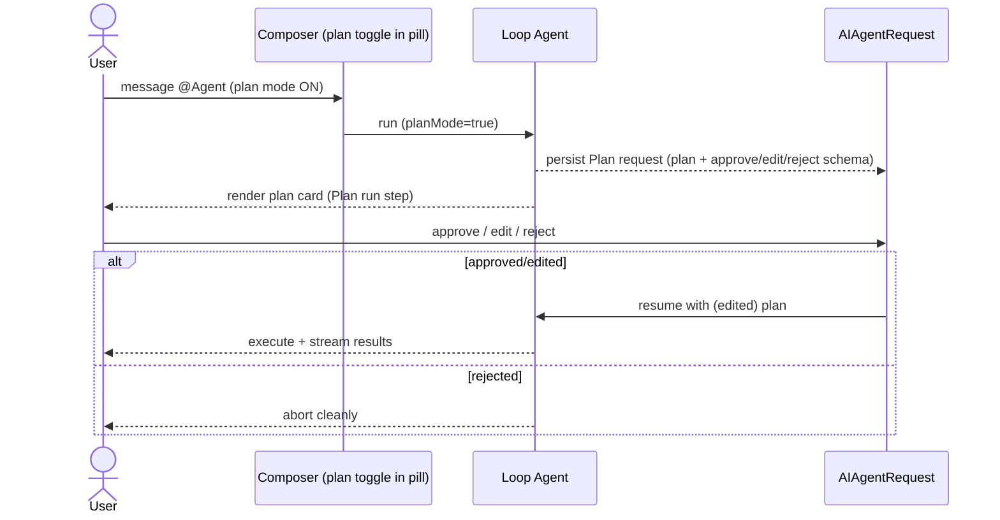
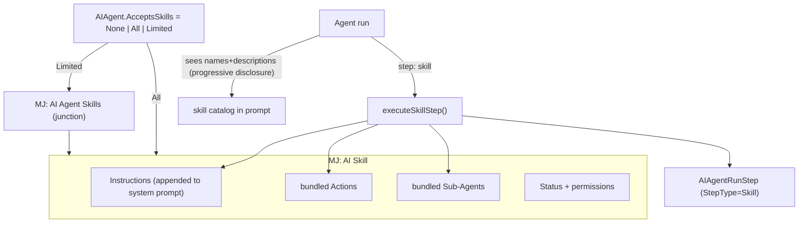
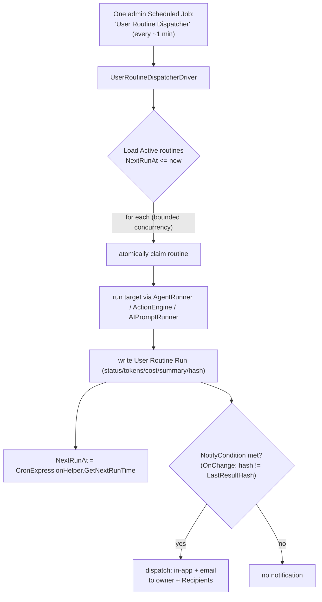
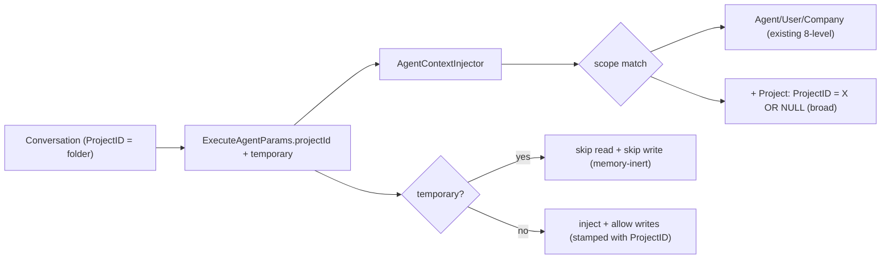
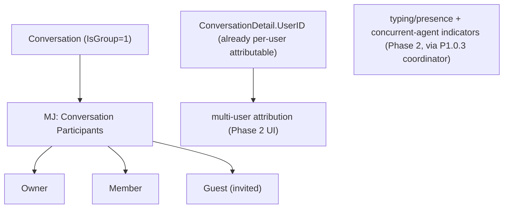
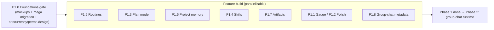

# Conversations Mega Phase 1 — Master Plan & Work Breakdown Structure

**Status:** Detailed build plan for review
**Scope:** `@memberjunction/ng-conversations`, `@memberjunction/conversations-runtime`, a new `@memberjunction/ng-user-routines`, `@memberjunction/ai-agents`, `MJCoreEntities`, `Scheduling`, migrations
**Companion docs:** `conversations-competitive-ux-study.md` (the why), `conversations-librechat-parity-proposal.md` (first pass)
**Audience:** Future implementing agents. Every task is written to be executed step-by-step.

---

## 0. How to use this document

- **Mega Phase 1** is one release-sized effort. It begins with a **Foundations gate (P1.0)** — UX mockups reviewed by the user **and** the complete DB design as **one mega migration** — before any feature code. Feature sub-phases **P1.1 … P1.8** then build on that locked schema.
- **Group-chat runtime code is deferred to Phase 2.** P1.8 lands only its metadata (in the mega migration) + UX mockups so Phase 2 is code-only.
- Every task: **Deliverable · Files/Entities · Steps · Acceptance · Tests · Risk**. Task IDs (`P1.4.4`) are stable — reference them in commits/PRs.

### 0.1 Two hard gates before feature work

1. **UX Mockup Review (P1.0.1)** — clickable/wireframe mockups for *every* feature, reviewed and signed off by the user. **No feature UI is built until its mockup is approved.**
2. **DB Design → One Mega Migration (P1.0.2)** — all new entities + altered columns across all sub-phases are designed together and shipped as a **single migration**, then CodeGen runs once. Feature code never invents schema ad hoc.

### 0.2 Standing conventions (apply to EVERY task)

- **Migrations:** highest `migrations/v*/` folder (currently `v5`). Naming `VYYYYMMDDHHMM__v5.x_[DESCRIPTION].sql`. Hardcoded UUIDs (never `NEWID()`), `${flyway:defaultSchema}`, consolidated `ALTER TABLE` per table, `sp_addextendedproperty` for every new column, NO `__mj_*` timestamps, NO FK indexes (CodeGen owns both). New entities use the **`MJ: ` name prefix**.
- **CodeGen runs after the mega migration** before any TypeScript references new fields. Never `.Get()/.Set()` new columns — use generated types.
- **Strong typing only** (no `any`); generated `BaseEntity` subclasses everywhere.
- **Runtime-first:** framework-agnostic logic lives in `conversations-runtime` or the relevant engine; Angular only renders.
- **UI:** additive & opt-in behind `@Input()` flags; expose chrome via the slot system; `--mj-chat-*`/semantic tokens only (`npm run check:ui`); MJ UI components + `mjButton`; modern `@if/@for`; `inject()`.
- **Preferences** via `UserInfoEngine` (never `localStorage`). **Reactivity** via `BaseEngine` + `ObserveProperty`.
- **Permissions** roll up into the **unified permissioning architecture** (`plans/unified-permissions-architecture.md`, `MJ: Resource Permissions` / Access Control Rules) — no bespoke per-feature permission tables unless unavoidable.
- **Tests:** Vitest for new runtime/engine logic; update affected package tests; report pass/fail. **Server code** passes `contextUser` everywhere.

### 0.3 Decision log

| # | Decision | Status |
|---|---|---|
| D1 | Folders == `MJ: Projects` (confirmed in code). Project-scoped memory keys off `Conversation.ProjectID`. | Locked |
| D2 | Routines = single dispatcher job + dedicated entity (NOT per-routine scheduled jobs). | Locked |
| D3 | Skill instructions **appended** to agent system prompt; Skills do NOT use `AIAgentPrompt`. | Locked |
| D4 | New `AIAgentRunStep` StepType values: `Skill`, `Plan`. | Locked |
| D5 | Plan mode default **OFF**; per-agent `SupportsPlanMode` capability + **per-request** runtime toggle in the chat UX (the agent "pill" / composer). | Locked |
| D6 | Project memory inheritance = **broad** (project notes + global); `projectId` fixed per conversation. | Locked |
| D7 | Incognito = `Conversation.IsTemporary`; persisted-but-hidden; skip memory read+write. | Locked |
| D8 | Group chat: Phase 1 = metadata + mockups; Phase 2 = runtime code. | Locked |
| D9 | Routines: **dedicated app** + reusable **`ng-user-routines`** widget also embeddable as a section in ng-conversations. | Locked |
| D10 | Skill **authoring + sharing** governed via unified permissions: users may create skills **for themselves by default**; **sharing requires elevated permission**. | Locked |
| D11 | Public artifact share links use the **Magic Links** mechanism (`guides/MAGIC_LINK_GUIDE.md`), not bespoke no-auth links. | Locked |
| D12 | **Concurrency:** today a conversation serializes to one in-flight agent turn. Group chat (and optionally plan mode) must allow **multiple agents working/planning concurrently even with a single human**. Designed in P1.0.3. | Locked |
| D13 | Entity name for routines: **`MJ: User Routines`** vs **`MJ: User Chat Routines`** — see debate in P1.5. | ⚠️ confirm |

---

## 1. System map — where each feature lands

---

## P1.0 — Foundations gate (UX mockups + mega migration + cross-cutting design)

### P1.0.1 — UX Mockups (USER-REVIEWED GATE) 🚦

**Deliverable:** Clickable or static-HTML/markdown mockups for **every** feature, in `plans/mockups/conversations-phase1/`, reviewed and approved by the user **before** the corresponding feature UI is built.

| Mockup | Covers |
|---|---|
| `context-gauge.*` | Header gauge, tooltip breakdown, on/off |
| `plan-mode.*` | Per-request plan toggle in the agent **pill**/composer; plan-approval card (approve/edit/reject) |
| `skills.*` | Skill authoring form; agent `AcceptsSkills` control; in-run skill activation indicator |
| `routines.*` | Routines app (list/create/edit/history); friendly cron builder; notification config; "turn this into a routine" entry in chat |
| `memory.*` | Project-scoped memory panel; "Temporary chat" toggle |
| `artifacts.*` | Inline edit; share (magic link) dialog; remix flow |
| `polish.*` | Quote/multi-quote; shortcuts cheat-sheet; long-thread TOC; fork |
| `group-chat.*` | Participant roster; invite flow; multi-user attribution; typing/presence; concurrent-agent indicators |

**Acceptance:** User signs off each mockup. **Gate:** feature UI tasks below are blocked until their mockup is approved.
**Risk:** Low (design only) — but this is the single most important early step for UX quality.

### P1.0.2 — DB Design → ONE Mega Migration

**Deliverable:** A single migration in `migrations/v5/` creating all new entities and altering existing tables for the whole phase, followed by one CodeGen run. Reference data seeded via `metadata/` files (not SQL inserts).

#### Master ERD (new = bold concept; altered columns noted)

#### New entities

| Entity | Key fields |
|---|---|
| **`MJ: User Routines`** (name pending D13) | `ID`, `UserID` (owner), `EnvironmentID`, `Name`, `Description`, `Status` ('Active'/'Paused'/'Disabled'), `RoutineType` ('Scheduled'/'Monitoring'), `TargetType` ('Agent'/'Action'/'Prompt'), `TargetID`, `InitialMessage` NVARCHAR(MAX), `StartingPayload` NVARCHAR(MAX) JSON, `CronExpression`, `Timezone`, `NextRunAt`, `LastRunAt`, `LastRunStatus`, `LastResultHash`, `NotifyCondition` ('Always'/'OnSuccess'/'OnFailure'/'OnChange'), `NotifyViaInApp` BIT, `NotifyViaEmail` BIT |
| **`MJ: User Routine Recipients`** | `ID`, `RoutineID`, `UserID?`, `Email?`, `Channel` ('InApp'/'Email') |
| **`MJ: User Routine Runs`** | `ID`, `RoutineID`, `StartedAt`, `CompletedAt`, `Status`, `AgentRunID?`, `TokensUsed?`, `Cost?`, `ResultSummary` NVARCHAR(MAX), `ResultHash`, `NotificationSent` BIT, `ErrorMessage?` |
| **`MJ: AI Skills`** | `ID`, `Name`, `Description`, `Instructions` NVARCHAR(MAX), `Status` ('Active'/'Pending'/'Deprecated'), `Category`, `CreatedByUserID` |
| **`MJ: AI Skill Actions`** | `ID`, `SkillID`, `ActionID`, `MinExecutionsPerRun?`, `MaxExecutionsPerRun?` |
| **`MJ: AI Skill Sub Agents`** | `ID`, `SkillID`, `SubAgentID` (→ AIAgent) |
| **`MJ: AI Agent Skills`** | `ID`, `AgentID`, `SkillID`, `Status` ('Active'/'Pending'/'Revoked') — for `AcceptsSkills='Limited'` |
| **`MJ: Conversation Participants`** (P1.8 — metadata only) | `ID`, `ConversationID`, `UserID`, `Role` ('Owner'/'Member'/'Guest'), `Status` ('Invited'/'Active'/'Removed'), `InvitedByUserID`, `InvitedAt`, `JoinedAt`, `NotificationPreference` |

#### Altered tables (single consolidated `ALTER` each)

| Table | Add |
|---|---|
| `AIAgent` | `SupportsPlanMode BIT NOT NULL DEFAULT 0`, `AcceptsSkills NVARCHAR(20) NOT NULL DEFAULT 'None'` |
| `AIAgentRunStep` | extend `StepType` allowed values with `Plan` **and** `Skill` (one constraint edit) |
| `AIAgentNote` | `ProjectID UNIQUEIDENTIFIER NULL` (FK→`MJ: Projects`) |
| `AIAgentExample` | `ProjectID UNIQUEIDENTIFIER NULL` (FK→`MJ: Projects`) |
| `Conversation` | `IsTemporary BIT NOT NULL DEFAULT 0`, `IsGroup BIT NOT NULL DEFAULT 0` |

#### Permissions (unified, not bespoke)
- **Skills** authoring/sharing → register a Skills resource type in the **unified permissioning** model (`MJ: Resource Permissions`). Default: a user can create skills scoped to self; **sharing** requires an elevated permission/role (D10). No new permission table unless the unified model can't express it.
- **Artifacts public link** → Magic Links (D11), see P1.7.

**Acceptance:** one migration file; CodeGen green; all entities generate with strong types; reference data via metadata.
**Risk:** Med — large migration; follow consolidation + extended-property rules precisely.

### P1.0.3 — Concurrency model design (parallel agent turns) — D12

**Problem:** Today a conversation serializes — once a user sends a message, additional sends to other agents are blocked until the turn completes. Group chat and (optionally) plan mode need **multiple agents working/planning at once, even with a single human**.

**Deliverable:** A design (in this doc + a short ADR) for a **concurrency coordinator** in `conversations-runtime` that:
- tracks N in-flight agent turns per conversation (keyed by agent run id),
- allows the composer to dispatch to multiple agents without waiting,
- renders concurrent in-flight indicators (multiple "AgentX is working/planning…" rows),
- defines ordering/merge semantics for interleaved streamed responses,
- defines limits (max concurrent turns) + cancellation.

This unblocks **group chat** (P1.8/Phase 2) and is **opt-in for plan mode** (let multiple agents plan simultaneously). **Risk:** Med-High — touches streaming + UI assumptions; design now, implement the minimal slice plan mode needs in P1.3 and the full slice in Phase 2.

### P1.0.4 — Shared notification + cron-picker primitives
- Finish/standardize the **notification delivery path** (in-app rows + `CommunicationEngine` email) used by Routines (P1.5), reusable by group chat (P2) and memory alerts later.
- Build a reusable **friendly cron-picker** component (daily/weekly/custom + timezone).

---

## P1.1 — Context & Cost Gauge

**Goal:** Opt-in per-conversation indicator: context-window %, tokens, running cost.

| Task | Detail |
|---|---|
| **P1.1.1** Runtime rollup | Pure `computeConversationUsage(details, agentRuns)` in runtime → `{inputTokens, outputTokens, cost, contextLimit?, pctUsed?}` from peripheral `agentRunsByDetailId`; context limit from active agent's resolved model via `AIEngineBase`. Unit-tested; degrades to tokens+cost when limit unknown. |
| **P1.1.2** Gauge component | `mj-conversation-context-gauge` (standalone), `--mj-chat-*` tokens, header slot. |
| **P1.1.3** Wiring + pref | `@Input() ShowContextGauge=false`; persist via `UserInfoEngine` key `mj.conversations.contextGauge.v1`. |
| **Tests** | Vitest rollup; component smoke. **Risk:** Low. |

---

## P1.2 — UX polish (quote, shortcuts, TOC, fork)

| Task | Detail |
|---|---|
| **P1.2.1** Quote / multi-quote | Selection directive → floating "Quote" → blockquote into composer w/ back-ref `ConversationDetailID`; multi-quote accumulator in runtime state. |
| **P1.2.2** Keyboard registry | `ConversationKeyboardService` (host-focus-scoped); `?` → `mj-keyboard-shortcuts-overlay`; fixed v1 bindings. **Risk:** Med (scope carefully). |
| **P1.2.3** Long-thread TOC | Auto section list for long threads; jump-to. |
| **P1.2.4** Fork | "Branch from here" → `forkConversation(detailId)` clones up to that point into a new conversation (inherits `ProjectID`). **Risk:** Med (clone + artifact refs). |
| **Tests** | quote accumulator + fork clone unit-tested. |

---

## P1.3 — Plan Mode

**Goal:** Any Loop agent can return a plan for approval before executing — gated by `SupportsPlanMode` (default off) + a **per-request toggle in the chat UX** (the agent pill / composer). Reuses `AIAgentRequest`. Optionally lets multiple agents plan concurrently (P1.0.3).

| Task | Detail |
|---|---|
| **P1.3.1** (schema in P1.0.2) | `AIAgent.SupportsPlanMode`; `Plan` run-step value. |
| **P1.3.2** Loop prompt | Conditional "Plan Mode" block in core Loop system prompt; injected only when `SupportsPlanMode && runtime planMode`. No change for other agents. |
| **P1.3.3** Loop handling | `LoopAgentType.DetermineNextStep` recognizes `plan` → `Plan` next-step; `executePlanStep()` persists `AIAgentRequest` (RequestType Plan-Approval, ResponseSchema approve/edit/reject), records `AIAgentRunStep` (Plan), suspends; resume injects (edited) plan. Reuse Chat suspend/resume plumbing. |
| **P1.3.4** Runtime toggle | `ExecuteAgentParams.planMode?` threaded from conversation runner; **per-request** (set on the agent pill/composer per send), independent of agent default. |
| **P1.3.5** UI | Plan toggle in the agent **pill**/composer (only when agent `SupportsPlanMode`); editable plan-approval card via the response-form path. |
| **P1.3.6** (opt) Concurrent planning | Allow >1 agent to plan at once via P1.0.3 coordinator (minimal slice). |
| **Tests** | plan step suspend+resume; approval injects edited plan. **Risk:** Med. |

---

## P1.4 — Skills (capability bundles)

**Goal:** Reusable, governed bundles of (instructions + optional Actions + optional sub-agents), attachable to 1+ agents, **appended** to system prompt on activation; new `Skill` run-step; unified permissions for authoring/sharing.

| Task | Detail |
|---|---|
| **P1.4.1** (schema in P1.0.2) | Skills + 3 junctions; `AIAgent.AcceptsSkills`; `Skill` run-step; Skills resource type in unified permissions. |
| **P1.4.2** Skills engine | `BaseEngine` subclass caching Active skills + agent-skill map (reactive); resolves available skills per agent (All vs Limited). |
| **P1.4.3** Prompt exposure | Inject **catalog (name+description only)** for accepted skills in `gatherPromptTemplateData()` — progressive disclosure. |
| **P1.4.4** Activation step | `step:'skill'` → `executeSkillStep()`: validate acceptance; **append** `Instructions` to working system prompt; add skill Actions+sub-agents to the run's tool surface; honor min/max executions; record `AIAgentRunStep` (Skill). Not a nested agent run. **Risk:** Med (mid-run tool-surface mutation). |
| **P1.4.5** Governance | Enforce `AcceptsSkills` + junction `Status` + `Skill.Status`; **authoring/sharing via unified permissions** (self-create default; share = elevated). |
| **P1.4.6** Authoring UI | Skill create/edit (instructions + pick Actions + pick sub-agents + status); agent form `AcceptsSkills` control + Limited picker; share dialog (permission-gated). |
| **P1.4.7** (stretch) `SKILL.md` interop | Import/export to the open `SKILL.md` standard for portability. Defer if time-boxed. |
| **Tests** | engine resolution; activation appends + enables tools; governance rejects non-accepted; permission gates sharing. |

---

## P1.5 — User Routines (user-controlled scheduled prompts)

**Goal:** Users author prompts/agent-runs that run on a schedule they control, with per-routine notifications — via a **single dispatcher job** (D2). Dedicated **Routines app** + reusable **`ng-user-routines`** widget also embeddable in ng-conversations (D9).

### Entity-name debate (D13)
- **`MJ: User Routines`** — general; targets can be Agent/Action/Prompt and a dedicated app exists beyond chat. Future-proof. **(recommended)**
- **`MJ: User Chat Routines`** — signals chat origin; narrower if routines later schedule non-chat work.
- *Recommendation:* `MJ: User Routines` (entity) with user-facing label "Routines" (or "Chat Routines" inside ng-conversations). Confirm before P1.0.2 finalizes the migration.

### Dispatcher flow

| Task | Detail |
|---|---|
| **P1.5.1** (schema in P1.0.2) | `MJ: User Routines` + Recipients + Runs; row-level owner access. |
| **P1.5.2** Dispatcher | Seed one admin job (`metadata/scheduled-jobs/`); new `UserRoutineDispatcherDriver` in `packages/Scheduling/engine/src/drivers/`. Logic per the flow above; bounded concurrency; per-routine isolation; heartbeat the dispatcher; OnChange via `ResultHash`. **Risk:** Med (long routines within lease — v1 bounds concurrency, note async-queue future). |
| **P1.5.3** `ng-user-routines` widget | New reusable Angular package: list (owner-filtered), create/edit (target picker + friendly cron-picker from P1.0.4 + notification config: condition/channels/recipients), run-now, history. |
| **P1.5.4** Routines app | Dedicated Explorer dashboard/app hosting `ng-user-routines` (follows dashboard guide + chrome + `NotifyLoadComplete`). |
| **P1.5.5** Conversation entry | "Turn this into a routine" from a message/prompt in ng-conversations → prefilled create (TargetType=Agent + InitialMessage). Embeds the same `ng-user-routines` create surface. |
| **P1.5.6** Notifications | Use the shared delivery path (P1.0.4): in-app rows + `CommunicationEngine` email per condition/recipients. |
| **Tests** | cron due-eval; OnChange hash; dispatcher isolation (one throws, others run); notification firing per condition. |

---

## P1.6 — Project-scoped Memory + Incognito

**Goal:** Memory scoped to a conversation's project (folder), plus a temporary/incognito mode (D1/D6/D7). Folders==Projects, so it keys off `Conversation.ProjectID`.

| Task | Detail |
|---|---|
| **P1.6.1** (schema in P1.0.2) | `ProjectID` on `AIAgentNote`/`AIAgentExample`; `Conversation.IsTemporary`. |
| **P1.6.2** Scope lattice | `agent-context-injector.ts`: add `projectId?` to params; extend `filterNotesByScoping()` + `buildNotesScopingFilter()` + vector pre-filter with **broad** Project dimension. Keep SQL + in-memory paths in sync. **Risk:** Med. |
| **P1.6.3** Write scope | `MemoryWriteManager`: `projectId` in context/scope; `clampScope()` carries it; `persistNewNote()` stamps `ProjectID`. |
| **P1.6.4** Thread projectId | `BaseAgent.initializeAgentRun()` resolves `Conversation.ProjectID` → params → injector/writer; `memory-manager-agent.ts` carries `ProjectID` on consolidated notes; never merge across projects. |
| **P1.6.5** Incognito | `ExecuteAgentParams.temporary?`; honor `Conversation.IsTemporary` — skip inject + skip writes; "Temporary chat" toggle; hidden from list. |
| **P1.6.6** (opt) Memory panel | User-visible memory panel (study Tier 2.1) scoped by project filter. |
| **Tests** | project note injects only in matching project + global; temporary run memory-inert; consolidation respects project cohort. |

---

## P1.7 — Artifact edit + share (Magic Links) + remix

**Goal:** Close the Canvas gap on our terms — direct edit for text/code artifacts + **magic-link public sharing** + remix. Builds on the existing artifact + React-runtime stack.

| Task | Detail |
|---|---|
| **P1.7.1** Editable viewer | Text/code/markdown artifact types become editable; user edit → **new `MJ: Artifact Versions` row** (preserve immutable-version model); agent stays a collaborator. **Risk:** Med (user-edit vs agent-regenerate lineage). |
| **P1.7.2** Magic-link share | Public artifact links via the **Magic Links** mechanism (`guides/MAGIC_LINK_GUIDE.md`): an app-scoped, passwordless, restricted-role session that grants read to the shared artifact. Reuse the magic-link issuance + restricted-role/entity-permission recipe; no bespoke no-auth path. **Risk:** Med (scope the restricted role to artifact-read only). |
| **P1.7.3** Remix | "Remix" clones artifact + latest version into a new user-owned artifact opened in a new conversation; original untouched. |
| **P1.7.4** (spike) Artifacts-as-apps | Evaluate a component→agent `callAgent()` RPC. Spike + writeup, no commit this phase. |
| **Tests** | edit creates new version; magic-link grants read-only to intended artifact; remix clones without mutating source. |

---

## P1.8 — Group Chat: metadata + UX mockups (Phase 2 prep)

**Goal:** Land everything a code-only Phase 2 needs. **No runtime behavior changes this phase.** Builds on the concurrency design (P1.0.3) since group chat is the primary driver of concurrent agent turns.

| Task | Detail |
|---|---|
| **P1.8.1** (schema in P1.0.2) | `MJ: Conversation Participants`; `Conversation.IsGroup`. Generated, not wired. |
| **P1.8.2** Backfill semantics | Document: existing single-owner conversations → owner is sole participant (lazy or backfill). No runtime enforcement yet. |
| **P1.8.3** UX mockups | (part of P1.0.1) roster, invite/accept/remove, multi-user attribution, typing/presence, **concurrent-agent** indicators. |
| **P1.8.4** Phase 2 spec | Code-only plan: participant engine; streaming/PubSub broadcast on `conversation:{id}` (message + typing + presence); the **concurrency coordinator** (P1.0.3) for parallel agent turns; relax owner-only checks → participant-with-permission; members modal wired; invites. (~3–4 weeks per the group-chat study.) |
| **Tests** | entity generation smoke only. |

---

## 2. Sequencing (one phase, all sub-phases)

- **P1.0 is the gate** — nothing else starts until mockups are approved and the mega migration + CodeGen land.
- Recommended leverage order within G1: **Routines + Plan mode** first (highest value, mostly existing infra), then **Project memory + Skills**, then **Artifacts + polish**; **group-chat metadata** any time (schema is in the mega migration).

---

## 3. Cross-sub-phase shared work (do once, in P1.0)

| Item | Where |
|---|---|
| `AIAgentRunStep.StepType` extension (`Plan` + `Skill`) | P1.0.2 (single constraint edit) |
| `ExecuteAgentParams` new fields (`planMode`, `projectId`, `temporary`) | P1.0.2 design / threaded in P1.3/P1.6 |
| Concurrency coordinator (parallel agent turns) | P1.0.3 (design) → P1.3 minimal slice → P2 full |
| Notification delivery path + cron-picker | P1.0.4 (shared by Routines now, group chat later) |
| Unified-permissions resource types (Skills) + Magic-link share recipe (Artifacts) | P1.0.2 / P1.7 |

---

## 4. Definition of Done (Mega Phase 1)

- **P1.0 gate passed:** all mockups approved; mega migration applied; CodeGen green; no `.Get()/.Set()` on new fields.
- All sub-phase acceptance criteria met; Vitest green for touched packages; `npm run check:ui` clean.
- Every new surface opt-in/off-by-default; **no behavior change** for existing agents/conversations (Plan mode off, Skills `None`, no routines, memory project-scope additive, temporary off, IsGroup off).
- Concurrency coordinator designed; minimal slice shipped where plan mode needs it; full slice specced for Phase 2.
- Group-chat schema present + Phase 2 spec written; **no group-chat runtime shipped.**
- Docs: update `CONVERSATIONS_UX_STACK_GUIDE.md` + package READMEs per shipped feature.

## 5. Remaining sign-off items

- **D13** — `MJ: User Routines` (recommended) vs `MJ: User Chat Routines`.
- **D10 detail** — exact elevated permission/role for skill **sharing** (and whether self-authoring is truly open by default).
- **Concurrency scope** — confirm plan mode gets concurrent planning in Phase 1, or defer all concurrency to Phase 2 except the design.
