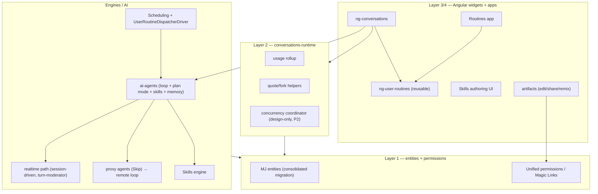
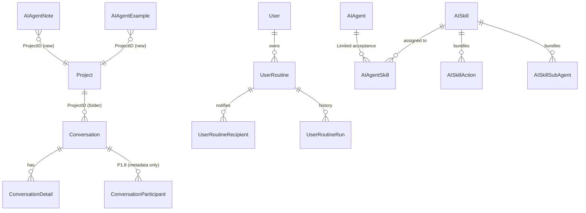
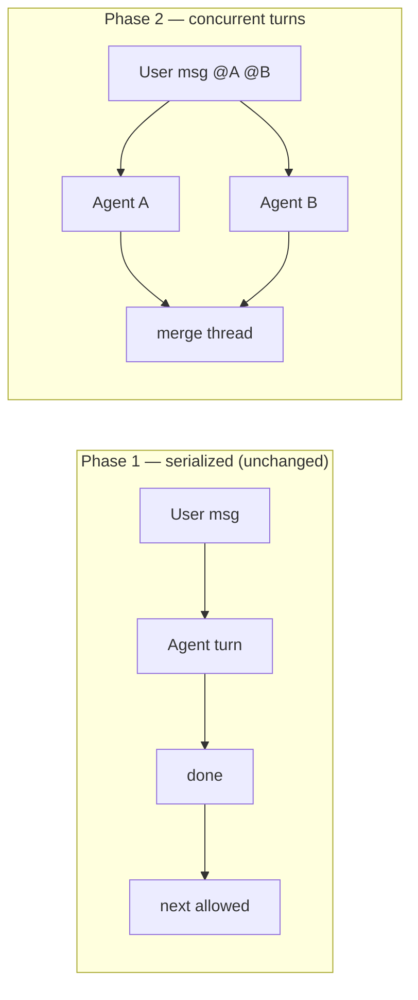
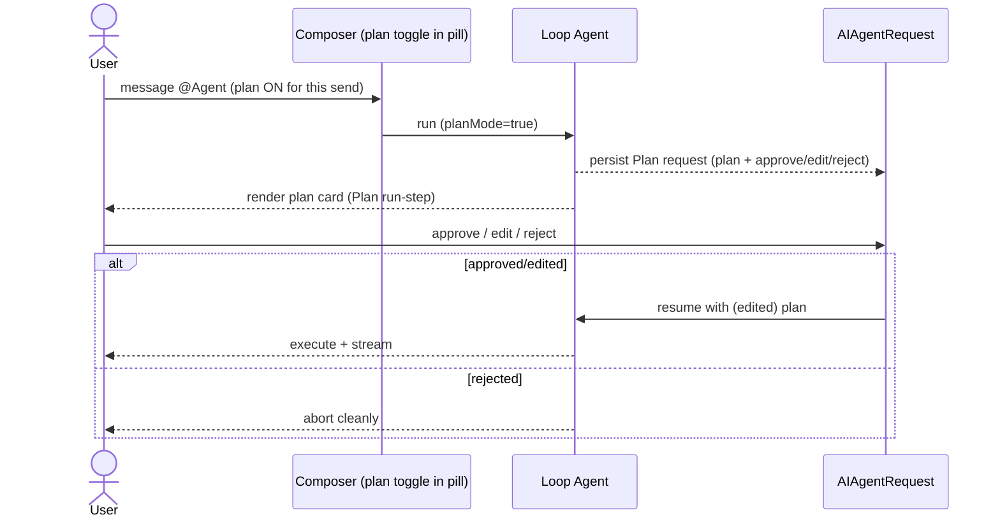
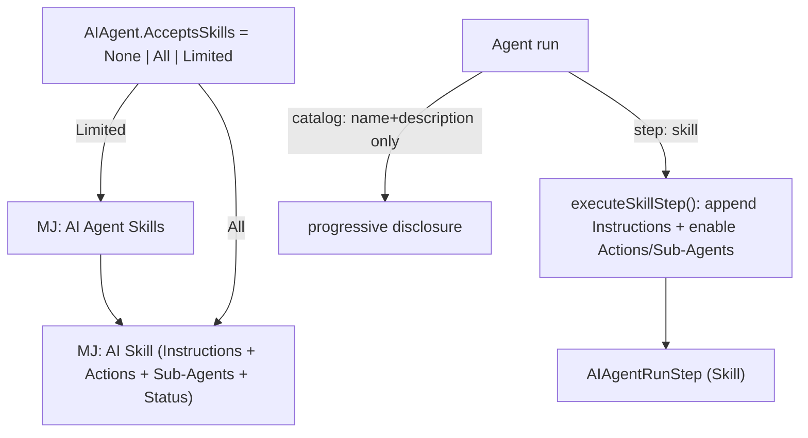
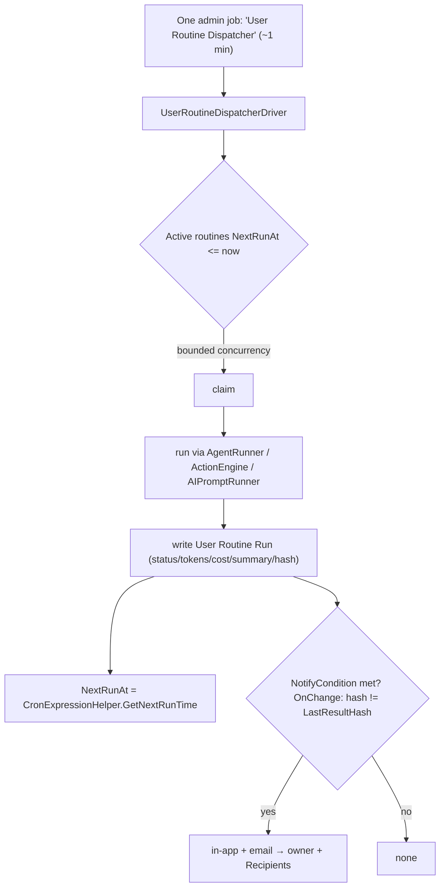
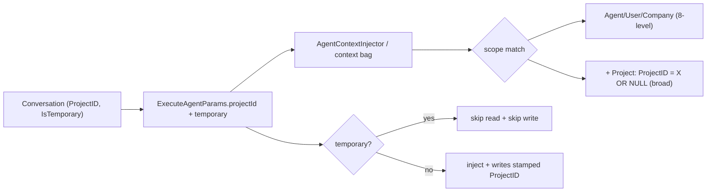
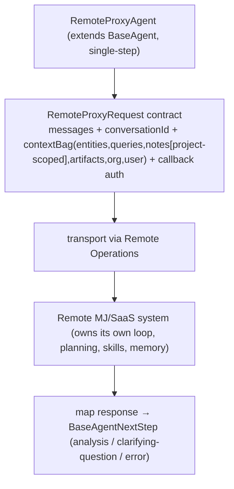
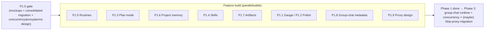

# Conversations Phase 1 — Plan & Work Breakdown Structure

> **This is the single source of truth for Phase 1.** It absorbs the earlier competitive
> study and the first-pass LibreChat proposal (both removed); their key conclusions are
> summarized in §0a below.

**Status:** Finalized build plan for review
**Scope:** `@memberjunction/ng-conversations`, `@memberjunction/conversations-runtime`, new `@memberjunction/ng-user-routines`, `@memberjunction/ai-agents`, `MJCoreEntities`, `Scheduling`, migrations
**Mockups:** `index.html` (browse) → `mockups/` (one file per area, three options each)
**Audience:** Future implementing agents. Every task is executable step-by-step.

---

## 0a. Background & competitive context (why this work)

This plan began as a comparison against one tool (LibreChat) and grew, after studying the
broader field, into a roadmap for MemberJunction's conversations platform. We inventoried
the self-hostable OSS field (Open WebUI, LibreChat, Lobe Chat, Big-AGI, AnythingLLM,
Cherry Studio, Jan, Chatbox, Hugging Face Chat UI, Msty) and the three flagship clients
(ChatGPT, Claude, Gemini), then scored MJ against the recurring "world-class" UX patterns.

**Where MJ already leads (defend & amplify):**
- **Agent-native, not model-native** — users talk to *agents* that resolve across many
  providers via the MJ AI framework; provider breadth is an agent-layer concern.
- **Grounding in real business data** — entity/record mentions and actions on governed
  data; unique in the field.
- **Realtime/voice depth** — voice co-agents, whiteboard + remote-browser channels,
  session review, a turn-moderator that already handles multi-agent concurrency.
- **Artifacts as first-class versioned/permissioned entities** with a live React runtime.
- **Embeddable, framework-agnostic runtime** (React/Vue/Node consumable) + enterprise posture.

**Where the field is ahead — the gaps this plan closes:**
editable-plan-before-run, user-visible & project-scoped memory + incognito, user-controlled
scheduled routines, live artifact edit/share/remix, in-chat skills, group chat, and a band
of UX polish (context/cost gauge, quote, keyboard shortcuts, long-thread TOC, fork).

**Deliberate non-goals (consistent with the layering):** no raw model picker, no multi-model
"merge", no provider-breadth-in-chat. Code-interpreter / real-file creation is owned by the
**CodeSmith** agent track, not this plan.

The sub-phases below map each gap to MJ's existing architecture (artifacts/React runtime,
scheduling engine, agent loop, memory scoping, conversation/realtime/proxy paths, unified
permissions), grounded in direct study of those subsystems.

---

## 0. How to use this document

- **Phase 1** is one release-sized effort. It begins with a **Foundations gate (P1.0)** — UX mockups reviewed by the user **and** the complete DB design as **one consolidated migration** — before any feature code. Feature sub-phases **P1.1 … P1.9** then build on that locked schema.
- **Group-chat runtime code and text-chat concurrency are deferred to Phase 2.** P1.8 lands only group-chat metadata + UX mockups; the concurrency coordinator is **design-only** in Phase 1.
- Every task: **Deliverable · Files/Entities · Steps · Acceptance · Tests · Risk**. Task IDs (`P1.4.4`) are stable — reference them in commits/PRs.

### 0.1 Two hard gates before feature work

1. **UX Mockup Review (P1.0.1)** — clickable/wireframe mockups for *every* feature, reviewed and signed off by the user. **No feature UI is built until its mockup is approved.**
2. **DB Design → One Consolidated Migration (P1.0.2)** — all new entities + altered columns designed together, shipped as a **single migration**, then CodeGen runs once. Feature code never invents schema ad hoc.

### 0.2 Standing conventions (apply to EVERY task)

- **Migrations:** highest `migrations/v*/` (currently `v5`). Naming `VYYYYMMDDHHMM__v5.x_[DESCRIPTION].sql`. Hardcoded UUIDs, `${flyway:defaultSchema}`, consolidated `ALTER TABLE` per table, `sp_addextendedproperty` per new column, NO `__mj_*` timestamps, NO FK indexes (CodeGen owns both). New entities use the **`MJ: ` prefix**.
- **CodeGen runs after the consolidated migration** before any TS references new fields. Never `.Get()/.Set()` new columns.
- **Strong typing only** (no `any`); generated `BaseEntity` subclasses everywhere.
- **Runtime-first:** framework-agnostic logic in `conversations-runtime`/engines; Angular only renders.
- **UI:** additive & opt-in behind `@Input()` flags; slot system; `--mj-chat-*`/semantic tokens only (`npm run check:ui`); MJ UI components + `mjButton`; modern `@if/@for`; `inject()`.
- **Preferences** via `UserInfoEngine` (never `localStorage`). **Reactivity** via `BaseEngine` + `ObserveProperty`.
- **Permissions** roll up into the **unified permissioning architecture** (`plans/unified-permissions-architecture.md`, `MJ: Resource Permissions`).
- **Tests:** Vitest for new runtime/engine logic; update affected tests; report results. **Server code** passes `contextUser` everywhere.

### 0.3 Decision log

| # | Decision | Status |
|---|---|---|
| D1 | Folders == `MJ: Projects` (confirmed). Project-scoped memory keys off `Conversation.ProjectID`. | Locked |
| D2 | Routines = single dispatcher job + dedicated entity (NOT per-routine scheduled jobs). | Locked |
| D3 | Skill instructions **appended** to agent system prompt; Skills do NOT use `AIAgentPrompt`. | Locked |
| D4 | New `AIAgentRunStep` StepType values: `Skill`, `Plan`. | Locked |
| D5 | **Plan mode capability `SupportsPlanMode` defaults ON (opt-out)**; the **per-request toggle defaults OFF**. Injection only happens when the per-request toggle is on, so default behavior is unchanged → no regression. Realtime + Proxy agents opt the capability OFF (see D14/D15). | Locked (revised) |
| D6 | Project memory inheritance = **broad** (project notes + global); `projectId` fixed per conversation. | Locked |
| D7 | Incognito = `Conversation.IsTemporary`; persisted-but-hidden; skip memory read+write. | Locked |
| D8 | Group chat: Phase 1 = metadata + mockups; Phase 2 = runtime code. | Locked |
| D9 | Routines: **dedicated app** + reusable **`ng-user-routines`** widget, also embeddable in ng-conversations. | Locked |
| D10 | **Skill authoring** = Entity CRUD on `MJ: AI Skills` + an RLS "own skills" filter (`CreatedByUserID = current user`) → open to self by default. **Skill sharing** = `MJ: Resource Permissions` (ResourceType `AI Skills`, View/Edit/Owner) via the existing `ResourcePermissionProvider`, with the **share action gated by a dedicated "Can Share Skills" privilege**. No bespoke permission tables. | Locked |
| D11 | Public artifact sharing: the **link/session mechanism reuses Magic Links** (server mints a read-only, artifact-scoped RS256 link on publish), but **who may publish is gated by a dedicated lightweight privilege "Can Publish Artifacts Publicly"** — NOT the heavyweight magic-link *issuer* role (which creates external users + assigns roles, far higher risk). UI hides/disables publish when absent. | Locked (revised) |
| D12 | **Concurrency (parallel agent turns) → Phase 2.** Phase 1 ships the **design only** (P1.0.3); chat stays serialized. | Locked (revised) |
| D13 | Routines entity name = **`MJ: User Routines`** (generalizes beyond chat). | Locked |
| D14 | **Realtime agents** run a separate session-driven path: **plan mode is skipped** (HITL via the delegated target's `AwaitingFeedback`, narrated live); **skills append at session build**; **memory uses the shared builder**; **not valid routine targets**; concurrency already handled by the **turn-moderator**. | Locked (from realtime study) |
| D15 | **Proxy agents (Skip-style)** delegate their whole loop to the remote system: plan mode / skills / local memory injection are **OFF locally**; instead MJ passes a rich **context bag** (incl. project-scoped notes) for the remote to use. Betty is a `BaseLLM` used inside loop agents, so local features apply around it. | Locked (from proxy study) |
| D16 | Standardized proxy: **design in Phase 1, implement in Phase 2.** `BaseRemoteProxyAgent` + "Remote Proxy" agent type + a standard context contract; the **Skip API is the template** for how the remote side is invoked generically. | Locked |

---

## 1. System map

## 1b. Feature behavior by agent type (CRITICAL — drives implementation guards)

| Feature | Loop / Flow | Realtime (session-driven) | Proxy (Skip-style) |
|---|---|---|---|
| **Plan mode** | Capability ON by default; injected only when per-request toggle on | **Skipped** — would break live voice; HITL is the delegated target's `AwaitingFeedback`, narrated | **Delegated** to remote; local OFF |
| **Skills** | Activated in-loop (`Skill` run-step) | **Appended at session build** (static for the session) | **Delegated** to remote (optionally passed in context bag, future); local OFF |
| **Memory inject** | Per-iteration via `AgentMemoryContextBuilder` | **Once at session start** (same builder) | MJ **gathers notes (project-scoped) and passes them** in the context bag; local injector not used |
| **Routine target** | ✅ Yes | ❌ No (interactive/live) | ✅ Yes (single-step) |
| **Concurrency** | Phase 2 coordinator | **Already solved** via turn-moderator | N/A (single step) |

Implementation guards: gate plan-mode prompt injection behind `!isSessionDrivenAgentType() && !isProxyAgent`; gate local memory injection / skill catalog off for proxy agents; resolve skills at `buildRealtimeSessionParams()` for realtime.

---

## P1.0 — Foundations gate (mockups + consolidated migration + cross-cutting design)

### P1.0.1 — UX Mockups (USER-REVIEWED GATE) 🚦

**Deliverable:** mockups in `plans/conversations-phase1/mockups/` (browse via `plans/conversations-phase1/index.html`) for: context gauge; plan-mode pill toggle + plan-approval card; skills authoring + activation indicator; routines app (list/create/edit/history) + friendly cron builder + notification config + "turn into a routine" chat entry; project-scoped memory panel + temporary-chat toggle; artifact inline edit + magic-link share + remix; quote/shortcuts/TOC/fork; group-chat roster/invite/attribution/typing/concurrent-agent indicators; (P1.9) remote-proxy agent config. **Gate:** feature UI blocked until its mockup is approved. **Risk:** Low.

### P1.0.2 — DB Design → ONE Consolidated Migration

**New entities:** `MJ: User Routines`, `MJ: User Routine Recipients`, `MJ: User Routine Runs`, `MJ: AI Skills`, `MJ: AI Skill Actions`, `MJ: AI Skill Sub Agents`, `MJ: AI Agent Skills`, `MJ: Conversation Participants` (metadata only). Field lists per the prior revision (unchanged) — see §P1.5 / §P1.4 / §P1.8.

**Altered tables (consolidated ALTER each):**
| Table | Add |
|---|---|
| `AIAgent` | `SupportsPlanMode BIT NOT NULL DEFAULT 1` (opt-out; seed Realtime + Proxy agents to 0), `AcceptsSkills NVARCHAR(20) NOT NULL DEFAULT 'None'` |
| `AIAgentRunStep` | extend `StepType` with `Plan` **and** `Skill` (one constraint edit) |
| `AIAgentNote`, `AIAgentExample` | `ProjectID UNIQUEIDENTIFIER NULL` (FK→`MJ: Projects`) |
| `Conversation` | `IsTemporary BIT NOT NULL DEFAULT 0`, `IsGroup BIT NOT NULL DEFAULT 0` |

**Permissions (unified, seeded via metadata — no bespoke tables):** register an `AI Skills` **Resource Type**; Entity Permissions + an RLS "own skills" filter for `MJ: AI Skills`; a dedicated **"Can Share Skills"** privilege; a dedicated **"Can Publish Artifacts Publicly"** privilege. **Seed** `SupportsPlanMode=0` for existing Realtime + Proxy (Skip) agents.
**Acceptance:** one migration; CodeGen green; strong types generate. **Risk:** Med (size — follow rules exactly).

### P1.0.3 — Concurrency model (DESIGN ONLY in Phase 1) — D12

**Deliverable:** an ADR for a `conversations-runtime` concurrency coordinator (N in-flight turns/conversation, non-blocking dispatch, multi-"working…" indicators, interleaved-stream ordering, limits, cancellation). **Learn from realtime's `realtime-turn-moderator.ts`** which already serializes the *speaking floor* across multiple agents in a room. **No Phase 1 implementation.** **Risk:** design-only.

### P1.0.4 — Shared primitives
Standardize the **notification delivery path** (in-app + `CommunicationEngine` email) for Routines (reusable later), and a reusable **friendly cron-picker** component.

---

## P1.1 — Context & Cost Gauge
Opt-in per-conversation tokens/window-%/cost. **P1.1.1** runtime `computeConversationUsage()` (pure, tested) from peripheral agent-run data + model context limit via `AIEngineBase`. **P1.1.2** `mj-conversation-context-gauge` (header slot, tokens). **P1.1.3** `@Input() ShowContextGauge=false` + `UserInfoEngine` pref `mj.conversations.contextGauge.v1`. **Risk:** Low.

## P1.2 — UX polish
**P1.2.1** quote/multi-quote (selection→composer, back-ref + accumulator). **P1.2.2** `ConversationKeyboardService` + `?` cheat-sheet (host-focus-scoped). **P1.2.3** long-thread TOC. **P1.2.4** `forkConversation(detailId)` (clone to a point; inherits ProjectID). **Risk:** Med (scope/clone).

---

## P1.3 — Plan Mode

Capability **ON by default** (opt-out for Realtime/Proxy), **per-request toggle OFF by default** (set on the agent **pill**/composer). Reuses `AIAgentRequest`. **Single-agent in Phase 1** (concurrent planning deferred with concurrency to Phase 2).

| Task | Detail |
|---|---|
| **P1.3.1** (schema P1.0.2) | `AIAgent.SupportsPlanMode` (default 1; Realtime/Proxy seeded 0); `Plan` run-step. |
| **P1.3.2** Loop prompt | Conditional "Plan Mode" block in the core Loop system prompt; injected only when `SupportsPlanMode && per-request planMode && !isSessionDrivenAgentType() && !isProxyAgent`. |
| **P1.3.3** Loop handling | `LoopAgentType.DetermineNextStep` recognizes `plan` → `Plan` step; `executePlanStep()` persists `AIAgentRequest` (approve/edit/reject schema), records run-step, suspends; resume injects (edited) plan. Reuse Chat suspend/resume. |
| **P1.3.4** Runtime toggle | `ExecuteAgentParams.planMode?` threaded per-request from the conversation runner. |
| **P1.3.5** UI | Plan toggle in the agent **pill**/composer (shown only when agent `SupportsPlanMode`); editable plan-approval card via the response-form path. |
| **Tests** | suspend+resume; approval injects edited plan; realtime/proxy never inject plan prompt. **Risk:** Med. |

---

## P1.4 — Skills (capability bundles)

Bundles of (instructions + optional Actions + optional sub-agents) **appended** to the system prompt on activation; new `Skill` run-step; unified-permission governance.

| Task | Detail |
|---|---|
| **P1.4.1** (schema P1.0.2) | Skills + 3 junctions; `AcceptsSkills`; `Skill` run-step; Skills resource type in unified perms. |
| **P1.4.2** Skills engine | `BaseEngine` caching Active skills + agent-skill map (reactive); resolves available skills per agent. |
| **P1.4.3** Prompt exposure | Inject **catalog (name+description only)** for accepted skills in `gatherPromptTemplateData()`. **For Realtime:** resolve + append skill instructions at `buildRealtimeSessionParams()` (session-static). **For Proxy:** skip local skill catalog (delegated). |
| **P1.4.4** Activation | `step:'skill'` → `executeSkillStep()`: validate acceptance; append `Instructions`; add Actions+sub-agents to run tool-surface; honor min/max executions; record `Skill` run-step. Not a nested agent run. **Risk:** Med. |
| **P1.4.5** Governance | `AcceptsSkills` + junction `Status` + `Skill.Status`. **Authoring:** Entity CRUD on `MJ: AI Skills` + RLS "own skills" (open to self). **Sharing:** `MJ: Resource Permissions` (ResourceType `AI Skills`, View/Edit/Owner) via `ResourcePermissionProvider`, share action gated by the dedicated **"Can Share Skills"** privilege. |
| **P1.4.6** Authoring UI | Skill create/edit (instructions + pick Actions + sub-agents + status); agent form `AcceptsSkills` control + Limited picker; share dialog (permission-gated). |
| **P1.4.7** (stretch) | `SKILL.md` import/export for portability. |
| **Tests** | resolution (All/Limited); activation appends + enables tools; governance; realtime append; proxy skip. |

---

## P1.5 — User Routines (`MJ: User Routines`)

Dedicated **Routines app** + reusable **`ng-user-routines`** widget; single **dispatcher** job. **Routine targets exclude Realtime agents** (interactive); single-step **Proxy agents are valid targets**.

**Entities:** `MJ: User Routines` (UserID owner, Name, Description, Status, RoutineType Scheduled/Monitoring, TargetType Agent/Action/Prompt, TargetID, InitialMessage, StartingPayload, CronExpression, Timezone, NextRunAt, LastRunAt, LastRunStatus, LastResultHash, NotifyCondition Always/OnSuccess/OnFailure/OnChange, NotifyViaInApp, NotifyViaEmail); `MJ: User Routine Recipients` (RoutineID, UserID?/Email?, Channel); `MJ: User Routine Runs` (RoutineID, timing, Status, AgentRunID?, Tokens/Cost, ResultSummary, ResultHash, NotificationSent, ErrorMessage?). Row-level owner access.

| Task | Detail |
|---|---|
| **P1.5.1** (schema P1.0.2) | the three entities; owner RLS. |
| **P1.5.2** Dispatcher | seed one admin job; `UserRoutineDispatcherDriver`; bounded concurrency + per-routine isolation + heartbeat; OnChange via hash; **target picker excludes Realtime agent types**. **Risk:** Med (long routines within lease → v1 bounds concurrency). |
| **P1.5.3** `ng-user-routines` | new reusable package: list/create/edit (target picker + cron-picker + notification config) + run-now + history. |
| **P1.5.4** Routines app | dedicated Explorer dashboard hosting the widget (chrome + `NotifyLoadComplete`). |
| **P1.5.5** Conversation entry | "Turn this into a routine" → prefilled create (Agent + InitialMessage). |
| **P1.5.6** Notifications | shared path (P1.0.4): in-app + email per condition/recipients. |
| **Tests** | cron due-eval; OnChange hash; dispatcher isolation; notification firing; realtime excluded from picker. |

---

## P1.6 — Project-scoped Memory + Incognito

Keys off `Conversation.ProjectID` (folders==projects). Shared injector → **Realtime gets it free**; **Proxy agents** get project-scoped notes **in the context bag** (Skip already passes `notes`).

| Task | Detail |
|---|---|
| **P1.6.1** (schema P1.0.2) | `ProjectID` on `AIAgentNote`/`AIAgentExample`; `Conversation.IsTemporary`. |
| **P1.6.2** Scope lattice | extend `agent-context-injector.ts` (`projectId?` param; broad Project dimension in `filterNotesByScoping`/`buildNotesScopingFilter`/vector pre-filter). **Risk:** Med (keep SQL+in-memory in sync). |
| **P1.6.3** Write scope | `MemoryWriteManager`: `projectId` in context/scope; clamp + stamp on persist. |
| **P1.6.4** Thread projectId | `initializeAgentRun()` resolves `Conversation.ProjectID` → params → injector/writer/**proxy context bag**; Memory Manager carries `ProjectID`, never merges across projects. |
| **P1.6.5** Incognito | `ExecuteAgentParams.temporary?`; honor `Conversation.IsTemporary` (skip read+write); "Temporary chat" toggle; hidden from list. |
| **P1.6.6** (opt) Memory panel | user-visible memory panel scoped by project. |
| **Tests** | project note injects only in project + global; temporary memory-inert; cohort consolidation; Skip context bag carries project notes. |

---

## P1.7 — Artifact edit + share (Magic Links) + remix

| Task | Detail |
|---|---|
| **P1.7.1** Editable viewer | text/code/markdown artifacts editable; user edit → **new `MJ: Artifact Versions` row**; agent stays collaborator. **Risk:** Med. |
| **P1.7.2** Public share (Magic Links mechanism + dedicated privilege) | Link/session **mechanism reuses Magic Links** (`guides/MAGIC_LINK_GUIDE.md`): on publish, the **server** mints a read-only, single-artifact-scoped RS256 link (restricted role scoped to that artifact's read). **Who may publish** is gated by a **dedicated lightweight privilege "Can Publish Artifacts Publicly"** — NOT the magic-link issuer role. UI **hides/disables** publish when the user lacks it (no dead-end). **Risk:** Med (scope the restricted role to single-artifact read). |
| **P1.7.3** Remix | clone artifact + latest version into a new user-owned artifact in a new conversation; original untouched. |
| **P1.7.4** (spike) | component→agent `callAgent()` RPC (artifacts-as-apps). Writeup only. |
| **Tests** | edit→new version; magic-link read-only scope; privilege gate hides action; remix non-mutating. |

---

## P1.8 — Group Chat: metadata + UX mockups (Phase 2 prep)

**No runtime behavior this phase.** Primary driver of Phase 2 concurrency.

| Task | Detail |
|---|---|
| **P1.8.1** (schema P1.0.2) | `MJ: Conversation Participants` (ConversationID, UserID, Role Owner/Member/Guest, Status Invited/Active/Removed, InvitedByUserID, InvitedAt, JoinedAt, NotificationPreference); `Conversation.IsGroup`. Generated, not wired. |
| **P1.8.2** Backfill semantics | existing single-owner → owner sole participant (lazy/backfill). No enforcement yet. |
| **P1.8.3** UX mockups | (in P1.0.1) roster, invite/accept/remove, multi-user attribution, typing/presence, **concurrent-agent** indicators. |
| **P1.8.4** Phase 2 spec | participant engine; PubSub broadcast on `conversation:{id}` (message+typing+presence); the **concurrency coordinator** (P1.0.3) borrowing from the realtime turn-moderator; relax owner-only checks → participant-with-permission; members modal wired; invites. (~3–4 weeks.) |

---

## P1.9 — Standardized Agent Proxy (design Phase 1, build Phase 2)

**Problem:** Skip (`BaseAgent` subclass, single-step, rich context bag) and Betty (`BaseLLM`) are **bespoke**; no shared abstraction. As MJ↔MJ/SaaS proxying grows, we want a richer-than-MCP, MJ-aware standard.

| Task | Detail |
|---|---|
| **P1.9.1** Design/ADR | `BaseRemoteProxyAgent` + a "Remote Proxy" **agent type** (metadata) + standard `RemoteProxyRequest` context contract; transport on **Remote Operations** (`guides/REMOTE_OPERATIONS_GUIDE.md`) for unified auth/progress. Define the **context-bag** policy (what MJ sends: entities/queries/project-scoped notes/artifacts/org/user/callback auth). |
| **P1.9.2** Behavior policy | For proxy agents: plan mode / skills / local memory injection **OFF**; instead pass context for the remote to use (D15). Document that Betty stays a `BaseLLM` used inside loop agents (local features apply around it). |
| **P1.9.3** Reference migration (Phase 2) | Migrate **Skip** to `BaseRemoteProxyAgent` as the reference impl in **Phase 2**. Phase 1 ships design + base class + agent-type + contract only. The **Skip API contract is the template** for the generic remote-invocation shape future proxies (and remote MJ systems) implement. |
| **Tests** | proxy agent passes project-scoped notes in context bag; plan/skills not injected locally; response maps to next-step. **Risk:** Med-High (touches a shipping integration). |

---

## 2. Sequencing

- **P1.0 is the gate.** Recommended leverage order in G1: **Routines + Plan mode** first; then **Project memory + Skills**; then **Artifacts + polish**; **group-chat metadata** + **proxy design** any time.

---

## 3. Cross-sub-phase shared work (do once, in P1.0)

| Item | Where |
|---|---|
| `AIAgentRunStep.StepType` extension (`Plan` + `Skill`) | P1.0.2 (single constraint edit) |
| `ExecuteAgentParams` new fields (`planMode`, `projectId`, `temporary`) | P1.0.2 design → threaded in P1.3/P1.6 |
| Agent-type guards (`isSessionDrivenAgentType`, `isProxyAgent`) for plan/skills/memory | §1b — applied in P1.3/P1.4/P1.6 |
| Concurrency coordinator (design only) | P1.0.3 → Phase 2 |
| Notification path + cron-picker | P1.0.4 |
| Unified-permission resource types (Skills, public-artifact-share) + Magic-link recipe | P1.0.2 / P1.7 |

---

## 4. Definition of Done (Phase 1)

- **P1.0 gate passed:** mockups approved; consolidated migration applied; CodeGen green; no `.Get()/.Set()` on new fields; Realtime/Proxy agents seeded `SupportsPlanMode=0`.
- All sub-phase acceptance criteria met; Vitest green for touched packages; `npm run check:ui` clean.
- **No behavior change** for existing conversations/agents: plan-mode per-request toggle OFF by default; Skills `None`; no routines; memory project-scope additive; temporary OFF; IsGroup OFF; realtime/proxy correctly excluded from plan-mode injection.
- Concurrency coordinator designed (Phase 2); group-chat schema present + Phase 2 spec written; **no group-chat runtime shipped**.
- Proxy: standard design + base class delivered; Skip migration per D16 scope decision.
- Docs: update `CONVERSATIONS_UX_STACK_GUIDE.md` + package READMEs per shipped feature.

## 5. Sign-off status

All major decisions are now **locked** (see Decision Log §0.3): plan-mode default (D5), public-artifact-share via Magic Links + dedicated privilege (D11), skill permissions (D10), proxy design-Phase-1/build-Phase-2 (D16), concurrency deferred to Phase 2 (D12), routines naming (D13), realtime/proxy behavior (D14/D15).

Residual implementation-time choices (not blocking the plan; settle during P1.0):
- Exact names/placement of the **"Can Share Skills"** and **"Can Publish Artifacts Publicly"** privileges in the unified-permissions seed.
- Whether the public-artifact magic link is per-share (one link) or regenerable, and its TTL.

---

## 6. Phase 2 (deferred) — scope at a glance

Phase 2 is intentionally **not** detailed yet — it gets a full WBS once Phase 1 ships and
we've learned from it. Phase 1 deliberately lays the groundwork (schema in the consolidated
migration; designs in P1.0.3 / P1.8.4 / P1.9) so Phase 2 is **code-only**. The three
deferred workstreams:

| # | Workstream | What ships in Phase 2 | Groundwork already in Phase 1 |
|---|---|---|---|
| **P2.1** | **Group-chat runtime** | Participant engine; PubSub broadcast on a `conversation:{id}` topic (new messages + typing + presence); members modal wired to `MJ: Conversation Participants`; invite/accept/remove flow; relax owner-only action checks → participant-with-permission. | `MJ: Conversation Participants` + `Conversation.IsGroup` schema (P1.0.2); per-user message attribution already exists; UX mockups (P1.8.3). |
| **P2.2** | **Parallel-agent concurrency** | The concurrency coordinator in `conversations-runtime`: N in-flight agent turns per conversation, non-blocking dispatch, multi-"working…" indicators, interleaved-stream ordering, limits + cancellation. Lifts today's single-in-flight serialization for group chat (and optionally concurrent planning). | Coordinator **design/ADR** (P1.0.3), informed by the realtime turn-moderator which already serializes a multi-agent speaking floor. |
| **P2.3** | **Skip proxy migration** | Migrate **Skip** onto `BaseRemoteProxyAgent` as the reference implementation of the standardized proxy. | `BaseRemoteProxyAgent` + "Remote Proxy" agent type + context-bag contract (P1.9, design+base in Phase 1); Skip API is the template. |

**Sequencing:** P2.1 and P2.2 are coupled (group chat is the primary driver of concurrency)
and should ship together. P2.3 is independent and can land whenever capacity allows after
the Phase 1 proxy design is in.

Anything else that surfaces during Phase 1 (e.g., artifacts-as-apps from the P1.7.4 spike,
or a deeper memory-panel build) is a candidate for Phase 2 and will be slotted here when scoped.
