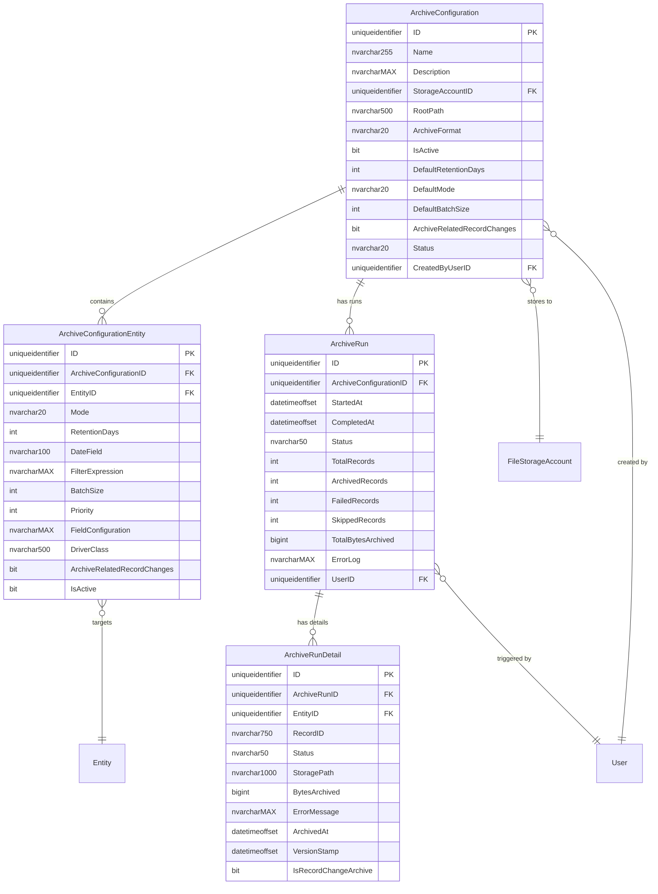
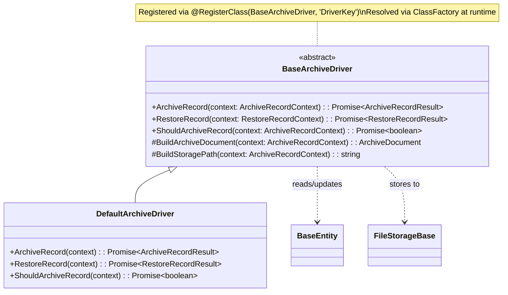
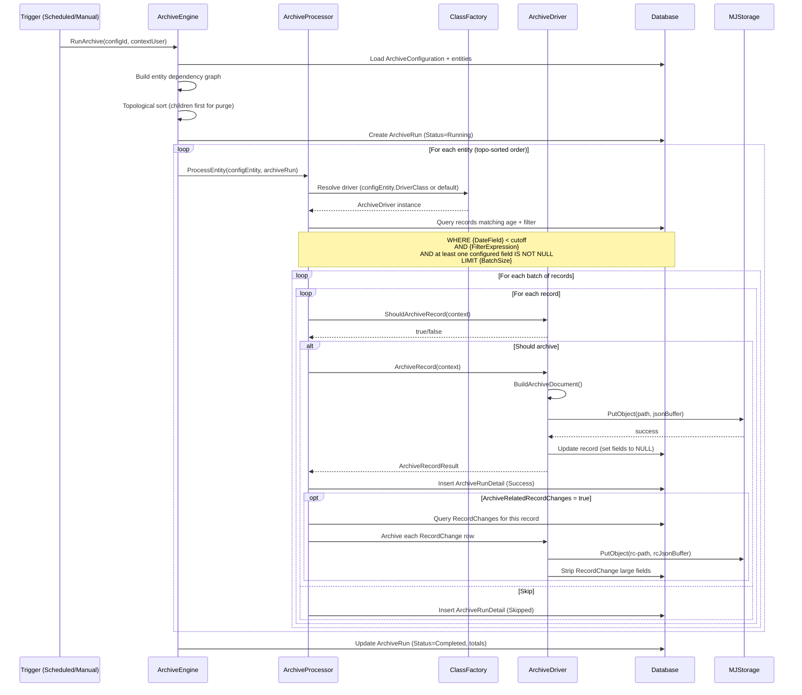
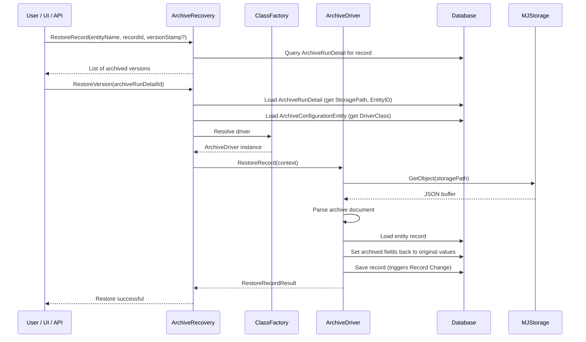
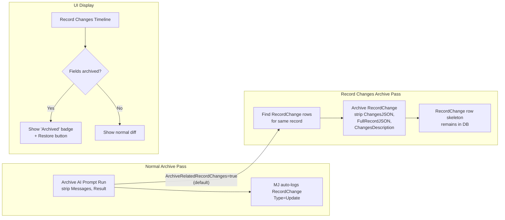
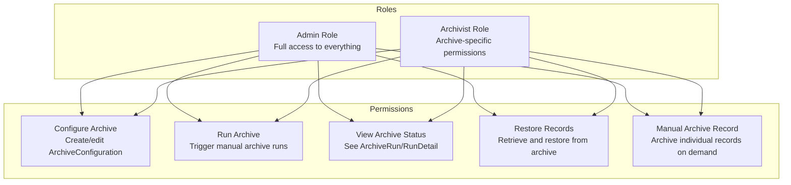

# MemberJunction Database Archiving Toolset — Implementation Plan

## Executive Summary

A general-purpose, metadata-driven archiving system for MemberJunction that moves large field data from high-growth database tables into cold object storage, preserving row skeletons for referential integrity. Configurable per-entity, extensible via a driver/plugin model, integrated with Record Changes, Scheduled Actions, and a new "Archivist" role.

---

## 1. High-Level Architecture

```mermaid
flowchart TB
    subgraph Trigger["Trigger Layer"]
        SA[Scheduled Action<br/>Cron-based]
        MA[Manual Action<br/>UI / API]
        AG[Agent Invocation]
    end

    subgraph Engine["Archive Engine (Singleton)"]
        AE[ArchiveEngine]
        AP[ArchiveProcessor]
        ASM[ArchiveStorageManager]
        AR[ArchiveRecovery]
    end

    subgraph Plugin["Plugin Layer"]
        BD[BaseArchiveDriver]
        DD1[DefaultArchiveDriver]
        DD2[CustomEntityDriver]
        DD3[CustomConfigDriver]
        CF[ClassFactory<br/>@RegisterClass]
    end

    subgraph Storage["Storage Layer (MJStorage)"]
        S3[AWS S3]
        AZ[Azure Blob]
        GC[Google Cloud]
        FS[Local Filesystem]
    end

    subgraph DB["Database"]
        AC[Archive Configuration]
        ACE[Archive Config Entity]
        ARun[Archive Run]
        ARD[Archive Run Detail]
        RC[Record Changes]
        SRC[Source Entity Tables]
    end

    SA --> AE
    MA --> AE
    AG --> AE

    AE --> AP
    AP -->|resolve driver| CF
    CF --> BD
    BD --> DD1
    BD --> DD2
    BD --> DD3

    AP --> ASM
    ASM --> S3
    ASM --> AZ
    ASM --> GC
    ASM --> FS

    AP -->|read/update| SRC
    AP -->|auto-archive| RC
    AP -->|log results| ARun
    AP -->|log details| ARD
    AE -->|read config| AC
    AE -->|read config| ACE

    AR -->|retrieve| ASM
    AR -->|restore fields| SRC
```

## 2. Entity Schema Design

### 2.1 Entity Relationship Diagram



### 2.2 Field Configuration JSON Schema (replaces ArchiveConfigurationField table)

The `FieldConfiguration` column on `ArchiveConfigurationEntity` is `nvarchar(MAX)` storing JSON conforming to this TypeScript interface:

```typescript
/**
 * Configuration for which fields to archive on an entity.
 * Stored as JSON in ArchiveConfigurationEntity.FieldConfiguration.
 */
export interface ArchiveFieldConfiguration {
    /**
     * The fields to strip (set to NULL) after archiving.
     * Only nvarchar(MAX), varbinary(MAX), and other large-column types make sense here.
     */
    Fields: ArchiveFieldConfig[];

    /**
     * If true, a full snapshot of ALL fields is stored in the archive file,
     * not just the stripped fields. Useful for full restore capability.
     * Default: false (only stripped fields are archived).
     */
    ArchiveFullRecord?: boolean;

    /**
     * If provided, only archive records where these fields are non-null.
     * Avoids re-processing already-archived records.
     * Default: all configured Fields (archive if ANY configured field is non-null).
     */
    SkipIfAllNullFields?: string[];
}

export interface ArchiveFieldConfig {
    /** The database field name to archive. */
    FieldName: string;

    /** Whether this field is active for archiving. Default: true. */
    IsActive?: boolean;

    /**
     * Future extensibility: per-field options.
     * e.g., transform before archiving, custom serialization, etc.
     */
    Options?: Record<string, unknown>;
}
```

Example JSON stored in the column:
```json
{
    "Fields": [
        { "FieldName": "Messages", "IsActive": true },
        { "FieldName": "Result", "IsActive": true },
        { "FieldName": "ErrorMessage", "IsActive": true },
        { "FieldName": "ValidationAttempts", "IsActive": true }
    ],
    "ArchiveFullRecord": false,
    "SkipIfAllNullFields": ["Messages", "Result"]
}
```

### 2.3 Driver Class Plugin System



**How driver resolution works:**

1. Check `ArchiveConfigurationEntity.DriverClass` — if set, use ClassFactory to instantiate that driver for this specific entity within this configuration.
2. If not set, check `ArchiveConfiguration` level (future: add a `DefaultDriverClass` column if needed).
3. If still not set, use the `DefaultArchiveDriver` which handles the standard strip-fields and purge-row logic.

```typescript
/**
 * Base class for all archive drivers.
 * Override to customize per-entity or per-configuration archiving behavior.
 *
 * Registration example:
 *   @RegisterClass(BaseArchiveDriver, 'Custom AI Prompt Run Archiver')
 *   export class AIPromptRunArchiveDriver extends BaseArchiveDriver { ... }
 *
 * Then set DriverClass = 'Custom AI Prompt Run Archiver' on the
 * ArchiveConfigurationEntity row for AI Prompt Runs.
 */
export abstract class BaseArchiveDriver {
    /**
     * Archive a single record. Called by ArchiveProcessor for each record.
     * Default implementation: read configured fields, write to storage, null out fields.
     */
    public abstract ArchiveRecord(
        context: ArchiveRecordContext
    ): Promise<ArchiveRecordResult>;

    /**
     * Restore a previously archived record from storage.
     * Default implementation: read from storage, set fields back, save.
     */
    public abstract RestoreRecord(
        context: RestoreRecordContext
    ): Promise<RestoreRecordResult>;

    /**
     * Pre-flight check: should this specific record be archived?
     * Override to add custom business logic (e.g., skip records
     * referenced by active agent runs).
     */
    public abstract ShouldArchiveRecord(
        context: ArchiveRecordContext
    ): Promise<boolean>;
}
```

**Context objects passed to drivers:**

```typescript
export interface ArchiveRecordContext {
    /** The entity record to archive (loaded as BaseEntity). */
    Record: BaseEntity;

    /** Parsed FieldConfiguration from the ArchiveConfigurationEntity. */
    FieldConfig: ArchiveFieldConfiguration;

    /** The archive configuration entity row (entity-level config). */
    ConfigEntity: ArchiveConfigurationEntityType;

    /** The top-level archive configuration. */
    Config: ArchiveConfigurationType;

    /** Initialized storage driver, ready for PutObject/GetObject. */
    StorageDriver: FileStorageBase;

    /** The root path + entity subfolder, pre-computed. */
    BasePath: string;

    /** Context user for all DB operations. */
    ContextUser: UserInfo;

    /** The archive run (for logging). */
    ArchiveRun: ArchiveRunType;
}

export interface ArchiveRecordResult {
    Success: boolean;
    StoragePath: string | null;
    BytesArchived: number;
    ErrorMessage?: string;
    Skipped?: boolean;
}
```

## 3. Processing Flow

### 3.1 Archive Execution Flow



### 3.2 Restore Flow



### 3.3 Record Changes Integration



## 4. Storage Layout

```
{RootPath}/
├── {SanitizedEntityName}/
│   ├── {RecordID}/
│   │   ├── {VersionStamp}.json                 ← archived field data
│   │   └── {VersionStamp}.json                 ← another version
│   └── {RecordID}/
│       └── {VersionStamp}.json
└── __record_changes/
    └── {SanitizedEntityName}/
        └── {OriginalRecordID}/
            └── {RecordChangeID}_{VersionStamp}.json
```

- `SanitizedEntityName`: Entity name with spaces/colons replaced by underscores (e.g., `MJ_AI_Prompt_Runs`)
- `RecordID`: `CompositeKey.ToConcatenatedString()` for compound keys, or plain UUID for simple keys
- `VersionStamp`: ISO 8601 timestamp with colons replaced by underscores for filesystem safety (e.g., `2025-06-15T10_30_00Z`)
- Record Changes get their own `__record_changes/` subtree, organized by the original entity and record they belong to

### Archive Document Format (JSON)

```json
{
    "archiveVersion": 1,
    "entityName": "MJ: AI Prompt Runs",
    "entityId": "...",
    "recordId": "A3F2B1C4-...",
    "primaryKey": [{ "FieldName": "ID", "Value": "A3F2B1C4-..." }],
    "versionStamp": "2025-06-15T10:30:00.000Z",
    "archivedAt": "2026-02-26T12:00:00.000Z",
    "archiveConfigurationId": "...",
    "archiveConfigurationEntityId": "...",
    "mode": "StripFields",
    "archivedFields": {
        "Messages": "[{\"role\":\"user\",\"content\":\"...\"}]",
        "Result": "The full LLM response text...",
        "ErrorMessage": null,
        "ValidationAttempts": "[...]"
    },
    "fullRecord": null
}
```

When `ArchiveFullRecord = true`, the `fullRecord` key contains `record.GetAll()` — a complete snapshot of all fields.

## 5. Authorization Model

### New Role: **Archivist**



Implementation approach:
- Create an Authorization with Name = `Archive`
- Roles: `Archivist` (new role) and `Admin` (existing) both get the Authorization
- The archive engine checks `UserInfo.Authorizations` before executing
- UI components check authorization before showing archive/restore buttons
- Entity-level permissions on the new archive entities (ArchiveConfiguration, etc.) use standard MJ row-level security

## 6. Default Configurations (Shipped with MJ)

These ship as metadata JSON files in `/metadata/archiving/` and get pushed via mj-sync:

| Config Name | Entity | Mode | Retention | Key Fields to Strip |
|---|---|---|---|---|
| Record Changes - 12 Month | Record Changes | StripFields | 365 days | ChangesJSON, FullRecordJSON, ChangesDescription |
| AI Prompt Runs - 6 Month | MJ: AI Prompt Runs | StripFields | 180 days | Messages, Result, ErrorMessage, ValidationAttempts, FailoverErrors, ModelSpecificResponseDetails, + 6 more |
| AI Agent Run Steps - 6 Month | MJ: AI Agent Run Steps | StripFields | 180 days | InputData, OutputData, PayloadAtStart, PayloadAtEnd, ErrorMessage, Comments |
| AI Agent Runs - 6 Month | MJ: AI Agent Runs | StripFields | 180 days | Result, FinalPayload, StartingPayload, Data, Message, ErrorMessage, AgentState |
| Audit Log - 18 Month | Audit Logs | StripFields | 540 days | Details, Description |

All default configs ship with `IsActive = false` — customers opt-in by activating and configuring a storage account.

A default Scheduled Action ships (also inactive) configured for weekly execution of the archive action.

## 7. Package Structure

```
packages/
  Archiving/
    Engine/                          ← @memberjunction/archiving-engine
      src/
        ArchiveEngine.ts             ← Singleton orchestrator (BaseSingleton)
        ArchiveProcessor.ts          ← Per-entity batch processing
        ArchiveStorageManager.ts     ← Storage path building, read/write via MJStorage
        ArchiveRecovery.ts           ← Retrieve + restore archived data
        BaseArchiveDriver.ts         ← Abstract base class for plugins
        DefaultArchiveDriver.ts      ← Standard strip/purge implementation
        types.ts                     ← All interfaces and types
        index.ts
      package.json
      tsconfig.json
      vitest.config.ts
      src/__tests__/
        ArchiveEngine.test.ts
        ArchiveProcessor.test.ts
        DefaultArchiveDriver.test.ts

    Action/                          ← @memberjunction/archiving-action
      src/
        ArchiveDataAction.ts         ← BaseAction: run archive for a config
        RestoreRecordAction.ts       ← BaseAction: restore a specific record
        index.ts
      package.json

  Angular/
    Generic/
      archive-manager/               ← @memberjunction/ng-archive-manager
        src/lib/
          archive-status/            ← Component showing archive badges on records
          archive-restore/           ← Restore dialog with version picker
          archive-config/            ← Admin config editor UI
          archive-run-viewer/        ← View run history and details
          module.ts
        package.json

migrations/
  v2/
    VYYYYMMDDHHMM__vX.X.x_Archive_Configuration_Tables.sql
    VYYYYMMDDHHMM__vX.X.x_Archive_Run_Tables.sql
    VYYYYMMDDHHMM__vX.X.x_Archivist_Role_And_Authorization.sql

metadata/
  archiving/
    .archive-configurations.json     ← Default configs (mj-sync)
    .archive-scheduled-action.json   ← Default scheduled action
    .archivist-role.json             ← Archivist role + authorization
```

## 8. Implementation Phases

### Phase 1: Foundation (Core Engine + Schema)
1. Database migration: create all 4 archive tables
2. Database migration: create Archivist role + Archive authorization
3. `@memberjunction/archiving-engine` package:
   - `BaseArchiveDriver` abstract class with `@RegisterClass` pattern
   - `DefaultArchiveDriver` implementation
   - `ArchiveEngine` singleton (BaseSingleton) with config loading
   - `ArchiveProcessor` with topo-sort, batch processing, field stripping
   - `ArchiveStorageManager` wrapping MJStorage for path building + read/write
   - `ArchiveRecovery` for retrieve/restore
   - Types and interfaces
4. Unit tests for engine, processor, and default driver

### Phase 2: Actions + Scheduling
5. `@memberjunction/archiving-action` package:
   - `ArchiveDataAction` (BaseAction) — run a full archive config
   - `RestoreRecordAction` (BaseAction) — restore individual records
6. Metadata: default ArchiveConfigurations (shipped inactive)
7. Metadata: ScheduledAction for weekly archive runs (shipped inactive)
8. Metadata: Archivist role assignment

### Phase 3: Record Changes Integration
9. Auto-archive Record Changes for archived entity records
   - When `ArchiveRelatedRecordChanges = true` (default), after archiving a source record, find and archive its RecordChange rows
   - Strip `ChangesJSON`, `FullRecordJSON`, `ChangesDescription` from those RecordChange rows
   - Store under `__record_changes/` subtree in storage

### Phase 4: Angular UI
10. Archive status component (badge on record views when fields are archived)
11. Archive restore dialog (version picker, preview, restore button)
12. Archive configuration admin UI (CRUD for configs + entity mappings)
13. Archive run viewer (history of runs with detail drill-down)
14. Integration with Record Changes timeline (archived badge + restore)

### Future Phases (Not in V1)
- **Storage tiering**: Auto-move from S3 Standard to Glacier after N months
- **Compression**: Application-level gzip (for now, rely on storage provider compression settings — S3 and Azure both support server-side compression policies)
- **Bulk restore**: Restore all records for an entity/time range
- **Archive search**: Full-text search across archived JSON documents
- **Parquet format**: For analytical workloads on archived data
- **Archive verification**: Periodic integrity checks comparing DB nulls against storage presence
- **Record Changes diff viewer**: Side-by-side diff of any two record versions (including pulling archived data)
- **Record version restore**: Restore a record to any prior version from Record Changes history

## 9. Batch Size & Throttling Configuration

Batch sizes are configurable at two levels:

| Setting | Location | Default | Purpose |
|---|---|---|---|
| `DefaultBatchSize` | ArchiveConfiguration | 100 | Default for all entities in this config |
| `BatchSize` | ArchiveConfigurationEntity | NULL (use default) | Override per-entity |

The processor uses these to:
1. Query records in batches (`TOP {BatchSize}`)
2. Process each batch sequentially (archive → strip → log)
3. Commit the ArchiveRunDetail rows after each batch
4. Report progress (records processed / total) for UI consumption

This prevents overwhelming the DB on first run against millions of old Record Changes.

## 10. Key Design Decisions Summary

| Decision | Choice | Rationale |
|---|---|---|
| Field config storage | JSON column + TS interface | Flexible, extensible, no extra table join, strongly typed in code |
| Plugin model | `BaseArchiveDriver` + ClassFactory | Consistent with MJ patterns, per-entity customization without forking |
| Row handling default | Strip fields, keep skeleton | Preserves referential integrity, aggregation queries, FK chains |
| Record Changes archiving | Auto-archive alongside source entity (default on) | Biggest storage win; RC rows for archived records are equally stale |
| Compression | Delegate to storage provider settings | S3/Azure support server-side compression; avoids app complexity |
| Authorization | New `Archivist` role + `Archive` authorization | Clean separation; doesn't pollute Admin role semantics |
| Batch processing | Configurable at config + entity level | Handles first-run against millions of rows gracefully |
| Topo sort for purge | Reuse existing `RecordDependencyAnalyzer` patterns | Children purged before parents; proven approach in codebase |
| Default configs | Shipped inactive via mj-sync metadata | Customers opt-in; no surprise data movement |
| Storage layout | `{Root}/{Entity}/{RecordID}/{VersionStamp}.json` | Simple, browsable, supports multiple versions per record |
