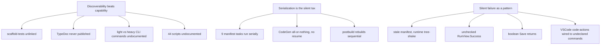
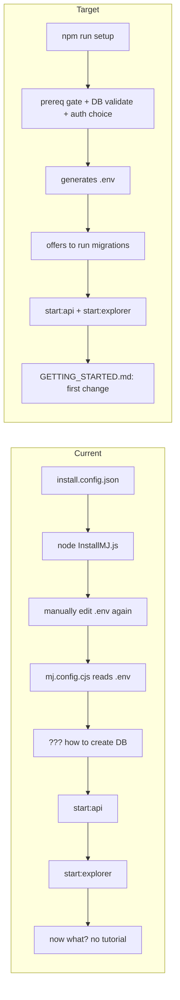
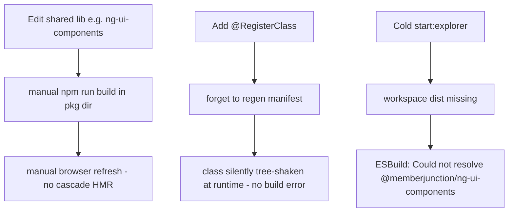

# MemberJunction Developer Experience (DX) Audit & Improvement Plan

## Status
- **Status**: Draft
- **Created**: 2026-06-13
- **Author**: AN-BC + Claude
- **Branch**: an-bc/dx-audit-and-improvements

## Overview

This plan captures a full audit of MemberJunction's **developer experience (DX)** — the end-to-end ergonomics of cloning, configuring, building, generating code, testing, debugging, and shipping changes against the MJ monorepo (~116 packages) and its companion [VSCode extension](https://github.com/MemberJunction/VSCode). The audit was conducted by reading the actual configuration, build, CodeGen, CLI, testing, and documentation surfaces (not from memory), plus cloning and inspecting the VSCode extension repo.

The headline finding is that **MJ's architecture is strong but its glue is thin**. The build pipeline (Turbo + ESBuild + class-registration manifests), the CodeGen/metadata system, and the oclif-based CLI are all well-designed. The friction lives in the seams: the "first 30 minutes" of onboarding is fractured across three config systems with no guided path; the inner edit→run loop has avoidable throttles (cold-start dep builds, serial manifest generation, no workspace-package cascade); and a lot of genuinely good investment is **invisible or unenforced** (90% of packages have tests but CI never runs them; 160+ TypeDoc configs exist but nothing publishes them; the VSCode extension is broad but unpublished, untested, and missing the core mj-sync loop).

This document is a **prioritized, implementable backlog**. Each item is scoped, tied to concrete file evidence, and sized (S/M/L). It is intentionally broad — it is expected to be split into multiple focused PRs/issues during execution, not implemented as one monolithic change. Two items are flagged for **immediate attention** (a possible secret-in-git situation and a confirmed broken VSCode feature) and should be triaged before the rest.

## Goals & Non-Goals

### Goals
- Reduce time-from-clone-to-first-successful-change from ~30+ minutes (with high failure/abandon risk) to <10 minutes on the happy path.
- Eliminate the known "cold-start `start:explorer` fails" wall that every fresh clone hits.
- Make existing-but-invisible investment discoverable (tests, scaffolding, TypeDoc, CLI command tiers).
- Enforce quality that is currently aspirational (run the test suite in CI).
- Reduce the serialization tax in the CodeGen/migration loop with scaffolding + granular regeneration flags.
- Close the highest-value gaps in the VSCode extension (mj-sync commands, agent-run inspector) and fix its confirmed broken feature.

### Non-Goals
- A ground-up rewrite of any subsystem (CodeGen, the manifest system, the CLI) — all improvements are additive/incremental.
- Changing the metadata-driven architecture or the `@RegisterClass` model.
- Migrating away from oclif, Turbo, Vitest, or ESBuild.
- Resolving the broader "structured error result" refactor as a prerequisite — it is listed as a long-horizon item only.

## Background & Context

A new or returning developer's journey through MJ touches these surfaces, each audited below with file-level evidence:

1. **Onboarding & setup** — `README.md`, `install.config.json`, `mj.config.cjs`, `.env`, `InstallMJ.js`, `distribution.README.md`, `CONTRIBUTING.md`.
2. **Build & monorepo loop** — `turbo.json`, root `package.json` scripts, `packages/MJExplorer/{package.json,angular.json}`, `packages/Angular/Bootstrap/CLAUDE.md`, the class-registration manifest system.
3. **CodeGen / migrations / metadata-sync** — `packages/CodeGenLib`, `packages/MJCLI/src/commands/{codegen,sync,migrate}`, `migrations/CLAUDE.md`, `metadata/CLAUDE.md`, `packages/MetadataSync`.
4. **CLI & scripts** — `packages/MJCLI` (oclif, 40+ commands), `packages/MJCLI/src/light-commands.ts`, `scripts/` (44 files), root `package.json` script names.
5. **Testing, docs, errors** — `vitest.shared.ts`, `scripts/scaffold-tests.mjs`, `.github/workflows/build.yml`, `guides/`, nested `CLAUDE.md` files, 160+ `typedoc.json`, `RunViewResult`/`BaseEntity.Save()` return patterns.
6. **VSCode extension** (separate repo `github.com/MemberJunction/VSCode`, commit `591c8eb`, last activity 2026-04-03, ~15.4K LOC, v0.1.0, unpublished).

### ⚠️ Two items requiring immediate triage (before the backlog)

- **Possible committed secrets.** The onboarding audit reported that the root `.env` contains real API keys (≈ lines 49–66) and appears tracked in git. **This was not independently confirmed.** If true, it is a credential-rotation incident, not a DX nit. **Action:** verify `git ls-files --error-unmatch .env`, check `.gitignore`, and inspect `git log -- .env`. If tracked with real secrets: rotate keys, `git rm --cached .env`, add to `.gitignore`, ship a sanitized `.env.example`, and consider history scrubbing.
- **Confirmed broken VSCode feature.** `AICodeActionProvider.ts` (lines 62, 74, 112, 122) invokes commands `memberjunction.askAIToImprove` and `memberjunction.askAIToFix` that are **not declared** in `package.json` `contributes.commands` (only `askAIToExplain` / `askAIToGenerate` are). The README advertises both. They silently fail. Pure bug-fix (see Phase 5).

## Architecture / Design

### Cross-cutting DX themes

### Onboarding: current vs target config flow

### Inner-loop throttles (build)

### Data Model Changes
None. This plan is tooling/DX/process-focused and introduces **no database schema changes**, no new entities, and no migrations of its own. (Several proposed *tools* assist with authoring migrations, but the plan itself requires none.)

### API Changes
No GraphQL/Action API changes. New surface area is limited to:
- New CLI subcommands/flags on the existing `mj` binary (`mj migrate scaffold`, `mj codegen --skip-*`, standardized `--ci`).
- New npm scripts at repo root (`setup`, `scripts:help`).
- New CI workflow steps (test gate, TypeDoc publish, manifest guardrail grep).
- New VSCode extension commands (mj-sync push/pull/validate, agent-run inspector).

## Implementation Plan

> Execution note: this is a backlog, not a single PR. Recommended grouping — **PR-A**: Phase 0 (triage) + Phase 1 quick wins; **PR-B**: Phase 2 (build loop); **PR-C**: Phase 3 (CodeGen/CLI); **PR-D**: Phase 4 (testing/docs); **PR-E**: Phase 5 (VSCode). Long-horizon items (Phase 6) become tracked issues.

### Phase 0: Immediate triage (do first)
1. **Verify `.env` secret exposure** — Run `git ls-files --error-unmatch .env`, inspect `.gitignore`, `git log --oneline -- .env`. If tracked with live secrets: rotate affected keys, `git rm --cached .env`, add `.env` to `.gitignore`, create sanitized `.env.example`. (S, but urgent)
2. **Fix broken VSCode AI code actions** — In the VSCode repo, either declare `memberjunction.askAIToImprove` and `memberjunction.askAIToFix` in `package.json` `contributes.commands`, or refactor `AICodeActionProvider.ts` (lines 62, 74, 112, 122) to invoke the already-declared `askAIToExplain`/`askAIToGenerate`. (S)

### Phase 1: Quick wins (hours each, high leverage)
1. **`preinstall` prerequisite gate** — Add `scripts/check-prerequisites.js` (~50 lines) and wire as `"preinstall"` in root `package.json`. Check Node ≥ 20 and npm ≥ 9; fail fast with an actionable message (e.g. "Node 18 detected. MemberJunction requires Node 20+. Upgrade at nodejs.org") before npm attempts dependency resolution. (S)
2. **Pre-build Explorer's workspace deps before dev server** — Modify `packages/MJExplorer/package.json` `prestart` to build Explorer's direct workspace dependencies before `ng serve` (e.g. `turbo build --filter="@memberjunction/ng-ui-components" --filter="@memberjunction/ng-base-forms" ...` then existing `mj codegen manifest`). Eliminates the cold-start `Could not resolve "@memberjunction/ng-ui-components"` failure on fresh clones. (S)
3. **Add test suite as a CI gate** — In `.github/workflows/build.yml`, add a blocking `npm run test -- --run` step after build (Turbo caches, so unchanged packages skip). Document in README that PRs must pass tests. (S–M)
4. **`GETTING_STARTED.md` task-indexed hub** — Create root `GETTING_STARTED.md` with "I want to…" links: build a dashboard → `guides/DASHBOARD_BEST_PRACTICES.md`; add an action → `packages/Actions/CLAUDE.md`; write tests → CLAUDE.md testing section + scaffold script; query data → `guides/SEARCH_OVERVIEW_GUIDE.md`; realtime agents → `guides/REALTIME_CO_AGENTS_GUIDE.md`. Link from README. (S)
5. **Link the test scaffold script** — Add a "Using the scaffold script" subsection to the root `CLAUDE.md` "Unit Testing" section documenting `node scripts/scaffold-tests.mjs packages/YourPackage`. Reference from `packages/TestingFramework/README.md`. (S)
6. **`mj migrate scaffold --name`** — New MJCLI command (`packages/MJCLI/src/commands/migrate/scaffold.ts`, ~150 lines) generating a migration file in the highest-numbered `migrations/v*/` folder with: auto-filled timestamp, placeholder hardcoded UUIDs, a single consolidated `ALTER TABLE` example, and `sp_addextendedproperty` stubs per column, plus inline comments on the common pitfalls from `migrations/CLAUDE.md`. (S)
7. **`mj codegen --skip-commands` / `--skip-typescript` flags** — Add escape-hatch flags to `RunCodeGenBase.Run()` (`packages/CodeGenLib/src/runCodeGen.ts`) so devs can skip post-generation package rebuilds or regenerate only a single layer, cutting the 60–100s loop for schema-only iteration. (S–M)

### Phase 2: Build-loop medium bets
1. **Parallelize manifest generation** — Replace the serial `mj:manifest` chain (root `package.json` lines ~64–73) with a Turbo task (`codegen:manifest`, `dependsOn: ["build"]`, `cache: false`) so all 9 manifests run in parallel (~50s → ~10s). (M)
2. **Manifest server-leakage guardrail** — Add a CI grep step that fails if `packages/Angular/Bootstrap/src/generated/mj-class-registrations.ts` imports server-only packages (`aiengine`, `ai-provider-bundle`, `storage`, `templates`, `ai-openai`, …). Prevents recurrence of the June-2026 `Could not resolve "crypto"` incident documented in `packages/Angular/Bootstrap/CLAUDE.md`. (S)
3. **Workspace-package watch → auto-rebuild/HMR** — Provide a documented `npm run dev:watch` that runs `turbo watch` + `start:explorer` together, or an ESBuild reload hook on workspace `dist/` changes, so editing a shared library reflects in Explorer without a manual rebuild+refresh. (M)
4. **Lazy-feature-config validation** — After manifest generation, validate `lazy-feature-config.ts` against actually-discovered lazy modules and fail on drift (catches stale lazy configs at build time, not runtime 404s). (S)

### Phase 3: CodeGen / CLI medium bets
1. **Unified `mj setup` / `npm run setup`** — A single interactive flow (`scripts/setup.mjs` or an MJCLI command, ~200 lines, using the inquirer deps already present) that: checks prereqs, asks DB questions once and validates the connection, detects an uninitialized DB and offers to run migrations, asks auth provider (none/MSAL/Auth0) with doc links and a "no-auth local" path, and generates `.env` from a template. Collapses the `install.config.json` + `mj.config.cjs` + `.env` maze. (M)
2. **Checkpointed/resumable installer** — Refactor `InstallMJ.js` to write a `.setup-state.json`, show progress (e.g. `ora`) during CodeGen instead of a silent multi-minute spawn, and resume from the last completed step on re-run. (M)
3. **Standardize CLI CI-mode flags** — Add a CI-mode oclif mixin (`packages/MJCLI/src/lib/ci-mode-mixin.ts`) so all interactive commands expose a consistent `--ci` flag that makes prompts (`confirm`/`select`/`input`) fail fast instead of hanging. Apply to `install`, `app remove`, `sync init`, `sync file-reset`, `sync watch`. (M)
4. **Static-import lint hook** — Add `scripts/check-dynamic-imports.mjs` to flag `await import(...)` in `packages/MJCLI/src/commands/**` lacking a justifying comment (per the CLAUDE.md Rule-8 categories), run in CI. Prevents recurrence of the `mj app` `ERR_MODULE_NOT_FOUND` bug class; 10+ unjustified dynamic imports currently exist (e.g. `translate-sql/index.ts` lines 233–237). (S–M)
5. **Scripts registry + help** — Add `scripts/REGISTRY.md` documenting all 44 scripts (one-line purpose + when-to-use) and a `npm run scripts:help` that prints a formatted list. (S)
6. **Contextual CLI error messages** — Introduce a `CommandError` helper (`packages/MJCLI/src/lib/command-error.ts`) carrying a suggested-fix + related command; apply to the ~10 highest-friction commands (codegen, migrate, sync, app) so failures say what to do next (e.g. "Run `mj doctor`"). (S)

### Phase 4: Testing & docs medium bets
1. **Publish TypeDoc** — Add `.github/workflows/typedoc-publish.yml` (triggered on release or `next`) to build TypeDoc for top-tier packages and publish to docs.memberjunction.org / GitHub Pages; link from README and `guides/README.md`. `typedoc` is already a devDependency; base config exists. (M)
2. **Per-package coverage reporting** — Emit per-package coverage (Turbo `test` already declares `coverage/**` outputs), aggregate in a CI step, and surface as a PR comment or Codecov badge. (M)
3. **Error-handling guidelines** — Add an "Error Handling Best Practices" section to root `CLAUDE.md`: always check `result.Success` before `result.Results`; always check the boolean return of `Save()`/`Delete()` and read `LatestResult?.CompleteMessage`; provide actionable messages. Cite the Encryption README troubleshooting table as the model. (S)

### Phase 5: VSCode extension
1. **mj-sync push/pull/validate commands** — The extension already loads `@memberjunction/metadata-sync` in-process but registers **no** push/pull commands — the core mj-sync developer loop is absent. Add palette + tree commands; surface validation in the Problems panel (diagnostic plumbing already exists). **Highest ROI for the extension.** (S–M)
2. **AI Agent Run / Prompt Run inspector** — A tree/webview to browse recent `MJ: AI Agent Runs` and drill into steps/errors/token usage via `RunView` (already used by `AgentService`). The IDE-native equivalent of the `debug-agent-run` workflow. (M)
3. **Migration scaffolder + snippets** — A "New Migration" command reusing the naming-spec regexes already in `MigrationService.ts`, plus snippets for consolidated `ALTER TABLE` and the `sp_addextendedproperty` block. (S)
4. **Real test suite + CI** — Create `src/test/` with `@vscode/test-electron` (already a devDependency; the current `test` script points at a non-existent path) covering migration-name parsing, entity discovery, and schema generation; wire a GitHub Action. (M)
5. **Marketplace publish + doc reconciliation** — Execute the existing `PUBLISHING.md`, bump version, reconcile the README roadmap (Phase 4 is shipped, not "Future"), and log Phases 2–4 in CHANGELOG. (S)

### Phase 6: Long-horizon (tracked as issues, not in initial PRs)
1. **Incremental, fingerprint-scoped CodeGen** — Track per-entity schema fingerprints in `.codegen-state.json`; regenerate only changed entities + dependents. (L)
2. **Root TypeScript project-references graph** — A root `tsconfig.json` with `references` to all packages so `.tsbuildinfo` is shared and a `core-entities` change stops recompiling ~24 dependents. (L)
3. **Structured `Result<T>` for core APIs** — Replace boolean/undefined returns on `Save()`/validation/decrypt with a discriminated `Result<T>` carrying error codes/context. Breaking; sweeping refactor. (L)

## Migration & Data

No database migrations, seed data, or CodeGen runs are required by this plan. The `mj migrate scaffold` tool (Phase 1.6) and the VSCode migration scaffolder (Phase 5.3) *produce* migrations for end users but introduce none themselves.

## Testing Strategy

- **New CLI commands** (`migrate scaffold`, `codegen --skip-*`, `--ci` mixin): unit tests in the respective package's `src/__tests__/` (Vitest) — assert generated filenames match the `VYYYYMMDDHHMM__v5.x_*.sql` spec, UUID placeholders are present, `--skip-*` flags short-circuit the right pipeline stages, and `--ci` makes prompts throw rather than hang.
- **`preinstall` gate**: test the version-comparison logic against Node 18/20/22 and npm 8/9 inputs.
- **CI test-gate rollout**: land the gate on a branch first and confirm the existing ~90% test suite is green before making it blocking; fix or quarantine any currently-failing packages as part of the same PR.
- **Manifest guardrail grep**: add a negative fixture (a deliberately-leaking import) in a test branch to confirm the CI step fails as intended.
- **VSCode extension**: `@vscode/test-electron` integration tests for migration-name parsing, entity discovery, schema generation, and that all `contributes.commands` referenced by providers are actually declared (a regression test for the Phase-0 bug).
- **Edge cases**: cold clone with no `dist/`; fresh clone on the wrong Node version; `mj setup` against an unreachable DB; CI invocation of every interactive command with `--ci`.

## Risks & Open Questions

- **Risk: enabling the CI test gate surfaces pre-existing failures.** Mitigation — measure suite health first; quarantine known-flaky packages with an explicit allowlist rather than blocking the whole org.
- **Risk: `prestart` pre-building deps slows the common warm-start case.** Mitigation — Turbo cache makes warm rebuilds near-instant; only the first cold start pays. Verify wall-clock on a warm machine.
- **Risk: VSCode extension changes live in a separate repo** (`github.com/MemberJunction/VSCode`) — Phase 0.2 and Phase 5 are **out-of-tree** and need their own PRs there; this plan tracks them but the MJ-repo PR cannot contain them.
- **Open question:** Is the `.env`-in-git report accurate? Must be confirmed in Phase 0 before any other narrative about secrets is trusted.
- **Open question:** Does docs.memberjunction.org have an existing publish target/host, or does Phase 4.1 need to stand one up?
- **Open question:** Should `mj setup` supersede `InstallMJ.js` outright or wrap it? (Affects Phase 3.1 vs 3.2 sequencing.)

## Files to Modify

| File | Change |
|------|--------|
| `package.json` (root) | Add `preinstall` hook; add `setup` and `scripts:help` scripts; refactor `mj:manifest` to a Turbo task; standardize script names |
| `scripts/check-prerequisites.js` | **New** — Node/npm version gate |
| `scripts/check-dynamic-imports.mjs` | **New** — flags unjustified dynamic imports in MJCLI commands |
| `scripts/setup.mjs` | **New** (or MJCLI command) — unified interactive setup |
| `scripts/REGISTRY.md` | **New** — documents all 44 scripts |
| `GETTING_STARTED.md` | **New** — task-indexed developer hub |
| `.env.example` | **New** — sanitized template (Phase 0 if secrets confirmed) |
| `.gitignore` | Ensure `.env` is ignored (Phase 0) |
| `CLAUDE.md` (root) | Add scaffold-script subsection; add Error-Handling Best Practices section |
| `packages/MJExplorer/package.json` | `prestart` pre-builds workspace deps before `ng serve` |
| `.github/workflows/build.yml` | Add blocking `npm run test` step; add manifest server-leakage grep |
| `.github/workflows/typedoc-publish.yml` | **New** — build + publish TypeDoc |
| `turbo.json` | Add `codegen:manifest` task for parallel manifest generation |
| `packages/CodeGenLib/src/runCodeGen.ts` | Add `--skip-commands` / `--skip-typescript` (and per-layer) flags |
| `packages/MJCLI/src/commands/migrate/scaffold.ts` | **New** — migration scaffolding command |
| `packages/MJCLI/src/lib/ci-mode-mixin.ts` | **New** — standardized `--ci` behavior |
| `packages/MJCLI/src/lib/command-error.ts` | **New** — contextual error helper with suggested fixes |
| `packages/MJCLI/src/commands/{install,app/remove,sync/*}` | Adopt `--ci` mixin; adopt contextual errors |
| `packages/MJCLI/src/commands/translate-sql/index.ts` (+ querygen/dbdoc/test) | Replace/justify dynamic imports |
| `packages/TestingFramework/README.md` | Link the scaffold script |
| `InstallMJ.js` | Checkpointing + progress (Phase 3.2) |
| **VSCode repo** `package.json` `contributes.commands` | Declare `askAIToImprove` / `askAIToFix` (Phase 0.2) |
| **VSCode repo** `src/...MetadataSyncFeature.ts` | Add sync push/pull/validate commands (Phase 5.1) |
| **VSCode repo** `src/test/` | **New** — real test suite (Phase 5.4) |

## References

- VSCode extension repo: https://github.com/MemberJunction/VSCode (commit `591c8eb`)
- Manifest system & server-leakage incident: `packages/Angular/Bootstrap/CLAUDE.md`, root `CLAUDE.md` (Class Registration Manifests section)
- Migration authoring rules: `migrations/CLAUDE.md`
- Metadata sync: `metadata/CLAUDE.md`, `packages/MetadataSync/README.md`
- CodeGen pipeline: `packages/CodeGenLib/README.md`
- CLI dynamic-import bug background: root `CLAUDE.md` Rule 8
- Testing conventions: root `CLAUDE.md` Unit Testing section, `vitest.shared.ts`, `scripts/scaffold-tests.mjs`
- This plan originated from a conversational DX audit on the `realtime-meeting-bridge` branch, 2026-06-13.
