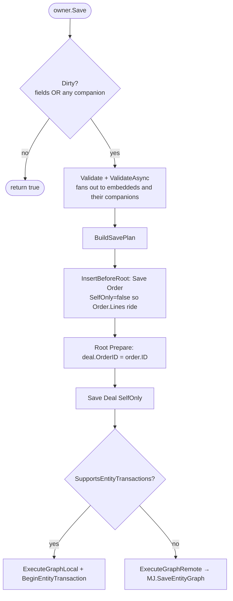
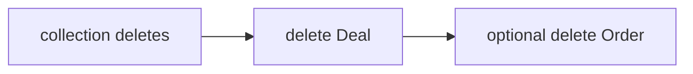
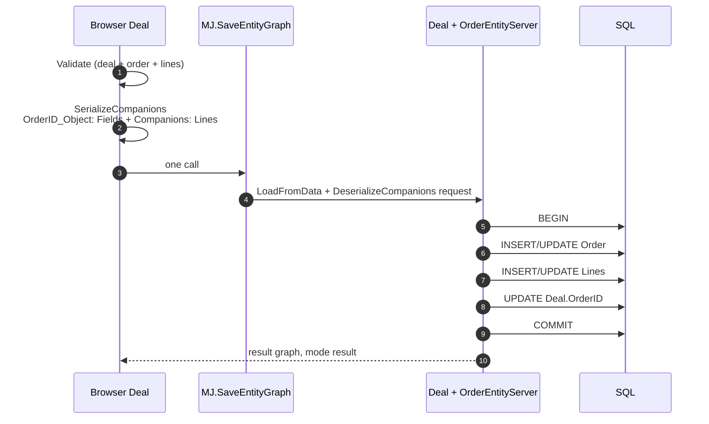

# Embedded Records — Owner-Held 1:1 Companions on `BaseEntity`

**Branch**: `an-dev-66` (omnibus)
**Status**: implementing
**Owner**: MJ Core
**Depends on**: Entity companions & graph save (6.2) — `EntityCompanion`, `RelatedRecordCollection`, `EntitySavePlan`, `MJ.SaveEntityGraph`

---

## 1. Problem

A Deal (SFA) eventually spins up an Order (order processing). The Deal holds `OrderID`. Callers want:

```ts
const deal = await provider.GetEntityObject<DealEntity>('Deals');
deal.OrderID_Object.OrderDate = new Date('2002-01-01');
await deal.OrderID_Object.Lines.Create();
await deal.Save(); // order + lines + stamped Deal.OrderID, one transaction
```

This is **not** IS-A (shared PK, table-per-type inheritance). A Deal is not an Order.

This is **not** a related-record collection (FK on the child pointing up; parent saves first). `Deal.OrderID` is the opposite join, so the save order inverts.

It is a third composition axis: an **owner-held 1:1 peer document** that participates in the owner's load, validate, and save graph.

---

## 2. The three composition axes

| | IS-A | Related-record collection | Embedded record |
|---|---|---|---|
| What it models | One logical record, table-per-type | Header + N dependents | Owner + one peer treated as part of the owner's unit of work |
| Identity | Shared PK | Own PK | Own PK |
| Cardinality | 1 : 0–1 (or overlapping) | 1 : N | 1 : 0–1 |
| Join | Same `ID` | FK **on the related row**, pointing up | FK **on the owner**, pointing down |
| Save order | Root → leaf | Owner first, stamp child's FK | **Embedded first**, stamp owner's FK, then owner |
| Delete order | Leaf → root | Related first (if compose) | Owner first (FK dies with it), then optionally the embedded row |
| Exists when | Always, as one type chain | Because the parent exists | Immediately if the FK is `NOT NULL`; later via `Ensure` if nullable |
| Declared on | `Entity.ParentID` | `EntityRelationship.RelatedRecordCollection` | **`EntityField.EmbeddedRecord`** on the FK field |
| Default-on? | Schema-driven | Opt-in | **Opt-in** — every FK is not an embedded object |

The word **child** remains reserved for IS-A. Collections are **related records**. This feature is **embedded records**.

---

## 3. Governing decisions (locked)

1. **Public API is the entity, not a wrapper.** `deal.OrderID_Object` is `T | null` (or `T` when the FK is required). The companion exists only internally.
2. **`NewRecord()` stays synchronous.** `GetEntityObject` already calls it on the create path. We pre-construct the related entity instance during `GetEntityObject` (async, same slot as `InitializeParentEntity`) so `NewRecord()` and `Ensure()` can be sync.
3. **Mandatory vs optional is `EntityField.AllowsNull`.** No `AutoProvision` flag. `AllowsNull = false` → object exists after `GetEntityObject` / `NewRecord`. `AllowsNull = true` → getter is `null` until `Ensure()` or until `Load()` finds a FK value.
4. **`Ensure` is sync and idempotent.** `{FieldName}_EnsureObject()`.
5. **Property names are mechanical.** `{FieldName}_Object`, `{FieldName}_EnsureObject`. No `Name` in the JSON.
6. **Metadata lives on the FK field**, not on `EntityRelationship`. `RelatedEntity` and the FK column name are already on the `EntityField` row.
7. **`OnClear` defaults to `orphan`.** The target is typically a first-class document in another bounded context (an order). Deleting the deal must not delete the order unless the author opts in to `'delete'`.
8. **`Load` of the owner waits for the tree.** After `await deal.Load()`, every provisioned embedded is a fully `Load()`'d record (fields, IS-A chain, immediate companions, nested embeddeds). Explicit related-record collections on the embedded (`Order.Lines`) stay explicit unless `LoadNested: 'related'`.
9. **`LoadFromData` / `RunView` never fetches embeddeds.** Same N+1 rule as collections.
10. **Recursive companion serialization.** An embedded order ships its own `Companions` (Lines, Charges, …) so a browser `deal.Save()` does not drop the order graph.
11. **CodeGen emits the declaration.** Cross-package types resolve via existing `entityPackageName` schema → npm package map. Same-file symbols need no import.
12. **No production core entity is opted in.** MJ core has no honest "this FK is a peer document that is part of my save." Integration tests register a **test-only subclass**, the same way `entity-graph` declares `Details` on `MJ: Lists`.
13. **Construct cost is opt-in.** Only entities with a non-null `EmbeddedRecord` blob construct the related instance at `GetEntityObject` time.

---

## 4. Public API

```ts
// Required FK (AllowsNull = false) — after GetEntityObject the object exists
const deal = await md.GetEntityObject<DealEntity>('Deals');
deal.OrderID_Object.OrderDate = new Date('2002-01-01');
await deal.Save();

// Optional FK — nothing pointed at yet
if (!deal.QuoteID_Object) {
    deal.QuoteID_EnsureObject(); // sync, idempotent
}
deal.QuoteID_Object.ValidUntil = nextWeek;
await deal.Save();

// Load — the promise does not resolve until the deal AND every provisioned
// embedded (and that record's own Load() work) have finished
await deal.Load(id);
deal.OrderID_Object.Status; // safe
await deal.OrderID_Object.LoadRelatedRecords(); // Lines still explicit
```

CodeGen emits, on the **generated** owner class:

```ts
private readonly __emb_OrderID = this.DeclareEmbeddedRecord<mjBizAppsOrdersOrderHeaderEntity>({
    ForeignKeyField: 'OrderID',
    RelatedEntity: 'MJ_BizApps_Orders: Order Headers',
    OnClear: 'orphan',
});

/**
 * The Order Headers record this OrderID points at. Loaded and saved with this
 * record. Null only when the FK is nullable and not yet provisioned.
 */
public get OrderID_Object(): mjBizAppsOrdersOrderHeaderEntity {
    return this.__emb_OrderID.Value!;
}

/** Idempotent. For a required FK this is a no-op that returns the existing object. */
public OrderID_EnsureObject(): mjBizAppsOrdersOrderHeaderEntity {
    return this.__emb_OrderID.Ensure();
}
```

When `AllowsNull` is true the getter type is `T | null`.

Runtime is still `ClassFactory` — the browser gets the shared subclass (`OrderHeaderEntity`), the server gets `OrderEntityServer`. The TypeScript type is the generated class (which already has `Lines`). A covariant getter on an app subclass can tighten it.

---

## 5. Lifecycle

### 5.1 `GetEntityObject` (already async)

```
construct owner (ClassFactory + field initialisers — companions register here)
Config()
InitializeParentEntity()          // IS-A, existing
InitializeEmbeddedRecords(visited) // NEW
  for each EmbeddedRecord companion:
    construct related entity (ClassFactory + Config + IS-A + nested embeddeds)
    do NOT NewRecord it yet
    stash on the companion, exposed = false
    cycle guard: visited set of entity names
NewRecord()   OR   InnerLoad(key)
```

We **do not** call `GetEntityObject` to construct the embedded instance — that method always `NewRecord()`s and would recurse without a visited set. Construction is a shared internal helper used by both `GetEntityObject` and `InitializeEmbeddedRecords`.

### 5.2 `NewRecord()` (stays sync)

```
init owner fields + UUID (existing)
ISA parent NewRecord (existing)
OnOwnerNewRecord for each embedded:
  if FK AllowsNull = false:
    instance.NewRecord()     // sync, generates embedded PK
    owner.OrderID = instance.ID
    exposed = true
  else:
    exposed = false          // getter returns null
    next Ensure() will NewRecord if the instance was previously loaded
```

### 5.3 `Load()` / `InnerLoad()` (already async)

```
load owner row
InitializeChildEntity()            // IS-A, existing
loadEagerCompanions()              // existing hook
  EmbeddedRecord.LoadEager():
    if owner[FK] is set:
      instance.InnerLoad(fk)       // + that record's own Load work
      exposed = true
    else:
      exposed = false
  multiple embeddeds on one owner run in Promise.all
owner.Load() resolves only when the tree is done
```

A required FK pointing at a missing row fails `Load()`.

`LoadFromData()` does **not** call `LoadEager`. `RunView` materialization stays 1 query.

### 5.4 `Ensure()` (sync)

```
if already exposed: return instance
if instance was previously loaded (IsSaved): instance.NewRecord()
stamp owner[FK] = instance.ID
exposed = true
return instance
```

### 5.5 `Clear()` (deprovision intent; happens on Save)

```
if OnClear = 'refuse': throw
exposed = false
cleared = true
owner[FK] = null   // in-memory; persisted on Save
```

---

## 6. Save and delete plans

### 6.1 Save — inverted stamp

`BuildSavePlan` still adds the owner first. `ContributeSaveWork` on an embedded **inserts before the root** and attaches a `Prepare` on the **owner** node that stamps the FK after the embedded has a PK.



If the embedded is clean and already saved, it contributes nothing — a header-only deal edit stays a single-node plan.

`OnClear`:

| | Owner Save |
|---|---|
| `'orphan'` | Null the FK. Leave the embedded row. |
| `'delete'` | Null the FK on the owner, save owner, **then** delete the embedded (post-root node). |
| `'refuse'` | `Clear()` threw already. |

### 6.2 Delete owner

Related collections still contribute **before** the owner (children point at it). Embeddeds contribute **after** the owner (the owner points at them).

New hook on `EntityCompanion`: `ContributePostDeleteWork(plan)` — called after the root delete node is added. Default no-op. Embedded with `OnClear: 'delete'` adds the embedded delete there. `'orphan'` adds nothing.



### 6.3 Wire payload

```ts
type EmbeddedRecordWire = {
    Fields: Record<string, unknown>;
    IsNew: boolean;
    Cleared: boolean;
    Companions: EntityCompanionPayload[] | null;
};
```

`Serialize` returns `null` when there is nothing to send (not exposed and not cleared; or exposed but clean and already saved with clean companions).

`Deserialize` honors `request` vs `result` exactly as collections do: inbound requests `InnerLoad` existing rows before `SetMany`; results adopt verbatim. Nested `Companions` are applied via `DeserializeCompanions`.



---

## 7. Metadata

### 7.1 Column

`EntityField.EmbeddedRecord NVARCHAR(MAX) NULL`

JSONType bound to `IEmbeddedRecordConfig`. Null on every existing row = today's FK.

### 7.2 Shape

```ts
export interface IEmbeddedRecordConfig {
    OnClear?: 'delete' | 'orphan' | 'refuse'; // default 'orphan'
    LoadNested?: 'inherit' | 'related';       // default 'inherit'
}
```

`RelatedEntity` and the FK field name are **not** in the JSON — they are `EntityField.RelatedEntityID` and `EntityField.Name`.

`LoadNested: 'related'` means after loading the embedded, also `LoadRelatedRecords()`. Default `inherit` = same as `embedded.Load()` (immediate companions + nested embeddeds only).

### 7.3 CodeGen

`EntitySubClassGeneratorBase.GenerateEmbeddedRecords(entity)` walks `entity.Fields` whose `EmbeddedRecord` is non-empty. Invalid JSON / missing `RelatedEntityID` is skipped with a log, never fatal.

Cross-package imports are hoisted next to existing subclass imports via `resolveEntityPackageName(related.SchemaName)`. A related entity in the same generated file is referenced by `${ClassName}Entity` with no import.

---

## 8. Core-schema adoption

Reviewed `packages/MJCoreEntities` for an owner-held 1:1 that is actually composition (not a lookup, not IS-A, not 1:N).

Candidates considered and rejected:

| Field | Why not |
|---|---|
| `Entity.ParentID` | IS-A. Different primitive. |
| `AI Agent.ParentID` | Hierarchy; already a related-record collection (`SubAgents`). |
| `Action.CategoryID`, `Query.CategoryID`, `Dashboard.CategoryID` | Shared lookups. Saving the action must not save/create the category as part of the action. |
| `Conversation` → current artifact / agent | Lookups, independently addressed, high volume. |
| `Report` / artifact current-version FKs | Versioning, not composition. |
| `User` → employee / person | Identity lookup. |

**No production `__mj` field is opted in.** Enabling one would tax every `GetEntityObject` of that entity for a relationship that is not composition.

### Integration tests

Mirror `entity-graph.checks.ts` (`GraphTestListEntity` on `MJ: Lists`):

Register a **test-only** subclass of `MJ: Actions` that declares `CategoryID` as embedded against `MJ: Action Categories`. Semantically a lookup; mechanically a nullable owner-held FK between two freely created, freely deleted entities. The subclass is process-wide for the `mj test` process only. Checks:

- AE1: required-path analogue — `Ensure` + save persists category first, stamps `Action.CategoryID`
- AE2: `Load` resolves only after the category is loaded
- AE3: dirty category on a clean action still saves
- AE4: `Clear` + `OnClear: 'orphan'` nulls the FK and leaves the category
- AE5: failed embedded save rolls back the action
- AE6: recursive payload — if we stage a dirty companion on the category (none exist) skip; instead assert the wire shape via unit tests

Plus extensive unit tests against the mock provider (create/load/ensure/clear/save-order/stamp/serialize request vs result/nested companions/cycle construct/delete-after-owner).

---

## 9. Files

| Area | Files |
|---|---|
| Plan | `plans/embedded-records.md` |
| JSONType | `metadata/entities/JSONType-interfaces/IEmbeddedRecordConfig.ts` |
| JSONType bind | `metadata/entities/.entity-field-jsontype-embedded-record.json` |
| Migration | `migrations/v6/VYYYYMMDDHHMM__v6.1.x__EntityField_EmbeddedRecord.sql` |
| Runtime | `packages/MJCore/src/generic/embeddedRecord.ts` |
| | `packages/MJCore/src/generic/entityCompanion.ts` (`ContributePostDeleteWork`) |
| | `packages/MJCore/src/generic/entitySavePlan.ts` (`InsertBeforeRoot`, `AddRootPrepare`) |
| | `packages/MJCore/src/generic/baseEntity.ts` (`DeclareEmbeddedRecord`, `InitializeEmbeddedRecords`, NewRecord/Load/delete hooks) |
| | `packages/MJCore/src/generic/entityInfo.ts` (`EntityFieldInfo.EmbeddedRecord`) |
| | `packages/MJCore/src/generic/providerBase.ts` (call `InitializeEmbeddedRecords`) |
| | `packages/MJCore/src/index.ts` (export) |
| CodeGen | `packages/CodeGenLib/src/Misc/entity_subclasses_codegen.ts` |
| Unit | `packages/MJCore/src/__tests__/baseEntity.embedded.test.ts` |
| | `packages/MJCore/src/__tests__/entitySavePlan.test.ts` (insert-before-root) |
| | `packages/CodeGenLib/src/__tests__/entity-subclass-embedded.test.ts` |
| Integration | `packages/TestingFramework/integration-test-suite/src/checks/entity-embedded.checks.ts` |
| Docs | `packages/MJCore/docs/embedded-records.md` |
| | `packages/MJCore/docs/related-record-collections.md` (third-axis pointer) |
| | `packages/MJCore/docs/isa-relationships.md` (third-axis pointer) |
| | `guides/TRANSACTIONS_AND_BATCHING_GUIDE.md` |
| | `packages/MJCore/readme.md`, CodeGenLib README, entity-graph comments |
| Changeset | `.changeset/embedded-records.md` — **minor** (migration + metadata) |

---

## 10. Implementation checklist

- [x] Plan doc (this file)
- [x] `IEmbeddedRecordConfig` + metadata bind file
- [x] Migration: `EntityField.EmbeddedRecord` + extended property
- [x] `mj migrate` on the agent DB
- [x] `mj codegen --skipfiles` scoped to `__mj`; FormChromeRule residue discarded from the append
- [x] `mj sync push` for the JSONType bind; sync-block write-back reverted
- [x] Generated `entity_subclasses.ts` accessors + GraphQL `EmbeddedRecord` field
- [x] Append CodeGen SQL (50 blank lines + header) to the migration
- [x] `EmbeddedRecord<T>` companion
- [x] `EntitySavePlan.InsertBeforeRoot` / `AddRootPrepare` / post-delete hook
- [x] `BaseEntity` lifecycle hooks
- [x] `ProviderBase.GetEntityObject` calls `InitializeEmbeddedRecords`
- [x] CodeGen emission + hoisted imports
- [x] Unit tests (MJCore 2053, CodeGenLib embedded suite)
- [x] Integration bundle `entity-embedded` EE1–EE5 (test subclass on Action Categories.ParentID)
- [ ] Commit remaining generated SQL/TS (sibling agent already landed the runtime in `d79fe39083`)
- [ ] Docs
- [ ] Docs commit
