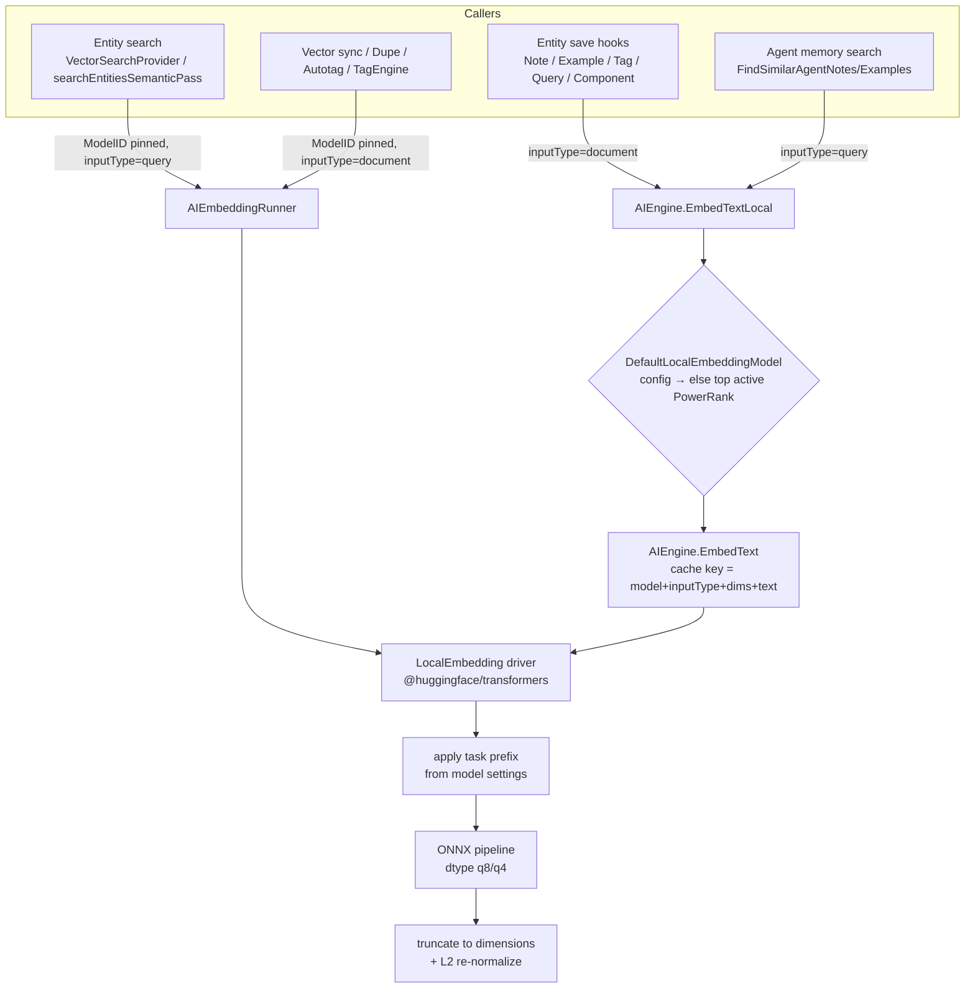
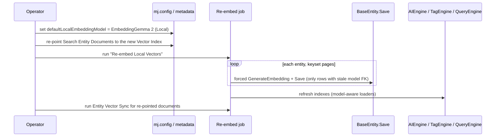

# EmbeddingGemma 2 as MJ's Local Embedding Model

## Status
- **Status**: Draft — plan only, no code yet
- **Created**: 2026-10-07
- **Author**: Amith Nagarajan + Claude
- **Owner**: Colin Brockman
- **Branch**: `claude/embeddinggemma-2-local-embeddings`

## Overview

MemberJunction embeds text locally in several places: entity search, agent memory (notes and
examples), tag matching, the query catalog, components and QueryGen. Today these run on six small
`Xenova/*` models (mostly 384-d, 256–512 token context) through `@xenova/transformers` **2.17**.
Google released **EmbeddingGemma 2** on 2026-10-06. It is a 740M-parameter open model (Apache 2.0)
on the Gemma 4 architecture:
- **Output:** 768-d vectors that can be truncated to 512, 256 or 128 dimensions (Matryoshka).
- **Context:** an **8k-token** window, versus 256–512 for our current local models.
- **Modalities:** text, code, images, audio and video in one vector space.
- **Text path:** about 270M parameters, roughly 191 MB of RAM when quantized.
- **Runtimes:** ONNX via transformers.js, sentence-transformers, Ollama and llama.cpp.

On paper it is a large step up in quality and context length over every local model we ship. It is
also the local counterpart of the cloud `Gemini Embedding 2` model already in our metadata.

**Re-embedding every stored vector is acceptable.** Local inference costs nothing per call, and the
corpora are small: metadata documents, notes, examples, tags, queries and components. The real
obstacle is the plumbing. MJ has no way to change the local embedding model safely:
- The "default local model" is whichever model has the highest `PowerRank`.
- Nothing re-embeds stored vectors when that default changes.
- A corpus with mixed dimensions makes the in-memory vector index throw. The error is caught and
  logged, so agent memory search simply stops working.

This plan therefore:
1. Benchmarks the model on MJ's own retrieval tasks before committing.
2. Builds the plumbing for a model switch: a newer runtime, query/document intent, an explicit
   default, and a re-embed job.
3. If the benchmark wins, makes EmbeddingGemma 2 **the** local model everywhere and re-embeds
   everything.

## Goals & Non-Goals

### Goals
- **Decide with data.** Produce a measured comparison of EmbeddingGemma 2 against our current local
  models on MJ retrieval tasks (recall@k, MRR, CPU latency, RSS), with a written go/no-go.
- **Run it in-process.** `LocalEmbedding` must run EmbeddingGemma 2 inside MJAPI. No external process
  should be required.
- **Support asymmetric retrieval.** Callers can say whether a text is a *query* or a *document*, and
  drivers apply the model's convention.
- **Honor `dimensions` locally.** `LocalEmbedding` should truncate and re-normalize to the requested
  size.
- **Make the default explicit.** The local default must be a deliberate setting, not a side effect of
  `PowerRank`.
- **Re-embed reliably.** A single job re-embeds every persisted local vector to the current default
  model, and is safe to re-run.
- **Fail loudly on stale vectors.** Loaders must never mix vectors from different models in one index.
- **Cut over** (if the go/no-go passes):
  - Notes, examples, tags, queries, components and QueryGen move to EmbeddingGemma 2.
  - Entity search gets a new EmbeddingGemma 2 Vector Index, with Search Entity Documents re-pointed to it.

### Non-Goals
- **Multimodal embedding** (images, audio, video) is out of scope. It is noted as follow-up work for
  Content Autotagging via `AIEngine.EmbedContent`.
- **In-browser (WebGPU) embedding** in MJExplorer is out of scope. All embedding stays server-side.
- **Retiring the six `Xenova/*` models** is out of scope. They stay available and selectable.
- **External vector DB indexes** (Pinecone, Qdrant, SQL Server, pgvector) only get documentation of
  the re-index procedure. No automation.

## Background & Context

### How a local embedding is produced today
- **Driver:** `packages/AI/Providers/LocalEmbeddings/src/models/localEmbedding.ts`.
  - Registered as `@RegisterClass(BaseEmbeddings, 'LocalEmbedding')`.
  - Loads `@xenova/transformers` 2.17 via `eval('import(...)')` (line 81).
  - Hardcodes `pipeline('feature-extraction', id, { quantized: true })` (185) and
    `{ pooling: 'mean', normalize: true }` (309, 369).
  - Ignores `params.dimensions`.
  - Returns an **empty vector on error** instead of failing (332–342, 397–407).
  - `useQuantized` is stored but never read (436–439).
- **Model metadata:** six models in `metadata/ai-models/.ai-models.json` (lines ~1229–1483), each
  with one `MJ: AI Model Vendors` child (`VendorID` = LocalEmbeddings, `DriverClass` = `LocalEmbedding`,
  `APIName` = `Xenova/...`). There is no dimension column; `MaxOutputTokens` informally holds it.

| Model | APIName | PowerRank | Dims | Max tokens |
|---|---|---|---|---|
| gte-small (Local) | Xenova/gte-small | 7 | 384 | 512 |
| paraphrase-multilingual-MiniLM-L12-v2 (Local) | Xenova/paraphrase-multilingual-MiniLM-L12-v2 | 7 | 384 | 128 |
| all-mpnet-base-v2 (Local) | Xenova/all-mpnet-base-v2 | **9** | 768 | 384 |
| all-MiniLM-L12-v2 (Local) | Xenova/all-MiniLM-L12-v2 | 7 | 384 | 256 |
| bge-small-en-v1.5 (Local) | Xenova/bge-small-en-v1.5 | 8 | 384 | 512 |
| all-MiniLM-L6-v2 (Local) | Xenova/all-MiniLM-L6-v2 | 6 | 384 | 256 |

### Two ways a model gets chosen

**1. The "local default", decided by `PowerRank`.**
- `AIEngine.LocalEmbeddingModels` (`packages/AI/Engine/src/AIEngine.ts:1013`) filters to
  type = Embeddings and Vendor = LocalEmbeddings, then sorts by `PowerRank` descending. It does
  **not** filter `IsActive`.
- `EmbedTextLocal` (1043) always uses the first model in that list. Today that is all-mpnet-base-v2.
- These callers use it:
  - **Save hooks** through `EmbedTextLocalHelper` (`packages/MJCoreEntitiesServer/src/custom/util.ts:10`),
    called from `BaseEntity.GenerateEmbedding` (`packages/MJCore/src/generic/baseEntity.ts:~7014`):
    - `MJAIAgentNoteEntityServer` (Note)
    - `MJAIAgentExampleEntityServer` (ExampleInput)
    - `MJTagEntityServer` ("Name: Description")
    - `MJComponentEntityServer` (FunctionalRequirements, TechnicalDesign)
    - `MJQueryEntityServer` (Name + UserQuestion + Description)
  - **Agent memory search:** `AIEngine.FindSimilarAgentNotes` / `FindSimilarAgentExamples`.
  - **QueryGen:** `packages/QueryGen/src/vectors/EmbeddingService.ts`. Its `modelName` constructor
    argument is unused.
  - **`GenericDatabaseProvider.searchEntitiesSemanticPass`**, but only when `EntityDocument.AIModelID`
    is null.
  - **`RunAIPromptResolver.selectEmbeddingModelBySize`**
    (`packages/MJServer/src/resolvers/RunAIPromptResolver.ts:577`). It picks "small" (lowest rank)
    or "medium" (middle **by index**), so adding any model shifts what callers get.

**2. A pinned model, through `AIEmbeddingRunner` with `ModelID`.**
- Source: `packages/AI/Prompts/src/embedding/AIEmbeddingRunner.ts`.
- Callers:
  - **Entity search:** `SearchEngine/src/generic/VectorSearchProvider.ts` groups indexes by
    `EmbeddingModelID` and passes `Dimensions`.
  - **Vector sync:** `AI/Vectors/Sync/src/models/entityVectorSync.ts` uses `EntityDocument.AIModelID`
    plus `VectorIndex.Dimensions`.
  - **Duplicate detection:** `AI/Vectors/Dupe/src/duplicateRecordDetector.ts`. It does **not** pass
    `Dimensions`.
  - **Content Autotagging:** `ContentAutotagging/src/Engine/generic/AutotagBaseEngine.ts` uses
    ContentSource → ContentType → the first VectorIndex.
  - **TagEngine:** `AI/Knowledge/TagEngine/src/TagEngine.ts` takes the "Tag Semantic Matching"
    prompt's model, which today is all-MiniLM-L6-v2 at 384-d.
- **Every Search Entity Document** (`metadata/entity-documents/.entity-documents.json`) uses
  **gte-small (Local)** through the "Default - SVS + gte-small (Local)" Vector Index
  (`metadata/vector-indexes/.svs-default-gte-small.json`).

### How vectors are tied to a model
- **Model FK columns:** `EmbeddingModelID` on AIAgentNote, AIAgentExample, Tag, Query, ContentItem,
  ContentSource and ContentType. Component has `FunctionalRequirementsVectorEmbeddingModelID` and
  `TechnicalDesignVectorEmbeddingModelID`. VectorIndex carries `EmbeddingModelID` and `Dimensions`.
- **EntityRecordDocument** is tied to a model only through its EntityDocument / VectorIndex.
- **Storage:** vectors are stored as JSON plus a float32 binary companion. Readers prefer the binary
  form via `ReadStoredVector` (`packages/AI/Vectors/Memory/src/models/StoredVector.ts`).
- **Re-embed logic** exists only in TagEngine (`RebuildTagEmbeddings`, ~379). Elsewhere:
  - `GenerateEmbedding` re-embeds only when the record is new or the source field is dirty. It never
    re-embeds because the **model** changed.
  - `AIEngine.RegenerateEmbeddings` only re-reads stored vectors.
- **Dimension mismatch:** `SimpleVectorService.validateAndSetDimensionCount`
  (`packages/AI/Vectors/Memory/src/models/SimpleVectorService.ts:~1280`) **throws**.
  - `AIEngine.RefreshNoteEmbeddings` / `RefreshExampleEmbeddings` and
    `QueryEngineServer.RefreshQueryEmbeddings` catch and log it, so the index silently degrades.
  - None of them filters on `EmbeddingModelID`.

### Existing defects found during the survey (fix in Phase 1)
1. **Tags are written with one model and indexed with another.** `MJTagEntityServer` embeds with
   the default local model (mpnet, 768-d) and stamps that ID, but TagEngine's index is pinned to
   MiniLM-L6 (384-d). `TagEngine.AddOrUpdateSingleTagEmbeddingFromPersisted` (~446) does not check
   the model, so `AddVector` throws on every live tag save. The error is caught and logged at
   `MJTagEntityServer.server.ts:83`.
2. **Inactive models can become the default.** `LocalEmbeddingModels` doesn't filter `IsActive`,
   although integration check AE5 claims it does
   (`packages/TestingFramework/integration-test-suite/src/checks/ai-embeddings.checks.ts:313`).
3. **`BGEReRanker` uses an undeclared package.** It imports `@xenova/transformers`
   (`packages/SearchEngine/src/rerankers/BGEReRanker.ts:56`) but `packages/SearchEngine/package.json`
   doesn't declare it, so it likely fails to resolve under strict pnpm.
4. **Duplicate detection ignores `Dimensions`.** `duplicateRecordDetector` doesn't pass
   `VectorIndex.Dimensions` to the runner; Sync does.
5. **`LocalEmbedding` hides failures.** It returns `[]` on failure, so callers can persist or cache
   an empty vector without noticing.

### What EmbeddingGemma 2 needs that we don't have
| Need | Today |
|---|---|
| A newer transformers.js (`@huggingface/transformers` v3+, possibly v4 for Gemma 4). Uses `dtype`/`device`, not `quantized` | v2.17 only |
| Query/document task prompts (`task: search result \| query: …`, `title: none \| text: …`) | No concept in `EmbedTextParams` / `EmbeddingRunParams` |
| Matryoshka truncation (768 → 512/256/128) plus re-normalize | `dimensions` ignored by the local driver |
| 8k-token inputs | Callers don't truncate. `MaxInputTokens` caps at 512 |
| A safe model switch | No re-embed job. Loaders not model-aware |

> ⚠️ **Verify before Phase 1.** Confirm the exact ONNX repo ID, the required transformers.js
> version, the dtype variants (q4/q8/fp16/fp32), the pooled-output name and the exact prompt strings
> from the model card at `huggingface.co/onnx-community/embeddinggemma-2-ONNX` and
> `huggingface.co/google/embeddinggemma-2`. This plan was written from release coverage; the model
> card itself could not be fetched.

## Architecture / Design

### Design decisions

**D1 — Upgrade `LocalEmbedding` in place to `@huggingface/transformers`.**
- The `Xenova/*` repos ship v3-compatible ONNX, so one runtime serves all local models.
- It avoids carrying two copies of onnxruntime.
- Because we are re-embedding anyway, tiny numeric drift from the runtime change doesn't matter.
- **Fallback:** if any existing model breaks on v3+, add a sibling driver class
  (`LocalEmbeddingHF`) and point only EmbeddingGemma 2's vendor row at it.
- `BGEReRanker` moves to the same package and declares it (fixes defect 3).

**D2 — Query/document intent is a first-class optional parameter.** Add `inputType` to the core
param types. Each driver maps it to its own convention. Callers never write model-specific prefixes.
```ts
// packages/AI/Core/src/generic/embed.types.ts
export type EmbeddingInputType = 'query' | 'document';

export type EmbedTextParams = BaseParams & {
    text: string;
    dimensions?: number;
    /** Retrieval role of this text. Drivers for asymmetric models apply their own
     *  prompt/prefix; symmetric models ignore it. Omitted = 'document'. */
    inputType?: EmbeddingInputType;
};
// same field on EmbedTextsParams and EmbedContentParams
```
- `EmbeddingRunParams` (`packages/AI/Prompts/src/embedding/embedding-runner.types.ts`) gains
  `InputType?: EmbeddingInputType`, passed through in `executeOnCandidate`.
- `AIEngine.EmbedText(model, text, apiKey?, options)` gains `options.inputType` and
  `options.dimensions`, and `buildEmbeddingCacheKey` must include **both**.
- **Where the prefixes live: in metadata, not in driver code.** Hardcoding Gemma strings in
  `LocalEmbedding` is a special case; it would just be the next model's `if`. Two options:
  - **Preferred:** add `QueryPrefix` / `DocumentPrefix` (or a JSON `EmbeddingSettings`) to
    `MJ: AI Model Vendors`. This needs a migration.
  - **Migration-free:** carry them in the driver's `SetAdditionalSettings` keyed by `APIName`,
    following the Cohere `inputType` pattern (`Cohere/src/models/CohereEmbedding.ts:20,145`).
  - Decide in Phase 1. The migration-free option is acceptable for the first cut.
- Existing drivers map `inputType` as follows:
  - **Cohere:** `search_query` / `search_document`
  - **Bedrock (Cohere-on-Bedrock):** `input_type`
  - **Gemini:** the task prefix
  - **OpenAI / Mistral:** ignore it

**D3 — Make the local default an explicit setting.**
- `AIEngine` gets `DefaultLocalEmbeddingModel`:
  1. an explicitly configured model name, set at server startup from an `mj.config.cjs` key (for
     example `aiSettings.defaultLocalEmbeddingModel`) via `AIEngine.SetDefaultLocalEmbeddingModel()`
  2. else the highest `PowerRank` **active** local model (today's behavior, minus defect 2)
- `EmbedTextLocal`, `EmbedTextLocalHelper`, QueryGen and the null-`AIModelID` fallback all go through
  it.
- `PowerRank` goes back to meaning "quality rank" and never silently re-points the platform.
- `selectEmbeddingModelBySize` stops picking by array index. "small" = lowest-rank active model,
  "medium"/default = `DefaultLocalEmbeddingModel`.

**D4 — Loaders are model-aware.** Each of these loads only rows whose `EmbeddingModelID` equals the
model its index serves:
- `AIEngine.RefreshNoteEmbeddings` / `RefreshExampleEmbeddings` and their single-row add paths
- `QueryEngineServer.RefreshQueryEmbeddings`
- `TagEngine.AddOrUpdateSingleTagEmbeddingFromPersisted`

Mismatched rows are counted and reported, with one warning per load that gives the count and points
to the re-embed job. They never reach `AddVector`.

**D5 — Re-embed when the model changed, not only when the text changed.**
- `BaseEntity.GenerateEmbedding` also re-embeds when `modelField.Value` differs from the current
  default model ID. Records then heal lazily on their next save.
- Add a **forced** variant used by the bulk job. Both still go through `BaseEntity.Save()`; no
  direct SQL DML (see `.claude/rules/data-access.md`).

**D6 — Re-embed job.**
- A server-side `LocalEmbeddingMigrationService`, exposed as an Action ("Re-embed Local Vectors")
  and an `mj` CLI command.
- For each persisted-vector entity (Agent Notes, Agent Examples, Tags, Queries, Components):
  1. Iterate records whose model FK ≠ the target, using keyset pagination (`AfterKey`).
  2. Batch-embed with `inputType: 'document'`.
  3. Save through `BaseEntity`.
  4. Refresh the matching engine index at the end.
- Idempotent and resumable, because already-migrated rows are skipped by the FK filter.
- Reports per-entity counts.
- **Entity search** re-embeds through the existing vector sync for each re-pointed Entity Document,
  not this service.
- **TagEngine** reuses `RebuildTagEmbeddings`.

### Component / flow design





### API changes
- **`@memberjunction/ai`:** `EmbeddingInputType`, and `inputType?` on `EmbedTextParams`,
  `EmbedTextsParams` and `EmbedContentParams`. Additive.
- **`@memberjunction/ai-prompts`:** `EmbeddingRunParams.InputType?`. Additive.
- **`@memberjunction/aiengine`:**
  - `EmbedText` options gain `inputType` / `dimensions`.
  - New `DefaultLocalEmbeddingModel` getter and `SetDefaultLocalEmbeddingModel(name)`.
  - `EmbedTextLocal(text, options?)`.
  - All additive.
- **GraphQL `EmbedText` mutation:** optional `inputType` argument. Additive.
  `GraphQLAIClient.EmbedText` and the React runtime `utilities.ai.EmbedText` follow.
- **New Action:** "Re-embed Local Vectors" (params: `TargetModel?`, `Entities?`, `DryRun`).

## Implementation Plan

### Phase 0: Benchmark and go/no-go (no production code)
1. **Spike the runtime.** In a scratch script (or `packages/AI/Core/scripts/live-embedding-checks/`),
   load the EmbeddingGemma 2 ONNX via `@huggingface/transformers`. Record:
   - the required library version and working `dtype`s
   - the output tensor and pooling to use
   - cold-load time, RSS and per-text CPU latency (p50/p95) at 128/512/2k tokens, for q8 and q4
2. **Quick quality signal with no code.** Add temporary local-only `AI Model` + `AI Model Vendor`
   rows for the existing `OllamaEmbedding` driver (`packages/AI/Providers/Ollama/src/models/ollama-embeddings.ts`),
   with Ollama serving EmbeddingGemma 2. Run it on pinned-model paths only.
3. **Evaluation harness.** Compare gte-small, bge-small, all-mpnet and EmbeddingGemma 2 (768 and
   256 dims) on MJ's own data:
   - **Entity search:** queries against MJ Entities/Actions/Agents/Prompts/AI Models/Queries
     documents, with hand-labeled targets (30–50 queries).
   - **Agent memory:** note/example retrieval from a labeled sample.
   - **Tag matching:** labeled content → tag pairs from Content Autotagging fixtures.
   - **Query catalog:** natural-language questions → the expected Query.
   - **Metrics:** recall@5/10, MRR, latency and RSS.
4. **Write the go/no-go** as a section appended to this plan.
   - **Gate:** EmbeddingGemma 2 beats the current best local model on recall@10 / MRR on at least 3
     of 4 tasks, with acceptable CPU latency on the MJAPI target hardware.
   - **Also decide the stored dimension** (768 vs 256), using the quality/storage trade-off measured
     in step 3.

### Phase 1: Plumbing, independent of model choice (ship even on a no-go)
1. **Runtime upgrade** (`packages/AI/Providers/LocalEmbeddings`):
   - Replace `@xenova/transformers` with `@huggingface/transformers` in `package.json`.
   - Use `dtype` (from settings, default `q8`) instead of `quantized`, and remove the dead
     `useQuantized`.
   - Keep the memoized module load. Document it as a category-3 dynamic import (heavy native module
     deferred to first use), and keep the dependency declared.
   - **Honor `dimensions`:** slice to `dimensions`, then L2 re-normalize. Fail clearly when
     `dimensions` exceeds the native size.
   - **Apply `inputType`** using the model's configured prefixes (D2).
   - **Truncate input** to the vendor row's `MaxInputTokens` using the tokenizer, not chars ÷ 4.
     Report real token counts in `ModelUsage`.
   - **Throw on failure** instead of returning `[]` (defect 5). Check callers that depended on the
     empty vector.
   - Replace the `Promise.all` batch with true batched pipeline calls (one call per batch).
2. **`BGEReRanker`:** migrate to `@huggingface/transformers` and declare it in
   `packages/SearchEngine/package.json` (defect 3).
3. **Core params:** add `EmbeddingInputType` / `inputType` to `packages/AI/Core/src/generic/embed.types.ts`.
   Map it in the Cohere, Bedrock and Gemini drivers.
4. **Runner:** add `InputType` to `embedding-runner.types.ts` and pass it in
   `AIEmbeddingRunner.executeOnCandidate` (~552).
5. **AIEngine** (`packages/AI/Engine/src/AIEngine.ts`):
   - Filter `IsActive` in `LocalEmbeddingModels` (defect 2).
   - Add `DefaultLocalEmbeddingModel` + `SetDefaultLocalEmbeddingModel`, and route `EmbedTextLocal`
     through it.
   - Add `inputType` / `dimensions` to `EmbedText` and to `buildEmbeddingCacheKey`.
   - `FindSimilarAgentNotes` / `FindSimilarAgentExamples` embed the query with `inputType: 'query'`.
   - `RefreshNoteEmbeddings` / `RefreshExampleEmbeddings` / `AddOrUpdateSingle*` load only rows
     matching the default model (D4).
6. **MJServer:**
   - Read `aiSettings.defaultLocalEmbeddingModel` from config at startup and call
     `AIEngine.SetDefaultLocalEmbeddingModel`.
   - Fix `selectEmbeddingModelBySize` (D3).
   - Add the optional `inputType` argument to the `EmbedText` mutation.
7. **BaseEntity / MJCoreEntitiesServer:**
   - `GenerateEmbedding` re-embeds on model mismatch and gains a forced mode (D5).
   - `EmbedTextLocalHelper` passes `inputType: 'document'`.
8. **TagEngine:**
   - Make `AddOrUpdateSingleTagEmbeddingFromPersisted` model-aware (defect 1).
   - **Decide** whether Tag Semantic Matching follows the platform default or stays pinned via its
     prompt. Recommendation: follow the default, so tag vectors are written once by the save hook
     and read by the engine with the same model.
9. **Other consumers:**
   - **QueryEngineServer:** model-aware `RefreshQueryEmbeddings`; query embeddings use `'query'`.
   - **QueryGen `EmbeddingService`:** use the default model, drop the unused `modelName`, use
     `inputType`.
   - **`VectorSearchProvider` / `searchEntitiesSemanticPass`:** query side uses `'query'`.
   - **`entityVectorSync`, `AutotagBaseEngine`, `duplicateRecordDetector`:** document side uses
     `'document'`. Dupe also passes `Dimensions` (defect 4).
10. **Re-embed job (D6):**
    - `LocalEmbeddingMigrationService` in `MJCoreEntitiesServer` (or a new small server package).
    - Exposed via a "Re-embed Local Vectors" Action, with Action metadata JSON.
    - Plus an `mj ai reembed` CLI command (`packages/MJCLI`).

### Phase 2: EmbeddingGemma 2 metadata and cutover (only on a go)
1. **Metadata (declarative JSON only; the release Metadata_Sync carries it, per MJ convention):**
   - **AI Model** in `metadata/ai-models/.ai-models.json`: `EmbeddingGemma 2 (Local)`, type
     Embeddings. Set `PowerRank` to 10 as a quality rank; it no longer drives the default.
     `SpeedRank` and `ModelSelectionInsights` come from the measured numbers.
   - **AI Model Vendor:** LocalEmbeddings, `DriverClass: LocalEmbedding`,
     `APIName: onnx-community/embeddinggemma-2-ONNX` (verify), `MaxInputTokens: 8192` (verify) and
     the prefixes (D2).
   - **Vector Index:** `metadata/vector-indexes/.svs-embeddinggemma-2.json`, "SVS + EmbeddingGemma 2
     (Local)", with `Dimensions` set to the Phase 0 choice.
   - **Entity Documents:** re-point the Search documents in
     `metadata/entity-documents/.entity-documents.json` (`AIModelID` + `VectorIndexID`).
   - **Embedding prompts:** update "Tag Semantic Matching" in
     `metadata/prompts/.embedding-prompts.json` per the Phase 1.8 decision.
2. **Default:** document `aiSettings.defaultLocalEmbeddingModel: 'EmbeddingGemma 2 (Local)'` in the
   config template and the AI Engine README.
3. **Cutover runbook:** set the default, run "Re-embed Local Vectors", run entity vector sync for the
   re-pointed documents, run `RebuildTagEmbeddings`, then restart MJAPI to rebuild engine caches.
4. **Keep "Default - SVS + gte-small (Local)"** for hosts that opt out.

### Phase 3 (follow-up, separate plan): multimodal
- Content Autotagging embeds images and audio through `AIEngine.EmbedContent` into the same space as
  text, enabling cross-modal search over content items.

## Migration & Data
- **Phase 1 and Phase 2 work without a schema migration** if D2 uses the migration-free option
  (prefixes in driver settings).
- If the preferred metadata columns are chosen:
  - Add `QueryPrefix NVARCHAR(500) NULL` and `DocumentPrefix NVARCHAR(500) NULL` on
    `${flyway:defaultSchema}.AIModelVendor`, in one `ALTER TABLE`, with `sp_addextendedproperty` for
    each.
  - Follow `migrations/CLAUDE.md`: apply-time `MAX(Sequence)+1` for the CodeGen `EntityField` insert,
    and CodeGen output appended.
- **Metadata:** the PR adds declarative JSON only. The consolidated `Metadata_Sync` migration is
  produced at release by the build engineer.
- **Data:** every persisted local vector (Notes, Examples, Tags, Queries, Components) and every
  Search EntityRecordDocument is re-embedded by the job and by vector sync. External vector DB
  indexes need a new index at the new dimension plus a re-sync. Document this; don't automate it.
- **Upgraded hosts with no config set:**
  - The default falls back to the highest-`PowerRank` *active* model.
  - With EmbeddingGemma 2 at `PowerRank` 10, that **is** a model switch. The model-aware loaders
    make it safe (stale rows are skipped and reported, not crashed on) and lazy re-embed heals
    rows on save.
  - The release notes must tell operators to run the re-embed job.
  - **Open question:** ship `PowerRank` 10 (implicit cutover) or below 9 plus an explicit config
    opt-in. See below.

## Testing Strategy
- **Unit tests, `LocalEmbeddings`:**
  - `dtype` passthrough
  - prefix application per `inputType`
  - `dimensions` truncation + re-normalization (unit norm, correct length, error when larger than
    native)
  - token-based truncation
  - throws on load failure
  - batched calls
- **Unit tests, `AIEngine`:**
  - default resolution (config wins, inactive filtered, PowerRank fallback)
  - cache key includes `inputType` / `dimensions`
  - loaders skip mismatched-model rows and report the count
- **Unit tests, `AIEmbeddingRunner`:** `InputType` reaches the driver.
- **Unit tests, `BaseEntity.GenerateEmbedding`:**
  - re-embeds on model mismatch
  - doesn't re-embed when model and text are unchanged
  - forced mode
- **Unit tests, TagEngine:** model-aware single-tag add.
- **Unit tests, `RunAIPromptResolver`:** `selectEmbeddingModelBySize` is stable when models are added.
- **Other drivers:** Cohere, Bedrock and Gemini map `inputType`.
- **Integration (deterministic tier):**
  - Extend `ai-embeddings.checks.ts` (AE1–AE5) and `.IT45-ai-embeddings.json`.
  - Fix AE5's `IsActive` claim.
  - Add: a model switch followed by the re-embed job leaves zero stale rows and a working note index.
  - Add: query/document embeddings differ for EmbeddingGemma 2.
- **Live check:** extend `packages/AI/Core/scripts/live-embedding-checks/` with an EmbeddingGemma 2
  case (load, embed, dims, norm).
- **Benchmarks:** the Phase 0 harness stays in the repo so future model swaps get the same go/no-go.
- **Performance:** measure save latency for a Note/Tag save with EmbeddingGemma 2 on CPU. If p95 is
  unacceptable, see the save-path risk below.

## Risks & Open Questions
- **Runtime support:** Gemma 4-architecture ONNX may need a transformers.js version newer than v3.
  Confirm in Phase 0. Fallback: the Ollama driver for evaluation, or the D1 sibling driver.
- **Save-path latency:** about 270M parameters on CPU makes synchronous embedding in `Save()`
  noticeably slower than MiniLM. Mitigations, in order:
  1. q4 dtype
  2. 256-d output (doesn't cut compute, only storage)
  3. move save-hook embedding off the save path (save, then embed asynchronously and update)
  4. keep a small model for save hooks and EmbeddingGemma 2 for search only
  Decide with Phase 0 numbers.
- **Memory:** about 0.2–0.6 GB RSS per MJAPI process. Check against container limits. Don't load the
  vision/audio encoders.
- **Implicit cutover on upgrade:** if `PowerRank` 10 makes it the fallback default, upgrading hosts
  switch models on restart.
  - **Recommendation:** ship it as the default only together with Phase 1's model-aware loaders and
    lazy re-embed. Call out the re-embed job in release notes.
  - **Alternative:** `PowerRank` 8 and opt-in via config. **Needs a decision from Amith.**
- **Prompt strings and repo IDs** were taken from release coverage. Verify against the model card.
- **Multilingual:** check quality against `paraphrase-multilingual-MiniLM-L12-v2` for non-English
  hosts during Phase 0.
- **External vector DBs:** a dimension change requires new indexes. Only document it here.

## Files to Modify

| File | Change |
|------|--------|
| `packages/AI/Providers/LocalEmbeddings/package.json` | `@xenova/transformers` → `@huggingface/transformers` |
| `packages/AI/Providers/LocalEmbeddings/src/models/localEmbedding.ts` | dtype, prefixes/`inputType`, `dimensions` truncation + renorm, token truncation, throw on failure, true batching |
| `packages/AI/Providers/LocalEmbeddings/src/__tests__/LocalEmbedding.test.ts` | New/updated tests |
| `packages/AI/Providers/LocalEmbeddings/README.md` | Runtime, settings, EmbeddingGemma 2 |
| `packages/AI/Core/src/generic/embed.types.ts` | `EmbeddingInputType`, `inputType?` |
| `packages/AI/Providers/Cohere/src/models/CohereEmbedding.ts` | Map `inputType` |
| `packages/AI/Providers/Bedrock/src/models/bedrockEmbedding.ts` | Map `inputType` |
| `packages/AI/Providers/Gemini/src/geminiEmbedding.ts` | Map `inputType` to the task prefix |
| `packages/AI/Prompts/src/embedding/embedding-runner.types.ts` | `InputType?` |
| `packages/AI/Prompts/src/embedding/AIEmbeddingRunner.ts` | Pass `inputType` to the driver |
| `packages/AI/Engine/src/AIEngine.ts` | `IsActive` filter, `DefaultLocalEmbeddingModel`, `EmbedText` options + cache key, model-aware loaders, query-side `inputType` |
| `packages/AI/Engine/src/__tests__/AIEngine.test.ts` | Tests |
| `packages/MJCore/src/generic/baseEntity.ts` | `GenerateEmbedding` model-mismatch + forced mode |
| `packages/MJCoreEntitiesServer/src/custom/util.ts` | `inputType: 'document'` |
| `packages/MJCoreEntitiesServer/src/custom/MJTagEntityServer.server.ts` | Follows TagEngine model decision |
| `packages/MJCoreEntitiesServer/src/engines/QueryEngineServer.ts` | Model-aware refresh |
| `packages/AI/Knowledge/TagEngine/src/TagEngine.ts` | Model-aware single-tag add; default-model decision |
| `packages/AI/Knowledge/TagEngine/src/__tests__/TagEngine.embeddingModel.test.ts` | Tests |
| `packages/QueryGen/src/vectors/EmbeddingService.ts` | Default model, `inputType`, drop unused `modelName` |
| `packages/SearchEngine/src/generic/VectorSearchProvider.ts` | Query-side `inputType` |
| `packages/SearchEngine/src/rerankers/BGEReRanker.ts` + `packages/SearchEngine/package.json` | New runtime, declared dependency |
| `packages/GenericDatabaseProvider/src/GenericDatabaseProvider.ts` | Query-side `inputType`; default-model fallback |
| `packages/AI/Vectors/Sync/src/models/entityVectorSync.ts` | Document-side `inputType` |
| `packages/AI/Vectors/Dupe/src/duplicateRecordDetector.ts` | `inputType`, pass `Dimensions` |
| `packages/ContentAutotagging/src/Engine/generic/AutotagBaseEngine.ts` | Document-side `inputType` |
| `packages/MJServer/src/resolvers/RunAIPromptResolver.ts` | `selectEmbeddingModelBySize`, `inputType` arg |
| `packages/MJServer/src/config.ts` | `aiSettings.defaultLocalEmbeddingModel` |
| `packages/GraphQLDataProvider/src/graphQLAIClient.ts`, `packages/React/runtime/src/utilities/runtime-utilities.ts` | Optional `inputType` passthrough |
| New: `LocalEmbeddingMigrationService` + Action class, `packages/MJCLI` `ai reembed` command | Re-embed job |
| `metadata/ai-models/.ai-models.json` | EmbeddingGemma 2 (Local) + vendor row |
| `metadata/vector-indexes/.svs-embeddinggemma-2.json` (new) | New Vector Index |
| `metadata/entity-documents/.entity-documents.json` | Re-point Search documents |
| `metadata/prompts/.embedding-prompts.json` | Tag Semantic Matching model |
| `metadata/actions/...` | "Re-embed Local Vectors" Action |
| `packages/TestingFramework/integration-test-suite/src/checks/ai-embeddings.checks.ts`, `metadata-optional/integration-test/tests/integration/.IT45-ai-embeddings.json` | Integration coverage |
| `packages/AI/Core/scripts/live-embedding-checks/` | EmbeddingGemma 2 live check + benchmark harness |
| `.changeset/*.md` | `patch` for code-only PRs; `minor` if D2 adds a migration |

## References
- Google: [EmbeddingGemma 2 announcement](https://blog.google/innovation-and-ai/technology/developers-tools/embeddinggemma-2/)
- Model cards (verify details): `huggingface.co/google/embeddinggemma-2`, `huggingface.co/onnx-community/embeddinggemma-2-ONNX`
- [EmbeddingGemma 2 developer guide](https://developers.googleblog.com/embeddinggemma-2-the-developer-guide/)
- MJ guides: `guides/BASE_ENTITY_SERVER_PATTERNS.md` (persisted embeddings), `guides/BINARY_FIELDS_GUIDE.md`,
  `guides/ENTITY_SEARCH_GUIDE.md`, `guides/SEARCH_OVERVIEW_GUIDE.md`, `guides/TAXONOMY_TAGGING_GUIDE.md`,
  `guides/AGENT_MEMORY_GUIDE.md`, `guides/KEYSET_PAGINATION_GUIDE.md`, `guides/RECORD_SET_PROCESSING_GUIDE.md`
