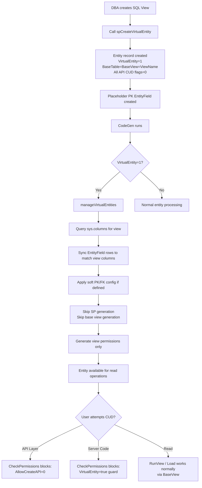
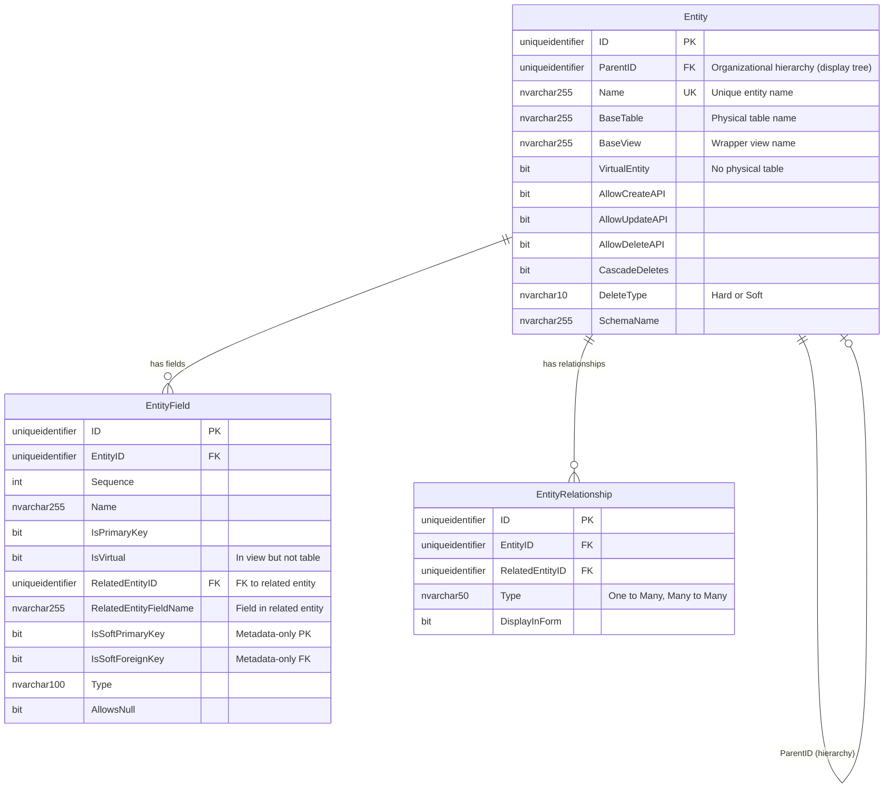
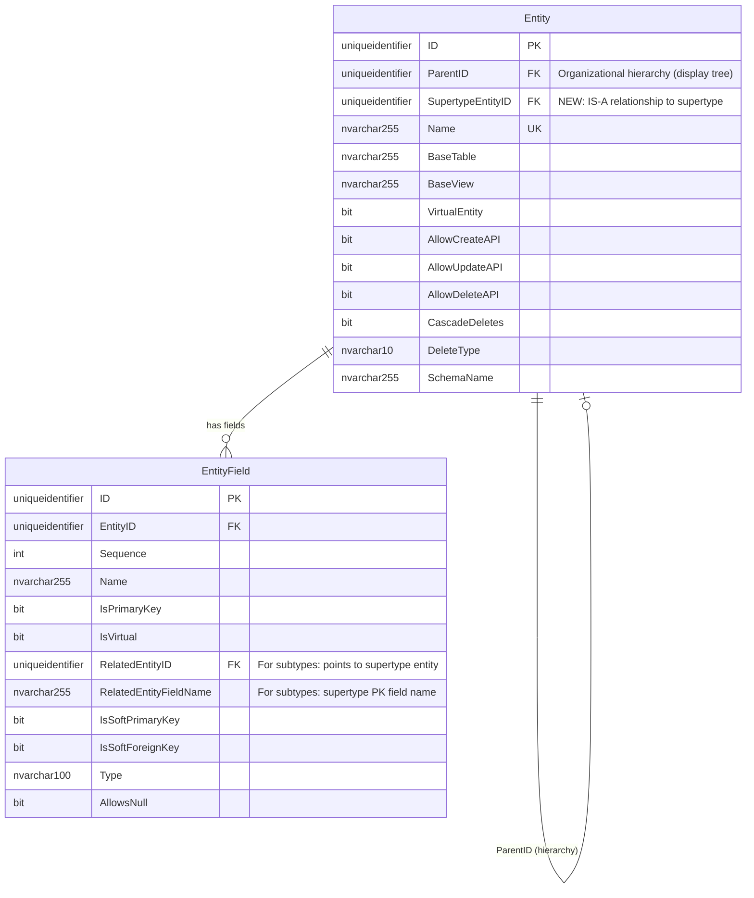
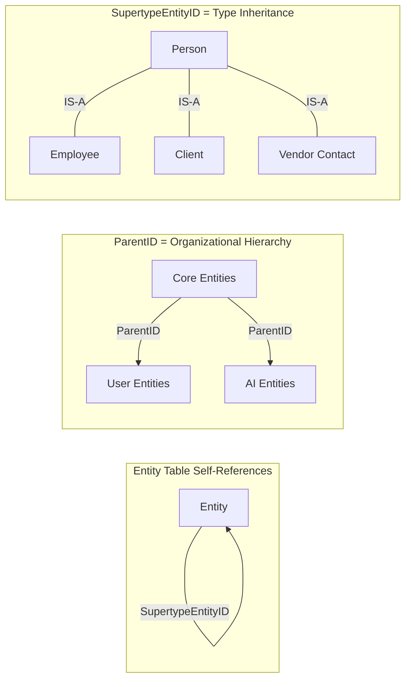
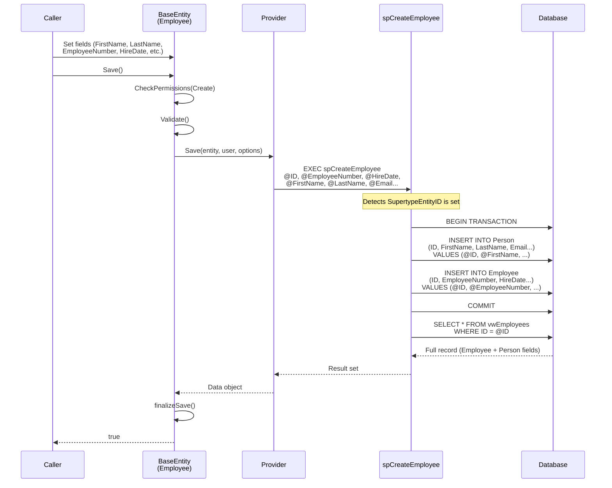
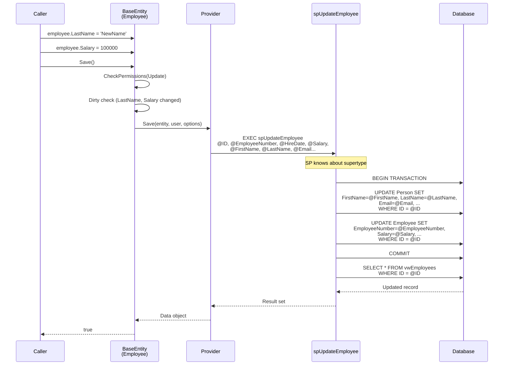
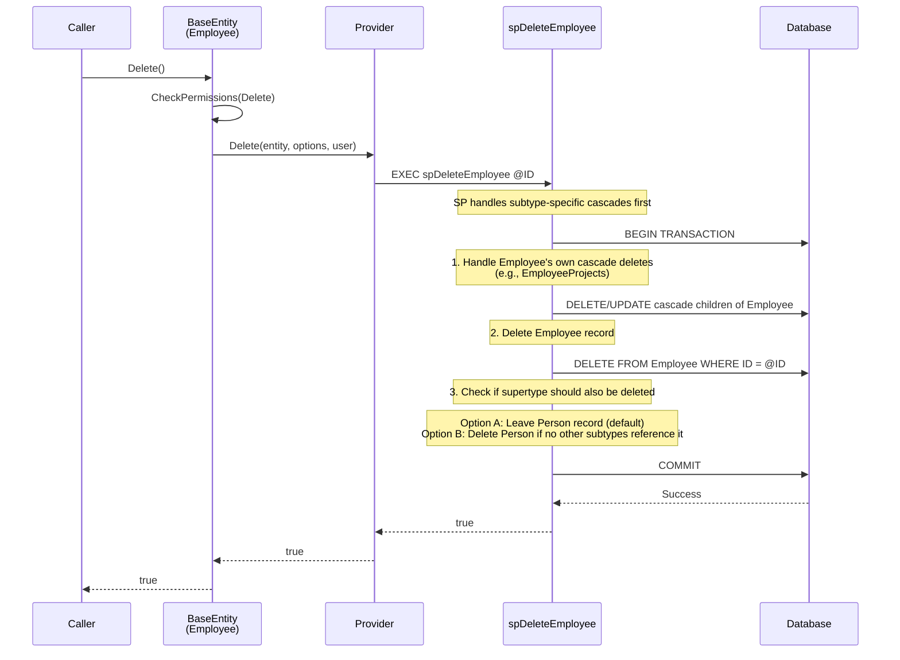
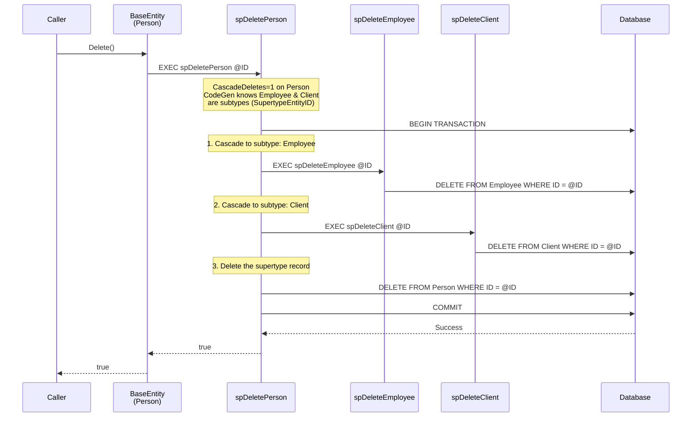
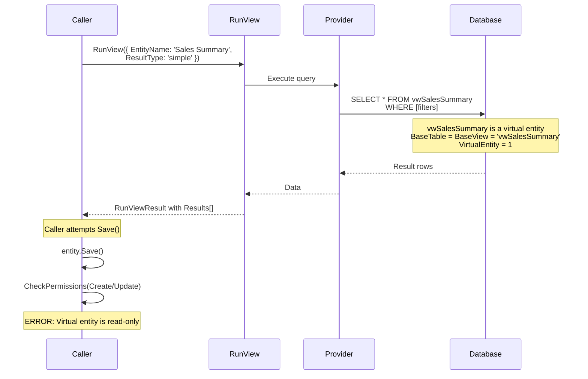

# Entity System Enhancements: Virtual Entities & Supertype/Subtype Modeling

## Table of Contents
1. [Executive Summary](#executive-summary)
2. [Terminology: Why "Supertype/Subtype"](#terminology-why-supertypesubtype)
3. [Enhancement 1: Virtual Entities — Tightening the System](#enhancement-1-virtual-entities)
4. [Enhancement 2: Supertype/Subtype (IS-A) Relationships](#enhancement-2-supertypesubtype-is-a-relationships)
5. [Metadata Schema Changes (ERD)](#metadata-schema-changes-erd)
6. [Example Domain: Person / Employee / Client](#example-domain)
7. [Operation Flow Diagrams](#operation-flow-diagrams)
8. [CodeGen Changes](#codegen-changes)
9. [BaseEntity Runtime Changes](#baseentity-runtime-changes)
10. [UI Integration](#ui-integration)
11. [Migration Plan](#migration-plan)
12. [Open Questions & Future Work](#open-questions--future-work)

---

## Executive Summary

This plan covers two related enhancements to MemberJunction's entity system:

1. **Virtual Entities** — Entities backed only by a SQL view with no physical table. The infrastructure mostly exists (`VirtualEntity=1`, `spCreateVirtualEntity`, `manageVirtualEntities()` in CodeGen). This enhancement tightens the system so virtual entities are first-class citizens with proper read-only enforcement, composite PK support, and UI awareness.

2. **Supertype/Subtype Modeling** — First-class support for IS-A relationships (e.g., Employee IS-A Person). A new `SupertypeEntityID` column on the Entity table, combined with shared primary keys and CodeGen auto-joining, enables unified views, transactional saves, and cascade-aware deletes across the type hierarchy.

---

## Terminology: Why "Supertype/Subtype"

We use **Supertype** and **Subtype** as the primary terminology for IS-A relationships. Here's why:

| Term | Origin | Why We Use / Don't Use |
|------|--------|----------------------|
| **Supertype / Subtype** | Entity-Relationship (ER) modeling, Peter Chen (1976), extended by Elmasri & Navathe | **Canonical ER term.** Universally understood in data modeling. Unambiguous. |
| Base / Derived | Object-oriented programming | Conflicts with `BaseTable`, `BaseView`, `BaseEntity` already in MJ codebase |
| Parent / Child | General hierarchical modeling | Conflicts with `ParentID` on Entity table (used for organizational hierarchy, NOT IS-A) |
| Foundation / Extension | Custom | Not standard in any modeling discipline |
| Generalization / Specialization | ER theory (academic) | Correct but verbose; describes the *process*, not the *entities* |
| Table-Per-Type (TPT) | ORM pattern (Entity Framework, Hibernate) | Describes the *storage pattern*, not the *relationship* |

**Key distinction**: `ParentID` on the Entity table represents organizational hierarchy (grouping entities in a tree for display purposes). `SupertypeEntityID` represents type inheritance (Employee IS-A Person). These are fundamentally different relationships and must not be conflated.

The academic literature (Elmasri & Navathe's "Fundamentals of Database Systems", the definitive text) defines:
- **Supertype**: The general entity (Person) — also called the "generalization"
- **Subtype**: The specialized entity (Employee, Client) — also called the "specialization"
- **IS-A relationship**: The link connecting them (Employee IS-A Person)

---

## Enhancement 1: Virtual Entities

### Current State

Virtual entities already work in MJ. The existing implementation:

- `Entity.VirtualEntity = 1` flag exists
- `spCreateVirtualEntity` SP creates entity metadata with APIs disabled
- `BaseTable` is set to the same value as `BaseView` (the view name)
- CodeGen's `manageVirtualEntities()` syncs EntityField metadata from view columns
- CodeGen skips SP and base view generation for virtual entities (`sql_codegen.ts` lines 576, 626, 662, 698)

### BaseTable = BaseView: Not a Hack

Setting `BaseTable` to the view name is **pragmatically correct**. External systems and even internal code that does `SELECT * FROM [BaseTable]` will work fine because a view is SELECT-able just like a table. The `VirtualEntity=1` flag is the authoritative signal for "no physical table exists." CodeGen and BaseEntity use that flag (not table name comparisons) to gate behavior. No schema change needed here.

### What Needs Tightening

#### 1A. BaseEntity Read-Only Enforcement

**Problem**: `BaseEntity.Save()` and `BaseEntity.Delete()` do NOT check `VirtualEntity`. The API flags (`AllowCreateAPI=0`, etc.) gate the GraphQL layer via `CheckPermissions()` (`baseEntity.ts:1466-1528`), but nothing prevents server-side code from calling `.Save()` on a virtual entity object.

**Solution**: Add explicit guard in `CheckPermissions()`:

```typescript
// In BaseEntity.CheckPermissions() - early exit for virtual entities
if (this.EntityInfo.VirtualEntity &&
    (type === EntityPermissionType.Create ||
     type === EntityPermissionType.Update ||
     type === EntityPermissionType.Delete)) {
    const msg = `Cannot ${type} on virtual entity '${this.EntityInfo.Name}' — virtual entities are read-only`;
    if (throwError) throw new Error(msg);
    return false;
}
```

This enforces read-only semantics regardless of how the entity is accessed (API, server-side code, actions, agents).

#### 1B. Composite Primary Key Support in spCreateVirtualEntity

**Problem**: `spCreateVirtualEntity` accepts a single `@PrimaryKeyFieldName` parameter. Views with composite keys require manual intervention after creation.

**Solution**: Accept a comma-delimited list and iterate:

```sql
ALTER PROC spCreateVirtualEntity
    @Name nvarchar(255),
    @BaseView nvarchar(255),
    @SchemaName nvarchar(255),
    @PrimaryKeyFieldNames nvarchar(1000),  -- comma-delimited: 'EntityID,FieldName'
    @Description nvarchar(max) = null
AS
    -- ... entity creation stays the same ...

    -- Parse comma-delimited PK field names and create EntityField rows for each
    DECLARE @PKField NVARCHAR(255)
    DECLARE @Seq INT = 1
    WHILE LEN(@PrimaryKeyFieldNames) > 0
    BEGIN
        SET @PKField = TRIM(
            CASE WHEN CHARINDEX(',', @PrimaryKeyFieldNames) > 0
                 THEN LEFT(@PrimaryKeyFieldNames, CHARINDEX(',', @PrimaryKeyFieldNames) - 1)
                 ELSE @PrimaryKeyFieldNames
            END)

        INSERT INTO EntityField (ID, EntityID, Sequence, Name, IsPrimaryKey, IsUnique, Type)
        VALUES (NEWID(), @NewEntityID, @Seq, @PKField, 1, 1, 'int')  -- type is placeholder

        SET @PrimaryKeyFieldNames = CASE
            WHEN CHARINDEX(',', @PrimaryKeyFieldNames) > 0
            THEN LTRIM(SUBSTRING(@PrimaryKeyFieldNames, CHARINDEX(',', @PrimaryKeyFieldNames) + 1, LEN(@PrimaryKeyFieldNames)))
            ELSE '' END
        SET @Seq = @Seq + 1
    END
```

Alternatively, keep the SP simple and rely on `additionalSchemaInfo` soft PK config for composite keys (already works). The SP is just a convenience entry point.

#### 1C. UI Awareness

**Problem**: Explorer and forms don't distinguish virtual entities from locked-down regular entities. Both show disabled CRUD buttons.

**Solution**:
- Surface `VirtualEntity` flag in entity forms with a distinct badge/label: "Virtual Entity (Read-Only View)"
- Use a distinct icon (e.g., `fa-eye` or `fa-layer-group`) for virtual entities in entity lists
- Hide Create/Edit/Delete buttons entirely (not just disable them) for virtual entities
- Show the underlying view SQL or at minimum the view name prominently

#### 1D. Virtual Entity Flow



---

## Enhancement 2: Supertype/Subtype (IS-A) Relationships

### Core Concept

An IS-A relationship models type specialization: **Employee IS-A Person**, **Client IS-A Person**. The subtype (Employee) shares all attributes of the supertype (Person) and adds its own specialized attributes.

In database terms, this is the **Table-Per-Type (TPT)** inheritance pattern:
- Each type has its own table
- The subtype's primary key IS a foreign key to the supertype's primary key
- Same UUID value in both tables guarantees 1:1 cardinality

### Design Decisions

| Decision | Choice | Rationale |
|----------|--------|-----------|
| **PK sharing** | Subtype PK = Supertype PK (same UUID values) | Guarantees 1:1 cardinality. No ambiguity. Lookup by ID works across hierarchy. |
| **Join definition** | Via existing `RelatedEntityID`/`RelatedEntityFieldName` on the PK EntityField | No new columns needed on EntityField. PK fields of subtype FK to supertype PK. |
| **Single vs. multiple inheritance** | Single inheritance only (`SupertypeEntityID` is singular) | Simpler, covers 99% of cases. Multiple would need junction table. |
| **Multi-level** | Supported (chain: Employee → Person → LivingBeing) | `SupertypeEntityID` chain naturally supports N levels. |
| **Subtype exclusivity** | Overlapping by default (Person can be both Employee and Client) | No artificial constraint. Add optional disjoint flag later if needed. |

### Metadata Changes

**One new column on Entity table:**

```sql
ALTER TABLE ${flyway:defaultSchema}.Entity ADD
    SupertypeEntityID UNIQUEIDENTIFIER NULL
    CONSTRAINT FK_Entity_SupertypeEntity
        FOREIGN KEY REFERENCES ${flyway:defaultSchema}.Entity(ID);
```

**No changes to EntityField table.** The subtype's PK field(s) already have `RelatedEntityID` and `RelatedEntityFieldName` — those point to the supertype entity and its PK field. This existing FK metadata IS the join definition.

**EntityInfo class addition:**

```typescript
// New property
SupertypeEntityID: string = null;

// Computed properties (derived at runtime from metadata)
get SupertypeEntity(): EntityInfo | null {
    if (!this.SupertypeEntityID) return null;
    return this.Provider.Entities.find(e => e.ID === this.SupertypeEntityID) ?? null;
}

get SubtypeEntities(): EntityInfo[] {
    return this.Provider.Entities.filter(e => e.SupertypeEntityID === this.ID);
}

get SupertypeChain(): EntityInfo[] {
    // Walk up: Employee → Person → LivingBeing
    const chain: EntityInfo[] = [];
    let current = this.SupertypeEntity;
    while (current) {
        chain.push(current);
        current = current.SupertypeEntity;
    }
    return chain;
}

get IsSubtype(): boolean {
    return this.SupertypeEntityID != null;
}

get IsSupertype(): boolean {
    return this.SubtypeEntities.length > 0;
}

get AllSupertypeFields(): EntityFieldInfo[] {
    // All fields from all supertypes up the chain, excluding PKs (which are shared)
    const fields: EntityFieldInfo[] = [];
    for (const st of this.SupertypeChain) {
        fields.push(...st.Fields.filter(f => !f.IsPrimaryKey));
    }
    return fields;
}
```

---

## Metadata Schema Changes (ERD)

### Current Entity Table (Relevant Columns)



### Proposed Entity Table (With SupertypeEntityID)



### Key Distinction: Two Self-References on Entity



---

## Example Domain

### Person / Employee / Client (TPT Pattern)

```mermaid
erDiagram
    Person {
        uniqueidentifier ID PK
        nvarchar255 FirstName
        nvarchar255 LastName
        nvarchar255 Email
        nvarchar50 Phone
        date DateOfBirth
    }

    Employee {
        uniqueidentifier ID PK_FK "Same UUID as Person.ID"
        nvarchar255 EmployeeNumber
        date HireDate
        uniqueidentifier DepartmentID FK
        decimal Salary
    }

    Client {
        uniqueidentifier ID PK_FK "Same UUID as Person.ID"
        nvarchar255 CompanyName
        nvarchar50 AccountNumber
        date ContractStartDate
        decimal CreditLimit
    }

    Person ||--o| Employee : "ID = ID (IS-A)"
    Person ||--o| Client : "ID = ID (IS-A)"
```

### Entity Metadata for This Example

```
Entity Table:
┌──────────────┬─────────────────────┬───────────┐
│ Name         │ SupertypeEntityID   │ BaseTable │
├──────────────┼─────────────────────┼───────────┤
│ Persons      │ NULL                │ Person    │
│ Employees    │ <ID of Persons>     │ Employee  │
│ Clients      │ <ID of Persons>     │ Client    │
└──────────────┴─────────────────────┴───────────┘

EntityField Table (Employee entity):
┌────────────────┬──────────────┬───────────────────────┬────────────────────────────┐
│ Name           │ IsPrimaryKey │ RelatedEntityID       │ RelatedEntityFieldName     │
├────────────────┼──────────────┼───────────────────────┼────────────────────────────┤
│ ID             │ 1            │ <ID of Persons entity>│ ID                         │
│ EmployeeNumber │ 0            │ NULL                  │ NULL                       │
│ HireDate       │ 0            │ NULL                  │ NULL                       │
│ DepartmentID   │ 0            │ <ID of Departments>   │ ID                         │
│ Salary         │ 0            │ NULL                  │ NULL                       │
│ FirstName      │ 0 (Virtual)  │ NULL                  │ NULL                       │
│ LastName       │ 0 (Virtual)  │ NULL                  │ NULL                       │
│ Email          │ 0 (Virtual)  │ NULL                  │ NULL                       │
│ Phone          │ 0 (Virtual)  │ NULL                  │ NULL                       │
│ DateOfBirth    │ 0 (Virtual)  │ NULL                  │ NULL                       │
└────────────────┴──────────────┴───────────────────────┴────────────────────────────┘
```

The virtual fields (FirstName, LastName, etc.) come from the supertype and are brought into the Employee base view via an INNER JOIN to Person. They are `IsVirtual=true` in the subtype's EntityField metadata.

### Generated Base View for Employee (Subtype)

```sql
CREATE VIEW [dbo].[vwEmployees]
AS
SELECT
    e.*,
    -- Supertype fields from Person (auto-joined via SupertypeEntityID)
    p.[FirstName],
    p.[LastName],
    p.[Email],
    p.[Phone],
    p.[DateOfBirth]
FROM
    [dbo].[Employee] AS e
INNER JOIN
    [dbo].[Person] AS p ON e.[ID] = p.[ID]   -- Shared PK join
WHERE
    e.[__mj_DeletedAt] IS NULL
GO
```

For multi-level inheritance (e.g., Manager extends Employee extends Person):

```sql
CREATE VIEW [dbo].[vwManagers]
AS
SELECT
    m.*,
    -- Employee fields
    e.[EmployeeNumber], e.[HireDate], e.[DepartmentID], e.[Salary],
    -- Person fields (from Employee's supertype)
    p.[FirstName], p.[LastName], p.[Email], p.[Phone], p.[DateOfBirth]
FROM
    [dbo].[Manager] AS m
INNER JOIN
    [dbo].[Employee] AS e ON m.[ID] = e.[ID]
INNER JOIN
    [dbo].[Person] AS p ON e.[ID] = p.[ID]
WHERE
    m.[__mj_DeletedAt] IS NULL
GO
```

---

## Operation Flow Diagrams

### Create Operation (Subtype)

Creating an Employee record when Employee IS-A Person:



### Update Operation (Subtype)



### Delete Operation (Subtype)



### Delete Operation (Supertype with Cascade to Subtypes)

When `CascadeDeletes=1` on the Person (supertype) entity:



### Virtual Entity Read Flow



---

## CodeGen Changes

### View Generation (`sql_codegen.ts`)

**New logic in `generateBaseView()`**: When `entity.SupertypeEntityID` is set, auto-generate the supertype JOIN chain:

```typescript
// Pseudocode for new generateSupertypeJoins() method
protected generateSupertypeJoins(entity: EntityInfo): { joins: string, fields: string } {
    const joins: string[] = [];
    const fields: string[] = [];
    let current = entity;
    let depth = 0;

    while (current.SupertypeEntity) {
        const supertype = current.SupertypeEntity;
        const alias = `st${depth}`;  // st0 = immediate supertype, st1 = grandparent, etc.

        // Join subtype PK to supertype PK
        const pkJoinConditions = current.PrimaryKeys.map(pk =>
            `${depth === 0 ? entity.ClassName.charAt(0).toLowerCase() : `st${depth-1}`}.[${pk.Name}] = ${alias}.[${pk.RelatedEntityFieldName}]`
        ).join(' AND ');

        joins.push(`INNER JOIN\n    [${supertype.SchemaName}].[${supertype.BaseTable}] AS ${alias}\n  ON\n    ${pkJoinConditions}`);

        // Include all non-PK, non-timestamp fields from supertype
        for (const field of supertype.Fields) {
            if (!field.IsPrimaryKey && !field.Name.startsWith('__mj_')) {
                fields.push(`${alias}.[${field.Name}]`);
            }
        }

        current = supertype;
        depth++;
    }

    return { joins: joins.join('\n'), fields: fields.join(',\n    ') };
}
```

### SP Generation (`sql_codegen.ts`)

**spCreate for subtypes**: Insert supertype first, then subtype, same ID:

```typescript
// Pseudocode for supertype-aware spCreate generation
if (entity.SupertypeEntityID) {
    // Parameters include ALL fields: subtype + supertype chain
    // Transaction wraps both inserts

    sql += `BEGIN TRANSACTION\n`;

    // Walk up supertype chain and insert from top down
    // e.g., for Manager extends Employee extends Person:
    //   1. INSERT Person
    //   2. INSERT Employee
    //   3. INSERT Manager
    const chain = [entity, ...entity.SupertypeChain].reverse();  // Person, Employee, Manager

    for (const chainEntity of chain) {
        sql += generateInsertForEntity(chainEntity, isTopLevel);
    }

    sql += `COMMIT\n`;
    sql += `SELECT * FROM [${entity.SchemaName}].[${entity.BaseView}] WHERE ...`;
}
```

**spUpdate for subtypes**: Update both tables in transaction:

```typescript
if (entity.SupertypeEntityID) {
    sql += `BEGIN TRANSACTION\n`;

    // Update each table in the chain
    const chain = [entity, ...entity.SupertypeChain];
    for (const chainEntity of chain) {
        sql += generateUpdateForEntity(chainEntity);
    }

    sql += `COMMIT\n`;
}
```

**spDelete for supertypes**: When generating cascade deletes, include subtype awareness:

```typescript
// In generateCascadeDeletes(), add subtype cascade logic
if (entity.IsSupertype) {
    for (const subtype of entity.SubtypeEntities) {
        // Generate cursor to find and delete subtype records
        // This is in ADDITION to normal FK cascade logic
        cascadeSQL += generateSubtypeCascadeDelete(entity, subtype);
    }
}
```

### Metadata Sync (`manage-metadata.ts`)

**New method**: `manageSupertypeFields()` — after entity fields are synced, create virtual EntityField records for supertype fields:

```typescript
protected async manageSupertypeFields(pool: sql.ConnectionPool): Promise<void> {
    const subtypeEntities = md.Entities.filter(e => e.SupertypeEntityID != null);

    for (const subtype of subtypeEntities) {
        // Get all supertype fields that should appear in subtype
        const supertypeFields = subtype.AllSupertypeFields;

        for (const stField of supertypeFields) {
            // Check if virtual field already exists on subtype
            const existing = subtype.Fields.find(f => f.Name === stField.Name && f.IsVirtual);

            if (!existing) {
                // Create virtual EntityField on the subtype entity
                await this.createVirtualSupertypeField(pool, subtype, stField);
            }
        }
    }
}
```

### vwEntities View Update

Add computed columns for supertype info:

```sql
-- Add to vwEntities SELECT list
st.Name AS SupertypeEntity,
st.BaseTable AS SupertypeBaseTable,
st.BaseView AS SupertypeBaseView
-- ...
LEFT OUTER JOIN Entity st ON e.SupertypeEntityID = st.ID
```

---

## BaseEntity Runtime Changes

### Save() Enhancement

For subtype entities, `Save()` should work transparently — the generated `spCreate`/`spUpdate` stored procedures handle both tables. No BaseEntity code change needed for basic save operations because the SP abstracts the multi-table write.

However, if we want to support **programmatic save without SPs** (e.g., direct provider), BaseEntity could orchestrate:

```typescript
// Future enhancement: BaseEntity.Save() awareness of supertype
// This is only needed if we support non-SP save paths
protected async SaveSupertypeChain(): Promise<boolean> {
    const chain = [this, ...this.EntityInfo.SupertypeChain]; // subtype first
    const group = new TransactionGroup();

    // Create entity objects for each level in chain, sharing same PK
    for (const entityInfo of chain.reverse()) { // supertype first
        const entity = await md.GetEntityObject(entityInfo.Name);
        // Copy relevant fields from this entity to the chain entity
        this.CopyFieldsToChainEntity(entity, entityInfo);
        entity.TransactionGroup = group;
        await entity.Save();
    }

    return await group.Submit();
}
```

### EntityInfo Runtime Properties

```typescript
// Added to EntityInfo class
get SupertypeEntity(): EntityInfo | null { ... }
get SubtypeEntities(): EntityInfo[] { ... }
get SupertypeChain(): EntityInfo[] { ... }
get IsSubtype(): boolean { ... }
get IsSupertype(): boolean { ... }
get AllSupertypeFields(): EntityFieldInfo[] { ... }
```

---

## UI Integration

### Entity Form Display

For subtype entities, the form should display fields from both the subtype and supertype in a unified view:

```
┌──────────────────────────────────────────────────┐
│  Employee Form                    [IS-A: Person] │
├──────────────────────────────────────────────────┤
│                                                  │
│  ── Person Fields (from supertype) ───────────── │
│  First Name: [John          ]                    │
│  Last Name:  [Smith         ]                    │
│  Email:      [john@acme.com ]                    │
│  Phone:      [555-0100      ]                    │
│                                                  │
│  ── Employee Fields ──────────────────────────── │
│  Employee #: [EMP-001       ]                    │
│  Hire Date:  [2024-01-15    ]                    │
│  Department: [Engineering   ▼]                   │
│  Salary:     [95,000.00     ]                    │
│                                                  │
│  [Save]  [Cancel]                                │
└──────────────────────────────────────────────────┘
```

Fields from the supertype are editable in the subtype form — the generated SP handles writing to both tables.

### Entity List / Navigation

```
Entities
├── Persons           [Supertype badge: "2 subtypes"]
├── Employees         [Subtype badge: "IS-A Person"]
├── Clients           [Subtype badge: "IS-A Person"]
└── Sales Summary     [Virtual badge: "Read-Only View"]
```

### Virtual Entity Display

```
┌──────────────────────────────────────────────────┐
│  Sales Summary              [Virtual: Read-Only] │
├──────────────────────────────────────────────────┤
│                                                  │
│  ┌─────────────┬──────────┬───────────┐         │
│  │ Region      │ Revenue  │ Orders    │         │
│  ├─────────────┼──────────┼───────────┤         │
│  │ Northeast   │ $1.2M    │ 340       │         │
│  │ Southeast   │ $890K    │ 215       │         │
│  │ Midwest     │ $1.1M    │ 298       │         │
│  └─────────────┴──────────┴───────────┘         │
│                                                  │
│  [No Create/Edit/Delete buttons shown]           │
└──────────────────────────────────────────────────┘
```

---

## Migration Plan

### Phase 1: Virtual Entity Tightening
1. Add `VirtualEntity` guard in `BaseEntity.CheckPermissions()`
2. Update `spCreateVirtualEntity` to support composite PKs
3. Add UI awareness (badges, hide CUD buttons)
4. Update EntityInfo with `IsVirtual`-aware computed properties

### Phase 2: Supertype/Subtype Metadata
1. **Migration**: Add `SupertypeEntityID` column to Entity table
2. **Migration**: Update `vwEntities` with supertype computed columns
3. **EntityInfo**: Add `SupertypeEntityID` property and computed getters
4. **CodeGen metadata sync**: Create virtual EntityField records for supertype fields on subtype entities

### Phase 3: Supertype/Subtype CodeGen
1. **View generation**: Auto-join supertype tables in subtype base views
2. **spCreate**: Multi-table insert with shared PK, wrapped in transaction
3. **spUpdate**: Multi-table update wrapped in transaction
4. **spDelete**: Subtype cascade awareness (delete subtypes before supertype)
5. **SP parameters**: Include supertype field parameters in subtype SPs

### Phase 4: UI Integration
1. Entity form: Unified display of subtype + supertype fields with section headers
2. Entity list: Supertype/subtype badges and navigation
3. Virtual entity: Read-only badges, hidden CUD buttons
4. Entity admin: UI for setting `SupertypeEntityID` and configuring PK relationships

### Phase 5: Future Enhancements
1. Disjoint vs. overlapping subtype constraint (optional metadata flag)
2. Polymorphic queries ("show all Persons regardless of subtype")
3. DB management agent for creating/configuring supertype relationships
4. Supertype-aware record merge logic

---

## Open Questions & Future Work

### Resolved Decisions
- **Terminology**: Supertype/Subtype (canonical ER modeling terms)
- **PK sharing**: Subtypes use same UUID as supertype (1:1 guaranteed)
- **Join definition**: Via existing RelatedEntityID/RelatedEntityFieldName on PK fields
- **Single inheritance**: One `SupertypeEntityID` per entity (no multiple inheritance)
- **Overlapping subtypes**: Person can be both Employee and Client simultaneously

### Open Questions
1. **Delete direction**: When deleting a subtype (Employee), should the supertype (Person) record also be deleted if no other subtypes reference it? Default should probably be "no" — leave the Person record. Could be a configurable flag.
2. **Soft delete interaction**: If Person uses soft delete and Employee uses hard delete, what happens? The subtype's delete type should probably govern its own record, and the supertype follows its own delete type.
3. **Record Changes tracking**: Should changes to the supertype fields (via subtype save) generate Record Changes entries for both entities? Probably yes — the SP updates both tables so both triggers fire.
4. **API exposure**: Should the GraphQL API for Employee include Person fields in mutations? Yes — the SP accepts all parameters, and the generated TypeScript entity class includes all fields.
5. **Existing data migration**: For systems that already have Person/Employee-like patterns implemented via manual FK relationships, what's the migration path to declaring them as supertype/subtype? Should be: set `SupertypeEntityID`, ensure PK fields have correct `RelatedEntityID`, re-run CodeGen.

### Future: Database Management Agent
A future DB management agent could automate:
- "Create a virtual entity from this SQL view"
- "Employee extends Person via shared ID" → sets SupertypeEntityID, configures PKs, runs CodeGen
- Schema diff analysis and migration generation
- Relationship pattern discovery (suggest potential IS-A relationships)

This is deferred to a separate planning effort.
