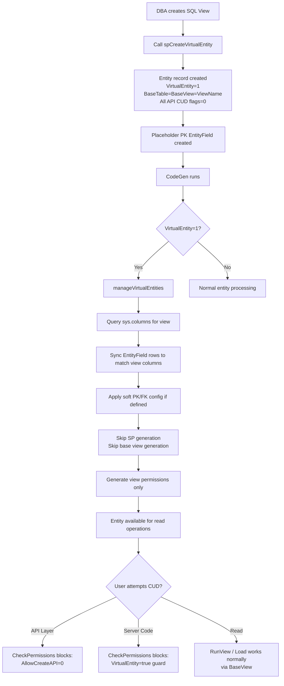
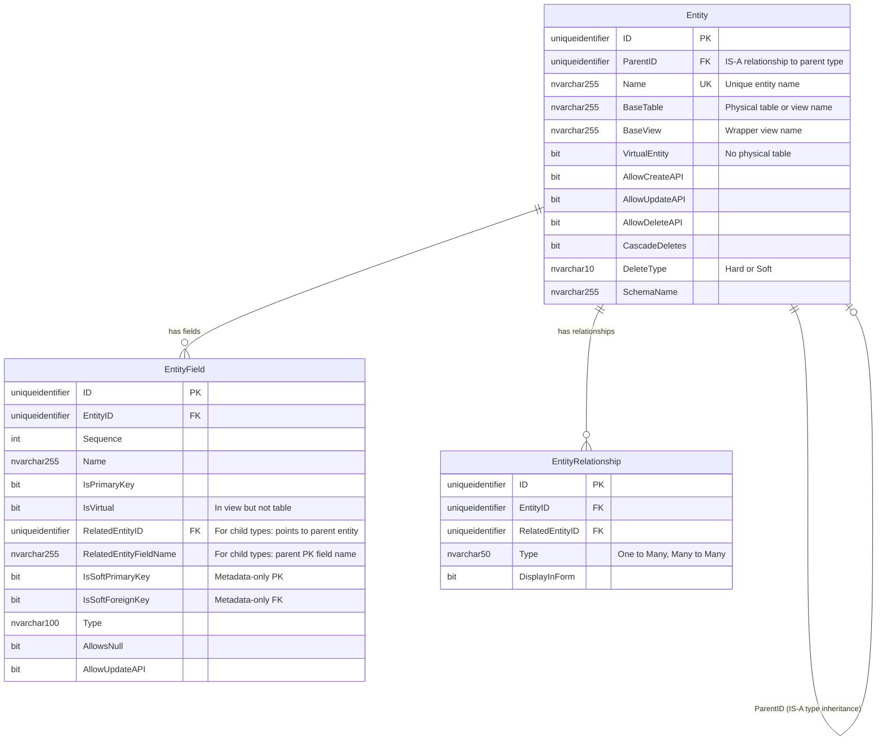
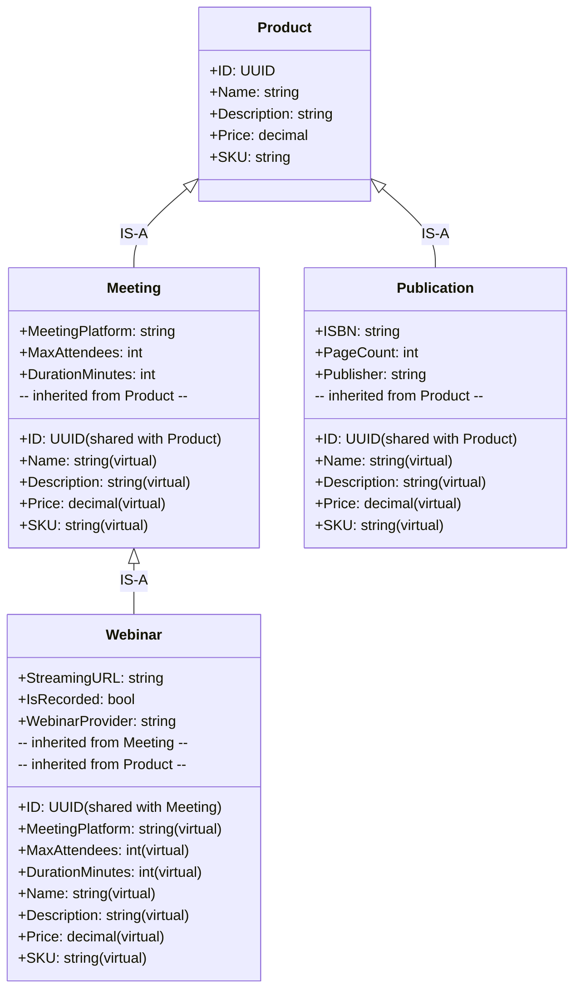
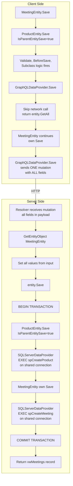
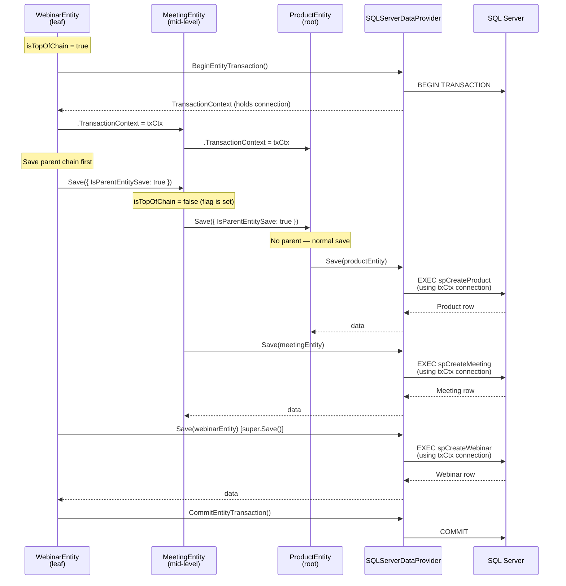
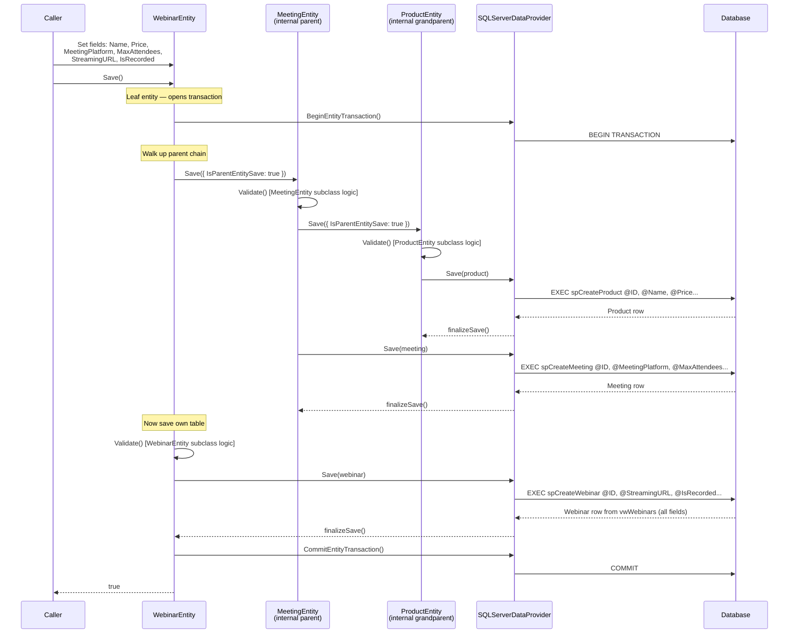
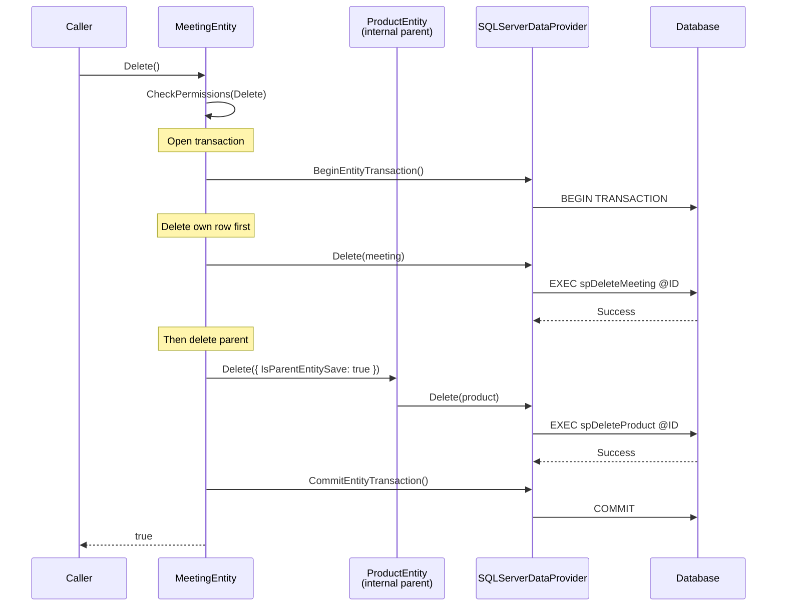
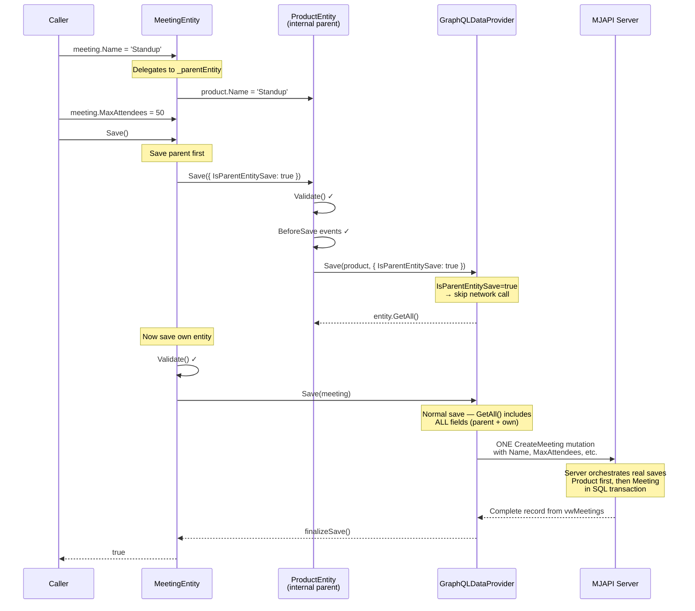
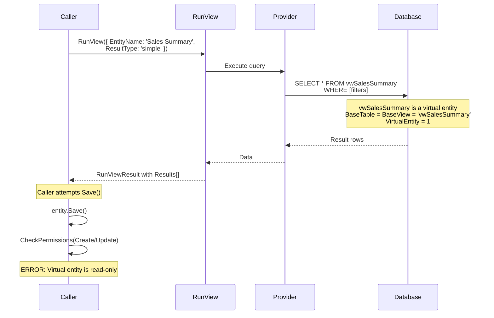

# Entity System Enhancements: Virtual Entities & Parent/Child Type Modeling

## Table of Contents
1. [Executive Summary](#executive-summary)
2. [Terminology](#terminology)
3. [Enhancement 1: Virtual Entities — Tightening the System](#enhancement-1-virtual-entities)
4. [Enhancement 2: Parent/Child Type (IS-A) Relationships](#enhancement-2-parentchild-type-is-a-relationships)
5. [Metadata Schema Changes (ERD)](#metadata-schema-changes-erd)
6. [Example Domain: Product / Meeting / Publication / Webinar](#example-domain)
7. [ORM Composition Architecture](#orm-composition-architecture)
8. [Client/Server Save Orchestration](#clientserver-save-orchestration)
9. [Transaction Scoping](#transaction-scoping)
10. [Record Changes](#record-changes)
11. [Operation Flow Diagrams](#operation-flow-diagrams)
12. [CodeGen Changes](#codegen-changes)
13. [UI Integration](#ui-integration)
14. [Migration Plan](#migration-plan)
15. [Open Questions & Future Work](#open-questions--future-work)

---

## Executive Summary

This plan covers two related enhancements to MemberJunction's entity system:

1. **Virtual Entities** — Entities backed only by a SQL view with no physical table. The infrastructure mostly exists (`VirtualEntity=1`, `spCreateVirtualEntity`, `manageVirtualEntities()` in CodeGen). This enhancement tightens the system so virtual entities are first-class citizens with proper read-only enforcement, composite PK support, and UI awareness.

2. **Parent/Child Type Modeling (IS-A Relationships)** — First-class support for IS-A relationships using the existing `ParentID` column on the Entity table (e.g., Meeting IS-A Product). Combined with shared primary keys, ORM-layer composition, and provider-aware save orchestration, this enables unified views, full subclass validation chains, transactional saves, and cascade-aware deletes across the type hierarchy.

### Key Architectural Decisions
- **Reuse `Entity.ParentID`** — currently unused "reserved for future use" column, repurposed for IS-A relationships
- **ORM Composition, not SP Chaining** — each entity's SP handles only its own table; the ORM layer orchestrates the parent chain, preserving subclass logic, validation, and events at every level
- **Same entity class everywhere** — identical code on client and server; provider interprets `EntitySaveOptions.IsParentEntitySave` flag differently
- **Disjoint subtypes enforced** — a parent record can only be one child type at a time (overlapping is a future option)
- **Transaction scoping via stubs** — `BeginEntityTransaction()` / `CommitEntityTransaction()` / `RollbackEntityTransaction()` are no-ops on client, real SQL transactions on server

---

## Terminology

We use **Parent entity** and **Child entity** (or **Parent type** / **Child type**) as the primary terminology for IS-A relationships, leveraging the existing `ParentID` column on the Entity table.

### Why ParentID Works

The `ParentID` column on the Entity table has been "reserved for future use" since its creation. After studying the codebase:

- **All 5,650+ Entity records** in the baseline migration have `ParentID = NULL`
- **No code anywhere** reads or writes `Entity.ParentID`
- The virtual columns it feeds (`ParentEntity`, `ParentBaseTable`, `ParentBaseView`) exist in `vwEntities` but are **never referenced** in business logic
- MJ already uses dedicated category entities (EntityCategory, ActionCategory, QueryCategory) for organizational grouping — `Entity.ParentID` was never needed for that purpose

The IS-A relationship IS a hierarchy — "child" and "parent" naturally communicate type specialization when applied to entity definitions. A Meeting's parent entity is Product means "Meeting is a specialized Product." In the context of the Entity metadata table (which describes entity definitions, not records), this reading is unambiguous.

### Why Not "Supertype/Subtype"

While "supertype/subtype" is the canonical ER modeling term (Elmasri & Navathe), we opted for parent/child because:

| Consideration | Parent/Child | Supertype/Subtype |
|---------------|-------------|-------------------|
| **Existing infrastructure** | `ParentID` column, FK, index, view columns all exist | Would require new `SupertypeEntityID` column |
| **Accessibility** | Widely understood by all developers | Academic jargon many developers don't know |
| **Naming consistency** | "Sub" already implies "child" | More precise but verbose |
| **Codebase fit** | Natural extension of existing schema | New concept introduction |

The academic terms remain useful in documentation for precision. In comments and documentation we may reference "supertype/subtype" or "IS-A" to clarify the pattern, but the metadata column and API use `ParentID`.

---

## Enhancement 1: Virtual Entities

### Current State

Virtual entities already work in MJ. The existing implementation:

- `Entity.VirtualEntity = 1` flag exists
- `spCreateVirtualEntity` SP creates entity metadata with APIs disabled
- `BaseTable` is set to the same value as `BaseView` (the view name)
- CodeGen's `manageVirtualEntities()` syncs EntityField metadata from view columns
- CodeGen skips SP and base view generation for virtual entities (`sql_codegen.ts` lines 576, 626, 662, 698)

### BaseTable = BaseView: Not a Hack

Setting `BaseTable` to the view name is **pragmatically correct**. External systems and internal code that does `SELECT * FROM [BaseTable]` will work fine because a view is SELECT-able just like a table. The `VirtualEntity=1` flag is the authoritative signal for "no physical table exists." CodeGen and BaseEntity use that flag (not table name comparisons) to gate behavior. No schema change needed here.

### What Needs Tightening

#### 1A. BaseEntity Read-Only Enforcement

**Problem**: `BaseEntity.Save()` and `BaseEntity.Delete()` do NOT check `VirtualEntity`. The API flags (`AllowCreateAPI=0`, etc.) gate the GraphQL layer via `CheckPermissions()`, but nothing prevents server-side code from calling `.Save()` on a virtual entity object.

**Solution**: Add explicit guard in `CheckPermissions()`:

```typescript
// In BaseEntity.CheckPermissions() - early exit for virtual entities
if (this.EntityInfo.VirtualEntity &&
    (type === EntityPermissionType.Create ||
     type === EntityPermissionType.Update ||
     type === EntityPermissionType.Delete)) {
    const msg = `Cannot ${type} on virtual entity '${this.EntityInfo.Name}' — virtual entities are read-only`;
    if (throwError) throw new Error(msg);
    return false;
}
```

This enforces read-only semantics regardless of how the entity is accessed (API, server-side code, actions, agents).

#### 1B. Composite Primary Key Support in spCreateVirtualEntity

**Problem**: `spCreateVirtualEntity` accepts a single `@PrimaryKeyFieldName` parameter. Views with composite keys require manual intervention after creation.

**Solution**: Accept a comma-delimited list or rely on `additionalSchemaInfo` soft PK config for composite keys (already works). The SP is a convenience entry point; composite PKs can be configured post-creation via the existing soft PK mechanism.

#### 1C. UI Awareness

**Problem**: Explorer and forms don't distinguish virtual entities from locked-down regular entities. Both show disabled CRUD buttons.

**Solution**:
- Surface `VirtualEntity` flag in entity forms with a distinct badge/label: "Virtual Entity (Read-Only View)"
- Use a distinct icon (e.g., `fa-eye` or `fa-layer-group`) for virtual entities in entity lists
- Hide Create/Edit/Delete buttons entirely (not just disable them) for virtual entities
- Show the underlying view name prominently

#### 1D. Virtual Entity Flow



---

## Enhancement 2: Parent/Child Type (IS-A) Relationships

### Core Concept

An IS-A relationship models type specialization: **Meeting IS-A Product**, **Publication IS-A Product**. The child entity (Meeting) shares all attributes of the parent entity (Product) and adds its own specialized attributes.

In database terms, this is the **Table-Per-Type (TPT)** inheritance pattern:
- Each type has its own table
- The child's primary key IS a foreign key to the parent's primary key
- Same UUID value in both tables guarantees 1:1 cardinality

### Design Decisions

| Decision | Choice | Rationale |
|----------|--------|-----------|
| **Column** | Reuse existing `Entity.ParentID` | Already exists with FK, index, view columns. Zero migration cost for the column itself. |
| **PK sharing** | Child PK = Parent PK (same UUID values) | Guarantees 1:1 cardinality. No ambiguity. Lookup by ID works across hierarchy. |
| **Join definition** | Via existing `RelatedEntityID`/`RelatedEntityFieldName` on PK EntityField | No new columns needed on EntityField. |
| **Single vs. multiple inheritance** | Single inheritance only (`ParentID` is singular) | Simpler, covers 99% of cases. Multiple would need junction table. |
| **Multi-level** | Supported (chain: Webinar → Meeting → Product) | `ParentID` chain naturally supports N levels. |
| **Subtype exclusivity** | Disjoint enforced (a Product can only be ONE child type at a time) | Simplifies leaf resolution, prevents ambiguity. Overlapping is future option. |
| **Save orchestration** | ORM composition (not SP chaining) | Preserves subclass logic, validation, events at every level. |
| **Entity classes** | Same class on client and server | Provider interprets `IsParentEntitySave` flag differently. |

### Metadata: No New Columns

The existing `Entity.ParentID` column, its FK constraint (`FK_Entity_ParentID`), index (`IDX_AUTO_MJ_FKEY_Entity_ParentID`), and computed view columns (`ParentEntity`, `ParentBaseTable`, `ParentBaseView`) are all already in place. We simply give them semantic meaning.

The subtype's PK field(s) use existing `RelatedEntityID` and `RelatedEntityFieldName` on EntityField to point to the parent entity and its PK field. This existing FK metadata IS the join definition.

### EntityInfo Class Additions

```typescript
// ParentID already exists on EntityInfo — just needs computed helpers

get ParentEntity(): EntityInfo | null {
    if (!this.ParentID) return null;
    return this.Provider.Entities.find(e => e.ID === this.ParentID) ?? null;
}

get ChildEntities(): EntityInfo[] {
    return this.Provider.Entities.filter(e => e.ParentID === this.ID);
}

get ParentChain(): EntityInfo[] {
    // Walk up: Webinar → Meeting → Product
    const chain: EntityInfo[] = [];
    let current = this.ParentEntity;
    while (current) {
        chain.push(current);
        current = current.ParentEntity;
    }
    return chain;
}

get IsChildType(): boolean {
    return this.ParentID != null;
}

get IsParentType(): boolean {
    return this.ChildEntities.length > 0;
}

get AllParentFields(): EntityFieldInfo[] {
    // All fields from all parents up the chain, excluding PKs (shared) and timestamps
    const fields: EntityFieldInfo[] = [];
    for (const parent of this.ParentChain) {
        fields.push(...parent.Fields.filter(f => !f.IsPrimaryKey && !f.Name.startsWith('__mj_')));
    }
    return fields;
}
```

---

## Metadata Schema Changes (ERD)

### Entity Table with ParentID for IS-A



### Existing View Infrastructure (Already in Place)

The `vwEntities` view already computes these columns from `ParentID`:

```sql
-- Already exists in vwEntities
par.Name AS ParentEntity,
par.BaseTable AS ParentBaseTable,
par.BaseView AS ParentBaseView
-- via LEFT OUTER JOIN Entity par ON e.ParentID = par.ID
```

These computed columns are already defined as virtual fields on `EntityInfo`:
- `ParentEntity` (string, read-only)
- `ParentBaseTable` (string, read-only)
- `ParentBaseView` (string, read-only)

No view changes needed.

---

## Example Domain

### Product / Meeting / Publication / Webinar (3-Level Hierarchy)

```mermaid
erDiagram
    Product {
        uniqueidentifier ID PK
        nvarchar255 Name
        nvarchar_max Description
        decimal Price
        nvarchar50 SKU
    }

    Meeting {
        uniqueidentifier ID PK_FK "Same UUID as Product.ID"
        nvarchar50 MeetingPlatform
        int MaxAttendees
        int DurationMinutes
    }

    Publication {
        uniqueidentifier ID PK_FK "Same UUID as Product.ID"
        nvarchar50 ISBN
        int PageCount
        nvarchar255 Publisher
    }

    Webinar {
        uniqueidentifier ID PK_FK "Same UUID as Meeting.ID"
        nvarchar500 StreamingURL
        bit IsRecorded
        nvarchar50 WebinarProvider
    }

    Product ||--o| Meeting : "ID = ID (IS-A)"
    Product ||--o| Publication : "ID = ID (IS-A)"
    Meeting ||--o| Webinar : "ID = ID (IS-A)"
```

### Type Hierarchy (Mermaid Class Diagram)



### Entity Metadata for This Example

```
Entity Table:
┌──────────────┬──────────────────────┬───────────┐
│ Name         │ ParentID             │ BaseTable │
├──────────────┼──────────────────────┼───────────┤
│ Products     │ NULL                 │ Product   │
│ Meetings     │ <ID of Products>     │ Meeting   │
│ Publications │ <ID of Products>     │ Publication│
│ Webinars     │ <ID of Meetings>     │ Webinar   │
└──────────────┴──────────────────────┴───────────┘

EntityField Table (Webinar entity — leaf of 3-level chain):
┌──────────────────┬──────────────┬──────────┬───────────────────────────┬────────────────────────┐
│ Name             │ IsPrimaryKey │ IsVirtual│ RelatedEntityID           │ RelatedEntityFieldName │
├──────────────────┼──────────────┼──────────┼───────────────────────────┼────────────────────────┤
│ ID               │ 1            │ 0        │ <ID of Meetings entity>   │ ID                     │
│ StreamingURL     │ 0            │ 0        │ NULL                      │ NULL                   │
│ IsRecorded       │ 0            │ 0        │ NULL                      │ NULL                   │
│ WebinarProvider  │ 0            │ 0        │ NULL                      │ NULL                   │
│ MeetingPlatform  │ 0            │ 1        │ NULL                      │ NULL                   │
│ MaxAttendees     │ 0            │ 1        │ NULL                      │ NULL                   │
│ DurationMinutes  │ 0            │ 1        │ NULL                      │ NULL                   │
│ Name             │ 0            │ 1        │ NULL                      │ NULL                   │
│ Description      │ 0            │ 1        │ NULL                      │ NULL                   │
│ Price            │ 0            │ 1        │ NULL                      │ NULL                   │
│ SKU              │ 0            │ 1        │ NULL                      │ NULL                   │
└──────────────────┴──────────────┴──────────┴───────────────────────────┴────────────────────────┘
```

### Generated Base Views

```sql
-- Leaf entity: vwWebinars (3-level chain: Webinar → Meeting → Product)
CREATE VIEW [dbo].[vwWebinars]
AS
SELECT
    w.*,
    -- Meeting fields (immediate parent)
    m.[MeetingPlatform],
    m.[MaxAttendees],
    m.[DurationMinutes],
    -- Product fields (grandparent, via Meeting)
    p.[Name],
    p.[Description],
    p.[Price],
    p.[SKU]
FROM
    [dbo].[Webinar] AS w
INNER JOIN
    [dbo].[Meeting] AS m ON w.[ID] = m.[ID]
INNER JOIN
    [dbo].[Product] AS p ON m.[ID] = p.[ID]
WHERE
    w.[__mj_DeletedAt] IS NULL
GO

-- Mid-level entity: vwMeetings (2-level chain: Meeting → Product)
CREATE VIEW [dbo].[vwMeetings]
AS
SELECT
    m.*,
    -- Product fields (parent)
    p.[Name],
    p.[Description],
    p.[Price],
    p.[SKU]
FROM
    [dbo].[Meeting] AS m
INNER JOIN
    [dbo].[Product] AS p ON m.[ID] = p.[ID]
WHERE
    m.[__mj_DeletedAt] IS NULL
GO

-- Root entity: vwProducts (no parent chain)
-- Generated normally, no special handling
```

### Generated Stored Procedures (Single-Table Only)

Each SP handles ONLY its own table. The ORM layer orchestrates the chain.

```sql
-- spCreateWebinar: ONLY inserts into Webinar table
CREATE PROC [dbo].[spCreateWebinar]
    @ID uniqueidentifier,
    @StreamingURL nvarchar(500),
    @IsRecorded bit,
    @WebinarProvider nvarchar(50)
AS
    INSERT INTO [dbo].[Webinar] (ID, StreamingURL, IsRecorded, WebinarProvider)
    VALUES (@ID, @StreamingURL, @IsRecorded, @WebinarProvider)

    SELECT * FROM [dbo].[vwWebinars] WHERE [ID] = @ID
GO

-- spCreateMeeting: ONLY inserts into Meeting table
CREATE PROC [dbo].[spCreateMeeting]
    @ID uniqueidentifier,
    @MeetingPlatform nvarchar(50),
    @MaxAttendees int,
    @DurationMinutes int
AS
    INSERT INTO [dbo].[Meeting] (ID, MeetingPlatform, MaxAttendees, DurationMinutes)
    VALUES (@ID, @MeetingPlatform, @MaxAttendees, @DurationMinutes)

    SELECT * FROM [dbo].[vwMeetings] WHERE [ID] = @ID
GO

-- spCreateProduct: ONLY inserts into Product table
CREATE PROC [dbo].[spCreateProduct]
    @ID uniqueidentifier,
    @Name nvarchar(255),
    @Description nvarchar(max) = NULL,
    @Price decimal = NULL,
    @SKU nvarchar(50) = NULL
AS
    INSERT INTO [dbo].[Product] (ID, Name, Description, Price, SKU)
    VALUES (@ID, @Name, @Description, @Price, @SKU)

    SELECT * FROM [dbo].[vwProducts] WHERE [ID] = @ID
GO
```

Same pattern for spUpdate (each updates only its own table) and spDelete (each deletes only its own row).

---

## ORM Composition Architecture

### Why Not SP Chaining

If `spCreateMeeting` directly called `spCreateProduct` at the SQL level, we would bypass everything the ORM layer provides for ProductEntity:

- **Subclass validation** — someone wrote a `ProductEntityExtended` with custom `Validate()`
- **BeforeSave/AfterSave events** — registered handlers on ProductEntity
- **Entity Actions** — validation and save actions configured on Products
- **Custom business logic** — any subclass overrides

The whole point of the ORM is that business logic lives in entity classes, not in stored procedures. **SP chaining violates that principle.**

### Composition Model

Each child entity class holds an internal instance of its parent entity class. The parent is a real, fully-functional entity object — same class used everywhere, with all subclass logic, validation, and events.

```typescript
// Generated by CodeGen — SAME class on client and server
class MeetingEntity extends BaseEntity {
    private _parentEntity: ProductEntity;

    // Initialized during Load() or NewRecord()
    protected async InitParentEntity(): Promise<void> {
        const md = new Metadata();
        this._parentEntity = await md.GetEntityObject<ProductEntity>('Products');
    }

    // --- Parent field delegation ---
    // Parent fields are writable through the child entity
    get Name(): string { return this._parentEntity.Name; }
    set Name(val: string) { this._parentEntity.Name = val; }
    get Description(): string { return this._parentEntity.Description; }
    set Description(val: string) { this._parentEntity.Description = val; }
    get Price(): number { return this._parentEntity.Price; }
    set Price(val: number) { this._parentEntity.Price = val; }
    get SKU(): string { return this._parentEntity.SKU; }
    set SKU(val: string) { this._parentEntity.SKU = val; }

    // --- Own fields (normal generated getters/setters) ---
    get MeetingPlatform(): string { return this.Get('MeetingPlatform'); }
    set MeetingPlatform(val: string) { this.Set('MeetingPlatform', val); }
    get MaxAttendees(): number { return this.Get('MaxAttendees'); }
    set MaxAttendees(val: number) { this.Set('MaxAttendees', val); }

    // --- Validation includes parent ---
    Validate(): ValidationResult {
        const parentResult = this._parentEntity.Validate();
        const ownResult = super.Validate();
        return mergeValidationResults(parentResult, ownResult);
    }

    // --- Dirty includes parent ---
    get Dirty(): boolean {
        return super.Dirty || (this._parentEntity?.Dirty ?? false);
    }

    // --- GetAll() includes parent fields for serialization ---
    GetAll(): Record<string, unknown> {
        return { ...this._parentEntity.GetAll(), ...super.GetAll() };
    }

    // --- Save orchestrates parent chain ---
    async Save(options?: EntitySaveOptions): Promise<boolean> {
        const isTopOfChain = !options?.IsParentEntitySave;

        if (isTopOfChain) {
            // We're the leaf entity initiating the save — open transaction
            const txCtx = await this.BeginEntityTransaction();
            this._parentEntity.TransactionContext = txCtx;
        }

        try {
            // Save parent (with flag — provider decides behavior)
            const parentResult = await this._parentEntity.Save({
                ...options,
                IsParentEntitySave: true
            });
            if (!parentResult) {
                if (isTopOfChain) await this.RollbackEntityTransaction();
                return false;
            }

            // Save own table
            const result = await super.Save(options);
            if (!result) {
                if (isTopOfChain) await this.RollbackEntityTransaction();
                return false;
            }

            if (isTopOfChain) await this.CommitEntityTransaction();
            return true;
        } catch (e) {
            if (isTopOfChain) await this.RollbackEntityTransaction();
            throw e;
        }
    }
}
```

### N-Level Composition (Webinar → Meeting → Product)

The composition nests naturally:

```
WebinarEntity
  └─ _parentEntity: MeetingEntity
       └─ _parentEntity: ProductEntity
```

- `WebinarEntity.Save()` is called (leaf, `isTopOfChain = true`)
- Opens transaction, shares context with MeetingEntity
- Calls `MeetingEntity.Save({ IsParentEntitySave: true })`
- MeetingEntity is NOT top of chain, shares context with ProductEntity
- Calls `ProductEntity.Save({ IsParentEntitySave: true })`
- ProductEntity has no parent — just saves (using shared transaction connection)
- MeetingEntity saves own table (same transaction)
- WebinarEntity saves own table (same transaction)
- WebinarEntity commits

Each level's full ORM pipeline fires: validation, subclass logic, events, actions, record changes.

---

## Client/Server Save Orchestration

### The Challenge

The same entity class runs in two contexts:

1. **Client-side** (Angular): `BaseEntity.Save()` → `GraphQLDataProvider.Save()` → HTTP mutation → server
2. **Server-side** (MJAPI): `BaseEntity.Save()` → `SQLServerDataProvider.Save()` → SQL execution → database

On the client, we do NOT want separate network calls for each entity in the parent chain. The child's mutation should carry all fields, and the server should orchestrate the real multi-table save.

### Solution: `EntitySaveOptions.IsParentEntitySave`

New option on `EntitySaveOptions`:

```typescript
export class EntitySaveOptions {
    // ... existing options ...

    /**
     * When true, indicates this entity is being saved as part of a parent
     * chain initiated by a child entity. Provider-specific behavior:
     * - GraphQLDataProvider: full validation pipeline runs, but skip network call
     * - SQLServerDataProvider: real save, using shared transaction connection
     */
    IsParentEntitySave?: boolean = false;
}
```

### Provider Behavior

**GraphQLDataProvider.Save():**
```typescript
async Save(entity, user, options) {
    if (options.IsParentEntitySave) {
        // Full ORM pipeline already ran in BaseEntity._InnerSave():
        //   CheckPermissions ✓
        //   Validate() ✓
        //   ValidateAsync() ✓
        //   BeforeSave events ✓
        //   Subclass overrides ✓
        //
        // But skip the network call — the child's mutation carries all fields.
        return entity.GetAll();  // Return current state, no HTTP
    }
    // ... normal mutation logic — sends ALL fields including parent fields via GetAll() ...
}
```

**SQLServerDataProvider.Save():**
```typescript
async Save(entity, user, options) {
    // Normal save — uses transaction connection if available
    const request = entity.TransactionContext?.Connection
        ? new sql.Request(entity.TransactionContext.Connection)
        : new sql.Request(this._pool);

    // Execute SP (single-table only)
    const result = await request.query(sSQL);
    return result;
}
```

On the server, `IsParentEntitySave` doesn't change SQL behavior — the save is real either way. The flag just tells BaseEntity whether to open/close the transaction (only the top of chain does that).

### Server-Side Resolver Handling

When the server receives a `CreateMeeting` mutation with all fields (Meeting + Product):

1. Resolver calls `GetEntityObject('Meetings')` → gets MeetingEntity (with internal ProductEntity)
2. Sets all field values from mutation input on the MeetingEntity (parent fields delegate to ProductEntity)
3. Calls `entity.Save()` → MeetingEntity orchestrates the chain:
   - Opens SQL transaction
   - Saves ProductEntity (real INSERT via spCreateProduct)
   - Saves MeetingEntity (real INSERT via spCreateMeeting)
   - Commits transaction
4. Returns complete record from `vwMeetings`

### Flow Summary



---

## Transaction Scoping

### Approach: Lightweight Transaction Context

BaseEntity gets transaction lifecycle methods that are no-ops on client and real SQL transactions on server.

```typescript
// New type for shared transaction state
export class TransactionContext {
    private _connection: unknown;  // sql.Transaction on server, null on client

    get Connection(): unknown { return this._connection; }

    constructor(connection?: unknown) {
        this._connection = connection ?? null;
    }
}

// New on BaseEntity
export class BaseEntity {
    private _transactionContext: TransactionContext | null = null;

    get TransactionContext(): TransactionContext | null {
        return this._transactionContext;
    }
    set TransactionContext(ctx: TransactionContext | null) {
        this._transactionContext = ctx;
    }

    async BeginEntityTransaction(): Promise<TransactionContext> {
        const ctx = await this.ProviderToUse.BeginTransaction();
        this._transactionContext = ctx;
        return ctx;
    }

    async CommitEntityTransaction(): Promise<void> {
        if (this._transactionContext) {
            await this.ProviderToUse.CommitTransaction(this._transactionContext);
            this._transactionContext = null;
        }
    }

    async RollbackEntityTransaction(): Promise<void> {
        if (this._transactionContext) {
            await this.ProviderToUse.RollbackTransaction(this._transactionContext);
            this._transactionContext = null;
        }
    }
}
```

### Provider Implementations

```typescript
// IEntityDataProvider interface additions
interface IEntityDataProvider {
    BeginTransaction(): Promise<TransactionContext>;
    CommitTransaction(ctx: TransactionContext): Promise<void>;
    RollbackTransaction(ctx: TransactionContext): Promise<void>;
}

// GraphQLDataProvider — no-ops
async BeginTransaction(): Promise<TransactionContext> {
    return new TransactionContext();  // Empty context
}
async CommitTransaction(ctx: TransactionContext): Promise<void> { /* no-op */ }
async RollbackTransaction(ctx: TransactionContext): Promise<void> { /* no-op */ }

// SQLServerDataProvider — real SQL transactions
async BeginTransaction(): Promise<TransactionContext> {
    const transaction = new sql.Transaction(this._pool);
    await transaction.begin();
    return new TransactionContext(transaction);
}
async CommitTransaction(ctx: TransactionContext): Promise<void> {
    await (ctx.Connection as sql.Transaction).commit();
}
async RollbackTransaction(ctx: TransactionContext): Promise<void> {
    await (ctx.Connection as sql.Transaction).rollback();
}
```

### How the Transaction Flows Through the Chain



All three inserts execute on the **same SQL connection** within a single transaction. If any save fails, the leaf entity catches the error and rolls back the entire chain.

---

## Record Changes

### Natural Per-Level Tracking

With the ORM composition model, Record Changes happen naturally at each level. Each entity's `Save()` goes through `SQLServerDataProvider.Save()`, which calls `GetLogRecordChangeSQL()` for any entity with `TrackRecordChanges=true`.

When saving a Webinar that changes `Name` (Product field), `MaxAttendees` (Meeting field), and `StreamingURL` (Webinar field):

| Record Change Entry | Entity | RecordID | ChangesJSON |
|---------------------|--------|----------|-------------|
| 1 | Products | abc-123 | `{"Name": {"old": "Old", "new": "New"}}` |
| 2 | Meetings | abc-123 | `{"MaxAttendees": {"old": 50, "new": 100}}` |
| 3 | Webinars | abc-123 | `{"StreamingURL": {"old": "...", "new": "..."}}` |

Each level records only changes to fields **owned by that entity's table**. The RecordID is the same at every level (shared PK), so querying the full change history by ID across all entities in the chain gives the complete picture.

**Key behaviors:**
- If only Webinar-specific fields changed, no Record Change entry is created for Product or Meeting (no dirty fields at those levels)
- For creates, every level gets a Create record change entry
- For deletes, every level gets a Delete record change entry
- This all comes for free — no special code needed in `GetLogRecordChangeSQL()`

---

## Operation Flow Diagrams

### Create Operation (3-Level: Webinar → Meeting → Product)



### Delete Operation (Child Deletes Own Row, Then Parent Chain)



### Client-Side Save (Single Network Call)



### Virtual Entity Read Flow



---

## CodeGen Changes

### View Generation (`sql_codegen.ts`)

**New logic in `generateBaseView()`**: When `entity.ParentID` is set, auto-generate the parent JOIN chain.

CodeGen walks the `ParentID` chain upward, generating INNER JOINs for each level. All non-PK, non-timestamp fields from each parent are included as virtual fields in the child's view.

```typescript
// Pseudocode for new generateParentEntityJoins() method
protected generateParentEntityJoins(entity: EntityInfo): { joins: string, fields: string } {
    const joins: string[] = [];
    const fields: string[] = [];
    let current = entity;
    let depth = 0;

    while (current.ParentEntity) {
        const parent = current.ParentEntity;
        const alias = `p${depth}`;  // p0 = immediate parent, p1 = grandparent, etc.

        // Join child PK to parent PK (shared PK pattern)
        const prevAlias = depth === 0
            ? entity.CodeName.charAt(0).toLowerCase()
            : `p${depth - 1}`;
        const pkJoins = current.PrimaryKeys
            .map(pk => `${prevAlias}.[${pk.Name}] = ${alias}.[${pk.Name}]`)
            .join(' AND ');

        joins.push(
            `INNER JOIN [${parent.SchemaName}].[${parent.BaseTable}] AS ${alias} ON ${pkJoins}`
        );

        // Include all non-PK, non-timestamp fields from parent
        for (const field of parent.Fields) {
            if (!field.IsPrimaryKey && !field.IsVirtual && !field.Name.startsWith('__mj_')) {
                fields.push(`${alias}.[${field.Name}]`);
            }
        }

        current = parent;
        depth++;
    }

    return { joins: joins.join('\n'), fields: fields.join(',\n    ') };
}
```

### SP Generation (`sql_codegen.ts`)

SPs are now **simple single-table only**. No multi-table logic, no parent calls. Each SP handles exactly one table.

The key change is: when an entity has `ParentID` set, the SP parameters include ONLY the fields owned by that entity's table (not parent fields). Parent fields are handled by the parent entity's SP through the ORM chain.

### Entity Class Generation

CodeGen generates the composition pattern for child entities:

1. Private `_parentEntity` property of the parent entity type
2. Getter/setter wrappers for all parent fields that delegate to `_parentEntity`
3. Override of `Save()` with parent chain orchestration
4. Override of `Delete()` to delete child first, then call parent delete
5. Override of `Validate()` to merge parent and own validation results
6. Override of `Dirty` to include parent dirty state
7. Override of `GetAll()` to include parent fields for serialization
8. `InitParentEntity()` method to create and configure the internal parent instance

### Metadata Sync (`manage-metadata.ts`)

**New method**: `manageParentEntityFields()` — after entity fields are synced, create virtual EntityField records for parent fields on child entities.

For each field in the parent entity (excluding PKs and timestamps), create a corresponding EntityField on the child entity with:
- `IsVirtual = true` (field is in the view, not the child's table)
- `AllowUpdateAPI = true` (writable through the child entity — ORM handles routing to parent)
- Same `Type`, `Length`, `Precision`, `Scale` as the parent's field
- `AllowsNull` matching the parent's field

### Disjoint Subtype Enforcement

Application-layer enforcement during save. Before creating a child record, verify no sibling child type already has that ID:

```typescript
// In BaseEntity or SQLServerDataProvider — during child entity create
protected async EnforceDisjointChildTypes(entity: BaseEntity): Promise<void> {
    const parentEntity = entity.EntityInfo.ParentEntity;
    if (!parentEntity) return;

    const siblings = parentEntity.ChildEntities.filter(
        ce => ce.ID !== entity.EntityInfo.ID  // exclude self
    );

    for (const sibling of siblings) {
        const rv = new RunView();
        const result = await rv.RunView({
            EntityName: sibling.Name,
            ExtraFilter: `ID='${entity.PrimaryKey.Values()}'`,
            ResultType: 'simple',
            Fields: ['ID']
        });
        if (result.Results.length > 0) {
            throw new Error(
                `Cannot create ${entity.EntityInfo.Name} record: ` +
                `ID ${entity.PrimaryKey.Values()} already exists as ${sibling.Name}. ` +
                `A ${parentEntity.Name} record can only be one child type at a time.`
            );
        }
    }
}
```

---

## UI Integration

### Entity Form Display

For child entities, the form displays fields from both the child and parent in a unified view:

```
┌──────────────────────────────────────────────────────┐
│  Webinar Form                [IS-A: Meeting > Product]│
├──────────────────────────────────────────────────────┤
│                                                      │
│  ── Product Fields (grandparent) ─────────────────── │
│  Name:        [Q1 Planning Webinar  ]                │
│  Description: [Quarterly planning...  ]              │
│  Price:       [0.00                 ]                │
│  SKU:         [WEB-Q1-2025          ]                │
│                                                      │
│  ── Meeting Fields (parent) ──────────────────────── │
│  Platform:    [Zoom              ▼]                  │
│  Max Attend:  [500                ]                  │
│  Duration:    [60                 ] min               │
│                                                      │
│  ── Webinar Fields ───────────────────────────────── │
│  Stream URL:  [https://zoom.us/j/... ]               │
│  Is Recorded: [✓]                                    │
│  Provider:    [Zoom Webinars      ▼]                 │
│                                                      │
│  [Save]  [Cancel]                                    │
└──────────────────────────────────────────────────────┘
```

All fields are editable — the ORM composition handles routing saves to the correct tables.

### Entity List / Navigation

```
Entities
├── Products          [Parent type badge: "2 child types"]
├── Meetings          [Child type badge: "IS-A Product", "1 child type"]
├── Publications      [Child type badge: "IS-A Product"]
├── Webinars          [Child type badge: "IS-A Meeting"]
└── Sales Summary     [Virtual badge: "Read-Only View"]
```

### Virtual Entity Display

```
┌──────────────────────────────────────────────────────┐
│  Sales Summary                [Virtual: Read-Only]   │
├──────────────────────────────────────────────────────┤
│                                                      │
│  ┌─────────────┬──────────┬───────────┐             │
│  │ Region      │ Revenue  │ Orders    │             │
│  ├─────────────┼──────────┼───────────┤             │
│  │ Northeast   │ $1.2M    │ 340       │             │
│  │ Southeast   │ $890K    │ 215       │             │
│  │ Midwest     │ $1.1M    │ 298       │             │
│  └─────────────┴──────────┴───────────┘             │
│                                                      │
│  [No Create/Edit/Delete buttons shown]               │
└──────────────────────────────────────────────────────┘
```

---

## Migration Plan

### Phase 1: Virtual Entity Tightening
1. Add `VirtualEntity` guard in `BaseEntity.CheckPermissions()`
2. Update `spCreateVirtualEntity` to support composite PKs (or document `additionalSchemaInfo` path)
3. Add UI awareness (badges, hide CUD buttons)
4. Update EntityInfo with `VirtualEntity`-aware computed properties

### Phase 2: Parent/Child Type Metadata
1. `Entity.ParentID` already exists — no column migration needed
2. `vwEntities` already computes `ParentEntity`, `ParentBaseTable`, `ParentBaseView` — no view changes needed
3. **EntityInfo**: Add computed getters (`ParentEntity`, `ChildEntities`, `ParentChain`, `IsChildType`, `IsParentType`, `AllParentFields`)
4. **EntitySaveOptions**: Add `IsParentEntitySave` flag
5. **BaseEntity**: Add `TransactionContext` property and `BeginEntityTransaction()` / `CommitEntityTransaction()` / `RollbackEntityTransaction()` methods
6. **IEntityDataProvider**: Add `BeginTransaction()` / `CommitTransaction()` / `RollbackTransaction()` interface methods

### Phase 3: Provider Transaction Support
1. **GraphQLDataProvider**: Implement transaction methods as no-ops; handle `IsParentEntitySave` in `Save()` (validate only, skip network call)
2. **SQLServerDataProvider**: Implement real SQL transaction methods; use `TransactionContext.Connection` when available in `ExecuteSQL()`
3. **Disjoint enforcement**: Add sibling check during child entity creation

### Phase 4: CodeGen — Views and SPs
1. **View generation**: Auto-join parent tables in child base views via `generateParentEntityJoins()`
2. **SP generation**: SPs handle ONLY own table (simpler than before)
3. **Metadata sync**: `manageParentEntityFields()` creates virtual EntityField records for parent fields on child entities
4. **Entity class generation**: Generate composition pattern — `_parentEntity`, delegating getters/setters, `Save()` override with chain orchestration

### Phase 5: UI Integration
1. Entity form: Unified display of child + parent fields with section headers per level
2. Entity list: Parent/child type badges and navigation
3. Virtual entity: Read-only badges, hidden CUD buttons
4. Entity admin: UI for setting `ParentID` on entities to establish IS-A relationships

### Phase 6: Delete Orchestration
1. Child entity `Delete()`: Delete own row first, then call parent entity delete (if no other children reference that parent record)
2. Parent entity cascade: When deleting a parent record directly (e.g., deleting a Product), cascade to all child type records first
3. Integrate with existing `CascadeDeletes` flag and soft/hard delete logic

---

## Open Questions & Future Work

### Resolved Decisions
- **Column**: Reuse existing `Entity.ParentID` (no new column needed)
- **Terminology**: "Parent entity / child entity" in code and UI
- **PK sharing**: Child PK = Parent PK (same UUID, 1:1 guaranteed)
- **Join definition**: Via existing `RelatedEntityID`/`RelatedEntityFieldName` on PK fields
- **Single inheritance**: One `ParentID` per entity (no multiple inheritance)
- **Disjoint subtypes**: Enforced — a parent record can only be one child type at a time
- **SP design**: Single-table only, no chaining — ORM orchestrates the chain
- **Entity classes**: Same class on client and server — provider interprets `IsParentEntitySave` flag
- **Transactions**: Stub methods on BaseEntity — no-op on client, real SQL transactions on server
- **Record Changes**: Natural per-level tracking — each entity's Save() generates its own record changes
- **N-level depth**: Fully supported (practical limit ~3-4 levels)

### Future Options
1. **Overlapping subtypes**: Allow a parent record to be multiple child types simultaneously. Would require removing disjoint enforcement and handling ambiguity in leaf resolution. Configurable per parent entity.
2. **Polymorphic load / leaf resolution**: `GetEntityObject('Products', user, { resolveToLeaf: true })` — given a Product ID, automatically detect if it's actually a Meeting or Publication and return the appropriate leaf entity type. Requires querying child tables to discover the actual type. Only deterministic with disjoint subtypes.
3. **Database management agent**: Automate creation and configuration of IS-A relationships ("Meeting extends Product"), virtual entity creation from SQL views, schema diff analysis, and migration generation. Deferred to separate planning effort.
4. **Multiple inheritance**: Would require a junction table (`EntityParents`) instead of a single `ParentID`. Significantly more complex for view generation and save orchestration. Very rarely needed in practice.
5. **Polymorphic queries**: "Show me all Products regardless of child type" with type-discriminator column. The parent entity's view already shows all parent-level records; child-specific data requires joining child views.

### Technical Debt to Address
1. **Entity.ParentID description**: Update the field description from "Reserved for future use" to document its IS-A type inheritance semantics
2. **EntityEntity generated class**: Update JSDoc comments for `ParentID`, `ParentEntity`, `ParentBaseTable`, `ParentBaseView` to reflect IS-A meaning
3. **Existing ParentID on other entities**: Ensure no confusion with `ParentID` fields on Action, ActionCategory, QueryCategory etc. (those are intra-entity hierarchy, unrelated to cross-entity IS-A)
