# Entity System Enhancements: Virtual Entities & IS-A Type Modeling

## Table of Contents
1. [Executive Summary](#executive-summary)
2. [Terminology](#terminology)
3. [Enhancement 1: Virtual Entities — Tightening the System](#enhancement-1-virtual-entities)
4. [Config-Driven Virtual Entity Creation](#config-driven-virtual-entity-creation)
5. [LLM-Assisted Virtual Entity Field Decoration](#llm-assisted-virtual-entity-field-decoration)
6. [Enhancement 2: IS-A Type Relationships](#enhancement-2-is-a-type-relationships)
7. [Metadata Schema & EntityInfo](#metadata-schema--entityinfo)
8. [Example Domain: Product / Meeting / Publication / Webinar](#example-domain)
9. [Object Composition Architecture](#object-composition-architecture)
10. [Set/Get/SetMany Routing](#setgetsetmany-routing)
11. [Load & NewRecord Flows](#load--newrecord-flows)
12. [Save Orchestration](#save-orchestration)
13. [Delete Orchestration](#delete-orchestration)
14. [Provider Transaction Management](#provider-transaction-management)
15. [Record Changes](#record-changes)
16. [Disjoint Subtype Enforcement](#disjoint-subtype-enforcement)
17. [Field Name Collision Detection](#field-name-collision-detection)
18. [CodeGen Changes](#codegen-changes)
19. [UI Integration](#ui-integration)
20. [Implementation Phases & Checklist](#implementation-phases--checklist)
21. [Resolved Decisions](#resolved-decisions)
22. [Future Work](#future-work)

---

## Executive Summary

This plan covers two related enhancements to MemberJunction's entity system:

1. **Virtual Entities** — Entities backed only by a SQL view with no physical table. The infrastructure mostly exists (`VirtualEntity=1`, `spCreateVirtualEntity`, `manageVirtualEntities()` in CodeGen). This enhancement tightens the system so virtual entities are first-class citizens with proper read-only enforcement, composite PK support, UI awareness, **declarative config-driven creation**, and **LLM-assisted field decoration**.

2. **IS-A Type Relationships (Parent/Child Type Modeling)** — First-class support for type inheritance using the existing `Entity.ParentID` column (e.g., Meeting IS-A Product). Combined with shared primary keys, persistent ORM composition via `_parentEntity`, and provider-aware save orchestration, this enables unified views, full subclass validation chains, transactional saves, and cascade-aware deletes across type hierarchies.

### Key Architectural Decisions
- **Reuse `Entity.ParentID`** — currently unused "reserved for future use" column, repurposed for IS-A
- **Persistent `_parentEntity` composition** — each child entity holds a live reference to its parent entity; all data routing, dirty tracking, and validation flow through this composition chain
- **Generic Set/Get/SetMany routing in BaseEntity** — metadata-driven field routing; no per-subclass overrides for data access. Parent fields are routed to `_parentEntity` transparently
- **Save/Delete orchestration in BaseEntity** — `_InnerSave()` and `_InnerDelete()` generically detect IS-A chains and orchestrate parent saves/deletes. Generated subclasses only initialize `_parentEntity` and generate typed accessors
- **Leaf awareness, not transactions, on client** — the initiating entity sends one network call with all chain fields; parent entities validate but skip the network call
- **Provider-level SQL transactions on server** — `SQLServerDataProvider` manages transaction lifecycle; composes with existing `TransactionGroup` when needed
- **Disjoint subtypes enforced** — single batch query prevents a parent record from being multiple child types

---

## Terminology

We use **Parent entity** and **Child entity** (or **Parent type** / **Child type**) as the primary terminology for IS-A relationships, leveraging the existing `ParentID` column on the Entity table.

### Why ParentID Works

The `ParentID` column on the Entity table has been "reserved for future use" since creation. After studying the codebase:

- **All 5,650+ Entity records** in the baseline migration have `ParentID = NULL`
- **No code anywhere** reads or writes `Entity.ParentID` for business logic
- The virtual columns it feeds (`ParentEntity`, `ParentBaseTable`, `ParentBaseView`) exist in `vwEntities` but are **never referenced** in application code
- MJ uses dedicated category entities for organizational grouping — `Entity.ParentID` was never needed for that
- CodeGen's recursive FK detection is purely structural (`RelatedEntityID === entity.ID`), not name-based — repurposing ParentID for IS-A doesn't affect existing RootParentID generation

### Why Not "Supertype/Subtype"

| Consideration | Parent/Child | Supertype/Subtype |
|---------------|-------------|-------------------|
| **Existing infrastructure** | `ParentID` column, FK, index, view columns all exist | Would require new column |
| **Accessibility** | Widely understood by all developers | Academic jargon |
| **Codebase fit** | Natural extension of existing schema | New concept introduction |

The academic terms remain useful in documentation for precision. In comments we may reference "supertype/subtype" or "IS-A" to clarify the pattern, but the metadata column and API use `ParentID`.

### Entity.ParentID vs Other ParentID Fields

`Entity.ParentID` gets a cross-entity IS-A semantic, which differs from `Action.ParentID` or `ActionCategory.ParentID` (same-entity tree hierarchy). This is not a conflict — no generic code assigns meaning to the name "ParentID." CodeGen's `detectRecursiveForeignKeys()` checks `RelatedEntityID === entity.ID` (structural), not field names.

---

## Enhancement 1: Virtual Entities

### Current State

Virtual entities already work in MJ. The existing implementation:

- `Entity.VirtualEntity = 1` flag exists in schema and EntityInfo
- `spCreateVirtualEntity` SP creates entity metadata with APIs disabled
- `BaseTable` is set to the same value as `BaseView` (the view name)
- CodeGen's `manageVirtualEntities()` syncs EntityField metadata from view columns
- CodeGen skips SP and base view generation for virtual entities

### BaseTable = BaseView: Not a Hack

Setting `BaseTable` to the view name is pragmatically correct. External systems doing `SELECT * FROM [BaseTable]` work fine. The `VirtualEntity=1` flag is the authoritative signal. No schema change needed.

### What Needs Tightening

#### 1A. BaseEntity Read-Only Enforcement

**Problem**: `BaseEntity.Save()` and `Delete()` do NOT check `VirtualEntity`. The API flags gate the GraphQL layer, but nothing prevents server-side code from calling `.Save()` on a virtual entity.

**Solution**: Add guard in `CheckPermissions()`:

```typescript
// In BaseEntity.CheckPermissions() — early exit for virtual entities
if (this.EntityInfo.VirtualEntity &&
    (type === EntityPermissionType.Create ||
     type === EntityPermissionType.Update ||
     type === EntityPermissionType.Delete)) {
    const msg = `Cannot ${type} on virtual entity '${this.EntityInfo.Name}' — virtual entities are read-only`;
    if (throwError) throw new Error(msg);
    return false;
}
```

#### 1B. Composite Primary Key Support

**Problem**: `spCreateVirtualEntity` accepts a single `@PrimaryKeyFieldName`. Composite keys require manual intervention.

**Solution**: Accept comma-delimited list or rely on `additionalSchemaInfo` soft PK config (already works).

#### 1C. UI Awareness

- Surface `VirtualEntity` flag with distinct badge: "Virtual Entity (Read-Only View)"
- Distinct icon (e.g., `fa-eye`) for virtual entities in entity lists
- Hide Create/Edit/Delete buttons entirely (not just disable) for virtual entities
- Show underlying view name prominently

#### 1D. Virtual Entity Flow

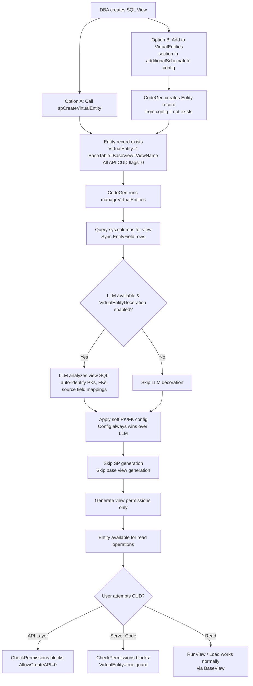

---

## Config-Driven Virtual Entity Creation

### Problem: Manual SP Calls Are Fragile

Creating a virtual entity requires calling `spCreateVirtualEntity` with parameters — a manual, one-off operation. Steps 2-4 of the creation process should be automated via the same config file that handles soft PK/FK declarations.

### Solution: Extend `additionalSchemaInfo` Config

The existing `database-metadata-config.json` already supports soft PKs and FKs per table using PascalCase property names. We extend it with a `VirtualEntities` section.

#### Config File Format

```json
{
    "$schema": "./database-metadata-config.schema.json",
    "version": "1.0",

    "dbo": [
        {
            "TableName": "Orders",
            "PrimaryKey": [{ "FieldName": "OrderID" }],
            "ForeignKeys": [
                { "FieldName": "CustomerID", "SchemaName": "dbo", "RelatedTable": "Customers", "RelatedField": "ID" }
            ]
        }
    ],

    "VirtualEntities": [
        {
            "SchemaName": "dbo",
            "ViewName": "vwCustomerOrdersSummary",
            "EntityName": "Customer Orders Summary",
            "Description": "Aggregated view of customer order history",
            "PrimaryKey": [{ "FieldName": "CustomerID" }],
            "ForeignKeys": [
                {
                    "FieldName": "CustomerID",
                    "SchemaName": "dbo",
                    "RelatedTable": "Customer",
                    "RelatedField": "ID"
                }
            ]
        },
        {
            "SchemaName": "analytics",
            "ViewName": "vwSalesByRegion",
            "EntityName": "Sales By Region",
            "Description": "Regional sales aggregation",
            "PrimaryKey": [
                { "FieldName": "RegionID" },
                { "FieldName": "Year" }
            ]
        }
    ]
}
```

#### Config Properties

| Property | Required | Description |
|----------|----------|-------------|
| `SchemaName` | Yes | Schema of the SQL view |
| `ViewName` | Yes | Name of the SQL view |
| `EntityName` | No | Display name. If omitted, derived from view name (strip `vw` prefix, add spaces). |
| `Description` | No | Entity description. If omitted and LLM available, auto-generated. |
| `PrimaryKey` | No | Array of PK fields. If omitted and LLM available, auto-identified. |
| `ForeignKeys` | No | Array of FK relationships. If omitted and LLM available, auto-identified. |

#### CodeGen Processing Flow

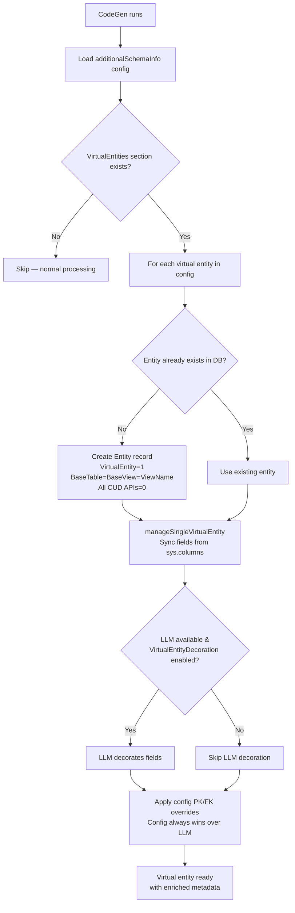

#### Key Design Decisions

1. **Config PK/FK overrides LLM**: Explicit config values take precedence. `IsSoftPrimaryKey`/`IsSoftForeignKey` flags protect from subsequent schema sync.
2. **Entity creation is idempotent**: If entity exists from prior run or manual SP call, only PK/FK settings are updated.
3. **Same PascalCase conventions**: Consistent with soft PK/FK sections.
4. **Schema-as-key for tables, flat array for virtual entities**: Tables use schema as JSON key for conciseness; virtual entities use flat array with explicit `SchemaName`.

---

## LLM-Assisted Virtual Entity Field Decoration

### Problem: sys.columns Gives Minimal Metadata

When CodeGen syncs virtual entity fields from `sys.columns`, it gets column names, data types, lengths, nullability — but nothing semantic (no PKs, no FKs, no descriptions).

### Solution: LLM Analyzes View SQL

A new `VirtualEntityDecoration` AdvancedGeneration feature uses an LLM to analyze the view SQL definition and existing entity metadata to intelligently decorate virtual entity fields.

### Feature Configuration

```javascript
// in mj.config.cjs
advancedGeneration: {
    enableAdvancedGeneration: true,
    features: [
        { name: 'VirtualEntityDecoration', enabled: true },
    ]
}
```

### Expected Output

```typescript
type VirtualEntityDecorationResult = {
    primaryKeyFields: Array<{ fieldName: string; reason: string }>;
    foreignKeyFields: Array<{
        fieldName: string;
        relatedEntityName: string;
        relatedFieldName: string;
        reason: string;
    }>;
    sourceFieldMappings: Array<{
        fieldName: string;
        sourceEntityName: string;
        sourceFieldName: string;
        confidence: 'high' | 'medium' | 'low';
    }>;
    computedFields: Array<{
        fieldName: string;
        computationType: 'aggregate' | 'expression' | 'case' | 'conversion' | 'other';
        description: string;
    }>;
    confidence: 'high' | 'medium' | 'low';
    reasoning: string;
}
```

### Precedence Chain

```
sys.columns          → basic type info (always applied)
    ↓
LLM decoration       → PKs, FKs, source mappings, computed flags (if enabled)
    ↓
additionalSchemaInfo → explicit PK/FK overrides (always wins, protected by IsSoft* flags)
```

### Integration in CodeGen Pipeline

LLM decoration runs inside `manageSingleVirtualEntity()`, after field sync from `sys.columns` but before `applySoftPKFKConfig()`. Idempotent: if fields already have PK/FK decoration (from prior run or soft config), LLM call is skipped. Graceful fallback: if LLM is unavailable, entity works with basic `sys.columns` metadata.

---

## Enhancement 2: IS-A Type Relationships

### Core Concept

An IS-A relationship models type specialization: **Meeting IS-A Product**, **Publication IS-A Product**. The child entity shares all attributes of the parent and adds specialized attributes.

In database terms, this is the **Table-Per-Type (TPT)** inheritance pattern:
- Each type has its own table
- The child's primary key IS a foreign key to the parent's primary key
- Same UUID value in both tables guarantees 1:1 cardinality

### Design Decisions

| Decision | Choice | Rationale |
|----------|--------|-----------|
| **Column** | Reuse `Entity.ParentID` | Already exists with FK, index, view columns. Zero migration cost. |
| **PK sharing** | Child PK = Parent PK (same UUID) | 1:1 cardinality guaranteed. ID lookup works across hierarchy. |
| **Single inheritance** | `ParentID` is singular | Simpler, covers 99% of cases. |
| **Multi-level** | Supported (Webinar → Meeting → Product) | `ParentID` chain naturally supports N levels. |
| **Subtype exclusivity** | Disjoint enforced | Single batch query. Overlapping is future option. |
| **Data routing** | BaseEntity.Set/Get routes parent fields to `_parentEntity` | Generic, metadata-driven. No per-subclass overrides for data access. |
| **Save orchestration** | Generic in BaseEntity._InnerSave() | Detects IS-A chain, orchestrates parent saves. Generated subclass only inits `_parentEntity`. |
| **Client network** | Leaf sends ONE mutation with all chain fields | Parent entities validate but skip network call. |
| **Server transactions** | SQLServerDataProvider-level | Composes with TransactionGroup when entity is in one. |

---

## Metadata Schema & EntityInfo

### Entity Table with ParentID for IS-A

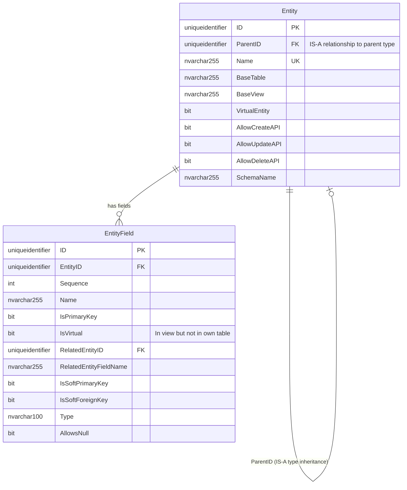

### Existing View Infrastructure (Already in Place)

`vwEntities` already computes `ParentEntity`, `ParentBaseTable`, `ParentBaseView` via `LEFT OUTER JOIN Entity par ON e.ParentID = par.ID`. No view changes needed.

### EntityInfo Computed Properties

```typescript
// New computed helpers on EntityInfo
get ParentEntity(): EntityInfo | null {
    if (!this.ParentID) return null;
    return this.Provider.Entities.find(e => e.ID === this.ParentID) ?? null;
}

get ChildEntities(): EntityInfo[] {
    return this.Provider.Entities.filter(e => e.ParentID === this.ID);
}

get ParentChain(): EntityInfo[] {
    // Walk up: Webinar → [Meeting, Product]
    const chain: EntityInfo[] = [];
    let current = this.ParentEntity;
    while (current) {
        chain.push(current);
        current = current.ParentEntity;
    }
    return chain;
}

get IsChildType(): boolean { return this.ParentID != null; }

get IsParentType(): boolean { return this.ChildEntities.length > 0; }

get AllParentFields(): EntityFieldInfo[] {
    // All fields from all parents, excluding PKs and timestamps
    const fields: EntityFieldInfo[] = [];
    for (const parent of this.ParentChain) {
        fields.push(...parent.Fields.filter(
            f => !f.IsPrimaryKey && !f.IsVirtual && !f.Name.startsWith('__mj_')
        ));
    }
    return fields;
}

// Cached set of field names belonging to parent entities — used for Set/Get routing
private _parentEntityFieldNames: Set<string> | null = null;
get ParentEntityFieldNames(): Set<string> {
    if (!this._parentEntityFieldNames) {
        this._parentEntityFieldNames = new Set(
            this.AllParentFields.map(f => f.Name)
        );
    }
    return this._parentEntityFieldNames;
}
```

---

## Example Domain

### Product / Meeting / Publication / Webinar (3-Level Hierarchy)

```mermaid
erDiagram
    Product {
        uniqueidentifier ID PK
        nvarchar255 Name
        nvarchar_max Description
        decimal Price
        nvarchar50 SKU
    }

    Meeting {
        uniqueidentifier ID PK_FK "Same UUID as Product.ID"
        nvarchar50 MeetingPlatform
        int MaxAttendees
        int DurationMinutes
    }

    Publication {
        uniqueidentifier ID PK_FK "Same UUID as Product.ID"
        nvarchar50 ISBN
        int PageCount
        nvarchar255 Publisher
    }

    Webinar {
        uniqueidentifier ID PK_FK "Same UUID as Meeting.ID"
        nvarchar500 StreamingURL
        bit IsRecorded
        nvarchar50 WebinarProvider
    }

    Product ||--o| Meeting : "ID = ID (IS-A)"
    Product ||--o| Publication : "ID = ID (IS-A)"
    Meeting ||--o| Webinar : "ID = ID (IS-A)"
```

### Type Hierarchy

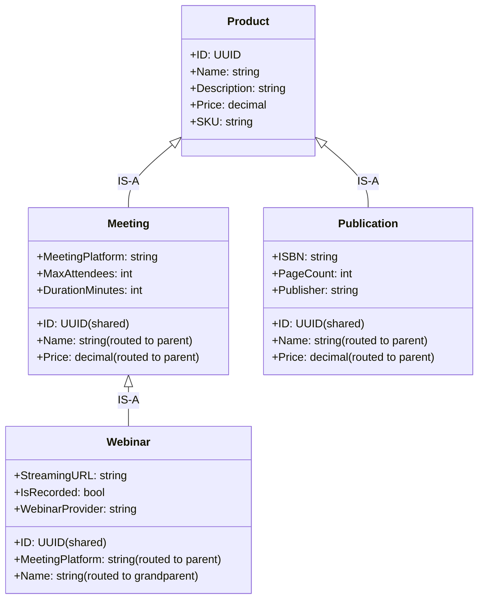

### Entity Metadata

```
Entity Table:
┌──────────────┬──────────────────────┬───────────┐
│ Name         │ ParentID             │ BaseTable │
├──────────────┼──────────────────────┼───────────┤
│ Products     │ NULL                 │ Product   │
│ Meetings     │ <ID of Products>     │ Meeting   │
│ Publications │ <ID of Products>     │ Publication│
│ Webinars     │ <ID of Meetings>     │ Webinar   │
└──────────────┴──────────────────────┴───────────┘
```

### Generated Base Views

```sql
-- vwWebinars (3-level: Webinar → Meeting → Product)
CREATE VIEW [dbo].[vwWebinars] AS
SELECT
    w.*,
    m.[MeetingPlatform], m.[MaxAttendees], m.[DurationMinutes],
    p.[Name], p.[Description], p.[Price], p.[SKU]
FROM [dbo].[Webinar] AS w
INNER JOIN [dbo].[Meeting] AS m ON w.[ID] = m.[ID]
INNER JOIN [dbo].[Product] AS p ON m.[ID] = p.[ID]
WHERE w.[__mj_DeletedAt] IS NULL
GO

-- vwMeetings (2-level: Meeting → Product)
CREATE VIEW [dbo].[vwMeetings] AS
SELECT
    m.*,
    p.[Name], p.[Description], p.[Price], p.[SKU]
FROM [dbo].[Meeting] AS m
INNER JOIN [dbo].[Product] AS p ON m.[ID] = p.[ID]
WHERE m.[__mj_DeletedAt] IS NULL
GO
```

### Generated Stored Procedures (Single-Table Only)

Each SP handles ONLY its own table. The ORM layer orchestrates the chain.

```sql
-- spCreateWebinar: ONLY inserts into Webinar table
CREATE PROC [dbo].[spCreateWebinar]
    @ID uniqueidentifier,
    @StreamingURL nvarchar(500),
    @IsRecorded bit,
    @WebinarProvider nvarchar(50)
AS
    INSERT INTO [dbo].[Webinar] (ID, StreamingURL, IsRecorded, WebinarProvider)
    VALUES (@ID, @StreamingURL, @IsRecorded, @WebinarProvider)
    SELECT * FROM [dbo].[vwWebinars] WHERE [ID] = @ID
GO

-- spCreateMeeting: ONLY inserts into Meeting table
CREATE PROC [dbo].[spCreateMeeting]
    @ID uniqueidentifier,
    @MeetingPlatform nvarchar(50),
    @MaxAttendees int,
    @DurationMinutes int
AS
    INSERT INTO [dbo].[Meeting] (ID, MeetingPlatform, MaxAttendees, DurationMinutes)
    VALUES (@ID, @MeetingPlatform, @MaxAttendees, @DurationMinutes)
    SELECT * FROM [dbo].[vwMeetings] WHERE [ID] = @ID
GO

-- spCreateProduct: ONLY inserts into Product table
CREATE PROC [dbo].[spCreateProduct]
    @ID uniqueidentifier,
    @Name nvarchar(255),
    @Description nvarchar(max) = NULL,
    @Price decimal = NULL,
    @SKU nvarchar(50) = NULL
AS
    INSERT INTO [dbo].[Product] (ID, Name, Description, Price, SKU)
    VALUES (@ID, @Name, @Description, @Price, @SKU)
    SELECT * FROM [dbo].[vwProducts] WHERE [ID] = @ID
GO
```

---

## Object Composition Architecture

### Why ORM Composition, Not SP Chaining

If `spCreateMeeting` called `spCreateProduct` at the SQL level, we'd bypass everything the ORM provides for ProductEntity: subclass validation, BeforeSave/AfterSave events, Entity Actions, custom business logic. **SP chaining violates the core principle that business logic lives in entity classes, not stored procedures.**

### Persistent `_parentEntity` Model

Each IS-A child entity holds a **persistent** reference to its parent entity instance. This reference lives for the entity's lifetime — whether that's a brief resolver call on the server or a long-lived cached object in a `BaseEngine` subclass.

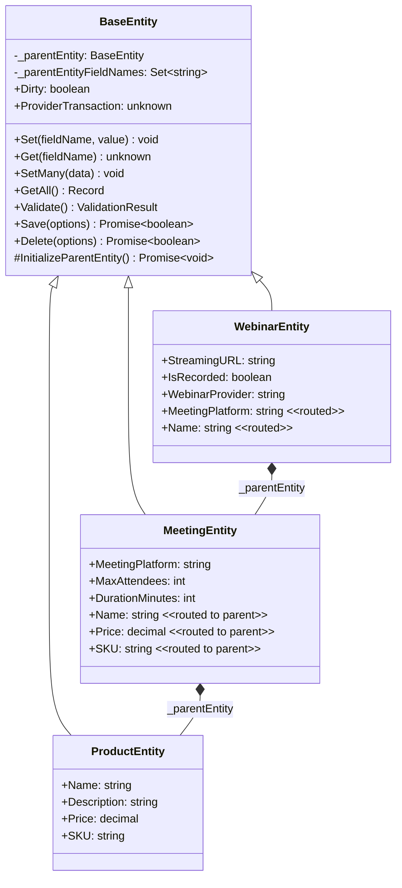

### Runtime Object Structure

```
WebinarEntity instance
├── _parentEntity → MeetingEntity instance
│   ├── _parentEntity → ProductEntity instance
│   │   ├── EntityFields: [ID, Name, Description, Price, SKU]
│   │   └── _parentEntity: null (root)
│   ├── EntityFields: [ID, MeetingPlatform, MaxAttendees, DurationMinutes]
│   └── _parentEntityFieldNames: {Name, Description, Price, SKU}
├── EntityFields: [ID, StreamingURL, IsRecorded, WebinarProvider,
│                   MeetingPlatform*, MaxAttendees*, DurationMinutes*,
│                   Name*, Description*, Price*, SKU*]
│                   (* = virtual/mirror fields for UI)
└── _parentEntityFieldNames: {MeetingPlatform, MaxAttendees, DurationMinutes,
                               Name, Description, Price, SKU}
```

### Initialization Sequence

`_parentEntity` must exist before any data operations (Load, NewRecord, Set, Get). It is created during entity initialization:

```typescript
// In BaseEntity — called from GetEntityObject pipeline
protected async InitializeParentEntity(): Promise<void> {
    if (!this.EntityInfo?.IsChildType) return;

    const md = new Metadata();
    this._parentEntity = await md.GetEntityObject(
        this.EntityInfo.ParentEntity.Name,
        this._contextCurrentUser
    );
    // ParentEntityFieldNames is computed/cached on EntityInfo
    this._parentEntityFieldNames = this.EntityInfo.ParentEntityFieldNames;
}
```

The exact hook point in the entity lifecycle (during `GetEntityObject()` completion, or as a lazy init before first data operation) will be determined during implementation. The requirement is: **_parentEntity is fully initialized before any Load/NewRecord/Set/Get call.**

### BaseEngine Cache Interaction

`BaseEngine` caches entity objects by reference for the server's lifetime. Entity `Save()` raises events that BaseEngine catches for cache sync via immediate mutation or debounced refresh. With persistent `_parentEntity`, the parent entity lives alongside the child in memory. When the child is updated and re-cached, the parent state is preserved.

---

## Set/Get/SetMany Routing

### Design Principle

All data routing is **generic in BaseEntity** using `EntityInfo.ParentEntityFieldNames`. No per-subclass overrides for data access. The routing is transparent: code calling `entity.Set('Name', value)` or `entity.Name = value` doesn't know or care whether `Name` belongs to the entity's own table or a parent table.

### Set() Routing

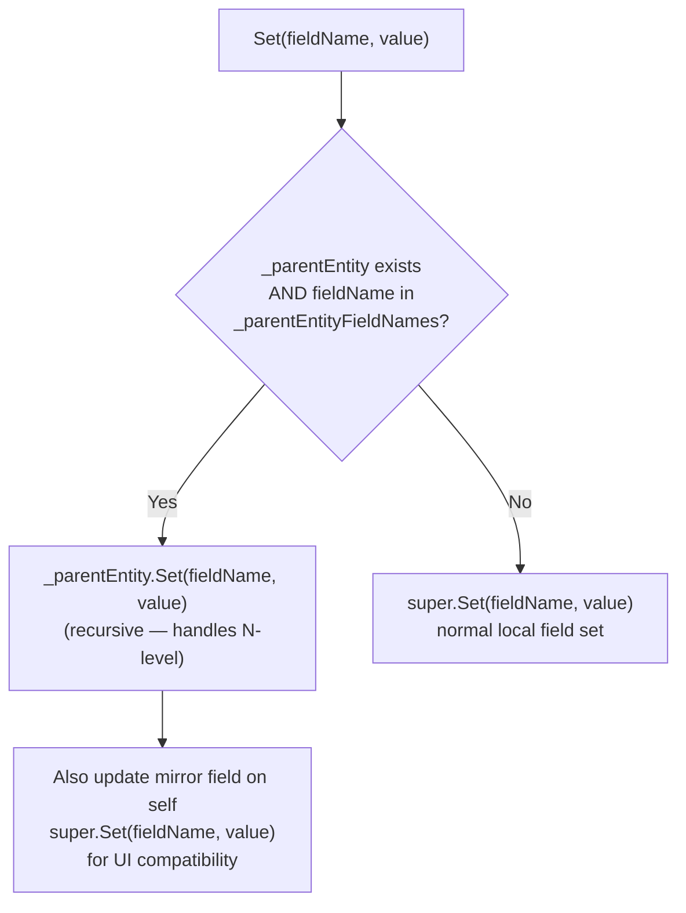

```typescript
// In BaseEntity — generic override
public Set(fieldName: string, value: unknown): void {
    if (this._parentEntity && this._parentEntityFieldNames?.has(fieldName)) {
        // Route to parent (recursive for N-level chains)
        this._parentEntity.Set(fieldName, value);
        // Mirror on self for UI — virtual EntityField gets value
        // but authoritative state is on _parentEntity
        super.Set(fieldName, value);
        return;
    }
    super.Set(fieldName, value);
}
```

### Get() Routing

```typescript
// In BaseEntity — generic override
public Get(fieldName: string): unknown {
    if (this._parentEntity && this._parentEntityFieldNames?.has(fieldName)) {
        return this._parentEntity.Get(fieldName); // Authoritative value from parent
    }
    return super.Get(fieldName);
}
```

### SetMany() Routing

`SetMany()` in BaseEntity directly accesses `EntityField.Value` rather than calling `Set()`. We override to split data between parent and self:

```typescript
public SetMany(data: Record<string, unknown>, ...args): void {
    // Set ALL fields on self first (including parent fields as mirrors)
    super.SetMany(data, ...args);

    // Route parent fields to _parentEntity for authoritative state
    if (this._parentEntity && this._parentEntityFieldNames) {
        const parentData: Record<string, unknown> = {};
        for (const key of Object.keys(data)) {
            if (this._parentEntityFieldNames.has(key)) {
                parentData[key] = data[key];
            }
        }
        if (Object.keys(parentData).length > 0) {
            this._parentEntity.SetMany(parentData, ...args);
        }
    }
}
```

### GetAll() Merging

```typescript
public GetAll(): Record<string, unknown> {
    const ownData = super.GetAll();
    if (this._parentEntity) {
        // Parent fields first, own fields override (for ID which exists in both)
        return { ...this._parentEntity.GetAll(), ...ownData };
    }
    return ownData;
}
```

### Dirty Composition

```typescript
get Dirty(): boolean {
    // Own fields (excluding virtual parent mirrors)
    const ownDirty = this.Fields
        .filter(f => !this._parentEntityFieldNames?.has(f.Name))
        .some(f => f.Dirty);
    // Parent chain
    const parentDirty = this._parentEntity?.Dirty ?? false;
    return ownDirty || parentDirty;
}
```

### Validate() Composition

```typescript
public Validate(): ValidationResult {
    const parentResult = this._parentEntity?.Validate();
    const ownResult = super.Validate();
    if (parentResult) {
        return mergeValidationResults(parentResult, ownResult);
    }
    return ownResult;
}
```

### Why the Mirror?

Parent field values exist in two places: the authoritative value on `_parentEntity` (used for Save/Dirty/Validate) and a mirror on the child's virtual EntityField (used for UI). The mirror ensures code iterating `entity.Fields` and accessing `Field.Value` still works. `Get()` always returns the authoritative value from `_parentEntity`.

---

## Load & NewRecord Flows

### LoadFromData Flow

When loading a MeetingEntity, `vwMeetings` returns ALL fields (Meeting + Product via JOIN).

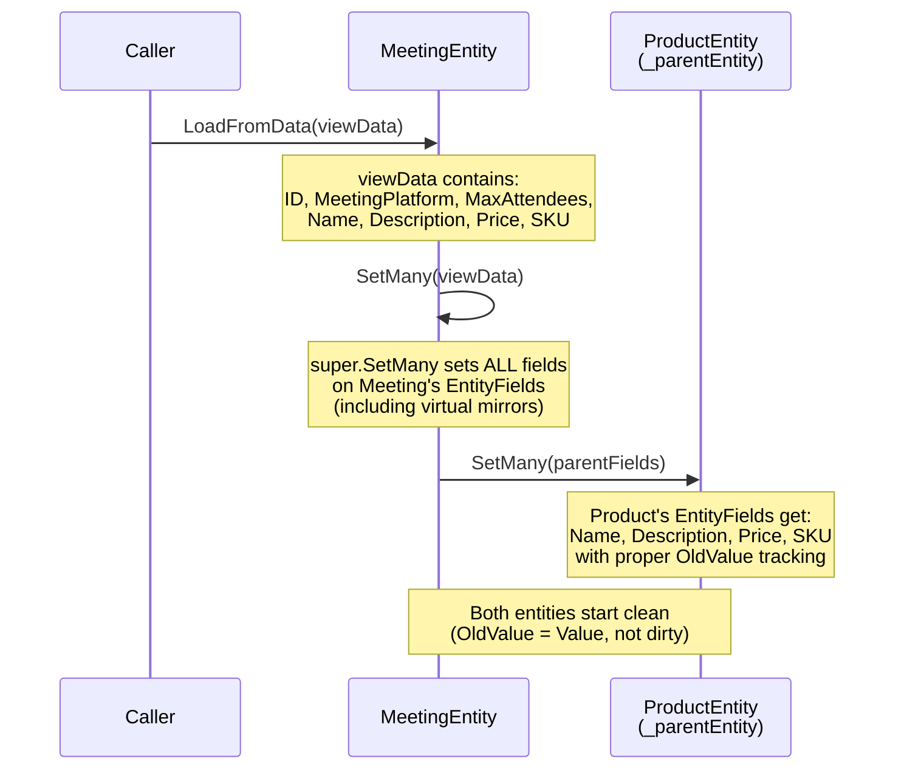

Key: `SetMany` routing (described above) automatically distributes data. The resolver/RunView calls `entity.LoadFromData()` or `entity.SetMany()` exactly as it does today — no code change needed.

### NewRecord Flow

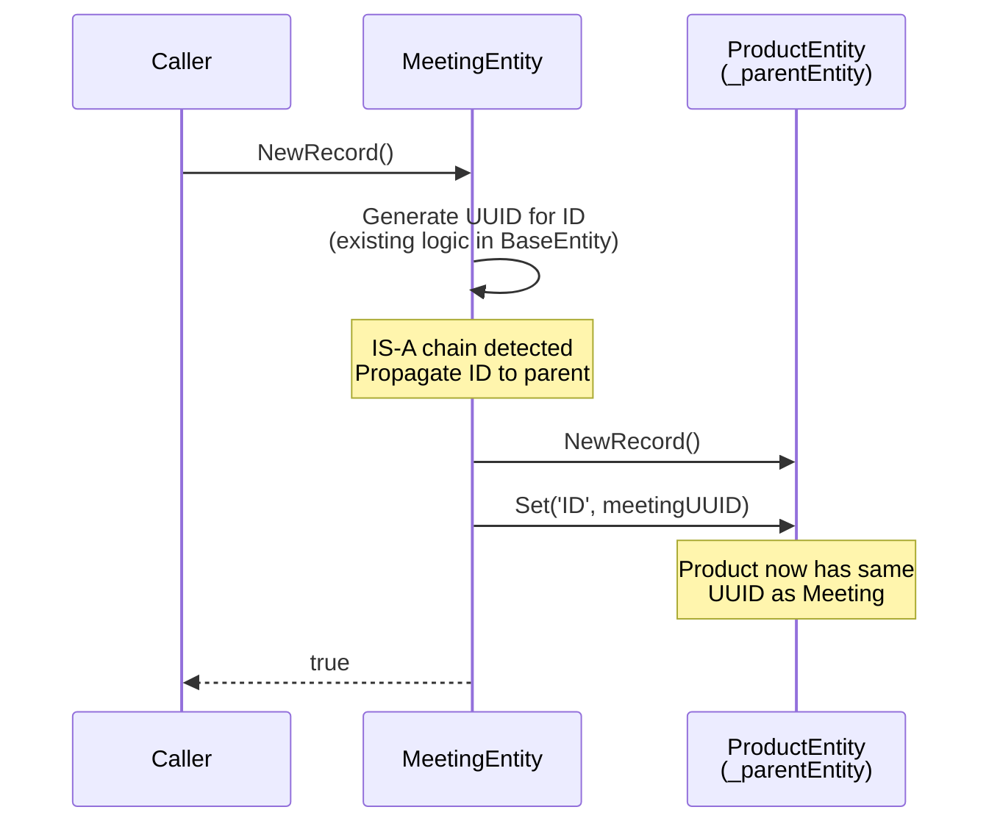

The ID propagation happens in BaseEntity's `NewRecord()` override:

```typescript
public NewRecord(newValues?: FieldValueCollection): boolean {
    const result = super.NewRecord(newValues); // Generates UUID

    // Propagate ID to parent entity
    if (this._parentEntity && result) {
        this._parentEntity.NewRecord();
        // Share the same PK value
        for (const pk of this.EntityInfo.PrimaryKeys) {
            this._parentEntity.Set(pk.Name, this.Get(pk.Name));
        }
    }
    return result;
}
```

---

## Save Orchestration

### Key Principle: Leaf Awareness

Every entity in an IS-A chain is a **potential leaf** (the entity whose Save() was directly called). Meeting is a leaf when saving a Meeting directly. Webinar is a leaf when saving a Webinar. The leaf:
1. Orchestrates the parent chain upward (root first, then down to leaf)
2. On client: sends ONE network call with all chain fields
3. On server: manages the SQL transaction

### EntitySaveOptions Addition

```typescript
export class EntitySaveOptions {
    // ... existing options ...

    /**
     * When true, this entity is being saved as part of an IS-A parent chain
     * initiated by a child entity. Provider behavior:
     * - GraphQLDataProvider: full ORM pipeline runs, skip network call
     * - SQLServerDataProvider: real save using shared ProviderTransaction
     */
    IsParentEntitySave?: boolean = false;
}
```

### Generic Orchestration in BaseEntity._InnerSave()

The save chain logic lives in `BaseEntity._InnerSave()` — NOT in generated subclasses. BaseEntity detects IS-A parents and orchestrates automatically:

```typescript
// In BaseEntity._InnerSave() — new IS-A orchestration block
// Added BEFORE the existing permission check / validation / provider save

const isInitiator = !_options?.IsParentEntitySave;
const hasParentChain = this._parentEntity != null;

if (hasParentChain && isInitiator) {
    // I'm the leaf/initiator — begin provider transaction
    const txn = await this.ProviderToUse.BeginTransaction?.();
    if (txn) {
        this.ProviderTransaction = txn;
        this.PropagateTransactionToParents();
    }
}

if (hasParentChain) {
    // Save parent first (root → branch → ... → immediate parent)
    const parentResult = await this._parentEntity.Save({
        ...(_options ?? {}),
        IsParentEntitySave: true
    });
    if (!parentResult) {
        if (isInitiator && this.ProviderTransaction) {
            await this.ProviderToUse.RollbackTransaction?.(this.ProviderTransaction);
        }
        return false;
    }
}

// ... existing save logic (CheckPermissions, Validate, provider.Save) ...

if (isInitiator && this.ProviderTransaction) {
    await this.ProviderToUse.CommitTransaction?.(this.ProviderTransaction);
}
```

### Client-Side Save Flow

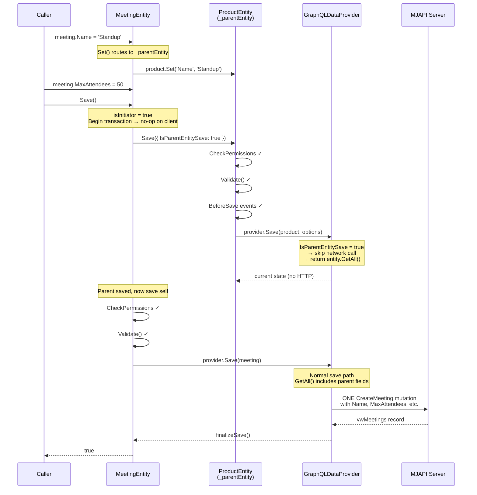

### Server-Side Save Flow

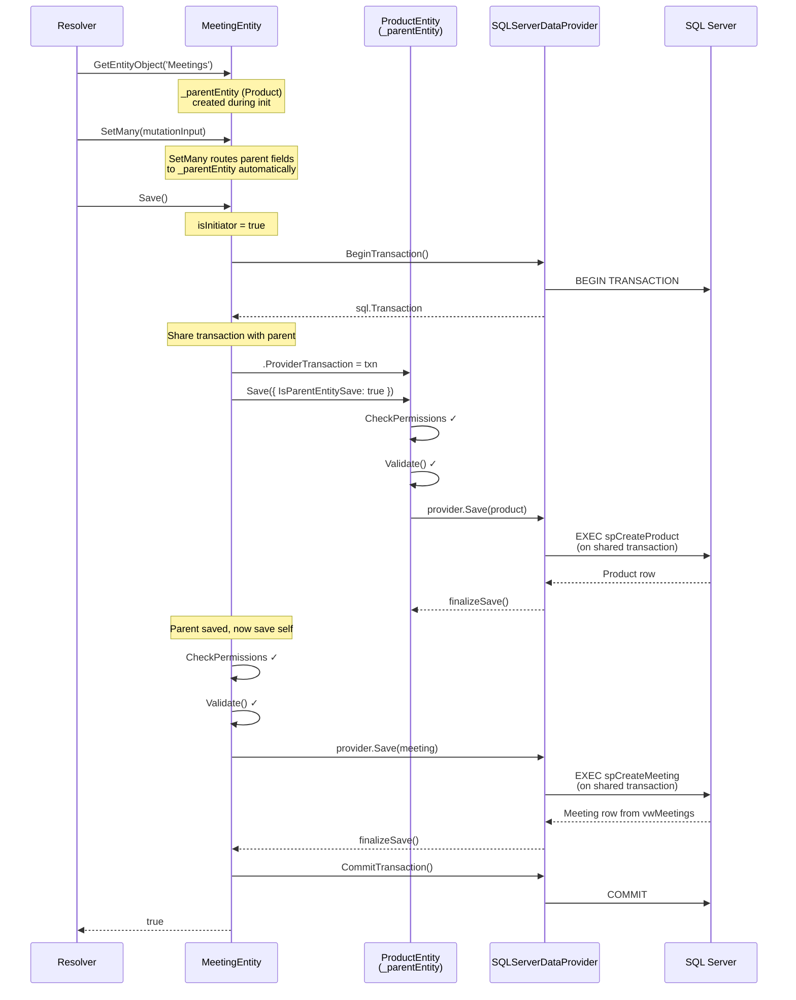

### Direct Branch Entity Save

If someone directly grabs a MeetingEntity (which IS-A Product but also has Webinar as a potential child type) and calls Save():

- Meeting IS the initiator. It orchestrates Product.Save() first, then its own save.
- **It does NOT touch Webinar.** IS-A chains go upward only during save.
- A Meeting record without a corresponding Webinar row is perfectly valid — it's just a Meeting.

---

## Delete Orchestration

Delete goes in **reverse order** compared to save: child first, then parent. This is required because the child's PK is an FK to the parent's PK — deleting the parent first would violate the FK constraint.

### Flow

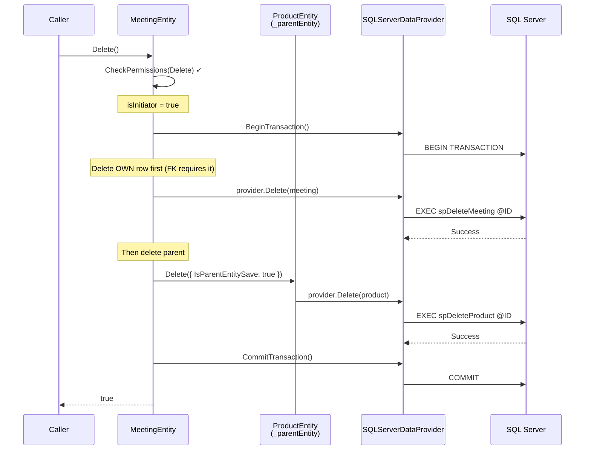

### Parent Delete Protection

Deleting a parent record directly (e.g., deleting a Product that has a Meeting child record) is blocked by FK constraints. The ORM layer adds a pre-delete check for a clear error message:

```typescript
// In BaseEntity._InnerDelete() — before provider.Delete()
if (this.EntityInfo.IsParentType) {
    const childCheck = await this.CheckForChildRecords();
    if (childCheck.hasChildren) {
        throw new Error(
            `Cannot delete ${this.EntityInfo.Name} record '${this.PrimaryKey.Values()}': ` +
            `it is referenced as a ${childCheck.childEntityName} record. ` +
            `Delete the ${childCheck.childEntityName} record first.`
        );
    }
}
```

The child record check uses a single batch query (see [Disjoint Subtype Enforcement](#disjoint-subtype-enforcement)).

---

## Provider Transaction Management

### No New Transaction Abstraction

We do NOT create a TransactionContext class. Instead, we use a lightweight property on BaseEntity and optional methods on IEntityDataProvider:

```typescript
// BaseEntity addition
private _providerTransaction: unknown = null;
get ProviderTransaction(): unknown { return this._providerTransaction; }
set ProviderTransaction(value: unknown) { this._providerTransaction = value; }

protected PropagateTransactionToParents(): void {
    let current = this._parentEntity;
    while (current) {
        current.ProviderTransaction = this._providerTransaction;
        current = current._parentEntity;
    }
}
```

```typescript
// IEntityDataProvider optional additions
interface IEntityDataProvider {
    // ... existing methods ...
    BeginTransaction?(): Promise<unknown>;
    CommitTransaction?(txn: unknown): Promise<void>;
    RollbackTransaction?(txn: unknown): Promise<void>;
}
```

### Provider Implementations

**GraphQLDataProvider**: Does NOT implement transaction methods. `BeginTransaction?.()` returns undefined.

**SQLServerDataProvider**:

```typescript
async BeginTransaction(): Promise<sql.Transaction> {
    const transaction = new sql.Transaction(this._pool);
    await transaction.begin();
    return transaction;
}

async CommitTransaction(txn: unknown): Promise<void> {
    await (txn as sql.Transaction).commit();
}

async RollbackTransaction(txn: unknown): Promise<void> {
    await (txn as sql.Transaction).rollback();
}

// In Save() — use transaction when available
async Save(entity: BaseEntity, user: UserInfo, options: EntitySaveOptions): Promise<{}> {
    const request = entity.ProviderTransaction
        ? new sql.Request(entity.ProviderTransaction as sql.Transaction)
        : new sql.Request(this._pool);
    // ... existing SP execution using `request` ...
}
```

### Composing with TransactionGroup

If an IS-A entity is inside a `TransactionGroup`, the entity's Save() detects this and defers to the group instead of managing its own transaction. The `TransactionGroup` already handles atomic batching. The IS-A chain orchestration (parent-first save order) still applies, but the transaction lifecycle is managed by the group.

```typescript
// In BaseEntity._InnerSave() orchestration
if (this.TransactionGroup) {
    // Already in a transaction group — don't create a new transaction.
    // The group handles atomicity. We just orchestrate the parent chain.
} else if (isInitiator && hasParentChain) {
    // Standalone IS-A save — create provider transaction
    const txn = await this.ProviderToUse.BeginTransaction?.();
    // ...
}
```

---

## Record Changes

### Natural Per-Level Tracking

Each entity's Save() goes through the provider, which calls `GetLogRecordChangeSQL()` for entities with `TrackRecordChanges=true`. With ORM composition, each level records changes to its OWN fields:

| Record Change Entry | Entity | RecordID | ChangesJSON |
|---------------------|--------|----------|-------------|
| 1 | Products | abc-123 | `{"Name": {"old": "Old", "new": "New"}}` |
| 2 | Meetings | abc-123 | `{"MaxAttendees": {"old": 50, "new": 100}}` |

- Same RecordID at every level (shared PK), so querying by ID gives full history
- If only Meeting fields changed, no Record Change entry for Products (no dirty fields)
- For creates, every level gets a Create entry
- **Zero additional code needed** — this comes free from the ORM composition

---

## Disjoint Subtype Enforcement

A parent record can only be ONE child type at a time. Enforced via single batch query during child entity creation:

```sql
-- Generated batch query for Meeting creation (checks sibling child types of Product)
SELECT 'Publications' AS ChildEntity FROM [dbo].[Publication] WHERE [ID] = @ID
UNION ALL
SELECT 'Webinars' AS ChildEntity FROM [dbo].[Webinar] WHERE [ID] = @ID
-- ... one SELECT per sibling child type
```

If any rows returned, throw:

```
Cannot create Meetings record: ID 'abc-123' already exists as Publications.
A Products record can only be one child type at a time.
```

This check runs in `BaseEntity._InnerSave()` during CREATE operations on IS-A child entities. The batch query is constructed from `EntityInfo.ParentEntity.ChildEntities` (excluding self).

---

## Field Name Collision Detection

### Hard Error in CodeGen

When CodeGen creates virtual EntityField records for parent fields on child entities, it checks for name collisions:

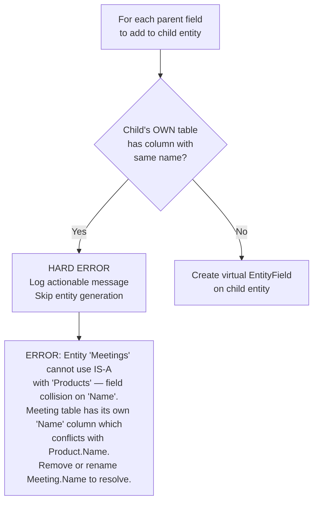

CodeGen continues processing other entities but marks the colliding entity as failed. No views, SPs, or entity classes are generated for it until the collision is resolved.

---

## CodeGen Changes

### 4A: View Generation

**`generateBaseView()`** in `sql_codegen.ts` gains a new `generateParentEntityJoins()` method. When `entity.ParentID` is set, auto-generates INNER JOIN chain upward through all parent entities. All non-PK, non-timestamp fields from each parent are included as columns in the child's view.

```typescript
protected generateParentEntityJoins(entity: EntityInfo): { joins: string, fields: string } {
    const joins: string[] = [];
    const fields: string[] = [];
    let current = entity;
    let depth = 0;

    while (current.ParentEntity) {
        const parent = current.ParentEntity;
        const alias = `p${depth}`;
        const prevAlias = depth === 0 ? /*child alias*/ : `p${depth - 1}`;

        joins.push(
            `INNER JOIN [${parent.SchemaName}].[${parent.BaseTable}] AS ${alias} ON ${prevAlias}.[ID] = ${alias}.[ID]`
        );

        for (const field of parent.Fields) {
            if (!field.IsPrimaryKey && !field.IsVirtual && !field.Name.startsWith('__mj_')) {
                fields.push(`${alias}.[${field.Name}]`);
            }
        }
        current = parent;
        depth++;
    }
    return { joins: joins.join('\n'), fields: fields.join(',\n    ') };
}
```

### 4B: SP Generation

SPs are **single-table only**. When an entity has `ParentID`, the SP parameters include ONLY fields owned by that entity's table (not parent fields). Parent fields are handled by the parent entity's SP through the ORM chain.

The SP's final SELECT still returns from the full view (e.g., `SELECT * FROM vwMeetings`), which includes parent fields via JOINs. Within the same SQL transaction, this correctly sees uncommitted parent INSERTs on the shared connection.

### 4C: GraphQL Schema Generation

For IS-A child entities, CodeGen generates mutation input types that include all parent chain fields:

```graphql
# Generated for Meetings (IS-A Products)
input CreateMeetingInput {
    # Own fields
    MeetingPlatform: String!
    MaxAttendees: Int!
    DurationMinutes: Int!
    # Parent fields (from Products)
    Name: String!
    Description: String
    Price: Float
    SKU: String
}

# Generated for Webinars (IS-A Meetings IS-A Products)
input CreateWebinarInput {
    # Own fields
    StreamingURL: String
    IsRecorded: Boolean!
    WebinarProvider: String
    # Parent fields (from Meetings)
    MeetingPlatform: String!
    MaxAttendees: Int!
    DurationMinutes: Int!
    # Grandparent fields (from Products)
    Name: String!
    Description: String
    Price: Float
    SKU: String
}
```

### 4D: Entity Class Generation

Generated subclasses are minimal. All IS-A logic is generic in BaseEntity. The generated code only needs:

1. **`_parentEntity` initialization** — async, called during entity setup
2. **Typed accessors for ALL fields** (own + parent) — same `Get()/Set()` pattern as existing

```typescript
// Generated MeetingEntity — IS-A additions are minimal
@RegisterClass(BaseEntity, 'Meetings')
export class MeetingEntity extends BaseEntity {
    // --- Own fields (normal generation) ---
    get MeetingPlatform(): string { return this.Get('MeetingPlatform'); }
    set MeetingPlatform(val: string) { this.Set('MeetingPlatform', val); }
    get MaxAttendees(): number { return this.Get('MaxAttendees'); }
    set MaxAttendees(val: number) { this.Set('MaxAttendees', val); }
    get DurationMinutes(): number { return this.Get('DurationMinutes'); }
    set DurationMinutes(val: number) { this.Set('DurationMinutes', val); }

    // --- Parent fields (routed via BaseEntity.Set/Get) ---
    get Name(): string { return this.Get('Name'); }
    set Name(val: string) { this.Set('Name', val); }
    get Description(): string { return this.Get('Description'); }
    set Description(val: string) { this.Set('Description', val); }
    get Price(): number { return this.Get('Price'); }
    set Price(val: number) { this.Set('Price', val); }
    get SKU(): string { return this.Get('SKU'); }
    set SKU(val: string) { this.Set('SKU', val); }
}
```

The `InitializeParentEntity()`, `Set/Get` routing, `Save/Delete` orchestration, `Dirty/Validate` composition, and `NewRecord` ID propagation all live in `BaseEntity` and work automatically.

### 4E: Metadata Sync

New method `manageParentEntityFields()` in `manage-metadata.ts` — after entity fields are synced, create virtual EntityField records for parent fields on child entities:

- `IsVirtual = true` (field is in view, not child's table)
- `AllowUpdateAPI = true` (writable through child — ORM routes to parent)
- Same Type, Length, Precision, Scale, AllowsNull as parent's field
- Run collision detection before creating (see [Field Name Collision Detection](#field-name-collision-detection))

### 4F: Resolver Generation (No Changes Needed)

The resolver calls `entityObject.SetMany(input)` and `entityObject.Save()` — exactly as today. No resolver code changes. The only change is that mutation input types include more fields (parent chain fields), which is handled by 4C.

---

## UI Integration

### Entity Form Display

For child entities, the form displays fields grouped by hierarchy level:

```
┌──────────────────────────────────────────────────────┐
│  Webinar Form                [IS-A: Meeting > Product]│
├──────────────────────────────────────────────────────┤
│  ── Product Fields (grandparent) ─────────────────── │
│  Name:        [Q1 Planning Webinar  ]                │
│  Description: [Quarterly planning...  ]              │
│  Price:       [0.00                 ]                │
│  SKU:         [WEB-Q1-2025          ]                │
│                                                      │
│  ── Meeting Fields (parent) ──────────────────────── │
│  Platform:    [Zoom              ▼]                  │
│  Max Attend:  [500                ]                  │
│  Duration:    [60                 ] min               │
│                                                      │
│  ── Webinar Fields ───────────────────────────────── │
│  Stream URL:  [https://zoom.us/j/... ]               │
│  Is Recorded: [✓]                                    │
│  Provider:    [Zoom Webinars      ▼]                 │
│                                                      │
│  [Save]  [Cancel]                                    │
└──────────────────────────────────────────────────────┘
```

### Entity List Badges

```
Entities
├── Products          [Parent type: "2 child types"]
├── Meetings          [IS-A Product, "1 child type"]
├── Publications      [IS-A Product]
├── Webinars          [IS-A Meeting]
└── Sales Summary     [Virtual: Read-Only View]
```

### Virtual Entity Display

No Create/Edit/Delete buttons. Read-only grid with "Virtual: Read-Only View" badge.

---

## Implementation Phases & Checklist

### Phase 1: Virtual Entity Tightening

- [ ] Add `VirtualEntity` guard in `BaseEntity.CheckPermissions()` (baseEntity.ts)
  - [ ] Block Create, Update, Delete for virtual entities
  - [ ] Throw meaningful error message including entity name
  - [ ] Unit test: verify Save() and Delete() throw on virtual entity
- [ ] Update `spCreateVirtualEntity` to support composite PKs (or document `additionalSchemaInfo` path)
- [ ] Add UI awareness for virtual entities
  - [ ] Surface `VirtualEntity` flag with distinct badge in entity forms
  - [ ] Use `fa-eye` icon for virtual entities in entity lists
  - [ ] Hide Create/Edit/Delete buttons entirely (not just disable)
  - [ ] Show underlying view name prominently

### Phase 1B: Config-Driven Virtual Entity Creation

- [ ] Define `VirtualEntityConfig` interface (SchemaName, ViewName, EntityName, Description, PrimaryKey, ForeignKeys)
- [ ] Extend `extractTablesFromConfig()` to also extract `VirtualEntities` array
- [ ] Add `processVirtualEntityConfig()` method in `manage-metadata.ts`
  - [ ] Check if entity already exists for each view name
  - [ ] Create Entity record if not exists (VirtualEntity=1, BaseTable=BaseView=ViewName, CUD APIs=0)
  - [ ] Idempotent: skip creation if entity exists
- [ ] Integrate into CodeGen pipeline BEFORE `manageVirtualEntities()` so newly created entities are synced
- [ ] Update `database-metadata-config.template.json` with virtual entity examples
- [ ] Create JSON schema validation (`database-metadata-config.schema.json`)

### Phase 1C: LLM-Assisted Virtual Entity Field Decoration

- [ ] Create prompt template: `metadata/prompts/templates/codegen/virtual-entity-field-decoration.template.md`
- [ ] Create prompt metadata file: `metadata/prompts/.codegen-virtual-entity-field-decoration.json`
- [ ] Define `VirtualEntityDecorationResult` type
- [ ] Add `decorateVirtualEntityFields()` method to `AdvancedGeneration` class
  - [ ] Accept entity info, view definition (via `OBJECT_DEFINITION()`), fields, available entities
  - [ ] Execute prompt via `AIPromptRunner`
  - [ ] Return structured result or null (graceful fallback)
- [ ] Add `decorateVirtualEntityWithLLM()` integration in `manage-metadata.ts`
  - [ ] Call after field sync from sys.columns, before applySoftPKFKConfig()
  - [ ] Apply PK identifications (update `IsPrimaryKey` where `IsSoftPrimaryKey=0`)
  - [ ] Apply FK identifications (set `RelatedEntityID`, `RelatedEntityFieldName`)
  - [ ] Apply source field mappings (copy Description, ExtendedType from source)
  - [ ] Apply computed field descriptions
  - [ ] All updates via `LogSQLAndExecute()` for traceability
- [ ] Idempotency: skip LLM call if all non-soft fields already have PK/FK info
- [ ] Configure AI prompt model in `MJ: AI Prompt Models`

### Phase 2: IS-A Core Infrastructure (BaseEntity & EntityInfo)

#### 2A: EntityInfo Computed Properties

- [ ] Implement `ParentEntity` getter (find entity by ParentID)
- [ ] Implement `ChildEntities` getter (filter entities by ParentID)
- [ ] Implement `ParentChain` getter (walk up ParentID chain)
- [ ] Implement `IsChildType` getter (`ParentID != null`)
- [ ] Implement `IsParentType` getter (`ChildEntities.length > 0`)
- [ ] Implement `AllParentFields` getter (all fields from parent chain, excluding PKs/timestamps)
- [ ] Implement `ParentEntityFieldNames` getter (cached `Set<string>` for routing)
- [ ] Add caching for computed properties (ParentChain, ChildEntities, ParentEntityFieldNames)
- [ ] Unit tests for all computed properties with 1, 2, 3-level hierarchies

#### 2B: BaseEntity `_parentEntity` Infrastructure

- [ ] Add `_parentEntity: BaseEntity | null` private property
- [ ] Add `_parentEntityFieldNames: Set<string> | null` private property
- [ ] Implement `InitializeParentEntity()` async method
  - [ ] Check `EntityInfo.IsChildType`
  - [ ] Create parent entity via `Metadata.GetEntityObject()` with contextUser
  - [ ] Set `_parentEntityFieldNames` from `EntityInfo.ParentEntityFieldNames`
  - [ ] Handle N-level recursion (parent creates its own parent)
- [ ] Hook `InitializeParentEntity()` into entity lifecycle (after EntityInfo available, before Load/NewRecord)
- [ ] Unit test: verify _parentEntity chain is created correctly for 3-level hierarchy

#### 2C: Set/Get/SetMany/GetAll Routing

- [ ] Override `Set()` in BaseEntity
  - [ ] Route parent fields to `_parentEntity.Set()` (recursive)
  - [ ] Mirror parent field value on self via `super.Set()` for UI
  - [ ] Pass through to `super.Set()` for own fields
- [ ] Override `Get()` in BaseEntity
  - [ ] Return `_parentEntity.Get()` for parent fields (authoritative)
  - [ ] Return `super.Get()` for own fields
- [ ] Override `SetMany()` in BaseEntity
  - [ ] Call `super.SetMany()` with all data (mirrors for UI)
  - [ ] Extract parent fields, call `_parentEntity.SetMany()` (authoritative)
- [ ] Override `GetAll()` in BaseEntity
  - [ ] Merge `_parentEntity.GetAll()` with `super.GetAll()`
  - [ ] Own fields override parent fields (for shared PK 'ID')
- [ ] Unit tests:
  - [ ] Set parent field via Set() → Get() returns from parent
  - [ ] SetMany with mixed fields → parent and own fields correctly split
  - [ ] GetAll() includes all chain fields

#### 2D: Dirty & Validate Composition

- [ ] Override `Dirty` getter
  - [ ] Check own fields (excluding parent field mirrors) for dirty state
  - [ ] Include `_parentEntity?.Dirty`
- [ ] Override `Validate()`
  - [ ] Run `_parentEntity.Validate()` if parent exists
  - [ ] Run `super.Validate()` for own fields
  - [ ] Merge validation results
- [ ] Implement `mergeValidationResults()` utility
- [ ] Unit tests:
  - [ ] Modify parent field → child shows Dirty
  - [ ] Modify only child field → parent not Dirty
  - [ ] Validate with invalid parent field → merged error includes parent error

#### 2E: NewRecord ID Propagation

- [ ] Override `NewRecord()` in BaseEntity
  - [ ] Call `super.NewRecord()` (generates UUID)
  - [ ] If `_parentEntity` exists: call `_parentEntity.NewRecord()`
  - [ ] Propagate PK value: `_parentEntity.Set(pkName, this.Get(pkName))`
- [ ] Unit test: verify child and parent share same UUID after NewRecord()

#### 2F: EntitySaveOptions & Save Orchestration

- [ ] Add `IsParentEntitySave?: boolean` to `EntitySaveOptions`
- [ ] Add `ProviderTransaction: unknown` property to BaseEntity
- [ ] Implement `PropagateTransactionToParents()` helper
- [ ] Add IS-A orchestration block in `_InnerSave()`
  - [ ] Detect initiator (`!options?.IsParentEntitySave`)
  - [ ] Begin transaction if initiator with parent chain
  - [ ] Propagate transaction to parent chain
  - [ ] Save parent with `IsParentEntitySave: true` before own save
  - [ ] Rollback on parent failure
  - [ ] Commit after own save succeeds
  - [ ] Handle composition with TransactionGroup (defer to group if present)
- [ ] Unit tests:
  - [ ] IS-A save orchestrates parent first on server
  - [ ] IS-A save within TransactionGroup defers transaction to group
  - [ ] Parent save failure rolls back entire chain

#### 2G: Delete Orchestration

- [ ] Add IS-A orchestration block in `_InnerDelete()`
  - [ ] Delete OWN row first (FK constraint requires it)
  - [ ] Then call `_parentEntity.Delete({ IsParentEntitySave: true })`
  - [ ] Transaction management same pattern as save
- [ ] Add parent delete protection
  - [ ] Before deleting an `IsParentType` entity, check for child records
  - [ ] Use batch query (UNION ALL across child entity tables)
  - [ ] Throw clear error message with child entity name
- [ ] Unit tests:
  - [ ] Delete child → parent also deleted (within transaction)
  - [ ] Delete parent directly → error if child records exist

#### 2H: Disjoint Subtype Enforcement

- [ ] Add disjoint check in `_InnerSave()` for CREATE operations on IS-A children
  - [ ] Build batch query from `EntityInfo.ParentEntity.ChildEntities` (excluding self)
  - [ ] Execute as single SQL batch
  - [ ] Throw clear error if ID exists in any sibling child table
- [ ] Unit test: attempt to create Meeting when Publication already exists with same ID → error

### Phase 3: Provider Implementation

#### 3A: IEntityDataProvider Transaction Methods

- [ ] Add optional `BeginTransaction?(): Promise<unknown>` to IEntityDataProvider
- [ ] Add optional `CommitTransaction?(txn: unknown): Promise<void>` to IEntityDataProvider
- [ ] Add optional `RollbackTransaction?(txn: unknown): Promise<void>` to IEntityDataProvider

#### 3B: SQLServerDataProvider Transaction Implementation

- [ ] Implement `BeginTransaction()` — create `sql.Transaction` from pool
- [ ] Implement `CommitTransaction()` — commit transaction
- [ ] Implement `RollbackTransaction()` — rollback transaction
- [ ] Modify `Save()` to use `entity.ProviderTransaction` when available
  - [ ] If `ProviderTransaction` is set, create `sql.Request` from transaction
  - [ ] Otherwise, use pool as today
- [ ] Modify `Delete()` same pattern
- [ ] Unit tests:
  - [ ] Verify multiple SPs execute on same transaction
  - [ ] Verify rollback on failure reverts all SPs

#### 3C: GraphQLDataProvider IS-A Handling

- [ ] In `Save()`: when `options.IsParentEntitySave === true`, skip network call
  - [ ] Full ORM pipeline already ran (in BaseEntity._InnerSave)
  - [ ] Return `entity.GetAll()` as save result (no HTTP)
- [ ] Transaction methods: NOT implemented (optional interface methods left undefined)
- [ ] Unit test: verify parent entity save doesn't trigger HTTP call

### Phase 4: CodeGen

#### 4A: View Generation with Parent JOINs

- [ ] Implement `generateParentEntityJoins()` in `sql_codegen.ts`
  - [ ] Walk `ParentID` chain upward
  - [ ] Generate INNER JOIN for each level (PK-to-PK join)
  - [ ] Include all non-PK, non-timestamp, non-virtual fields from each parent
  - [ ] Handle column alias conflicts
- [ ] Integrate into `generateBaseView()` — call when `entity.ParentID` is set
- [ ] Unit test: verify generated SQL for 1, 2, 3-level hierarchies

#### 4B: SP Generation (Single-Table)

- [ ] When entity has `ParentID`, SP parameters include ONLY own-table fields
  - [ ] Exclude parent fields from spCreate/spUpdate parameter lists
  - [ ] Keep ID parameter (shared PK)
  - [ ] SP SELECT still returns from full view (includes parent fields via JOIN)
- [ ] Unit test: verify generated SP for Meeting only has Meeting table columns

#### 4C: GraphQL Input Type Generation

- [ ] When entity has `ParentID`, include parent chain fields in input types
  - [ ] Walk ParentChain, collect all fields from each parent
  - [ ] Exclude PKs (shared, auto-set), timestamps
  - [ ] Apply proper nullability from parent field metadata
- [ ] Generate for Create and Update input types
- [ ] Unit test: verify CreateMeetingInput includes Product fields

#### 4D: Entity Class Generation

- [ ] When entity has `ParentID`, generate typed accessors for parent fields
  - [ ] Same `Get()/Set()` pattern as own fields (routing is handled by BaseEntity)
  - [ ] Include in Zod schema with proper types
  - [ ] Mark parent field accessors with comment indicating parent source
- [ ] Unit test: verify generated MeetingEntity has Name, Price, SKU accessors

#### 4E: Metadata Sync — Parent Entity Fields

- [ ] Implement `manageParentEntityFields()` in `manage-metadata.ts`
  - [ ] For each entity with `ParentID`: iterate all parent fields
  - [ ] Create virtual EntityField records (`IsVirtual=true`, `AllowUpdateAPI=true`)
  - [ ] Match Type, Length, Precision, Scale, AllowsNull from parent field
  - [ ] Skip PKs and timestamp fields
  - [ ] Idempotent: update existing virtual fields, don't duplicate
- [ ] Implement field collision detection
  - [ ] Check if child's own table has column with same name as parent field
  - [ ] HARD ERROR: log actionable message, skip entity generation
- [ ] Integrate into CodeGen pipeline after regular field sync
- [ ] Unit test: verify virtual fields created and collision detected

### Phase 5: UI Integration

- [ ] Entity form: unified display with section headers per hierarchy level
  - [ ] Use `EntityInfo.ParentChain` to determine grouping
  - [ ] All fields editable (ORM handles routing)
  - [ ] Show IS-A breadcrumb: `[IS-A: Meeting > Product]`
- [ ] Entity list: parent/child type badges
  - [ ] `IsParentType` → show "N child types" badge
  - [ ] `IsChildType` → show "IS-A ParentName" badge
- [ ] Virtual entity display
  - [ ] Read-only badge, hidden CUD buttons
  - [ ] Distinct icon (`fa-eye`)
- [ ] Entity admin: UI for setting `ParentID` to establish IS-A relationships
  - [ ] Dropdown of valid parent entities (filter out circular references)
  - [ ] Warning about shared PK requirement

### Phase 6: Advanced Delete & Enforcement

- [ ] Integration with existing `CascadeDeletes` flag
  - [ ] When `CascadeDeletes=true` on parent entity, auto-delete child records before parent
  - [ ] When `CascadeDeletes=false`, require explicit child deletion first
- [ ] Polymorphic delete queries
  - [ ] "Delete this Product and whatever child type it is" — detect child type, load leaf entity, delete through chain

---

## Resolved Decisions

| Decision | Resolution |
|----------|-----------|
| **Column for IS-A** | Reuse existing `Entity.ParentID` |
| **Terminology** | "Parent entity / child entity" in code; "IS-A" in documentation |
| **PK sharing** | Child PK = Parent PK (same UUID) |
| **Single inheritance** | One `ParentID` per entity |
| **Disjoint subtypes** | Enforced via single batch query |
| **_parentEntity lifetime** | Persistent — lives for entity object's lifetime |
| **Set/Get routing** | Generic in BaseEntity using `EntityInfo.ParentEntityFieldNames` |
| **SetMany behavior** | Mirrors on child + routes to _parentEntity |
| **Save orchestration** | Generic in BaseEntity._InnerSave(); NOT in generated subclasses |
| **Delete order** | Child first → parent (FK constraint) |
| **Client network** | Leaf sends ONE mutation; parent entities validate but skip network |
| **Server transactions** | SQLServerDataProvider-level; `ProviderTransaction` property on BaseEntity |
| **TransactionContext class** | NOT created — unnecessary abstraction |
| **TransactionGroup composition** | IS-A defers to TransactionGroup if entity is in one |
| **Resolver changes** | None — resolver calls SetMany/Save as today |
| **Field collisions** | Hard error in CodeGen; skip entity until resolved |
| **CodeGen entity class** | Minimal — only _parentEntity init + typed accessors |
| **ParentID semantics** | No conflict with other ParentID fields; CodeGen is structural not name-based |
| **Virtual entity creation** | Config-driven via `VirtualEntities` section in additionalSchemaInfo |
| **LLM field decoration** | Precedence: sys.columns → LLM → config overrides |

---

## Future Work

1. **Overlapping subtypes**: Allow parent record to be multiple child types. Requires removing disjoint enforcement. Configurable per parent entity.
2. **Polymorphic load / leaf resolution**: `GetEntityObject('Products', user, { resolveToLeaf: true })` — given a Product ID, detect actual leaf type and return appropriate entity. Requires querying child tables. Only deterministic with disjoint subtypes.
3. **Database management agent**: Automate IS-A relationship creation, virtual entity setup, schema analysis, migration generation.
4. **Multiple inheritance**: Would require junction table (`EntityParents`) instead of singular `ParentID`. Significantly more complex.
5. **Polymorphic queries**: "Show me all Products regardless of child type" with type-discriminator column.
6. **Entity.ParentID description update**: Change from "Reserved for future use" to document IS-A semantics.
7. **EntityEntity class JSDoc update**: Update comments for ParentID, ParentEntity, ParentBaseTable, ParentBaseView.
8. **JSON schema for config file**: Create `database-metadata-config.schema.json` to validate extended config format.
